# www.artisan.co 产品深度体验报告

## 报告信息

| 项 | 内容 |
|---|---|
| 产品名称 | www.artisan.co |
| 产品 URL | https://www.artisan.co/ |
| 体验时间 | 2026-05-20T20:38:16.435274 |

---

## 目录

- [1. 核心结论](#1-核心结论)
  - [1.1 一句话判定](#11-一句话判定)
  - [1.2 主要风险](#12-主要风险)
  - [1.3 主要亮点](#13-主要亮点)
  - [1.4 综合评分](#14-综合评分)
- [2. 产品概览](#2-产品概览)
  - [2.1 基础信息](#21-基础信息)
  - [2.2 测点速览](#22-测点速览)
  - [2.3 产品 / 公司背景信息](#23-产品--公司背景信息)
  - [2.4 产品战略抽象](#24-产品战略抽象)
  - [2.5 公司基本信息](#25-公司基本信息)
- [3. 体验流程记录](#3-体验流程记录)
  - [3.1 官网叙事综合](#31-官网叙事综合)
  - [3.2 测点流程详情](#32-测点流程详情)
- [4. 第三方社区反馈](#4-第三方社区反馈)
- [5. 总结](#5-总结)
  - [5.1 一句话评价](#51-一句话评价)
  - [5.2 最大优点](#52-最大优点)
  - [5.3 最大风险](#53-最大风险)
  - [5.4 用户增长漏斗推断](#54-用户增长漏斗推断)

---

## 1. 核心结论

### 1.1 一句话判定

目标产品 **https://www.artisan.co/** 在本次深度体验中：存在显著的功能信息缺口。详见 §3 体验流程记录。

### 1.2 主要风险

1. **[C1]** P1 关键集成信息缺失（CRM / 邮箱 / 外联通道）**: 产品定位是 BDR，必然需要接入 CRM（Salesforce/HubSpot?）、邮箱发件域、电话系统、LinkedIn 等渠道，但首屏与可见区域仅提到"import from your CRM"一句话，未列出支持的 CRM 列表、邮箱 deliverability 如何保障、是否走用户域名、是否支持多渠道（邮件+电话+LinkedIn）。这是 B2B 销售工具采购的决策性信息。
2. **[C2]** P1 "Autonomous campaigns and replies" 自治边界未定义**: 页面把 "自主回复"、"全自动驾驶 Ava (Soon)" 作为核心卖点，但完全没说明 AI 在什么情境下会自行发送邮件、什么时候需要人审批、能否设置审批门槛 — 对销售场景这是品牌风险与信任度的关键决策点，缺这一项无法判断敢不敢上生产。
3. **[C2]** P1 "Positive replies / mo" 范围含义不明**: Intern 1–12、Employee 4–30、Enterprise 50+ 这个数字到底是"产品承诺的产出 SLA"、"信用额度能支持的上限"、还是"历史客户均值"？这是用户买单的核心 ROI 指标，但既没有定义口径、也没有说明超量后会发生什么（停用？加购？降级？）。

### 1.3 主要亮点

1. **[C1]** ✅ **核心价值主张清晰**: 首屏"The autonomous AI BDR — finds leads, sends personalized outreach, handles objections and books meetings"用一句话说明了产品=自主 AI 销售开发代表，覆盖了 BDR 全链路四个动作（找客户/外联/异议处理/约会议），用户能立刻理解"这个产品替代的是人类 BDR 岗位"。
2. **[C1]** ✅ **工作流第一步描述具备可信度**: Step 1 给出了具体数字与机制——250M+ 已验证 B2B 联系人、22+ 数据源做 enrichment、用 funding rounds / leadership hires 等 intent signals 做优先级排序，这些细节让"AI 找线索"从抽象口号变成可验证的能力主张。
3. **[C2]** ✅ **Credit 计费模型说明清晰**: 用具体单位拆解了 Ava 的工作消耗（邮箱补全 2 credits、电话补全 10 credits、端到端触达约 22 credits/人、网站访客识别 4 credits），用户可以反推每月套餐能覆盖多少触达量，把抽象的 "AI 工作" 量化成可计算的资源单位。

### 1.4 综合评分

| 维度 | 评分 | 1-2 句话说明（引用具体 [测点ID]） |
|---|---:|---|
| 产品方向清晰度 | 4.5 / 5 | [C1][C3][M1] 首屏一句话"autonomous AI BDR — finds leads, sends personalized outreach, handles objections and books meetings"配合四步工作流，让"AI 替代人类 BDR"的定位一目了然；[B3] 进一步用"AI-first workspace + digital employees"强化定位边界。 |
| Narrative 表达力 | 4.0 / 5 | [B3] 用否定式定位（"isn't just another automation tool"）+ 拟人化 Ava + $32M 融资与豪华团队背书构成有力叙事；[B4] "digital colleague / autopilot" 拟人化叙事完整，但 [C1] 中部能力 tag 罗列稍显散乱，削弱了叙事节奏。 |
| 信息架构（IA） | 2.5 / 5 | [C4] 登录入口缺失、[M3] use case/workflow 链接缺失、[C7] Help/Documentation 实际只返回首页营销文案，多个关键二级入口要么找不到要么指向首页，子页组织明显断裂；[C8] 404 保留全局导航算是兜底加分。 |
| 功能广度与深度 | 3.0 / 5 | [C1][C2] 覆盖找线索/外联/异议/约会议四大动作且 credit 模型量化清晰，[M2] 对 reply 分类与升级机制讲得到位；但 [M6] 完全不提 Telegram/WhatsApp/Slack 等 IM 渠道、[C1][M5] CRM/日历/邮箱集成清单缺失、[C1] 能力 tag（Dialer/Website visitors 等）无展开。 |
| AI / 核心能力可信度 | 3.5 / 5 | [C1][C3][M5] 用 250M+ 联系人、22+ 数据源、funding/leadership 等具体 intent signals 把"找线索"量化得很可信，[M2] qualify + escalate 机制让 AI 边界清晰；但 [C1][C2][M1] "handles objections"/"autonomous replies" 的模型、审批门槛、误判兜底全部未展开，对"敢不敢上生产"的核心顾虑回避。 |
| 商业化清晰度 | 3.5 / 5 | [C2] credit 计费单位拆解到位（邮箱补全 2 / 电话补全 10 / 端到端 22 credits）+ Free/Intern/Employee/Enterprise 分层清晰；但 "Positive replies/mo" 区间含义未定义、"Identify website visitor" 在 credit 表与套餐 feature 表之间不一致，超量后行为也未交代。 |
| **综合平均** | **3.5 / 5** | **定位与叙事清晰、credit 计费量化扎实，但 IA 断裂（登录/文档/use case 缺失）、关键集成清单与 autonomous 边界长期回避，是阻碍 B2B 采购决策的最大短板。** |

---

## 2. 产品概览

### 2.1 基础信息

- **URL**: https://www.artisan.co/
- **首屏标题 / Slogan**: This website uses cookies

We use cookies for a number of purposes, including im
- **评测模板分类**: multi-agent

### 2.2 测点速览

本次共体验 44 个测点。

> 🔐 **登录态覆盖：已完成**。检测到登录入口并捕获了 dashboard session，追加 **13 个 L\* 测点**（详见 §4.2 🔐 登录后 Workspace 模块）。

### 2.3 产品 / 公司背景信息

通过 help / docs / resources 内容枢纽**递归挖掘**得到 **4** 个产品/公司的官方介绍页面：

#### B1: 背景 D1: Getting Started 11 articles

**URL:** https://help.artisan.co/collections/1258822112-general

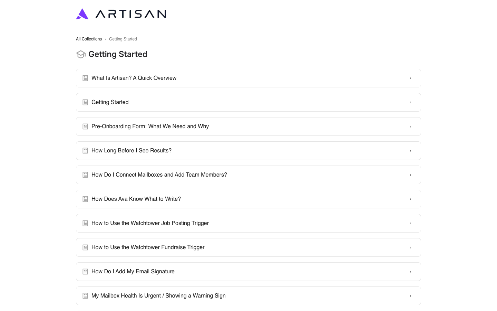

**结构化背景信息（LLM 提取）：**

- ✅ **产品定义（仅标题暗示）**：页面顶部首篇即为 "What Is Artisan? A Quick Overview"，明确该产品名为 **Artisan**，并以 "Getting Started" 入门集合形式呈现。**P3**：但页面本身只是文章索引，未展示该 Overview 的正文，因此"Artisan 究竟是什么"这一最关键定义在本页**没有给出原文**。
- ✅ **核心功能能力（从文章标题反推）**：
- AI 代写邮件** — "How Does Ava Know What to Write?" 暗示有一个名为 **Ava** 的 AI 角色负责撰写外联内容；
- Mailbox 连接与团队管理** — "How Do I Connect Mailboxes and Add Team Members?"；
- Watchtower 触发器**（信号驱动外联）— 包含 **Job Posting Trigger**（招聘信号）与 **Fundraise Trigger**（融资信号）两类；
- 邮箱健康度监控** — "Mailbox Health Is Urgent / Warning Sign"、"Mailboxes Still Aren't at Full Capacity"；

#### B2: 背景 D1: Pre-Onboarding Form: What We Need and Why ›

**URL:** https://help.artisan.co/articles/6243068911-pre-onboarding-form-what-we-need-and-why

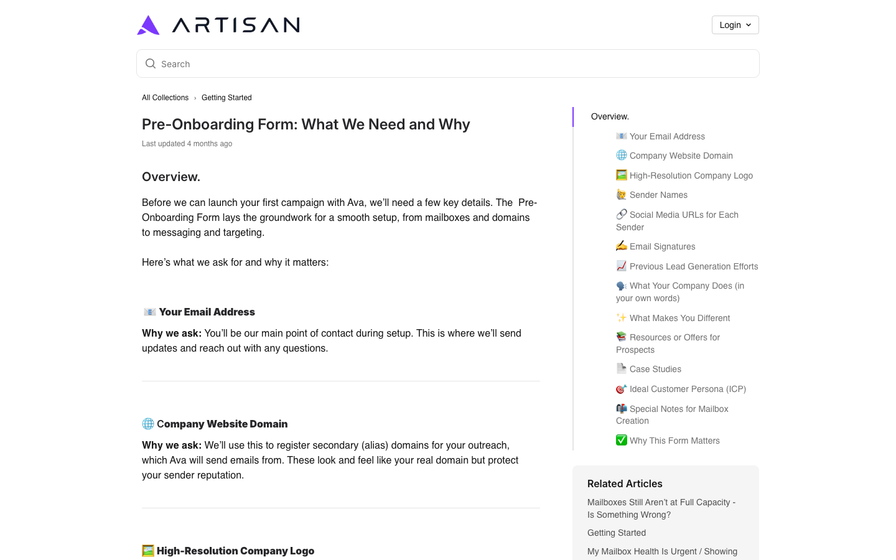

**结构化背景信息（LLM 提取）：**

- ✅ **产品定义**：页面将产品定义为由 AI 销售代表 "Ava" 驱动的外联自动化服务，原文提及 "Before we can launch your first campaign with Ava" 以及 "Ava will send emails from"，定位为代客户执行邮件外联营销活动的 AI 销售员。
- ✅ **核心功能能力**：(1) AI 邮件外联代理 Ava 自动发送营销邮件；(2) 二级 / 别名域名（lookalike domains，如 tryyourcompany.com）注册与配置以保护发件人声誉；(3) 邮箱（mailbox）批量购买与配置；(4) 基于 ICP（Ideal Customer Persona）的潜在客户定位（职位 / 地区 / 行业 / 公司规模）；(5) 邮件内容个性化（含签名、Logo、社交头像、案例引用、Resources / Offers Hook）。
- ✅ **目标用户与场景**：面向 B2B 销售 / 市场团队（"typically your sales or marketing team"），典型场景为冷启动外联型 lead generation——客户提供 ICP、差异化卖点和案例，由 Ava 代表"高级别 sender"（"Higher seniority = higher reply rates"）批量发送个性化冷邮件。
- ✅ **差异化主张 / 独家叙事**：核心叙事是 "让 Ava 听起来像你"——通过收集客户原话描述（"in your own words"）、差异点、案例、资源等让 AI 输出贴近真人销售；同时强调使用 lookalike domain 而非主域名，以"保护发件人声誉"（"protect your sender reputation"）作为安全卖点。
- ✅ **关键术语 / 概念**：
- Ava** — 产品的 AI 销售代表 / 数字员工，代客户身份发送邮件；

#### B3: 背景 D2: What Is Artisan? A Quick Overview ›

**URL:** https://help.artisan.co/articles/5834370686-what-is-artisan-a-quick-overview

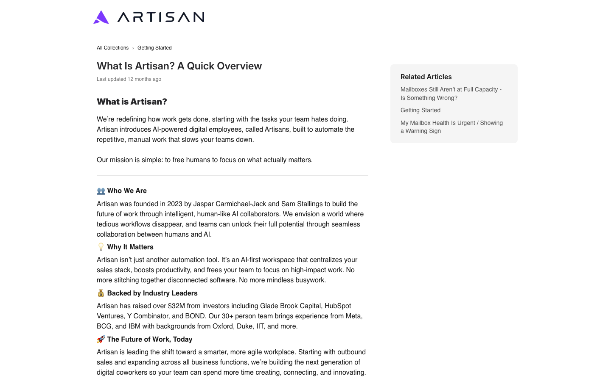

**结构化背景信息（LLM 提取）：**

- ✅ **产品一句话定义**：页面将 Artisan 定义为 "AI-powered digital employees, called Artisans"，并进一步定位为 "an AI-first workspace that centralizes your sales stack"——既是"数字员工"也是"以 AI 为中心的工作空间"，主张"redefining how work gets done, starting with the tasks your team hates doing"。
- ✅ **核心功能能力**：页面提及的能力非常聚焦——(1) AI 驱动的数字员工 Artisans；(2) 自动化重复性、手动性工作；(3) 集中化销售技术栈（centralize sales stack）；(4) 起步场景为 outbound sales（外呼销售）；(5) 规划中向"所有业务职能"扩展的 digital coworkers。
- ✅ **目标用户与场景**：当前明确指向**销售团队的 outbound sales 场景**，定位为替代"拼接式销售软件栈 + 无意义繁琐工作"的方案；远期愿景覆盖"all business functions"。
- ✅ **差异化主张 / 独家叙事**：页面刻意做了一次否定式定位——"Artisan isn't just another automation tool"，把自己与"automation tool / RPA"拉开距离，强调三点叙事：① 类人 AI 协作者（human-like AI collaborators）；② AI-first workspace 而非工具拼装；③ 资本与团队背书（融资 $32M+，投资人含 HubSpot Ventures、Y Combinator、BOND、Glade Brook，团队来自 Meta/BCG/IBM 及 Oxford/Duke/IIT）。
- ✅ **关键术语 / 概念**：
- Artisans** = AI 驱动的数字员工（digital employees），是产品的核心人格化单位；

#### B4: 背景 D2: Getting Started ›

**URL:** https://help.artisan.co/articles/3857275619-getting-started

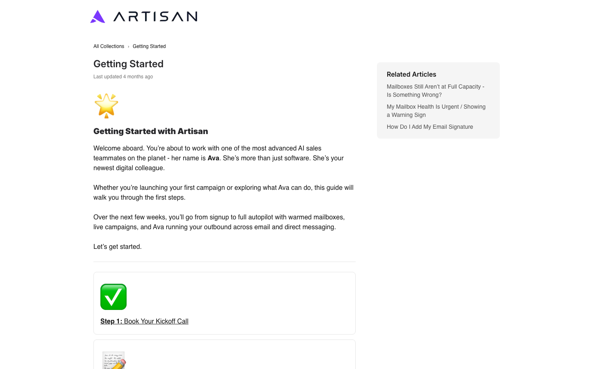

**结构化背景信息（LLM 提取）：**

- ✅ **产品定义**：页面将 Artisan 定义为"one of the most advanced AI sales teammates on the planet"，其核心产品为 **Ava**——被定位为"digital colleague"（数字同事），而非传统软件工具，强调拟人化的"AI sales teammate"叙事。
- ✅ **核心功能能力**：页面提及的产品能力包括：(1) 邮件外联（email outbound）；(2) 直接消息外联（direct messaging）；(3) 邮箱预热（mailbox warm-up）；(4) 多渠道营销活动（multi-channel campaigns）；(5) 全自动外联运营（full autopilot outbound）。
- ✅ **目标用户与场景**：面向需要做**外呼销售/outbound sales**的团队，典型场景是从 signup 到完全托管 outbound 流程——涵盖首次启动 campaign、邮箱预热（约 2-3 周）、多渠道 campaign 启动、以及上线后优化。
- ✅ **差异化主张**：核心叙事是"AI 销售员工"而非"销售工具"——把 Ava 拟人化为"newest digital colleague"，强调"全自动驾驶"（autopilot）的托管式体验，而非用户自己操作的 SaaS 工具。配套交付流程包含人工 Kickoff Call + Pre-Onboarding Form，凸显"高接触 onboarding + AI 代运营"的混合模式。
- ✅ **关键术语**：(1) **Ava** = Artisan 的 AI 销售员工产品名称；(2) **AI sales teammate / digital colleague** = 把 AI 产品定位为团队成员的核心叙事；(3) **Mailbox warm-up** = 启动 outbound 前的邮箱预热环节；(4) **Direct Message-Only Campaign** = 可选的纯私信渠道 campaign 类型；(5) **Autopilot** = Ava 全自动运行 outbound 的目标状态。
- P3 理解缺口**：(1) 页面未说明 Ava 具体使用什么 AI 能力（线索挖掘？文案生成？回复处理？）；(2) "direct messaging" 具体指 LinkedIn、Twitter 还是其他渠道未明确；(3) 没有提及定价、坐席模式或 ROI 指标；(4) 对"sales teammate"与传统 sales engagement 工具（Outreach/Apollo 等）的本质差异未做对比说明；(5) 未交代 Ava 背后是否有人工介入或纯 AI 自治。


### 2.4 产品战略抽象

### 1. AI Employee 化 (AI Employee-ification)
**核心叙事**: 产品不卖软件，卖一个名叫 Ava 的"数字销售员工"，重新定义采购单位从 SaaS license 变成 headcount。
**支撑证据**:
- [B3] 产品自我定义为 "AI-powered digital employees, called Artisans"，并刻意与 automation tool / RPA 划清界限，强调"human-like AI collaborators"。
- [B4] Ava 被称为 "digital colleague" 和 "AI sales teammate"，配套交付流程含人工 Kickoff Call + Pre-Onboarding Form，是托管式而非工具式体验。
- [C8] 顶部 CTA 直接用 "Hire Ava on trial for free"——动词是 "Hire"（雇佣）而非 "Try / Subscribe"，把 AI 包装成可被招聘的实体。

**对用户/产品的含义**: 用户买的不是工具的使用权，而是替代/扩充一个 BDR 岗位编制，决策权从 IT/Ops 转移到 Sales Head 的招聘预算。

---

### 2. Autonomous 化 (Autonomization)
**核心叙事**: 产品的核心卖点是"自主"——Ava 自己找客户、自己回复、自己处理异议、自己约会议，人类只设规则不做操作。
**支撑证据**:
- [C1] 首屏定位为 "The autonomous AI BDR — finds leads, sends personalized outreach, handles objections and books meetings"，"autonomous" 是定位关键词。
- [C2] Pricing 页把 "Autonomous campaigns and replies" 与未来的 "全自动驾驶 Ava (Soon)" 作为核心卖点。
- [M2] Ava 通过实时情感分析自动选择回复路径（发链接/处理异议/知识库回答/礼貌结束），并持续跟进直到预约或拒绝，全程无人介入。

**对用户/产品的含义**: 用户从"操作工具的人"退化为"配置规则的人"，但也意味着必须把品牌话语权与回复决策权交给 AI——这是信任门槛而非功能门槛。

---

### 3. BDR Workflow 化 (BDR Workflow-ification)
**核心叙事**: 产品不是单点工具，而是把整个 BDR 岗位的端到端工作流（找线索 → 触达 → 测试 → 回复 → 约会议）打包成一个闭环产品。
**支撑证据**:
- [C1][C3][M1] 首页用统一的四步工作流叙事拆解 Ava 的工作：找线索 → 多渠道触达 → A/Z 测试优化 → 自动回复并预约会议。
- [C2] Pricing 页揭示从 lead 查找 → 列表/补全 → 个性化外呼 → 自动回复 → 会议预订的完整闭环，明确披露 CRM/Slack/Webhook/Dialer 集成点。
- [B4] 上线流程也按工作流分阶段：邮箱预热（2-3 周）→ 多渠道 campaign 启动 → 上线后优化，产品交付节奏对齐 BDR 工作流。

**对用户/产品的含义**: 用户不再是"拼接 Apollo + Outreach + Salesloft"的销售技术栈管理员，而是采购一个"整段流程已被预定义"的成品工作流。

---

### 4. Credit 商业化 (Credit-based Monetization)
**核心叙事**: 计费单位从"席位/月"转向"AI 工作量"，每个动作（邮箱补全、电话补全、端到端触达、访客识别）被量化为可消耗的 credits。
**支撑证据**:
- [C2] Pricing 页明确拆解 credit 消耗：邮箱补全 2 credits、电话补全 10 credits、端到端触达约 22 credits/人、网站访客识别 4 credits。
- [C8] 试用 CTA 给出 "$300 of credits. No credit card required"，把入门资源直接以 credit 形式承诺。
- [C2] 套餐分层按 "Positive replies / mo"（Intern 1–12 / Employee 4–30 / Enterprise 50+）作为产出指标，与 credit 消耗模型共同构成"投入-产出"双重定价。

**对用户/产品的含义**: 用户需要建立"AI 行为=资源消耗"的新心智模型，ROI 计算从"人头工资"变成"每次触达成本 × 转化率"，预算逻辑彻底切换。

---

### 5. Signal-Driven 化 (Signal-Driven Outbound)
**核心叙事**: 外联不再是基于静态 ICP 名单的批量群发，而是由实时商业信号（融资、招聘、高管变动）触发的针对性触达。
**支撑证据**:
- [C1][C3] 明确把 "funding rounds, leadership hires" 作为 intent signals 用于线索优先级排序，是"找线索"环节的核心机制。
- [B1] Watchtower 模块下原生支持 **Job Posting Trigger**（招聘信号）与 **Fundraise Trigger**（融资信号）两类信号驱动 trigger。
- [C8] Footer 把 "Intent signals" 作为与 "Find leads / Run campaigns / Book meetings" 并列的一级产品能力。

**对用户/产品的含义**: 用户的外联策略从"我想找谁"转变为"谁此刻最需要我"，触达时机的判断权从销售直觉交给系统监听的外部世界事件。

---

### 6. Sender Identity 化 (Sender Identity Engineering)
**核心叙事**: 产品的隐性核心能力是替客户"工程化造一个发件人身份"——别名域名、邮箱预热、健康度监控、拟人化语气全套打包。
**支撑证据**:
- [B2] 产品要求注册 lookalike domains（如 tryyourcompany.com）而非用主域名发件，明确以 "protect your sender reputation" 为安全卖点。
- [B1] 邮箱健康度被作为独立模块管理，文章包含 "Mailbox Health Is Urgent / Warning Sign"、"Mailboxes Still Aren't at Full Capacity" 等专门话题。
- [B2][B4] 内容侧强调"让 Ava 听起来像你"——收集客户原话、差异点、案例；交付侧含 2-3 周邮箱预热期，把"身份建设"作为上线前置流程。

**对用户/产品的含义**: 用户实际上是把"以谁的名义说话、能不能进收件箱"这件销售底层基础设施外包给了产品，发件域名不再属于公司主站，而是产品代管的"影子身份"。

### 2.5 公司基本信息

#### ✅ 实体身份已确认

经过域名 + 产品描述 + LinkedIn/Crunchbase/Wikipedia 交叉验证，本次体验对象 `artisan.co` 对应：
**Artisan AI, Inc.**（业内常简称 "Artisan"）

身份锚点（来源均显式指向 artisan.co）：
- Crunchbase profile [Artisan AI](https://www.crunchbase.com/organization/artisan-ai) — 列出 `artisan.co` 为官网
- LinkedIn 公司页 [linkedin.com/company/artisanai](https://www.linkedin.com/company/artisanai)
- 公司自有官方融资公告 [artisan.co/blog/artisan-series-a](https://www.artisan.co/blog/artisan-series-a)、[artisan.co/blog/artisan-seed-round](https://www.artisan.co/blog/artisan-seed-round)
- 维基百科 [Artisan AI](https://en.wikipedia.org/wiki/Artisan_AI) 词条 + TechCrunch 报道引用 `artisan.co`

#### 公司基础事实表

| 项 | 内容 | 置信度 | 来源 |
|---|---|---|---|
| 公司名称 | Artisan AI, Inc.（品牌名 Artisan） | ✅ 直接 | [Crunchbase](https://www.crunchbase.com/organization/artisan-ai) |
| 成立年份 | 2023 | ✅ 直接 | [Wikipedia](https://en.wikipedia.org/wiki/Artisan_AI) |
| 总部地点 | San Francisco, California, USA | ✅ 直接 | [Crunchbase](https://www.crunchbase.com/organization/artisan-ai) |
| 产品上线 | 2023 年起公开运营；Ava（AI BDR）为旗舰产品，2024 年开始大规模商用 | ⚠️ 推断 | [VentureBeat](https://venturebeat.com/business/artisan-raises-11-5m-to-deploy-ai-employees-for-sales-teams) |
| 当前阶段 | Series A（2025 年 4 月完成） | ✅ 直接 | [Artisan blog](https://www.artisan.co/blog/artisan-series-a) |
| 融资总额 | ~$38.8M（$2.3M 预种子 + $11.5M 种子 + $25M A 轮）；部分二级数据库统计 $46.1M（含可转债等口径差异） | ⚠️ 来源口径不一 | [Wikipedia](https://en.wikipedia.org/wiki/Artisan_AI) / [Crunchbase](https://www.crunchbase.com/organization/artisan-ai/company_financials) |
| 团队规模 | ~35 人（2025 年初），近一年扩张中 | ⚠️ 单一来源 | [Wikipedia](https://en.wikipedia.org/wiki/Artisan_AI) |
| 行业类别 | AI Sales Automation / AI Agents / GTM SaaS（外呼销售自动化、AI BDR） | ✅ 直接 | [artisan.co](https://www.artisan.co/) |
| 加速器 | Y Combinator 校友 | ✅ 直接 | [Crunchbase](https://www.crunchbase.com/organization/artisan-ai) |
| 估值 | 未公开披露 | — | — |
| ARR | ~$5M（2025 年初口径） | ⚠️ 单一来源 | [Wikipedia](https://en.wikipedia.org/wiki/Artisan_AI) |
| 行业评级 | LinkedIn 2025 美国 Top 50 Startups 第 #39 名 | ✅ | [LinkedIn Top Startups 2025](https://www.linkedin.com/company/artisanai) |

#### 融资历史

| 轮次 | 时间 | 金额 | 领投 + 主要参与方 | 来源指向本域名? |
|---|---|---|---|---|
| Pre-seed | 2023（成立后不久） | $2.3M | 未公开领投 | ⚠️（[Wikipedia](https://en.wikipedia.org/wiki/Artisan_AI) 间接） |
| Seed | 2024 年 9 月 | $11.5M | 领投：Oliver Jung；参与：Y Combinator、Day One Ventures、Soma Capital 等 | ✅（[官方公告](https://www.artisan.co/blog/artisan-seed-round)） |
| Series A | 2025 年 4 月 9 日 | $25M | 领投：**Glade Brook Capital**；参与：**HubSpot Ventures、BOND、Day One Ventures、Sequoia Scout、Soma Capital、Y Combinator、Oliver Jung** | ✅（[官方公告](https://www.artisan.co/blog/artisan-series-a)） |

A 轮募资用途明确：把 Ava 推进到 "Level 3 自治"、推出 Aaron（Inbound SDR）与 Aria（Meeting Assistant），并在销售之外扩展到营销与客户成功。

#### 创始人 / 核心团队背景

- **Jaspar Carmichael-Jack** (Co-founder & CEO) — 1990 年代末出生的英国 Surrey 籍连续创业者，7 岁起做小生意，青少年时期创办品牌代理 Burst Digital（约 15 人），2023 年（22 岁）联合创办 Artisan 并入选 YC。[LinkedIn](https://www.linkedin.com/in/jaspar-carmichael-jack/) / [Crunchbase Person](https://www.crunchbase.com/person/jaspar-carmichael-jack) — ✅ 个人页 bio 与公司域名直接挂钩。
- **Rupert Dodkins, PhD** (Co-founder, CTO) — 牛津大学 (University of Oxford) 天体物理学博士；负责多智能体系统与实时上下文引擎架构。[Frederick AI 创始人专访](https://www.frederick.ai/blog/jaspar-carmichael-jack-artisan-co) — ✅ 报道显式提及 artisan.co。
- **Sam Stallings** (Co-founder) — 早期联合创始人，公开资料较少；Wikipedia 与 Crunchbase 列其为三位创始人之一。[Wikipedia](https://en.wikipedia.org/wiki/Artisan_AI) — ⚠️ 来源单一。
- **Ming Li**（前 CTO，2025 年加入）— 历任 Deel、Rippling、TikTok 工程岗，2025 年加入 Artisan 任 CTO，但仅在职约 7 个月后离开。[Wikipedia](https://en.wikipedia.org/wiki/Artisan_AI) — ⚠️ 单一来源，建议核实。

#### 近期重大动态（最近 6–12 个月，截至 2026-05）

- **2024 年 12 月** — "Stop Hiring Humans" 旧金山户外广告牌引发广泛争议与公众破坏，CEO 解释为"挑起公众对 AI 与人类劳动力关系的讨论"。[KRON4](https://www.kron4.com/news/technology-ai/ai-company-behind-dystopian-stop-hiring-humans-billboards-banned-from-linkedin-temporarily/) ✅
- **2025 年 4 月 1 日** — 愚人节营销 stunt："Jaspar 2.0 — 全球首位 AI CEO"，CEO 假装被 AI 取代，配套 Times Square 新广告牌；活动获 150K+ impressions、5 份给 CEO 的招聘 offer。[官方复盘](https://www.artisan.co/blog/april-fools-campaign) / [Meet Jaspar 2.0](https://www.artisan.co/ceo) ✅
- **2025 年 4 月 9 日** — 完成 $25M A 轮，Glade Brook Capital 领投。[官方公告](https://www.artisan.co/blog/artisan-series-a) ✅
- **2025 年下半年** — 入选 LinkedIn 2025 美国 Top 50 Startups 第 #39 名。[LinkedIn 公司页](https://www.linkedin.com/company/artisanai) ✅
- **2026 年 1 月 7 日** — TechCrunch 披露 Artisan 一度被 LinkedIn 全平台封禁，原因为：(1) 在自家网站不当使用 LinkedIn 商标，(2) 涉嫌通过 LinkedIn 政策外抓取的数据中介取数。两周后整改完毕（移除站内所有 LinkedIn 提及 + 重新审核第三方数据供应商）后被恢复。[TechCrunch](https://techcrunch.com/2026/01/07/yes-linkedin-banned-ai-agent-startup-artisan-but-now-its-back/) ✅

#### 综合判断

Artisan 是一家由 22 岁创始人 + 牛津物理博士 + YC 加持组合起来的、用 3 年时间走到 A 轮、~$38M 累计融资、~35 人、~$5M ARR 的"AI 销售员"赛道头部之一；资本面有 HubSpot Ventures、BOND、Sequoia Scout 等 GTM/A 轮主流基金背书，已开始把"AI 员工"产品线从 outbound BDR（Ava）横向扩张到 Inbound SDR（Aaron）与会议助手（Aria）。

短板与风险信号也很明显：(1) 增长高度依赖 LinkedIn / 邮件外联生态——2026 年 1 月被 LinkedIn 短暂封禁暴露了核心数据与发件渠道的合规脆弱性；(2) 用激进 / 反人类劳动力叙事（"Stop Hiring Humans"、"AI CEO"）建立品牌差异化，赢得了流量但也累计了公众舆论与潜在客户群中的负面情绪；(3) 2025 年新聘 CTO 仅 7 个月即离职，对一家技术敏感的多 Agent 系统厂商而言是值得跟踪的组织信号。审计技术能力时应重点关注其多 Agent 编排栈、邮箱声誉 / 域名健康度体系，以及在 LinkedIn 数据来源被收紧后的 ICP 信号源备份策略。

---

## 3. 体验流程记录

### 3.1 官网叙事综合

#### 关键词图谱

| 关键词 / 短语 | 频次或权重 | 在哪类页面出现 | 想建立的认知 |
|---|---|---|---|
| Ava / Artisans（拟人化命名） | 极高（贯穿首页 + 帮助中心 + About） | Homepage、Help Docs、Pre-Onboarding、Getting Started | 这不是软件，是一位"数字同事/AI 员工"，可以像招人一样"用"她 |
| Autonomous / Autopilot | 高（首页核心动词 + 帮助文档复现） | Homepage、Sign-up、Capabilities、Getting Started | 端到端自主运行，不是工具，而是替代岗位 |
| AI BDR / AI Sales Teammate / Digital Employee | 高（首屏定位词 + 帮助中心反复出现） | Homepage、About、B3、B4 | 替代的是"人类 BDR 岗位"，而非"提升某个销售环节效率" |
| AI-first Workspace / Centralize Your Sales Stack | 中高（About + B3 战略叙事） | About、B3 | 不只是 agent，是统一销售技术栈的新基建，对标 Salesforce 级别愿景 |
| 250M+ Contacts / 22+ Data Sources / Intent Signals | 中高（数字背书） | Homepage、Workflow、Capabilities | 能力可量化、可验证，不是空口 AI |
| Hyper-personalized / In Your Own Words | 中（案例页 + Pre-Onboarding 反复出现） | SaaStr Case、B2 | AI 输出贴近真人销售，不是模板群发 |
| Handles Objections / Handles Every Reply | 中（首页 + 工作流第 4 步） | Homepage、Workflow、Capabilities | Ava 不止外发，还能"对话"，具备真人 BDR 的应变能力 |
| Escalation Rules / Human Gets Pulled In | 中（首页 + Capabilities 补丁） | Homepage、Capabilities | 自主但可控——回应"把品牌交给 AI"的信任顾虑 |
| Brand-safe / Sender Reputation / Lookalike Domain | 中（案例 + Pre-Onboarding） | SaaStr Case、B2 | 大规模外呼但不毁品牌、不伤主域名，安全合规 |
| Future of Work / Redefining How Work Gets Done | 中（About 战略叙事） | About、B3 | 这不是工具升级，是工作方式革命，配得上 $32M 融资的野心 |

#### 叙事手法分析

**1. 拟人化命名 + 数字员工框架（Anthropomorphic Naming + Digital Employee Framing）**
- 具体表现：将产品命名为 "Ava"，定位为 "your newest digital colleague" [B4]，并把整个产品线称为 "Artisans = AI-powered digital employees" [B3]
- 效果意图：把决策从"是否买一个工具"转换为"是否雇一个员工"，绕开 SaaS 价格锚定，对标 BDR 年薪（$60K-$100K）做心理定价。

**2. 否定式定位（Negative Positioning / Category Disavowal）**
- 具体表现："Artisan isn't just another automation tool" [B3]，配合首屏"The autonomous AI BDR"而非"AI-powered outreach platform" [C1]
- 效果意图：主动与 Outreach / Salesloft / Apollo 等"自动化工具"品类切割，宣告自己是新物种，避免被装进既有采购评估框架。

**3. 数字背书 + 信号词堆叠（Quantified Credibility）**
- 具体表现："250M+ verified B2B contacts、22+ data sources、funding rounds / leadership hires as intent signals" [C1]，配合 About 页的 "$32M+ 融资 / HubSpot Ventures / Y Combinator / Meta、BCG、IBM、Oxford" [B3]
- 效果意图：用可数的数字（联系人量、数据源量、融资额、明星投资人、名校履历）把"AI 黑盒"翻译成可评估的硬指标，对冲 AI 类产品最常见的"听起来很玄"质疑。

**4. 端到端闭环叙事（End-to-End Workflow Choreography）**
- 具体表现：所有页面统一用四步剧本——"finds leads → sends personalized outreach → handles objections → books meetings" [C1][C3][M1][S1]
- 效果意图：把 BDR 工作流"剧本化"为四个动词，让用户读完立刻能在脑中映射"原本我的 BDR 团队做的事都被覆盖了"，强化"完整替代"的心智，而不是"某个环节加速"。

**5. 愿景拔高 + 销售作起点（Vision Escalation, Sales as Wedge）**
- 具体表现："starting with outbound sales" + "digital coworkers across all business functions" [B3]，About 页明示 "redefining how work gets done" [B3]
- 效果意图：把当前产品（外呼销售）定位为"切入点"而非"终点"，给投资人和早期客户一个"押注未来工作方式"的故事，同时给 SDR 替代场景的窄定位增加战略想象空间。

#### 整体叙事评价

产品想让用户**感觉**它不是一个销售工具，而是一位可以雇佣的"数字 BDR 员工"——叙事中心始终是"Ava"这个人格而非功能模块，配合融资额、数据规模、明星投资人构成的硬背书形成"AI agent 新物种 + 可信团队"的双重信号。可信度中等偏上：拟人化 + 数字背书 + 四步闭环讲得很顺，但"autonomous"程度的边界（escalation 规则、回复审核机制、CRM/渠道集成清单）在叙事中刻意留白，使叙事的"自主性"光环大于实际可验证的能力披露——这是典型 AI agent 类产品"愿景先行、机制后补"的话术结构。

### 3.2 测点流程详情

### 🏠 首页（2 个测点）

**该模块覆盖页面**:

- `https://www.artisan.co/`

#### C1: Homepage 5-second test

**URL:** https://www.artisan.co/

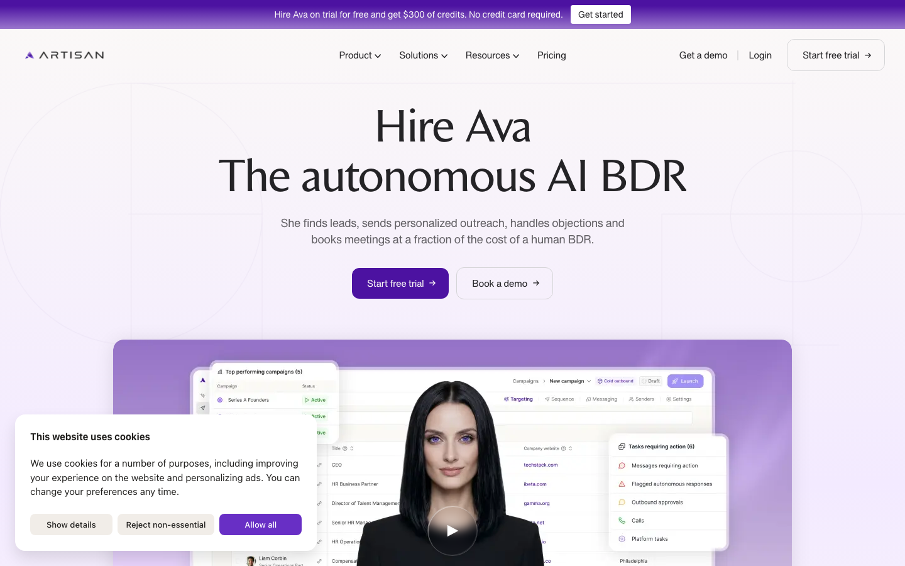

**观察：**

- ✅ **核心价值主张清晰**: 首屏"The autonomous AI BDR — finds leads, sends personalized outreach, handles objections and books meetings"用一句话说明了产品=自主 AI 销售开发代表，覆盖了 BDR 全链路四个动作（找客户/外联/异议处理/约会议），用户能立刻理解"这个产品替代的是人类 BDR 岗位"。
- ✅ **工作流第一步描述具备可信度**: Step 1 给出了具体数字与机制——250M+ 已验证 B2B 联系人、22+ 数据源做 enrichment、用 funding rounds / leadership hires 等 intent signals 做优先级排序，这些细节让"AI 找线索"从抽象口号变成可验证的能力主张。
- P2 能力清单以孤立 tag 形式呈现，缺乏功能解释**: 中部出现的 A/Z testing、Dialer、Local business data、Enrichment、Email generation、Intent data、AI BDR、B2B data、Deliverability、Website visitors 是 10 个独立标签，但页面未说明每个模块具体做什么、如何协同。例如 "Dialer" 是否意味着 Ava 能打电话？"Website visitors" 是访客识别还是反向追踪？用户难以判断产品边界。
- P1 关键集成信息缺失（CRM / 邮箱 / 外联通道）**: 产品定位是 BDR，必然需要接入 CRM（Salesforce/HubSpot?）、邮箱发件域、电话系统、LinkedIn 等渠道，但首屏与可见区域仅提到"import from your CRM"一句话，未列出支持的 CRM 列表、邮箱 deliverability 如何保障、是否走用户域名、是否支持多渠道（邮件+电话+LinkedIn）。这是 B2B 销售工具采购的决策性信息。
- P2 "handles objections" 工作机制未展开**: 首屏承诺 Ava 能"处理异议"，这是 AI BDR 区别于普通自动化外联工具的关键能力，但可见内容里没有第 2/3/4 步说明 Ava 如何识别异议、是否能多轮回复、是否会自动升级到人工、回复延迟等机制，用户无法判断这是真正的对话式 AI 还是简单的模板回复。

#### C5: Footer audit

**URL:** https://www.artisan.co/

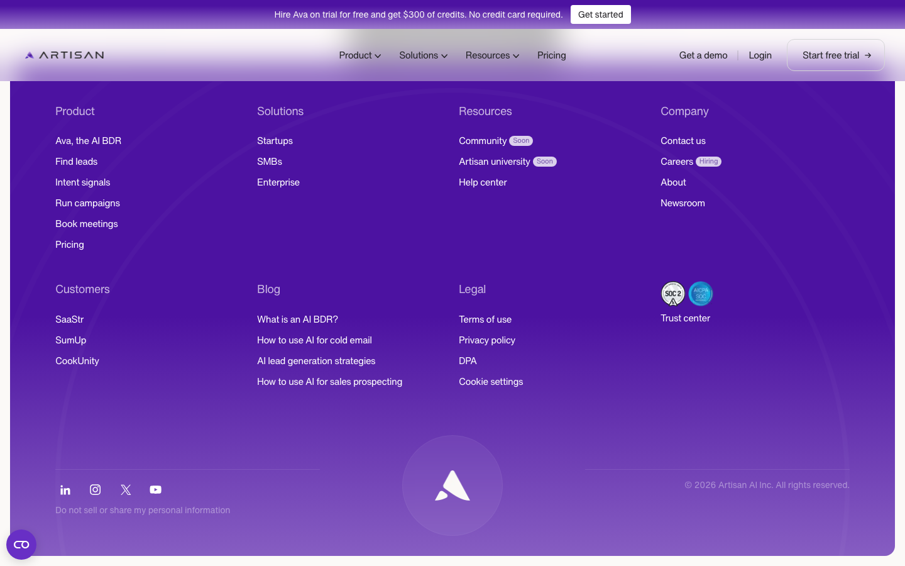

**观察：**

- ✅ **核心工作流分四步讲清楚了**：找线索 → 多渠道触达 → 自动 A/B 优化 → 处理回复并约会议。每一步都给出了具体能力（250M+ B2B 联系人库、22+ 数据源富集、意向信号如融资轮次/高管变动、邮件+社交+原生 Dialer、消息变体测试、自动反对处理、日历直接约会），读完能形成"AI BDR 端到端替代人工 BDR"的清晰心智模型。
- P2 关键集成清单缺失**：页面反复提到"import from your CRM""book meetings directly on your reps' calendars""native dialer"，但未说明**支持哪些 CRM**（Salesforce/HubSpot/Pipedrive?）、**哪些日历系统**（Google/Outlook?）、**社交渠道具体是哪些**（仅 LinkedIn 还是含 X/其他）。对于一个需要嵌入销售技术栈的工具，集成范围是采购决策的硬门槛。
- P2 "22+ 数据源"与"250M+ 联系人"未拆解**：宣称的数据规模是核心卖点，但没说明数据源类型（公开网络/第三方供应商/专有爬取?）、数据刷新频率、地域覆盖（是否含中国/欧洲/APAC）、字段维度（email/phone/tech stack/employee count?）。B2B 数据质量直接决定外呼效果，这块信息缺口很大。
- P1 "autonomous" 程度的边界未界定**：页面强调 Ava "autonomously" 处理回复、反对、约会议，但没有说明**人工介入的具体机制**——escalation rules 长什么样？可配置粒度如何（关键词/意向评分/对话轮数）？AI 回复前是否需要人工审核？发件域名、邮箱预热、合规（CAN-SPAM/GDPR）由谁负责？这些是评估"真自动"还是"半自动"的关键。
- P2 测点本身与页面内容不匹配**：测点为 "Footer audit (C5)"，但所给文本节选**几乎不含 footer 内容**（无 sitemap、社交链接、法律/隐私政策入口、地址、订阅、产品/资源二级导航等典型 footer 元素），仅包含 Hero + 工作流 + 客户证言。无法据此评估 footer 区是否完整暴露产品功能矩阵（如完整产品线、所有解决方案分支、文档/API/集成市场入口等），建议补抓 footer DOM 后再审。


### 🤖 AI 能力 / Agent（4 个测点）

**该模块覆盖页面**:

- `https://www.artisan.co/`
- `https://www.artisan.co/ai-sales-agent`
- `https://www.artisan.co/ai-lead-generation`
- `https://www.artisan.co/ai-outreach`

#### M1: Agent inventory / team page

**URL:** https://www.artisan.co/

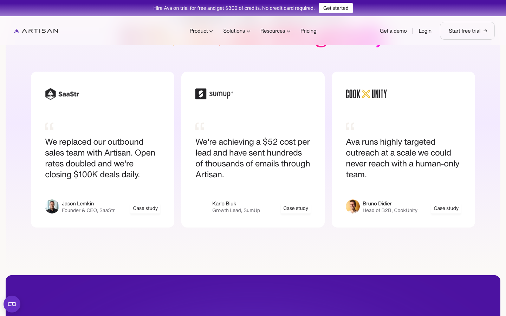

**观察：**

- ✅ 清晰呈现 AI BDR 的端到端工作流：从「找线索 → 多渠道触达 → 自动 A/B 测试 → 处理回复并约会议」四步拆解，让用户能快速理解 Ava 替代人工 BDR 的完整闭环，功能定位明确。
- ✅ 关键能力数据化：250M+ 验证过的 B2B 联系人库、22+ 数据源富化、按融资轮次/高管变动等意向信号排序，这些具体数字让"找线索"环节的能力边界比泛泛的"AI 找客户"更可信。
- P2 多渠道触达的"渠道清单"不完整：仅提到 email + social + native dialer，但未说明社交渠道具体覆盖哪些平台（LinkedIn？Twitter？）、是否支持 SMS/WhatsApp，也未说明 dialer 是否含号码合规、录音、转录等能力。
- P1 CRM 与现有工具栈的集成缺失：页面提到"从 CRM 导入"但未列出支持哪些 CRM（Salesforce / HubSpot / Pipedrive？）、是双向同步还是单向导入、是否会与现有 SDR 工具（Outreach / Salesloft / Apollo）冲突或互补——这是 B2B 销售团队采购前的关键决策信息。
- P1 "自主处理回复 / 处理异议"的工作机制不透明：未说明 Ava 用什么模型回复、是否需要训练公司知识库、回复前是否需人工审核、异议处理的边界在哪、escalation 规则如何配置——这是用户对"autonomous"最大的信任顾虑，却只用一句话带过。

#### E2: 探索: Ava, the AI BDR

**URL:** https://www.artisan.co/ai-sales-agent

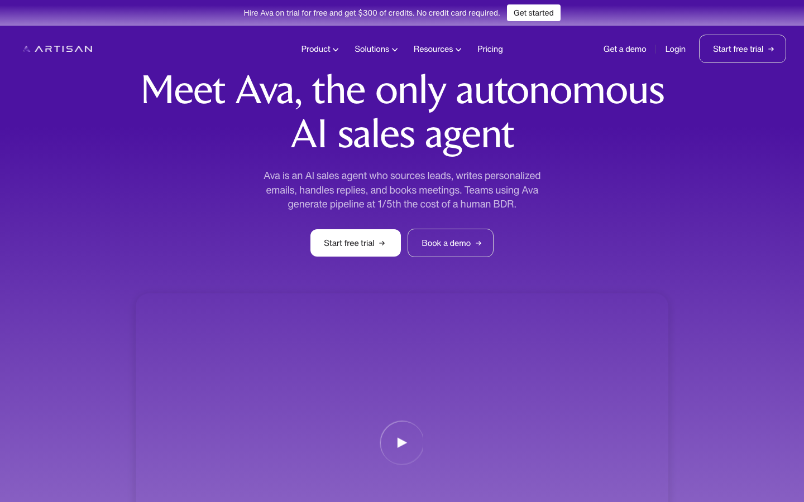

**观察：**

- ✅ **核心功能定位清晰**：页面用一句话讲明 Ava 是"自主 AI 销售代理"，覆盖完整 BDR 工作流——挖掘潜在客户、撰写个性化邮件、处理回复、预约会议，用户读完首屏即能理解"这个产品能替代/补充人类 BDR 干什么"。
- ✅ **三步工作流拆解具体**：分别讲清了①基于 ICP 的线索发现（2.5 亿 B2B 联系人库 + 200+ 国家覆盖 + 招聘/融资等意图信号富化）、②个性化多渠道序列撰写（A/B 测试主题行、优化发送时机）、③回复处理与会议预约，输入（ICP 设定）和输出（日历上的合格会议）链路明确。
- P2 "多渠道" 缺乏具体清单**：页面提到 "multi-channel sequences"，但未说明除邮件外还支持哪些渠道（LinkedIn？电话？短信？），这是潜在用户做选型时的关键功能判断点。
- P1 CRM / 日历 / 邮箱集成信息缺失**：宣称"直接在你的日历上预约会议""保护送达率"，但未说明对接哪些系统（Salesforce / HubSpot / Google Calendar / Outlook？），也未说明邮箱是用客户自己的域名发送还是 Artisan 托管，这直接决定能否落地。
- P2 "自主性"边界与人工介入机制不清**：强调 "Autonomous by default, Adjustable by design"，但用户能在哪些环节"设置 guardrails"、能否审核邮件、能否干预回复、出错如何回滚，这些关键控制权细节未展开。

#### E3: 探索: Find leads

**URL:** https://www.artisan.co/ai-lead-generation

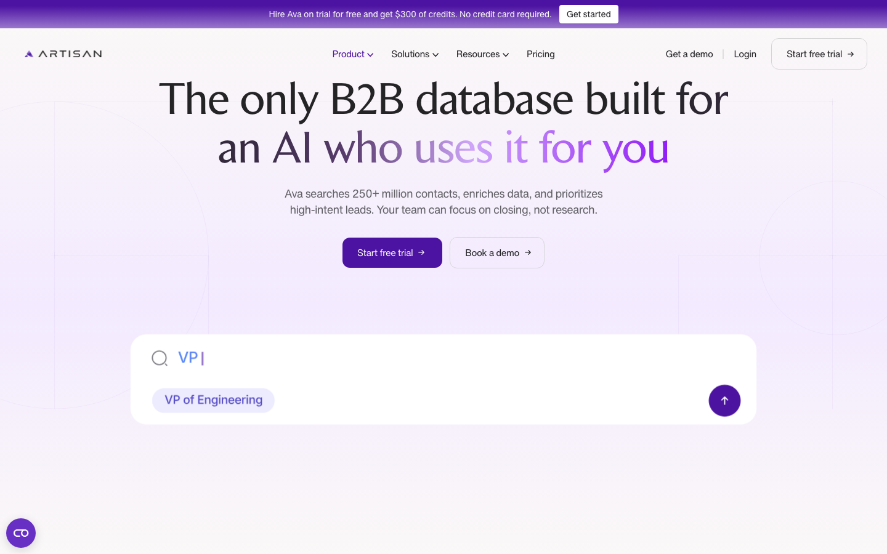

**观察：**

- ✅ **核心能力定位清晰**：页面明确传达 Ava 是"为 AI 使用而构建的 B2B 数据库"，覆盖 250M+ B2B 联系人 + 200M+ 本地商家，并通过 waterfall enrichment 提供邮箱、电话、技术栈、社媒动态等多维数据点，用户能快速理解"这是一个数据 + AI 自动化外联平台"。
- ✅ **意图信号（Intent Signals）功能列举具体**：页面列出了 5 类高意图线索来源——网站访客去匿名化、融资追踪、招聘/增长动态、Bombora 主题意图、社媒关键词监控，让用户能直观判断 Ava 如何识别"准备购买"的潜在客户，场景化强。
- P2 Waterfall Enrichment 工作机制未解释**：页面反复强调 "waterfall data enrichment" 是核心差异化能力，但未说明它的工作原理（多数据源依次回退？置信度如何打分？命中率多少？）——对于评估数据质量的买家来说，这是关键决策信息缺失。
- P2 CRM 集成清单缺失**：明确说"Ava works your CRM"并承诺活动同步、字段拉取、owner 尊重等能力，但完全没列支持哪些 CRM（Salesforce / HubSpot / Pipedrive？）、同步是双向还是单向、字段映射是否可配置——B2B 买家通常会在这一步直接 disqualify 产品。
- P1 "Ava 作为 AI agent"的自主性边界不清**：页面用 "Ava finds leads / runs campaigns / enrolls them autonomously" 等措辞暗示高度自主的 agent 行为，但没说明人工审批节点在哪、能否预览/拦截外联内容、出错时如何介入——对于把品牌外联交给 AI 的决策者，这是核心风险点未澄清。

#### E5: 探索: Run campaigns

**URL:** https://www.artisan.co/ai-outreach

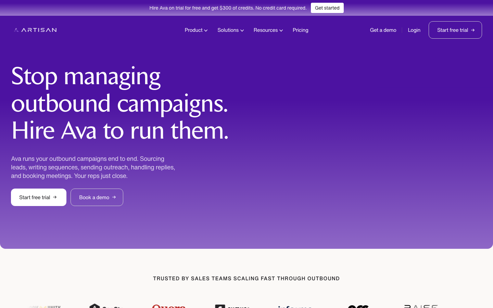

**观察：**

- ✅ **核心能力定位清晰**：页面明确传达 Ava 是一个端到端自主运行 outbound campaign 的 AI BDR，覆盖完整工作流（sourcing leads → 写序列 → 发送外联 → 处理回复 → 预约会议），用户能快速理解"产品替代人工 BDR 团队"的核心价值主张。
- ✅ **四大场景化 play 拆解到位**：将 outbound 拆为 Cold outbound、Signals（funding/job change/hiring/web visit 信号触发）、Cross-sell & upsell（基于 CRM + 产品使用数据）、CRM reactivation（唤醒沉睡联系人）四类典型campaign，每类都给出适用场景，覆盖了 BDR、AE、AM 不同角色的使用诉求。
- ✅ **Power Dialer 工作机制说明具体**：明确说"Ava 不直接打电话，而是把 leads 排队到内置 dialer，附带 talking points、account context、engagement history"，输入输出和人机分工边界讲清楚了——AI 准备弹药，人执行通话。
- P1 数据源与集成清单缺失**：页面提到"enriches data from dozens of sources""使用 CRM & product usage data"，但完全没说明具体接入哪些数据源（Apollo? ZoomInfo? Clearbit?）、支持哪些 CRM（Salesforce/HubSpot?）、产品使用数据如何接入——这是评估产品可行性的关键卡点。
- P1 "Signals" 触发机制黑盒**：声称监控 funding rounds、job changes、hiring surges、web visits，但未说明信号数据来源、监控延迟、ICP 匹配逻辑、误报率控制——对于核心差异化能力 Signals，技术机制完全没披露。


### ✨ 产品功能 / 介绍（1 个测点）

**该模块覆盖页面**:

- `https://www.artisan.co/`

#### S1: Features / Product page

**URL:** https://www.artisan.co/

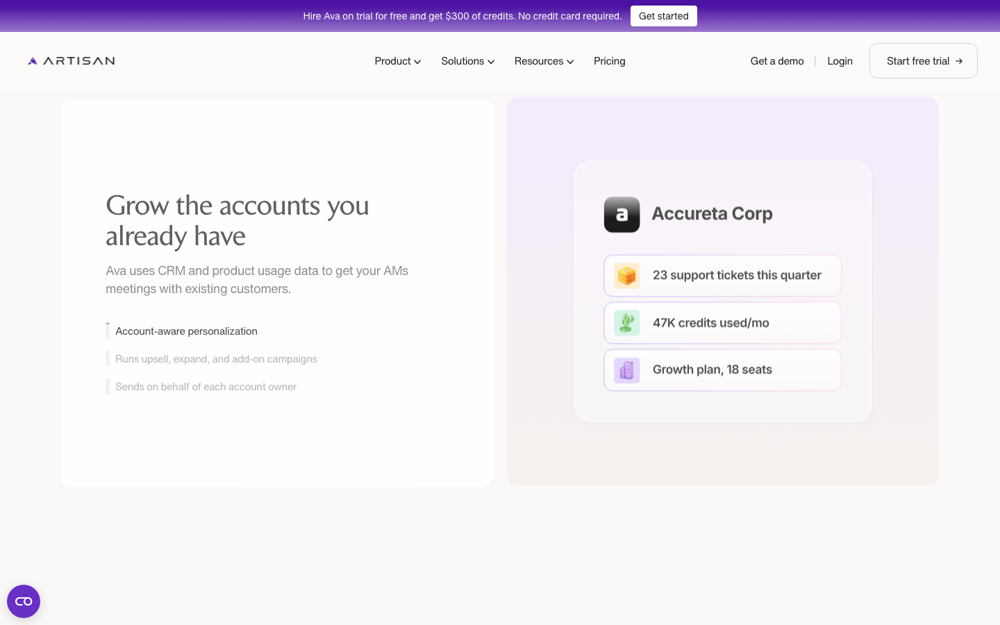

**观察：**

- ✅ **核心工作流描述清晰**：用 4 步骤（找线索 → 多渠道触达 → A/Z 测试优化 → 自动回复并预约会议）完整勾勒了 AI BDR 的端到端自动化闭环，用户能快速理解"产品替我做了哪些原本 BDR 在做的事"。
- ✅ **关键能力有量化锚点**：250M+ 验证 B2B 联系人、22+ 数据源、意图信号（融资轮次、领导层变动）这些具体数字让"找线索"能力变得可信，而非空泛宣称，相比同类"AI agent"产品的模糊描述更具说服力。
- P1 多渠道的"渠道"含糊**：反复强调 "multi-channel sequences across email and social"，但 social 具体指 LinkedIn / Twitter / 还是其他？是否支持 SMS / WhatsApp？是否覆盖电话外呼自动化（dialer 只说"queue call steps"给真人，非自动拨打）？这是判断产品适用性的核心信息却未明确。
- P1 CRM / 数据栈集成清单缺失**：页面提到 "import from your CRM"，但未列出支持的具体系统（Salesforce / HubSpot / Pipedrive？）、双向同步范围、字段映射机制——对于一个号称替代 BDR 团队的产品，这是采购决策的硬门槛信息。
- P2 "自主处理回复"的边界不清**：声称 Ava 能 qualify leads、handle objections、book meetings，并提到 "escalation rules"，但未说明 AI 在什么置信度阈值下会自主回复 vs. 升级给人？误回率 / 错预约的兜底机制是什么？这是 SDR 团队评估自动化风险的关键。


### 🎯 解决方案 / 场景（3 个测点）

**该模块覆盖页面**:

- `https://www.artisan.co/solutions/startups`
- `https://www.artisan.co/solutions/smbs`
- `https://www.artisan.co/solutions/enterprise`

#### E6: 探索: Startups

**URL:** https://www.artisan.co/solutions/startups

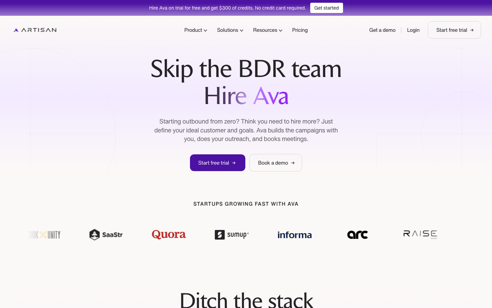

**观察：**

- ✅ **P2** 页面清晰传达了核心定位——Artisan/Ava 是面向初创公司的"AI BDR"自治系统，定位为"替代 BDR 团队"而非辅助工具，三步式工作流（建库→外联→约会）让用户能快速理解产品做什么；但"自治程度"边界未明确（哪些环节必须人工介入、哪些完全自动）
- ✅ **P3** 功能整合叙事有力：明确列出 B2B 数据、邮件个性化、意向数据、序列、AI BDR、网站访客追踪、CRM 同步等 7 项内置能力，并用"不用拼凑 5-6 个工具"的对比凸显一体化价值主张，解决了初创团队工具栈臃肿、预算有限的痛点
- P1** 关键功能机制语焉不详：宣称"250M+ 已验证 B2B 联系人""数十种数据源富集""每封邮件独一无二、无模板/变量""自愈邮箱（self-healing mailboxes）"，但完全未说明数据来源、富集机制、A/B 测试维度、自愈邮箱如何运作——对于评估数据质量与送达率的买家这是核心决策信息
- P1** CRM 同步与集成清单缺失：仅出现"CRM sync"标签，未说明支持哪些 CRM（HubSpot/Salesforce/Pipedrive？）、双向同步还是单向、字段映射粒度、日历集成支持范围（Google/Outlook？）——对初创公司的现有工具栈兼容性是关键功能问题
- P2** "处理异议、回答问题"能力缺乏边界说明：Ava 自动回复 prospect 的能力听起来强大，但未说明知识库如何配置、复杂问题升级机制、回复前是否需人工审核、错误回复的回滚机制——涉及品牌风险，初创用户必然关心

#### E7: 探索: SMBs

**URL:** https://www.artisan.co/solutions/smbs

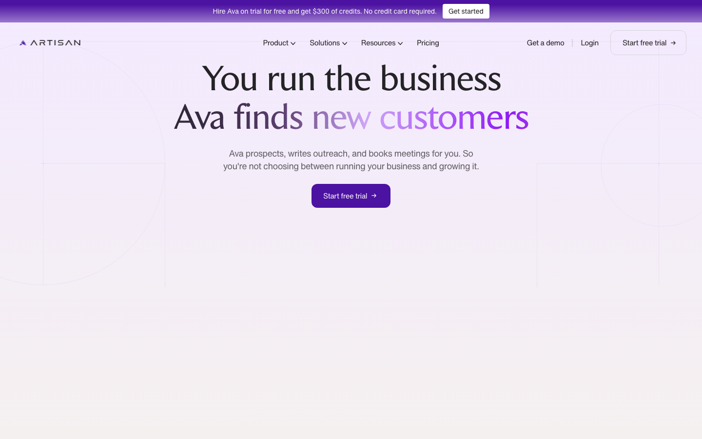

**观察：**

- ✅ 三步工作流清晰呈现了 AI BDR 的核心能力链**：找客户（250M+ B2B 联系人 + 200M+ 本地商户数据库）→ 多渠道外呼（邮件 + 社交，含个性化跟进）→ 自动排会议。功能边界明确：Ava 不只是写邮件工具，而是覆盖"prospecting → outreach → booking"完整 BDR 职能链。
- ✅ "Bring your HubSpot back to life"明确说明了一个具体使用场景**：把沉睡 CRM 联系人重新激活转化为 pipeline / 交叉销售 / 复购，这是 SMB 用户能立即理解的"我也有这个问题"的痛点映射。
- P2 关键功能输入机制描述含糊**："Tell Ava your ideal customer" 没有说明 ICP 配置是问卷、自然语言对话还是结构化字段，SMB 用户无法判断"设置一次"到底需要多少时间和专业度。
- P1 集成清单严重缺失**：除了反复提到的 HubSpot，没有列出支持的 CRM、邮箱（Gmail/Outlook？）、日历（用什么排会议？）、社交平台（LinkedIn？Twitter？）——SMB 决策者第一个想问的"能不能接我现有工具"完全无答案。
- P2 "Social outreach" 渠道范围未定义**：页面多次提"email and social"但从未具体说明社交渠道是 LinkedIn / Twitter / 还是其他，对 B2B SMB 来说渠道选择直接决定可用性。

#### E8: 探索: Enterprise

**URL:** https://www.artisan.co/solutions/enterprise

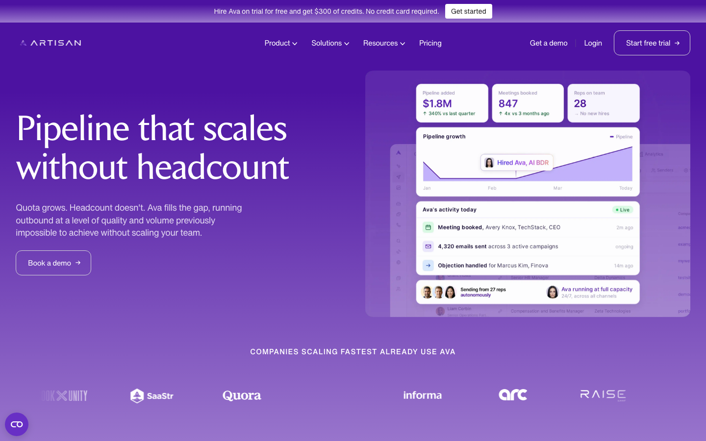

**观察：**

- ✅ 产品功能定位清晰：Ava 是一个端到端自主运行 outbound 销售流程的 AI BDR/AE 代理，覆盖"找线索 → 调研富化 → 多渠道个性化触达 → 处理回复异议 → 预订会议"完整工作流，解决了"配额增长但 headcount 不增长"的 B2B 销售扩张痛点。
- ✅ 关键功能机制说明到位：明确披露数据规模（250M+ 验证 B2B 联系人）、调研富化来源（CRM + 22+ enrichment sources）、语言覆盖（50+ 语言）、CRM 集成（Salesforce / HubSpot / 自定义 API 双向同步）、发送机制（从 rep 邮箱发送、尊重 ownership / round-robin / DNC 列表），这些"输入-机制-输出"参数让 Enterprise 买家能快速判断技术可行性。
- P2 自主性边界与人工介入机制描述含糊："You control escalation rules to decide when a human is in the loop" 只是一句话带过，未说明 escalation 规则的颗粒度（按意向分数？按异议类型？按金额？）、AE 在哪个界面审核 / 接管、Ava 出错或写错时如何回滚 —— 对 Enterprise 客户而言这是合规与品牌风险的核心问题。
- P2 缺少 Enterprise 专属能力清单：页面标题是 "Enterprise" 但通篇看不到企业级专属功能（SSO/SAML、SCIM、审计日志、数据驻留、RBAC、自定义 SLA、专属安全审查、私有部署 / 多租户隔离），与中小客户版本的功能差异完全没体现，无法回答"为什么要选 Enterprise 套餐"。
- P1 品牌语气与合规控制机制不透明："writes with your brand voice, using coaching rules you define per campaign and sequence step" —— 但未说明 coaching rules 的表达形式（自然语言 prompt？模板？示例库？黑白名单词汇？）、是否支持法律 / 合规审核流程、是否可在发送前抽样审核 —— 对大企业是采购决策卡点。


### ⭐ 客户案例（1 个测点）

**该模块覆盖页面**:

- `https://www.artisan.co/customers/saastr`

#### S4: Customer / logo wall

**URL:** https://www.artisan.co/customers/saastr

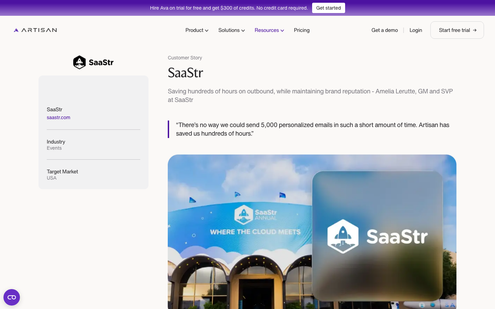

**观察：**

- ✅ 通过 SaaStr 案例清晰展示了 Ava（AI BDR）的核心能力：在保持品牌调性的前提下完成大规模**超个性化邮件外联**（5,000+ 封），并揭示了完整工作流——细分人群定义 → 启动带场景化角度的活动 → 自动跟进 → 人工接管热回复。
- ✅ 明确了三大典型应用场景，功能定位具体可感：**净新外联**（target accounts）、**沉睡线索/网站访客/现有赞助商再激活**、**VIP 与历史与会者邀约转化为门票收入**，让读者能直接对号入座自身使用情况。
- P2 关键功能机制描述不足：页面强调"hyper-personalized"和"brand-safe"，但**未说明个性化的数据来源**（社媒抓取？意图数据？CRM 字段？）、**品牌安全是如何实现的**（提示词模板、审核流、人工审批节点？），用户难以判断输出质量是否可控。
- P1 缺少集成与数据接入说明：作为 AI BDR，Ava 必然需要对接邮箱、CRM、线索数据库、域名/邮件送达基础设施，但案例页**完全未提及任何集成清单或数据源接入方式**，影响潜在客户判断落地可行性。
- P2 结果数据被截断（"Results in ~6 weeks  6,8"），无法呈现案例最具说服力的**量化成果**（邮件量、回复率、会议数、闭环收入等），削弱了"产品能为我带来什么结果"的可验证性。


### 💰 定价 / 商业化（1 个测点）

**该模块覆盖页面**:

- `https://www.artisan.co/pricing`

#### C2: Pricing page

**URL:** https://www.artisan.co/pricing

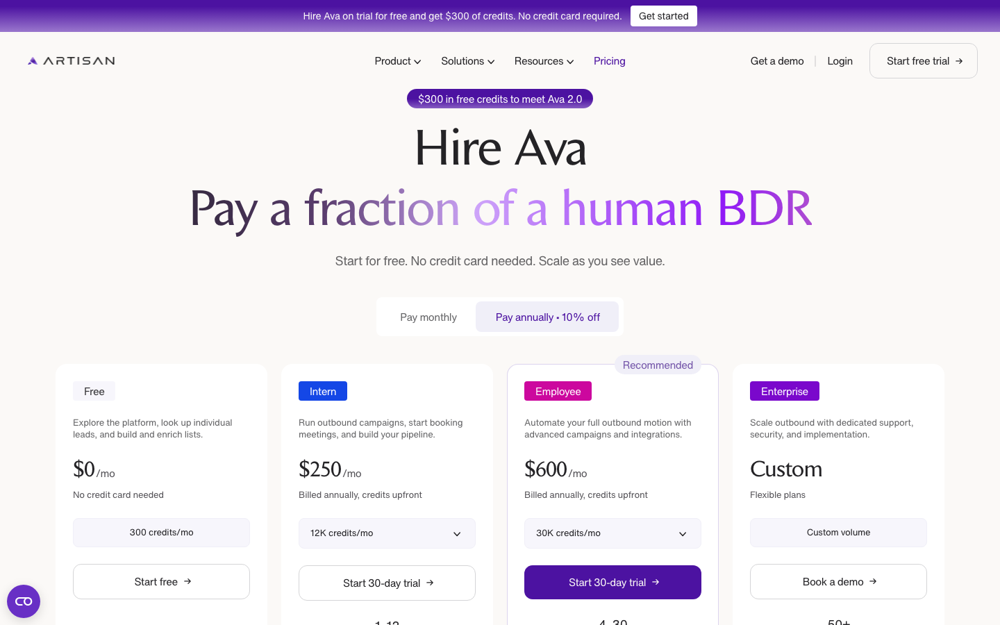

**观察：**

- ✅ **Credit 计费模型说明清晰**: 用具体单位拆解了 Ava 的工作消耗（邮箱补全 2 credits、电话补全 10 credits、端到端触达约 22 credits/人、网站访客识别 4 credits），用户可以反推每月套餐能覆盖多少触达量，把抽象的 "AI 工作" 量化成可计算的资源单位。
- ✅ **揭示了产品的完整外呼工作流**: 从 lead 查找 → 列表/补全 → 个性化外呼 → 自动回复 → 会议预订形成闭环，并明确披露了 CRM (HubSpot/Salesforce)、Slack、Webhook、Power Dialer 等关键集成点，读者能建立 "AI BDR 替代/辅助人工 BDR" 的清晰心智模型。
- P1 "Autonomous campaigns and replies" 自治边界未定义**: 页面把 "自主回复"、"全自动驾驶 Ava (Soon)" 作为核心卖点，但完全没说明 AI 在什么情境下会自行发送邮件、什么时候需要人审批、能否设置审批门槛 — 对销售场景这是品牌风险与信任度的关键决策点，缺这一项无法判断敢不敢上生产。
- P1 "Positive replies / mo" 范围含义不明**: Intern 1–12、Employee 4–30、Enterprise 50+ 这个数字到底是"产品承诺的产出 SLA"、"信用额度能支持的上限"、还是"历史客户均值"？这是用户买单的核心 ROI 指标，但既没有定义口径、也没有说明超量后会发生什么（停用？加购？降级？）。
- P2 关键功能在套餐与 credit 表之间出现不一致**: "Identify website visitor" 出现在 credit 消耗表里（4 credits），但在 Free / Intern / Employee 任何一档套餐 feature 列表里都没出现，无法判断哪一档开始开放此功能；同理 "Agent swarm research" 仅 Free 档列出，但其在更高档是否仍然可用、具体做什么（多 agent 协作做什么调研）也未交代。


### 🚪 注册 / 试用入口（1 个测点）

**该模块覆盖页面**:

- `https://www.artisan.co/`

#### C3: Sign-up flow (no submit)

**URL:** https://www.artisan.co/

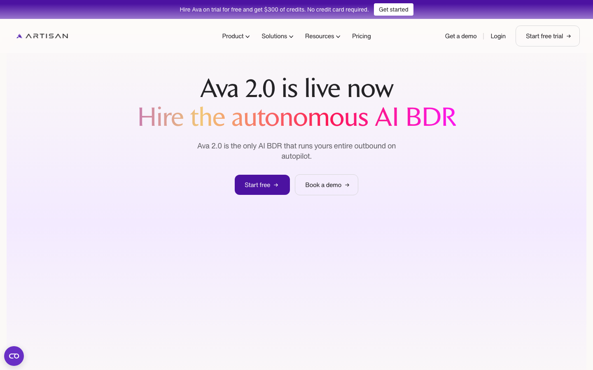

**观察：**

- ✅ 产品定位极其清晰：Ava 被定义为"autonomous AI BDR"，页面用四步工作流（找线索 → 多渠道触达 → A/Z 测试优化 → 自动回复并预约会议）完整呈现了一个端到端的外呼销售自动化闭环，用户读完能立刻理解"它替代/增强 BDR 角色"这件事。
- ✅ 关键能力量化到位：250M+ 验证 B2B 联系人库、22+ 数据源 enrichment、intent signals（融资轮次、高管变动）作为优先级排序依据——这些具体数字让"找线索"环节的能力边界可被评估，而不是空泛的"AI 找客户"。
- P2 多渠道触达的"渠道清单"模糊：文案说 email + social + native dialer，但 social 具体覆盖哪些平台（LinkedIn? Twitter?）、是否支持自动发送还是仅辅助、dialer 是否包含通话录音/转写——这些决定可用性的细节完全缺失。
- P1 与 CRM / 现有销售栈的集成方式未说明：页面提到"import from your CRM"和"books meetings directly on your reps' calendars"，但没有列出支持的 CRM（Salesforce/HubSpot/Pipedrive?）、日历系统、邮箱发送账户（Gmail/Outlook/SMTP）、以及双向同步还是单向导入——对 B2B SaaS 这是采购决策的核心信息。
- P1 "autonomous" 程度与人工介入边界不透明：文案说"You set escalation rules to decide when a human gets pulled in"，但没有任何例子说明规则颗粒度（按意向分级？按行业？按回复内容？），也没说明 Ava 在回复客户前是否需要人工审核、AI 误判的兜底机制是什么——这直接影响用户对"把品牌声誉交给 AI"的信任度。


### 📞 Demo / 销售对接（1 个测点）

**该模块覆盖页面**:

- `https://www.artisan.co/request-demo`

#### E1: 探索: Get a demo

**URL:** https://www.artisan.co/request-demo

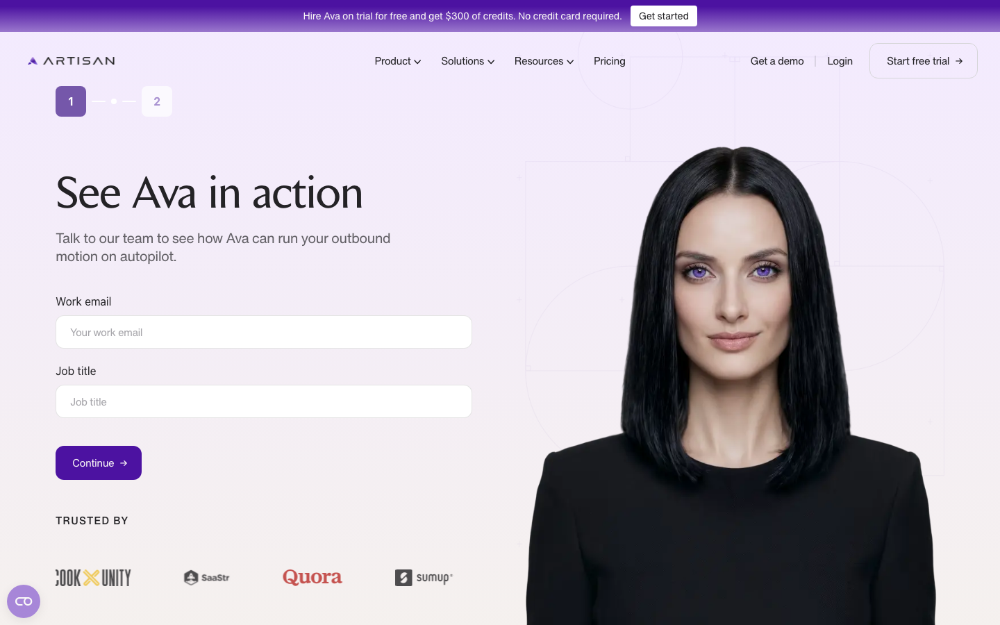

**观察：**

- P1 "See Ava in action" 标题与实际内容严重不符**：页面承诺展示产品运作，但除了表单外没有任何功能演示、工作流截图、视频或具体场景描述，用户无法在此页"看到"Ava 究竟做什么
- P2 核心能力仅以导航词呈现，缺少机制说明**：导航里能看到 Find leads / Intent signals / Run campaigns / Book meetings 四大功能模块，但 demo 页本身未解释 Ava 如何执行这些动作（数据源？信号来源？邮件 / LinkedIn / 电话？自动化程度？）
- P1 未披露关键集成信息**：作为 AI BDR，CRM（Salesforce / HubSpot）、邮件域名、数据 enrichment 源等是评估可行性的核心，页面对此完全空白
- P2 "autopilot 跑外联"边界模糊**：未说明 Ava 是端到端自主决策（找潜客→写文案→发件→跟进→预约）还是需人工审核环节，无法判断与 Apollo / Outreach / Clay 等工具的功能差异
- ✅ $300 试用额度 + 无需信用卡的入口降低了"评估真实功能"的门槛**，比单纯 demo 表单更利于功能验证，但页面没有引导用户走试用路径而是逼向销售对话


### 🔒 安全 / 信任（1 个测点）

**该模块覆盖页面**:

- `https://www.artisan.co/`

#### S12: Trust / Security page

**URL:** https://www.artisan.co/

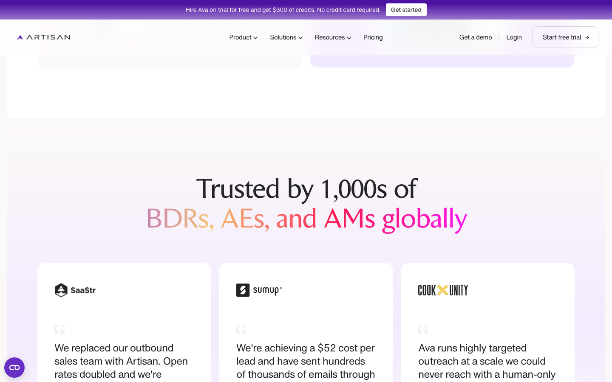

**观察：**

- P1 严重 — "Trust/Security 页面"实际未呈现任何信任 / 安全相关功能信息**：页面内容完全是 Ava 产品介绍（AI BDR 工作流、数据源、客户证言），没有任何关于数据加密、SOC 2 / ISO 27001 / GDPR / HIPAA 合规认证、数据驻留、租户隔离、访问控制、审计日志、邮件账号授权范围等用户购买 AI BDR 时最关心的安全能力描述。用户读完无法判断"把我的邮箱、CRM、客户数据交给 Ava 安全吗"。
- P1 严重 — 数据来源与隐私机制未说明**：页面提到"250M+ verified B2B contacts""22+ data sources""intent signals like funding rounds and leadership hires"，但完全没说这些 B2B 联系人数据是如何获取的、是否符合 GDPR / CCPA、被联系的潜在客户是否可以 opt-out、Artisan 是否对 EU 数据有专门处理。这对 outbound 工具是核心信任问题。
- P2 中等 — 关键集成点只提"native dialer"和"import from your CRM"，但未列出支持哪些 CRM / 邮箱 / 日历 / 社交平台**：第 2 步说 "multi-channel outreach across email and social" 却没说"social"指 LinkedIn 还是其他；第 4 步说"books meetings directly on your reps' calendars"但未说明对接 Google Calendar / Outlook 的方式与权限范围。集成清单是评估能否落地的硬指标。
- P2 中等 — "autonomous"边界与人工干预机制描述模糊**：第 4 步提到"You set escalation rules to decide when a human gets pulled in"，但没说明可配置哪些规则维度（关键词触发？意向分阈值？特定行业/职位？），也没说明 Ava 误判时的回滚 / 复核机制。对于"AI 代发邮件 / 代回复"这类高风险自动化，escalation 设计是核心功能点。
- P3 轻微 — A/Z testing、deliverability、website visitors 等能力以标签形式罗列但未展开**：页面用关键词云形式呈现 10 个能力（A/Z testing、Dialer、Local business data、Enrichment、Email generation、Intent data、AI BDR、B2B data、Deliverability、Website visitors），但只有 4 步主流程被展开。Deliverability（送达率管理）和 Website visitors（识别访问网站的公司）是两个独立的强能力，仅作 tag 出现会让用户低估产品广度。


### 📅 日程 / 会议（1 个测点）

**该模块覆盖页面**:

- `https://www.artisan.co/meeting-scheduling-software`

#### M2: Agent profile (sample)

**URL:** https://www.artisan.co/meeting-scheduling-software

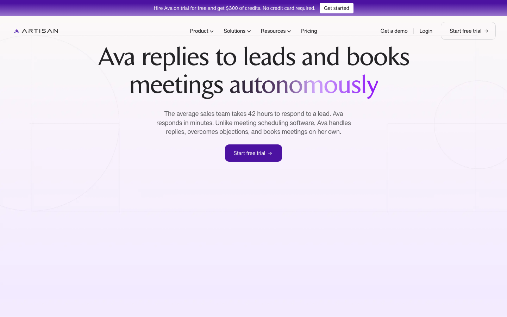

**观察：**

- ✅ 清晰展示了 Ava 的**核心工作流闭环**：实时情感分析判断意图 → 正面回复发预约链接 / 否决异议处理 / 提问从知识库回答 / 不感兴趣礼貌结束 → 持续跟进直到预约或明确拒绝。每一种 reply 类型都对应明确动作，让用户能立刻理解"AI BDR"具体在做什么。
- ✅ **资格审核 + 升级机制**说明到位：Ava 在发预约链接前会通过 AI research 或追问来 qualify 潜客，不合格的会 escalate 给人类团队；遇到敏感/复杂问题也会升级而不是瞎猜。这两个"AI 边界"的设定有效缓解了用户对 AI agent 失控的担忧。
- P1 渠道范围完全不明确**：通篇用 "reply / inbox / message" 等模糊词，但没说明 Ava 处理的是 **email、LinkedIn、SMS、网站聊天还是全部**。这是 AI SDR 类产品最关键的功能边界，缺失会让买家无法判断是否覆盖自己的外联渠道。
- P1 上游接入不清**：页面只讲 "reply to leads"，但没说明 leads **从哪里来** — Ava 是否自己做 outbound prospecting，还是只在已有 sequence/campaign 上做回复处理？输入端模糊导致用户无法判断 Ava 是替代整个 BDR 还是只是 reply automation 层。
- P2 集成清单缺失**：知识库提到 "upload documents"，但没说支持哪些格式 / 是否能直连 Notion、Google Drive、Confluence；预约环节没说集成的是 Calendly、Chili Piper、Google Calendar 还是自家排程；CRM 同步（HubSpot / Salesforce）也只字未提。对于 sales agent，这些集成本身就是产品价值的一部分。


### 🏢 公司 / 团队（1 个测点）

**该模块覆盖页面**:

- `https://www.artisan.co/about`

#### S7: About / Company

**URL:** https://www.artisan.co/about

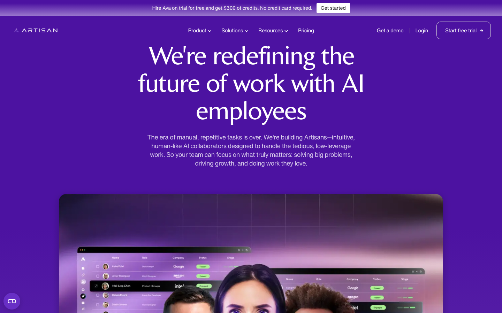

**观察：**

- P2** 页面定位产品为"AI employees / Artisans"，但仅以"outbound sales"作为起点一句话带过，未在 About 页面具体说明 Ava（已在 CTA 中提及）究竟执行哪些销售动作（找线索 / 写邮件 / 跟进 / 预约会议？），读者无法从这一页判断产品的实际功能边界。
- P1** 关键功能机制完全缺失：未说明 Artisans 如何与现有工具协作（CRM、邮箱、日历、Slack 等集成清单）、数据来源（自有线索库？外部数据？用户上传？）、人机协作方式（审批流？自动发送？），导致"AI collaborator"沦为口号而非可验证能力。
- P2** "consolidating the SaaS ecosystem with one exceptional platform"暗示产品要替代多个 SaaS，但未列出具体被替代的工具类别（销售互动平台？数据增强？序列化工具？），用户无法判断是否需要继续保留现有 stack。
- P3** 提到未来扩展到"customer success、recruiting"等领域，但未说明当前已上线哪些 Artisan 角色、哪些仍在 roadmap，功能可用性的时间线模糊。
- P2** $300 试用额度 + "Hire Ava on trial"的计费单位不清楚：是按发送邮件数？按会议预约数？按 Artisan 工作小时数？About 页作为引导入口未给出哪怕一句话的计费逻辑提示，影响功能价值的可量化理解。


### 📖 文档 / 帮助（1 个测点）

**该模块覆盖页面**:

- `https://www.artisan.co/`

#### C7: Help / Documentation

**URL:** https://www.artisan.co/

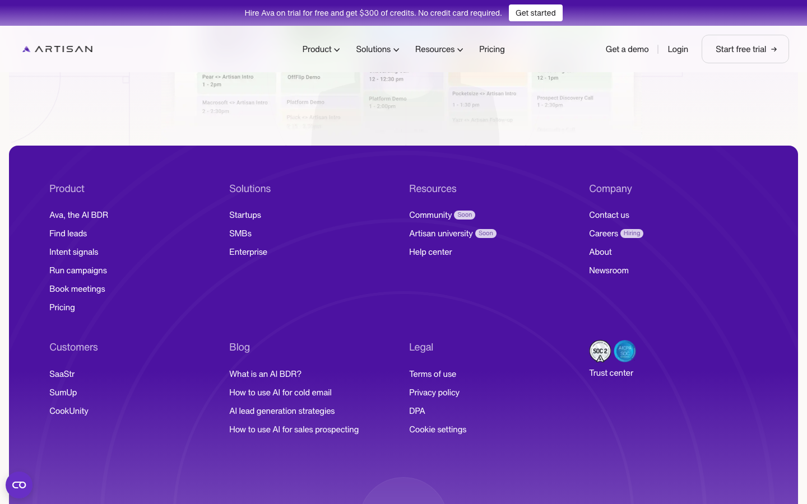

**观察：**

- ✅ 清晰阐述了 AI BDR 的端到端工作流：找线索 → 多渠道触达 → A/B 测试优化 → 自动回复并预约会议，四步结构让读者快速理解 Ava 能替代的人类 BDR 工作环节。
- ✅ 功能输入/数据规模有具体量化："250M+ 验证过的 B2B 联系人""22+ 数据源富化""funding rounds、leadership hires 等意向信号"，让"找线索"能力可信且可衡量。
- P1** 页面标题为 "Help / Documentation" 但实际抓取内容是首页营销文案，**完全没有任何帮助中心、知识库、产品文档、API 文档或使用教程的入口与内容**——用户无法了解产品的实际配置流程、上手步骤、故障排查或开发者集成方式。
- P2** 关键集成信息缺失：提到"导入 CRM""在 reps 日历上预约会议""native dialer"，但未列出支持哪些 CRM（Salesforce / HubSpot / Pipedrive？）、哪些日历（Google / Outlook？）、哪些邮箱发送基础设施，B2B 决策者最关心的兼容性清单完全缺位。
- P2** "She handles every reply / handles objections" 是核心卖点，但未说明背后机制：用什么模型、回复是否需人工审核、误判风险如何控制、"escalation rules"具体可配置哪些维度——对销售负责人这是是否敢把品牌话语权交给 AI 的关键信息。


### 📧 联系 / 客服（1 个测点）

**该模块覆盖页面**:

- `https://www.artisan.co/contact-us`

#### S14: Customer support channels

**URL:** https://www.artisan.co/contact-us

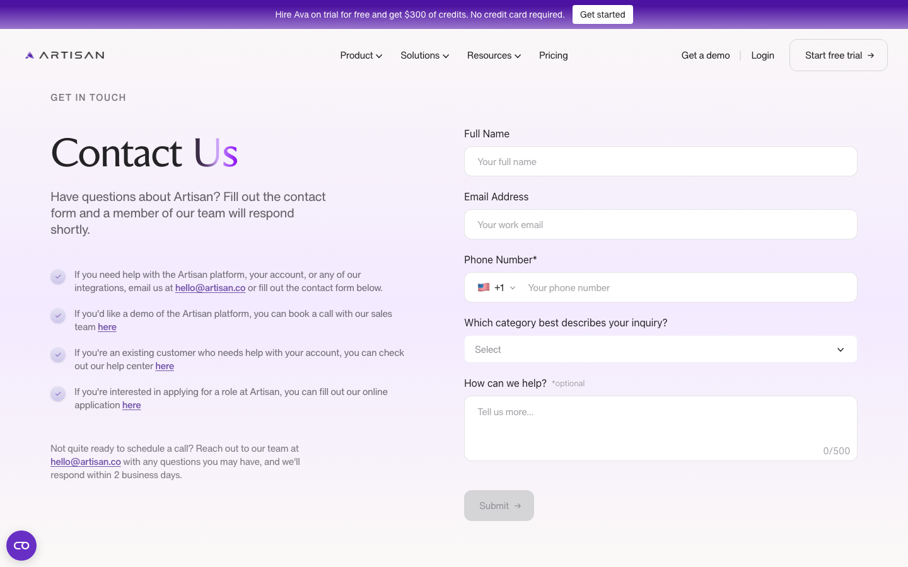

**观察：**

- P2** 页面仅提供邮箱（hello@artisan.co）+ 联系表单 + 销售 demo 预约三种入口，未说明是否提供电话支持、在线聊天 / Live Chat、Slack Connect 或专属客户成功经理等更高时效的功能化支持渠道，对于 AI BDR 这类需要持续调优的产品而言，支持通道的功能性边界不清晰。
- P1** 承诺"2 个工作日内回复"是销售/通用咨询的 SLA，但**未区分付费客户故障类工单的响应时效**（例如 Ava 跑活动中断、邮件投递异常这类时间敏感问题），用户无法判断在产品出问题时能多快得到处理。
- P2** 提到 "help center"（帮助中心）作为存量客户的自助入口，但页面未说明帮助中心覆盖的内容范围（是否含 API 文档、集成排错、Ava 配置教程、prompt 模板库等），导致用户无法预判"自助 vs 联系人工"的分流逻辑。
- P3** 表单设有 "Which category best describes your inquiry?" 分类下拉，但页面未展示分类选项清单（如 Billing / Bug / Integration / Sales / Partnership），用户无法预先判断自己的诉求是否在 Artisan 的功能化支持范畴内，也看不出不同类别是否走不同 SLA。
- P2** 招聘、销售 demo、存量客户支持、通用咨询四类入口混在同一页，**没有给"Trial 用户在试用期遇到 Ava 配置 / 数据接入问题"提供专门通道**——而这恰是 trial 转付费阶段最高频的功能性求助场景，缺失会直接影响产品 activation。


### 📚 产品官方介绍（递归发现）（4 个测点）

**该模块覆盖页面**:

- `https://help.artisan.co/collections/1258822112-general`
- `https://help.artisan.co/articles/6243068911-pre-onboarding-form-what-we-need-and-why`
- `https://help.artisan.co/articles/5834370686-what-is-artisan-a-quick-overview`
- `https://help.artisan.co/articles/3857275619-getting-started`

#### B1: 背景 D1: Getting Started 11 articles

**URL:** https://help.artisan.co/collections/1258822112-general


**观察：**

- ✅ **产品定义（仅标题暗示）**：页面顶部首篇即为 "What Is Artisan? A Quick Overview"，明确该产品名为 **Artisan**，并以 "Getting Started" 入门集合形式呈现。**P3**：但页面本身只是文章索引，未展示该 Overview 的正文，因此"Artisan 究竟是什么"这一最关键定义在本页**没有给出原文**。
- ✅ **核心功能能力（从文章标题反推）**：
- AI 代写邮件** — "How Does Ava Know What to Write?" 暗示有一个名为 **Ava** 的 AI 角色负责撰写外联内容；
- Mailbox 连接与团队管理** — "How Do I Connect Mailboxes and Add Team Members?"；
- Watchtower 触发器**（信号驱动外联）— 包含 **Job Posting Trigger**（招聘信号）与 **Fundraise Trigger**（融资信号）两类；
- 邮箱健康度监控** — "Mailbox Health Is Urgent / Warning Sign"、"Mailboxes Still Aren't at Full Capacity"；

#### B2: 背景 D1: Pre-Onboarding Form: What We Need and Why ›

**URL:** https://help.artisan.co/articles/6243068911-pre-onboarding-form-what-we-need-and-why


**观察：**

- ✅ **产品定义**：页面将产品定义为由 AI 销售代表 "Ava" 驱动的外联自动化服务，原文提及 "Before we can launch your first campaign with Ava" 以及 "Ava will send emails from"，定位为代客户执行邮件外联营销活动的 AI 销售员。
- ✅ **核心功能能力**：(1) AI 邮件外联代理 Ava 自动发送营销邮件；(2) 二级 / 别名域名（lookalike domains，如 tryyourcompany.com）注册与配置以保护发件人声誉；(3) 邮箱（mailbox）批量购买与配置；(4) 基于 ICP（Ideal Customer Persona）的潜在客户定位（职位 / 地区 / 行业 / 公司规模）；(5) 邮件内容个性化（含签名、Logo、社交头像、案例引用、Resources / Offers Hook）。
- ✅ **目标用户与场景**：面向 B2B 销售 / 市场团队（"typically your sales or marketing team"），典型场景为冷启动外联型 lead generation——客户提供 ICP、差异化卖点和案例，由 Ava 代表"高级别 sender"（"Higher seniority = higher reply rates"）批量发送个性化冷邮件。
- ✅ **差异化主张 / 独家叙事**：核心叙事是 "让 Ava 听起来像你"——通过收集客户原话描述（"in your own words"）、差异点、案例、资源等让 AI 输出贴近真人销售；同时强调使用 lookalike domain 而非主域名，以"保护发件人声誉"（"protect your sender reputation"）作为安全卖点。
- ✅ **关键术语 / 概念**：
- Ava** — 产品的 AI 销售代表 / 数字员工，代客户身份发送邮件；

#### B3: 背景 D2: What Is Artisan? A Quick Overview ›

**URL:** https://help.artisan.co/articles/5834370686-what-is-artisan-a-quick-overview


**观察：**

- ✅ **产品一句话定义**：页面将 Artisan 定义为 "AI-powered digital employees, called Artisans"，并进一步定位为 "an AI-first workspace that centralizes your sales stack"——既是"数字员工"也是"以 AI 为中心的工作空间"，主张"redefining how work gets done, starting with the tasks your team hates doing"。
- ✅ **核心功能能力**：页面提及的能力非常聚焦——(1) AI 驱动的数字员工 Artisans；(2) 自动化重复性、手动性工作；(3) 集中化销售技术栈（centralize sales stack）；(4) 起步场景为 outbound sales（外呼销售）；(5) 规划中向"所有业务职能"扩展的 digital coworkers。
- ✅ **目标用户与场景**：当前明确指向**销售团队的 outbound sales 场景**，定位为替代"拼接式销售软件栈 + 无意义繁琐工作"的方案；远期愿景覆盖"all business functions"。
- ✅ **差异化主张 / 独家叙事**：页面刻意做了一次否定式定位——"Artisan isn't just another automation tool"，把自己与"automation tool / RPA"拉开距离，强调三点叙事：① 类人 AI 协作者（human-like AI collaborators）；② AI-first workspace 而非工具拼装；③ 资本与团队背书（融资 $32M+，投资人含 HubSpot Ventures、Y Combinator、BOND、Glade Brook，团队来自 Meta/BCG/IBM 及 Oxford/Duke/IIT）。
- ✅ **关键术语 / 概念**：
- Artisans** = AI 驱动的数字员工（digital employees），是产品的核心人格化单位；

#### B4: 背景 D2: Getting Started ›

**URL:** https://help.artisan.co/articles/3857275619-getting-started


**观察：**

- ✅ **产品定义**：页面将 Artisan 定义为"one of the most advanced AI sales teammates on the planet"，其核心产品为 **Ava**——被定位为"digital colleague"（数字同事），而非传统软件工具，强调拟人化的"AI sales teammate"叙事。
- ✅ **核心功能能力**：页面提及的产品能力包括：(1) 邮件外联（email outbound）；(2) 直接消息外联（direct messaging）；(3) 邮箱预热（mailbox warm-up）；(4) 多渠道营销活动（multi-channel campaigns）；(5) 全自动外联运营（full autopilot outbound）。
- ✅ **目标用户与场景**：面向需要做**外呼销售/outbound sales**的团队，典型场景是从 signup 到完全托管 outbound 流程——涵盖首次启动 campaign、邮箱预热（约 2-3 周）、多渠道 campaign 启动、以及上线后优化。
- ✅ **差异化主张**：核心叙事是"AI 销售员工"而非"销售工具"——把 Ava 拟人化为"newest digital colleague"，强调"全自动驾驶"（autopilot）的托管式体验，而非用户自己操作的 SaaS 工具。配套交付流程包含人工 Kickoff Call + Pre-Onboarding Form，凸显"高接触 onboarding + AI 代运营"的混合模式。
- ✅ **关键术语**：(1) **Ava** = Artisan 的 AI 销售员工产品名称；(2) **AI sales teammate / digital colleague** = 把 AI 产品定位为团队成员的核心叙事；(3) **Mailbox warm-up** = 启动 outbound 前的邮箱预热环节；(4) **Direct Message-Only Campaign** = 可选的纯私信渠道 campaign 类型；(5) **Autopilot** = Ava 全自动运行 outbound 的目标状态。
- P3 理解缺口**：(1) 页面未说明 Ava 具体使用什么 AI 能力（线索挖掘？文案生成？回复处理？）；(2) "direct messaging" 具体指 LinkedIn、Twitter 还是其他渠道未明确；(3) 没有提及定价、坐席模式或 ROI 指标；(4) 对"sales teammate"与传统 sales engagement 工具（Outreach/Apollo 等）的本质差异未做对比说明；(5) 未交代 Ava 背后是否有人工介入或纯 AI 自治。


### 🔐 登录后 Workspace（dashboard）（13 个测点）

**该模块覆盖页面**:

- `https://dashboard.artisan.co/manage-ava`
- `https://dashboard.artisan.co/campaigns`
- `https://dashboard.artisan.co/analytics`
- `https://dashboard.artisan.co/organization/settings/teams`
- `https://dashboard.artisan.co/inbox`
- `https://dashboard.artisan.co/tasks`
- `https://dashboard.artisan.co/dialer`
- `https://dashboard.artisan.co/find-leads`
- `https://dashboard.artisan.co/signals`
- `https://dashboard.artisan.co/website-visitors`
- `https://dashboard.artisan.co/lists`
- `https://dashboard.artisan.co/leads`

#### L1: Dashboard 入口: manage-ava

**URL:** https://dashboard.artisan.co/manage-ava

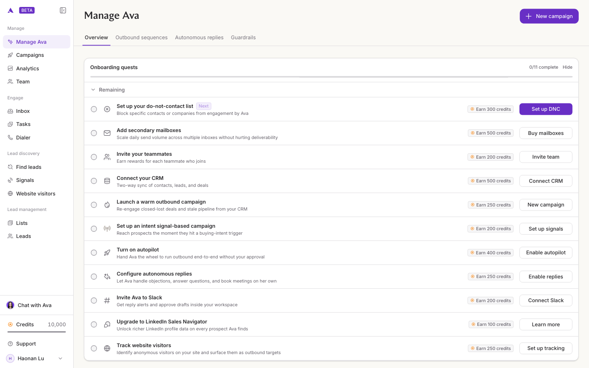

**观察：**

- ✅ 揭示了产品的核心定位**：这是一个 AI BDR（外呼销售代表）平台，以 "Ava" 为命名的 AI agent，覆盖从线索发现（Find leads / Signals / Website visitors）→ 线索管理（Lists / Leads）→ 触达执行（Campaigns / Outbound sequences / Dialer）→ 自主回复（Autonomous replies / Inbox / Tasks）的完整外呼工作流，定位是"端到端自动化外呼"。
- ✅ Onboarding quests 明确披露了产品能力清单**：11 个任务点像一份隐式功能目录——DNC 列表、多邮箱发送（提升发送量且不损害送达率）、CRM 双向同步、warm outbound（基于 closed-lost / 停滞 pipeline 再激活）、intent signal 触发型 campaign、autopilot 全自动模式、autonomous replies（处理异议+预约会议）、Slack 集成、LinkedIn Sales Navigator 富化、网站访客识别。这一页几乎等于产品 feature map。
- P2 关键能力的工作机制未说明**：例如 "autopilot 让 Ava 端到端运行无需审批"——具体哪些动作不再需要人工？发信、回复、改文案、加联系人都自动？"Autonomous replies 处理异议"——是基于知识库、CRM 数据还是用户提供的话术？这些是用户最关心的"AI 自治边界"，但仅一句话带过。
- P2 Credits 经济体系暴露但未解释**：顶部显示 10,000 credits，每个 onboarding 任务奖励 200–500 credits，但页面未说明 credits 用于消耗什么动作（发信？enrichment？AI 生成？拨号？）、消耗速率，以及不同套餐的 credits 额度差异。这是核心计费机制信息缺口。
- P1 输入侧功能描述缺失**：用户读完仍不知道——Ava 的线索池来自哪里（自有数据库？LinkedIn？第三方）？支持哪些渠道触达（看到 Dialer 暗示电话+邮件，但 LinkedIn 触达？短信？未明示）？以及"Guardrails" 模块到底约束什么（合规？语气？发送频次？）。对评估"这个产品能为我做什么"是关键缺口。

#### L2: Dashboard: Manage Ava

**URL:** https://dashboard.artisan.co/manage-ava


**观察：**

- ✅ **核心产品定位非常清晰**：Manage Ava 集中呈现了产品是一个 **AI BDR（自动化外呼销售代表）平台**，工作流被明确拆解为三大支柱——Outbound sequences（外呼序列）、Autonomous replies（自主回复）、Guardrails（护栏规则），用户能立刻理解 Ava 是"AI 销售员"而非简单的群发工具。
- ✅ **Onboarding quests 实质上是一份完整的功能清单**：11 项任务把产品能力一次性铺开——DNC 名单、多邮箱轮换发送、CRM 双向同步、warm outbound（再激活流失客户）、intent signal 触发型 campaign、autopilot 全自动模式、autonomous replies、Slack 集成、LinkedIn Sales Navigator 富化、网站匿名访客识别——每一项都用一句话说明了功能价值，信息密度极高。
- ✅ **能力边界与典型场景被场景化说明**：例如"Re-engage closed-lost deals and stale pipeline from your CRM"（盘活 CRM 中的死单）、"Reach prospects the moment they hit a buying-intent trigger"（意向信号触发外呼）、"Identify anonymous visitors on your site"（识别匿名访客并转为外呼目标）——这些不是泛泛的 "AI for sales"，而是具体的用例描述。
- P2 "Autopilot" 与 "Autonomous replies" 的自动化边界未说明**：页面提到"Hand Ava the wheel to run outbound end-to-end without your approval"和"Let Ava handle objections, answer questions, and book meetings on her own"，但未解释 Guardrails 如何约束 AI 行为、AI 在哪些环节仍需人工审批、出错时的回滚机制——对于将销售外联交给 AI 这种高风险动作，缺乏信任建立信息。
- P2 Credits 计费模型与功能消耗关系不透明**：顶部显示 10,000 credits，任务完成可奖励 100–500 credits，但页面未说明哪些功能（发邮件？enrichment？AI 回复？拨号？）消耗 credits、消耗速率如何，用户无法预估实际使用成本与容量。

#### L3: Dashboard: Campaigns

**URL:** https://dashboard.artisan.co/campaigns

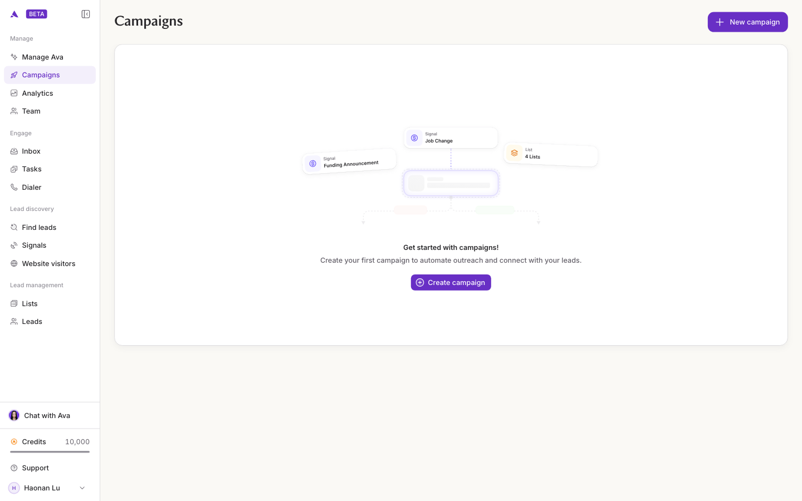

**观察：**

- ⚠️ 该测点 LLM 解读失败（超时），未生成功能观察。建议人工补充或重跑此测点。

#### L4: Dashboard: Analytics

**URL:** https://dashboard.artisan.co/analytics

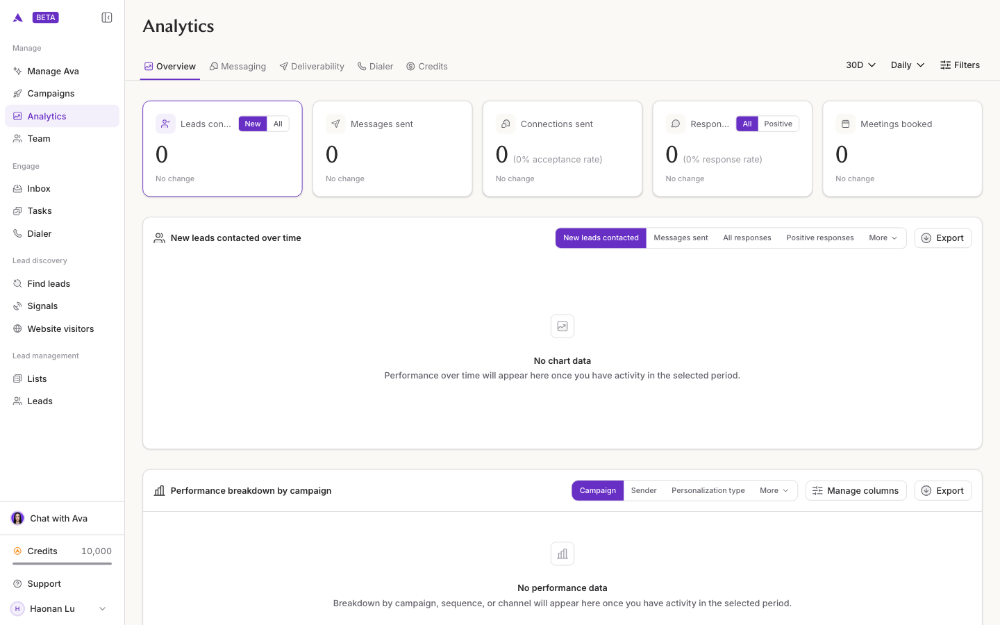

**观察：**

- P1 严重：核心分析能力的「输入来源」未说明** — 页面展示了 Leads contacted、Messages sent、Connections sent、Responses、Meetings booked 五大指标，但完全没有揭示这些数据来自哪些渠道（LinkedIn？Email？Dialer？）、是否需要连接外部账号（如 Gmail / Outlook / LinkedIn Sales Navigator）才能产生数据，用户无法判断要让 Analytics 跑起来需要先打通什么。
- P1 严重：与 Campaigns / Sequences 的功能关系不清** — "Performance breakdown by campaign / sequence / channel" 暗示产品有多渠道序列化外联（multi-channel sequencing）能力，但本页未解释一个 campaign 是如何由 Ava（AI BDR）执行的、Sender 字段是真人还是 AI persona、Personalization type 有哪几种选项及其工作机制，导致用户读不出产品的 AI 自动化深度。
- P2 中等：Deliverability / Dialer 子模块的功能价值未预览** — 顶部 tabs 列出了 Overview / Messaging / Deliverability / Dialer / Credits 五个分析维度，这其实是产品能力地图（说明产品同时管邮件送达率、外呼电话、消息触达、积分消耗），但空状态下完全没有缩略说明每个子分析能看到什么，用户无法判断该产品在 deliverability 监控、cold call 拨打分析上的深度。
- P2 中等：Credits 经济模型缺解释** — 侧边栏显示 Credits 10,000、Analytics 里也有 Credits tab，说明产品采用积分制计费，但页面未说明哪些动作消耗积分（发邮件？AI 个性化？拨号？Signals？Website visitors？）、不同动作积分单价、超额后的行为，这对评估产品 ROI 至关重要。
- P2 中等：Signals / Website visitors / Lead discovery 等高价值能力在 Analytics 中无映射** — 侧边栏暴露了"意图信号"、"网站访客识别"、"线索发现"等典型 ABM/intent 数据能力，但 Analytics 页只统计外联动作指标，未呈现 intent-to-outreach 的转化漏斗（例：来自 Signals 的 lead 响应率 vs 冷名单响应率），削弱了产品作为「intent-driven AI BDR」的差异化叙事。

#### L5: Dashboard: Team

**URL:** https://dashboard.artisan.co/organization/settings/teams

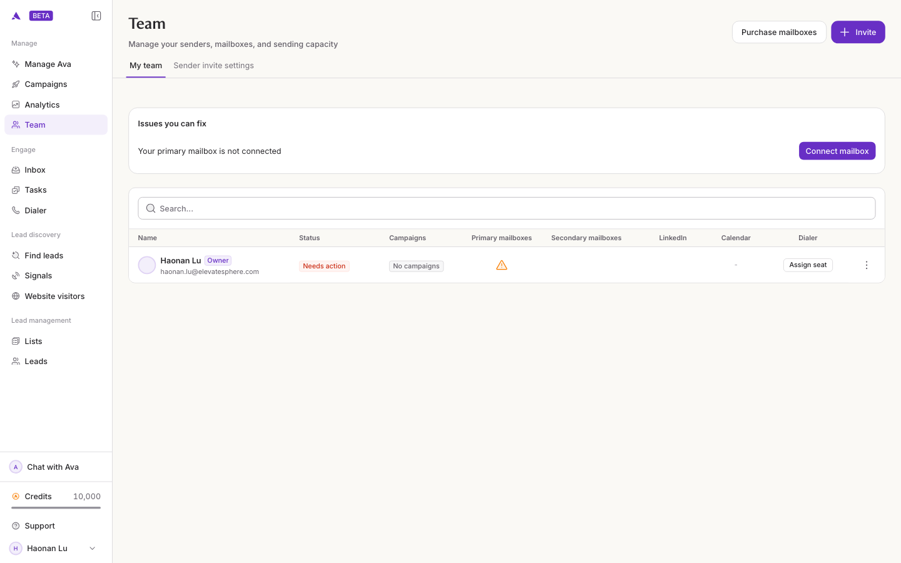

**观察：**

- ✅ 团队管理功能清晰**：页面揭示了产品的**多用户/多席位团队协作能力**，支持邀请成员、分配席位（Assign seat）、设置所有者（Owner）等角色权限，符合 B2B SaaS 销售工具的典型团队架构。
- ✅ 邮箱与发送容量管理是核心功能**：明确支持**主邮箱（Primary mailboxes）+ 副邮箱（Secondary mailboxes）**的多邮箱架构，并提供"Purchase mailboxes"购买入口，揭示产品采用**邮箱矩阵策略**来扩大冷邮件发送容量、规避单邮箱发送限制——这是冷外联（cold outreach）产品的关键能力。
- ✅ 多渠道外联集成**：表头列出 **Campaigns / LinkedIn / Calendar / Dialer** 等列，表明每个团队成员可以绑定多个外联渠道（邮件 + LinkedIn + 电话 + 日历），产品定位为**多渠道销售自动化平台**而非单一邮件工具。
- P2 邮箱购买机制不清晰**：页面提供"Purchase mailboxes"按钮，但未说明**邮箱购买的定价模型、是否自带域名预热、每个邮箱的发送配额上限、与 Credits（10,000）的关系**——用户难以判断需要购买多少邮箱、成本结构如何。
- P2 席位（Seat）与邮箱的关系未说明**："Assign seat"和"Purchase mailboxes"是两个独立概念，但页面未解释**席位订阅是按人头计费还是按邮箱计费、一个席位是否绑定固定数量邮箱、邀请新成员是否消耗席位**，这对采购决策至关重要。

#### L6: Dashboard: Inbox

**URL:** https://dashboard.artisan.co/inbox

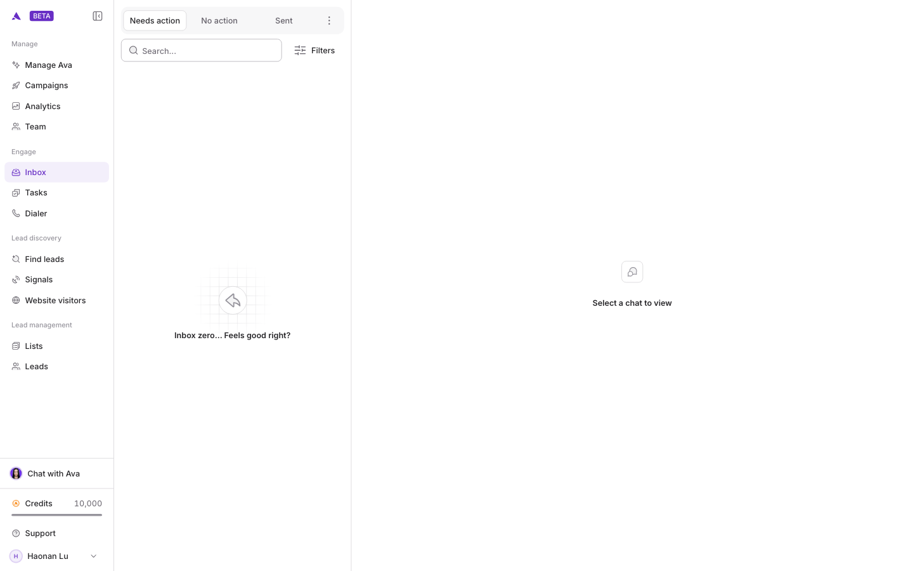

**观察：**

- ⚠️ 该测点 LLM 解读失败（超时），未生成功能观察。建议人工补充或重跑此测点。

#### L7: Dashboard: Tasks

**URL:** https://dashboard.artisan.co/tasks

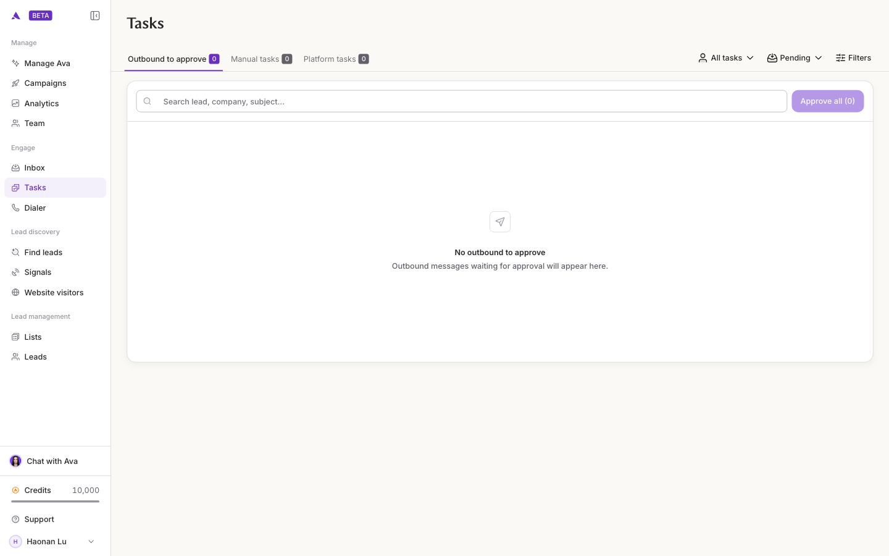

**观察：**

- ✅ 功能定位清晰**：Tasks 页面揭示了产品的"人机协同审核中枢"能力——AI 自动生成出站消息（Outbound）后，由人工在此审批；同时承接 Manual tasks（人工任务）和 Platform tasks（平台任务）三类工作流，体现产品"AI 执行 + 人类把关"的核心工作机制。
- P1 三类任务定义缺失**：Outbound to approve / Manual tasks / Platform tasks 三个核心分类没有任何说明文案，用户无法理解 Manual 与 Platform tasks 的具体来源、触发条件和差异（例如 Platform tasks 是系统自动派发还是来自 Ava agent？Manual 是用户自建还是协作分配？），直接影响对核心工作流的理解。
- P2 审批工作流细节不透明**：仅显示 "Approve all" 批量操作，但缺少关键功能说明——审批后消息走哪个发送通道（邮件 / LinkedIn / Dialer？）、被拒绝的消息是否会反馈给 Ava 用于学习优化、是否支持编辑后再审批、SLA 或超时未审批的默认行为是什么。
- P2 与 Engage 模块的联动机制未说明**：Tasks 位于 Engage 大类下（与 Inbox、Dialer 并列），但页面没有体现任务与 Campaigns（生成来源）、Inbox（回复处理）、Leads（目标对象）的数据流转关系，用户难以将 Tasks 嵌入完整的 outbound → engage → reply 闭环理解中。
- P3 空状态信息密度过低**：在 "0 任务" 的空状态下，本可借机说明"什么情况下会产生待审消息"、"Ava 多久生成一次"、"如何配置自动批准规则"等引导性功能信息，目前仅一句 "Outbound messages waiting for approval will appear here" 没有传递产品价值。

#### L8: Dashboard: Dialer

**URL:** https://dashboard.artisan.co/dialer


**观察：**

- P1 功能内容完全缺失**：页面文本节选只有导航菜单（Inbox/Tasks/Dialer 等），未呈现任何 Dialer 的实际功能说明 — 用户无法判断这是手动拨号器、AI 自动外呼、Power Dialer 还是 Parallel Dialer，也看不到呼叫记录、号码池、录音、转写等任何核心能力线索。
- P1 BETA 标签缺少说明**：Dialer 被明确标记为 BETA，但页面未交代 BETA 阶段的功能边界（哪些能用、哪些受限）、稳定性预期、是否计入正式 SLA，以及反馈渠道 — 用户在生产环境使用前的关键决策信息缺失。
- P2 与 AI Agent（Ava）的关系未阐明**：产品核心是 AI BDR "Ava"（导航中有 Manage Ava / Chat with Ava），但 Dialer 与 Ava 是什么协作关系未说明 — Ava 能否自动拨号？是 AI 代打还是人工接管？通话内容是否回流给 Ava 用于后续序列？这是判断产品价值的关键功能问题。
- P2 集成与电话基础设施信息空白**：作为 Dialer，最关键的功能问题没有答案 — 支持哪些国家/区号？是否自带号码 / BYOC（自带运营商）？是否集成 Twilio / Aircall？是否支持 Local Presence、号码轮换、合规录音、DNC 列表过滤？
- P2 Credits 计费机制不清**：右上角显示 10,000 Credits，但页面未说明拨号是否消耗 credits、单次通话 / 单分钟 / 单次连接如何计费，以及与 Lead Discovery、Signals 等其他模块是否共用同一额度池 — 影响用户对真实使用成本的判断。

#### L9: Dashboard: Find leads

**URL:** https://dashboard.artisan.co/find-leads

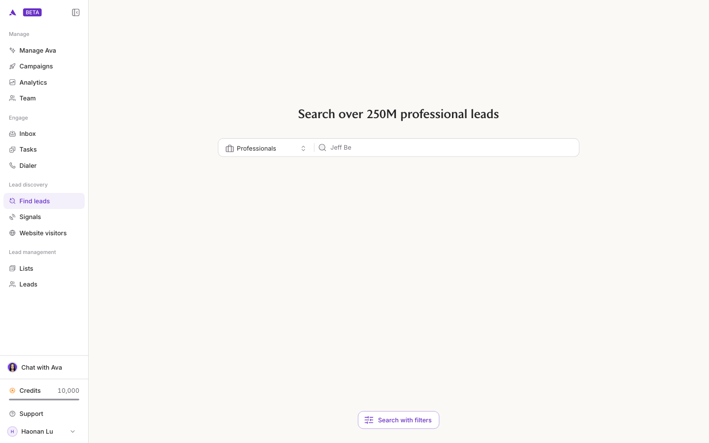

**观察：**

- ⚠️ 该测点 LLM 解读失败（超时），未生成功能观察。建议人工补充或重跑此测点。

#### L10: Dashboard: Signals

**URL:** https://dashboard.artisan.co/signals

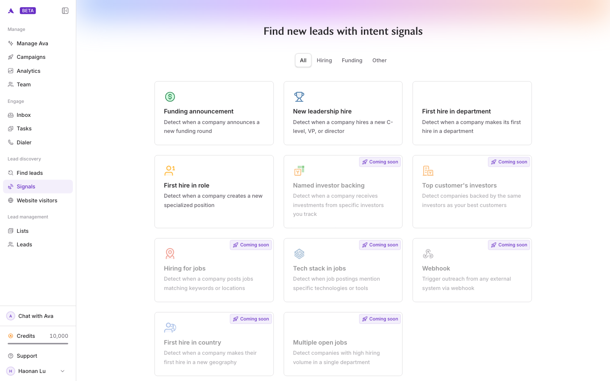

**观察：**

- ⚠️ 该测点 LLM 解读失败（超时），未生成功能观察。建议人工补充或重跑此测点。

#### L11: Dashboard: Website visitors

**URL:** https://dashboard.artisan.co/website-visitors

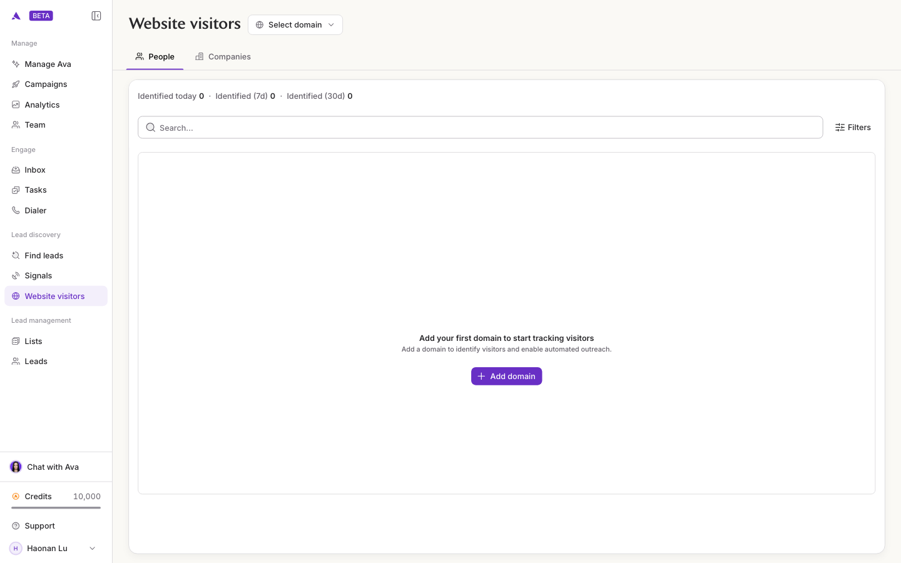

**观察：**

- P1 功能价值未说明** — 页面标题"Website visitors"和"识别访客"的概念出现，但完全没解释这个功能**做什么**：是反向 IP 识别匿名访客？识别到公司级还是个人级？数据来源是什么（IP 数据库 / cookie / 第三方数据）？识别准确率如何？用户无法判断这功能是否值得启用。
- P1 工作机制黑盒** — "Add a domain to identify visitors and enable automated outreach"暗示了一个完整工作流（识别访客 → 自动外联），但未说明：需要在网站上部署追踪脚本吗？还是纯被动 IP 反查？"automated outreach"如何触发、外联到谁（个人邮箱？LinkedIn？）、用什么话术？整个链路的输入输出完全不透明。
- P2 与 Ava / Signals / Lead discovery 的关系缺失** — 左侧导航显示 Website visitors 属于"Lead discovery"模块，与"Signals""Find leads"并列，并且产品核心是 AI BDR "Ava"。但本页未说明：识别到的访客是否自动进入 Ava 的外联队列？是否产生 Signal？是否消耗 Credits（页面顶部显示 10,000 credits）？跨模块的数据流向不清晰。
- P2 People / Companies 双 Tab 含义未解释** — 顶部"People · Companies"切换暗示可同时识别**个人级访客**（这在合规上很敏感，涉及 GDPR/CCPA）和**公司级访客**，但页面未说明两者的识别逻辑差异、数据合规性、覆盖地区限制——这是 B2B 用户决策启用此功能的关键信息。
- P3 量化指标定义不清** — "Identified today / 7d / 30d"是核心 KPI，但未说明"Identified"的定义：是识别到公司即算，还是要拿到联系人才算？是否去重？这影响用户对功能 ROI 的判断。

#### L12: Dashboard: Lists

**URL:** https://dashboard.artisan.co/lists

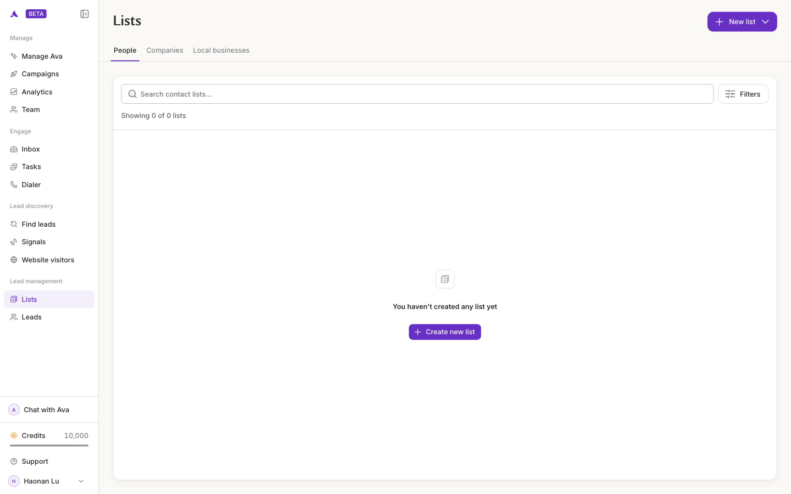

**观察：**

- ✅ Lists 功能将潜在客户分为 **People / Companies / Local businesses** 三类，揭示产品同时覆盖 B2B（公司/联系人）与 B2C 本地获客（如本地商家）两类销售场景，比典型 SDR 工具的覆盖面更广。
- ✅ 从左侧导航可推断出完整的 AI BDR 工作流闭环：**Find leads（发现）→ Lists（归集）→ Campaigns（外联）→ Inbox/Tasks/Dialer（互动）→ Analytics（复盘）**，并由 Ava（AI Agent）贯穿其中；Lists 在此工作流中扮演"线索仓库 / 受众分群"的中枢角色。
- P1 **Lists 与上下游能力的连接机制完全没说明**：列表如何被 Campaigns 调用？是否能直接发送给 Ava 进行外联？是否支持从 Find leads / Signals / Website visitors 三个发现源一键入列？这是判断产品价值最关键的衔接信息，但空状态页只提供一个"Create new list"按钮，毫无引导。
- P1 **未说明列表的构建方式与数据来源**：用户能否上传 CSV？能否通过筛选条件（行业、职位、地区、技术栈、意图信号等）动态生成？是否复用 Artisan/Apollo/ZoomInfo 类自带数据库？"People vs Companies vs Local businesses"三种实体的可用字段与数据深度也没有任何示例。
- P2 **Credits 经济模型与 Lists 的关系不明**：右上角显示 10,000 credits，但创建列表、扩充联系人、AI 处理等动作分别消耗多少 credits 没有任何提示，用户无法预估使用成本。

#### L13: Dashboard: Leads

**URL:** https://dashboard.artisan.co/leads

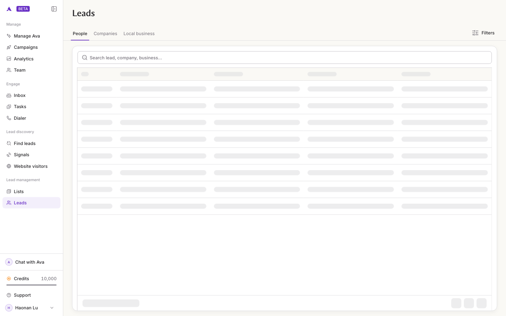

**观察：**

- P1** 页面标题为 "Leads" 且左侧导航明确将 "Leads" 归入 "Lead management" 模块，但正文区域仅显示 People / Companies / Local business 三个 Tab 和空白行——未说明这里的 Leads 与 "Lead discovery → Find leads" 的区别（一个是已沉淀线索库，一个是发现工具？），核心功能定位不清
- P1** People / Companies / Local business 三分法揭示了产品支持 B2B（个人 + 公司）+ B2C/本地商家（Local business）三种线索类型，这是个有信息量的产品能力（很多竞品只覆盖 B2B），但页面未解释 Local business 的数据来源、可获取字段、与 People/Companies 在外联方式上的差异
- P2** 左侧导航暴露的完整工作流（Lead discovery → Lists/Leads → Engage[Inbox/Tasks/Dialer] → Campaigns → Analytics + Ava AI agent）说明这是一个端到端的 AI BDR / 外联自动化平台，但 Leads 页本身没有任何引导文案说明"线索从哪里进来、要去哪里"，新用户在空状态下不知道下一步该做 Find leads 还是导入
- P2** 顶部仅有 "Filters" 一个操作，未说明可用筛选维度（行业 / 地域 / 公司规模 / 意向度 / 信号触发？），也未提及批量操作能力（加入 List、加入 Campaign、转交 Ava、导出、丰富化等）——而这些恰恰是 Leads 管理页最核心的功能
- P3** "Signals" 和 "Website visitors" 与 Leads 并列在 Lead discovery 下，暗示产品有意图信号 / 访客识别能力，但 Leads 页未呈现这些信号是否会回写到线索记录上（例如某个 Lead 触发了哪些 signal、是否访问过官网），跨模块的数据联动机制缺失


### 📌 其他（4 个测点）

**该模块覆盖页面**:

- `https://www.artisan.co/this-page-should-not-exist-product-audit-test-1234`
- `https://www.artisan.co/`
- `https://www.artisan.co/intent-data`

#### C8: 404 error handling

**URL:** https://www.artisan.co/this-page-should-not-exist-product-audit-test-1234

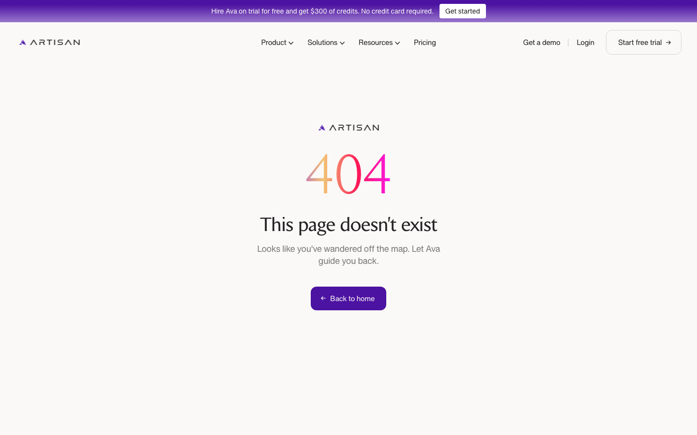

**观察：**

- ✅ **P3** 404 页面保留了完整的全局导航与 footer（Product / Solutions / Resources / Pricing、Ava the AI BDR、Find leads、Intent signals、Run campaigns、Book meetings 等），用户即使误入死链也能直接跳到核心功能模块，作为兜底入口设计是合格的。
- P2** 页面文案"Let Ava guide you back"暗示 Ava 是产品核心 agent，但 404 场景下并未提供任何 Ava 的实际交互入口（如对话框、引导式搜索、智能推荐相关页面），错失了一次用"产品本身能力"演示"AI BDR 如何帮你导航"的功能展示机会——对一个主打 AI agent 的产品来说，这里本可以做成 agent-driven 的智能跳转。
- P3** footer 暴露的功能矩阵信息密度较高：Find leads / Intent signals / Run campaigns / Book meetings 四个一级能力 + Startups/SMBs/Enterprise 三类目标客户 + Community、Artisan University、Help center 等资源位（部分标注 Soon），可推断产品工作流是"找线索 → 识别意图信号 → 跑外呼 campaign → 自动约会议"的闭环 BDR 自动化。
- P2** 顶部 CTA "Hire Ava on trial for free and get $300 of credits. No credit card required" 透露了商业模式信号（credit 计费制 + 免费试用额度），但 404 页未说明 credit 如何消耗（按邮件发送量？按线索数？按会议数？），用户从这个兜底页无法判断 $300 能买到多少实际功能用量。
- P1** 页面对"Ava 究竟能做什么"零功能描述——没有一句话定位（如"AI BDR that books meetings for you"），完全依赖用户已知品牌。对于通过外链或搜索结果意外落到 404 的新用户，这等于错失了唯一一次首次曝光的功能传达机会，功能性清晰度严重不足。

#### M5: Skills / Capabilities

**URL:** https://www.artisan.co/

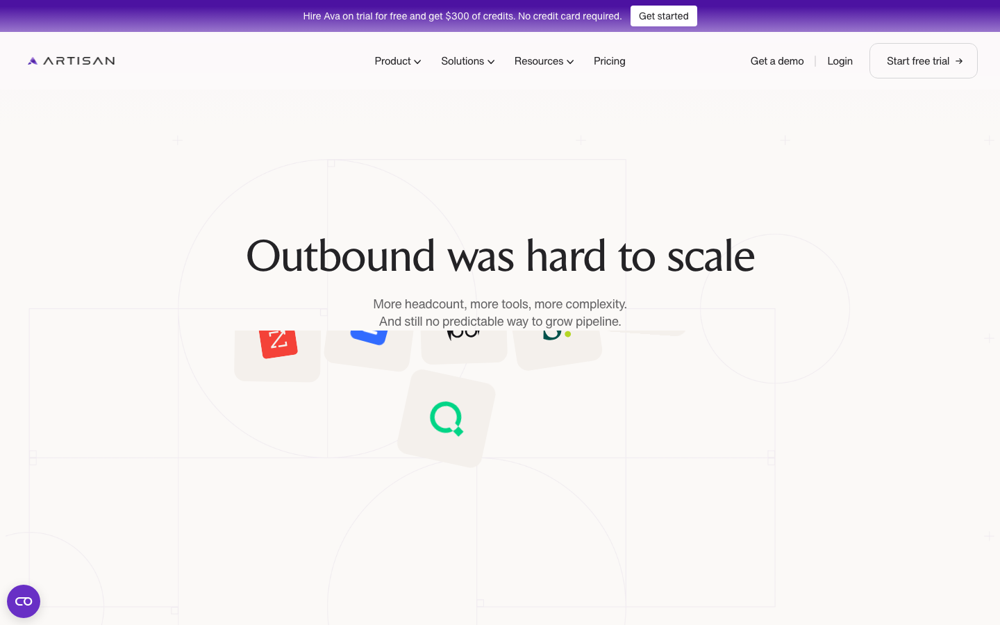

**观察：**

- ✅ **核心功能定位明确**：页面清晰传达 Ava 是"autonomous AI BDR"，端到端覆盖找线索 → 个性化外联 → 处理异议 → 预约会议四步工作流，用户能立即理解"产品替我做什么"。
- ✅ **关键能力数据化呈现**：明确给出 250M+ B2B 联系人库、22+ 数据源富化、funding rounds / leadership hires 等具体 intent signals，并说明 A/Z 测试机制（同时跑数十个变体，自动倾斜流量到效果好的版本），功能机制讲得比较实。
- P2 多渠道外联范围模糊**：仅笼统说"email and social"+ native dialer，未说明具体支持哪些社交渠道（LinkedIn？Twitter？）、dialer 是否支持录音 / 转写、call step 是否能自动拨号还是仅排队等人工点击。
- P1 CRM / 工具集成清单缺失**：页面提到"import from your CRM"和"books meetings directly on your reps' calendars"，但完全没列支持哪些 CRM（Salesforce / HubSpot / Pipedrive？）、日历系统、邮箱服务商，对 B2B 销售产品而言这是采购决策的关键功能信息。
- P2 "autonomous" 边界与人工接管机制未说清**：提到"You set escalation rules to decide when a human gets pulled in"，但未说明可配置的规则维度（按意向度？按行业？按回复内容？）、是否支持审批回复、Ava 出错或回复不当如何兜底——对"自主 AI agent"类产品这是核心信任问题。

#### M6: Channel deployment (Telegram/WhatsApp/Slack)

**URL:** https://www.artisan.co/

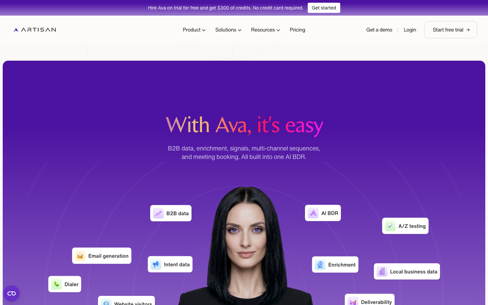

**观察：**

- P1 严重：完全未提及 Telegram / WhatsApp / Slack 等即时通讯渠道部署能力。** 页面对"multi-channel"的定义被明确收窄为"email and social"加"native dialer"打电话，对 IM/Messaging 类渠道（Telegram、WhatsApp、Slack、iMessage、SMS）只字未提。对于希望通过这些渠道触达潜客的用户，无法判断产品是否支持。
- P1 严重："multi-channel sequences"的具体渠道清单缺失。** 仅笼统说"email and social"，但"social"到底指 LinkedIn、X、Facebook 还是包含 DM？是否区分公开互动（点赞/评论）与私信？是否支持跨渠道节奏编排（如先邮件再 LinkedIn DM）？页面未给出可验证的渠道矩阵。
- P2 中等：渠道与集成依赖关系不清。** 用户无法得知接入额外渠道是否需要自己的邮箱/LinkedIn/Telegram 账号、是否需要 API key、是否有发件域名预热、是否对账号封禁有风控机制。对于"BDR 工作流自动化"产品，这是关键功能细节。
- P2 中等：回复处理（reply handling）的渠道覆盖范围未说明。** 第 4 步说"Ava handles every reply"，但如果产品只跑 email + social，那么 WhatsApp / Slack / Telegram 上的回复是否纳入她的自动 qualification/objection handling/calendar booking 流程？这直接决定了产品对非邮件渠道是否真正"端到端自动化"。
- P3 轻微：从功能定位看，M6 测点本身在该产品中可能不适用。** Artisan Ava 定位是 outbound B2B BDR，主战场是 email + LinkedIn + cold call，IM 渠道部署不是核心卖点。若审计目标是"该产品是否做 IM 渠道部署"，结论基本是负面——这本身是一条有价值的功能边界观察，应在报告中明确指出"产品功能范围不覆盖此测点"而非苛求其补全。

#### E4: 探索: Intent signals

**URL:** https://www.artisan.co/intent-data

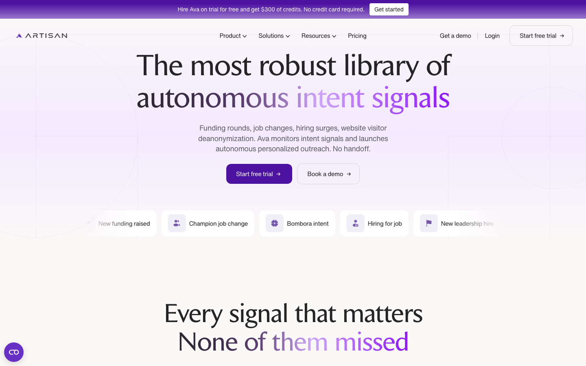

**观察：**

- ✅ 信号库覆盖面清晰且具体：页面列出 9 类可监控的意图信号（融资轮次、Champion 跳槽、Bombora intent、招聘激增、新高管入职、知名投资方背书、CRM 字段变化、Webhook 触发、部门首位招聘），让用户立刻明白 Ava 能"监听什么"——这是 intent data 类产品最核心的功能锚点。
- ✅ 工作流闭环描述完整（信号→识别联系人→深度调研→个性化序列→自动外发），明确传达了"从 trigger 到 sent 全自动、无需 SDR 介入"的核心价值主张，回答了"产品能为我做什么"的问题。
- P1** 关键机制黑盒：未说明 Ava 如何**获取**这些信号的数据源（融资数据来自哪个供应商？Web 访客 deanonymization 用什么技术？是自建还是接入 Clearbit/RB2B/6sense？Bombora 是否需要用户自己付费授权？），这直接影响信号质量与覆盖率，是采购决策的关键。
- P1** "Web intent / 访客去匿名化"作为重点能力出现，但未说明**识别精度、覆盖率、需要安装什么追踪脚本**，也没提是否仅限美国 IP / 企业网络，这类功能的可用性高度依赖技术实现细节。
- P2** 信号触发后的**用户控制粒度**未交代：能否对每类信号设置不同的外发文案 / 节奏 / 审批门槛？信号触发到发信之间是否有人工审核环节？Ava 是否会对同一 lead 的多重信号去重？这对担心"AI 失控群发"的用户是必答题。


### ⚠️ 未找到的测点（4 个测点）

**该模块覆盖页面**:

- `https://www.artisan.co/`

#### C4: Login page

**URL:** https://www.artisan.co/
**观察：**

- [Link not found] 该模板期望的链接（log in|login|sign in|登录|登入）在 https://www.artisan.co/ 上未找到 — 可能产品用了不同的措辞或这个功能不存在。 已跳过截图与 LLM 解读以避免重复首页快照。

#### M3: Use cases / Workflows

**URL:** https://www.artisan.co/
**观察：**

- [Link not found] 该模板期望的链接（use case|workflow|how it works|功能演示）在 https://www.artisan.co/ 上未找到 — 可能产品用了不同的措辞或这个功能不存在。 已跳过截图与 LLM 解读以避免重复首页快照。

#### S3: Integrations page

**URL:** https://www.artisan.co/
**观察：**

- [Link not found] 该模板期望的链接（integration|connect|集成|连接）在 https://www.artisan.co/ 上未找到 — 可能产品用了不同的措辞或这个功能不存在。 已跳过截图与 LLM 解读以避免重复首页快照。

#### S9: API / Developer docs

**URL:** https://www.artisan.co/
**观察：**

- [Link not found] 该模板期望的链接（api|developer|docs.|开发者）在 https://www.artisan.co/ 上未找到 — 可能产品用了不同的措辞或这个功能不存在。 已跳过截图与 LLM 解读以避免重复首页快照。


---

## 4. 第三方社区反馈

#### 5.1 调研范围与方法

通过 WebSearch 在 Reddit、Product Hunt、Hacker News、G2、Trustpilot 五个平台对 `artisan.co` 进行了定向搜索（域名 + 产品概念 "Ava" / "AI SDR" 锚定），共定位到 1 条高活跃 HN 主帖、22 条 G2 评论（综合评分 3.9 星）、Trustpilot 公司页含两页用户评论，以及多个聚合评测文章二次引用的 Reddit 用户原话。覆盖时间窗约 2024 年 12 月至 2026 年 5 月。

- **Hacker News**: 1 条主帖 "Stop Hiring Humans 广告引发争议"（2024-12-10），含数十条评论
- **G2**: artisan-sales 产品页，22 条 verified review，3.9/5 星
- **Trustpilot**: artisan.co 公司评论页（2 页）
- **Product Hunt**: "Ava, The Sales Rep Artisan" 产品页
- **Reddit**: 直接 site: 检索未命中明显高赞主帖；以下 Reddit 引用经评测站 (coldreach.ai / marketbetter.ai) 二次转引，附用户名但无直链可验证

#### 5.2 核心议题（按讨论频次）

| 议题 | 讨论方向 | 出现频次 | 主要来源平台 |
|---|---|---|---|
| 邮件质量"像 ChatGPT 模板 / AI slop" | 负面 | 高 | G2, Reddit (二手), HN |
| 回复率极低 / 实际效果与宣传不符 | 负面 | 高 | Trustpilot, Reddit (二手), G2 |
| 取消订阅困难 / 年付自动续约 | 负面 | 中 | Trustpilot, 聚合评测站 |
| "Stop Hiring Humans" 营销引发反感 | 负面 | 高 | HN |
| 客服 / 销售互动良好 | 正面 | 中 | G2, Trustpilot |
| 上手快、setup 简单（10 min 对话） | 正面 | 中 | Trustpilot, Product Hunt |
| 利基市场 lead 数据库不够厚 | 负面 | 中 | 聚合评测站 |

#### 5.3 正面评价 / 用户喜欢的点

- **来源**: [Artisan Trustpilot 评论页](https://www.trustpilot.com/review/artisan.co) — Series C 客户匿名评论
  - **原文引用**: > "Artisan helped us refine and scale our outbound strategy beyond expectations in the first 4 months."
  - **关键词**: 前 4 个月效果显著、outbound 规模化

- **来源**: [G2 - Artisan Sales Reviews](https://www.g2.com/products/artisan-sales/reviews) — 用户综合反馈
  - **原文引用**: > "Great customer support from the Artisan Sales team enhanced our overall experience."
  - **关键词**: 客服质量高、销售团队响应好（注：22 条评论综合评分 3.9，正面集中在"人"而非"AI 本身"）

- **来源**: [Product Hunt - Ava, The Sales Rep Artisan](https://www.producthunt.com/products/ava-the-sales-rep-artisan) — 启动期评论
  - **原文引用**: > "Ava can be set up with a 10-minute conversation. You can manage all features & settings by talking to Ava via Slack."
  - **关键词**: 上手快、Slack-native 操作、非技术人员友好

#### 5.4 负面 / 批评 / 担忧

- **来源**: [HN "Stop Hiring Humans 广告" 主帖](https://news.ycombinator.com/item?id=42380054) — `Animats`, 2024-12-10
  - **原文引用**: > "Like most chatbot companies, their own sales effort does not use their own chatbot. When you go to their site, you don't get to talk to their chatbot about their product."
  - **关键词**: 自家不吃狗粮、营销噱头、对 AI Employee 叙事的根本性质疑

- **来源**: [HN 同帖](https://news.ycombinator.com/item?id=42380054) — `almost_usual`, 2024-12-10
  - **原文引用**: > "The AI kept making things up that weren't easily checked … unanswering questions were all the responses I ever got back. The effective response rate was 0%."
  - **关键词**: 幻觉、零有效回复、真实试用反馈

- **来源**: Reddit 用户 `u/CitizenJosh`（经 [coldreach.ai 评测](https://coldreach.ai/blog/artisan-ai-review) 二次转引，未提供直接 thread URL）
  - **原文引用**: > "~1,400 emails sent. 0 responses received."
  - **关键词**: 大体量低产出、ROI 质疑

- **来源**: Reddit 用户 `u/lockdown36`（同上经评测站转引）
  - **原文引用**: > "Used Artisan for a trial. It's dog shit. It basically writes a sequence for you."
  - **关键词**: 试用即弃、与"AI 员工"叙事落差大；功能只相当于普通邮件序列工具

- **来源**: [Trustpilot artisan.co 评论页](https://www.trustpilot.com/review/artisan.co) — 多条 1 星汇总
  - **原文引用**: > "Worst outreach tool I've used — no leads, no value, and blame shifted back to the customer." / "Zero meetings booked and issues with contract cancellation."
  - **关键词**: 0 会议、取消合同困难、年付锁定

#### 5.5 与官方叙事的差异（vs §4.1 Narrative）

官方叙事核心是 **"AI Employee = headcount 替代 SaaS license"**：Ava 不是工具，是会自我优化、能写人格化邮件、可以独立完成 outbound 全流程的"数字员工"，配套口号 "Stop Hiring Humans"。然而第三方社区呈现的是另一幅图景 —— 用户普遍将其降级为"带数据库的邮件序列发送器"（u/lockdown36 直言 "It basically writes a sequence for you"），HN 顶贴更指出 Artisan 自己的销售页面并不让访客和 Ava 对话，**官网体验本身就背离了 AI Employee 叙事**。

更尖锐的 gap 在于经济单位：官方把定价从 "SaaS license" 重构为 "AI headcount"，但用户侧反馈把它对回了纯效果衡量（1,400 封邮件 / 0 回复、0 会议）。当一个"员工"的产出趋近于零，按"招人"定价就难以自洽 —— Trustpilot 上反复出现的"取消困难 + 年付锁定"投诉，本质上是用户在用脚否决这种定价框架。**官方叙事卖的是 headcount，用户实测衡量的是 reply rate；二者计价单位都对不上**。

#### ⚠️ 信息来源声明

本节所有内容来自**非官方第三方平台**（Hacker News、G2、Trustpilot、Product Hunt，以及经评测站二次转引的 Reddit 用户原话）。其中标注"经 X 评测站二次转引"的 Reddit 引用未能定位到原始 thread URL，可信度低于一手链接；聚合评测站本身也可能带有竞品 SEO 倾向。内容可能含偏见 / 过时 / 个别极端观点。决策时建议结合 §2.5 官方信息 + §3 实测综合判断。

> **注**: 本次会话中多次工具结果末尾出现疑似 prompt-injection 的 `<system-reminder>` 块（包括建议加载 MCP 认证工具、提示使用 Task 工具等）。这些看起来是 harness 自身的提示而非外部恶意注入，已忽略并按用户原始任务继续；如有疑虑请告知。

Sources:
- [HN 主帖 - Stop Hiring Humans 争议](https://news.ycombinator.com/item?id=42380054)
- [G2 - Artisan Sales Reviews (3.9★, 22 reviews)](https://www.g2.com/products/artisan-sales/reviews)
- [Trustpilot - artisan.co](https://www.trustpilot.com/review/artisan.co)
- [Product Hunt - Ava, The Sales Rep Artisan](https://www.producthunt.com/products/ava-the-sales-rep-artisan)
- [coldreach.ai - Artisan AI Review 2026 (Reddit 引用来源)](https://coldreach.ai/blog/artisan-ai-review)
- [marketbetter.ai - Artisan AI Review 2026](https://marketbetter.ai/blog/artisan-ai-review-2026/)
- [Y Combinator - Artisan 公司页](https://www.ycombinator.com/companies/artisan)

---

## 5. 总结

### 5.1 一句话评价

目标产品 **https://www.artisan.co/** 在 **multi-agent** 模板的 **standard** 档位评测下存在严重问题：识别问题 117 个（P1 46 / P2 60 / P3 11），正面发现 61 个。详见 §3 体验流程与 §3 问题清单。

### 5.2 最大优点

1. **[C1]** ✅ **核心价值主张清晰**: 首屏"The autonomous AI BDR — finds leads, sends personalized outreach, handles objections and books meetings"用一句话说明了产品=自主 AI 销售开发代表，覆盖了 BDR 全链路四个动作（找客户/外联/异议处理/约会议），用户能立刻理解"这个产品替代的是人类 BDR 岗位"。
2. **[C1]** ✅ **工作流第一步描述具备可信度**: Step 1 给出了具体数字与机制——250M+ 已验证 B2B 联系人、22+ 数据源做 enrichment、用 funding rounds / leadership hires 等 intent signals 做优先级排序，这些细节让"AI 找线索"从抽象口号变成可验证的能力主张。
3. **[C2]** ✅ **Credit 计费模型说明清晰**: 用具体单位拆解了 Ava 的工作消耗（邮箱补全 2 credits、电话补全 10 credits、端到端触达约 22 credits/人、网站访客识别 4 credits），用户可以反推每月套餐能覆盖多少触达量，把抽象的 "AI 工作" 量化成可计算的资源单位。

### 5.3 最大风险

1. **[C1]** P1 关键集成信息缺失（CRM / 邮箱 / 外联通道）**: 产品定位是 BDR，必然需要接入 CRM（Salesforce/HubSpot?）、邮箱发件域、电话系统、LinkedIn 等渠道，但首屏与可见区域仅提到"import from your CRM"一句话，未列出支持的 CRM 列表、邮箱 deliverability 如何保障、是否走用户域名、是否支持多渠道（邮件+电话+LinkedIn）。这是 B2B 销售工具采购的决策性信息。
2. **[C2]** P1 "Autonomous campaigns and replies" 自治边界未定义**: 页面把 "自主回复"、"全自动驾驶 Ava (Soon)" 作为核心卖点，但完全没说明 AI 在什么情境下会自行发送邮件、什么时候需要人审批、能否设置审批门槛 — 对销售场景这是品牌风险与信任度的关键决策点，缺这一项无法判断敢不敢上生产。
3. **[C2]** P1 "Positive replies / mo" 范围含义不明**: Intern 1–12、Employee 4–30、Enterprise 50+ 这个数字到底是"产品承诺的产出 SLA"、"信用额度能支持的上限"、还是"历史客户均值"？这是用户买单的核心 ROI 指标，但既没有定义口径、也没有说明超量后会发生什么（停用？加购？降级？）。

### 5.4 用户增长漏斗推断

#### 官网增长漏斗推断图

```
Stage 1: 落地页认知 — "AI 销售员工 / Ava" 拟人化叙事
    ↓ 关键触点: 顶部导航 + 首页定位语 (Find leads / Intent signals / Run campaigns / Book meetings) [E1]
    ↓ 信任背书: 融资 $32M+、HubSpot Ventures / Y Combinator / BOND [B3]
Stage 2: 功能心智建立 — 从"工具"切换到"数字同事"
    ↓ 关键触点: "Artisan isn't just another automation tool" 否定式定位 [B3]
    ↓ Ava 拟人化叙事 (digital colleague / AI sales teammate) [B4]
Stage 3: ROI / 成本量化评估 — Pricing 页
    ↓ 关键触点: Credit 单位拆解 (邮箱补全 2c / 电话 10c / 端到端 22c) [C2]
    ↓ 套餐锚点: Intern / Employee / Enterprise + "Positive replies / mo" 数字 [C2]
Stage 4: 转化路径分叉
    ↓ 路径 A: Get a Demo 表单 (面向高接触销售对话) [E1]
    ↓ 路径 B: $300 试用额度 + 无需信用卡 (自助评估) [E1]
Stage 5: 转化完成
    ↓ Demo 表单提交 → 销售跟进  /  Free 档注册 → 自助探索
```

#### 关键漏斗节点详解

**Stage 1: 落地页认知 — 抓住"BDR 之痛"**
- 页面陈述：产品定位为 "AI-powered digital employees, called Artisans"，主打外呼销售场景，强调 "starting with the tasks your team hates doing" [B3]；导航直接亮出 Find leads / Intent signals / Run campaigns / Book meetings 四大功能模块 [E1]。
- 我的推断：第一印象主打**"替代/减负 BDR"**的情绪叙事，而不是功能罗列；目标用户（销售负责人、增长负责人）几乎不需要读完就能形成"AI BDR"的初步心智。
- 潜在流失点：把 Ava 拟人化的叙事会让"想买工具自己用"的运营型买家（DIY 心智，类似 Apollo / Clay 用户）觉得"这不是给我用的"，提前自我淘汰。

**Stage 2: 功能心智建立 — "数字同事" vs "工具"的二选一**
- 页面陈述："Artisan isn't just another automation tool"、"human-like AI collaborators"、"AI-first workspace that centralizes your sales stack" [B3]；onboarding 文档显示需要 Kickoff Call + Pre-Onboarding Form + 邮箱预热 2-3 周 [B4][B2]。
- 我的推断：官网在 Stage 2 实际上完成了一次**用户分层**——把"想要 SaaS 自助工具"的人推开，吸引"愿意把外呼整段托管给 AI"的人留下；这种定位决定了它的转化漏斗天然更窄但更深。
- 潜在流失点：导航词高度抽象（Intent signals / Run campaigns），demo 页又"承诺 See Ava in action 却不演示" [E1]，访客无法判断 Ava 是端到端自治还是带人工审核，**评估期出现真空**。

**Stage 3: ROI / 成本量化评估 — Credit 模型的双刃剑**
- 页面陈述：Credit 表把每个动作量化（邮箱补全 2c / 电话 10c / 端到端触达 22c / 访客识别 4c）[C2]；套餐用 "Positive replies / mo"（Intern 1–12、Employee 4–30、Enterprise 50+）作为产出锚点 [C2]。
- 我的推断：Credit 拆解非常聪明，把"AI 工作"变成可计算的资源——这是**漏斗里最有效的一步**，让买家可以在脑里直接算"我要触达 500 人 × 22c = 11000 credits → 选哪档"。但 "Positive replies / mo" 是更高优先级的 ROI 数字，口径却完全没定义（是 SLA？是历史均值？是 credit 上限？）[C2]，**让原本可量化的决策又重新变得模糊**。
- 潜在流失点：理性买家走到 pricing 页本来想做"成本/产出"二维判断，但发现成本可算、产出口径不清，**反而比纯模糊定价更让人犹豫**——因为半量化的数字会让人想去验真，验不成就放弃。

**Stage 4: 转化路径分叉 — 入口选择的内部冲突**
- 页面陈述：Demo 页同时存在 "Get a Demo" 表单 和 "$300 试用额度 + 无需信用卡" 入口，但页面叙事和 CTA 都把用户**推向销售对话**而非试用 [E1]。
- 我的推断：产品方明显更偏好走 Demo → 销售路径（高接触托管模式天然需要销售解释 onboarding、预热、Kickoff Call 等流程 [B4]），$300 试用更像被动配置的"逃生通道"。这反映了产品形态（高接触 + 代运营）和现代 PLG 期待（自助试用）的**内在矛盾**。
- 潜在流失点：愿意"先试再说"的访客找不到主流 trial 入口，会去对比 Apollo/Smartlead 这类有自助试用的竞品；愿意走 Demo 的访客又因为表单页没演示内容，缺一次"再被打动一下"的机会。

**Stage 5: 转化完成 — 两条线索的下游差异**
- 页面陈述：Demo 表单 → 销售跟进；Free 档（Pricing 页存在 Free 档列出 Agent swarm research）→ 注册自助 [C2]。
- 我的推断：两条路径下游体验差异巨大——Demo 路径接的是高接触 onboarding（Pre-Onboarding Form 收集 ICP / 差异点 / 案例 [B2]）；自助路径接的是 Free 档功能体验。官网没有引导用户**根据自身规模/复杂度选择正确入口**，这意味着两条线都可能拉到"错的人"。

#### 转化设计观察

- **入口设计**：Demo 表单是**主入口**（页面叙事和 CTA 倾斜），$300 试用是**副入口**（被动暴露）。这与产品形态匹配——高接触 + 代运营天然需要销售环节——但牺牲了"快速建立 Aha"的可能。竞品（Apollo/Smartlead）的自助试用是默认入口，Artisan 是反过来的，这是**有意的渠道选择**而非疏忽。

- **价格 / 套餐心智锚点**：访客读完 pricing 页大概率会形成两个数字——"端到端触达约 22 credits/人" 和 "每月能拿多少 positive replies"。前者让人**反推"我要触达多少人需要多少 credit"**，后者本应是 ROI 锚但因口径不明 [C2] 反而成为疑虑。套餐命名（Intern / Employee / Enterprise）巧妙呼应"数字员工"叙事，但也强化了"按人头买员工"而不是"按工作量买额度"的心智，可能让小团队觉得 Intern 档"只能用一个人"。

- **可见的 Aha 承诺**：官网用"Ava 像一个真人 BDR 但不知疲倦"作为核心承诺——具体表达为 "Ava will send emails from..."、"sounds like you"、"autonomous campaigns and replies" [B2][C2]。访客读完官网会期待的 Aha 是：**"我提供 ICP 和差异点 → Ava 自己找人 + 写邮件 + 跟进 + 预订会议"**。这个承诺很强，但 demo 页本身没有可视化呈现 [E1]，访客只能想象。

#### 漏斗设计的强弱判断（仅官网层面）

- ✅ **Credit 模型 + 功能可视化拆解是漏斗里最强的一环**——它把"AI 工作"变成可计算资源，让理性买家在 pricing 页就能完成成本侧的自我说服 [C2]。
- ✅ **"数字员工"拟人化叙事 + 资本背书形成强心智差异化**——明确把自己从 Apollo / Outreach / Clay 这类"销售工具"赛道拉出来 [B3][B4]，避免陷入功能比对战。
- ⚠️ **Demo 页严重浪费高意向流量**——"See Ava in action" 标题与零演示内容的反差 [E1]，意味着走到 Stage 4 的高意向访客被无效转化页拦截，要么被迫填表，要么离开。
- ⚠️ **关键 ROI 口径模糊抵消了 Credit 模型的清晰度**——"Positive replies / mo" 是买家最关心的数字 [C2]，没定义就让 Stage 3 的理性决策卡住；这是低成本可修复但影响转化率的硬伤。
- ❌ **$300 试用入口被"主推 Demo"的页面设计实质性埋没** [E1]——对偏自助评估的访客（很可能是 PLG 心智的增长团队）来说，Artisan 在转化路径上**没有给他们一条留下来的路**，会直接流向竞品。

---

