# www.codebuddy.cn/work 产品深度体验报告

## 报告信息

| 项 | 内容 |
|---|---|
| 产品名称 | www.codebuddy.cn/work |
| 产品 URL | https://www.codebuddy.cn/work/ |
| 体验时间 | 2026-05-30T10:22:34.527949 |

---

## 目录

- [1. 核心结论](#1-核心结论)
  - [1.1 一句话判定](#11-一句话判定)
  - [1.2 主要风险](#12-主要风险)
  - [1.3 主要亮点](#13-主要亮点)
  - [1.4 综合评分](#14-综合评分)
- [2. 产品概览](#2-产品概览)
  - [2.1 基础信息](#21-基础信息)
  - [2.2 测点速览](#22-测点速览)
  - [2.3 产品 / 公司背景信息](#23-产品--公司背景信息)
  - [2.4 产品定位与策略](#24-产品定位与策略)
  - [2.5 公司基本信息](#25-公司基本信息)
- [3. 体验流程记录](#3-体验流程记录)
  - [3.1 官网叙事分析](#31-官网叙事分析)
  - [3.2 测点流程详情](#32-测点流程详情)
- [4. 第三方社区反馈](#4-第三方社区反馈)
- [5. 从访客到注册的转化路径](#5-从访客到注册的转化路径)

---

## 1. 核心结论

### 1.1 一句话判定

目标产品 **https://www.codebuddy.cn/work/** 在本次深度体验中：存在显著的功能信息缺口。详见 §3 体验流程记录。

### 1.2 主要风险

1. **[C1]** P1 关键集成机制缺失:销售洞察场景写"提供 CRM 中的销售管道与成交数据",但完全没说明 CRM 数据**如何接入**(手动导出上传?API 对接?支持哪些 CRM 系统?),同理"全平台·主流 IM"也未列出具体支持的 IM。涉及业务系统对接的核心场景缺了"怎么连进来",直接影响用户判断可行性。
2. **[C2]** P1 核心售卖单位"Credits"零解释**：全部套餐围绕"每月 500 / 2000 Credits"定价，但页面从不说明一次代码生成或一轮对话消耗多少 Credits、Credits 与实际工作量如何换算。用户无法判断 2000 Credits 是否够日常开发用、58 元/月到底买到多少产能，定价页最关键的"值不值"问题没有答案。
3. **[C2]** P1 各套餐功能差异无法辨别**：免费"个人体验版""个人专业版""企业旗舰版""企业专享版"列出的 feature 几乎完全一致——连免费版都罗列了 SSO、研效看板、成员统计、企业知识管理等企业功能。文本层面看不出各档究竟差在哪（除了 Credits 量和频率限制），违背定价页"帮用户选对档位"的根本目的。

### 1.3 主要亮点

1. **[C1]** ✅ 页面清晰揭示了核心产品形态:WorkBuddy 是"一人指挥、多 AI 专家并行执行"的 Agent 工作台,并用三大场景(OPC 一人公司 / 外部调研生成 / 业务数据洞察)+ 每个场景的"典型任务"具体说明了能干什么,读者基本能建立"召唤专家团→一句话指令→自主交付成果"的工作流认知。
2. **[C1]** ✅ 调研生成与内容生产两类场景的输入/输出闭环说得明确:给一个"主题/指令"→产出"调研报告 / PPT"、给"数据表格/日志"→产出"分析+优化建议报告",输入产物与交付物对应关系清楚,用户能预期拿到什么。
3. **[C2]** ✅ 产品能力矩阵列得较全**：读完能判断这是"IDE + 插件"形态的 AI 编程助手，核心能力清晰可辨——代码生成、代码实时续写、跨文件理解、注释生成代码，以及技术对话类（解释代码 / 检查修复 / 优化代码 / 生成提交信息 / 生成单元测试 / 知识库问答），企业侧还有 SSO、研效看板、企业知识管理、智能体配置、CloudAgents 等。

### 1.4 综合评分

| 维度 | 评分 | 1-2 句话说明（引用具体 [测点ID]） |
|---|---:|---|
| 产品方向清晰度 | 4.0 / 5 | WorkBuddy「一人指挥+100+专家并行执行」的定位一句话讲清，三大场景配"推荐用户/能力/典型任务"落地（[B1][C1][S4]）；但 CodeBuddy 与 WorkBuddy 的功能边界反复缺失，"开发到底用哪个"始终未界定（[C2][S2][S6]）。 |
| 价值主张表达力 | 4.0 / 5 | "传统 AI 对话 vs WorkBuddy"对比表与"像同事一样交付可验收成果"叙事鲜明有力，博客把功能锚定到具体痛点（[B1][S6]）；但"能力无限扩展""一个人顶一支团队"多停留在口号层（[C1][S4]）。 |
| 信息架构 | 3.0 / 5 | 文档页用四阶段 SDLC + 多形态产品矩阵表组织得当（[C7][S1]）；但注册/登录/集成/案例等多个预期页面缺失或回退首页，文档入口未承担"功能地图"导览、博客排序与重复条目混乱（[C3][C4][S3][S5][C7][S6]）。 |
| 功能广度与深度 | 3.5 / 5 | 能力覆盖面很广——编程矩阵、全流程 SDLC、Agent/SDK/Skills 工具链清晰可辨（[C2][C7][S6]）；但关键/差异化能力普遍只有"声明"无输入输出与工作机制，CloudAgents、跨文件理解、多专家编排等近乎黑盒（[C2][S1][S7]）。 |
| 核心能力可信度 | 2.5 / 5 | 软件开发场景的角色链路（PM→架构师→工程师→QA）较有说服力（[S2][S4]）；但页面无任何客户 logo、落地案例、证言或规模数据，CRM/数据接入机制与"多模型协同"全为黑盒，强能力宣称缺乏证据支撑（[S4][S5][C8][B1]）。 |
| 商业化清晰度 | 2.0 / 5 | 套餐与价格（如 58 元/月、500/2000 Credits）有结构，但核心售卖单位 Credits 零解释、各档功能几乎无差异（免费版也列 SSO/看板）、所购套餐覆盖哪个产品不明，定价页最关键的"值不值"无答案（[C2][B1]）。 |
| **综合平均** | **3.0 / 5** | **方向与表达清晰有力是亮点，但核心能力缺证据、定价/积分体系不透明是明显短板，整体处于"方向清楚、落地与商业化存疑"的合格偏上水平。** |

---

## 2. 产品概览

### 2.1 基础信息

- **URL**: https://www.codebuddy.cn/work/
- **首屏标题**: CodeBuddy

WorkBuddy

公测

定价

限时送

文档

博客

API文档

中国站
登录

下载

×
CodeBuddy
+
Work

### 2.2 测点速览

本次共体验 25 个测点。

> ⚠️ **登录后内容未覆盖**——用户选择不登录，本报告仅为公开页范围；产品登录后的工作台 / 实际操作未在本报告内。

### 2.3 产品 / 公司背景信息

共发现 **1** 个产品/公司的官方介绍页面：

#### B1: 背景 D1: 简介

**URL:** https://www.codebuddy.cn/docs/workbuddy/Overview

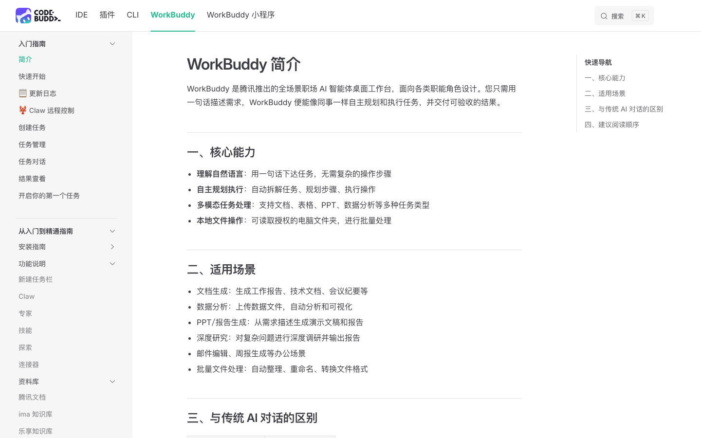

**背景信息：**

- ✅ **产品一句话定义清晰**：页面原文将 WorkBuddy 定义为"腾讯推出的全场景职场 AI 智能体桌面工作台，面向各类职能角色设计"，并强调"您只需用一句话描述需求，WorkBuddy 便能像同事一样自主规划和执行任务，并交付可验收的结果"——定位（桌面工作台）、归属（腾讯）、交互方式（一句话）、价值承诺（可验收结果）四要素齐全。
- ✅ **核心能力提炼为 4 条且边界明确**：①理解自然语言（一句话下达任务）；②自主规划执行（自动拆解、规划、执行）；③多模态任务处理（文档/表格/PPT/数据分析）；④本地文件操作（读取授权文件夹、批量处理）。其中"读取授权的电脑文件夹"点明了本地能力的权限前提，是同类产品较少明示的细节。
- ✅ **目标用户与场景覆盖完整**：面向"各类职能角色"，列举了文档生成（工作报告/技术文档/会议纪要）、数据分析与可视化、PPT/报告生成、深度研究调研、邮件编辑/周报、批量文件处理（整理/重命名/格式转换）等典型办公场景，场景颗粒度足以让读者自我对号入座。
- ✅ **差异化叙事用对比表直接呈现**：通过"传统 AI 对话 vs WorkBuddy"四行对比（只能对话→实际执行、手动操作文件→自动操作本地文件、单步骤简单任务→多步骤复杂任务、输出文字→交付可验收结果），把核心叙事压缩成"从'给建议'到'像同事一样干活并交付成果'"，主张鲜明。
- ✅ **关键术语含义自洽**："AI 智能体（Agent）""可验收的结果""像同事一样自主规划执行"构成本页核心概念，且彼此呼应——"智能体"对应自主性、"可验收"对应交付物、"像同事"对应协作隐喻，术语没有自我矛盾。
- P3 **侧边栏大量专有概念在本页零解释，构成主要理解缺口**：导航中出现的 "Claw / Claw 远程控制""专家""技能""探索""连接器""资料库""记忆""企业智能体""ClawBot 微信接入"等显然是产品独有术语，但简介页完全未触及其含义与相互关系；读者读完仍无法判断 WorkBuddy 与"Claw"是什么关系、它如何接入微信/飞书/钉钉等渠道、定价/积分如何计费，以及"像同事一样""可验收"在产品里具体如何落地（无截图或流程示例）。


### 2.4 产品定位与策略

### 1. 把 AI 定位成"能交活的同事"，而不是一个聊天工具
**核心判断**: 产品反复强调"像同事一样自主规划执行、交付可验收成果"，刻意和"只会对话、只输出文字"的传统 AI 划清界限。
**支撑证据**:
- [B1] 简介页用"传统 AI 对话 vs WorkBuddy"四行对比表（只能对话→实际执行、输出文字→交付可验收结果、手动操作文件→自动操作本地文件）把卖点压缩成"从给建议到像同事一样干活"
- [C1] 三大场景统一以"召唤专家团→一句话指令→自主规划交付成果"作为工作流主轴
- [S7] "自主规划并交付""一句话下达任务"贯穿全站文案，把交付物（报告/PPT/方案）而非对话当作核心承诺
**对用户的含义**: 用户被引导去预期一个"把活干完交回来"的执行者，而不是一个需要自己反复追问的问答助手。

### 2. 围绕"一人指挥、专家团并行"的工作台来组织能力，而不是单个对话框
**核心判断**: 产品形态是一个多智能体编排台——用户像管理一支团队那样调度 100+ 领域专家，而非操作一个单点工具。
**支撑证据**:
- [C1] 首页直接把产品形态定义为"一人指挥、多 AI 专家并行执行"的 Agent 工作台
- [S4] "一人指挥、100+ 领域专家并行执行"覆盖运营/设计/数据/财务/法务/开发等角色
- [S2] 软件开发场景把工作流拆成可识别的角色链路（PM 定需求→架构师拆任务→工程师批量实现→QA 验证）
**对用户的含义**: 用户的使用心智从"用一个 AI"变成"指挥一支 AI 团队"，但代价是专家如何分工、能否中途干预这套编排始终是黑盒。

### 3. 同时押注编程和办公两条产品线，但故意（或无意）模糊了二者边界
**核心判断**: 站点并列 CodeBuddy（编程）和 WorkBuddy（办公）两个产品，却始终不界定各自范围与协作关系。
**支撑证据**:
- [C2] 顶部并列 CodeBuddy IDE / WorkBuddy，但整张定价表只讲编程能力，从未说明 WorkBuddy 是什么、套餐覆盖哪个
- [S2] 同站并列两产品，"软件开发"既是 WorkBuddy 的典型任务又是 CodeBuddy 的主打，用户分不清开发到底该用哪个
- [S6] 博客揭示 CodeBuddy IDE / CodeBuddy Code / WorkBuddy / CloudAgent / Agent SDK 多形态并存，却未说明某个能力属于哪个产品、要不要分别订阅
**对用户的含义**: 用户读完不确定自己付费买到的是一个产品还是两个，也不知道某项能力该从哪个入口去用。

### 4. 交付能力深度绑定腾讯自有生态，回避对外部环境的支持
**核心判断**: 部署、后端、模型等关键环节几乎只对接腾讯系服务，对 Vercel/AWS/自有服务器等外部目标只字不提。
**支撑证据**:
- [S1] 一键部署只列 CloudStudio / EdgeOne，BaaS 只列 Supabase / 腾讯 CloudBase，未说明能否部署到非腾讯环境
- [C7] 部署、BaaS、模型（混元 / DeepSeek）均只给腾讯系清单，未说明如何切换到其他选项
- [B1] 产品被直接定义为"腾讯推出的全场景职场 AI 智能体桌面工作台"
**对用户的含义**: 上手成本低、但存在被腾讯生态锁定的风险，一旦离开腾讯体系，能力可能大打折扣。

### 5. 用"积分(Credits)"按量计费，却不告诉用户积分怎么换算
**核心判断**: 全线套餐围绕每月 Credits 额度定价，但从不解释一次生成或一轮对话消耗多少积分。
**支撑证据**:
- [C2] 套餐全部围绕"每月 500 / 2000 Credits"定价，页面从不说明一次代码生成 / 一轮对话消耗多少 Credits、2000 Credits 是否够日常开发
- [C2] 免费版与付费版功能列表几乎完全一致，差异主要落在 Credits 量与频率限制上，等于把"值不值"全押在这个不透明的计量单位上
**对用户的含义**: 用户在付费前几乎无法预估自己每月够不够用、58 元到底买到多少产能，定价页最关键的"值不值"没有答案。

### 6. 用多种形态交付，并按角色把入口对号入座
**核心判断**: 同一套能力以 IDE / 插件 / CLI / 桌面 / IM / 小程序 / API 等多种形态分发，且明确映射到不同用户角色。
**支撑证据**:
- [S1] 三形态产品矩阵（IDE / 插件 / CLI）按"适用用户 + 核心特点"划分（产设研一体 / 融入现有工作流 / 命令行自动化），用户可直接对号入座
- [C7] 文档把 IDE / 插件 / CLI 分别映射到产品·设计师 / 日常开发者 / DevOps·SRE 等角色
- [S5] 强调"全平台·桌面 / 主流 IM / 小程序"，footer 另设 API 文档、插件下载、IDE 下载等独立入口
**对用户的含义**: 不同角色都能找到契合自己工作流的入口，但各形态之间的功能差异、以及它们与套餐（定价）如何对应，目前并未说清。

### 2.5 公司基本信息

#### ✅ 实体身份已确认

基于域名直采 + 产品自述 + 主流媒体报道的交叉核对,目标产品 `codebuddy.cn` 确认归属:**腾讯(腾讯控股有限公司,运营主体为腾讯云;产品由腾讯云 CodeBuddy 团队研发)**。

`site:codebuddy.cn` 直接命中的全部官方页面均标注"腾讯云代码助手 CodeBuddy",其中 [`codebuddy.cn/work/`(WorkBuddy 官网)](https://www.codebuddy.cn/work/) 即本次目标 URL,与产品镜像域名 [`copilot.tencent.com/work/`](https://copilot.tencent.com/work/) 同属腾讯——域名锚定无歧义,不存在重名混淆。

#### 公司基础事实表

| 项 | 内容 | 置信度 | 来源 |
|---|---|---|---|
| 公司名称 | 腾讯(Tencent);产品由**腾讯云 CodeBuddy 团队**研发,WorkBuddy 为其桌面 Agent 产品线 | ✅ 直接 | [site:codebuddy.cn](https://www.codebuddy.cn/) |
| 法律主体 | 腾讯控股有限公司(Tencent Holdings Ltd.) | ✅ | [新浪港股 00700](https://stock.finance.sina.com.cn/hkstock/info/00700.html) |
| 成立年份 | 腾讯 1998 年 11 月成立 | ⚠️ 间接(母公司) | [新浪财经](https://stock.finance.sina.com.cn/hkstock/info/00700.html) |
| 总部地点 | 广东·深圳 | ⚠️ 间接 | [新浪财经](https://stock.finance.sina.com.cn/hkstock/info/00700.html) |
| 产品上线 | CodeBuddy 2025 年起对外推广;WorkBuddy 2026-03-09 全量上线 | ✅/⚠️ | [深圳新闻网](https://www.sznews.com/news/content/2026-03/09/content_31970172.htm) |
| 当前阶段 | 母公司港交所上市(0700.HK / OTC: TCEHY);产品系大厂内部孵化,**无独立融资** | ✅ | [新浪港股](https://stock.finance.sina.com.cn/hkstock/info/00700.html) |
| 融资总额 | 不适用(大厂内部产品线,非独立创业公司) | — | — |
| 团队规模 | 由腾讯云 CodeBuddy 团队研发;CodeBuddy 内部已有 12,000+ 工程师使用(团队人数未公开) | ⚠️ 估算来源不一 | [百度百科 CodeBuddy](https://baike.baidu.com/en/item/CodeBuddy/1432154) |
| 行业类别 | AI 办公智能体 / 桌面 AI Agent(同源产品线含 AI 编程 CodeBuddy) | ✅ | [WorkBuddy 官网](https://www.codebuddy.cn/work/) |

**置信度图例**:✅ = 来源直接锚链接到 codebuddy.cn / ⚠️ = 间接推断或来源为第三方媒体 / "—" = 不适用。

#### 融资历史

**不适用 / 无独立融资轮次。** WorkBuddy 与 CodeBuddy 均为腾讯云内部孵化产品,不属于独立创业公司,无 Seed / Series A/B 等对外融资。资金与算力由母公司腾讯供给——公测期间因流量暴涨曾紧急扩容算力 10 倍,据第三方报道伴随大额买量投入(约 2.8 亿元,⚠️ 媒体口径,未经官方确认)[科工力量](https://www.guancha.cn/kegongliliang/2026_03_11_809625.shtml)。母公司腾讯控股于 2004 年在港交所上市(代码 0700.HK)。

#### 创始人 / 核心团队背景

- **腾讯云 CodeBuddy 团队**(研发主体)— WorkBuddy 由该团队打造,与 AI 编程产品 CodeBuddy 同源;**具体产品负责人姓名官方未公开披露**,不做臆测。[百度百科 WorkBuddy](https://baike.baidu.com/item/WorkBuddy/67362053)(验证:报道指向腾讯云 CodeBuddy 团队 ⚠️)
- **马化腾(Pony Ma)**(腾讯创始人、董事会主席兼 CEO)— 集团层面创始人,非本产品直接负责人,仅作主体背景标注。(验证:与 codebuddy.cn 无个人直接锚链接 ⚠️)
- 底层技术依托:CodeBuddy 双引擎为**腾讯混元代码大模型 + DeepSeek(满血接入)**,WorkBuddy 复用同源 Agent 能力栈。[腾讯云开发者社区](https://cloud.tencent.com/developer/article/2653191)(✅ 腾讯云官方社区)

#### 近期重大动态(最近 3–6 个月)

- **2026-01-19**:WorkBuddy 在腾讯内部启动体验测试,迅速成为超 2,000 名员工的日常 AI 工作台。[知乎专题](https://zhuanlan.zhihu.com/p/2015164435770124148)(验证:第三方报道指向腾讯 WorkBuddy ⚠️)
- **2026-02-06**:腾讯云 CodeBuddy 宣布其研发的桌面 Agent 工具 WorkBuddy 启动公开内测。(验证:多家媒体报道 ⚠️)
- **2026-03-09**:WorkBuddy 正式全量上线,对标 OpenClaw"小龙虾",主打**免部署、下载即用、兼容 OpenClaw 技能**,新用户赠 5,000 Credits;同日腾讯推出"龙虾"系列(WorkBuddy / QClaw / QQ 集成方案)。[深圳新闻网](https://www.sznews.com/news/content/2026-03/09/content_31970172.htm) · [新浪科技](https://finance.sina.com.cn/tech/digi/2026-03-09/doc-inhqknru0778231.shtml)(验证:报道明确指向腾讯版小龙虾 WorkBuddy ⚠️)
- **2026-03-09~11**:上线后访问量远超预期致服务不稳定,公司致歉并紧急扩容算力 10 倍后恢复。[IT之家](https://www.ithome.com/0/927/440.htm)(⚠️)
- **2026-03-12**:WorkBuddy 重大升级,**直连微信**,用户可通过手机发消息远程指挥电脑执行任务。[智慧城市行业分析](https://www.smartcity.team/news/%E8%85%BE%E8%AE%AFworkbuddy/)(⚠️)

#### 综合判断

WorkBuddy(`codebuddy.cn/work/`)并非独立创业项目,而是**腾讯云 CodeBuddy 团队**在 2026 年初推出的桌面职场 AI 智能体,与同团队的 AI 编程产品 CodeBuddy 共享混元 + DeepSeek 双引擎与 Agent 能力栈,母公司为港交所上市的腾讯控股(0700.HK)。其最大优势是**大厂背书下的资金、算力与流量**——从内部 2,000 员工试用到 1 月内全量上线、爆火扩容 10 倍、并能快速打通微信/QQ 等腾讯自有生态,这是初创对手难以复制的分发与生态壁垒;短板则在于该产品系跟随 OpenClaw"小龙虾"趋势的快速跟进之作,上线即遭遇稳定性问题,且具体产品负责人与独立团队规模均未公开,产品成熟度与长期投入力度仍需观察。值得关注的方向:微信/QQ 入口带来的 C 端规模化、与 CodeBuddy 编程线的能力协同,以及对标 OpenClaw 的本地文件自主执行能力在国内办公平台(飞书/钉钉/QQ)上的兼容深度。

---

## 3. 体验流程记录

### 3.1 官网叙事分析

#### 高频关键词

| 关键词 / 短语 | 出现频次或权重 | 在哪类页面出现 | 想建立的印象 |
|---|---|---|---|
| AI 智能体 / Agent | 极高（产品定位核心词） | 简介/Overview、侧边栏导航 | 它不是聊天机器人，而是有自主性的"会自己干活的体" |
| 像同事一样 | 高（反复用作协作隐喻） | 简介/Overview | 把它当成一个能托付任务的真人队友，而非工具 |
| 可验收的结果 / 交付成果 | 高（价值承诺主轴） | 简介/Overview、对比表 | 给的是成品而非建议，能直接拿去用、能检查对错 |
| 一句话（描述需求） | 高（交互方式卖点） | 简介/Overview | 零学习成本、零操作门槛，开口即用 |
| 自主规划执行 | 高（能力描述高频） | 简介/Overview、4 条核心能力 | 不用你盯流程，它自动拆解、规划、跑完 |
| 全场景 / 各类职能角色 | 中高（覆盖面话术） | 简介/Overview | 谁都用得上，总能对号入座到自己的岗位 |
| 桌面工作台 | 中（产品形态定位） | 简介/Overview | 一个常驻在电脑上的工作中枢，不只是网页对话框 |
| 本地文件操作 | 中（差异化能力） | 简介/Overview、4 条核心能力 | 能真正动你电脑里的文件，比云端 AI 更"实干" |
| 腾讯（推出） | 中（背书词，出现即权重高） | 简介/Overview 开篇 | 大厂出品，安全、靠谱、有持续投入 |
| 多模态（文档/表格/PPT/数据分析） | 中（能力广度） | 简介/Overview 场景列表 | 办公全活都能接，不挑活儿 |

#### 说服手法分析

**1. 拟人化协作隐喻（把产品包装成"同事"而非"工具"）**
- 具体表现：原文"您只需用一句话描述需求，WorkBuddy 便能像同事一样自主规划和执行任务，并交付可验收的结果" [B1]
- 想达到的效果：用"同事"这个熟悉角色降低理解门槛，让用户从"我要操作软件"切换到"我把活交出去"的心理预期。

**2. 先贬同类再立自己（对比表制造差异感）**
- 具体表现：用"传统 AI 对话 vs WorkBuddy"四行对比——"只能对话→实际执行""手动操作文件→自动操作本地文件""单步骤→多步骤复杂任务""输出文字→交付可验收结果" [B1]
- 想达到的效果：暗示市面上其他 AI"只会动嘴不会干活"，把自己钉在"会交付成果"这一格，凸显不可替代。

**3. 结果承诺前置（反复强调"可验收"打消信任顾虑）**
- 具体表现：四要素定义里把"价值承诺"明确为"交付可验收的结果"，并在术语体系中让"可验收"对应交付物 [B1]
- 想达到的效果：针对"AI 会一本正经胡说"的普遍疑虑，先给出"成品能检查、能验收"的安全感。

**4. 大厂归属背书（开篇即亮出腾讯）**
- 具体表现：开篇即定义为"腾讯推出的全场景职场 AI 智能体桌面工作台" [B1]
- 想达到的效果：用品牌信任替用户做"靠不靠谱、安不安全、会不会跑路"的初步判断。

**5. 零门槛叙事（"一句话"+"自主"组合）**
- 具体表现：核心能力第①②条"理解自然语言（一句话下达任务）""自主规划执行（自动拆解、规划、执行）" [B1]
- 想达到的效果：营造"我什么都不用学、不用管，开口就有人办妥"的省力幻象，弱化使用成本。

#### 整体评价

它想让用户**感觉**自己请来了一位"腾讯出品、开口就懂、能自己把活干完并交出成品的数字同事"——核心卖点不在"聪明",而在"实干、能交付、能动本地文件"。这套说法定位清晰、术语自洽、对比鲜明,短期说服力强;但可信度目前停留在主张层面——"可验收""像同事"既无截图、流程也无案例佐证,侧边栏大量专有概念(Claw/连接器/记忆等)又零解释,因此**话讲得满,证据还没跟上**。

### 3.2 测点流程详情


### 💰 定价 / 商业化（1 个测点）

**该模块覆盖页面**:

- `https://www.codebuddy.cn/pricing/`

#### C2: Pricing page

**URL:** https://www.codebuddy.cn/pricing/

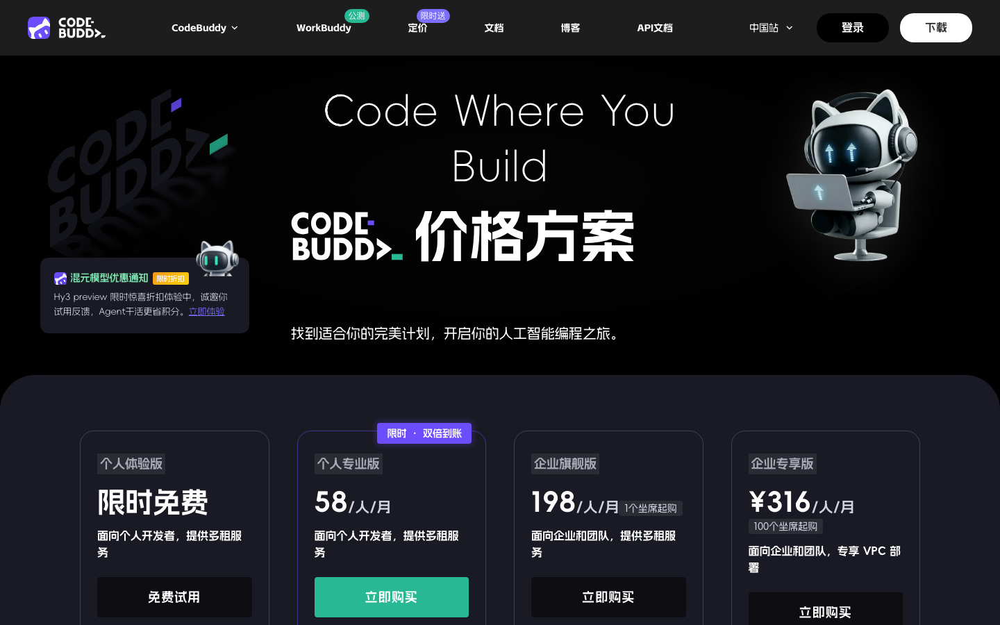

**观察：**

- ✅ 产品能力矩阵列得较全**：读完能判断这是"IDE + 插件"形态的 AI 编程助手，核心能力清晰可辨——代码生成、代码实时续写、跨文件理解、注释生成代码，以及技术对话类（解释代码 / 检查修复 / 优化代码 / 生成提交信息 / 生成单元测试 / 知识库问答），企业侧还有 SSO、研效看板、企业知识管理、智能体配置、CloudAgents 等。
- P1 核心售卖单位"Credits"零解释**：全部套餐围绕"每月 500 / 2000 Credits"定价，但页面从不说明一次代码生成或一轮对话消耗多少 Credits、Credits 与实际工作量如何换算。用户无法判断 2000 Credits 是否够日常开发用、58 元/月到底买到多少产能，定价页最关键的"值不值"问题没有答案。
- P1 各套餐功能差异无法辨别**：免费"个人体验版""个人专业版""企业旗舰版""企业专享版"列出的 feature 几乎完全一致——连免费版都罗列了 SSO、研效看板、成员统计、企业知识管理等企业功能。文本层面看不出各档究竟差在哪（除了 Credits 量和频率限制），违背定价页"帮用户选对档位"的根本目的。
- P2 最具差异化的能力是纯黑盒**：`CloudAgents`、`专属企业插件`、`智能体配置`、`企业模型配置`、`跨文件理解`、`专属网络访问` 这些最能体现产品力的项只有名词、没有任何说明——输入/输出是什么、适用什么场景、支持哪些语言和 IDE、工作机制如何，用户读完仍不知道它们具体能做什么。
- P2 WorkBuddy 与 CodeBuddy 的功能边界缺失**：顶部并列两个产品（CodeBuddy IDE / WorkBuddy 腾讯龙虾），但整张定价表只讲编程能力，从未说明 WorkBuddy 是什么、与 CodeBuddy 如何分工、所购套餐覆盖哪个产品——用户分不清自己付费买到的是一个还是两个产品的能力。


### 📰 博客 / 内容（1 个测点）

**该模块覆盖页面**:

- `https://www.codebuddy.cn/blog/`

#### S6: Blog / Resources

**URL:** https://www.codebuddy.cn/blog/

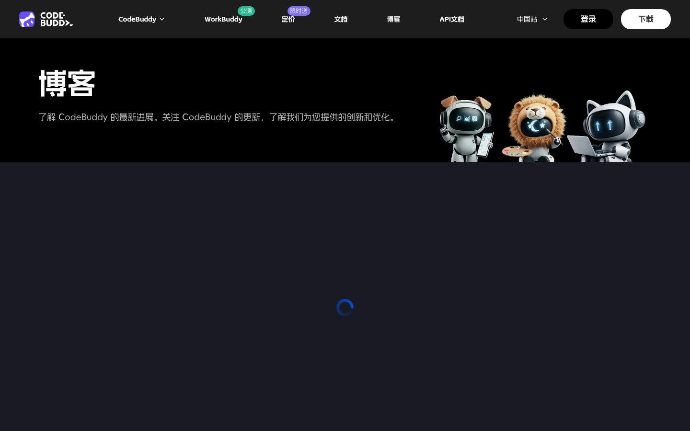

**观察：**

- ✅ 博客内容实质上充当了 CodeBuddy 的"能力地图"：从文章标题即可拼出完整功能矩阵——CloudAgent（云端托管智能体）、Agent SDK（TS/JS 与 Python 接口嵌入）、Skills（如 PPT 生成）、Slash Command（/mr、/release 发版流水线）、子代理（独立上下文窗口的专用 AI 助手）、Plan Mode（AskUserQuestion 规划）、/init（老旧代码库接入）、IDE 内 iOS/Swift 开发。读者能清楚感知"这是一个 Agent + 工具链协作体系"，而非单点编码补全。
- ✅ 多篇文章直接锚定具体用户问题与场景，功能价值传达有力："降低 Token / credit 消耗"对应成本痛点、"/mr 与 /release 把令人生畏的发版变成可靠流水线"对应工程效率、"初创团队从 0 到可演示原型"对应产品验证、"无模板场景下生成 PPT"对应办公场景——属于"用具体工作流演示产品能做什么"的正面范例。
- P2** 页面揭示了 **CodeBuddy IDE、CodeBuddy Code（CLI/Agent）、WorkBuddy、CloudAgent、Agent SDK** 等多个并存产品形态，但博客列表只是平铺文章，未说明这些功能分属哪个产品 / 哪个端、是否需分别下载或订阅，读者难以判断"某个能力（如子代理、Skills）我用哪个入口才能用到"。
- P2** 关键功能的"输入/输出/集成"边界在列表摘要层缺失：CloudAgent 仅称"云端稳定、安全、持续运行"，但未在摘要透出支持哪些触发方式、并发/计费模型;Agent SDK 说"嵌入任意 TS/JS 或 Python 应用"，但能调用哪些工具、与自有系统/CRM/CI 如何集成均未在页面体现，需点进全文才能判断可行性。
- P3** 存在内容信噪问题影响功能认知：同一篇《Agent SDK：为你的应用注入 AI Agent 能力》以 2026-04-10 和 2026-01-27 重复出现两条，且日期排序非严格倒序（2026-04 / 2026-01 / 2026-01 / 2025-12…交错），读者难以判断哪些是产品的"最新能力进展"，削弱了博客作为"功能更新追踪"载体的作用。


### 📖 文档 / 帮助（4 个测点）

**该模块覆盖页面**:

- `https://www.codebuddy.cn/docs/`
- `https://www.codebuddy.cn/docs/ide/`
- `https://www.codebuddy.cn/docs/plugin/`
- `https://www.codebuddy.cn/docs/workbuddy/Claw`

#### C7: Help / Documentation

**URL:** https://www.codebuddy.cn/docs/

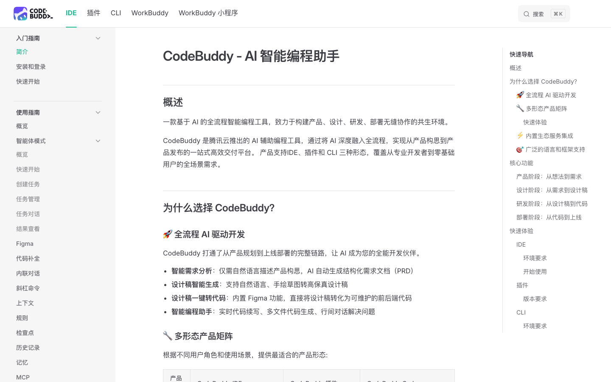

**观察：**

- ✅ 这一页把产品定位为**覆盖完整 SDLC 的全流程 AI 工具**，并按"想法→需求→设计→代码→部署"四阶段逐一列出对应能力（自然语言转 PRD、草图转高保真设计稿、Figma 设计稿一键转代码、实时续写/多文件生成、一键部署）。读者能快速建立"它不只是代码补全，而是从构思到上线"的整体认知。
- ✅ **多形态产品矩阵**表格有效回答了"哪个形态适合我"：把 IDE / 插件 / CLI 分别映射到用户角色（产品·设计师·全栈·初学者 / 日常开发者 / DevOps·SRE·资深开发者）和核心特点（对话即编程 / 融入现有工作流 / 命令行任务编排），功能选型一目了然。
- P2 关键能力只有"声明"，缺输入/输出与工作机制**：诸如"设计稿一键转代码""自然语言转 PRD""单元测试自动生成"均无实际示例、不说明支持的设计源（除 Figma 外是否支持别的）、生成代码的目标技术栈/可维护程度，用户无法判断"效果到底怎样、能否真正落地"。
- P2 进阶功能在本页零功能说明**：侧栏列出的 MCP、Subagents、Skills、Hooks、检查点、记忆、规则、Plan 模式等核心进阶能力，本页（作为帮助/文档入口）完全没有"这是什么、解决什么问题"的一句话解释，用户必须逐个点入才能理解，入口页未承担"功能地图"的导览职责。
- P3 生态集成只列名称、未说集成深度与触发方式**：BaaS（Supabase / 腾讯 CloudBase）声称"自动处理数据库、用户认证"，但未说明自动到什么程度、是否需要预先配置账号/密钥；部署（CloudStudio / EdgeOne）、组件库（TDesign / MUI / Shadcn）、模型（混元 / DeepSeek）同样只有清单，未说明如何选用与切换。

#### S1: Features / Product page

**URL:** https://www.codebuddy.cn/docs/ide/


**观察：**

- ✅ **全流程能力主线清晰**：页面用"产品阶段→设计阶段→研发阶段→部署阶段"四段式把产品能力串成完整链路，每段都给了具体动作（自然语言→PRD、草图→高保真设计稿、Figma→可维护前后端代码、一键部署），读者能快速建立"从想法到上线一站式"的整体认知，价值主张落地感强。
- ✅ **三形态产品矩阵区分到位**：IDE / 插件 / CLI（CodeBuddy Code）用对比表按"适用用户 + 核心特点"划分（产设研一体 vs 融入现有工作流 vs 命令行自动化/任务编排），用户能直接对号入座判断"我该用哪一个"，这是功能选型上很有用的信息。
- P2 旗舰功能停在口号层、缺工作机制说明**："设计稿一键转代码""打通最后一公里"反复出现，但没说明转换的**输入格式范围、输出代码栈、还原度/可编辑性、人工介入边界**；同样"智能需求分析生成 PRD"也只给了输入输出，未说明 PRD 的结构粒度与可迭代方式。最核心的差异化能力恰恰描述最虚。
- P2 部署与生态明显偏腾讯自有体系，外部目标未交代**：一键部署只列了 CloudStudio / EdgeOne Pages，BaaS 只列 Supabase / 腾讯 CloudBase，未说明能否部署到 **Vercel / AWS / 自有服务器**等非腾讯环境——直接关系到用户是否会被锁定，这个关键问题页面回避了。
- P2 "智能体模式"作为核心差异点在概览里被弱化**：侧栏把智能体模式、Subagents、Skills、Hooks、MCP、检查点、记忆列为重点功能，但概览正文几乎没有解释**Agent 能自主完成什么任务、如何编排、与普通代码补全的区别**。这本应是区别于传统补全工具的最大卖点，却没在功能介绍里讲透。

#### E6: 探索: 插件使用

**URL:** https://www.codebuddy.cn/docs/plugin/

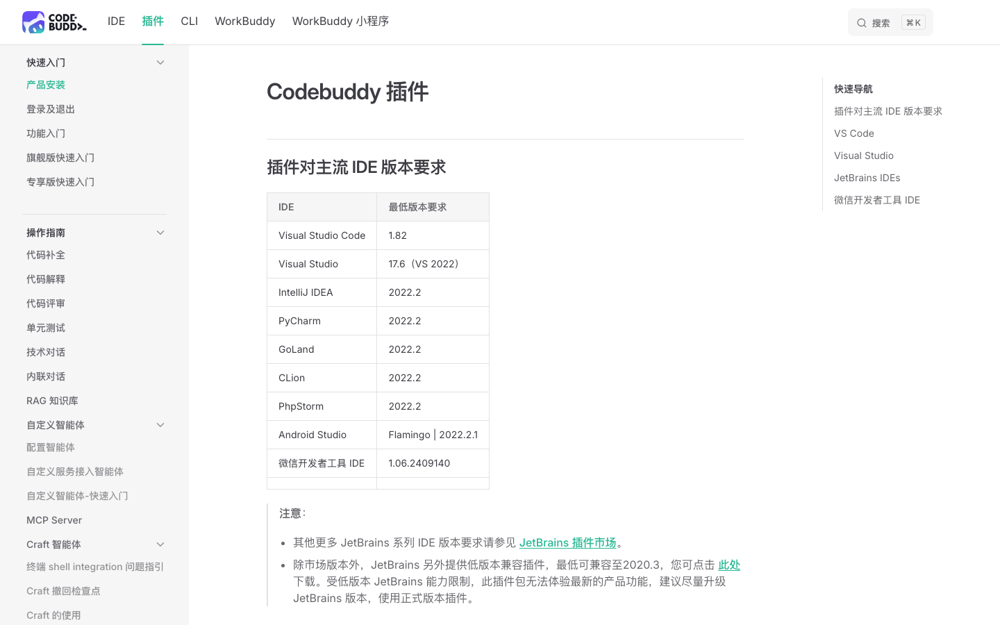

**观察：**

- ✅ 该页清晰揭示了产品的核心集成能力：腾讯云代码助手（CodeBuddy）以插件形式覆盖主流 IDE 全家桶——VS Code、Visual Studio 2022/2026、JetBrains 系列（IntelliJ IDEA / PyCharm / GoLand / CLion / PhpStorm / Android Studio）及微信开发者工具 IDE，并逐一列出最低版本要求，让用户能快速判断"我的开发环境能否用上这个产品"。
- ✅ 对微信开发者工具 IDE 的专门支持是一个差异化功能信号：页面说明需下载最新 Nightly Build 开发版、微信扫码登录、可用测试号 AppID，暴露出产品面向"微信小程序开发者"这一特定场景的集成路径——这是同类代码助手少见的覆盖面（尽管此页未展开小程序场景下到底能做什么）。
- P2** 本页只回答了"在哪里 / 如何安装"，几乎未说明"装好之后这个产品能为我做什么"。侧边栏已暴露丰富能力（代码补全、代码解释、代码评审、单元测试、技术对话、内联对话、RAG 知识库、自定义智能体、MCP Server、Craft 智能体），但安装页与这些核心价值毫无衔接，用户读完仍无法形成"产品能解决我什么问题"的认知。
- P2** 跨 IDE 功能一致性未交代：页面罗列了大量 IDE，却没说明各端能力是否对齐——例如微信开发者工具、Visual Studio 端是否支持与 VS Code 同等的 RAG 知识库 / 自定义智能体 / MCP 等高级功能。侧边栏出现"不同端功能常见问题"已暗示存在差异，但安装页本身未给任何提示，易让用户误以为各端功能等价。
- P3** 低版本 JetBrains 兼容包揭示了"功能随 IDE 版本降级"的工作机制：明确兼容至 2020.3，但低版本插件"无法体验最新产品功能"。这是有价值的功能边界提示，可惜未列出具体哪些能力在低版本不可用，用户无法预判降级代价。

#### E7: 探索: 助理快捷接入指南

**URL:** https://www.codebuddy.cn/docs/workbuddy/Claw

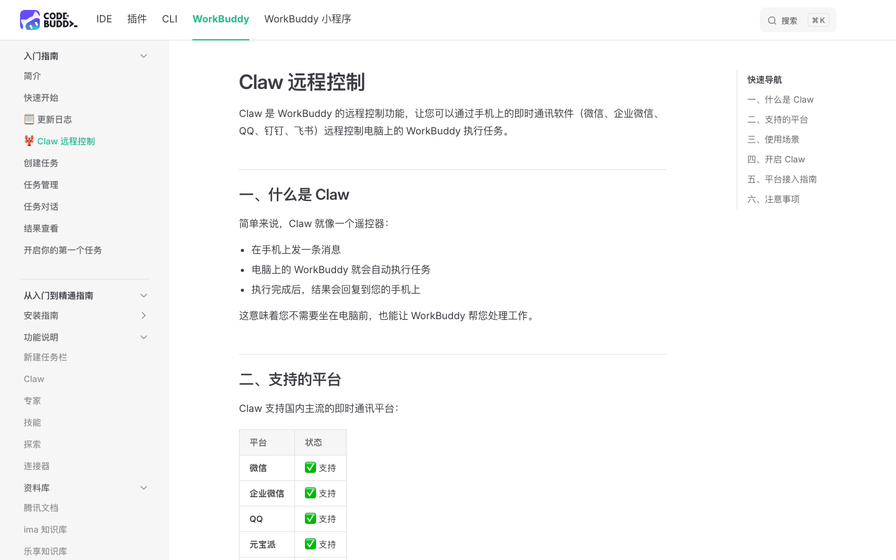

**观察：**

- ✅ 核心能力表达清晰有力：用"遥控器"比喻把 Claw 的工作流讲透了——手机端 IM 发消息 → 电脑端 WorkBuddy 自动执行 → 结果回传手机。这个"远程触发本地 Agent 执行"的闭环机制，配合 6 个国内主流 IM 平台覆盖，让用户一眼就懂"它能为我做什么"。
- P1 关键安全/鉴权机制缺失：页面完全没说明"谁能控制我的电脑"。绑定后是否任何人给机器人发消息都能触发本地 WorkBuddy 执行任务？身份如何校验、如何防止误触发或被冒用？这是远程控制类功能最核心的功能点，却只字未提，存在功能描述缺口与潜在误导。
- P2 输出能力边界不明：只说"结果会回复到手机上"，但没说明可回传的**结果类型**——纯文本？能否回传生成的文件/文档/图片？长输出如何呈现？同时也没说明手机端能否**多轮对话、查看进度、中途取消任务**，这些决定了它到底是"一次性触发器"还是"完整移动端工作台"。
- P2 可触发任务范围未界定：使用场景列了"处理文件/生成会议纪要/准备材料"，但没说明 Claw 能调用的能力是否等同于桌面端 WorkBuddy 全集（专家/技能/连接器/资料库等是否都能远程触发），还是仅限部分功能。用户无法判断远程模式下的能力是否"打折"。
- P3 平台清单前后不一致：第二节"支持的平台"列出含**元宝派**的 6 个平台，但第四节"开启 Claw"选择平台时只列了"微信/企业微信/QQ/钉钉/飞书"（漏掉元宝派）。同一功能的平台支持范围在页面内表述不一致，影响功能信息可信度。


### 📧 联系 / 客服（1 个测点）

**该模块覆盖页面**:

- `https://www.codebuddy.cn/docs/ide/Support/Contact`

#### S14: Customer support channels

**URL:** https://www.codebuddy.cn/docs/ide/Support/Contact

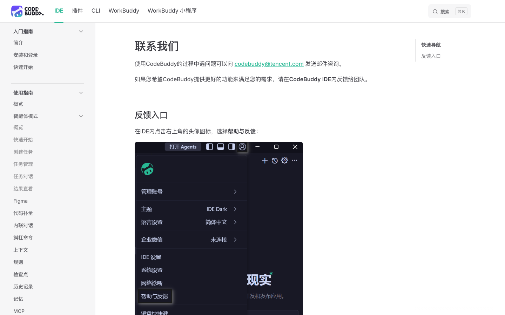

**观察：**

- ✅ 页面清晰说明了 IDE 内反馈通道的关键能力细节：用户可在反馈框描述需求，并支持**上传图片 + 勾选上传日志**——这是一个有实际价值的功能点，让团队能基于运行日志精准定位问题，而非仅凭文字描述。
- P2 支持渠道**仅有两条**（邮件 codebuddy@tencent.com + IDE 内"帮助与反馈"），缺少人工实时支持（在线客服 / 工单系统 / 社群）、**响应时效或 SLA 承诺**。用户读完无法判断"提交后多久能得到回复、问题会不会被跟进"。
- P2 渠道分流逻辑只做了粗略二分（"遇到问题→发邮件咨询""希望更好功能→IDE 内反馈"），但**缺口报告（bug）该走哪条**未明确归类，且两条路径与导航中已有的"故障排除""安全与隐私"等自助文档之间的关系没有串联说明。
- P1 导航显示产品有**企业版（含企业智能体、购买指南）**，但本支持页未区分企业客户的专属支持通道（如专属客服、优先响应、技术对接人）。对采购决策者而言，"企业级支持能力如何"是关键功能信息却完全缺失。
- P3 站点侧栏出现"微信 ClawBot 接入""WorkBuddy 小程序"等入口，但支持页未提及是否存在**官方社群 / 用户论坛 / 状态页（服务可用性公告）**等渠道，自助排障与社区互助这一类支持能力的覆盖范围读者无从得知。


### 📚 产品官方介绍（递归发现）（1 个测点）

**该模块覆盖页面**:

- `https://www.codebuddy.cn/docs/workbuddy/Overview`

#### B1: 背景 D1: 简介

**URL:** https://www.codebuddy.cn/docs/workbuddy/Overview


**观察：**

- ✅ **产品一句话定义清晰**：页面原文将 WorkBuddy 定义为"腾讯推出的全场景职场 AI 智能体桌面工作台，面向各类职能角色设计"，并强调"您只需用一句话描述需求，WorkBuddy 便能像同事一样自主规划和执行任务，并交付可验收的结果"——定位（桌面工作台）、归属（腾讯）、交互方式（一句话）、价值承诺（可验收结果）四要素齐全。
- ✅ **核心能力提炼为 4 条且边界明确**：①理解自然语言（一句话下达任务）；②自主规划执行（自动拆解、规划、执行）；③多模态任务处理（文档/表格/PPT/数据分析）；④本地文件操作（读取授权文件夹、批量处理）。其中"读取授权的电脑文件夹"点明了本地能力的权限前提，是同类产品较少明示的细节。
- ✅ **目标用户与场景覆盖完整**：面向"各类职能角色"，列举了文档生成（工作报告/技术文档/会议纪要）、数据分析与可视化、PPT/报告生成、深度研究调研、邮件编辑/周报、批量文件处理（整理/重命名/格式转换）等典型办公场景，场景颗粒度足以让读者自我对号入座。
- ✅ **差异化叙事用对比表直接呈现**：通过"传统 AI 对话 vs WorkBuddy"四行对比（只能对话→实际执行、手动操作文件→自动操作本地文件、单步骤简单任务→多步骤复杂任务、输出文字→交付可验收结果），把核心叙事压缩成"从'给建议'到'像同事一样干活并交付成果'"，主张鲜明。
- ✅ **关键术语含义自洽**："AI 智能体（Agent）""可验收的结果""像同事一样自主规划执行"构成本页核心概念，且彼此呼应——"智能体"对应自主性、"可验收"对应交付物、"像同事"对应协作隐喻，术语没有自我矛盾。
- P3 **侧边栏大量专有概念在本页零解释，构成主要理解缺口**：导航中出现的 "Claw / Claw 远程控制""专家""技能""探索""连接器""资料库""记忆""企业智能体""ClawBot 微信接入"等显然是产品独有术语，但简介页完全未触及其含义与相互关系；读者读完仍无法判断 WorkBuddy 与"Claw"是什么关系、它如何接入微信/飞书/钉钉等渠道、定价/积分如何计费，以及"像同事一样""可验收"在产品里具体如何落地（无截图或流程示例）。


### 📌 其他（12 个测点）

**该模块覆盖页面**:

- `https://www.codebuddy.cn/work//`
- `https://www.codebuddy.cn/work/`
- `https://www.codebuddy.cn/work/this-page-should-not-exist-product-audit-test-1234`
- `https://www.codebuddy.cn/apiDocs/index.html`
- `https://www.codebuddy.cn/ide/`
- `https://www.codebuddy.cn/setup/`
- `https://www.codebuddy.cn/cli/`
- `https://www.codebuddy.cn/agents/`
- `https://www.codebuddy.cn/agreement/`

#### C1: Homepage 5-second test

**URL:** https://www.codebuddy.cn/work//

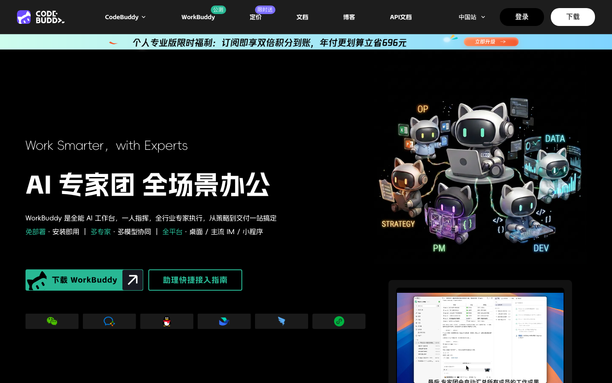

**观察：**

- ✅ 页面清晰揭示了核心产品形态:WorkBuddy 是"一人指挥、多 AI 专家并行执行"的 Agent 工作台,并用三大场景(OPC 一人公司 / 外部调研生成 / 业务数据洞察)+ 每个场景的"典型任务"具体说明了能干什么,读者基本能建立"召唤专家团→一句话指令→自主交付成果"的工作流认知。
- ✅ 调研生成与内容生产两类场景的输入/输出闭环说得明确:给一个"主题/指令"→产出"调研报告 / PPT"、给"数据表格/日志"→产出"分析+优化建议报告",输入产物与交付物对应关系清楚,用户能预期拿到什么。
- P1 关键集成机制缺失:销售洞察场景写"提供 CRM 中的销售管道与成交数据",但完全没说明 CRM 数据**如何接入**(手动导出上传?API 对接?支持哪些 CRM 系统?),同理"全平台·主流 IM"也未列出具体支持的 IM。涉及业务系统对接的核心场景缺了"怎么连进来",直接影响用户判断可行性。
- P2 两个被反复强调的扩展/协同能力没有实质说明:"MCP 生态 + 自定义 Skills,能力无限扩展"未给出可接入的 MCP 清单或 Skills 配置方式;"多模型协同"未说明支持哪些模型、如何选择或协同,使"能力无限"停留在口号层面,无法评估实际边界。
- P2 "100+ 领域专家"的运作机制不清:这些专家是预置 Agent 还是可自定义?多专家"并行协作"时如何分工/编排(谁定需求、谁拆任务由谁触发)?页面用软件开发团队举了例子,但没解释用户是否能干预、调整这套自动编排流程。

#### C5: Footer audit

**URL:** https://www.codebuddy.cn/work/

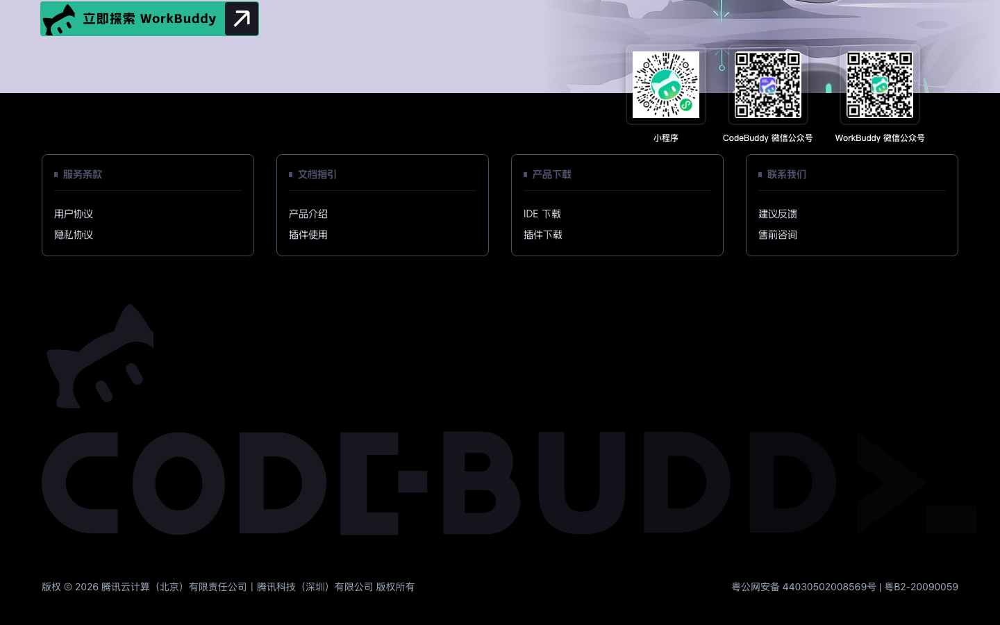

**观察：**

- ✅ 页面把 WorkBuddy 的核心能力模型讲清楚了：「一人指挥 + 100+ 领域专家执行」的多智能体协作，并用三大场景（OPC 一人公司、外部信息调研与内容生成、业务数据洞察与自动化响应）做"推荐用户 / 能力描述 / 典型任务"三段式拆解，读者基本能判断"这产品能为我做什么"。
- ✅ 部分场景的输入→输出闭环描述具体：调研场景是"给一个主题或指令 → 自动联网搜集分析 → 输出调研报告或 PPT"；数据洞察场景是"提交业务数据表格/日志 → 深度分析提炼 → 生成指导方案/优化建议"，输入物料与交付产物都点到了。
- P2 "多专家·多模型协同""MCP 生态 + 自定义 Skills"作为关键差异化能力被反复强调，却完全没展开：支持哪些模型、MCP 能接哪些外部工具、Skills 如何自定义或从何获取，均无说明，用户无法评估其扩展能力的真实边界与可用集成清单。
- P2 "100+ 领域专家"仅举了运营/设计/数据/开发等少量例子，缺完整专家清单或分类目录；且"多专家并行协作"的协同机制（专家间如何分工、交接、汇总）未交代，"一个人顶一支团队"停留在口号，工作机制不透明。
- P2 footer 出现「API文档」「插件下载」「IDE 下载」等入口，暗示产品具备 API 开放接口与插件形态，但正文未说明 WorkBuddy 是否支持可编程 API 接入、适用哪些自动化场景，以及桌面 / IM / 小程序 / 插件各形态之间的功能差异与套餐（定价）对应关系。

#### C8: 404 error handling

**URL:** https://www.codebuddy.cn/work/this-page-should-not-exist-product-audit-test-1234

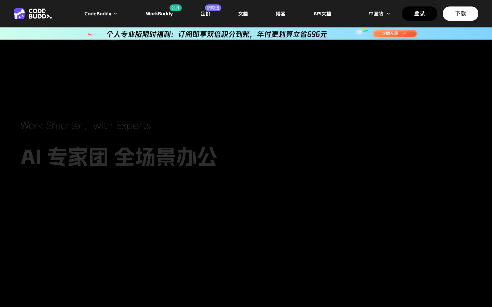

**观察：**

- ✅ **功能可达性兜底良好**：404/失效链接场景下页面回退为完整首页内容，迷路用户仍能直接触达产品的全部核心功能入口（下载 WorkBuddy/CodeBuddy IDE、定价、文档、API 文档、建议反馈），并完整看到三大能力场景介绍——从"功能不进死胡同"角度，错误路径仍把用户导回了可用的产品能力面。
- P2 错误页缺少"找回原功能"的引导**：作为 404 兜底，页面只是平铺首页营销内容，没有针对"用户原本想访问的功能/文档不存在"给出定向引导（如指向文档中心、功能导航或最近更新），用户无法快速判断"我要找的能力是改名了、下线了、还是路径错了"。
- P1 关键功能的数据接入机制未说明**：页面反复用"将业务数据表格/日志交给 WorkBuddy""提供 CRM 中的销售管道与成交数据"描述能力，但完全没说明数据**如何进入**产品——是手动上传文件、连接数据库、还是接 CRM API？这是判断"它能不能为我所用"的决定性信息，缺失会直接误导用户对落地成本的预期。
- P2 集成/平台清单不完整**：宣称"全平台·桌面 / 主流 IM / 小程序"和"MCP 生态 + 自定义 Skills 能力无限扩展"，但既没列出**具体支持哪些 IM**（企业微信？飞书？钉钉？），也没说明 MCP/Skills 的可用清单与接入方式，集成能力停留在口号层面，无法据此评估与现有工作流的对接可行性。
- P3 套餐功能差异与多模型协同细节缺位**：页面有"定价/限时送"入口且强调"多专家·多模型协同"，但未说明免费与付费版在功能/专家数量/模型上的差异，也未点明"多模型"具体接入了哪些模型——用户读完知道"能干很多活"，但难以判断**自己这档能用到哪些具体能力**。

#### S2: Use cases / Industry

**URL:** https://www.codebuddy.cn/work/

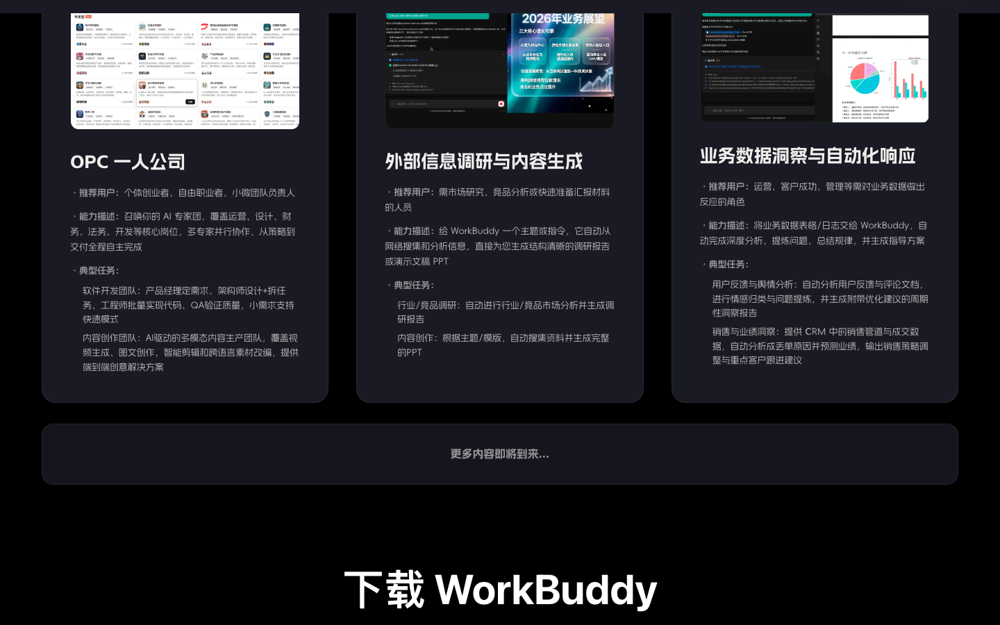

**观察：**

- ✅ 三大场景统一采用"推荐用户 + 能力描述 + 典型任务"结构，把抽象的"全能 AI 工作台"落到具体角色和可交付物上（如"给一个主题 → 自动搜集分析 → 生成调研报告 / PPT"），读者基本能理解"这个产品能为我做什么"。
- ✅ 软件开发场景把工作流拆成可识别的角色链路（产品经理定需求 → 架构师设计 + 拆任务 → 工程师批量实现 → QA 验证，小需求走快速模式），清晰演示了"多专家并行协作"这一核心机制，比泛泛地说"AI 帮你写代码"更有说服力。
- P1** 业务数据 / CRM 场景只说"将业务数据表格 / 日志交给 WorkBuddy""提供 CRM 中的销售管道与成交数据"，却未说明数据如何接入——是手动上传文件、粘贴表格，还是与 CRM 系统实时集成？这是判断能否落地真实业务流的关键输入信息，完全缺失。
- P2** 页面反复强调"MCP 生态 + 自定义 Skills""多模型协同""100+ 领域专家覆盖全行业"，但没有给出任何具体的集成清单、可对接工具 / 模型列表，也没有专家覆盖的行业明细，用户无法判断自己所在行业或现有工具栈是否被支持。
- P2** 同一站点并列 CodeBuddy 与 WorkBuddy 两个产品，但本页只讲 WorkBuddy，未界定二者的功能边界与协作关系——"软件开发"既是 WorkBuddy「OPC 一人公司」的典型任务，又是 CodeBuddy 的主打能力，容易让用户困惑"开发到底该用哪个"。

#### S4: Customer / logo wall

**URL:** https://www.codebuddy.cn/work/

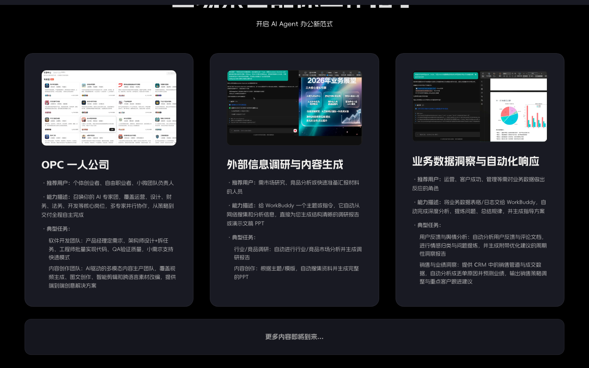

**观察：**

- ✅ 页面清晰揭示了 WorkBuddy 的核心能力定位：一个 multi-agent 办公编排平台——"一人指挥、100+ 领域专家并行执行"，覆盖运营/设计/数据/财务/法务/开发等角色，并以"一句话指令自主规划并交付完整结果"作为核心工作流。能力主轴（虚拟专家团 + 自主规划交付）传达得明确有力。
- ✅ 三大典型场景用"推荐用户 + 能力描述 + 典型任务"结构把功能落到了具体工作流：①OPC 一人公司（开发团队 PM 定需求→架构师拆任务→工程师批量实现→QA 验证；内容团队覆盖视频/图文/剪辑/跨语言改编）②外部调研与内容生成（主题/指令→自动搜集分析→调研报告或 PPT）③业务数据洞察（喂入表格/日志/CRM 数据→分析→优化方案）。其中调研场景的输入→输出（主题→报告/PPT）说明得最完整。
- P1 多专家协作的**工作机制**没说清：宣称"多专家并行协作、一个人顶一支团队"，但没有说明专家如何被调度/拆解任务、并行时如何协同与合并结果、用户在中途是否能审核或干预、交付前是否有质量校验环节。这是该产品最核心的差异点，却停留在口号层面。
- P2 集成与接入能力只给了概念、缺清单：提到"MCP 生态 + 自定义 Skills""多模型协同""全平台（桌面/主流 IM/小程序）"，但未列出具体支持哪些 IM、哪些数据源/SaaS 可连；尤其数据洞察场景明确说"提供 CRM 中的销售管道数据"，却完全未说明 **CRM 如何接入**（手动导出表格？API 直连？支持哪些 CRM？），这是该场景能否落地的关键。
- P2 作为"Customer / logo wall"测点，页面实际**没有任何客户 logo、落地案例、用户证言或使用规模数据**。从功能可信度角度看，"一人顶一支团队""从策略到交付一站搞定"等强能力宣称缺乏真实场景佐证，用户无法判断功能在自己业务上的实际边界与成熟度（公测阶段尤其需要）。

#### S7: About / Company

**URL:** https://www.codebuddy.cn/work/

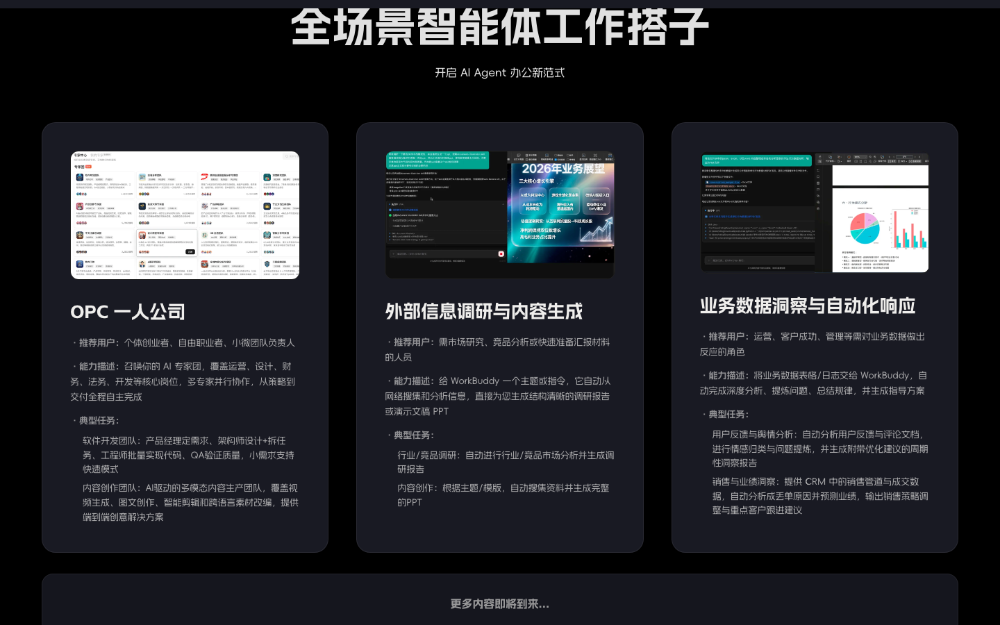

**观察：**

- ✅ 页面清晰揭示了 WorkBuddy 的核心能力模型：「一人指挥 + 100+ 领域专家并行执行」的多智能体工作台，并用三大场景（OPC 一人公司 / 外部调研与内容生成 / 业务数据洞察与自动化响应）把"能为我做什么"具象化——每个场景都配了推荐用户 + 能力描述 + 典型任务三段式，读者基本能判断产品是否适合自己。
- ✅ 软件开发与内容创作两个子团队的工作流拆解到位（PM 定需求 → 架构师设计拆任务 → 工程师批量实现 → QA 验证，小需求走快速模式），这是少见的把"AI 专家团如何协作交付"讲到角色级颗粒度的描述，功能可信度高。
- P1 关键工作机制未说明**：通篇强调"多专家并行协作""多模型协同""自主规划并交付"，但完全没解释专家之间如何编排/交接、用户能否干预或修改中间产物、"多模型"具体指哪些模型及如何选择——核心卖点的运作机制是黑盒，读者无法判断可控性与可靠性。
- P2 输入/集成清单缺失**：业务数据洞察场景声称可处理"表格/日志/CRM 销售数据"，但未说明支持哪些数据格式、如何导入、对接哪些 CRM；同样"全平台·主流 IM"未列出具体支持的 IM（微信/钉钉/飞书?），"MCP 生态 + 自定义 Skills"也只给概念不给可接入清单或示例，集成边界完全不明。
- P2 输出形态与限制不清**：调研场景说能生成"调研报告 / PPT"，但未说明输出格式（可编辑 Word/PPTX？）、长度/篇幅上限、数据来源是否可溯源核查；内容创作提到"视频生成 / 智能剪辑 / 跨语言改编"却无任何规格（时长、分辨率、支持语言），用户难以预期实际交付质量。

#### S9: API / Developer docs

**URL:** https://www.codebuddy.cn/apiDocs/index.html

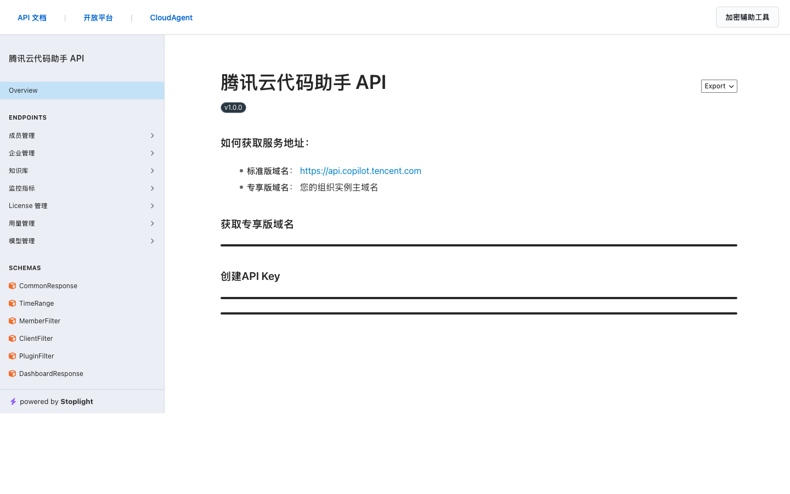

**观察：**

- P2 API 暴露的全是「管理/治理」能力，缺失「AI 推理」能力**：ENDPOINTS 列出成员管理、企业管理、License 管理、用量管理、模型管理、知识库、监控指标——这揭示产品本质是一套**面向企业管理员的编程式治理平台**（可对接内部 IT 系统/工单/SSO 做自动化运维），而非个人补全工具。但页面没有任何「调用 AI 生成代码/对话」的 inference 端点，用户无法判断**代码助手的核心能力能否通过 API 调用**，还是 API 仅用于后台管理。
- ✅ 端点结构清晰揭示了完整的企业管控工作流**：成员管理（谁能用）→ License 管理（授权多少）→ 用量管理 + 监控指标（用得如何）→ 模型管理（用什么模型）构成一条「分配-授权-计量-观测」闭环，配合 SCHEMAS 中的 MemberFilter / ClientFilter / PluginFilter / TimeRange / DashboardResponse，说明**用量数据可按成员、客户端、插件、时间段过滤并拉取看板**，适合企业自建用量分析/成本分摊报表。这是一个信息量很高的、面向 IT/平台团队的真实场景。
- P2 标准版 vs 专享版差异只给了域名，未说明功能/能力区别**：页面区分「标准版（api.copilot.tencent.com）」与「专享版（组织实例主域名）」两种接入方式，暗示存在 SaaS 与私有化/独享部署两条产品线，但**完全没说明两者在功能、可用端点、数据隔离、模型范围上的差异**——这是企业选型最关心的功能边界，缺口明显。
- P2 知识库（知识库）端点价值高但工作机制缺失**：知识库出现在管理端点中，揭示产品具备**企业私有知识接入（疑似 RAG）能力**——可把内部代码规范/文档喂给助手。但 API 列表无法说明知识库如何参与代码生成、支持哪些数据源、如何更新索引，用户读完仍不知道「这个能力具体能为我的代码场景做什么」。
- P3 导航出现 CloudAgent、加密辅助工具等模块但无功能说明**：顶部并列「开放平台 / CloudAgent / 加密辅助工具」，暗示产品矩阵不止代码助手（可能含 Agent 编排、密钥/凭证加密工具），但本页未做任何功能介绍或跳转说明，读者无法理解这些模块与代码助手 API 的关系及各自解决什么问题。

#### E1: 探索: IDEAI 原生 IDE

**URL:** https://www.codebuddy.cn/ide/

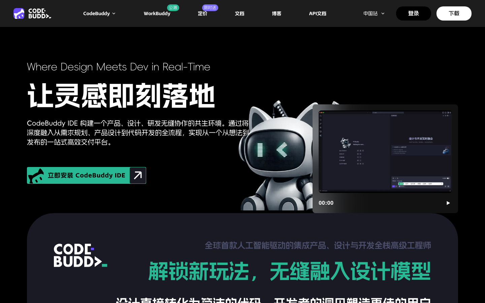

**观察：**

- ✅ **清晰呈现了端到端工作流**：页面明确了核心能力链路——用户用自然语言描述需求（如"帮我做一个电商网站"）→ AI 自动生成结构化 PRD → 设计原型 → 前后端代码 → 一键部署。输入（自然语言）和输出（PRD/原型/代码/上线应用）的对应关系说清楚了，用户能理解"从想法到上线"的主张。
- P2 集成与适用范围说明不完整**：仅列出后端服务接入腾讯云 CloudBase / Supabase、设计接入 Figma，但未说明代码生成支持哪些**语言/框架/技术栈**、生成的应用规模上限、是否支持已有项目导入改造。用户无法判断"我现有的项目能不能用"。
- P1 Figma 转代码的关键前置条件被埋在 FAQ 里**：正文宣传"Figma 设计一键转代码"，但实际使用门槛（需先申请 Figma 权限、且必须用**腾讯企业微信邮箱**登录）只在 FAQ 第 03 条出现。这是决定功能可用性的硬约束，外部用户极可能因此用不了该功能，属功能描述误导。
- P2 CodeBuddy 与 WorkBuddy 的功能边界不清**：导航和下载区同时出现 "CodeBuddy IDE" 和 "WorkBuddy（腾讯龙虾）"两个产品，但页面通篇只讲 CodeBuddy IDE，未说明 WorkBuddy 是什么、解决什么问题、与 IDE 是否协同。用户面对两个下载入口无法判断该装哪个。
- P3 核心能力的工作机制与底座未交代**：未说明驱动全流程的 AI 模型/能力来源，也未说明"自然语言二次修改预览页面元素"的精度与边界（能改样式/布局，能否改逻辑？）。此外 FAQ 多处引用 VSCode 官方文档与 marketplace.visualstudio.com，暗示 IDE 基于 VSCode 构建，但产品介绍未明示这一点——对关心插件生态兼容性的开发者是重要信息缺口。

#### E2: 探索: 插件VS Code / JetBrains 插件

**URL:** https://www.codebuddy.cn/setup/

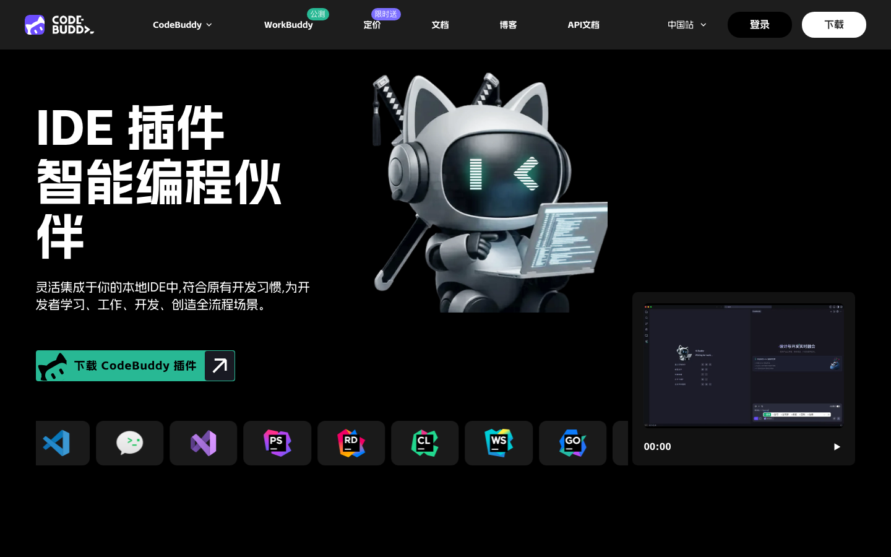

**观察：**

- ✅ 功能矩阵清晰可辨**：页面用「Craft 智能体 / 代码补全 Plus / MCP 外部工具调用 / 智能问答 / 代码评审」五个能力块勾勒出一个相对完整的 AI 编程助手定位——从自主多文件生成、补全、知识问答到评审+自动生成 commit message，覆盖了"写代码—改代码—审代码"的编码全链路，用户能快速抓住产品主线。
- ✅ 集成广度是核心卖点且说明到位**：明确支持 VS Code、JetBrains、微信开发者工具、Xcode、Visual Studio 五类宿主环境，且每种都给了三种安装路径（市场直装/本地包/IDE 内搜索）。尤其 Xcode 还细化到辅助功能授权、开启 Source Editor 扩展等步骤——这解决了"我现有的开发环境能不能用"这一关键决策问题，是真正有信息量的功能落地说明。
- P2 五大功能"只有一句话"，工作机制与输入输出缺失**：每个能力仅一行描述，未说明关键细节——Craft 智能体接受什么输入（自然语言需求？设计稿？）、如何触发、产物形态；智能问答的"自定义知识库"如何导入/规模上限、"模型切换"可选哪些模型；代码评审"批量评审"的粒度（按 PR？按文件？）。用户读完知道"有这些功能"，但无法判断"它具体怎么帮我干活"。
- P2 "Plus"标签含义未定义，功能与套餐的对应关系空白**：「代码补全 Plus」「MCP Plus」反复出现 Plus 后缀，暗示存在分级/付费能力，但页面（含定价入口分散）未解释 Plus 代表免费版/付费版/某等级，也未说明哪些功能需付费。这是典型的功能-权益映射缺口，影响用户判断"免费能用到哪一步"。
- P3 关键适用范围未交代**：未列出支持的编程语言/框架清单、MCP 可对接的外部工具示例、是否支持私有化/本地模型部署（对企业用户尤为关键）。加之结尾"更多内容即将到来"的占位，整体功能边界仍偏模糊，难以支撑深度选型评估。

#### E3: 探索: CLI命令行工具

**URL:** https://www.codebuddy.cn/cli/

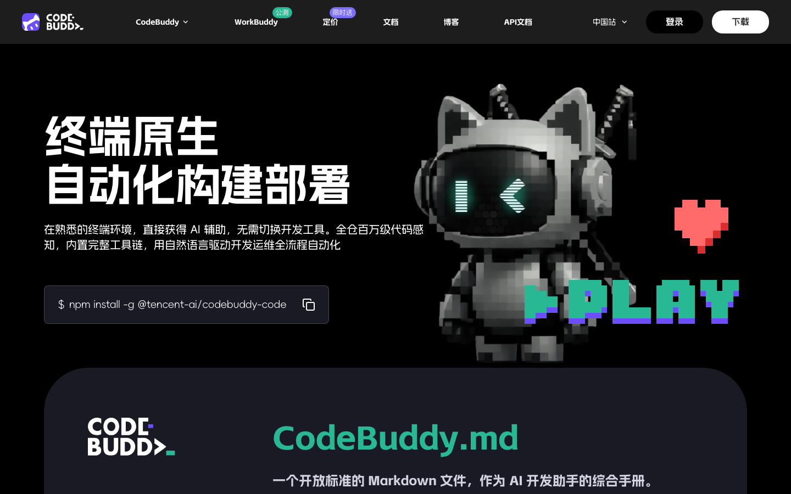

**观察：**

- ✅ 功能演示具象有力**：页面通过"我的世界像素艺术转换器"这个完整 demo，清晰揭示了产品的核心工作流——用户用自然语言描述需求 → 工具自动拆解成 Todo 清单（Update Todos）→ 自动写文件（Write index.html）→ 执行命令，让人一眼看懂这是一个**终端原生的 agentic 编码工具**（类 Claude Code 形态），而非简单的代码补全。
- ✅ 核心能力机制说明到位**：明确点出三项关键能力——"全仓百万级代码感知 + 智能代理语义搜索 + 内置完整工具链"，并解释了工作机制（自动分析整个代码库、本地编辑文件与执行命令、提供上下文感知洞察）。输入（自然语言）、输出（可运行的应用/代码）、集成方式（npm 全局安装、终端环境）都交代清楚。
- ✅ CodeBuddy.md 是有辨识度的功能点**：把"开放标准 Markdown 配置文件"作为独立卖点讲清楚——集中化承载项目配置、编码规范、测试流程、部署指南，取代散落各处的指令文件。这是对"产品如何被定制/约束"的明确功能说明。
- P2 "自动化构建部署"为标题承诺但未被演示**：顶部强调"自动化构建部署""驱动开发运维全流程自动化"，但页面 demo 只展示了**从零构建一个静态网页应用**，全程没有出现任何"构建产物→部署上线/运维"的环节。运维、部署、CI/CD 这类宣称的能力缺乏对应的功能证据或场景。
- P2 关键功能边界与依赖信息缺失**：页面没有说明 ① 底层由哪个/哪些大模型驱动、是否可切换模型；② CLI 工具的使用配额/计费方式（与"定价""限时送"的关系）；③ CodeBuddy Code(CLI) 与 CodeBuddy IDE 在功能与适用场景上的差异——用户难以判断"何时该用命令行版而非 IDE 版"。此外第二个 demo（emoji 摄像头）文本截断于"Aut…"，未给出最终产物，弱化了能力可信度。

#### E4: 探索: AgentsBetaAI 智能体平台

**URL:** https://www.codebuddy.cn/agents/

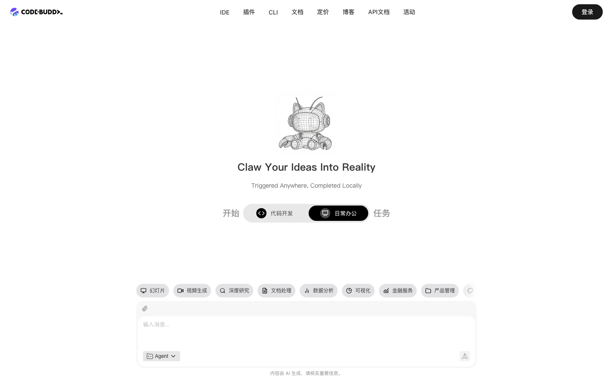

**观察：**

- P1 核心工作机制只有口号、无解释**：标语 "Triggered Anywhere, Completed Locally"（随处触发、本地完成）点出了这个产品最关键的差异化——任务在**本地执行**。但页面完全没说明"本地完成"到底指什么（在用户本机运行？数据不出本地？算力在哪？），也没说"随处触发"靠什么实现（插件 / webhook / 第三方事件？）。这是整个产品的卖点，却停留在标语层，用户无法判断它与普通云端 AI agent 的本质区别。
- P2 13 个能力域只有标签、没有任何演示**：页面罗列了代码开发、日常办公、任务、幻灯片、视频生成、深度研究、文档处理、数据分析、可视化、金融服务、产品管理、设计、邮件编辑等十余个场景，但每一个都只是一个**标签**——没有一个场景说明 agent 具体做什么、需要什么输入、产出什么结果。用户能感知"广度"，但完全看不到"深度"，无法判断任一场景是否真正可用。
- P2 多接入入口（IDE / 插件 / CLI / API）彼此关系不明**：导航同时提供 IDE、插件、CLI、API 文档四种接入方式，强烈暗示这是一个**深度嵌入开发/工作流**的 agent；但页面没说明这些入口是否访问同一个 agent、各自差异、分别适合什么场景，也没说明"在 IDE 里触发、本地完成"的完整链路长什么样。
- P2 外部集成与自主度——决定"能替我干多少活"的关键信息缺失**：对"金融服务""邮件编辑""数据分析"这类天然依赖外部数据/工具的场景，页面没说明 agent 是否接入邮箱、金融数据源、企业系统等；也没说明它是**端到端自主执行**任务，还是仅做内容生成辅助。这恰恰是用户最想知道的"它到底能不能独立把活干完"。
- P3 产品定位锚点摇摆**：能力列表把"代码开发"放首位、配合 IDE/CLI/API 工具链，看起来是面向开发者的编码 agent；但又横跨邮件、幻灯片、金融服务等通用办公场景。究竟是"会写代码的全能助手"还是"跨域执行任务的通用 agent"，缺乏一句清晰的定位语，读完仍难一句话概括"这个产品是什么"。

#### E5: 探索: 用户协议

**URL:** https://www.codebuddy.cn/agreement/

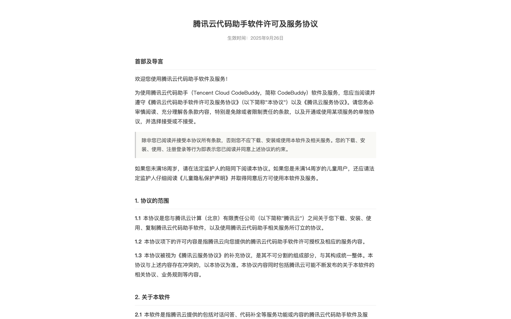

**观察：**

- ✅ 协议第 2.1 条明确点出了产品的两项核心能力——**对话问答**与**代码补全**，并说明其交付形态为 **VSCode、JetBrains 等编辑器插件**。这是全页对"产品到底做什么"最直接的功能定义，能让用户快速建立"AI 编程助手"的基本认知。
- P2** 功能信息不完整：除"对话问答/代码补全"两个词外，页面未交代任何功能细节——**支持哪些编程语言、是否具备整库/上下文理解、是否有 AI Agent / 多文件改写 / 单元测试生成等进阶能力、背后用什么模型**都未提及。用户读完仍无法判断它与同类工具的能力边界。
- 第 7.4 条揭示了一个**容易被忽略的能力定位**：本软件**允许被集成进用户自己的产品/应用/功能并对外提供服务**（此时用户即成为"生成式人工智能服务提供者"）。这暗示产品支持二次集成/嵌入场景，但 **P2** 缺乏任何关于如何集成、是否提供 API/SDK、调用方式的说明，仅以合规义务的形式一笔带过。
- 第 6.5 条间接暴露了一项**数据处理工作机制**：使用中可能涉及**上传并处理（含个人信息/敏感信息的）数据，并委托腾讯云进行数据处理**。这对评估"代码/数据会被如何使用"很关键，但 **P3** 仅从合规授权角度描述，未说明哪些功能会触发数据上传、是否有本地化/不上传选项。
- P3** 使用前置条件分散且偏行政：第 6.2、7.1 条说明**必须绑定并登录已完成实名认证的腾讯云账号**才能使用，这是重要的准入门槛，但属于账号合规而非功能说明，对"产品能为我做什么"无直接帮助。


### ⚠️ 未找到的测点（5 个测点）

**该模块覆盖页面**:

- `https://www.codebuddy.cn/work/`

#### C3: Sign-up flow (no submit)

**URL:** https://www.codebuddy.cn/work/
**观察：**

- [Link not found] 该模板期望的链接（sign up|signup|get started|start free|注册|免费试用|开始）在 https://www.codebuddy.cn/work/ 上未找到 — 可能产品用了不同的措辞或这个功能不存在。 已跳过截图与 LLM 解读以避免重复首页快照。

#### C4: Login page

**URL:** https://www.codebuddy.cn/work/
**观察：**

- [Link not found] 该模板期望的链接（log in|login|sign in|登录|登入）在 https://www.codebuddy.cn/work/ 上未找到 — 可能产品用了不同的措辞或这个功能不存在。 已跳过截图与 LLM 解读以避免重复首页快照。

#### S3: Integrations page

**URL:** https://www.codebuddy.cn/work/
**观察：**

- [Link not found] 该模板期望的链接（integration|connect|集成|连接）在 https://www.codebuddy.cn/work/ 上未找到 — 可能产品用了不同的措辞或这个功能不存在。 已跳过截图与 LLM 解读以避免重复首页快照。

#### S5: Case studies / Testimonials

**URL:** https://www.codebuddy.cn/work/
**观察：**

- [Link not found] 该模板期望的链接（case stud|testimonials|stories|案例|客户故事）在 https://www.codebuddy.cn/work/ 上未找到 — 可能产品用了不同的措辞或这个功能不存在。 已跳过截图与 LLM 解读以避免重复首页快照。

#### S12: Trust / Security page

**URL:** https://www.codebuddy.cn/work/
**观察：**

- [Link not found] 该模板期望的链接（security|trust|compliance|安全|信任）在 https://www.codebuddy.cn/work/ 上未找到 — 可能产品用了不同的措辞或这个功能不存在。 已跳过截图与 LLM 解读以避免重复首页快照。


---

## 4. 第三方社区反馈

#### ⚠️ 未找到显著社区讨论

WebSearch 在 Reddit / Product Hunt / Hacker News / G2 等平台未找到 `codebuddy.cn` 的显著用户讨论。本节内容为空——不代表产品好或差，仅说明社区讨论数据稀缺。

---

## 5. 从访客到注册的转化路径

#### 转化路径示意

```
第 1 步：看到官网落地页，建立第一印象
    ↓ 关键触点：官网顶部并列「CodeBuddy IDE / WorkBuddy 腾讯龙虾」两个产品入口 [C2]
            + 腾讯出品背书 [B1]
第 2 步：进入背景 / 简介页，搞清「它到底能为我干什么」
    ↓ 关键触点：WorkBuddy「一句话下达任务、像同事一样自主规划执行、交付可验收结果」
            + 「传统 AI 对话 vs WorkBuddy」对比表 [B1]
第 3 步：打开定价页，评估「值不值 / 我该选哪一档」
    ↓ 关键触点：免费「个人体验版」+ 58 元/月专业版 + 500/2000 Credits 套餐
            + 较完整的能力矩阵 [C2]
第 4 步：完成转化 → 注册免费体验版 / （企业档）预约演示
    ↓ 关键触点：（推断）免费「个人体验版」承担自助试用入口；企业旗舰版 / 专享版
            走「预约演示 / 联系销售」路径
```

> 说明：本路径的第 1、4 步在所给测点中**没有直接的落地页 / 注册页 / 演示页观察**，主要由 [C2][B1] 两页反推得出；第 2、3 步有直接证据。下文逐步标注「页面写了 / 我的推断」。

---

#### 各步骤详解

**第 1 步：看到官网落地页，建立第一印象**
- 页面写了什么：定价页顶部并列两个产品「CodeBuddy IDE / WorkBuddy 腾讯龙虾」[C2]；简介页明确「腾讯推出」的归属 [B1]。
- 我的推断：访客落地时第一道认知是「这是腾讯出的 AI 工具」——腾讯背书降低了陌生品牌的信任成本，是首屏最强的「敢点进去」理由。但**两个产品名并列、却没有一句话区分谁是谁**，访客可能在第一步就分不清自己要看的是「编程 IDE」还是「职场办公智能体」。
- 可能流失的原因：分不清 CodeBuddy 与 WorkBuddy 的关系与适用人群，不确定「我是不是目标用户」，直接关页。

**第 2 步：进入背景 / 简介页，理解价值主张**
- 页面写了什么：WorkBuddy 被定义为「全场景职场 AI 智能体桌面工作台」，承诺「一句话描述需求 → 像同事一样自主规划执行 → 交付可验收结果」；4 条核心能力（理解自然语言 / 自主规划执行 / 多模态 / 本地文件操作）；并用「传统 AI 对话 vs WorkBuddy」四行对比表凸显差异 [B1]。
- 我的推断：这是整条路径里**最能「让人心动」的一页**——它把卖点从「会聊天」抬升到「会替我把活干完并交付成果」，对被各种 AI 对话工具「教育疲劳」的访客极具吸引力。对比表是一个高效的「自我对号入座」装置，读者会自动代入「我那些重复文档 / 报表活儿能不能甩给它」。
- 可能流失的原因：通篇是**文字主张，没有截图 / 流程示例 / Demo 视频**来佐证「可验收结果」长什么样；侧边栏一堆专有名词（Claw / 专家 / 技能 / 连接器 / 记忆等）在本页零解释 [B1]，认真型访客会觉得「概念很多但看不到实物」，信任建立不起来而离开。

**第 3 步：打开定价页，评估「值不值 / 选哪档」**
- 页面写了什么：全部套餐围绕「每月 500 / 2000 Credits」定价，专业档 58 元/月；分免费「个人体验版」、「个人专业版」、「企业旗舰版」、「企业专享版」；列出较完整的能力矩阵 [C2]。
- 我的推断：访客带着「我大概要花多少钱」来到这一步，但页面**回答不了最关键的两个问题**：① Credits 怎么换算成实际产能（一次代码生成 / 一轮对话耗多少 Credits 不写），导致「2000 Credits 够不够用」无法判断；② 各档功能几乎一模一样（连免费版都列了 SSO、研效看板等企业功能），访客**看不出升级到底买到了什么** [C2]。理性访客会因此卡住。
- 可能流失的原因：无法估算「够不够用 / 值不值」，对 Credits 这种不透明计费产生「怕超额、怕被坑」的戒心；想升级却找不到升级理由，于是停留在免费档或干脆放弃决策。

**第 4 步：完成转化（注册免费体验版 / 预约演示）**
- 页面写了什么：存在免费「个人体验版」档位 [C2]。
- 我的推断：免费体验版最可能扮演**自助试用 / 直接注册入口**，让个人开发者「先用起来再说」；企业旗舰版 / 专享版因涉及 SSO、企业知识管理、CloudAgents 等，**大概率走「预约演示 / 联系销售」**而非自助开通（这一点页面未明示，属推断）。
- 可能流失的原因：所给测点没有捕捉到明确的「立即注册 / 预约演示」按钮与表单，若入口在页面上不够显眼或与「下载 IDE」「安装插件」混在一起，访客在最后一步会犹豫；企业访客若找不到清晰的「预约演示」CTA，则无从转化。

---

#### 转化设计观察

- **入口设计**：呈现出**「免费自助 + 企业预约」双轨**的雏形——个人侧靠免费「个人体验版」做低门槛自助试用，企业侧（旗舰版 / 专享版含 SSO、研效看板、CloudAgents）更适合预约演示 / 联系销售 [C2]。但这套双轨在公开页面上**没有被明确标识**（哪一档点「注册」、哪一档点「预约演示」并不清楚），双轨的引导是我的推断而非页面明写。

- **价格预期**：访客读完定价页只能得到一个**模糊锚点**——「个人专业档 58 元/月」「免费档可先用」。但由于 Credits 不解释、套餐功能差异看不出 [C2]，访客**无法把价格换算成产能**，真实的心理预期是「便宜，但不知道这点钱够干多少活」。这种不确定性会让人倾向「先用免费版试试」而推迟付费决策。

- **公开承诺**：官网用的是**结果导向、拟人化**的话术——「一句话描述需求」「像同事一样自主规划和执行任务」「交付可验收的结果」[B1]，对「用了之后会发生什么」的承诺非常具体（你下指令、它干活、给你成品），明显强于绝大多数「AI 助手」的「帮你提效」式空话。这是公开页面最有说服力的转化资产。

---

#### 转化设计的强弱（仅公开页面）

- ✅ **价值主张钩子强**：简介页把「从给建议 → 像同事一样交付成果」讲得清晰且有对比表支撑，加上腾讯背书，第 2 步的「心动点」和初始信任都立得住 [B1]。
- ✅ **低门槛入口齐全**：有免费「个人体验版」可承接「先试再说」的自助转化，符合开发者工具的典型获客逻辑 [C2]。
- ⚠️ **价格说不清「值不值」**：Credits 零解释、产能无法换算，定价页最核心的「值不值」问题没答案，理性访客会卡在第 3 步推迟决策 [C2]。
- ⚠️ **选档引导失效**：各档功能几乎雷同、差异看不出，违背定价页「帮用户选对档位」的目的，削弱了从免费向付费的升级动机 [C2]。
- ❌ **两产品边界缺失制造认知摩擦**：CodeBuddy 与 WorkBuddy 并列却不区分、所购套餐覆盖哪个产品不明 [C2][B1]，会在第 1 步就让访客「不知道自己在买什么」，是整条公开路径最前置、最伤转化的硬伤。
