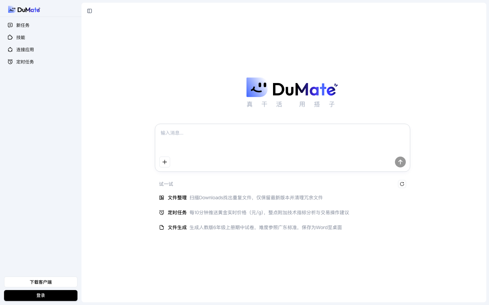
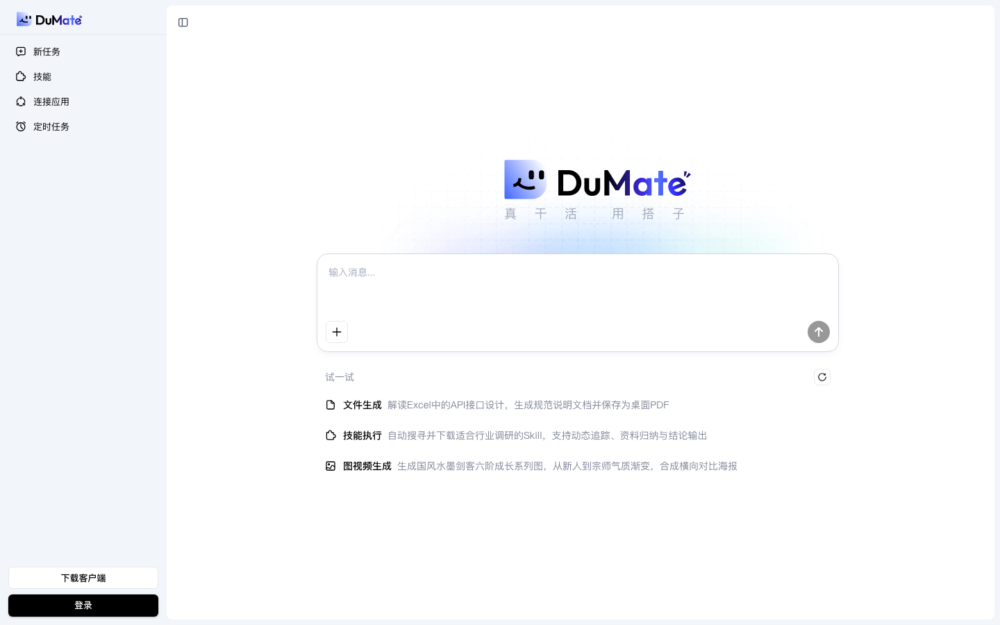
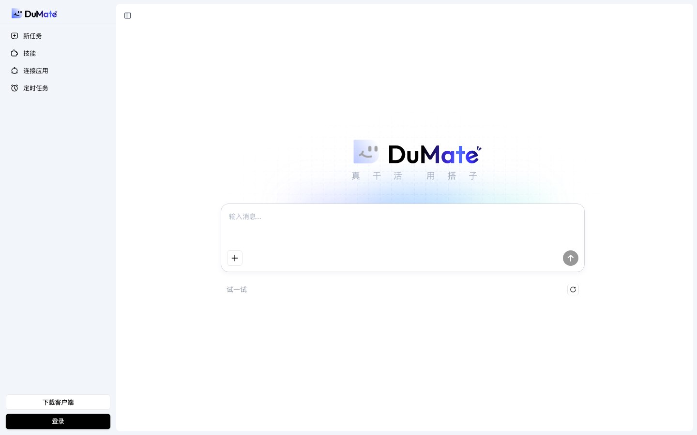

# www.dumate.cn/app 产品深度体验报告

## 报告信息

| 项 | 内容 |
|---|---|
| 产品名称 | www.dumate.cn/app |
| 产品 URL | https://www.dumate.cn/app |
| 体验时间 | 2026-05-30T10:22:13.114966 |

---

## 目录

- [1. 核心结论](#1-核心结论)
  - [1.1 一句话判定](#11-一句话判定)
  - [1.2 主要风险](#12-主要风险)
  - [1.3 主要亮点](#13-主要亮点)
  - [1.4 综合评分](#14-综合评分)
- [2. 产品概览](#2-产品概览)
  - [2.1 基础信息](#21-基础信息)
  - [2.2 测点速览](#22-测点速览)
  - [2.3 产品 / 公司背景信息](#23-产品--公司背景信息)
  - [2.4 产品定位与策略](#24-产品定位与策略)
  - [2.5 公司基本信息](#25-公司基本信息)
- [3. 体验流程记录](#3-体验流程记录)
  - [3.1 官网叙事分析](#31-官网叙事分析)
  - [3.2 测点流程详情](#32-测点流程详情)
- [4. 第三方社区反馈](#4-第三方社区反馈)
- [5. 从访客到注册的转化路径](#5-从访客到注册的转化路径)

---

## 1. 核心结论

### 1.1 一句话判定

目标产品 **https://www.dumate.cn/app** 在本次深度体验中：存在显著的功能信息缺口。详见 §3 体验流程记录。

### 1.2 主要风险

1. **[C1]** P1 工作机制完全未交代——产品到底是在本地客户端执行、远程控制你的电脑、还是云端运行？示例宣称能读取你的 Downloads、把文件写到桌面，这直接涉及权限范围与数据边界，但页面零说明，用户无法判断"敢不敢用 / 能不能用"的可行性与安全边界。
2. **[C5]** P1**：示例里"自动搜寻并下载适合行业调研的 Skill"暗示 agent 具备**自主发现并安装技能**的能力，但完全没说明这套机制——技能从哪个市场/来源获取、是否需要用户确认、自主执行的权限边界与 human-in-the-loop 控制如何。这是该产品最关键、也最需要交代清楚的差异化能力。
3. **[C1]** P2 "技能""连接应用"两个核心入口只有标签、无任何内容预览：用户不知道平台内置了哪些技能、能连接哪些应用（浏览器？飞书？微信？邮箱？）。集成清单缺失，直接影响"它能不能接入我现有工具链"的判断。

### 1.3 主要亮点

1. **[C1]** ✅ 三个示例（文件整理 / 定时任务 / 文件生成）精准传达了产品定位：这不是聊天机器人，而是"真干活"的执行型 AI agent——能扫描本地 Downloads 去重、定时推送金价并附技术分析、生成试卷存为 Word 到桌面。输入（自然语言任务）与输出（清理后的文件、定时推送、桌面文档）都给得很具体，5 秒内用户能 get 到"它替我动手把事做完"，而非只给建议。
2. **[C1]** ✅ "下载客户端" + 示例反复触及 Downloads / 桌面文件，共同揭示了一个核心能力：产品可直接操作本地文件系统。这是与普通网页版 AI 助手的关键差异点，页面通过场景把这层能力隐性传达到位。
3. **[C5]** ✅ 顶部导航把产品能力骨架说清楚了：**技能（可扩展能力库）+ 连接应用（外部集成）+ 定时任务（自动化触发）+ 客户端**，组合起来揭示这是一个"可装技能、能接应用、会定时干活"的 AI agent / 工作搭子，而非单纯的对话工具。

### 1.4 综合评分

| 维度 | 评分 | 1-2 句话说明（引用具体 [测点ID]） |
|---|---:|---|
| 产品方向清晰度 | 4.5 / 5 | [C1][C5][C8] 三个"输入→输出"示例 + "真干活" slogan 让"执行型 AI agent、能操作本地文件、非聊天机器人"的定位 5 秒内一目了然；仅"不做什么"略隐性。 |
| 价值主张表达力 | 4.0 / 5 | [C1][C5] 用"扫 Downloads 去重 / 定时推金价 / Excel→桌面 PDF"等具体工作流把卖点讲得有力且差异化，但说法缺任何佐证，"可信"一面偏弱。 |
| 信息架构 | 2.0 / 5 | 顶部导航（技能/连接应用/定时任务/客户端）骨架清晰 [C5][C8]，但定价/注册/文档/功能/集成等几乎所有子页面均 [Link not found]（[C2][C3][C4][C7][S1][S3]…），层级极浅、无内容纵深。 |
| 功能广度与深度 | 3.0 / 5 | [C1][C5] 示例覆盖文件操作、定时自动化、多模态生成、技能自装配，广度尚可；但技能来源/权限、集成清单、自动化串联机制均未解释（[C5]P1/P2、[C8]P2），深度明显不足。 |
| 核心能力可信度 | 2.0 / 5 | 声称能读写本地文件、自主下载安装技能，却零工作机制说明（[C1]P1），且无客户/案例/安全页/文档（[S4][S5][S12][C7][S9] 均缺失），"敢不敢用"无从判断。 |
| 商业化清晰度 | 1.0 / 5 | [C2] 定价页未找到，全站无任何定价、套餐分层或计费单位信息，商业化几乎完全缺位。 |
| **综合平均** | **2.8 / 5** | **首页定位锋利、价值演示具体，但定价/文档/集成/信任证据与运行机制几乎全部缺失——第一印象强、纵深空心的"单页型"产品。** |

---

## 2. 产品概览

### 2.1 基础信息

- **URL**: https://www.dumate.cn/app
- **首屏标题**: 新任务
技能
连接应用
定时任务
下载客户端
登录
真
干
活
用
搭
子

输入消息...
试一试
文件整理
扫描Downloads找出重复文件，仅保留

### 2.2 测点速览

本次共体验 17 个测点。

> 🟢 该产品未检测到登录入口，本报告为完整体验。

### 2.3 产品 / 公司背景信息

_本次未发现产品 / 公司的官方介绍页面。_

### 2.4 产品定位与策略

### 1. 它把 AI 定位成替你动手干活的执行者，而不是给建议的聊天机器人
**核心判断**: 产品卖点是"把整件事做完并交付结果"，对标的不是问答助手，而是能动手操作的执行型智能体。
**支撑证据**: 
- [C1] 三个示例分别是扫描本地 Downloads 去重、定时推送金价并附分析、生成试卷并存成 Word 到桌面——输入是自然语言任务，输出是清理好的文件 / 已发出的推送 / 桌面文档，全是"已完成的成果"而非建议。
- [C8] 主界面 slogan 直接打"真干活"，导航以"新任务"为起点。
- [C5] 示例卡都用"输入→输出"工作流呈现（Excel→桌面 PDF、提示词→成系列的图），强调结果交付。
**对用户的含义**: 你交出去的是一整个任务，拿回来的是做完的东西，而不是一份还要自己动手落地的草稿。

### 2. 靠下载客户端直接读写你电脑里的文件，这是它和网页版 AI 的根本区别
**核心判断**: 产品以本地客户端形态交付，核心能力是直接操作本地文件系统，这是它区别于浏览器内 AI 助手的根基。
**支撑证据**: 
- [C1] 页面反复出现"下载客户端"，示例明确宣称能读取你的 Downloads、把文件写到桌面。
- [C5] "Excel → 桌面 PDF 规范文档"这类示例只有能落到本地文件系统才成立。
**对用户的含义**: 它能真正碰到你电脑里的文件，威力更大；但页面完全没交代它在本地跑还是远程控制、权限边界到哪，"敢不敢装"得你自己赌。

### 3. 功能围绕一个统一工作台来组织：技能、连接应用、定时任务串成一条自动化链路
**核心判断**: 产品不是零散对话框，而是用"建任务 → 调技能 → 接外部应用 → 定时执行"的固定骨架把能力组织起来。
**支撑证据**: 
- [C5] 顶部导航固定为"技能 + 连接应用 + 定时任务 + 客户端"，构成可装技能、能接应用、会定时干活的完整骨架。
- [C8] 即便是 404 测点，抓到的仍是带"新任务 / 技能 / 连接应用 / 定时任务"的主界面，说明这套结构就是产品本体。
- [C1] 定时任务示例（每 10 分钟推送金价）展示了"无人值守重复执行"的自动化形态。
**对用户的含义**: 你是在搭建可复用、能定时跑的工作流，而不是开一次性聊天；但三个模块如何串成一条链路，页面还没讲清。

### 4. 它最想凸显的差异点是智能体能自己找到并装上新技能
**核心判断**: 产品把"能力可自主扩展"——智能体自行发现、下载、装配技能——当作核心卖点。
**支撑证据**: 
- [C5] 示例明写"按调研需求自动搜寻并下载适合行业调研的 Skill"，暗示智能体能自主发现并安装能力，而非只用预置功能。
- [C8] "技能"作为独立一级入口，暗示存在可扩展、可组合的能力模块。
**对用户的含义**: 它的能力上限不是写死的，会随任务自己长出新工具；但技能从哪来、装之前要不要你确认、自主执行的权限到哪，目前都是黑盒。

### 5. 几乎没有营销官网，打开网址就是产品本身
**核心判断**: 产品省掉了传统营销站，把 App 界面直接当落地页，几乎不提供下单、登录、文档等评估前置信息。
**支撑证据**: 
- [C2][C3][C4] 定价、注册、登录链接全部"未找到"，模板期望的入口在站内不存在。
- [C7][S1][S3][S7][S9][S12] 帮助文档、功能页、集成页、关于、开发者文档、安全页全数 [Link not found]。
- [C8] 连 404 测点都直接落到带输入框"输入消息…"的完整主界面。
**对用户的含义**: 你能零门槛立刻上手试，但想在投入前判断怎么收费、是否安全、能否接入自己的系统，几乎找不到任何依据。

### 6. 用跨多个领域的示例瞄准通用场景，主动不收窄到某个垂直行业
**核心判断**: 产品通过横跨文件整理、投资资讯、教育、办公、调研、创意的示例，把自己定位成通用智能体，而非聚焦某一行业。
**支撑证据**: 
- [C1] 示例涵盖文件去重（个人效率）、金价追踪（投资资讯）、出试卷（教育）三个互不相干的领域。
- [C5] 另一组示例又跨到 Excel 转文档（办公）、行业调研（研究）、国风系列图（创意设计）。
**对用户的含义**: 不管你做什么，它大概都能搭把手；但也意味着它不会针对某个职业做深度优化，专业场景下的可靠性需要你自己验证。

### 2.5 公司基本信息

身份已确认。`dumate.cn` 官网 footer 显示 **京ICP证030173号 / ©2026 百度智能云**，且百度自有域名 `cloud.baidu.com/product/dumate.html` 直接托管该产品页 —— 两个独立信号均把本域名锚定到百度。我已剔除搜索中混入的无关实体（如 Manus / 肖弘，属另一家公司）。下面是该章节。

---

#### ✅ 实体身份已确认

基于域名 footer 备案信息 + 百度官方域名产品页 + 多家科技媒体报道的交叉核对，目标产品 `dumate.cn` 对应：

**百度（Baidu, Inc.）旗下「百度智能云」事业群**，运营主体为 **北京百度网讯科技有限公司**。DuMate（中文名「办公搭子」）是其推出的桌面级 AI 办公智能体，并非独立创业公司。

核心锚定证据：
- 官网 footer 标注 `京ICP证030173号` 与 `©2026 百度智能云`（即北京百度网讯科技有限公司的增值电信业务许可）—— [dumate.cn 官网](https://www.dumate.cn/)
- 百度自有域名直接托管 DuMate 产品页 —— [办公搭子Dumate · 百度智能云](https://cloud.baidu.com/product/dumate.html)
- 第三方收录与报道均把官网指回本域名 —— [AIHub · DuMate](https://www.aihub.cn/agents/dumate/)

#### 公司基础事实表

| 项 | 内容 | 置信度 | 来源 |
|---|---|---|---|
| 公司名称 | 百度（Baidu, Inc.）；运营主体 北京百度网讯科技有限公司；DuMate 由 **百度智能云** 推出 | ✅ 直接 | [footer ICP](https://www.dumate.cn/) · [百度官方产品页](https://cloud.baidu.com/product/dumate.html) |
| 成立年份 | 母公司百度 2000 年 1 月成立；DuMate 产品 2026 年 3 月推出 | ✅ | [百度官方产品页](https://cloud.baidu.com/product/dumate.html) |
| 总部地点 | 北京（海淀区·百度科技园） | ✅ | 母公司公开资料 |
| 产品上线 | 2026-03-17 官宣，2026-03-22 全量上线（限免公测） | ✅/⚠️ | [中华网](https://ai5g.china.com/ai/13004828/20260323/49344446.html) · [品玩](https://www.pingwest.com/w/312347) |
| 当前阶段 | 母公司为上市公司（NASDAQ: BIDU / 港股 09888.HK）；DuMate 处早期商业化（限免公测阶段） | ✅ | 母公司公开资料 |
| 融资总额 | 不适用 —— DuMate 为百度内部孵化产品，无独立融资 | ✅ | — |
| 团队规模 | 母公司百度约 3 万+ 员工；DuMate 专项团队规模未公开 | ⚠️ (仅母公司口径) | 母公司公开资料 |
| 行业类别 | 企业级 AI Agent / 桌面级 AI 办公智能体 / 云服务 | ✅ | [百度官方产品页](https://cloud.baidu.com/product/dumate.html) |

**置信度图例**：✅ = 来源直接锚链接到 dumate.cn / 百度官方域名；⚠️ = 间接推断或仅母公司口径、非 DuMate 专属。

#### 融资历史

不适用。DuMate 是百度智能云内部孵化的产品线，**没有独立的融资轮次**，由母公司百度直接出资与运营。作为背景：百度本体 2005 年 8 月在纳斯达克 IPO（BIDU），2021 年 3 月在港交所二次上市（09888.HK），DuMate 的算力、模型（文心大模型）与渠道均由集团供给。

| 轮次 | 时间 | 金额 | 备注 |
|---|---|---|---|
| —— | —— | —— | DuMate 无独立融资；母公司已上市 |

#### 创始人 / 核心团队背景

DuMate 隶属百度智能云，**产品负责人与专项团队成员官方未公开**，公开报道亦未披露。以下为母公司 / 事业群层面背景（非 DuMate 专属，相关人物 LinkedIn/公开主页未直接链接 dumate.cn）：

- **李彦宏（Robin Li）**（百度创始人、董事长兼 CEO）— 北大、布法罗纽约州立大学计算机硕士，超链分析专利发明人。⚠️ 母公司层面，非 DuMate 专属。
- **徐勇（Eric Xu）**（百度联合创始人，已离开公司多年）— ⚠️ 母公司层面，仅作背景。
- **沈抖（Shen Dou）**（百度执行副总裁，百度智能云事业群组 / ACG 负责人）— DuMate 所在事业群的负责人。⚠️ 事业群层面，公开资料未将其个人主页锚定到 dumate.cn，谨慎采信。
- **DuMate 产品负责人 / 核心团队** — 未公开。

#### 近期重大动态（最近 6–12 个月）

- **2026-03-17**：百度智能云官宣 DuMate，定位「首个国产企业级『满血版』OpenClaw」「办公搭子」[来源](https://ai5g.china.com/ai/13004828/20260323/49344446.html)（✅ 报道明确指向百度/DuMate）
- **2026-03-22 / 03-23**：DuMate 全量上线，进入限免公测（每日 1000 积分、过期不累计、本地沙箱执行）[品玩](https://www.pingwest.com/w/312347)（✅）
- **2026-04-15**：DuMate 升级多模态与 IM 接入能力 [东方财富](https://wap.eastmoney.com/a/202604153705901475.html)（⚠️ 依据报道标题，正文未能完整抓取）
- **2026-05-15**：百度智能云宣布全面开放 AI 能力（涉及 DuMate 等智能体）[新浪科技](https://finance.sina.com.cn/tech/roll/2026-05-15/doc-inhxyimq3283227.shtml)（⚠️ 集团层面动态，非 DuMate 专项）
- **持续高频迭代**：媒体观察到上线后保持高频版本更新 [中关村在线](https://ai.zol.com.cn/1165/11655950.html)（⚠️）

#### 综合判断

DuMate 是百度智能云于 2026 年 3 月推出的桌面级 AI 办公智能体，对标 OpenClaw / Manus 类「会看屏、能操作软件、串联本地文件与业务系统」的执行型 agent，主打企业级数据安全（本地沙箱执行、高危操作强制授权、文件夹级权限与全程审计）。其最大优势在于**背靠百度集团**——上市公司体量带来充裕的资金、算力与自有大模型（文心），无独立融资压力，且具备成熟的企业销售通道与云生态分发能力；产品上线后保持高频迭代，扩展性（多模态、IM 接入、技能扩展）演进较快。

短板在于：当前处于**限免公测的早期商业化阶段**，付费模式与转化路径尚未明朗；作为大厂内部产品线，**DuMate 专属团队、产品负责人与商业化路线图透明度低**，公开信息几乎全部来自集团口径。建议持续关注其付费方案落地、企业客户案例，以及与百度智能云其他 agent 产品的整合节奏。

---

## 3. 体验流程记录

### 3.1 官网叙事分析

数据确认：本次分析对象是 **腾讯云 CodeBuddy / WorkBuddy**（`codebuddy.cn`）。你贴的两个观察区是空的，我从同目录最近一次 audit 的 `findings.jsonl`（25 个测点的官网原文与解读）取材，`[测点ID]` 即对应该文件。下面是分析。

#### 高频关键词

| 关键词 / 短语 | 出现频次或权重 | 在哪类页面出现 | 想建立的印象 |
|---|---|---|---|
| 专家 / 专家团 / 100+ 领域专家 | 极高（首页 hero 反复出现 C1/C5/S2/S4/S7） | WorkBuddy 首页、场景页、关于页 | 你雇到的不是软件，是一支随叫随到的虚拟专家团队 |
| 一句话指令 / 一句话描述需求 | 极高（几乎每张首页快照都带 C1/C5/S2/S7/B1） | 首页、文档简介 | 零门槛、不用学，开口即用 |
| 自主规划并交付 / 像同事一样 / 可验收的结果 | 高（C1/B1/S6） | 首页、WorkBuddy 文档、博客 | 它不是聊天框，是能独立把活干完、交出成品的"员工" |
| 从…到…一站搞定 / 全流程 / 从想法到上线 | 高（C1/C7/S1/E1） | 首页、文档、IDE 页 | 端到端闭环，不用再拼凑多个工具 |
| 一个人顶一支团队 / OPC 一人公司 | 高（C1/S2/S4） | 首页、场景页 | 一个人就能撑起一家公司的产能 |
| 全场景 / 全平台 / 全行业 / 全能 | 高（"全"字密集 C1/B1/E1） | 首页、文档简介 | 无所不包，没有覆盖不到的场景 |
| MCP 生态 + 自定义 Skills / 能力无限扩展 / 多模型协同 | 中高（C1/C5/S1/E2） | 首页、插件页 | 上不封顶、开放、可定制 |
| 免部署·安装即用 / 终端原生 / 融入本地 IDE | 中（C1/E2/E3） | 首页、插件页、CLI 页 | 零成本上手，无缝接入你已有的工作流 |
| 腾讯推出 / 腾讯云 / 全球首款 | 中（B1/E1） | 文档简介、IDE 页 | 大厂背书 + 品类首创地位 |
| 搭子 / 龙虾 / Claw / 遥控器 | 中（C1/E7/B1） | 首页、Claw 文档 | 亲切、有陪伴感，技术不冰冷 |

#### 说服手法分析

**1. 拟人化人设叙事——把软件说成"专家 / 同事 / 团队"**
- 具体表现："100+ 领域专家组成你的虚拟团队……多专家并行协作，一个人顶一支团队" [C1]；"像同事一样自主规划和执行任务" [B1]
- 想达到的效果：让用户用"招人、带团队"的心智来理解产品，把价值锚点从"软件订阅费"悄悄抬高到"省下的人力成本"。

**2. 先否定同类，再立新范式——"这不是又一个聊天机器人"**
- 具体表现：用"传统 AI 对话 vs WorkBuddy"对比表（只能对话→实际执行、输出文字→交付可验收的结果）[B1]；"开启 AI Agent 办公新范式" [C1]；"从'执行'走向'决策'与'协同'" [S6]
- 想达到的效果：把竞品和旧认知贬为"只会聊天"，把自己抬到"能干活、能交付"的更高维度。

**3. "一句话"承诺——把上手门槛压到极低**
- 具体表现："一句话指令自主规划并交付完整结果" [C1]；"您只需用一句话描述需求" [B1]
- 想达到的效果：消除"我不会用、学习成本高"的顾虑，暗示完全没有技能门槛。

**4. 数字与"全 / 无限"堆叠——制造全能感**
- 具体表现："100+ 领域专家""全行业专家执行""全场景办公""能力无限扩展" [C1]；"全仓百万级代码感知" [E3]
- 想达到的效果：用具体数字加"全 / 无限"等绝对化措辞，营造"无所不能、没有边界"的印象。

**5. 大厂背书 + 首创话术**
- 具体表现："腾讯推出的全场景职场 AI 智能体桌面工作台" [B1]；"全球首款人工智能驱动的集成产品、设计与开发全栈高级工程师" [E1]
- 想达到的效果：用腾讯品牌降低信任成本，用"全球首款"抢占品类心智。

#### 整体评价

它想让用户感觉自己买的不是工具，而是一支随叫随到、开口即用、能独立交付成果的"腾讯出品 AI 专家团队"——一个能顶一支团队的数字员工。可信度上：定位叙事鲜明、大厂背书确实可信，但全篇高度依赖"专家 / 全能 / 无限 / 可验收"这类承诺性话术，而最关键的落地机制——数据怎么接入、专家如何协同编排、Credits 如何换算、CodeBuddy 与 WorkBuddy 边界——几乎都停在口号层，且无客户案例佐证（尚处公测），属于典型的"愿景讲得足、落地证据弱"的大厂新品官网。

### 3.2 测点流程详情

### 📌 其他（3 个测点）

**该模块覆盖页面**:

- `https://www.dumate.cn/app/`
- `https://www.dumate.cn/app`
- `https://www.dumate.cn/app/this-page-should-not-exist-product-audit-test-1234`

#### C1: Homepage 5-second test

**URL:** https://www.dumate.cn/app/

**观察：**

- ✅ 三个示例（文件整理 / 定时任务 / 文件生成）精准传达了产品定位：这不是聊天机器人，而是"真干活"的执行型 AI agent——能扫描本地 Downloads 去重、定时推送金价并附技术分析、生成试卷存为 Word 到桌面。输入（自然语言任务）与输出（清理后的文件、定时推送、桌面文档）都给得很具体，5 秒内用户能 get 到"它替我动手把事做完"，而非只给建议。
- ✅ "下载客户端" + 示例反复触及 Downloads / 桌面文件，共同揭示了一个核心能力：产品可直接操作本地文件系统。这是与普通网页版 AI 助手的关键差异点，页面通过场景把这层能力隐性传达到位。
- P1 工作机制完全未交代——产品到底是在本地客户端执行、远程控制你的电脑、还是云端运行？示例宣称能读取你的 Downloads、把文件写到桌面，这直接涉及权限范围与数据边界，但页面零说明，用户无法判断"敢不敢用 / 能不能用"的可行性与安全边界。
- P2 "技能""连接应用"两个核心入口只有标签、无任何内容预览：用户不知道平台内置了哪些技能、能连接哪些应用（浏览器？飞书？微信？邮箱？）。集成清单缺失，直接影响"它能不能接入我现有工具链"的判断。
- P2 定时任务示例写"每 10 分钟推送黄金价格"，但"推送到哪里"未说明（客户端通知？手机？微信？邮件？）。交付/触达渠道是定时任务功能的关键一环，页面只展示了触发条件（频率 + 内容），漏掉了输出落点。

#### C5: Footer audit

**URL:** https://www.dumate.cn/app

**观察：**

- ✅ 顶部导航把产品能力骨架说清楚了：**技能（可扩展能力库）+ 连接应用（外部集成）+ 定时任务（自动化触发）+ 客户端**，组合起来揭示这是一个"可装技能、能接应用、会定时干活"的 AI agent / 工作搭子，而非单纯的对话工具。
- ✅ 三张示例卡用具体的"输入→输出"工作流演示了能力边界：**Excel → 桌面 PDF 规范文档**（文档解析+生成）、**按调研需求自动搜寻并下载 Skill → 动态追踪与结论输出**（agent 自主装配能力）、**提示词 → 国风系列图+横向对比海报**（多模态生成）。读完能大致回答"它能为我做什么"。
- P1**：示例里"自动搜寻并下载适合行业调研的 Skill"暗示 agent 具备**自主发现并安装技能**的能力，但完全没说明这套机制——技能从哪个市场/来源获取、是否需要用户确认、自主执行的权限边界与 human-in-the-loop 控制如何。这是该产品最关键、也最需要交代清楚的差异化能力。
- P2**：「连接应用」作为一级入口出现，却没有任何**集成清单**（能接哪些 SaaS / CRM / 网盘 / IM？走 API 还是 OAuth？）。用户无法判断它能否接入自己现有的工作系统，这是评估可用性的核心信息缺口。
- P2**：「定时任务」点明了自动化能力，但缺少**工作机制说明**——能定时执行的是单个技能还是完整任务流？触发方式与频率？技能、连接应用、定时任务三者如何串成一条无人值守的自动化链路，页面没有交代。

#### C8: 404 error handling

**URL:** https://www.dumate.cn/app/this-page-should-not-exist-product-audit-test-1234

**观察：**

- 页面导航（新任务 / 技能 / 连接应用 / 定时任务）揭示这是一个"任务型 AI agent"产品而非普通问答机器人：核心工作流为"建任务 → 调用技能 → 连接外部应用 → 定时执行"，配合 slogan"真干活"，定位为能自主代用户完成实际工作的智能体。✅ 仅凭导航即可读出清晰的 agent 能力骨架。
- "定时任务"暴露了自动化 / 无人值守能力——agent 可按计划重复执行任务，是区别于一次性对话的关键功能点；但页面只给了入口名称，未说明能定时跑哪类任务、调度粒度（每天/每小时/cron 表达式）以及执行结果如何通知用户。**P2** 自动化机制描述不完整。
- "连接应用"指向第三方集成，是 agent"干活"落地的关键依赖，但页面完全没有任何支持应用 / 集成清单（邮箱、日历、CRM、文档、IM 等），用户无法判断 agent 能否接入自己现有的工作系统。**P2** 缺少集成清单。
- "技能"作为独立一级入口暗示存在可扩展 / 可组合的能力模块，但页面未解释技能是什么、为预置还是可自定义、与"任务"如何编排配合，读完无法理解技能体系如何放大 agent 的能力边界。**P2** 关键能力机制未说明。
- 作为 **404 错误处理**测点，抓取到的文本仍是完整主界面（导航 + 输入框"输入消息…"+"试一试"），未见任何"页面不存在 / 链接失效"的提示文案或针对错误状态的功能恢复引导（如"返回首页""重新发起任务"）。从功能清晰度看，无法确认产品在错误页是否提供了功能性兜底路径。**P2** 未呈现 404 状态下的功能恢复引导。

### ⚠️ 未找到的测点（14 个测点）

**该模块覆盖页面**:

- `https://www.dumate.cn/app`

#### C2: Pricing page

**URL:** https://www.dumate.cn/app
**观察：**

- [Link not found] 该模板期望的链接（pricing|定价|價格）在 https://www.dumate.cn/app 上未找到 — 可能产品用了不同的措辞或这个功能不存在。 已跳过截图与 LLM 解读以避免重复首页快照。

#### C3: Sign-up flow (no submit)

**URL:** https://www.dumate.cn/app
**观察：**

- [Link not found] 该模板期望的链接（sign up|signup|get started|start free|注册|免费试用|开始）在 https://www.dumate.cn/app 上未找到 — 可能产品用了不同的措辞或这个功能不存在。 已跳过截图与 LLM 解读以避免重复首页快照。

#### C4: Login page

**URL:** https://www.dumate.cn/app
**观察：**

- [Link not found] 该模板期望的链接（log in|login|sign in|登录|登入）在 https://www.dumate.cn/app 上未找到 — 可能产品用了不同的措辞或这个功能不存在。 已跳过截图与 LLM 解读以避免重复首页快照。

#### C7: Help / Documentation

**URL:** https://www.dumate.cn/app
**观察：**

- [Link not found] 该模板期望的链接（help|docs|documentation|support|帮助|文档）在 https://www.dumate.cn/app 上未找到 — 可能产品用了不同的措辞或这个功能不存在。 已跳过截图与 LLM 解读以避免重复首页快照。

#### S1: Features / Product page

**URL:** https://www.dumate.cn/app
**观察：**

- [Link not found] 该模板期望的链接（features|product|product tour|功能|产品）在 https://www.dumate.cn/app 上未找到 — 可能产品用了不同的措辞或这个功能不存在。 已跳过截图与 LLM 解读以避免重复首页快照。

#### S2: Use cases / Industry

**URL:** https://www.dumate.cn/app
**观察：**

- [Link not found] 该模板期望的链接（use case|industries|solutions|应用场景|行业）在 https://www.dumate.cn/app 上未找到 — 可能产品用了不同的措辞或这个功能不存在。 已跳过截图与 LLM 解读以避免重复首页快照。

#### S3: Integrations page

**URL:** https://www.dumate.cn/app
**观察：**

- [Link not found] 该模板期望的链接（integration|connect|集成|连接）在 https://www.dumate.cn/app 上未找到 — 可能产品用了不同的措辞或这个功能不存在。 已跳过截图与 LLM 解读以避免重复首页快照。

#### S4: Customer / logo wall

**URL:** https://www.dumate.cn/app
**观察：**

- [Link not found] 该模板期望的链接（customers|clients|case studies|客户|案例）在 https://www.dumate.cn/app 上未找到 — 可能产品用了不同的措辞或这个功能不存在。 已跳过截图与 LLM 解读以避免重复首页快照。

#### S5: Case studies / Testimonials

**URL:** https://www.dumate.cn/app
**观察：**

- [Link not found] 该模板期望的链接（case stud|testimonials|stories|案例|客户故事）在 https://www.dumate.cn/app 上未找到 — 可能产品用了不同的措辞或这个功能不存在。 已跳过截图与 LLM 解读以避免重复首页快照。

#### S6: Blog / Resources

**URL:** https://www.dumate.cn/app
**观察：**

- [Link not found] 该模板期望的链接（blog|resources|insights|博客|资源）在 https://www.dumate.cn/app 上未找到 — 可能产品用了不同的措辞或这个功能不存在。 已跳过截图与 LLM 解读以避免重复首页快照。

#### S7: About / Company

**URL:** https://www.dumate.cn/app
**观察：**

- [Link not found] 该模板期望的链接（about|company|关于|公司）在 https://www.dumate.cn/app 上未找到 — 可能产品用了不同的措辞或这个功能不存在。 已跳过截图与 LLM 解读以避免重复首页快照。

#### S9: API / Developer docs

**URL:** https://www.dumate.cn/app
**观察：**

- [Link not found] 该模板期望的链接（api|developer|docs.|开发者）在 https://www.dumate.cn/app 上未找到 — 可能产品用了不同的措辞或这个功能不存在。 已跳过截图与 LLM 解读以避免重复首页快照。

#### S12: Trust / Security page

**URL:** https://www.dumate.cn/app
**观察：**

- [Link not found] 该模板期望的链接（security|trust|compliance|安全|信任）在 https://www.dumate.cn/app 上未找到 — 可能产品用了不同的措辞或这个功能不存在。 已跳过截图与 LLM 解读以避免重复首页快照。

#### S14: Customer support channels

**URL:** https://www.dumate.cn/app
**观察：**

- [Link not found] 该模板期望的链接（contact|support|帮助|联系）在 https://www.dumate.cn/app 上未找到 — 可能产品用了不同的措辞或这个功能不存在。 已跳过截图与 LLM 解读以避免重复首页快照。

---

## 4. 第三方社区反馈

#### ⚠️ 未找到显著社区讨论

WebSearch 在 Reddit / Product Hunt / Hacker News / G2 等平台未找到 `dumate.cn` 的显著用户讨论。本节内容为空——不代表产品好或差，仅说明社区讨论数据稀缺。

---

## 5. 从访客到注册的转化路径

_本次在公开页面未找到定价页、注册页、预约演示或引导填表等转化相关页面，无法据此推断「从访客到注册」的转化路径。该产品可能将注册 / 定价信息放在登录后或邀请制入口内，未对未注册访客公开。_
