# dust.tt 产品深度体验报告

## 报告信息

| 项 | 内容 |
|---|---|
| 产品名称 | dust.tt |
| 产品 URL | https://dust.tt/ |
| 体验时间 | 2026-05-30T10:22:03.326684 |

---

## 目录

- [1. 核心结论](#1-核心结论)
  - [1.1 一句话判定](#11-一句话判定)
  - [1.2 主要风险](#12-主要风险)
  - [1.3 主要亮点](#13-主要亮点)
  - [1.4 综合评分](#14-综合评分)
- [2. 产品概览](#2-产品概览)
  - [2.1 基础信息](#21-基础信息)
  - [2.2 测点速览](#22-测点速览)
  - [2.3 产品 / 公司背景信息](#23-产品--公司背景信息)
  - [2.4 产品定位与策略](#24-产品定位与策略)
  - [2.5 公司基本信息](#25-公司基本信息)
- [3. 体验流程记录](#3-体验流程记录)
  - [3.1 官网叙事分析](#31-官网叙事分析)
  - [3.2 测点流程详情](#32-测点流程详情)
- [4. 第三方社区反馈](#4-第三方社区反馈)
- [5. 从访客到注册的转化路径](#5-从访客到注册的转化路径)

---

## 1. 核心结论

### 1.1 一句话判定

目标产品 **https://dust.tt/** 在本次深度体验中：存在显著的功能信息缺口。详见 §3 体验流程记录。

### 1.2 主要风险

1. **[C2]** P1 最关键的卖点 "agents which can execute actions" 完全没有说明"能执行什么动作、对哪些系统、怎么触发"**。这是产品与普通 AI 助手的根本差异点，却只有一句话带过——用户无法判断 agent 是能改 Notion 文档、在 Zendesk 建工单、还是只能读数据。读完这一页，用户理解"能搭 agent"，但无法理解"agent 实际能为我做成哪件事"，核心能力描述存在误导性留白。
2. **[C5]** P1 "Frames" 作为并列的核心 Product 条目却完全无功能说明**。它和 Chrome Extension、Integrations 同级，显然是产品主形态之一，但全页没有任何一句解释 Frames 是什么（是 agent 的可嵌入界面？画布？文档工作区？）。读者无法判断这个核心模块「能为我做什么」，是最关键的功能描述缺口。
3. **[C7]** P1** 集成关键缺失：整页核心卖点是"从知识库取信息""自动路由工单""跨渠道同步"，但**完全没说接入哪些工单系统/CRM/知识库**（Zendesk、Intercom、Salesforce、Notion 等一个都没点名）。客服团队最关心"能不能接我现在的 helpdesk"，恰恰无法判断；testimonial 还提到"信息散落在多个内部应用"，更凸显该缺口未被回答。

### 1.3 主要亮点

1. **[C1]** ✅ 产品核心能力清晰**：页面明确传达 Dust 是一个"多人协作式 AI 工作空间"，让人与 agent 作为对等贡献者协作，并共享同一套知识、工具、对话和通知。这比泛泛的"AI 助手"定位更具体——它把卖点落在"共享上下文 + 多 agent 协同"而非单点问答上。
2. **[C1]** ✅ 用具名 agent 演示了实际工作流**：@LeadQual / @TicketRouter / @ProductExpert / @Incident / @LaunchOps / @ContentWriter 等按 Sales、Support、Engineering、Marketing 等职能切分，并配了一个真实场景（David 让 @LaunchOps 从 Google Docs 拉取案例、触发分发工作流）。读者能直观理解"产品能为我的某个岗位做什么、agent 之间如何接力"。
3. **[C1]** ✅ "智能上下文层"揭示了差异化工作机制**：页面点出语义层会"综合"公司知识，让 agent "理解而非仅检索"信息，并暗示可接入 Slack、CRM 等。这说明产品能力不止于集成连接器，而强调对企业知识的语义化加工——是其相对通用 RAG 工具的关键区分点。

### 1.4 综合评分

| 维度 | 评分 | 1-2 句话说明（引用具体 [测点ID]） |
|---|---:|---|
| 产品方向清晰度 | 4.0 / 5 | 首页与客户页一致传达"横向、全公司级的多人协作 AI agent 工作空间"定位，用具名 agent 按职能切分场景，方向清晰（[C1]、[S4]、[B2]）；但 agent 自主程度/能力边界与核心模块 "Frames" 始终未定义，"不做什么"略含糊（[C1] P2、[C5] P1）。 |
| 价值主张表达力 | 4.0 / 5 | 卖点落在"共享上下文 + 多 agent 协同 + 可执行动作 + 智能上下文层"，表述具体且有差异化、强于泛泛"AI 助手"（[C1]、[C2]、[C5]）；但最关键的 "agents which can execute actions" 与"多 agent 协作"承诺正文未兑现，存在误导性留白（[C2] P1、[S1] P1）。 |
| 信息架构 | 4.0 / 5 | 导航分层清晰：Product / Solutions（10 部门 + 6 行业）/ 59 个集成按 12 品类组织、客户页按职能筛选，结构性强（[C5]、[S3]、[S4]）；扣分在 sign up/login 入口措辞致模板未识别、且 C7 "文档"实为营销页、真正 how-to 文档入口未在正文呈现（[C3]、[C4]、[C7] P2）。 |
| 功能广度与深度 | 4.0 / 5 | 广度顶尖——59 集成 / 多模型 / 各部门预置工作流 / API·Zapier·扩展，且 Integrations 用 "X actions available" 给出可读写的功能信号，解决方案页给"输入→机制→输出"（[S3]、[C7]、[S2]）；深度不均——agent 如何搭建、多 agent 编排、Frames、连接鉴权机制反复缺失（[S1] P1、[C5] P1、[S3] P1）。 |
| 核心能力可信度 | 3.5 / 5 | 大量第三方量化结果背书可信（Malt 6 分钟→几秒、解决时长降 50%、Profound 月省 1800h、Back Market €1.2M，叠加 B 轮融资）（[C7]、[S4]、[S2]）；但最核心差异点"执行动作 / 语义上下文层"的工作机制（索引、权限、写操作边界）始终无支撑，机制层可信度有系统性留白（[C2] P1、[C5] P2、[S3] P1）。 |
| 商业化清晰度 | 3.5 / 5 | Pro / Enterprise 分层逻辑清晰（能力在 Pro 开放、治理/安全/规模归 Enterprise），利于小团队判断（[C2] P3）；但 credit 计费单位含义、免费额度数值、编程化调用计价均未说明，且 Salesforce Tool 单独锁进企业版无解释，计费颗粒度不透明（[C2] P2、[C2] P3）。 |
| **综合平均** | **4.0 / 5** | **定位清晰、广度顶尖、客户结果背书充分，整体明显优于平均；但"可执行动作"这一核心差异点的机制证据与 credit 计费单位存在系统性留白，是拉低可信度与商业化清晰度的共同短板。** |

---

## 2. 产品概览

### 2.1 基础信息

- **URL**: https://dust.tt/
- **首屏标题**: NEW
Dust announces Series B to fuel next chapter of growth
Product
Product
Chrom

### 2.2 测点速览

本次共体验 31 个测点。

> ⚠️ **登录后内容未覆盖**——用户选择不登录，本报告仅为公开页范围；产品登录后的工作台 / 实际操作未在本报告内。

### 2.3 产品 / 公司背景信息

共发现 **6** 个产品/公司的官方介绍页面：

#### B1: 背景 D1: 20 min AI Agents: The beginner's guide New to generative AI?

**URL:** https://dust.tt/academy/beginner

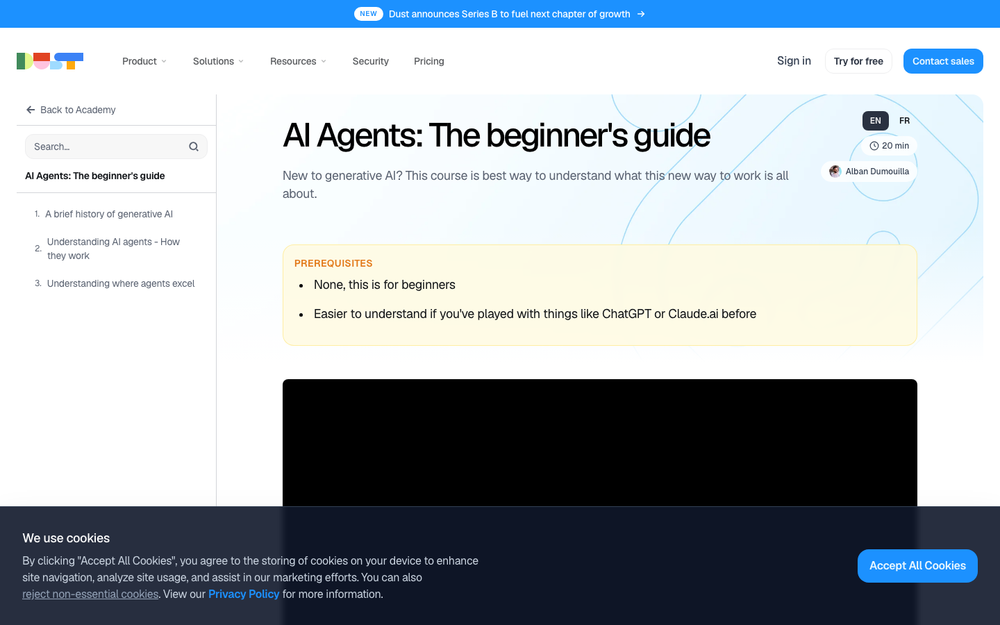

**背景信息：**

- ✅ **产品/公司定位（间接）**：页面本身是 Dust 旗下「Academy」的入门课程页，公司层面有明确信号——头条 banner「Dust announces Series B to fuel next chapter of growth」表明 Dust 是一家已完成 B 轮融资的成长期公司；课程末尾「Skip ahead to Course 2, where you'll learn how to use **Dust agents** hands-on」与「First steps on Dust →」暗示 Dust 的核心产品是「AI agents（AI 智能体）」平台。
- ✅ **目标用户与场景清晰**：该页对应课程明确面向 AI 零基础用户——「New to generative AI? This course is best way to understand what this new way to work is all about」，先决条件写明「None, this is for beginners」「Easier to understand if you've played with things like ChatGPT or Claude.ai before」。学习目标聚焦工作场景落地：「How to leverage them effectively in your daily work」「How to drive adoption in your team」（个人使用 + 团队推广双场景）。
- ✅ **核心叙事：区分「AI agent」与「raw model」**：页面反复强调智能体不等于裸大模型——「What AI agents are and how they differ from raw models」「From raw LLMs to AI agents」，并引出「agents 能否真正取代人类（spoiler: it's more nuanced than that）」「What agents DON'T replace」的克制叙事，体现 Dust 对 agent 边界的理性定位。
- ✅ **关键术语/概念**：页面教学体系输出了几个可作产品语境的核心概念——「The three building blocks of AI agents（智能体的三大构件）」「the agent loop（智能体如何"思考"的循环）」「Types of agents you'll encounter（智能体类型）」「how LLMs can use your own data（LLM 接入用户自有数据）」，后者隐含 Dust 的「连接企业数据」能力主张。
- P3 **产品功能仅以导航词形式出现，未在正文展开**：可见的产品能力词包括「Chrome Extension」「Frames」「Integrations」「Developer Platform」「Dust for Engineers」，以及按部门（Sales / Customer Support / Marketing / Engineering / Data & Analytics / Knowledge / IT / Legal / People）和行业（B2B SaaS / Consulting / Financial Services / Insurance / Marketplaces / Retail & E-commerce）切分的解决方案矩阵——但这些仅为站点导航，本课程页正文未对任意一项做功能性说明。
- P3 **理解缺口**：读完此页用户仍无法回答——(1) **Dust 到底是什么产品**？页面只讲「AI agents」通识，未给出 Dust 自身的一句话定义或与 ChatGPT/Claude 等的差异化主张；(2) 「**Frames**」是 Dust 的独有功能术语，但全程未解释含义；(3) 「让 LLM 使用你自己的数据」是关键卖点，但本页只点到、未说明 Dust 如何实现（数据连接 / 知识库 / 集成方式均缺失）。

#### B2: 背景 D2: Next Course First steps on Dust →

**URL:** https://dust.tt/academy/first-steps-on-dust

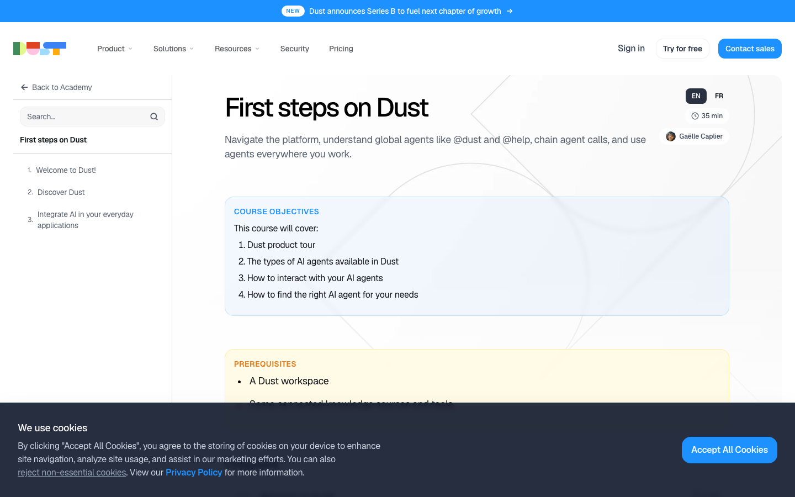

**背景信息：**

- P3 **产品/公司一句话定义**：该页面是 Academy 课程落地页（"First steps on Dust"），通篇没有给出 Dust 的正式一句话定义。最接近定义的表述是把 Dust 描述为一支"你的智能体团队"（"Your team of agents"），并强调"在你工作的任何地方使用智能体"（"use agents everywhere you work"）——可推断 Dust 是一个企业级 AI 智能体（AI agents）平台，但需要靠侧栏导航与课程目标拼凑，缺一句权威定义。
- ✅ **核心功能能力**（页面明确提及）：① 全局智能体 @dust 与 @help；② 链式调用智能体（"chain agent calls"）；③ 自建智能体（下一课"Build your own agents"）；④ 连接知识源与工具（"connected knowledge sources and tools"）；⑤ 多入口接入——Slack/Teams 调用、浏览器扩展（Chrome Extension）、以及 @dust 搭建 dashboard。
- ✅ **目标用户与场景**：页面用 Solutions 把目标用户切成两个维度——按部门（Sales、Customer Support、Marketing & Content、Engineering、Data & Analytics、IT、Legal、People、Knowledge、Productivity）和按行业（B2B SaaS、Consulting、Financial Services、Insurance、Marketplaces、Retail & E-commerce）。同时通过 "Developer Platform / Dust for Engineers / Github Repo" 表明也面向开发者自建场景，整体定位为面向团队的横向企业应用。
- ✅ **差异化主张 / 核心叙事**：主叙事是"无处不在 + 一支智能体团队"——即不局限于单一聊天框，而是通过 Slack、Teams、浏览器扩展把智能体嵌入日常工作流；同时强调"可自建智能体 + 可链式编排"，把 Dust 与单点 AI 助手区分开。页面顶部 "announces Series B to fuel next chapter of growth" 也在叙事上传递了公司成长阶段与资本背书。
- P3 **关键术语/概念**：页面引入了几个专有概念但未充分解释——"global agents"（全局智能体，如 @dust/@help，按 @提及方式调用）、"chain agent calls"（智能体链式调用/协作）、"workspace"（工作区，作为前置条件）、"Frames"（产品菜单里单列，但本页完全没说明它是什么）。这些术语对老用户友好，对新读者偏跳跃。
- P3 **理解缺口**：读完本页仍不清楚的关键点——(a) Dust 到底"是什么"的精确定义与底层（用什么大模型、是否自带/可选）；(b) "Frames" 这一产品模块的含义与用途；(c) 智能体的具体构建方式与能力边界（本页只预告"自建"，无细节）；(d) 定价与 Series B 的具体规模/时间（页面只有 Pricing 入口和一句融资标语，无数字）。

#### B3: 背景 D1: Welcome to Dust

**URL:** https://docs.dust.tt/docs/welcome-to-dust

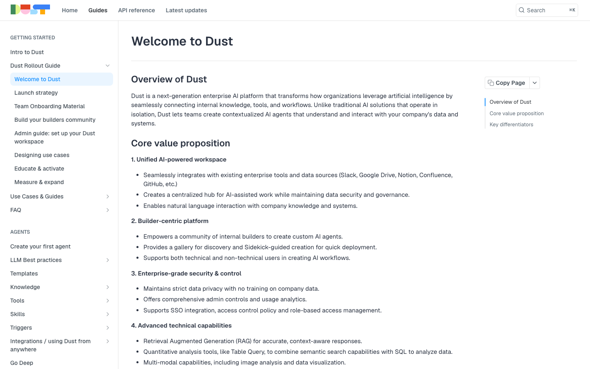

**背景信息：**

- ✅ **核心功能能力**：从导航结构可清晰提取出 Dust 的四大能力支柱——① 构建自定义 AI Agent（"Create your first agent"、"Agent Builder Sidekick"、模型选择/指令编写最佳实践）；② 海量第三方工具/连接器（Airtable、Asana、GitHub、Gmail、Google Drive、Notion、Slack、Salesforce、Snowflake、Zendesk、HubSpot、Jira 等 50+ 集成）；③ 知识检索能力（"Knowledge" 下的 Search data sources / Table queries / Extract data / Include data，并配 "Understanding Retrieval Augmented Generation"）；④ 自动化与协作（Triggers/Schedules/Webhooks、Wake-ups、Skills、PODS 团队空间）。
- ✅ **目标用户与场景**：页面以"按职能部门"组织典型场景，明确面向企业各团队——🤝 Sales、🏆 Customer Support、🎯 Marketing、🤖 Engineering、📈 Data Analytics、📖 Knowledge、👥 Recruiting & People、📦 Product & Design；PODS 章节进一步给出落地范例："Personal second brain""Initiative and project management""Ticket handling and support knowledge""One Pod per customer""Competitive intelligence"，指向企业内多部门协作型用户。
- ✅ **品牌叙事（企业级铺开 / "Builders 社区"）**：开篇 "Getting Started" 区块以 "Dust Rollout Guide""Launch strategy""Team Onboarding Material""Build your builders community""Admin guide""Educate & activate""Measure & expand" 构成完整的组织级推广方法论，传递出"不是个人工具、而是需要全公司分阶段 rollout 并培养内部 builders 的企业平台"这一核心叙事。
- ✅ **关键术语 / 概念**：页面暴露出多个 Dust 专有概念——**Agent**（用户自建的 AI 助手）、**PODS**（含 Members/roles、Tasks、Conversations、Files、Frames、Admin controls 的团队协作单元）、**Frames**（Go Deep 与 PODS 下均出现的产出/画布概念）、**Skills**（可复用能力，含 Skill Examples）、**Triggers / Wake-ups**（Schedules、Webhooks 驱动的自动触发）、**Agent Memory**（记忆工具）、以及 **@deep-dive Agent、Context Compaction、Branch a Conversation、Steering** 等对话增强特性。
- P3 **产品一句话定义缺失**：该页是文档/帮助中心的索引（标题虽为 "Welcome to Dust"，但正文节选全是目录导航），通篇**没有出现一句明确的产品定义或 slogan**（如 "Dust 是……平台"）。读者只能从 "Intro to Dust" 等条目反推它是"企业 AI Agent 平台"，建议补充官方原文定位句以消除歧义。
- P3 **理解缺口**：① **PODS 与 Frames 究竟是什么**——PODS 看似是带成员/任务的协作工作区、Frames 像是文档/输出载体，但索引未给出定义；② 缺少**定价、部署模式、数据安全/合规**等决策信息（FAQ 仅零散提到"agents 能访问哪些数据""是否联网"）；③ **差异化主张不明确**——虽以"集成广度 + 组织级 rollout"隐含卖点，但页面未直接对比同类产品或点明独家优势，无法判断 Dust 相较其他 AI Agent 平台的核心区隔。

#### B4: 背景 D1: Team Onboarding Material

**URL:** https://docs.dust.tt/docs/training-material

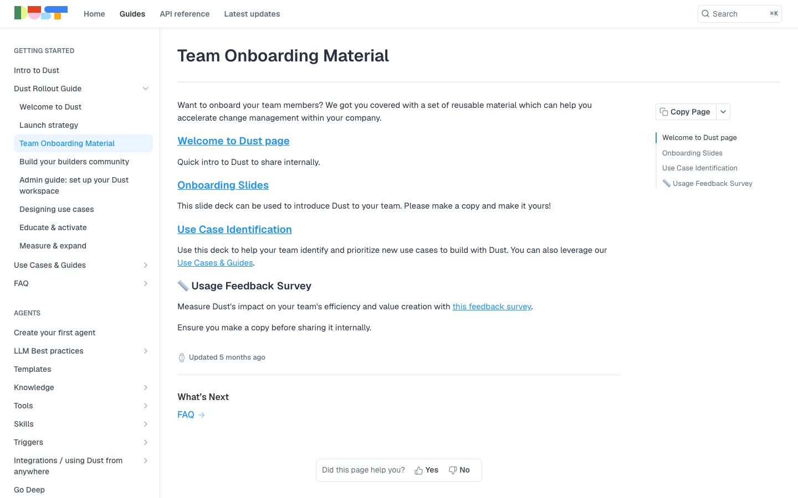

**背景信息：**

- P3｜产品一句话定义**：本页（"Team Onboarding Material"）抓取到的文本实际上是文档站的左侧**导航目录**，并不包含页面正文，因此没有可直接引用的"一句话定义"原文。仅能从信息架构推断 Dust 是面向团队的 **AI agent 构建与部署平台**（入门区有 "Intro to Dust" / "Welcome to Dust" / "Dust Rollout Guide"，主线章节为 "AGENTS → Create your first agent"），但这属于结构推断而非页面明示。
- ✅｜核心功能能力**（依据导航目录）：① 构建自定义 agent（Agent Builder、Create your first agent、LLM Best practices）；② 知识检索 / RAG（Search data sources、Table queries、Extract data、Include data、Understanding Retrieval Augmented Generation）；③ 40+ 外部工具连接器（Notion、Slack、GitHub、HubSpot、Salesloft、Google Drive、Snowflake、Jira、Zendesk、Salesforce 生态等）；④ 自动化与触发机制（Triggers、Schedules、Webhooks、Wake-ups、Skills）；⑤ 多入口接入（Slack、Teams、Zendesk、浏览器扩展、Raycast、Zapier/Make/n8n、邮件转发、Google Sheets 插件）。
- ✅｜目标用户与场景**：用例严格按**职能部门**组织 —— Sales、Customer Support、Marketing、Engineering、Data Analytics、Knowledge、Recruiting & People、Product & Design、Collaboration，表明目标是**跨职能的企业团队**；典型场景见 PODS Examples：客服工单与支持知识、竞品情报、项目/计划管理、内容与编辑生产、"个人第二大脑"、"每客户一个 Pod"。页面还显式区分了 **builder/管理员**角色（Build your builders community、Admin guide）与普通使用者。
- P3｜差异化 / 品牌叙事**：作为 onboarding 材料，本页突出的是**企业内部落地路径**而非与竞品的对比 —— 章节链条为 Launch strategy → Build your builders community → Designing use cases → Educate & activate → Measure & expand，核心叙事是"如何在组织内推广采用并衡量扩张"。页面未出现任何与其他 AI 产品的直接差异化主张。
- ✅｜关键术语 / 概念**：**PODS**（含 Members/roles、Tasks、Conversations、Files、Frames、Admin controls 的协作工作空间）、**Agents / Builders**（agent 及其创建者人群）、**Skills / Triggers / Schedules / Wake-ups**（agent 自动化与定时机制）、**Agent Memory**（记忆工具）、**Frames**、**Steering**、**Branch a Conversation**、**Context Compaction**（对话控制类能力）、**@deep-dive Agent**。
- P3｜理解缺口**：① 缺正文，无法确认 Dust 的官方价值主张，也无法说明它与通用 LLM 聊天机器人的本质区别；② "Pod""Frame""Wake-ups""Steering"等专有名词仅在目录中出现、未给出定义；③ 完全未涉及定价、部署形态、数据安全 / 合规；④ 无法判断 "Team Onboarding Material" 这一页本身究竟提供哪些实际内容（节选中只有标题加全站导航）。

#### B5: 背景 D1: Overview

**URL:** https://docs.dust.tt/docs/pods-overview

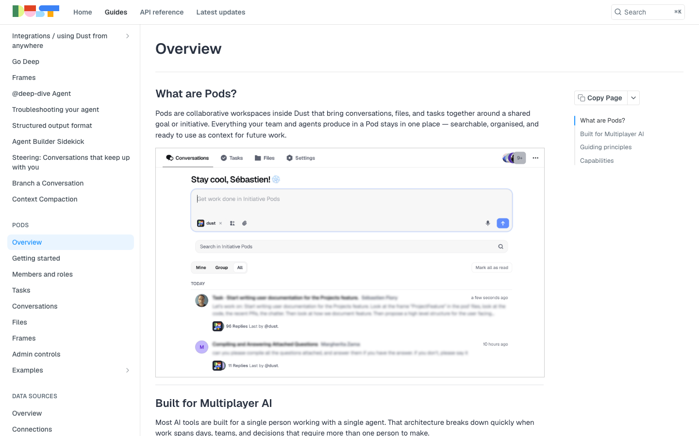

**背景信息：**

- ✅ **核心功能能力清晰可辨**：从导航结构可提炼出 Dust 的五大能力栈 —— ①自定义 AI Agent（"Create your first agent"、"Managing Agents"）；②知识接入（"Search data sources / Table queries / Extract data / Include data"）；③超长连接器列表（Airtable、GitHub、Slack、Notion、HubSpot、Salesloft、Snowflake、Zendesk 等 50+ 工具）；④自动化触发（"Triggers / Schedules / Webhooks / Wake-ups / Skills"）；⑤随处可用的嵌入式集成（"Dust in Slack / Teams / Zendesk"、Browser Extension、Raycast、Zapier、n8n）。
- ✅ **目标用户与场景按职能铺开**：页面以部门为轴划分用例（"🤝 Sales / 🏆 Customer Support / 🎯 Marketing / 🤖 Engineering / 📈 Data Analytics / 📖 Knowledge / 👥 Recruiting & People / 📦 Product & Design"），并配合 "Admin guide: set up your Dust workspace"、"Team Onboarding Material"，明显指向**企业内多职能团队 + 工作区/管理员部署**的 B2B 场景；Pods 的示例（"One Pod per customer"、"Competitive intelligence"、"Ticket handling and support knowledge"、"Content and editorial production"）进一步落实了具体落地场景。
- ✅ **独有术语体系成型，叙事偏"全员造 Agent"**：页面凸显多个产品专属概念 —— **Pods**（带 Members/roles、Tasks、Conversations、Files、Frames 的协作空间）、**Frames**、**Skills**、**Wake-ups/Triggers**、**@deep-dive Agent**、以及 "Steering / Branch a Conversation / Context Compaction" 等对话控制机制。配合 "Build your builders community"、"Dust Rollout Guide"、"Educate & activate / Measure & expand"，传递出**让组织内非技术"builders"自行搭建并推广 Agent**的核心叙事。
- P3 **缺乏一句话产品定义（最关键缺口）**：页面只有 "Intro to Dust"、"Welcome to Dust" 这类标题，**正文未给出任何"Dust 是什么"的定义句或品牌 Slogan**，也未出现与竞品的差异化主张。读者无法从本页确认 Dust 究竟自我定位为"企业 AI 助手平台 / Agent 操作系统 / 知识协作工具"中的哪一种。
- P3 **关键概念含义留白**：**Pods 与 workspace 的关系**、**Frames 到底是什么产出物**、以及 Dust 是否多模型（仅从 "Choosing the Right AI Model"、"Understanding LLMs Context Windows" 推测支持多模型，但无明示）均未在本页解释，仅以导航条目列出，需进入子页才能理解。
- P3 **商业化与部署信息缺失**：页面未提及定价、目标客户规模、数据安全/合规承诺（虽有 Vanta 连接器但非产品自身定位），"Does the Dust agent give accurate and safe responses?" 等仅作为 FAQ 标题出现，读完本页仍无法判断 Dust 面向中小团队还是大型企业、如何收费。

#### B6: 背景 D1: Getting started

**URL:** https://docs.dust.tt/docs/pods-getting-started

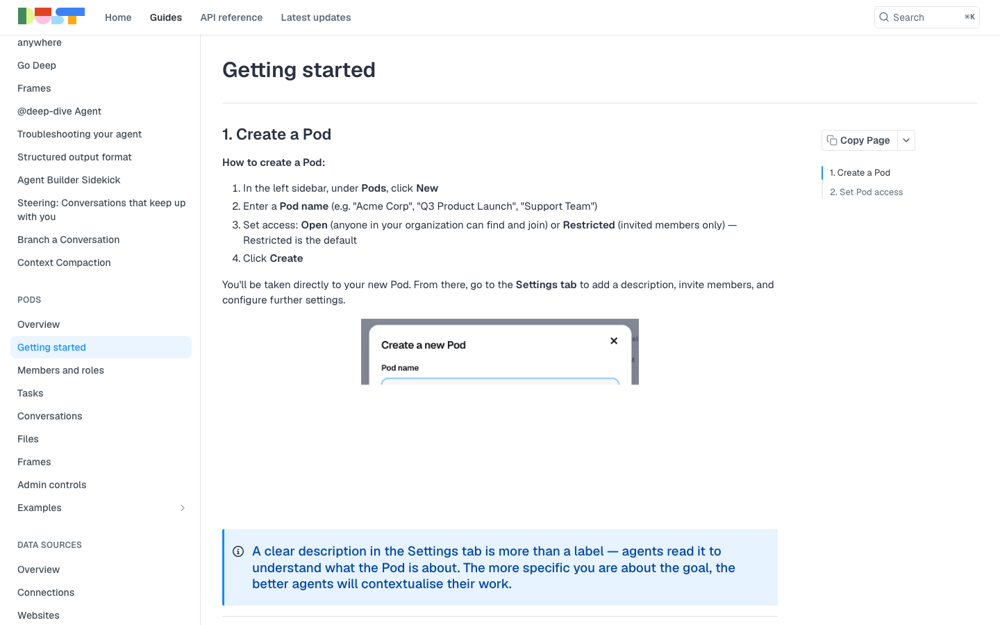

**背景信息：**

- ✅ **核心功能能力清晰可辨**：从导航结构可提炼出 Dust 的五大能力支柱——① Agents（"Create your first agent"、自定义 agent、LLM 最佳实践）；② Knowledge（"Search data sources / Table queries / Extract data / Include data" 即 RAG 检索）；③ 海量第三方 Tools 集成（Notion、Slack、GitHub、Salesforce 系、HubSpot、Snowflake、Zendesk 等 50+ 连接器）；④ 自动化（Triggers / Schedules / Webhooks / "Wake-ups" / Skills）；⑤ PODS 协作空间（Members and roles / Tasks / Conversations / Files / Frames）。
- ✅ **目标用户 = 企业全部门团队，定位为"组织级 AI agent 落地平台"**：页面用 "Use Cases & Guides" 按职能切分场景——🤝 Sales、🏆 Customer Support、🎯 Marketing、🤖 Engineering、📈 Data Analytics、📖 Knowledge、👥 Recruiting & People、📦 Product & Design；并配有 "Dust Rollout Guide / Launch strategy / Team Onboarding Material / Admin guide: set up your Dust workspace / Measure & expand" 一整套铺开流程，说明它面向的是 IT/Admin 主导的企业级规模化部署，而非个人工具。
- ✅ **"从任何地方使用 Dust" 是明确的产品叙事**："Integrations / using Dust from anywhere" 章节列出 Dust in Slack、Dust in Zendesk、Dust in Teams、Browser Extension、Raycast Extension、Zapier/Make.com/n8n/Power Automate、Email to Agents、Google Sheets Add-on——核心主张是 agent 嵌入用户既有工作流，而非要求用户切换到新界面。
- ✅ **产品独有术语可识别但多数仅有名字、缺少定义**：可辨认的专有概念包括 **PODS**（带 Members/Tasks/Conversations/Files/Frames 的协作空间，并给出 "Personal second brain / One Pod per customer / Competitive intelligence" 等示例）、**Frames**、**Skills**、**Wake-ups**、**Triggers**、**Steering**、**Branch a Conversation**、**Context Compaction**、**@deep-dive Agent**、以及面向内部推广者的 **"builders community"**。这些都是 Dust 自创的功能词。
- P3 **缺少"一句话产品定义 / 品牌 slogan"**：页面虽有 "Intro to Dust" 和 "Welcome to Dust" 标题，但节选文本里没有出现"Dust 是一个 ⋯⋯ 的平台"这类显式定位句，也没有与竞品（如 Glean、Copilot、Notion AI）的差异化对比。读者只能从功能清单反推它是"企业 AI agent 构建与协作平台"，但官方原话的核心叙事缺位。
- P3 **多个关键概念与缩写无解释，构成理解缺口**：① **PODS 与 workspace、Frames、Skills 三者的边界和关系**未在该页澄清；② 文末孤立出现的缩写 **"DAT"** 没有任何上下文；③ 页面属典型文档目录（TOC），几乎所有概念只是链接标题，缺少定义正文；④ 完全未涉及定价、可用模型范围、数据安全/合规细节——这些需进入对应子页面才能补全。


### 2.4 产品定位与策略

### 1. 把 AI 做成"一支能协作的 agent 团队"，而不是一个聊天助手
**核心判断**: 产品的基本单位是按岗位命名、能彼此接力的多个 agent，用户像调度同事一样使用它们，而非面对单一问答框。
**支撑证据**:
- [C1] 首页用 @LeadQual / @TicketRouter / @LaunchOps 等按 Sales、Support 等职能切分的具名 agent，并演示 David 让 @LaunchOps 拉文档、触发分发工作流的接力场景
- [B2] "First steps on Dust" 把 Dust 描述为"你的智能体团队"，并提供全局 agent @dust/@help 与"链式调用 agent"能力
- [S1] 产品页主标题主打"build your team of AI agents"
**对用户的含义**: 用户买的不是一个对话工具，而是一组可分工、可串联的虚拟同事，使用心智更接近"组建团队"。

### 2. 刻意做成横向、全公司通用平台，而不是收窄到某个垂直行业
**核心判断**: 产品主动把目标用户铺到所有职能与多个行业，定位为"全公司 AI 平台"而非单一场景工具。
**支撑证据**:
- [C5] Footer 的 Solutions 覆盖 Sales / Support / Engineering / Legal 等 10 个部门 + 6 个行业
- [S4] 客户案例页按 15 个职能 + "Company-Wide AI Adoption" 维度筛选
- [B1] 课程页同样按部门和行业（B2B SaaS / Consulting / Financial Services 等）切分解决方案矩阵
**对用户的含义**: 几乎任何团队都能找到入口，但也意味着产品不为某个行业做深度定制，垂直深度需靠自建补齐。

### 3. 核心卖点押在"能执行动作的 agent"，用"连接器 + 可调用动作"定义能力
**核心判断**: 区别于纯问答/检索，Dust 把价值落在 agent 能在第三方系统里真正读写、执行操作。
**支撑证据**:
- [S3] 集成页 59 个集成横跨 12 个品类，且每个标注 "X actions available"（如 Amplitude 24 个动作，可 search/query/create 图表与看板）
- [C2] 定价页把核心能力之一明确写为 "Custom agents which can execute actions"
- [C1] 演示 agent 从 Snowflake 拉实时用量数据、再与 HubSpot 的 ICP 评分交叉比对
**对用户的含义**: 理论上 agent 能替你在 CRM/数据仓库里动手干活，但各页都没讲清"具体能执行哪些动作、是否需人工审批"，落地能力需注册后自行验证。

### 4. 用"语义上下文层"作为差异点，强调理解企业知识而非简单检索
**核心判断**: 产品把"综合理解公司知识并据此行动"作为相对通用 RAG 工具的关键区分主张。
**支撑证据**:
- [C1] 首页点出语义层会"综合"公司知识，让 agent"理解而非仅检索"信息
- [C5] 文案强调"不只是从 Slack/CRM 检索，而是综合理解并据此行动"
- [S1] 反复强调 agent 懂公司上下文，但未说明是 RAG、定期索引还是实时 API
**对用户的含义**: 卖点是更聪明的企业知识理解，但实现机制（索引方式、更新频率、权限边界、幻觉控制）始终没讲透，需自行评估其与普通检索的实际差距。

### 5. 走"全员无代码自建 agent"路线，把搭建权交给业务团队
**核心判断**: 产品强调任何人都能不写代码搭建并迭代 agent，而非只交给工程师或只提供固定预置模板。
**支撑证据**:
- [S1] 页面强调"anyone on your team"都能创建懂公司上下文的 agent，并收集反馈迭代
- [S2] 销售方案页强调"without writing a single line of code"即可搭建自定义 agent
- [C7] 客服页把"无需写一行代码即可创建自定义 AI agent"作为核心机制承诺
**对用户的含义**: 上手门槛低、灵活度高，但代价是搭建流程、权限边界、人工审核等治理细节几乎没说，企业落地时要自己补。

### 6. 商业模式：席位订阅打底，Pro 即放开全部 AI 能力，企业版主要卖治理与规模
**核心判断**: 用"小团队 Pro 就能用上全部 AI 能力、企业版只加安全治理"的分层，降低进入门槛、靠治理向上扩张。
**支撑证据**:
- [C2] 核心 agent / 模型 / 集成能力在 Pro 即开放，Enterprise 主要增加 SSO、SCIM、数据驻留、更大存储等
- [C2] 程序化调用走"免费 credits + 超出后固定/自定义计价"的额度模式（但未解释 1 个 credit 等于什么）
**对用户的含义**: 小团队用 Pro 即可获得完整能力、试用成本低；但 credit 计量口径不透明，把 Dust 当后端能力嵌入自有系统时难以预估成本。

### 2.5 公司基本信息

#### ✅ 实体身份已确认

基于域名 + 产品描述 + 官方博客/Crunchbase 的交叉核对，目标产品 `dust.tt` 对应：**Dust**（法律实体 Permutation Labs SAS）。

核心锚点证据：该公司**全部三轮融资公告均发布在 `dust.tt` 自家博客域名下**（[Series B 公告](https://dust.tt/blog/series-b-multiplayer-ai)、[Series A 公告](https://dust.tt/blog/dust-seriesa-sequoia-leading-ai-platform)、[Seed 公告](https://dust.tt/blog/announcing-our-seed-round)），且 [Crunchbase 公司页](https://www.crunchbase.com/organization/dust-5f56)、[Sequoia 官方投资文章](https://sequoiacap.com/article/partnering-with-dust-llm-powered-productivity/)、[Dust About 页](https://dust.tt/home/about) 均指向同一主体。注意与 DUST Identity、Dust Labs、Dust Mobile 等同名公司**无关**，已排除。

#### 公司基础事实表

| 项 | 内容 | 置信度 | 来源 |
|---|---|---|---|
| 公司名称 | Dust（法律实体 Permutation Labs SAS） | ✅ 直接 | [crunchbase](https://www.crunchbase.com/organization/dust-5f56) |
| 成立年份 | 2023 年 2 月（数据商 Tracxn/Crunchbase 部分标 2022，以创始人与官方口径 2023 为准） | ✅ | [series-a 博客](https://dust.tt/blog/dust-seriesa-sequoia-leading-ai-platform) / [sifted](https://sifted.eu/articles/genai-dust-silicon-valley-paris) |
| 总部地点 | 法国巴黎（现为巴黎 + 旧金山双地办公） | ✅ | [sifted](https://sifted.eu/articles/dust-series-b-40m) |
| 产品上线 | 平台自 2023 年起运营；定位为企业级 AI agents（多智能体协作）平台 | ✅ | [series-b 博客](https://dust.tt/blog/series-b-multiplayer-ai) |
| 当前阶段 | Series B（2026 年 5 月完成） | ✅ | [series-b 博客](https://dust.tt/blog/series-b-multiplayer-ai) |
| 融资总额 | 超 $60M（累计约 $61.5M，3 轮） | ✅ | [crunchbase](https://www.crunchbase.com/organization/dust-5f56) |
| 团队规模 | ~100 人（2026 年 Series B 时点口径） | ⚠️ 媒体口径 | [sifted](https://sifted.eu/articles/dust-series-b-40m) |
| 行业类别 | 企业 AI / AI Agents 平台 / 生产力 SaaS | ✅ | [sequoia](https://sequoiacap.com/article/partnering-with-dust-llm-powered-productivity/) |

#### 融资历史

| 轮次 | 时间 | 金额 | 领投 + 主要参与方 | 来源指向本域名? |
|---|---|---|---|---|
| Seed | 2023-06 | €5M（约 $5.5M） | 领投 Sequoia Capital；参投 XYZ、GG1、AIGrant、Connect Ventures、Motier VC、Remote First、Tiny Supercomputer、Seedcamp 及天使 | ✅（dust.tt 博客公告） |
| Series A | 2024-06 | $16M | 领投 Sequoia Capital；参投 XYZ、GG1、Connect Ventures、Seedcamp、Motier Ventures | ✅（dust.tt 博客公告） |
| Series B | 2026-05（5/18） | $40M | 领投 Abstract + Sequoia；战略参投 Snowflake Ventures、Datadog | ✅（dust.tt 博客公告） |

> Sequoia 连续领投/参与三轮，是 Dust 最核心的长期资方。

#### 创始人 / 核心团队背景

- **Gabriel Hubert**（联合创始人 & CEO）— 连续创业者；2011 年与 Stanislas Polu 共同创办数据分析公司 **TOTEMS**（2014/2015 年被 **Stripe** 收购），随后在 Stripe 工作约 5 年负责产品与地域扩张；回法国后曾领导健康险独角兽 **Alan** 的产品团队。[来源](https://www.ia40.com/blog-podcast/dust-founders-bet-foundation-models-will-change-how-companies-work)
  - 验证：本人作为作者署名发布于 `dust.tt/blog` Series B 公告（✅）
- **Stanislas Polu**（联合创始人 & CTO）— 前 **OpenAI** 研究/工程人员（在美约 7 年，参与大模型相关工作）；与 Hubert 是 TOTEMS/Stripe 的长期搭档。[来源](https://sequoiacap.com/podcast/training-data-dust/)
  - 验证：Sequoia 官方播客 + Dust About 页均关联 `dust.tt`（✅）

两位创始人「离开硅谷、回到巴黎创业」是公司常被引用的标签性叙事。其余高管未在公开域名锚定来源中明确列出，**未找到**可靠的第三/第四号高管资料。

#### 近期重大动态（最近 6–12 个月）

- **2026-05-18**：完成 $40M Series B，由 Abstract 与 Sequoia 领投，Snowflake Ventures、Datadog 战略参投，累计融资超 $60M。[来源](https://dust.tt/blog/series-b-multiplayer-ai)（✅ 官方域名）
- **增长指标**：服务 3,000+ 家组织、约 41,000 月活用户、平台累计部署 300,000+ 个 agents；公司称营收较 2024 年增长约 9 倍。[来源](https://sifted.eu/articles/dust-series-b-40m)（⚠️ 媒体引用官方口径）
- **留存表现**：2025 年净收入留存（NRR）报称约 240%、零流失（zero churn）。[来源](https://sifted.eu/articles/dust-series-b-40m)（⚠️ 媒体口径，未独立核实）
- **战略方向**：本轮主题为「multiplayer AI / human-agent collaboration」，即从单智能体走向团队级多智能体协作，并借 Snowflake、Datadog 等战略投资方深化企业数据与可观测性生态绑定。[来源](https://thenextweb.com/news/dust-series-b-40-million-multiplayer-ai-enterprise)（✅ 报道引用本域名公告）

#### 综合判断

Dust 是一家 2023 年初由两位连续创业者（前 Stripe 产品负责人 + 前 OpenAI 工程师）在巴黎创立的企业级 AI agents 平台公司，当前处于刚完成 $40M Series B 的成长期（累计约 $61.5M）。其最突出的资本优势是 **Sequoia 连续三轮背书**，并在 B 轮引入 Snowflake、Datadog 等具备企业数据/监控渠道的战略投资方，为「连接企业知识源 + 多智能体协作」的产品定位提供了生态杠杆；增长侧的 3,000+ 客户、~240% NRR、9 倍营收增长（均为公司自报口径，建议作参考）也支撑了 B 轮叙事。

潜在短板在于：团队规模约 100 人、整体融资额在头部企业 AI 赛道中仍偏中小，面对 OpenAI、Microsoft Copilot、Glean 等资源量级更大的竞品，护城河更多依赖「企业连接器 + 多智能体编排」的产品深度而非资本厚度。值得关注的方向是其 B 轮主推的「multiplayer / human-agent collaboration」能否兑现为可量化的企业协作粘性，以及巴黎—旧金山双地团队在美国市场的扩张节奏。

---

## 3. 体验流程记录

### 3.1 官网叙事分析

#### 高频关键词

| 关键词 / 短语 | 出现频次 / 权重 | 在哪类页面出现 | 想建立的印象 |
|---|---|---|---|
| AI agent / agents（智能体，常带 @人名） | 极高（几乎每页） | 首页、产品页、解决方案页、客户页、About、Academy [C1][S1][S4][S7][B1] | 这是个"agent 平台"，不是又一个聊天框 |
| Your team of agents / build your team of AI agents（一支 AI agent 团队） | 高 | 首页标题、产品页标题、Academy [C1][S1][B2] | 你买的是一支会分工接力的"数字团队"，而非单点工具 |
| Company context / Intelligent Context Layer（公司上下文 / 语义层） | 高 | 首页、Footer、产品页、About [C1][C5][S1] | 它"理解"而非"检索"你公司的知识，比通用 RAG 高级 |
| without writing a single line of code（无需写一行代码） | 高 | 客服页、销售页、客户案例 [C7][S2][S4] | 全员可上手自建 agent，落地门槛极低 |
| Connect / Integrations / knowledge sources & tools（连接 / 集成） | 中高 | Footer、产品页、销售页、Academy [C5][S1][B2] | 能插进你现有的工具栈与数据仓库 |
| agents that do real work / do real work（真正干活） | 中 | About、Academy [S7][B1] | 不是会聊天的玩具，是能完成实际任务的执行体 |
| everywhere you work（Slack / Teams / Chrome Extension，随处可用） | 中 | Footer、Academy [C5][B2] | 嵌入日常工作流，不用切换到新软件 |
| AI Operating System（企业 AI 操作系统） | 中 | About、客户案例 [S7][S4] | 它是底层基础设施级的存在，而非边缘小工具 |
| 量化战绩（50% / 90% / 6h / 1,800h / 4x / 80%） | 高 | 客服页、销售页、客户墙、案例 [C7][S2][S4][S5] | 价值是可被数字证明的真实 ROI |

#### 说服手法分析

**1. 给 agent 起人名并用 @ 提及，把软件包装成"同事团队"**
- 具体表现：用 @LeadQual / @TicketRouter / @ProductExpert / @LaunchOps / @ContentWriter 按职能切分，并演示"David 让 @LaunchOps 从 Google Docs 拉案例、触发分发"的真实场景 [C1]；通篇主打"Your team of agents" [B2]。
- 想达到的效果：让用户在心智里把 agent 当成可以"喊一声就办事"的人类同事，而非冷冰冰的功能。

**2. 先否定"裸模型 / 聊天助手"，再把自己抬到更高一档**
- 具体表现："agents that do real work" [S7]、"What AI agents are and how they differ from raw models" / "From raw LLMs to AI agents" [B1]，并强调"不只是从 Slack/CRM 检索，而是综合理解并据此行动" [C5]。
- 想达到的效果：暗示 ChatGPT 类工具只是"会聊天的玩具"，Dust 才是"能真正落地干活"的高一级产品。

**3. 用密集的量化战绩替代机制说明**
- 具体表现："解决时长降 50%、每周每人省 6h，Malt 从 6 分钟/工单降到几秒" [C7]、"90% RFP 提速、每周每人省 8h" [S2]、"Profound 每月回收 1,800+ 小时、Electra 快 80%、Clay 4x" [S4][S5]。
- 想达到的效果：用别人已验证的结果制造"它确实有效"的安全感，绕开"它具体怎么实现"的追问。

**4. 按部门 / 行业铺开解决方案矩阵，让人"对号入座"**
- 具体表现：Footer 与客户页列出 Sales / Support / Engineering / Legal / HR / IT 等 10–15 个职能 + 6 个行业，并标注"Company-Wide AI Adoption" [C5][S4][B2]。
- 想达到的效果：无论读者属于哪个岗位都能立刻找到"为我准备的入口"，强化"横向通用、全公司级平台"的定位。

**5. 用融资与客户 logo 做权威背书**
- 具体表现：站点顶部常驻"Dust announces Series B to fuel next chapter of growth" [B1][B2]，客户墙堆叠 Clay、Malt、Profound、Back Market、Spendesk 等品牌 [S4]。
- 想达到的效果：用资本与知名客户的社会认同，替"产品靠不靠谱"做担保。

#### 整体评价

Dust 想让你感觉它是"一支随处可用、能跨企业知识与工具、真正替你干活的具名 AI agent 团队"——刻意把自己定位在"聊天助手"之上、接近"企业 AI 操作系统"的高度。这套说法在**愿景叙事、量化战绩和社会认同**上做得相当扎实、可信度高；但在**关键工作机制**（集成清单、agent 自主程度与审批边界、知识如何接入更新、核心模块 Frames 究竟是什么）上几乎全程留白，属于典型的"结果可信、机制存疑"——印象塑造的功力明显强于可被验证的功能交代。

### 3.2 测点流程详情


### 🏠 首页（2 个测点）

**该模块覆盖页面**:

- `https://dust.tt/`

#### C1: Homepage 5-second test

**URL:** https://dust.tt/

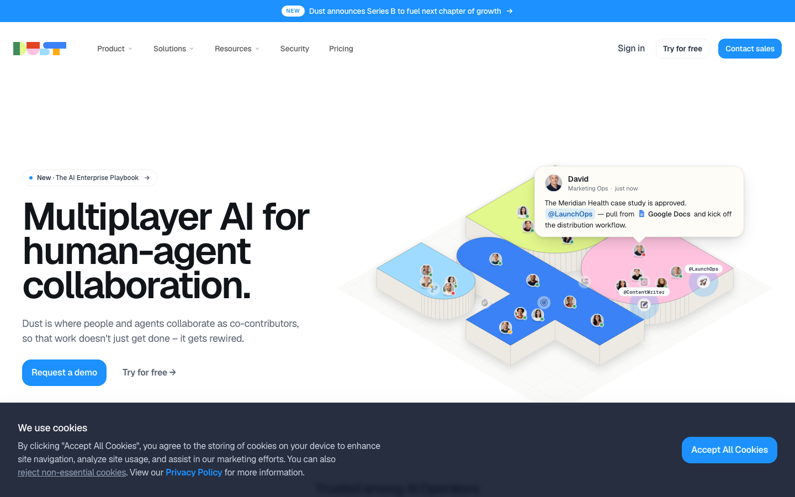

**观察：**

- ✅ 产品核心能力清晰**：页面明确传达 Dust 是一个"多人协作式 AI 工作空间"，让人与 agent 作为对等贡献者协作，并共享同一套知识、工具、对话和通知。这比泛泛的"AI 助手"定位更具体——它把卖点落在"共享上下文 + 多 agent 协同"而非单点问答上。
- ✅ 用具名 agent 演示了实际工作流**：@LeadQual / @TicketRouter / @ProductExpert / @Incident / @LaunchOps / @ContentWriter 等按 Sales、Support、Engineering、Marketing 等职能切分，并配了一个真实场景（David 让 @LaunchOps 从 Google Docs 拉取案例、触发分发工作流）。读者能直观理解"产品能为我的某个岗位做什么、agent 之间如何接力"。
- ✅ "智能上下文层"揭示了差异化工作机制**：页面点出语义层会"综合"公司知识，让 agent "理解而非仅检索"信息，并暗示可接入 Slack、CRM 等。这说明产品能力不止于集成连接器，而强调对企业知识的语义化加工——是其相对通用 RAG 工具的关键区分点。
- P2 agent 的"能力边界 / 自主程度"未说明**：示例展示 agent 能"拉取文档、触发分发工作流",但没说清 agent 究竟能执行哪些动作（只读检索？写入？调用外部 API？跨系统自动化到什么程度），也未说明是否需人工审批。读者难以判断这是"会聊天的助手"还是"能真正落地执行任务的 agent"。
- P2 集成与可构建性信息缺口**：导航虽列出 Chrome Extension、Frames、Integrations，但首页未给出可连接的工具清单、agent 是否可由用户自定义搭建、以及底层用哪些模型。对评估"能否接入我现有的知识源和工具栈"这一关键采购问题，信息不足。

#### C5: Footer audit

**URL:** https://dust.tt/

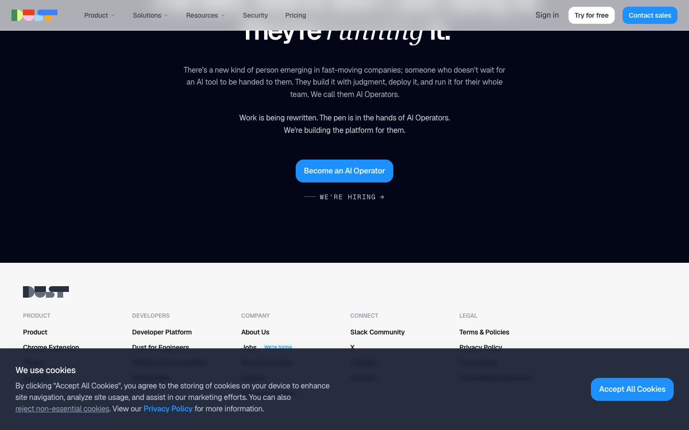

**观察：**

- ✅ Footer 的 Product 分区直接暴露了产品的三个核心载体**：Chrome Extension（浏览器内调用 agent）、Frames、Integrations，说明 Dust 不是单一 Web App，而是「插件 + 集成 + 某种工作界面」的组合形态。配合正文里 @LeadQual 从 Snowflake 拉实时用量数据、再与 HubSpot 里的 ICP 评分交叉比对的例子，能让人理解 agent 是「能跨数据仓库 + CRM 读数并联动」的执行体，而非纯聊天机器人——这是页面最有信息量的能力佐证。
- P1 "Frames" 作为并列的核心 Product 条目却完全无功能说明**。它和 Chrome Extension、Integrations 同级，显然是产品主形态之一，但全页没有任何一句解释 Frames 是什么（是 agent 的可嵌入界面？画布？文档工作区？）。读者无法判断这个核心模块「能为我做什么」，是最关键的功能描述缺口。
- P2 Footer 的 Solutions 分类（Sales / Support / Engineering / Legal 等 10 个部门 + 6 个行业）揭示了产品定位是「横向通用 agent 平台」**，每个部门入口暗示有对应的预置 agent / 工作流模板（呼应正文 @TicketRouter、@OnboardGuide、@LaunchOps 等命名）。但 footer 仅是导航罗列，没有任何一句说明各部门具体提供哪些开箱即用能力，功能信息需逐个点进去才能获知，本页无法判断各场景的实际功能边界。
- P2 "Integrations" 仅作为一个导航链接出现，缺少可见的集成清单或数量**。正文虽然点名了 Snowflake、HubSpot、Slack、CRM，但这是「举例」而非「能力盘点」——读者无法得知到底支持多少、哪些类别的系统集成，而集成广度恰恰是这类 agent 平台的核心采购决策点。
- P2 "Intelligent Context Layer / 语义层综合企业知识"是被强调的差异化能力，但工作机制说明在本页被截断**。文案声称它「不只是从 Slack/CRM 检索，而是综合理解并据此行动」，却没有解释如何综合(索引方式/更新频率/权限边界/幻觉控制)。能力主张清晰，但支撑这一主张的关键功能细节缺失，难以评估其与普通 RAG 检索的实际区别。


### ✨ 产品功能 / 介绍（1 个测点）

**该模块覆盖页面**:

- `https://dust.tt/home/product`

#### S1: Features / Product page

**URL:** https://dust.tt/home/product

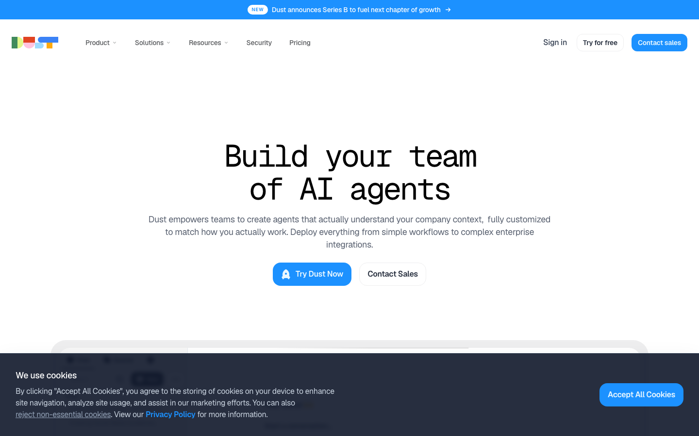

**观察：**

- ✅ + P2｜核心能力清晰，但"工作机制"留白**：页面明确传达了产品做什么——让团队（"anyone on your team"）创建懂公司上下文的 AI agent，可调指令/模板、配置数据抽取与转换工具、连接 Notion/Slack/GitHub/外部网站、自由切换 OpenAI/Anthropic/Gemini/Mistral 模型，并支持代码化扩展自定义工具与集成。能力面铺得很全。但**关键工作机制完全没说**：agent 究竟"如何"理解公司上下文——是 RAG 检索、定期同步索引、还是实时调 API？"access everything via APIs"只给了结论没给原理。**P2：知识接入与更新机制缺失，用户无法判断数据新鲜度与覆盖范围**。
- P1｜"build your team of AI agents" 的多 agent 协作能力没有兑现说明**：标题主打"打造一支 AI agent 团队"，强烈暗示多 agent 编排/相互调用，但正文全程在讲"单个 agent 怎么造、怎么连数据、怎么换模型"，从未解释 agent 之间能否协作、能否互相调用、是否有 orchestration/路由层。**这是页面最大的功能预期落差——核心卖点的承诺与正文证据不匹配**。
- P2｜agent 的"部署形态与触发方式"缺位（输入/输出不明）**：页面说"deploy everything from simple workflows to complex enterprise integrations",却没说 agent 造好后**跑在哪里、怎么被触发**——是 Slack 内对话、网页 chat、Chrome Extension 内嵌、还是可定时/事件触发?导航里的 **Chrome Extension 和 Frames 两个产品只列名、零解释**,用户读完不知道它们各自承担什么功能职责。典型使用场景(谁在什么时刻唤起 agent)始终是抽象的。
- P2｜功能细节多处"点到为止",缺可验证的具体度**:"specialized tools for data extraction, transformations, or advanced operations" 没有举出任何一个具体工具或输入/输出示例;集成只给"Notion、Slack、GitHub、external websites…and more",**无完整集成清单**,用户无法确认自家关键系统(CRM、数据库、工单系统)是否被支持。自定义能力示例还被截断("semantic search, SQ…"),连示例本身都不完整。
- P3｜"anyone can create agents" 抛出能力却回避治理细节**:页面强调全员可建 agent 并收集反馈迭代,这是清晰的协作工作流卖点;但对随之而来的**权限、审批、数据访问边界**只字未提。对企业买家而言,"谁能看到/调用哪些数据源"是功能决策点,页面把它留给了想象。


### 🎯 解决方案 / 场景（8 个测点）

**该模块覆盖页面**:

- `https://dust.tt/home/solutions/sales`
- `https://dust.tt/home/solutions/dust-platform`
- `https://dust.tt/home/solutions/marketing`
- `https://dust.tt/home/solutions/engineering`
- `https://dust.tt/home/solutions/data-analytics`
- `https://dust.tt/home/solutions/knowledge`
- `https://dust.tt/home/solutions/it`
- `https://dust.tt/home/solutions/recruiting-people`

#### S2: Use cases / Industry

**URL:** https://dust.tt/home/solutions/sales

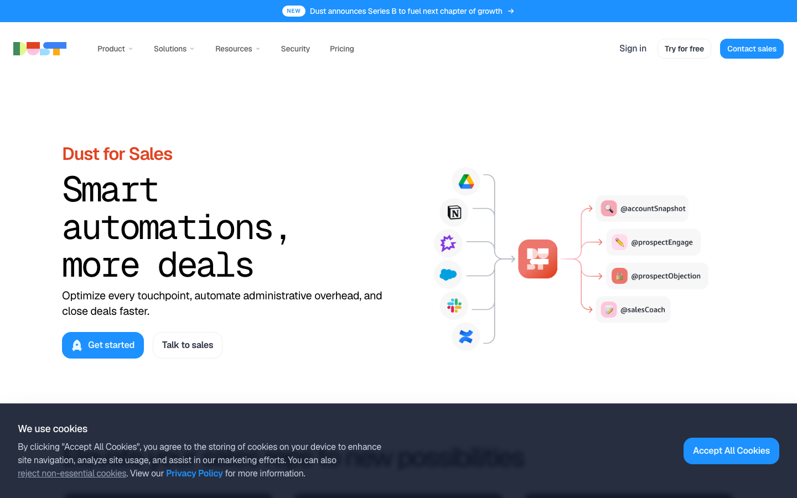

**观察：**

- ✅ 页面清晰揭示了 Dust for Sales 的核心能力：**无代码自定义 agent 构建**（"without writing a single line of code"）+ 四类预置销售工作流（Account snapshot 账户概览、Engage and re-engage 冷邮件/会议跟进、Prospect questions RFP 应答、Sales insights 通话复盘教练），覆盖了销售从准备、触达到复盘的完整链路，读者基本能理解"产品能为销售做什么"。
- ✅ 功能与具体问题的对应明确：自动化 admin/数据录入解决"销售时间被事务性工作挤占"，即时调取产品/竞品/安全信息解决"RFP 与客户问题响应慢"，并用 **90% RFP 提速、每周每人省 8h** 量化了价值，使用场景（备会、账户交接、冷邮件、通话教练）落地感强。
- P1** 关键集成机制未说明：页面多次提到使用 **CRM data 和 call transcripts** 作为 agent 输入，但完全没说支持哪些 CRM（Salesforce/HubSpot？）、通话录音从何接入（Gong/Zoom？）、如何授权与同步——销售最关心的"能不能连上我现有工具栈"无从判断。
- P2** Agent 的输入/输出与工作机制描述偏营销化、缺细节：例如"Craft account overviews""Extract winning narratives from calls"只说做什么，未说明数据来源范围、生成结果如何交付（是 Slack/邮件/CRM 内嵌？是否可编辑、是否带引用溯源）。Clay 的证言提到"instant, cited answers"暗示有引用功能，但正文未把这一卖点讲清。
- P2** "Build custom agents"是核心差异点却几乎没展开：没有说明搭建一个销售 agent 的实际流程（如何定义触发、接数据源、配置输出），也没有可点击的示例 agent 或模板库，读者无法评估自建门槛与灵活度——这是与"预置工作流型"竞品最该讲透的地方。

#### S9: API / Developer docs

**URL:** https://dust.tt/home/solutions/dust-platform

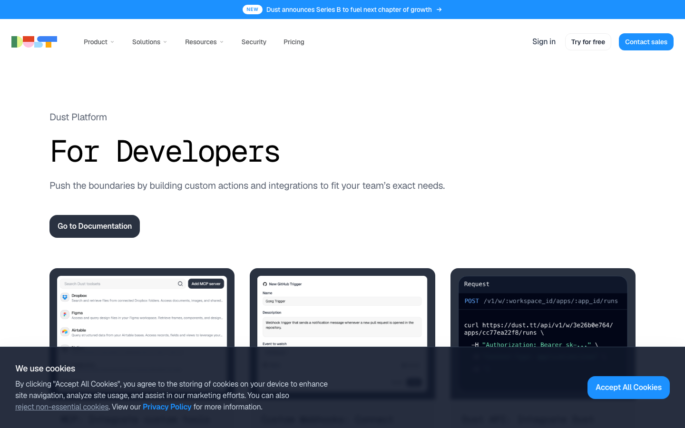

**观察：**

- ✅ 页面清晰勾出"开发者三件套"能力栈并各有分工:**MCP 服务器**(把自有/外部工具接入 agent、扩展其能力)、**Custom Webhooks**(从 GitHub/Jira/Slack 或自有服务接收事件来触发 agent)、**Dust API**(编程化管理 agent 与数据源、把 agent 嵌入自家应用)。三层分别对应"扩展工具 / 事件触发 / 数据与嵌入",功能定位有层次感,读者能大致理解"这个平台允许我深度定制"。
- ✅ Webhook 的使用场景写得较具体——"接收 GitHub/Jira/Slack 事件并带 **full company context** 触发 agent",能让人联想到"PR 提交→agent 自动 review""工单创建→agent 自动处理"这类自动化,解决了"如何把 agent 嵌进既有研发/协作流程"的实际问题。
- P1** Dust API 的关键技术规格几乎全缺:未说明协议(REST/GraphQL)、认证机制(API key / OAuth)、是否有官方 SDK(Python/JS)、速率限制,页面也无任何端点或代码示例,全部以"See documentation"外链兜底。开发者无法仅凭此页判断接入成本与可行性。
- P2** MCP 的接入方向与控制粒度没讲清:只说"connect your own and external tools",但未说明 Dust 是作为 MCP **client** 调外部 server、还是也能作为 **server** 被调用;"manage authentication / control access"具体控制到 agent 级还是单个 tool 级、支持哪些认证方式,均无细节。
- P2** "Build custom connections — No ceiling on data connections, import from any source"属于能力宣称但无机制说明:没交代通过 API 导入知识的数据格式、全量/增量同步方式、索引与权限继承逻辑,读者无法判断"任意来源"在工程上的真实含义与限制。

#### E3: 探索: Marketing & Content

**URL:** https://dust.tt/home/solutions/marketing

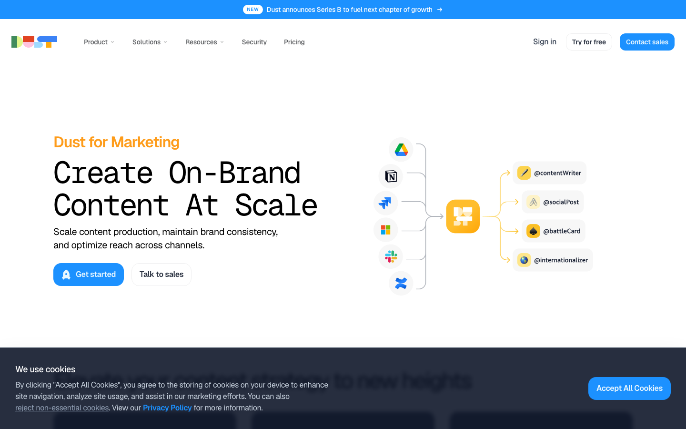

**观察：**

- ✅ 页面用 4 个具体场景（内容本地化、内容优化、社媒跨平台分发、市场情报）勾勒出营销团队的功能版图，并强调"无需写一行代码即可自定义/自动化任务"，清晰传达了产品定位 = 面向营销人的 no-code AI 内容自动化工作流。
- P1 核心功能机制是黑盒：全页反复强调"保持品牌语调 / 品牌一致性 / on-brand"，却完全未说明产品如何获知品牌规范——是否需上传品牌指南、style guide 或训练语料？品牌知识怎样被 agent 调用？这是该方案最关键的卖点，却没有任何输入/配置说明，用户无法判断"品牌一致性"是真能力还是营销话术。
- P2 "市场情报 / 竞品监控"的数据来源未交代：声称能 monitor market movements and competitor activities 并生成 battle cards，但数据从哪来（网页抓取？接入数据源？用户喂料？）、监控频率、输出形态都缺失，无法评估可行性与实用性。
- P2 "社媒跨平台分发"存在功能歧义：cross-posting 通常指"一次撰写多平台发布"，但文案落点只是"create content that reflects brand identity"——到底是仅生成内容，还是真能连接并发布到各社媒平台？是否有发布集成（LinkedIn / X / Instagram 等）清单完全没说，直接影响该用例能否真正闭环。
- P2 缺少集成与输入/输出清单：营销内容流高度依赖 CMS、SEO 工具、翻译记忆库、社媒账号等，但本页无任何集成说明；"内容优化 → SEO 优化"也未交代依据哪些 SEO 信号或对接哪些工具，读完仍不知道它如何嵌入现有内容生产链路。

#### E4: 探索: Engineering

**URL:** https://dust.tt/home/solutions/engineering

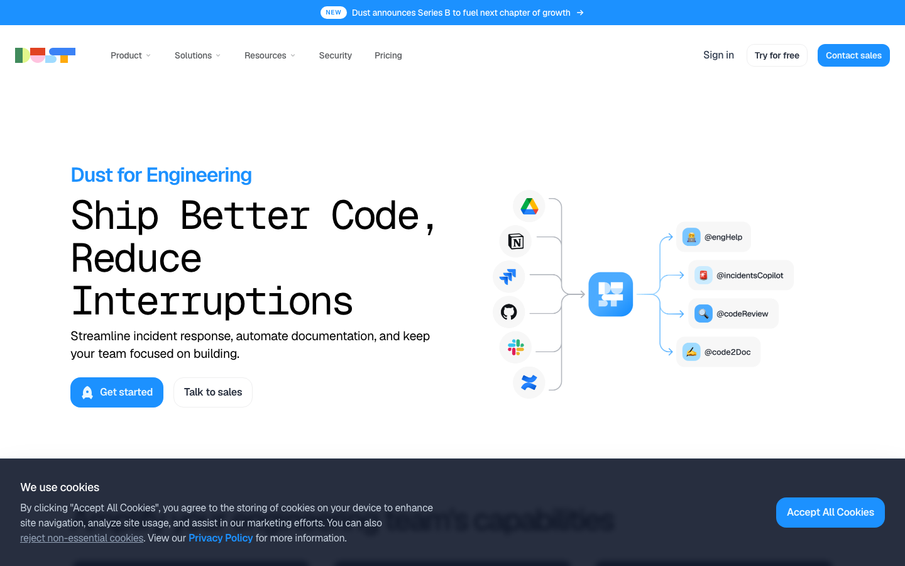

**观察：**

- ✅ 功能场景清晰**：页面用 4 个具体工程场景勾勒了产品能力边界——代码调试（在 IDE 内调起、聚合代码上下文+文档+近期 issue）、事件处理（检索 runbook 与历史事件、自动生成报告与沟通文案）、代码评审（自动化执行工程规范与安全检查）、代码转文档（从代码变更自动生成并维护技术/对外文档）。读者能快速理解"这个产品在工程团队里能干哪几类活"。
- P1 关键工作机制缺失：agent 如何接入代码/文档/讨论未说明**。证言提到"两个按键就能从代码、文档、被忽略的团队讨论里调出上下文"，揭示了核心能力是**跨源知识检索**，但全页未交代 agent 如何连接 GitHub/GitLab 仓库、文档系统（Notion/Confluence）、讨论渠道（Slack/Jira）——这是工程买家判断"能否用在我的技术栈"的决定性信息，却完全空白。
- P1 "代码调试在 IDE 内"但不说支持哪些 IDE / 接入形态**。"Streamline debugging within your IDE"暗示有 IDE 插件或扩展，但既没列出 VS Code / JetBrains 等具体支持，也没说明是插件、CLI 还是 Chrome 扩展（导航栏另有 Chrome Extension 产品，二者关系不明），用户无法判断实际调用方式。
- P2 "无需写一行代码即可定制自动化"缺少配置机制说明**。这是核心卖点（no-code 搭建 agent），但页面只给结论不给机制：agent 的输入是什么（自然语言指令？模板？）、触发方式（手动/事件驱动/定时）、输出落到哪里（PR 评论？文档库？工单？）均未交代，读者无法形成"我该怎么搭一个 agent"的具体预期。
- P2 代码评审/事件处理的集成清单缺失**。事件处理声称"自动生成报告与沟通"，代码评审声称"规模化维护工程标准与安全"，但都没说与 PagerDuty/Datadog/Opsgenie 或 PR 流水线的对接关系——功能描述停留在价值层，缺乏可验证的集成细节。

#### E5: 探索: Data & Analytics

**URL:** https://dust.tt/home/solutions/data-analytics

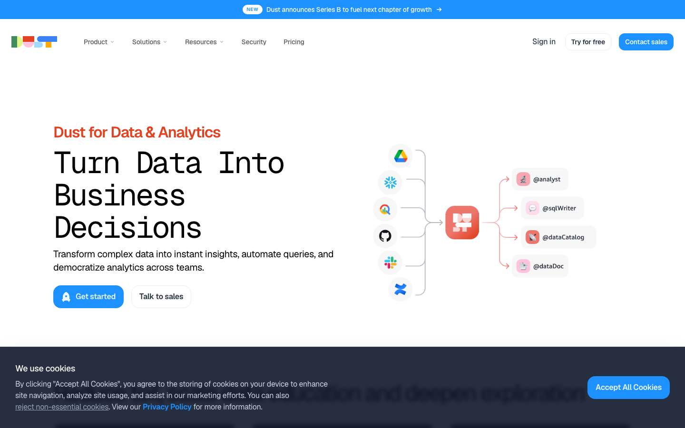

**观察：**

- ✅ 页面清晰勾勒出一条"AI 数据分析师"工作流：**自然语言业务问题 → 自动生成 SQL → 执行查询 → 自动出可视化**（Self-serve analytics + Accelerate answers），并辅以 SQL assistant（生成/调试/优化 SQL）、Data catalog（schema 与表关系导航）、Data runbooks（数据团队流程文档检索）四个具体能力点，能让读者大致理解"产品能替数据团队做查询、降低取数门槛、让非技术同事自助拿数据"。
- P1 未说明产品如何接入实际数据基础设施**——这是数据类产品最关键的功能信息。页面通篇讲"自动写查询/出可视化",却完全没提支持哪些数据仓库或 BI 工具(Snowflake / BigQuery / Redshift / dbt / Looker 等),也没说是直连仓库实时查询还是只读元数据。数据团队无法据此判断能否落地。
- P1 "SQL assistant 生成符合你业务逻辑和数据模型的查询""Data catalog 即时访问 schema"——但未解释产品如何获得这些 schema 与业务语义。** 是自动同步仓库元数据、接入语义层(semantic layer / metrics layer),还是需要人工喂入?这是该工作流能否产出"准确查询"的核心机制,缺失后用户难以评估输出可信度。
- P2 输出形态描述含糊。** "generate visualizations automatically" 没说明生成的是什么图表、在哪里渲染(产品内 / 导出 / 嵌入)、能否交互或下钻;"自助分析"的结果如何分享给团队也未提及。对比四个 use case 标题清晰,但每个的"输入→输出"细节停留在一句话宣传。
- P3 顶部四条价值主张(Focus on insights / Accelerate answers / Democratize data / Your use cases your way)偏泛化、跨 solution 页通用**,信息量低于下方四个具体 use case;其中 "Customize and automate tasks without writing a single line of code" 是唯一暗示"可自建 agent/自动化"的能力点,但没展开说明搭建方式与触发机制,读者无法判断自动化能力边界。

#### E6: 探索: Knowledge

**URL:** https://dust.tt/home/solutions/knowledge

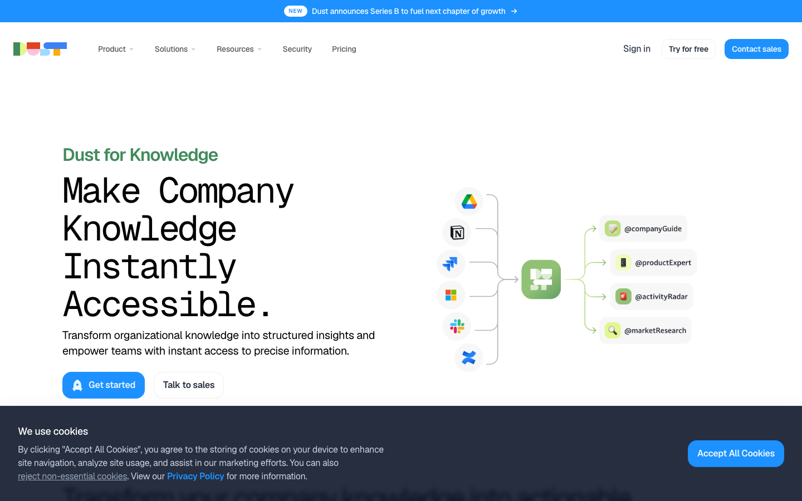

**观察：**

- ✅ 用 4 个具体用例勾勒了知识场景的功能边界**：页面把"公司知识"拆成 Team knowledge（基于内部文档/沟通记录回答员工问题）、Product expert（产品信息与文档支持）、Activity digests（自动生成公司活动/讨论/项目状态摘要）、Industry radar（把外部新闻与市场信息结构化成报告）四类，比单纯喊"让知识可访问"更能让读者理解产品到底能干什么——尤其 Activity digests 和 Industry radar 揭示了"自动摘要"和"外部情报抓取"两种主动型能力，而非纯被动问答。
- P1 完全没有说明能接入哪些知识源**：对一个"让公司知识可访问"的产品，最关键的功能信息就是它能连接什么数据（Slack / Notion / Google Drive / Confluence / 邮件 等）。页面反复强调"all company knowledge instantly accessible""internal documentation and communication"，却没有一个具体连接器清单或示例，读者无法判断自己现有的知识库能不能接进来——这是决定可用性的核心信息缺口。
- P1 未解释工作机制与"输入→输出"链路**：页面说能"回答员工问题""生成摘要""结构化新闻"，但完全没说背后是检索问答（RAG）、agent 工作流还是关键词搜索；Activity digests 是定时触发还是手动、摘要长什么样、来源能否溯源都未交代。读者知道"它能产出什么"，但不知道"怎么产出、产出质量是否可信"。
- P2 "no-code 自定义/自动化"是关键能力却一笔带过**："Customize and automate tasks without writing a single line of code" 暗示用户能自己搭建知识助手/自动化流程，这其实是很强的功能卖点，但页面没有任何示例说明自定义到什么粒度、能编排哪些动作、Activity digests/Industry radar 是预置模板还是需自行配置——能力深度无从评估。
- P2 缺少知识安全与权限控制的功能说明**：企业知识必然涉及敏感信息，但页面（除导航里有独立 Security 入口外）未说明回答时是否遵循原文档的访问权限、能否按角色/团队隔离可见知识、外部 Industry radar 抓取的内容如何与内部知识区隔。对面向全员开放的知识问答场景，这是买家必问而页面未答的功能点。

#### E7: 探索: IT

**URL:** https://dust.tt/home/solutions/it

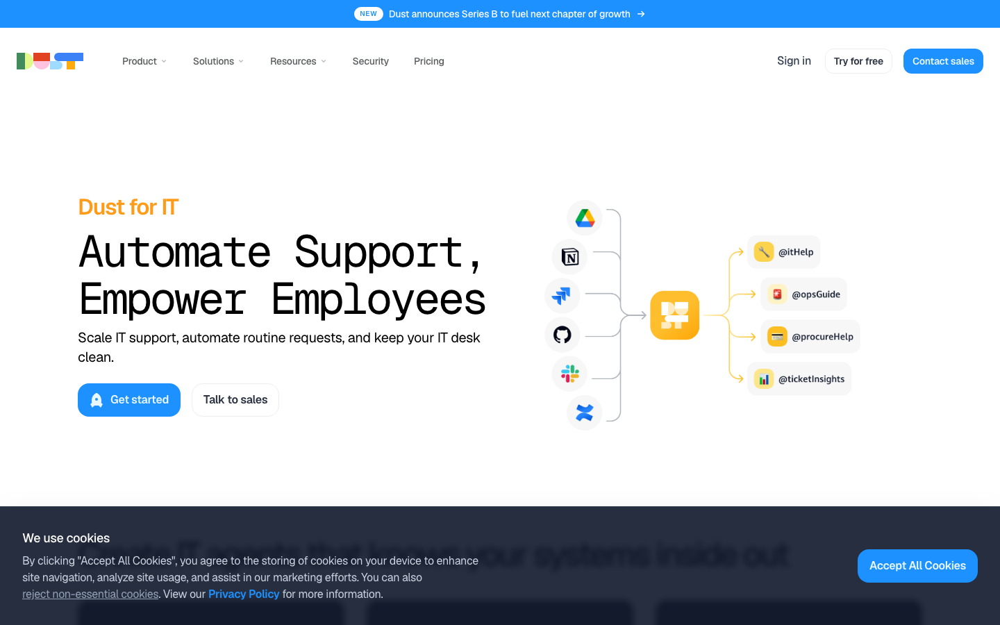

**观察：**

- ✅ 页面清晰勾勒出核心能力：用户可**无代码（no-code）搭建 IT agent**，并以内部文档/政策/知识库为依据，落地到 4 个具体场景——IT helpdesk（员工常见 IT 问题即时应答）、IT ops assistant（管理员排障指引）、procurement helper（采购流程引导）、ticket analytics（工单模式分析）。功能轮廓和典型用例都给得比较具体。
- P1** 关键功能定位含糊：页面没说清 agent 究竟是**只能"答疑/引导"（读取知识库做 Q&A）**，还是**能"执行动作"（如重置密码、开通权限、创建/关闭工单）**。四个用例措辞全是 "answer / guidance / analyze"，倾向只读问答；但顶部 "automate routine requests"、"30% fewer IT tickets" 又暗示能真正分流处理。读者无法判断它到底替我"干活"还是只"指路"，这是最核心的功能歧义。
- P1** 集成信息缺失：IT 场景天然依赖 ITSM/工单系统（Jira、Zendesk、ServiceNow）、IdP/SSO、Slack/Teams 等。页面反复说 agent "knows your systems inside out / 用 your documented knowledge base"，却**完全没列出可接入哪些系统、知识如何导入（手动上传？实时同步？连接器？）**，无法评估能否接进我现有的 IT 栈。
- P2** "Ticket analytics" 用例的**输入来源未说明**：分析工单模式必须先拿到历史工单数据，但数据从哪来、是实时还是批量、需不需要先接通工单系统都没交代，导致这个看似有价值的能力无法落地评估。
- P3** 指标与主题错配削弱功能说服力："4h Saved weekly filling RFP"（RFP 属采购/销售场景）出现在 IT 页面上像是模板复用的残留，与 IT 工单/支持主题不匹配，反而让"省时"这一功能价值主张显得可疑。

#### E8: 探索: People

**URL:** https://dust.tt/home/solutions/recruiting-people

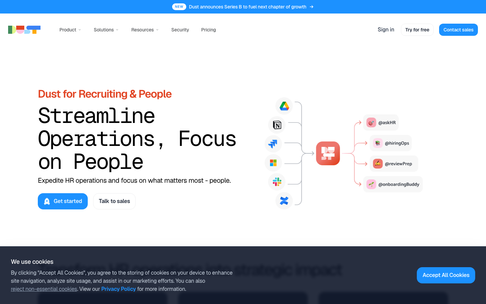

**观察：**

- ✅ 页面用四个具体的 agent 模板把"HR 用 Dust 能做什么"讲得很清楚:HR helpdesk(基于政策文档即时回答员工提问)、Recruiting assistant(候选人筛选/沟通/面试准备)、Manager coach(按公司指南指导反馈与绩效评估)、Onboarding guide(新员工个性化引导)。这四个场景覆盖了 HR 全流程(招聘→入职→日常答疑→管理赋能),读者能快速对号入座。
- P1** 关键工作机制缺失:页面反复强调"turn policies into instant answers""using your HR policies and documented processes",但完全没说明 **agent 如何接入这些政策文档/知识源**——是上传文件、连接 Notion/Confluence、还是对接 HRIS?知识库的数据来源与更新机制是 HR helpdesk 的核心,却只字未提。
- P1** 招聘场景缺少最关键的集成说明:Recruiting assistant 声称做"候选人筛选、沟通、面试准备",但没有提及与任何 ATS(Greenhouse/Lever/Workday 等)或 HRIS 的集成。招聘助手脱离了简历/候选人数据系统几乎无法工作,这个功能闭环在页面上是断的。
- P2** "without writing a single line of code"主打无代码自定义,但**没有任何关于"怎么搭"的说明**:是模板选择、对话式配置、还是拖拽?输入什么、输出什么形态(聊天框/Slack 消息/邮件草稿?)均未交代,读者无法判断落地难度和实际交互形式。
- P2** 量化指标缺乏功能归因:"100% HR daily active users at Alan""30% time savings on employee questions"数据亮眼,但没说清这是哪个 agent、在什么工作流下产生的效果,读者难以把数字对应到具体能力上,削弱了说服力。


### ⭐ 客户案例（3 个测点）

**该模块覆盖页面**:

- `https://dust.tt/home/solutions/customer-support`
- `https://dust.tt/customers`
- `https://dust.tt/customers/clay-scaling-gtme-team`

#### C7: Help / Documentation

**URL:** https://dust.tt/home/solutions/customer-support

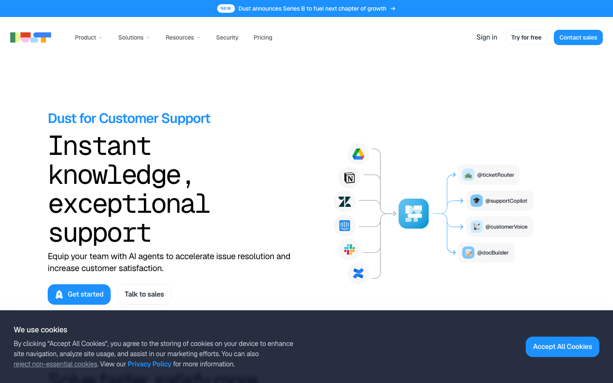

**观察：**

- ✅ 页面清晰拆出客服场景的 4 个具体工作流，且每个都给了「输入→机制→输出」：工单路由（按历史查询记录 + 团队领域专长自动分类分派）、工单解决（从知识库和历史方案中调取定制回复）、知识库增强（把已解决工单转成可搜索的文章/FAQ）、工单洞察。读完能明确知道"这个产品在客服场景能替我做什么"。
- ✅ 关键能力细节交代得较实：支持 50+ 语言起草回复、Tier 1 工单偏转（deflection）、跨渠道实时信息同步、缩短新人 onboarding 时间，并用量化结果佐证（解决时长降 50%、每周每人省 6h，Malt 案例从 6 分钟/工单降到几秒）——功能价值可被读者验证而非空泛口号。
- P1** 集成关键缺失：整页核心卖点是"从知识库取信息""自动路由工单""跨渠道同步"，但**完全没说接入哪些工单系统/CRM/知识库**（Zendesk、Intercom、Salesforce、Notion 等一个都没点名）。客服团队最关心"能不能接我现在的 helpdesk"，恰恰无法判断；testimonial 还提到"信息散落在多个内部应用"，更凸显该缺口未被回答。
- P2** "无需写一行代码即可创建自定义 AI agent"是核心机制承诺，但**没说明 agent 如何搭建/配置**——是模板选择、对话式配置还是规则编排？触发条件、知识源如何挂载、人工审核环节是否存在，均未交代，读者无法判断落地难度与可控性。
- P2** 测点标注为 Help/Documentation (C7)，但抓取到的实际是「客服解决方案」营销页；导航里真正的功能文档入口（Get Started / Guides & Tutorials / Academy / Support）并未在正文呈现。即从"产品怎么用、功能怎么配置"的文档信息维度看，本页**没有提供任何操作级 how-to 内容**，仅为场景宣传，存在功能文档缺位。

#### S4: Customer / logo wall

**URL:** https://dust.tt/customers

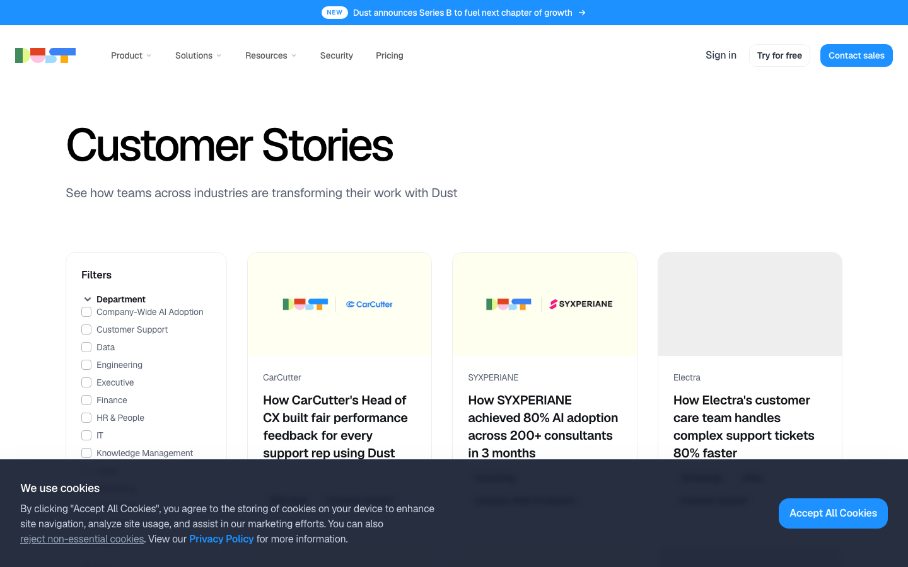

**观察：**

- ✅ 该案例索引页通过「按 Department 筛选」(Sales / Customer Support / Marketing / Engineering / Data / Knowledge Management / Legal / HR / IT / Finance / Operations / Product 等 15 个职能 + "Company-Wide AI Adoption") 清晰传达了产品定位 = **横向、全公司级的 AI agent 平台**,而非单一职能工具。读者能立刻判断"我的团队属于哪类适用场景",这是功能边界的有效表达。
- ✅ 案例标题高度结果导向且给出可量化的功能产出(Profound 每月回收 1,800+ 小时、Electra 复杂工单处理快 80%、Back Market 一周搭出反欺诈检测系统、贡献 €1.2M 节省、Spendesk 90% 采用率、SYXPERIANE 3 个月内 200+ 顾问 80% 采用),让人快速理解"产品能带来什么量级的业务结果"与适用规模。
- 页面透露的最有价值的能力线索集中在个别标题:Brevo 案例点出 "Dust & Supabase 集成 + zero engineering tickets",暗示**无代码/低代码搭建 + 可连外部数据库**;Back Market 暗示**可自建检测类 AI 系统**;Assembled 把它称作 "AI Operating System",指向**多 agent 编排平台**能力。这些是该页面释放的关键功能信号。
- P2** 功能信息停留在"结果"层、缺"如何做到":作为 logo 墙/索引页,所有案例只给产出指标(80% faster、一周搭建),但**没有一句说明 Dust 实际怎么工作**——agent 如何接入数据源、如何被搭建、输入/输出是什么。读者知道"别人成功了",却无法判断"产品具体替我执行了哪些动作"。索引页性质可理解,但本页功能信息密度偏低,价值高度依赖点进详情。
- P2** 导航中的核心功能模块(Frames、Chrome Extension、Integrations)与案例成果完全脱节:无法从本页把"Profound 省 1,800 小时"映射到具体是哪个产品模块或哪类 agent 实现的,**战绩与功能之间缺少对应关系**,削弱了案例对"该用哪个功能"的指导价值。

#### S5: Case studies / Testimonials

**URL:** https://dust.tt/customers/clay-scaling-gtme-team

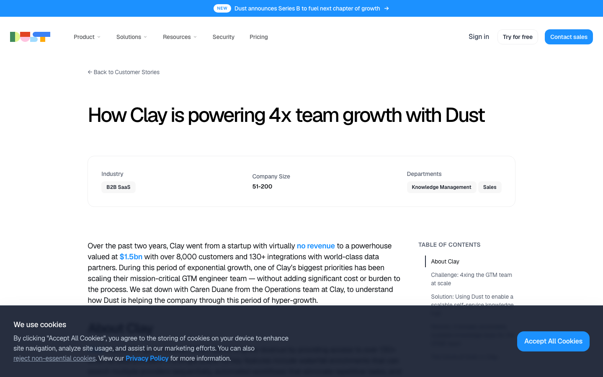

**观察：**

- P1 案例正文几乎没讲 Dust 自己能做什么**：这一页标题是"Dust 如何助力 Clay 4 倍扩张团队"，但"About Clay"整段描述的是 **Clay 的产品功能**（waterfall enrichment 多源串行补全、自动化工作流、从调研到个性化文案的 AI agent），而非 Dust 的功能。读者很容易把 Clay 的能力误当成 Dust 的能力。节选恰好在要解释 Dust 如何介入时被截断（"Sin…"），关键的"产品做了什么"信息缺失。
- P2 解决的问题清楚，但解决机制没说**：页面把问题点讲得很明确——在超高速增长期把 mission-critical 的 GTM Engineering 团队扩张 4 倍、且不显著增加成本与流程负担。典型场景也具体（自动化 CRM 录入、生成 pre-call 会议纪要、跑数百个个性化外呼、追踪工单主题并自动化防流失campaign)。但这些被描述为"GTM Engineer 做的事",没有说明 Dust 用什么能力(哪种 agent / 集成 / 工作流)去承接这些任务。
- P2 缺少把 Dust 功能与"4x"成果挂钩的任何细节**：通篇没有交代 Clay 实际部署了 Dust 的哪些模块(导航里出现的 AI agents / Chrome Extension / Frames / Integrations 究竟用了哪个)、agent 接入了哪些数据源、输入输出长什么样,也没有量化指标支撑"4 倍增长"与 Dust 的因果关系。读者无法判断这是产品功效还是营销叙事。
- ✅ 部门/行业解决方案分类传递了能力广度**：导航中按部门(Sales、Customer Support、Knowledge、Legal、People 等 10 类)和行业(B2B SaaS、金融、保险等)组织 Solutions,配合本案例落在 Sales + Knowledge Management,能让读者感知"Dust 是面向多职能的 AI agent 平台",对"它能为我哪个团队服务"有初步答案。
- P3 读完仍答不上"它具体能为我做什么"**：这一页擅长讲 Clay 的增长故事,但缺少一个可复用的 Dust 工作流演示——例如"输入什么资料 → agent 自动产出什么 → 接哪些系统"。若能补一个具体 agent 的输入/输出示例或 Clay 真实搭建的某个 agent,功能说服力会强很多。


### 💰 定价 / 商业化（1 个测点）

**该模块覆盖页面**:

- `https://dust.tt/home/pricing`

#### C2: Pricing page

**URL:** https://dust.tt/home/pricing

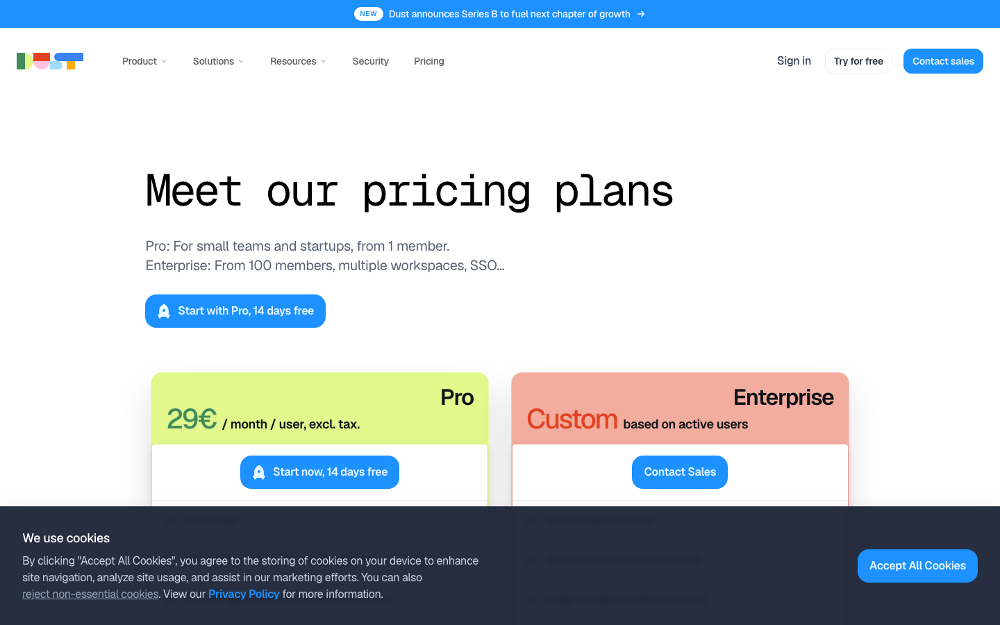

**观察：**

- ✅ 页面清晰揭示了 Dust 的核心定位是"可执行动作的 AI agent 平台"**：从 "Custom agents which can execute actions"、多模型接入（GPT-5/Claude/Gemini/Mistral）、数据连接（GitHub/Google Drive/Notion/Slack）三组能力可以看出，这不是单纯的聊天机器人，而是"接公司数据 + 选模型 + 搭自定义 agent + 让 agent 替你执行操作"的工作流平台。定价页能传达出这个能力骨架，信息量到位。
- P1 最关键的卖点 "agents which can execute actions" 完全没有说明"能执行什么动作、对哪些系统、怎么触发"**。这是产品与普通 AI 助手的根本差异点，却只有一句话带过——用户无法判断 agent 是能改 Notion 文档、在 Zendesk 建工单、还是只能读数据。读完这一页，用户理解"能搭 agent"，但无法理解"agent 实际能为我做成哪件事"，核心能力描述存在误导性留白。
- P2 "Connections" 与 "Native integrations" 两个概念并列出现且含义重叠，功能边界讲不清**。Slack 同时出现在两栏，但页面没说明"connection（GitHub/Google Drive/Notion/Slack）"和"native integration（Zendesk/Slack/Chrome Extension）"在能力上有何区别——是读取数据 vs 双向操作？还是嵌入式体验 vs 后台同步？集成是产品价值的核心载体，但用户读完仍不清楚每个集成具体能做什么、是单向还是双向。
- P2 "programmatic usage / free credits / 额度计费"这条编程化使用能力的工作机制不透明**。页面强调可通过 API、GSheet、Zapier 程序化调用，并给"免费 credits + 超出后固定/自定义计价"，但完全没解释 1 个 credit = 什么（一次调用？一定 token 量？），也没给免费额度数值。对想把 Dust 当后端能力嵌入自有系统的开发者/数据团队，无法估算成本与可行性——这是一个关键的功能+商业信息缺口。
- P3 Pro 与 Enterprise 的差异几乎全在"安全/治理/规模/支付"层，而非 AI 能力层，这点是有效信息但有个例外未解释**：核心 agent / 模型 / 集成能力在 Pro 即开放，企业版主要加 SSO、SCIM、数据驻留、更大存储等——这有助于小团队判断 Pro 够不够用。但唯独 "Salesforce Tool" 被单独放进 Enterprise，页面没说明为何这一个集成要企业版才有、它与 Pro 的通用 connections 有何不同，造成"哪些集成被套餐门槛锁住"的判断盲区。


### 🔌 集成 / API（1 个测点）

**该模块覆盖页面**:

- `https://dust.tt/integrations`

#### S3: Integrations page

**URL:** https://dust.tt/integrations

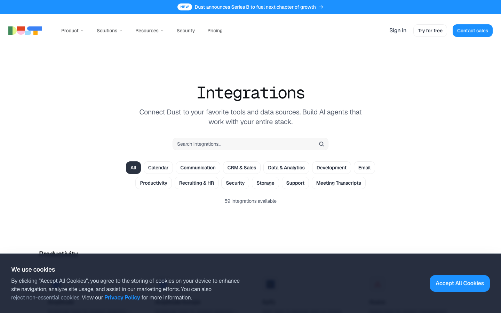

**观察：**

- ✅ **揭示核心能力定位**：这是一个横向 AI agent 平台，能力边界由"连接器 + 可执行动作"共同定义。59 个集成横跨 12 个品类（Communication / CRM & Sales / Development / Data & Analytics / Storage / Support / Meeting Transcripts 等），配合首屏 "Build AI agents that work with your entire stack"，清楚传达产品做的是"让 agent 接管你整个工具栈"，而非单点功能。
- ✅ **"X actions available" 是极强的功能信号**：它表明集成不是只读同步，而是 agent 可调用的一组具体动作。如 Amplitude 标 24 actions 且明确 "search, query, and **create** charts, dashboards, notebooks, experiments, cohorts"——既能读又能写/创建，直接说明 agent 能在第三方系统里真正"动手干活"，而不只是拉数据。
- P2 动作深度差异未分层**：各集成动作数从 2 到 24 跨度极大——Gong 3 / Fathom 2 / Clari Copilot 2 仅取通话转写、摘要、action items，本质是只读；而 Amplitude 24 / Costory 23 / Contentsquare 21 属深度可操作。页面只给数字，未区分"只读取数"与"可执行写操作"，用户难以一眼判断某集成能让 agent 做到多深。
- P1 连接 / 鉴权机制完全缺失**：页面反复说 "Connect Dust to your favorite tools" 却未说明如何连接——OAuth？API key？还是需管理员配置？授权范围、谁能授权、企业数据隔离如何处理均无交代。对要评估"能否安全接入我司 CRM / 数据仓库"的决策者，这是关键功能空白（页面仅以 Amplitude US/EU 区域变体间接体现了数据驻留意识）。
- P2 覆盖范围外的工具无说明**：若我常用的工具不在这 59 个里怎么办？页面未提及是否支持自建集成、MCP、通用 API 或 webhook 接入；同时各集成的详细 action 清单似乎需点进/登录才能看（当前仅展示计数），用户在注册前无法完整确认"具体能执行哪些动作"。


### 🔒 安全 / 信任（1 个测点）

**该模块覆盖页面**:

- `https://dust.tt/home/security`

#### S12: Trust / Security page

**URL:** https://dust.tt/home/security

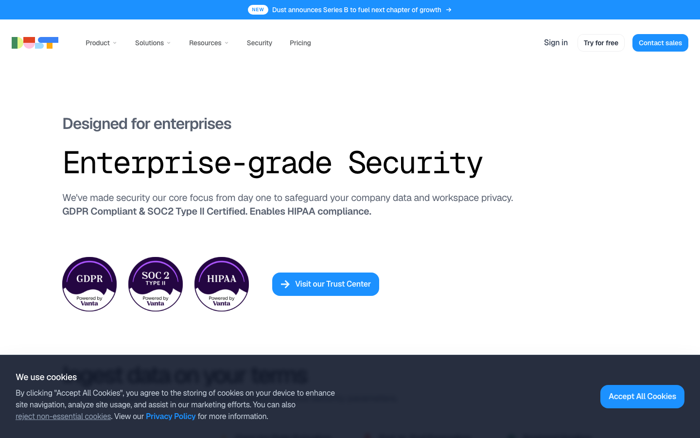

**观察：**

- ✅ 页面通过安全控制项反向勾勒出产品的核心工作机制：「从各数据源摄取数据（Granular Data Selection）→ 用 embedding 模型做向量化 → 接入受信任的第三方 LLM provider」，这是典型的企业级 RAG / agent 编排平台架构。"pick the providers and embedding models you want" 进一步说明 Dust 是**模型无关的编排层**而非自研模型方，这一定位通过功能项传达得相当清楚。
- P2 「Flexible Providers — 自选 provider 和 embedding 模型」揭示了多模型支持能力，但**没有列出到底支持哪些 provider（OpenAI / Anthropic / Mistral？）和哪些 embedding 模型**，用户无法判断是否覆盖自己需要的模型；同理 "No Model Training / Zero Data Retention" 是否对所有 provider 都成立、还是仅部分支持 ZDR 的 provider，也未说明。
- P2 角色体系 "user / **builder** / admin" 中的 builder 角色暗示 Dust 是一个让用户**自行搭建 agent/应用**的平台（而不只是被动消费 AI）。但本安全页完全没有解释 builder 能构建什么、构建产物如何受这些权限/space 约束，导致产品最关键的「能力面」被压缩在安全语境里，读完无法想象实际用法。
- P2 "Granular Data Selection — 控制 Dust 从每个 source 摄取哪些数据" 是核心卖点，但**"each source" 具体指哪些数据源完全没提**（本页无集成清单），也没说明数据摄取是一次性导入还是持续增量同步、刷新频率如何——这是企业评估数据接入可行性的关键功能细节，目前缺失。
- P2 "Zero Data Retention — 第三方模型方不存储数据" 把对**第三方**的约束讲得很清楚，却没有说明 **Dust 平台自身**对用户数据、向量索引、对话/运行历史的保留策略与时长。"Private Spaces" 揭示了按 space + 角色做数据隔离的产品结构，但未说明 space 与数据源、agent 之间如何绑定，整体留下了「数据在 Dust 内部生命周期」这一功能信息缺口。


### 🏢 公司 / 团队（1 个测点）

**该模块覆盖页面**:

- `https://dust.tt/home/about`

#### S7: About / Company

**URL:** https://dust.tt/home/about

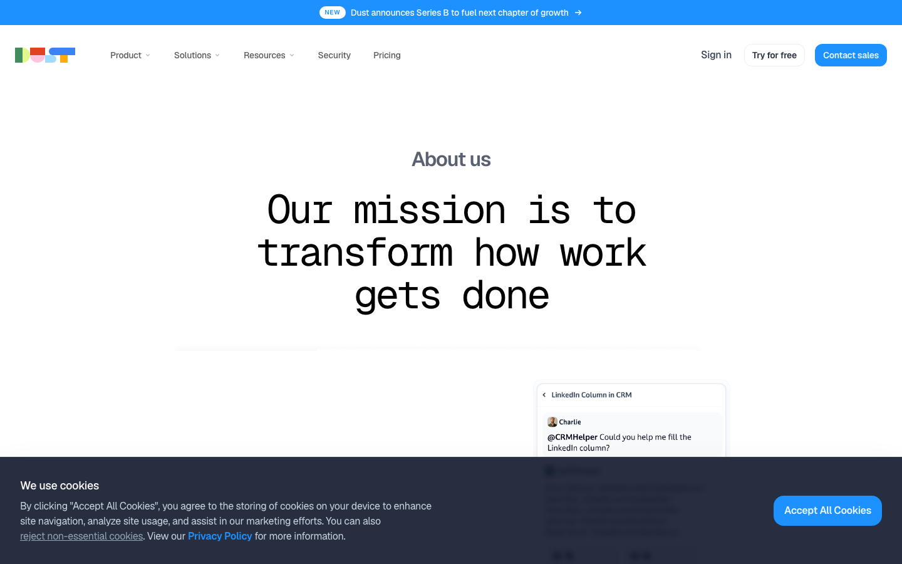

**观察：**

- ✅ **产品核心定位与工作机制在愿景层讲清楚了**：页面明确产品是"企业 AI 操作系统"，核心机制是"把模型连接到公司数据，将原始 AI 能力转化为能干实际工作的 agents（agents that do real work）"。这点出了产品的关键能力链路——数据接入 → 构建 agent → 自动完成工作，读者能抓住"这是个让 AI 落到企业真实工作流的 agent 平台"。
- P2 **具体功能模块只在导航里露名、本页正文零解释**：导航暴露了产品的真实功能面（Chrome Extension、Frames、Integrations），但 About 正文通篇是使命/原则/团队，对 "Frames" 是什么、Chrome 扩展能做什么、集成支持哪些系统均无一字说明。读者看到功能名却无法理解其作用。
- P1 **缺少任何"agent 实际做一件什么事"的具体场景**：全文强调 "agents that do real work / connecting them to how work actually happens"，但没有一个输入→输出的实例（如"销售 agent 自动整理 CRM 线索并起草跟进邮件"）。读完仍答不上"它具体能替我完成哪类任务"，价值主张停留在抽象口号。
- P2 **适用场景广度有信号、但未与能力挂钩**：导航列出 10 个部门解决方案（Sales/Support/Legal/IT/People 等）和 6 个行业，说明这是一个横向、可按部门定制的平台；但本页未把任一部门/行业与具体能力或工作流对应起来，"广"有了、"能为该部门做什么"缺失。
- P2 **关键集成与模型信息缺口**：核心卖点是"连接模型与公司数据"，却未说明支持接入哪些数据源/SaaS、可调用哪些底层模型（自有还是第三方 LLM）。这对判断"能否接入我现有技术栈"至关重要，本页（含 Integrations 入口）未给任何清单或示例。


### 📰 博客 / 内容（1 个测点）

**该模块覆盖页面**:

- `https://dust.tt/blog`

#### S6: Blog / Resources

**URL:** https://dust.tt/blog

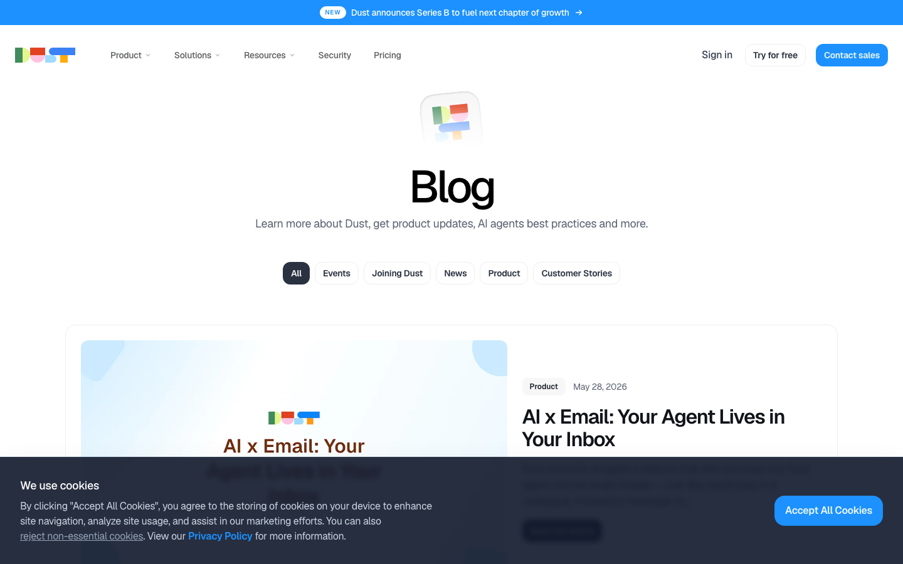

**观察：**

- ✅ **揭示了一个具体功能且交代清晰**：头条文章 "AI x Email: Your Agent Lives in Your Inbox"(5月28日)说明了一项新能力——可把任意 Dust agent 像同事一样 loop 进邮件线程(转发/抄送邮件即触发 agent 参与回复)。输入(转发邮件)、工作机制(agent 在线程内协作)都点到了,是一个能让人立刻 get 到价值的场景化功能演示。
- ✅ **导航 + 博客标题侧面勾勒出完整能力地图**:产品层暴露了 Chrome Extension / Frames / Integrations 三大模块;解决方案按 10 个部门(Sales / Support / Marketing / Engineering / Data / IT / Legal 等)和 6 个行业切分;博客标题(如「用 Dust AI Agents 搭建 Growth Outbound OS」「AE 岗位正在被重写」)用真实工作流佐证了 agent 编排、销售外联自动化等典型用例,功能覆盖面信息量很高。
- 核心产品定位被一篇文章点破**:Series B 融资文用 "multiplayer AI for human-agent collaboration" 定义自己——即差异点是"多人/人机协作的 AI",而非单 agent 工具。这是理解产品本质最关键的一条功能线索,值得在产品页强化。
- P2 功能机制只有导语、无法验证**:作为博客索引页,每条仅展示一两句摘要(email 集成怎么配置、"Frames" 究竟是什么形态的产品、agent 的"安全运行环境"指什么)都必须点进全文才能知道。对想快速评估"这些功能怎么用、输入输出/集成边界是什么"的读者,本页只能给方向、给不了答案。
- P3 缺少对产品本身的一句话定义**:页面默认访客已知道 Dust 是"企业 AI agent 平台",博客导语里没有任何兜底说明。若用户从搜索/外链直接落到本页,仅凭这一页较难回答"这个产品到底能为我做什么",需回到顶部 Product / Solutions 导航才能补全认知。


### 📧 联系 / 客服（1 个测点）

**该模块覆盖页面**:

- `https://dust.tt/home/contact`

#### S14: Customer support channels

**URL:** https://dust.tt/home/contact

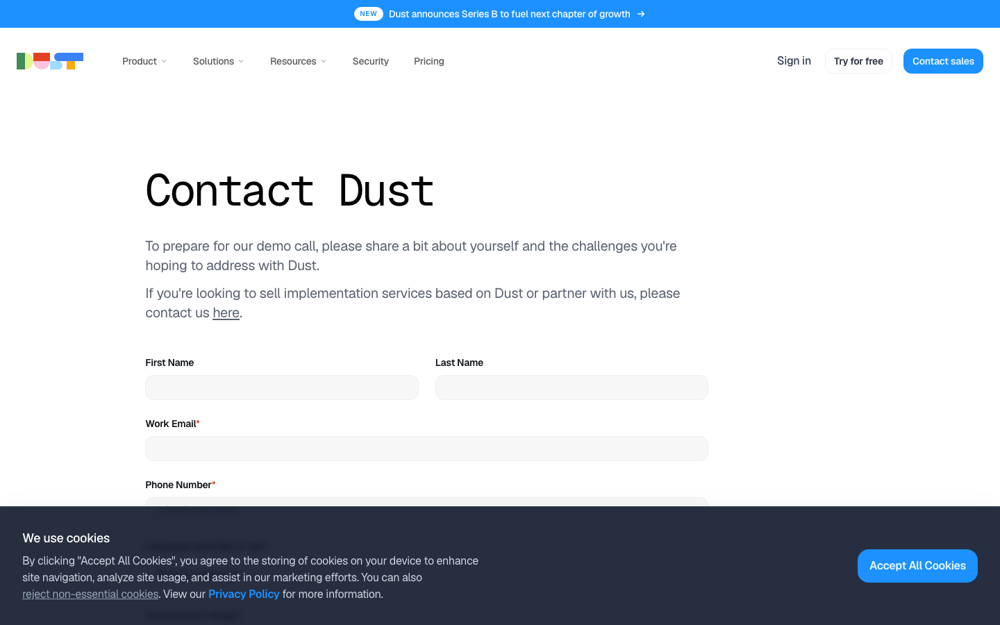

**观察：**

- ✅ 页面 footer 与导航揭示了一套**多层次的客户支持/自助资源体系**：实时社区（Slack Community）、官方工单入口（Support）、自助知识资源（Academy、Guides & Tutorials、Platform Documentation）、以及开发者向的 Github 与 Developer Platform，覆盖了从社区互助到官方支持、从非技术用户到工程师的不同求助路径。
- ⚠️ **P2 各支持渠道的服务范围 / 响应机制完全未说明**：页面只罗列了 "Support" "Slack Community" 等入口名称，没有说明官方 Support 是邮件/工单/在线客服哪种形式、是否有 SLA 或响应时效、Slack 社区是官方答疑还是纯用户互助。用户无法判断"遇到问题该走哪个渠道、多久能得到回应"。
- ⚠️ **P1 引入了"认证合作伙伴网络"承接部分地区的支持，但关键规则缺失**：页面声明"某些地区和客户细分将完全通过认证合作伙伴网络服务"，由合作伙伴负责评估、采购与实施——但**没有说明哪些地区/客户属于此类、合作伙伴提供的支持与 Dust 官方支持有何差异**。这直接影响潜在客户对"我能否获得官方直接支持"的判断，属功能性关键信息误导风险。
- ⚠️ **P2 缺少分套餐的支持差异说明**：页面有 Pricing 入口，但本页未体现不同套餐（如免费版 vs 企业版）在支持渠道上的差别（如是否含专属客户成功经理、优先支持、专属 Slack 频道等），而这类差异通常是 B2B SaaS 支持能力的核心卖点。
- ⚠️ **P3 销售/支持入口语义重叠且未区分用途**："Contact sales""Contact Dust""Support""Become a Partner"多个入口并存，但 Contact 表单实际是**面向 demo 预约的售前线索收集**（需填公司规模、用途等），并非售后支持通道。用户若带着使用问题进来，容易误入售前流程而非获得技术支持。


### 📚 产品官方介绍（递归发现）（6 个测点）

**该模块覆盖页面**:

- `https://dust.tt/academy/beginner`
- `https://dust.tt/academy/first-steps-on-dust`
- `https://docs.dust.tt/docs/welcome-to-dust`
- `https://docs.dust.tt/docs/training-material`
- `https://docs.dust.tt/docs/pods-overview`
- `https://docs.dust.tt/docs/pods-getting-started`

#### B1: 背景 D1: 20 min AI Agents: The beginner's guide New to generative AI?

**URL:** https://dust.tt/academy/beginner


**观察：**

- ✅ **产品/公司定位（间接）**：页面本身是 Dust 旗下「Academy」的入门课程页，公司层面有明确信号——头条 banner「Dust announces Series B to fuel next chapter of growth」表明 Dust 是一家已完成 B 轮融资的成长期公司；课程末尾「Skip ahead to Course 2, where you'll learn how to use **Dust agents** hands-on」与「First steps on Dust →」暗示 Dust 的核心产品是「AI agents（AI 智能体）」平台。
- ✅ **目标用户与场景清晰**：该页对应课程明确面向 AI 零基础用户——「New to generative AI? This course is best way to understand what this new way to work is all about」，先决条件写明「None, this is for beginners」「Easier to understand if you've played with things like ChatGPT or Claude.ai before」。学习目标聚焦工作场景落地：「How to leverage them effectively in your daily work」「How to drive adoption in your team」（个人使用 + 团队推广双场景）。
- ✅ **核心叙事：区分「AI agent」与「raw model」**：页面反复强调智能体不等于裸大模型——「What AI agents are and how they differ from raw models」「From raw LLMs to AI agents」，并引出「agents 能否真正取代人类（spoiler: it's more nuanced than that）」「What agents DON'T replace」的克制叙事，体现 Dust 对 agent 边界的理性定位。
- ✅ **关键术语/概念**：页面教学体系输出了几个可作产品语境的核心概念——「The three building blocks of AI agents（智能体的三大构件）」「the agent loop（智能体如何"思考"的循环）」「Types of agents you'll encounter（智能体类型）」「how LLMs can use your own data（LLM 接入用户自有数据）」，后者隐含 Dust 的「连接企业数据」能力主张。
- P3 **产品功能仅以导航词形式出现，未在正文展开**：可见的产品能力词包括「Chrome Extension」「Frames」「Integrations」「Developer Platform」「Dust for Engineers」，以及按部门（Sales / Customer Support / Marketing / Engineering / Data & Analytics / Knowledge / IT / Legal / People）和行业（B2B SaaS / Consulting / Financial Services / Insurance / Marketplaces / Retail & E-commerce）切分的解决方案矩阵——但这些仅为站点导航，本课程页正文未对任意一项做功能性说明。
- P3 **理解缺口**：读完此页用户仍无法回答——(1) **Dust 到底是什么产品**？页面只讲「AI agents」通识，未给出 Dust 自身的一句话定义或与 ChatGPT/Claude 等的差异化主张；(2) 「**Frames**」是 Dust 的独有功能术语，但全程未解释含义；(3) 「让 LLM 使用你自己的数据」是关键卖点，但本页只点到、未说明 Dust 如何实现（数据连接 / 知识库 / 集成方式均缺失）。

#### B2: 背景 D2: Next Course First steps on Dust →

**URL:** https://dust.tt/academy/first-steps-on-dust


**观察：**

- P3 **产品/公司一句话定义**：该页面是 Academy 课程落地页（"First steps on Dust"），通篇没有给出 Dust 的正式一句话定义。最接近定义的表述是把 Dust 描述为一支"你的智能体团队"（"Your team of agents"），并强调"在你工作的任何地方使用智能体"（"use agents everywhere you work"）——可推断 Dust 是一个企业级 AI 智能体（AI agents）平台，但需要靠侧栏导航与课程目标拼凑，缺一句权威定义。
- ✅ **核心功能能力**（页面明确提及）：① 全局智能体 @dust 与 @help；② 链式调用智能体（"chain agent calls"）；③ 自建智能体（下一课"Build your own agents"）；④ 连接知识源与工具（"connected knowledge sources and tools"）；⑤ 多入口接入——Slack/Teams 调用、浏览器扩展（Chrome Extension）、以及 @dust 搭建 dashboard。
- ✅ **目标用户与场景**：页面用 Solutions 把目标用户切成两个维度——按部门（Sales、Customer Support、Marketing & Content、Engineering、Data & Analytics、IT、Legal、People、Knowledge、Productivity）和按行业（B2B SaaS、Consulting、Financial Services、Insurance、Marketplaces、Retail & E-commerce）。同时通过 "Developer Platform / Dust for Engineers / Github Repo" 表明也面向开发者自建场景，整体定位为面向团队的横向企业应用。
- ✅ **差异化主张 / 核心叙事**：主叙事是"无处不在 + 一支智能体团队"——即不局限于单一聊天框，而是通过 Slack、Teams、浏览器扩展把智能体嵌入日常工作流；同时强调"可自建智能体 + 可链式编排"，把 Dust 与单点 AI 助手区分开。页面顶部 "announces Series B to fuel next chapter of growth" 也在叙事上传递了公司成长阶段与资本背书。
- P3 **关键术语/概念**：页面引入了几个专有概念但未充分解释——"global agents"（全局智能体，如 @dust/@help，按 @提及方式调用）、"chain agent calls"（智能体链式调用/协作）、"workspace"（工作区，作为前置条件）、"Frames"（产品菜单里单列，但本页完全没说明它是什么）。这些术语对老用户友好，对新读者偏跳跃。
- P3 **理解缺口**：读完本页仍不清楚的关键点——(a) Dust 到底"是什么"的精确定义与底层（用什么大模型、是否自带/可选）；(b) "Frames" 这一产品模块的含义与用途；(c) 智能体的具体构建方式与能力边界（本页只预告"自建"，无细节）；(d) 定价与 Series B 的具体规模/时间（页面只有 Pricing 入口和一句融资标语，无数字）。

#### B3: 背景 D1: Welcome to Dust

**URL:** https://docs.dust.tt/docs/welcome-to-dust


**观察：**

- ✅ **核心功能能力**：从导航结构可清晰提取出 Dust 的四大能力支柱——① 构建自定义 AI Agent（"Create your first agent"、"Agent Builder Sidekick"、模型选择/指令编写最佳实践）；② 海量第三方工具/连接器（Airtable、Asana、GitHub、Gmail、Google Drive、Notion、Slack、Salesforce、Snowflake、Zendesk、HubSpot、Jira 等 50+ 集成）；③ 知识检索能力（"Knowledge" 下的 Search data sources / Table queries / Extract data / Include data，并配 "Understanding Retrieval Augmented Generation"）；④ 自动化与协作（Triggers/Schedules/Webhooks、Wake-ups、Skills、PODS 团队空间）。
- ✅ **目标用户与场景**：页面以"按职能部门"组织典型场景，明确面向企业各团队——🤝 Sales、🏆 Customer Support、🎯 Marketing、🤖 Engineering、📈 Data Analytics、📖 Knowledge、👥 Recruiting & People、📦 Product & Design；PODS 章节进一步给出落地范例："Personal second brain""Initiative and project management""Ticket handling and support knowledge""One Pod per customer""Competitive intelligence"，指向企业内多部门协作型用户。
- ✅ **品牌叙事（企业级铺开 / "Builders 社区"）**：开篇 "Getting Started" 区块以 "Dust Rollout Guide""Launch strategy""Team Onboarding Material""Build your builders community""Admin guide""Educate & activate""Measure & expand" 构成完整的组织级推广方法论，传递出"不是个人工具、而是需要全公司分阶段 rollout 并培养内部 builders 的企业平台"这一核心叙事。
- ✅ **关键术语 / 概念**：页面暴露出多个 Dust 专有概念——**Agent**（用户自建的 AI 助手）、**PODS**（含 Members/roles、Tasks、Conversations、Files、Frames、Admin controls 的团队协作单元）、**Frames**（Go Deep 与 PODS 下均出现的产出/画布概念）、**Skills**（可复用能力，含 Skill Examples）、**Triggers / Wake-ups**（Schedules、Webhooks 驱动的自动触发）、**Agent Memory**（记忆工具）、以及 **@deep-dive Agent、Context Compaction、Branch a Conversation、Steering** 等对话增强特性。
- P3 **产品一句话定义缺失**：该页是文档/帮助中心的索引（标题虽为 "Welcome to Dust"，但正文节选全是目录导航），通篇**没有出现一句明确的产品定义或 slogan**（如 "Dust 是……平台"）。读者只能从 "Intro to Dust" 等条目反推它是"企业 AI Agent 平台"，建议补充官方原文定位句以消除歧义。
- P3 **理解缺口**：① **PODS 与 Frames 究竟是什么**——PODS 看似是带成员/任务的协作工作区、Frames 像是文档/输出载体，但索引未给出定义；② 缺少**定价、部署模式、数据安全/合规**等决策信息（FAQ 仅零散提到"agents 能访问哪些数据""是否联网"）；③ **差异化主张不明确**——虽以"集成广度 + 组织级 rollout"隐含卖点，但页面未直接对比同类产品或点明独家优势，无法判断 Dust 相较其他 AI Agent 平台的核心区隔。

#### B4: 背景 D1: Team Onboarding Material

**URL:** https://docs.dust.tt/docs/training-material


**观察：**

- P3｜产品一句话定义**：本页（"Team Onboarding Material"）抓取到的文本实际上是文档站的左侧**导航目录**，并不包含页面正文，因此没有可直接引用的"一句话定义"原文。仅能从信息架构推断 Dust 是面向团队的 **AI agent 构建与部署平台**（入门区有 "Intro to Dust" / "Welcome to Dust" / "Dust Rollout Guide"，主线章节为 "AGENTS → Create your first agent"），但这属于结构推断而非页面明示。
- ✅｜核心功能能力**（依据导航目录）：① 构建自定义 agent（Agent Builder、Create your first agent、LLM Best practices）；② 知识检索 / RAG（Search data sources、Table queries、Extract data、Include data、Understanding Retrieval Augmented Generation）；③ 40+ 外部工具连接器（Notion、Slack、GitHub、HubSpot、Salesloft、Google Drive、Snowflake、Jira、Zendesk、Salesforce 生态等）；④ 自动化与触发机制（Triggers、Schedules、Webhooks、Wake-ups、Skills）；⑤ 多入口接入（Slack、Teams、Zendesk、浏览器扩展、Raycast、Zapier/Make/n8n、邮件转发、Google Sheets 插件）。
- ✅｜目标用户与场景**：用例严格按**职能部门**组织 —— Sales、Customer Support、Marketing、Engineering、Data Analytics、Knowledge、Recruiting & People、Product & Design、Collaboration，表明目标是**跨职能的企业团队**；典型场景见 PODS Examples：客服工单与支持知识、竞品情报、项目/计划管理、内容与编辑生产、"个人第二大脑"、"每客户一个 Pod"。页面还显式区分了 **builder/管理员**角色（Build your builders community、Admin guide）与普通使用者。
- P3｜差异化 / 品牌叙事**：作为 onboarding 材料，本页突出的是**企业内部落地路径**而非与竞品的对比 —— 章节链条为 Launch strategy → Build your builders community → Designing use cases → Educate & activate → Measure & expand，核心叙事是"如何在组织内推广采用并衡量扩张"。页面未出现任何与其他 AI 产品的直接差异化主张。
- ✅｜关键术语 / 概念**：**PODS**（含 Members/roles、Tasks、Conversations、Files、Frames、Admin controls 的协作工作空间）、**Agents / Builders**（agent 及其创建者人群）、**Skills / Triggers / Schedules / Wake-ups**（agent 自动化与定时机制）、**Agent Memory**（记忆工具）、**Frames**、**Steering**、**Branch a Conversation**、**Context Compaction**（对话控制类能力）、**@deep-dive Agent**。
- P3｜理解缺口**：① 缺正文，无法确认 Dust 的官方价值主张，也无法说明它与通用 LLM 聊天机器人的本质区别；② "Pod""Frame""Wake-ups""Steering"等专有名词仅在目录中出现、未给出定义；③ 完全未涉及定价、部署形态、数据安全 / 合规；④ 无法判断 "Team Onboarding Material" 这一页本身究竟提供哪些实际内容（节选中只有标题加全站导航）。

#### B5: 背景 D1: Overview

**URL:** https://docs.dust.tt/docs/pods-overview


**观察：**

- ✅ **核心功能能力清晰可辨**：从导航结构可提炼出 Dust 的五大能力栈 —— ①自定义 AI Agent（"Create your first agent"、"Managing Agents"）；②知识接入（"Search data sources / Table queries / Extract data / Include data"）；③超长连接器列表（Airtable、GitHub、Slack、Notion、HubSpot、Salesloft、Snowflake、Zendesk 等 50+ 工具）；④自动化触发（"Triggers / Schedules / Webhooks / Wake-ups / Skills"）；⑤随处可用的嵌入式集成（"Dust in Slack / Teams / Zendesk"、Browser Extension、Raycast、Zapier、n8n）。
- ✅ **目标用户与场景按职能铺开**：页面以部门为轴划分用例（"🤝 Sales / 🏆 Customer Support / 🎯 Marketing / 🤖 Engineering / 📈 Data Analytics / 📖 Knowledge / 👥 Recruiting & People / 📦 Product & Design"），并配合 "Admin guide: set up your Dust workspace"、"Team Onboarding Material"，明显指向**企业内多职能团队 + 工作区/管理员部署**的 B2B 场景；Pods 的示例（"One Pod per customer"、"Competitive intelligence"、"Ticket handling and support knowledge"、"Content and editorial production"）进一步落实了具体落地场景。
- ✅ **独有术语体系成型，叙事偏"全员造 Agent"**：页面凸显多个产品专属概念 —— **Pods**（带 Members/roles、Tasks、Conversations、Files、Frames 的协作空间）、**Frames**、**Skills**、**Wake-ups/Triggers**、**@deep-dive Agent**、以及 "Steering / Branch a Conversation / Context Compaction" 等对话控制机制。配合 "Build your builders community"、"Dust Rollout Guide"、"Educate & activate / Measure & expand"，传递出**让组织内非技术"builders"自行搭建并推广 Agent**的核心叙事。
- P3 **缺乏一句话产品定义（最关键缺口）**：页面只有 "Intro to Dust"、"Welcome to Dust" 这类标题，**正文未给出任何"Dust 是什么"的定义句或品牌 Slogan**，也未出现与竞品的差异化主张。读者无法从本页确认 Dust 究竟自我定位为"企业 AI 助手平台 / Agent 操作系统 / 知识协作工具"中的哪一种。
- P3 **关键概念含义留白**：**Pods 与 workspace 的关系**、**Frames 到底是什么产出物**、以及 Dust 是否多模型（仅从 "Choosing the Right AI Model"、"Understanding LLMs Context Windows" 推测支持多模型，但无明示）均未在本页解释，仅以导航条目列出，需进入子页才能理解。
- P3 **商业化与部署信息缺失**：页面未提及定价、目标客户规模、数据安全/合规承诺（虽有 Vanta 连接器但非产品自身定位），"Does the Dust agent give accurate and safe responses?" 等仅作为 FAQ 标题出现，读完本页仍无法判断 Dust 面向中小团队还是大型企业、如何收费。

#### B6: 背景 D1: Getting started

**URL:** https://docs.dust.tt/docs/pods-getting-started


**观察：**

- ✅ **核心功能能力清晰可辨**：从导航结构可提炼出 Dust 的五大能力支柱——① Agents（"Create your first agent"、自定义 agent、LLM 最佳实践）；② Knowledge（"Search data sources / Table queries / Extract data / Include data" 即 RAG 检索）；③ 海量第三方 Tools 集成（Notion、Slack、GitHub、Salesforce 系、HubSpot、Snowflake、Zendesk 等 50+ 连接器）；④ 自动化（Triggers / Schedules / Webhooks / "Wake-ups" / Skills）；⑤ PODS 协作空间（Members and roles / Tasks / Conversations / Files / Frames）。
- ✅ **目标用户 = 企业全部门团队，定位为"组织级 AI agent 落地平台"**：页面用 "Use Cases & Guides" 按职能切分场景——🤝 Sales、🏆 Customer Support、🎯 Marketing、🤖 Engineering、📈 Data Analytics、📖 Knowledge、👥 Recruiting & People、📦 Product & Design；并配有 "Dust Rollout Guide / Launch strategy / Team Onboarding Material / Admin guide: set up your Dust workspace / Measure & expand" 一整套铺开流程，说明它面向的是 IT/Admin 主导的企业级规模化部署，而非个人工具。
- ✅ **"从任何地方使用 Dust" 是明确的产品叙事**："Integrations / using Dust from anywhere" 章节列出 Dust in Slack、Dust in Zendesk、Dust in Teams、Browser Extension、Raycast Extension、Zapier/Make.com/n8n/Power Automate、Email to Agents、Google Sheets Add-on——核心主张是 agent 嵌入用户既有工作流，而非要求用户切换到新界面。
- ✅ **产品独有术语可识别但多数仅有名字、缺少定义**：可辨认的专有概念包括 **PODS**（带 Members/Tasks/Conversations/Files/Frames 的协作空间，并给出 "Personal second brain / One Pod per customer / Competitive intelligence" 等示例）、**Frames**、**Skills**、**Wake-ups**、**Triggers**、**Steering**、**Branch a Conversation**、**Context Compaction**、**@deep-dive Agent**、以及面向内部推广者的 **"builders community"**。这些都是 Dust 自创的功能词。
- P3 **缺少"一句话产品定义 / 品牌 slogan"**：页面虽有 "Intro to Dust" 和 "Welcome to Dust" 标题，但节选文本里没有出现"Dust 是一个 ⋯⋯ 的平台"这类显式定位句，也没有与竞品（如 Glean、Copilot、Notion AI）的差异化对比。读者只能从功能清单反推它是"企业 AI agent 构建与协作平台"，但官方原话的核心叙事缺位。
- P3 **多个关键概念与缩写无解释，构成理解缺口**：① **PODS 与 workspace、Frames、Skills 三者的边界和关系**未在该页澄清；② 文末孤立出现的缩写 **"DAT"** 没有任何上下文；③ 页面属典型文档目录（TOC），几乎所有概念只是链接标题，缺少定义正文；④ 完全未涉及定价、可用模型范围、数据安全/合规细节——这些需进入对应子页面才能补全。


### 📌 其他（3 个测点）

**该模块覆盖页面**:

- `https://dust.tt/this-page-should-not-exist-product-audit-test-1234`
- `https://dust.tt/home/chrome-extension`
- `https://dust.tt/home/frames`

#### C8: 404 error handling

**URL:** https://dust.tt/this-page-should-not-exist-product-audit-test-1234

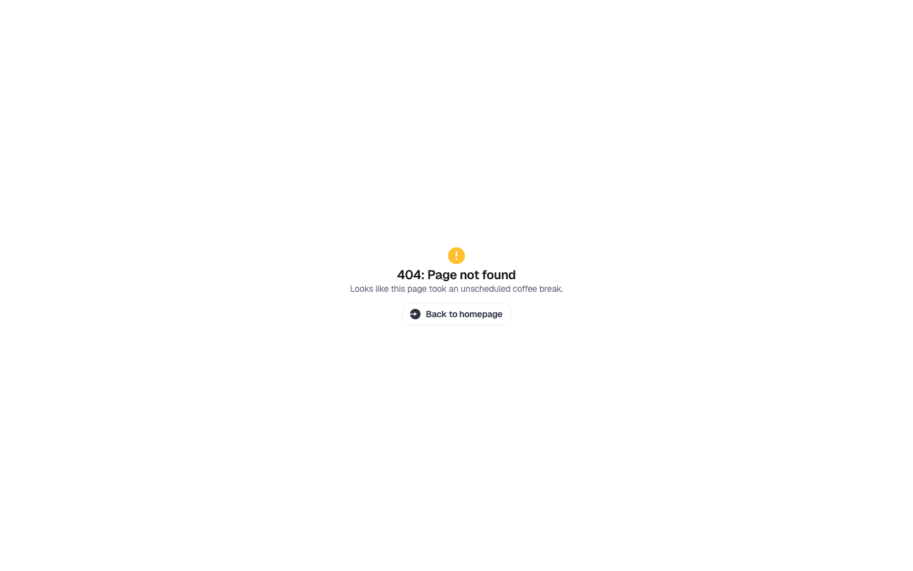

**观察：**

- ✅ 错误恢复路径明确：页面提供了唯一且清晰的恢复动作"Back to homepage"，能保证用户从死链状态回到产品入口，工作流闭环没有断。
- P2 恢复选项过于单一：除了返回首页外，未提供站内搜索框、热门/相关页面推荐、产品主要功能区导航。用户实际想找的内容（某个功能页、文档、定价）无法就地跳转，只能回首页重新摸索，恢复效率低。
- P2 缺少"报告失效链接 / 联系支持"入口：404 常由产品方自身改版或外部失效链接引起，页面没有给用户反馈断链或快速求助的渠道，产品方也因此丢失了一个收集失效路径的运营信号。
- P3 零功能信息承载：作为可能是用户进入产品的第一个页面（搜索引擎过期结果、旧书签），此页除趣味文案外完全不透露"这个产品是做什么的"，未借机用一句话价值主张或核心功能入口承接误入流量。
- P3 信息缺口——无智能纠错：未根据错误 URL 推测用户意图并给出"你是不是要找 X"的候选链接，也无最近更新/最受欢迎内容兜底，属于可改进的功能细节（注：404 页本身并非功能展示主战场，以上均为轻量级清晰度问题）。

#### E1: 探索: Chrome Extension

**URL:** https://dust.tt/home/chrome-extension

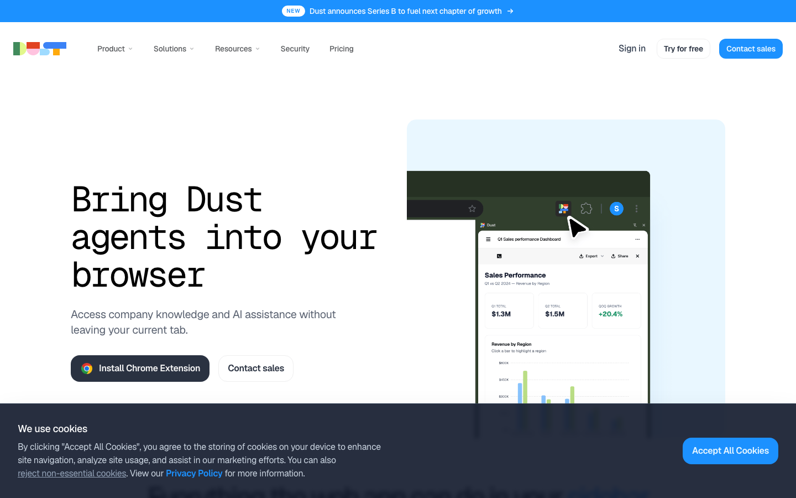

**观察：**

- ✅ **页面清晰传达了产品的核心定位**：Chrome 扩展是把 "Dust agents"（AI agent + 公司知识库）注入到任意网页侧边栏的交付载体，主张"Everything the web app can do in your sidebar"——核心价值是消除工具切换、让 AI 助手随浏览器到达任何工作场景（CRM、prospect 网站、call 工具等）。
- ✅ **Sales 场景用了具体的输入→输出工作流演示**："粘贴 Gong 通话转录 → 自动生成个性化跟进邮件"是全页最有信息量的功能说明，明确了输入（transcript）、输出（follow-up email）和价值（不切换工具）；另外两个场景（基于 CRM 上下文的个性化外联、live 在 prospect 网站时调用 playbooks/battlecards/客户数据）也勾勒出了"知识随浏览"的工作机制。
- P1 — "Everything the web app can do" 是空泛承诺，缺乏功能清单**：页面声称扩展拥有 web app 的全部能力，却没有列出扩展具体能做什么（能否读取当前页面内容？能否在页面上执行动作？支持哪些 agent 类型？），用户无法判断"全部能力"的真实边界，是关键功能描述的缺失。
- P1 — 集成与工作机制完全未说明**：页面提到"pull context from your CRM""paste a Gong transcript"，但没说支持哪些 CRM（Salesforce/HubSpot?）、扩展如何接入 CRM 与 Gong、是自动抓取当前标签页内容还是需手动粘贴。这些是决定"我的工具栈能不能用"的核心功能信息，目前缺失。
- P2 — 非 Sales 角色的功能场景缺位**：顶部切换器列出 Sales / Engineering / Customer Support 三类角色，但正文（至少本节选）只展开了 Sales 的三个场景，Engineering 和 Customer Support 用扩展具体能做什么未呈现，这些角色的用户读完无法理解产品对自己的价值。

#### E2: 探索: Frames

**URL:** https://dust.tt/home/frames

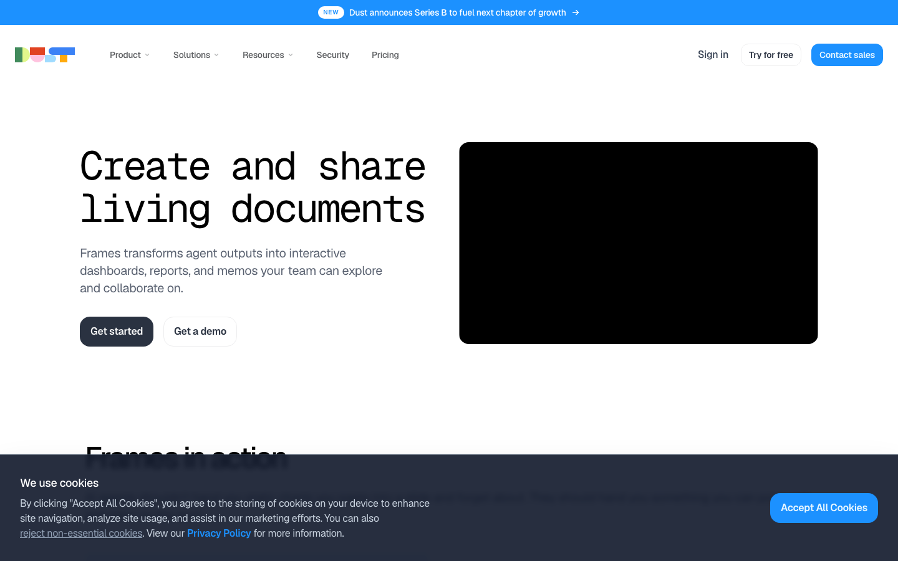

**观察：**

- ✅ 核心能力表达清晰且有差异化：Frames 把 AI agent 的输出从"静态图表"转变为可交互、可编辑、可共享的"活文档"（dashboard / report / memo）。"poke, edit, tailor on the spot"这句精准点出了相对静态产物的价值主张——产物不是终点，而是可继续操作的对象。
- P1 关键工作机制缺失：页面只说"transforms agent outputs into..."，但完全没说明**这种转换如何发生**——是 agent 自动生成 Frame、用户选择某种输出格式、还是 Frames 是独立编辑器？输入（agent 结果）到输出（交互文档）的产生路径是整页最大的功能黑洞，读者无法判断自己要做什么才能得到一个 Frame。
- P2 数据接入与个性化机制未交代：Customer Success 提到"talk to your data"、Sales 提到"adapt tone/context from previous interactions""personalize by prospect"，这些都隐含了对 CRM / 数据源 / 历史交互的接入能力，但页面没有任何集成清单或数据连接说明——用户无法判断个性化的"数据从哪来、怎么连"。
- ✅ 按 4 个部门（Sales / Marketing / Customer Success / Product & Data）组织具体场景，且每组都带"See example"，对"这个产品能为我做什么"的功能映射很有帮助——把抽象的"living document"落到了 outbound pitch、renewal summary、editable infographic、PoC deck 等可识别的产出物上。
- P2 产品品类定位模糊：Frames 同时被描述为 dashboard、report、memo、infographic、deck、甚至"build PoC without Figma""merge tools into your ideal interface"，覆盖面极广却没说清它到底是**文档编辑器、轻 BI、还是可视化渲染层**；与 Dust 自身 agent 的边界（Frames 是 agent 的一种输出形态，还是独立模块？）也没界定，读者难以将其归类。


### ⚠️ 未找到的测点（2 个测点）

**该模块覆盖页面**:

- `https://dust.tt/`

#### C3: Sign-up flow (no submit)

**URL:** https://dust.tt/
**观察：**

- [Link not found] 该模板期望的链接（sign up|signup|get started|start free|注册|免费试用|开始）在 https://dust.tt/ 上未找到 — 可能产品用了不同的措辞或这个功能不存在。 已跳过截图与 LLM 解读以避免重复首页快照。

#### C4: Login page

**URL:** https://dust.tt/
**观察：**

- [Link not found] 该模板期望的链接（log in|login|sign in|登录|登入）在 https://dust.tt/ 上未找到 — 可能产品用了不同的措辞或这个功能不存在。 已跳过截图与 LLM 解读以避免重复首页快照。


---

## 4. 第三方社区反馈

#### 4.1 调研范围与方法

针对实体 `dust.tt`（企业级 AI agents 平台，非同名游戏 *de_dust* / 加密工具 *Dust.fun* / 视觉模型 *DUSt3R*），采用「域名锚定 + 平台限定」方式在 Reddit、Product Hunt、Hacker News、G2、Trustpilot、Twitter/X 上检索真实用户讨论，查询均使用 `site:` 限定与 `"dust.tt"` 精确匹配。结果分布很不均衡：

- **Reddit / Trustpilot / Twitter（X）**：未检索到针对该实体的显著用户讨论——产品名 "Dust" 过于通用，搜索结果被同名游戏、加密工具、3D 视觉模型大量稀释。
- **Product Hunt**：仅有产品页与「Dust alternatives」列表，未找到带实质评论的 launch 讨论串。
- **G2**：1 个认证产品页，**4.9★ / 20 条认证评价**，正负反馈均有原文。
- **Hacker News**：多条讨论串，时间集中在 **2022 年 12 月 – 2024 年 2 月**（围绕其早期产品 XP1 及后续比较）。
- 覆盖时间范围：2022 年 12 月 – 2026 年 5 月（G2 评价为近期、可信度最高；HN 讨论偏历史）。

#### 4.2 核心议题（按讨论热度）

| 议题 | 讨论方向 | 出现频次 | 主要来源平台 |
|---|---|---|---|
| 易用性 / 搭建 agent 的上手速度 | 正面 | 高 | G2 |
| 集成与连接器广度（一站式从多工具拉取数据）| 正面 | 高 | G2 |
| 部署速度与「落地价值」（团队快速采用）| 正面 | 中 | G2 |
| 性能 / 延迟（界面卡顿、agent 响应慢）| 负面 | 中 | G2 |
| 程序化 / API 能力对技术用户不足 | 负面 | 中 | G2 |
| 早期产品「牵引力不明 / 管线脆弱」质疑 | 负面 / 中性 | 中（历史）| Hacker News |

#### 4.3 正面评价 / 用户喜欢的点

- **来源**: [Dust Reviews 2026 (G2)](https://www.g2.com/products/dust-dust/reviews) — `G2 认证用户`, 2026 年 5 月检索
  - **原话引用**: > 「Easy UI interface, easy of connecting many tools, easy to create agents and configure them.」
  - **关键词**: 界面简单、连接工具方便、建 agent 容易

- **来源**: [Dust Reviews 2026 (G2)](https://www.g2.com/products/dust-dust/reviews) — `G2 认证用户`, 2026 年 5 月检索
  - **原话引用**: > 「Dust connects everything in one place. Our agents pull from all our tools at once, so people stop wasting time searching and start actually working.」
  - **关键词**: 一站式聚合、跨工具检索、减少找信息时间

- **来源**: [Dust Reviews 2026 (G2)](https://www.g2.com/products/dust-dust/reviews) — `G2 认证用户（Creative Force 团队）`, 2026 年 5 月检索
  - **原话引用**: > 「Dust has become a foundational tool for our AI transformation… It allows us to build and deploy AI agents very quickly and get teams up and running with AI directly inside their workflows, rather than treating AI as a separate experiment… That speed to value has been critical for driving real adoption across the organization.」
  - **关键词**: 落地速度快、嵌入现有工作流、组织级采用

- **来源**: [Show HN: XP1 – A GPT-based Assistant with access to the browser Tabs](https://news.ycombinator.com/item?id=33970570) — `rhl`, 2022-12-13
  - **原话引用**: > 「This is exactly what I've been hoping for after a week of pairing with chatGPT.」
  - **关键词**: 早期产品（XP1）契合需求、与 ChatGPT 配对使用的期待

- **来源**: [Show HN: XP1 – A GPT-based Assistant with access to the browser Tabs](https://news.ycombinator.com/item?id=33970570) — `CrypticShift`, 2022-12-13
  - **原话引用**: > 「…the right way to do it」（评价其浏览器内助手的交互思路，并建议走 freemium + 开源可扩展路线）
  - **关键词**: 交互方向认可、建议开源/可扩展

#### 4.4 负面 / 批评 / 担忧

- **来源**: [Dust Reviews 2026 (G2)](https://www.g2.com/products/dust-dust/reviews) — `G2 认证用户`, 2026 年 5 月检索
  - **原话引用**: > 「Sometimes the interface is lagging. The agents can take some time to answer.」
  - **关键词**: 界面卡顿、agent 响应慢

- **来源**: [Dust Reviews 2026 (G2)](https://www.g2.com/products/dust-dust/reviews) — `G2 认证用户`, 2026 年 5 月检索
  - **原话引用**: > 「Some limitations for technical users: like being able to use api to build and update the agents automatically.」
  - **关键词**: 程序化能力弱、缺少用 API 自动构建/更新 agent

- **来源**: [Dust Reviews 2026 (G2)](https://www.g2.com/products/dust-dust/reviews) — `G2 认证用户`, 2026 年 5 月检索
  - **原话引用**: > 「Some issues with the connections, like gg drive.」
  - **关键词**: 连接器不稳定（如 Google Drive）

- **来源**: [Dust XP1 switches to GPT-3.5-turbo, is now free to use（评论）](https://news.ycombinator.com/item?id=35078705) — `fire`, 2023-03-09
  - **原话引用**: > 「Unfortunately Dust.tt doesn't use a modern email validation method and so fails on 'modern' TLD's like .media…」
  - **关键词**: 基础注册/邮箱校验 bug（新 TLD 注册失败）

- **来源**: [Launch HN: Vellum（评论中提及）](https://news.ycombinator.com/item?id=35044078) — `swyx`, 2023-03-06
  - **原话引用**: > 「…Dust.tt (unclear traction)…」（在盘点 LLM 应用平台格局时，将 Dust 归为牵引力不明）
  - **关键词**: 早期牵引力存疑；另有 `ElFitz`(2023-03-10) 称其管线「highly specific and quite brittle」（脆弱）

#### 4.5 与官方说法的差异

官网（见 §3.1 官网叙事分析）把 Dust 塑造成一个**成熟的企业级「multiplayer AI 操作系统」**——刚完成 B 轮、3,000+ 组织、4.1 万 MAU、50+ 集成、零客户流失的成长期标杆。**G2 这一近期、可信度最高的渠道与官网高度一致**：用户最常夸的「易用、连接器广、一站式聚合、落地快」恰好是官网主打的卖点，4.9★ 也印证了「快速落地、组织级采用」的叙事。差异主要体现在官网不会强调的运营细节上——延迟卡顿、缺乏程序化/API 管理能力、个别连接器（Google Drive）不稳定，这些是官方叙事的盲区。

更明显的反差在**时间维度与声量**上：公开开发者社区（Hacker News）对 Dust 的热度几乎停留在 2022–2023 的早期 XP1 阶段，当时的评价偏「概念新颖但牵引力不明、管线脆弱、基础注册都有 bug」；而过去两年，独立第三方深度讨论（Reddit / Trustpilot / Twitter 几乎为空，Product Hunt 无实质评论串）并未随官方宣称的规模（3,000+ 组织、30 万+ agent）同步增长。换句话说，**官方描绘的「高速增长、广泛采用」与可检索到的社区声量之间存在落差**——这部分可由「Dust」名称过于通用、讨论被同名实体稀释来解释，但也意味着外部很难独立交叉验证其规模叙事。

#### ⚠️ 信息来源声明

本节所有内容来自**非官方的第三方平台**（Hacker News / G2 等）。内容可能带有主观偏见、过时信息（HN 讨论多为 2022–2023 早期产品阶段）或个别用户的极端观点；G2 个体评价的用户名/具体日期未在聚合页公开，已如实标注。决策时建议结合公司官方信息（§2.5）+ 实测观察（§3）综合判断。

---

## 5. 从访客到注册的转化路径

#### 转化路径示意

```
第 1 步：看到落地页 / 接住定位
    ↓ 关键触点：「Your team of agents」「use agents everywhere you work」+ 顶部「Dust announces Series B to fuel next chapter of growth」融资背书 [B2][B1]

第 2 步：搞清"这是什么 + 跟我有什么关系"（教育 + 对号入座）
    ↓ 关键触点：Academy 入门课「20 min AI Agents: beginner's guide」拉零基础用户 [B1]；Solutions 按部门(Sales/CS/Marketing/Engineering/Data…)+ 行业(B2B SaaS/Consulting/Financial Services…)切分场景 [B1][B2]

第 3 步：评估能力骨架 + 比价（定价页）
    ↓ 关键触点：定价页揭示"自建 agent + 多模型(GPT-5/Claude/Gemini/Mistral) + 数据连接(GitHub/Drive/Notion/Slack)"三件套，Pro vs Enterprise 分层 [C2]

第 4 步：选择入口（自助 or 找销售）
    ↓ 关键触点：Pro 自助计价 + programmatic「free credits」可自助起步；Enterprise 走 SSO/SCIM/数据驻留等"找销售"路径 [C2]

第 5 步：完成转化（注册 Pro / 提交预约演示 / 用 free credits 开试）
    ↓ 终点：进入产品 / 进入 sales 流程
```

**范围**：只到访客完成转化（注册 / 提交演示 / 开始试用）为止。

---

#### 各步骤详解

**第 1 步：看到落地页 / 接住定位**
- 页面写了什么：站点统一挂着「Your team of agents」「use agents everywhere you work」的主叙事；多个页面顶部都带「Dust announces Series B」的融资标语 [B2][B1]。
- 我的推断：第一屏走的是"**情绪 + 背书**"而非"功能解释"——用"一支智能体团队 + 无处不在"建立画面感，用 Series B 降低"会不会是个小作坊/会不会跑路"的疑虑。真正解释"是什么"的重活被往后推到 Academy 和定价页。
- 可能流失的原因：落地层**没有一句权威的产品定义**（多个页面都缺，[B2][B3] 均指出"通篇没有一句话定义"）。访客如果只看首屏，容易把它理解成"又一个 ChatGPT 套壳"，在还没看到差异化前就划走。

**第 2 步：搞清"这是什么 + 跟我有什么关系"**
- 页面写了什么：有完整的 Academy 教育漏斗，入门课明确写「New to generative AI? best way to understand」「prerequisites: None」[B1]；Solutions 同时按**部门**和**行业**两个维度铺开 [B1][B2]。
- 我的推断：这是典型的"**先教育、再对号入座**"漏斗。零基础用户先被 Academy 接住降低恐惧，有明确职能的人（如 Sales、CS）则通过 Solutions 矩阵自己找到"我这种岗位能拿它干嘛"。这一步的目的是把"泛泛好奇"转成"我有一个具体场景"。
- 可能流失的原因：[B1][B2] 反复指出导航里的能力词（Frames / Integrations / Chrome Extension）**只出现、不解释**。访客读完仍答不出"agent 实际能替我做成哪件事"，停在"听起来不错但不知道对我有没有用"的悬空状态。

**第 3 步：评估能力骨架 + 比价**
- 页面写了什么：定价页清楚传达三件套——「custom agents which can execute actions」+ 多模型接入 + 数据连接；Pro 与 Enterprise 分层，且**核心 agent/模型/集成能力在 Pro 就开放**，Enterprise 主要加安全治理(SSO/SCIM/数据驻留/更大存储) [C2]。
- 我的推断：这是最关键的"**心动 + 算账**"环节。心动点是"接公司数据 + 选模型 + 让 agent 替我执行动作"这套区别于纯聊天机器人的能力骨架 [C2]；算账上，"能力在 Pro 即给齐、企业版只多治理"这条设计明显在**鼓励小团队先上 Pro**、别一上来就被推去走企业流程。
- 可能流失的原因：[C2] 点出三处致命留白——① 最核心卖点"agent 能执行什么动作"只一句话带过，无法判断是能改 Notion/建工单还是只读数据；② connection 与 native integration 概念重叠、边界讲不清；③ free credits"1 credit = 什么"和免费额度数值都没给。访客**想心动但缺料、想算账但算不出来**，很容易"再看看"。

**第 4 步：选择入口（自助 or 找销售）**
- 页面写了什么：定价页给出 Pro 的固定计价 + programmatic usage 的「free credits + 超出后固定/自定义计价」；Enterprise 侧集中在 SSO/SCIM/数据驻留等需要对接的能力 [C2]。
- 我的推断：入口被**按"团队成熟度/规模"自然分流**——个人和小团队（含开发者，靠 free credits 自助起步）走自助注册；有合规/规模/SSO 诉求的组织走"预约演示 / 联系销售"。这是双轨漏斗的典型布局。
- 可能流失的原因：free credits 机制不透明（[C2]），想把 Dust 当后端能力嵌入的开发者**估不出成本**，可能不敢点"开始";而企业买家因为"哪些集成被套餐锁住"判断不清（如 Salesforce Tool 单独锁在 Enterprise 且未解释原因 [C2]），会在"该选 Pro 还是必须谈企业版"上卡住。

---

#### 转化设计观察

- **入口设计**：呈现**双轨自助/销售并行**结构（推断）。一轨是自助：Pro 明价 + programmatic「free credits」让开发者/小团队能直接起步 [C2]；另一轨是销售：Enterprise 的安全治理能力天然导向"预约演示 / 联系销售"。同时叠加一条**内容/教育入口**（Academy 入门课 → First steps 课 [B1][B2]），用来接住零基础、尚未决定的人，把他们慢慢喂进自助轨。取舍上看得出"**能自助尽量自助、把销售资源留给企业大单**"的意图。

- **价格预期**：访客读完定价页能建立的预期是"**核心能力 Pro 就能用、价格分两档**"，会倾向判断"先上 Pro 自己试，不够再升企业版" [C2]。但有两块算不清：① programmatic 的「免费额度 = 多少、1 credit = 什么」缺数值，开发者无法估月成本；② Pro 与 Enterprise 之间除了治理项，"集成是否被锁"边界模糊（Salesforce Tool 例外未解释 [C2]）。净效果是**价格档位清楚、单位成本不清楚**。

- **公开承诺**：官网层面的承诺偏"**赋能 + 落地**"而非具体结果——「Your team of agents, everywhere you work」承诺的是"智能体嵌进你 Slack/Teams/浏览器的日常工作流" [B2]；Academy 承诺"学会在日常工作中有效使用 + 在团队里推广采用" [B1]；定价页承诺"能自建会执行动作的 agent、接你公司数据、自选模型" [C2]。这些都是**能力型承诺**，几乎没有"用了之后能帮你省下 X 小时 / 提升 Y%"这类**结果型承诺**或量化案例。

---

#### 转化设计的强弱（仅公开页面）

- ✅ **教育漏斗完整、降门槛到位**：Academy 从"零基础(prerequisites: None)"接起，并显式预告下一课「First steps on Dust」，形成"通识 → 上手"的连续路径，对 AI 小白友好 [B1][B2]。
- ✅ **场景对号入座做得细**：Solutions 同时按部门 + 行业双维度切分，让不同岗位访客都能找到"这跟我有关"的入口 [B1][B2]。
- ✅ **定价分层鼓励小团队先自助**：核心 agent/模型/集成在 Pro 即开放、企业版只加治理，降低了"是不是非得谈合同才能用"的顾虑，利于自助转化 [C2]。
- ⚠️ **入口与背书有，但缺一句权威定义 + 缺量化结果承诺**：多个公开页都没有"Dust 是……平台"的定义句 [B2][B3]，且全程是能力型承诺、无"省时/提效"量化案例，访客的"心动"缺一个可信的落点。
- ❌ **核心卖点说不清，直接削弱比价转化**：最该打动人的"agent 能执行什么动作"只一句话带过、connection 与 integration 边界混乱、free credits 单位与额度无数值 [C2]——访客在"评估 + 算账"这步既心动不起来也算不出账，是公开漏斗里最大的转化失血点。
