# fin.ai 产品深度体验报告

## 报告信息

| 项 | 内容 |
|---|---|
| 产品名称 | fin.ai |
| 产品 URL | https://fin.ai/ |
| 体验时间 | 2026-05-30T10:22:11.393652 |

---

## 目录

- [1. 核心结论](#1-核心结论)
  - [1.1 一句话判定](#11-一句话判定)
  - [1.2 主要风险](#12-主要风险)
  - [1.3 主要亮点](#13-主要亮点)
  - [1.4 综合评分](#14-综合评分)
- [2. 产品概览](#2-产品概览)
  - [2.1 基础信息](#21-基础信息)
  - [2.2 测点速览](#22-测点速览)
  - [2.3 产品 / 公司背景信息](#23-产品--公司背景信息)
  - [2.4 产品定位与策略](#24-产品定位与策略)
  - [2.5 公司基本信息](#25-公司基本信息)
- [3. 体验流程记录](#3-体验流程记录)
  - [3.1 官网叙事分析](#31-官网叙事分析)
  - [3.2 测点流程详情](#32-测点流程详情)
- [4. 第三方社区反馈](#4-第三方社区反馈)
- [5. 从访客到注册的转化路径](#5-从访客到注册的转化路径)

---

## 1. 核心结论

### 1.1 一句话判定

目标产品 **https://fin.ai/** 在本次深度体验中：存在显著的功能信息缺口。详见 §3 体验流程记录。

### 1.2 主要风险

1. **[C1]** P1 关键功能机制未说明：「Train」环节只说用 "Procedures、知识、政策" 训练 Fin，但**完全没说明知识如何接入**——是文档上传、网址抓取、还是 API 同步？"Procedures" 是该产品的专有概念却无任何解释。这是用户决策时最想知道、却缺失的功能关键点。
2. **[C2]** P1 全站定价与价值的核心计量单位"outcome"全程未定义**：整页围绕 "$0.99 PER OUTCOME / 50 OUTCOMES PER MONTH MINIMUM" 展开，但"一个 outcome"到底指什么——是一次成功解决（resolution）、一次用户问题被回答、还是一次工单关闭？判定由谁做、失败/转人工的对话算不算 outcome？这是决定用户实际花费和产品工作机制的最关键一环，却没有任何说明，会直接造成功能与成本的误解。
3. **[C3]** P1** 全页反复强调 Fin"端到端解决最复杂查询"（resolve complex queries end-to-end），但**完全没说明实现机制**：Fin 如何读取客户数据、调用后端/订单/CRM 系统、执行实际动作（退款、改单、查状态）？"Procedures/knowledge/policies"只覆盖了知识训练，没覆盖"采取行动"的能力，这是判断产品能否真正解决复杂工单的最核心信息缺口。

### 1.3 主要亮点

1. **[C1]** ✅ 产品核心工作流揭示清晰：页面用 "Fin Flywheel"（Train 训练 → Test 测试 → Deploy 部署 → Analyze 分析）完整呈现了一个闭环工作机制，用户 5 秒内能抓住"这是一个可训练、可上线、可持续优化的客服 AI Agent"。其中 "Test = 上线前跑完整模拟客户对话" 是一个具体且差异化的能力点，说明了产品在部署前如何降低风险。
2. **[C1]** ✅ 解决的核心问题与适用场景明确：定位为"解决最复杂的客服查询并自动结案"，输入是企业自己的 Procedures / 知识 / 政策，输出是跨 **voice、email、chat、social** 全渠道的自动应答。渠道清单具体，用户能判断是否覆盖自己的支持场景。
3. **[C2]** ✅ 页面清晰揭示了产品的两种部署形态，这是核心能力信息**：①"Fin with your current helpdesk"——Fin AI Agent 作为独立 agent 叠加在用户**现有**的 Salesforce / HubSpot 等工单系统上；②"Fin and Intercom"——Fin + Intercom 自有的 Inbox/Ticketing 全平台捆绑。两者价格结构（纯 $0.99/outcome vs. $0.99/outcome + $29/seat）直接对应"只买 AI"还是"买整套客服平台"两种采购场景，读者能快速判断自己属于哪一类。

### 1.4 综合评分

| 维度 | 评分 | 1-2 句话说明（引用具体 [测点ID]） |
|---|---:|---|
| 产品方向清晰度 | 4.5 / 5 | "Fin Flywheel"（Train→Test→Deploy→Analyze）在 [C1][C3][C4][C5] 反复将产品讲成"可训练-可验证-可上线-可优化"的客服 AI Agent，定位（解决最复杂查询并自动结案）与全渠道（voice/email/chat/social）一目了然；仅"不做什么"边界略弱。 |
| 价值主张表达力 | 4.0 / 5 | 卖点有力且有差异化——"上线前跑完整模拟对话"[C1][C5]、端到端结案、resolution 23%→71% / 65% [C4]，叙事冲击力强；但 [B3] 等核心承诺仍偏营销话术，表达力强于其证据支撑。 |
| 信息架构 | 3.5 / 5 | 一级导航（AI Technology / Control & Security [C8]）、Pricing 双形态分层 [C2]、独立的 Integrations/Solutions 子页 [S2][S3] 组织清楚；但 [C7] "帮助/文档"落到营销页、[S1] "功能页"实为活动回放、404 无任何恢复路径 [C8]，层级与内容存在错位。 |
| 功能广度与深度 | 3.5 / 5 | 覆盖面广（多渠道、训练/测试/分析、Procedures、Fin AI Engine、Pro/Copilot add-on、多步工作流），[S2][S3][C7] 深入到机制级；但首页级关键功能反复缺失——知识如何接入、"Procedures"是什么、动作执行机制均未解释 [C1][C4]。 |
| 核心能力可信度 | 3.0 / 5 | [S1] ModernBERT 重排器超 Cohere v3.5、[S2] 专利 Fin AI Engine、[B3] 引用 Microsoft/Google 背书提供了实质技术可信度；但最显眼的解决率指标"resolution"口径未定义、来源标注"independent testing conducted by Fin customers"自相矛盾 [C4][C5]，头部承诺自证成分高。 |
| 商业化清晰度 | 3.0 / 5 | [C2] 公开列出两种采购形态与具体单价（$0.99/outcome vs. +$29/seat、50 outcomes 起），分层结构清楚、优于多数隐藏定价的 SaaS；但全站核心计费单位"outcome"始终未定义、add-on 超量与组合依赖未交代 [C2]，最关键的成本预期无法估算。 |
| **综合平均** | **3.5 / 5** | **一款方向清晰、叙事有力、功能成体系的客服 AI Agent，短板集中在"可信度口径"与"核心计费单位/关键机制"的关键定义缺失。** |

---

## 2. 产品概览

### 2.1 基础信息

- **URL**: https://fin.ai/
- **首屏标题**: Product
Control & Security
AI Technology
Customers
Resources
Pricing
Log in
Cont

### 2.2 测点速览

本次共体验 28 个测点。

> ⚠️ **登录后内容未覆盖**——用户选择不登录，本报告仅为公开页范围；产品登录后的工作台 / 实际操作未在本报告内。

### 2.3 产品 / 公司背景信息

共发现 **3** 个产品/公司的官方介绍页面：

#### B1: 背景 D1: Overview 12 articles

**URL:** https://fin.ai/help/en/collections/18812312-overview

**背景信息：**

- [No screenshot captured]

#### B2: 背景 D2: Fin for Zendesk: Getting started guide

**URL:** https://fin.ai/help/en/articles/13975798-fin-for-zendesk-getting-started-guide

**背景信息：**

- [No screenshot captured]

#### B3: 背景 D1: Read more about The Definitive KPI Framework for Measuring A

**URL:** https://fin.ai/learn/ai-agent-kpis-enterprise-performance-metrics-framework

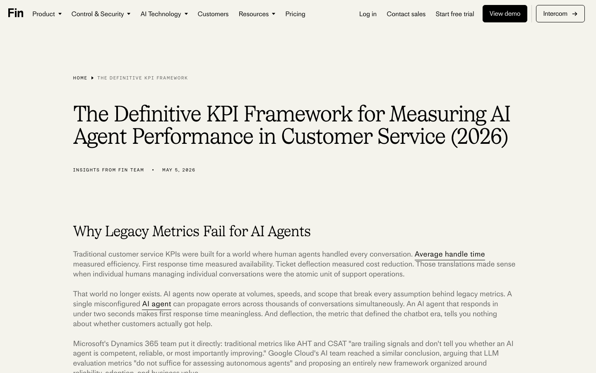

**背景信息：**

- P3 产品/公司定义缺失** — 页面署名 "INSIGHTS FROM FIN TEAM"，结合顶部导航可判断出自 Intercom 旗下 AI 客服 agent 产品 Fin，但全文是一篇 KPI 方法论文章（"The Definitive KPI Framework for Measuring AI Agent Performance in Customer Service (2026)"），通篇没有一句话定义 Fin 是什么、能做什么。挖到的是品牌"思想领导力"内容，而非产品介绍。
- ✅ 核心叙事清晰且鲜明：传统指标对 AI agent 已失效** — 主张直接，原文 "Traditional customer service KPIs were built for a world where human agents handled every conversation... That world no longer exists."，点名 AHT、首次响应时间、deflection 等旧指标的失效，并引用 Microsoft Dynamics 365（旧指标 "are trailing signals and don't tell you whether an AI agent is competent, reliable, or most importantly improving"）和 Google Cloud AI 团队背书，差异化叙事（旧指标=误导，需全新框架）立得住。
- ✅ 关键术语定义到位** — 对核心指标给出了明确含义：Resolution rate（AI agent 端到端解决、无需转人工的对话占比，行业基准 55-70%、头部 >80%，是"最重要的运营 KPI"）；Deflection rate（未触达人工的查询占比，含 FAQ 浏览/文章点击/弃聊，被批为"只反映量、不反映客户结果"的 chatbot 时代指标，举例 90% deflection 可能只对应 40% 真实解决率）；Reopen rate（"已解决"对话被重开的比例）。还特别点出 "resolved" 定义因厂商而异、跨厂商对比不可靠这一行业陷阱。
- ✅ 目标用户与场景明确** — 面向部署 AI 客服 agent 的企业，痛点场景为"无法改进 agent、无法证明 ROI、无法放心把高价值客户交互交给 AI"（原文 "Without rigorous KPIs, companies cannot improve their agents, cannot demonstrate ROI, and cannot confidently deploy AI..."），框架自我定位为 "the tiered approach enterprises need"。
- ✅ 框架骨架清晰（四层分层模型）** — 提出 "The Four-Tier AI Agent KPI Framework"，强调"表层指标必要但不充分，每一层建立在下一层之上"，节选完整展开的仅 Tier 1: Resolution Metrics（解决/偏转/重开三项）。
- P3 理解缺口** — 读完仍不清楚：(1) Fin / Intercom 产品本身具备哪些能力、与该框架是什么关系（全文未提自家功能）；(2) Tier 2-4 分别是什么（节选未给出）；(3) Fin 自身的解决率/实际表现如何——文章倡导用解决率衡量 AI agent，却未披露自家数据。


### 2.4 产品定位与策略

### 1. 把客服 AI 做成"能替你动手办事的执行者"，而不只是会答话的问答机器人
**核心判断**: 产品的核心卖点是端到端解决复杂工单——不止回答问题，还能调用外部系统真正执行退款、改单、改地址等动作。
**支撑证据**:
- [C7] 明确 Fin 能端到端处理"退款、取消、账户变更"等多步工作流，并调用 Stripe / Shopify / Salesforce 的实时数据按业务逻辑执行
- [S3] 在 Salesforce 上是双向数据流：读取授权数据生成回答，并把字段变更、对话记录、摘要写回你批准的字段
- [S2] 用 Procedures（自然语言指令 + 实时数据）执行多步骤业务规则，面向 card disputes、fraud claims 等复杂金融场景
**对用户的含义**: 你买的不是 FAQ 机器人，而是一个能接管整条处理流程的"数字坐席"；但前提是它能接入并被授权操作你的后端系统，而这套接入机制在多个页面恰恰说不清。

### 2. 用"成功解决一次才收一次钱"定价，把价格和效果绑在一起
**核心判断**: 计价单位是 outcome（每解决一次 $0.99、每月最低 50 次），而不是按坐席或按消息量收费。
**支撑证据**:
- [C2] 整页围绕 "$0.99 PER OUTCOME / 50 OUTCOMES PER MONTH MINIMUM" 展开，两种部署形态都以 outcome 为核心计价
- [C2] "Fin with your current helpdesk" 为纯 $0.99/outcome，"Fin and Intercom" 为 $0.99/outcome + $29/seat
**对用户的含义**: 表面上没解决就少付费、厂商与你利益一致；但"一个 outcome 到底怎么算、谁来判定、转人工算不算"全程未定义，实际花费存在不确定性。

### 3. 把产品讲成"训练-测试-上线-分析"的运营闭环，而不是一个聊天窗口
**核心判断**: 用 Fin Flywheel（训练→测试→部署→分析）把自己定位成一套可持续优化的客服运营体系，其中"上线前跑完整模拟对话"是有辨识度的差异点。
**支撑证据**:
- [C1] 首页 5 秒内用 Fin Flywheel 完整呈现"可训练、可上线、可持续优化"的闭环
- [C3] "Test = 上线前跑完整模拟客户对话"直击 AI 客服怕上线乱答的落地顾虑
- [C7] 训练→仿真测试→跨渠道部署→逐段对话分析，构成可重复的性能优化循环
**对用户的含义**: 你得到的是一套配置-验证-上线-复盘的工具链，适合愿意持续运营调优的团队，而非"装好就不用管"的开箱即用产品。

### 4. 同时走"叠加在你现有客服栈上"和"买我整套平台"两条路线
**核心判断**: 同一个 Fin 提供两种采购形态——叠在现有 Salesforce/Zendesk 等系统上，或与 Intercom 自有平台捆绑成全套。
**支撑证据**:
- [C2] 明确两种部署：①Fin 叠加在现有 helpdesk 上；②Fin + Intercom 全平台捆绑，价格结构不同
- [S3] 在 Salesforce 上主打"无需迁移"，复用现有知识库、Case 字段、联系人记录、Flows 及既有路由规则
- [C5] 反复强调 "works with any helpdesk""set up in under an hour"
**对用户的含义**: 已有客服系统的团队可以低成本叠加试用、不必换系统；没有系统或想一站式的团队则可直接上 Intercom 全家桶——但具体支持哪些 helpdesk 的清单始终缺失。

### 5. 主动把"解决率"立成衡量 AI 客服的新标准，借此争夺行业话语权
**核心判断**: 通过反复强调 resolution rate 并输出 KPI 方法论，宣告传统客服指标已失效，把"解决率"塑造成评判 AI 客服的核心尺子——而这恰好对应它的计价单位。
**支撑证据**:
- [B3] 发布《AI Agent KPI 框架》长文，直言 AHT、deflection 等旧指标失效，把 resolution rate 定为"最重要的运营 KPI"
- [C1] 大量强调 23%→71%、65% 端到端结案、"#1 in benchmarks/bake-offs" 等解决率承诺
- [C5] 核心叙事即围绕"我能替你解决多大比例的问题"展开
**对用户的含义**: 它在用一套对自己有利的衡量框架引导你的采购判断；但"resolution 如何定义、由谁判定"始终模糊、数据多来自"客户自测"，口径需自行核验。

### 6. 面向企业级买家，把"管控与安全合规"和"AI 能力"并列为双核心
**核心判断**: 产品把治理、安全、合规与 AI 能力放在同等位置，并在金融等强监管行业做纵深，瞄准对风险敏感的大客户。
**支撑证据**:
- [C8] 一级导航把「Control & Security」与「AI Technology」并列为双核心入口
- [S2] 金融服务页强调 Fin AI Engine™ 用"意图识别→检索→多阶段校验"压制幻觉，并主打 full control、policy compliance、no-code 配置
**对用户的含义**: 它在向重视合规与可控性的企业示好；但审计日志、回答护栏、审批流等具体管控功能仍多停留在口号、缺少细节，需进一步落地验证。

### 2.5 公司基本信息

#### ✅ 实体身份已确认

基于域名 + 产品自述 + 官网 About 页面的交叉核对，目标产品 `fin.ai` 对应：

**Fin（原 Intercom，Intercom, Inc. 于 2026 年 5 月企业品牌更名而来）**

身份锚定证据：[fin.ai/about](https://fin.ai/about) 自述 "Fin is the Customer Agent company… Founded as Intercom in 2011… we reinvented the company and rebranded to Fin"；官网导航与 footer 的条款/隐私政策仍指向 [intercom.com](https://www.intercom.com/)；[Intercom 官方博客「Today Intercom becomes Fin」](https://www.intercom.com/blog/today-intercom-becomes-fin/)、[VentureBeat](https://venturebeat.com/technology/intercom-now-called-fin-launches-an-ai-agent-whose-only-job-is-managing-another-ai-agent) 与 [CX Today](https://www.cxtoday.com/contact-center/intercom-rebrands-to-fin/) 均报道该更名并指向 `fin.ai`。

#### 公司基础事实表

| 项 | 内容 | 置信度 | 来源 |
|---|---|---|---|
| 公司名称 | Fin（公司主体 Intercom, Inc.，2026-05 企业品牌更名为 Fin） | ✅ 直接 | [fin.ai/about](https://fin.ai/about) |
| 成立年份 | 2011 年（最初名为 Intercom） | ✅ 直接 | [fin.ai/about](https://fin.ai/about) |
| 总部地点 | 美国旧金山（55 2nd Street, San Francisco, CA） | ✅ 直接 | [fin.ai/about](https://fin.ai/about) |
| 产品上线 | Fin AI Agent 自 2023 年推出；2026-05-12 升级为公司核心品牌 | ✅/⚠️ | [Intercom 博客](https://www.intercom.com/blog/today-intercom-becomes-fin/) |
| 当前阶段 | 后期阶段独角兽（2018 年达 $1.3B 估值），尚未上市 | ⚠️ 间接 | [Bloomberg](https://www.bloomberg.com/news/articles/2018-03-27/intercom-hits-1-billion-plus-valuation-with-backing-of-kleiner-perkins-mary-meeker) |
| 融资总额 | 约 $242M（9 轮，42 名投资方） | ⚠️ 第三方数据库 | [Tracxn](https://tracxn.com/d/companies/intercom/__QjX3fjzW0zfyXFUopScRM09RgKkysZYa5l-W1sdKY1w/funding-and-investors) |
| 团队规模 | 1,400+ 员工，分布于 6 个全球办公室 | ✅ 直接 | [fin.ai/about](https://fin.ai/about) |
| 行业类别 | AI 客户服务 / AI Agent（Customer Service CX 软件） | ✅ 直接 | [fin.ai](https://fin.ai/) |

#### 融资历史

| 轮次 | 时间 | 金额 | 领投 + 主要参与方 | 来源指向本域名? |
|---|---|---|---|---|
| Series A | 2013-03 | $6M | Social Capital 领投 | ⚠️（第三方报道，公司主体一致） |
| Series B | 2014-01 | $23M | Bessemer Venture Partners 领投 + Social Capital | ⚠️ [FinSMEs](https://www.finsmes.com/2014/01/intercom-raises-23m-in-series-b-financing.html) |
| Series C | 2015-08 | $35M | ICONIQ Growth、Social Capital、Bessemer | ⚠️ [Tech.eu](https://tech.eu/2015/08/26/intercom-funding) |
| Series D | 2018-03 | $125M | Kleiner Perkins（Mary Meeker）领投，估值 $1.275B（晋升独角兽） | ⚠️ [Bloomberg](https://www.bloomberg.com/news/articles/2018-03-27/intercom-hits-1-billion-plus-valuation-with-backing-of-kleiner-perkins-mary-meeker) / [Index Ventures](https://www.indexventures.com/perspectives/intercom-announces-125-million-series-d-round/) |

> 说明：融资数据来自第三方数据库与媒体报道（与本目标域名同一公司主体 Intercom/Fin），未由 fin.ai 官网直接锚链接，故标 ⚠️；2018 年 Series D 之后未见新的对外股权融资公开记录，公司转向以 ARR 自我造血（见下文）。

#### 创始人 / 核心团队背景

四位爱尔兰联合创始人，早期共同经营设计咨询公司 Contrast、开发 bug 追踪工具 Exceptional，2011 年将其出售给 Rackspace 后用所得创立 Intercom。

- **Eoghan McCabe**（联合创始人、董事长兼 CEO）— Intercom/Fin 灵魂人物，2022 年回归出任 CEO 主导 AI 转型与更名。验证：[fin.ai/about](https://fin.ai/about) 直接列名（✅）
- **Des Traynor**（联合创始人、Chief Strategy Officer）— 长期负责产品与品牌叙事。验证：[fin.ai/about](https://fin.ai/about)（✅）
- **Ciaran Lee**（联合创始人、Chief Engineer）— 2021 年离任 CTO，2023 年回归。验证：[fin.ai/about](https://fin.ai/about) + [Wikipedia](https://en.wikipedia.org/wiki/Intercom,_Inc.)（✅/⚠️）
- **David Barrett**（联合创始人）— 四位创始人之一。验证：[fin.ai/about](https://fin.ai/about) 列名，具体现任职务未公开（✅/⚠️）

#### 近期重大动态（最近 6–12 个月）

- **2026-05-12**：公司正式由 Intercom 更名为 **Fin**，将企业品牌押注于 AI 客户 Agent 赛道；"Intercom" 保留为客服软件平台名（并推出重建版 Intercom 2）。[Intercom 博客](https://www.intercom.com/blog/today-intercom-becomes-fin/) / [VentureBeat](https://venturebeat.com/technology/intercom-now-called-fin-launches-an-ai-agent-whose-only-job-is-managing-another-ai-agent)（验证：✅ 报道指向 fin.ai）
- **2026 Q1–Q2**：发布自研垂直模型 **Fin Apex 1.0**，官方宣称在客服解决率上超越 GPT-5.4、Claude Sonnet 4.6 / Opus 4.5。[Intercom 博客](https://www.intercom.com/blog/announcing-fin-apex-the-age-of-vertical-models-is-here/) / [VentureBeat](https://venturebeat.com/technology/intercoms-new-post-trained-fin-apex-1-0-beats-gpt-5-4-and-claude-sonnet-4-6)（验证：⚠️ 第三方/官博，公司一致）
- **财务里程碑**：Fin AI Agent 突破 **$100M ARR**、同比增长约 3.5x；公司整体 ARR 超过 **$400M**（AI Agent 约占四分之一收入、贡献绝大部分增长）；每周解决 200 万+ 对话，服务 30,000+ 家企业。[fin.ai/about](https://fin.ai/about) / [VentureBeat](https://venturebeat.com/technology/intercom-now-called-fin-launches-an-ai-agent-whose-only-job-is-managing-another-ai-agent)（验证：✅/⚠️）
- **产品方向**：推出"管理另一个 AI Agent 的 AI Agent"等编排能力，并将单一 Agent 扩展到 service / sales / commerce 多角色。[VentureBeat](https://venturebeat.com/technology/intercom-now-called-fin-launches-an-ai-agent-whose-only-job-is-managing-another-ai-agent)（验证：✅）

#### 综合判断

Fin 并非新创公司，而是成立于 2011 年、2018 年即跻身独角兽的成熟厂商 Intercom 的「AI 时代再出发」。其资本与团队底盘扎实：累计约 $242M 股权融资、Kleiner Perkins/ICONIQ/Bessemer/Social Capital 等一线机构背书、1,400+ 员工、30,000+ 企业客户和 $400M+ ARR 现金流，使其无需依赖新一轮外部输血即可支撑 AI 重投入（2022 年起承诺 $100M+ 投入 AI），并自研 Fin Apex 垂直模型形成差异化。2026 年 5 月把整个公司品牌从 Intercom 改为 Fin，是一次"All-in AI Agent"的高调战略宣示——优势在于品牌叙事与产品已围绕 AI 客服 Agent 重构、增长曲线陡峭；潜在短板在于 15 年的 Intercom 客服软件品牌资产被主动让位、需在拥挤的 AI CX 赛道（Decagon、Sierra、Salesforce Agentforce 等）中持续证明 Fin Apex 的领先性与外部模型基准的可信度。值得关注的方向：Fin Apex 模型迭代、多角色（sales/commerce）Agent 落地，以及 "Intercom 2" 平台与 Fin 品牌的协同。

---

## 3. 体验流程记录

### 3.1 官网叙事分析

#### 高频关键词

| 关键词 / 短语 | 频次 / 权重 | 出现页面 | 想建立的印象 |
|---|---|---|---|
| **resolve / resolution rate（端到端解决率）** | 极高（几乎每页带数字：23%→71%、65% end-to-end、99% 对话、2M+/周） | C1 C4 C5 S4 S7 B3 | "它不是答疑，是真把问题结掉"——可量化、能替代人工 |
| **Fin Flywheel（Train→Test→Deploy→Analyze）** | 极高（首页所有变体的主视觉主线） | C1 C3 C4 C5 | 这不是聊天机器人，是一套"可训练-可验证-可上线-可优化"的运营系统 |
| **complex queries / end-to-end（最复杂查询 / 端到端）** | 高 | C1 C3 C4 C5 S2 | 连最难的工单都能独立搞定，能力上限高 |
| **voice / email / chat / social（全渠道）** | 高 | C1 C3 C4 C5 S4 | 不挑场景，你现有的所有支持渠道它都能跑 |
| **works with any helpdesk / set up in under an hour** | 高 | C1 C3 C5 | 接入零障碍、不用换栈、当天就能上 |
| **Procedures（首字母大写的专有概念）** | 中高 | C1 C4 S2 | 暗示这是一个独家的"可执行业务规则引擎"，而非普通知识库 |
| **Fin AI Engine™ / Apex 1.0 / purpose-built（自研模型）** | 中高 | S2 S7 E8 | 不是套壳 GPT，是有专利、自研模型的"真技术" |
| **Customer Agent / Fin for Service·Sales·Ecommerce** | 中 | S4 S7 | 它是一个"员工/同事"，按岗位覆盖整条客户旅程 |
| **#1 in benchmarks / independent testing / 行业领先** | 中 | C5 S4 S7 B3 | 已被第三方验证是市场最强 |
| **full control / compliance（控制力 / 合规）** | 中（金融场景集中） | S2 | 强大但可控、可监管，企业放心交付 |

#### 说服手法分析

**1. 自创专有名词并注册商标**
- 具体表现："Fin Flywheel"(Train→Test→Deploy→Analyze) [C1]、"Train Fin on your **Procedures**"（刻意大写）[C4]、"Fin AI Engine™" 与自研 "Apex 1.0 / fin-cx-retrieval / fin-cx-reranker" [E8][S2]。
- 想达到的效果：把"RAG 管线""知识训练""配置流程"这些通用能力包装成独家、可注册、别家没有的技术资产，制造技术壁垒感。

**2. 密集数字成果背书（但回避口径）**
- 具体表现："resolves up to 65% end-to-end" [C4]、"resolution 23%→71%"、"99% 对话参与"、"$569k 年省、12.6k 工时" [S4]、"resolves over 2 million conversations weekly" [S7]。
- 想达到的效果：用海量量化结果制造"已被反复验证有效"的既成事实印象，掩盖"resolved 如何定义、分母是什么"始终未交代的事实。

**3. 把聊天机器人拔高为"可运营系统"的闭环叙事**
- 具体表现："Run fully simulated customer conversations from start to finish" [C5] 作为 Flywheel 中"上线前测试"的一环，将产品讲成训练→验证→部署→复盘的完整循环。
- 想达到的效果：让买家觉得这是一套成熟的运营方法论、而非又一个会乱答的 bot，顺带直击"AI 客服上线后失控"的核心恐惧。

**4. 先否定旧范式，再立自己的新标准**
- 具体表现："Traditional customer service KPIs were built for a world where human agents handled every conversation... That world no longer exists." [B3]，随即点名 AHT、deflection 等旧指标失效，引出自家"四层 KPI 框架"，并搬出 Microsoft Dynamics 365、Google Cloud AI 背书。
- 想达到的效果：通过宣告"旧世界已死"让用户觉得不转向 AI agent（及其新评估体系）就落伍，把产品包装成行业新标准的定义者。

**5. 把 AI 当成"员工/同事"来命名**
- 具体表现：给 AI 起人名 "Fin"，统称 "Customer Agent"、"front-line AI Agent" [S4]，并按岗位拆成 "Fin for Service / Sales / Ecommerce" + "single agent with full context across the entire customer journey" [S7]。
- 想达到的效果：让用户把它想象成一个能上岗、覆盖全客户旅程的"数字员工"，而不是一项功能，降低"它能不能替我干活"的心理门槛。

#### 整体评价

它想让你感觉 Fin 是一个**有自研技术壁垒、已被市场验证、能像员工一样端到端独立结案的"客服 AI 系统"**，而非又一个问答机器人。这套说法叙事完整、术语和数字都很硬，**说服力强但可验证性弱**——核心承诺（解决率、benchmark 第一）依赖口径模糊、且自称"independent testing conducted by Fin customers"(由客户自测)的数据，关键的"如何执行动作、接哪些系统、Procedures 究竟是什么"反而避而不谈，属于典型的"成果话术盖过能力披露"。

### 3.2 测点流程详情


### 🏠 首页（2 个测点）

**该模块覆盖页面**:

- `https://fin.ai/`

#### C1: Homepage 5-second test

**URL:** https://fin.ai/

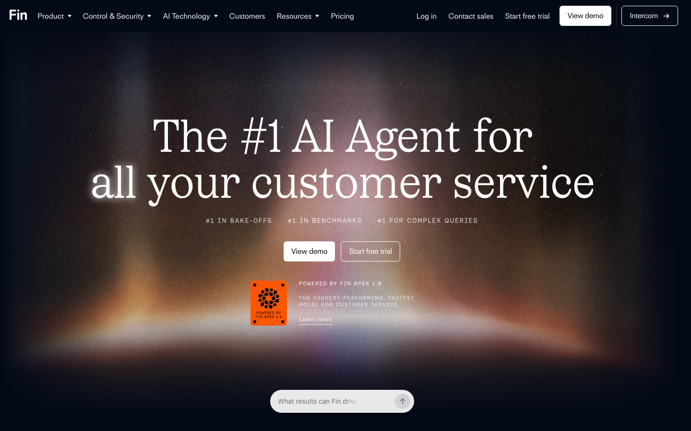

**观察：**

- ✅ 产品核心工作流揭示清晰：页面用 "Fin Flywheel"（Train 训练 → Test 测试 → Deploy 部署 → Analyze 分析）完整呈现了一个闭环工作机制，用户 5 秒内能抓住"这是一个可训练、可上线、可持续优化的客服 AI Agent"。其中 "Test = 上线前跑完整模拟客户对话" 是一个具体且差异化的能力点，说明了产品在部署前如何降低风险。
- ✅ 解决的核心问题与适用场景明确：定位为"解决最复杂的客服查询并自动结案"，输入是企业自己的 Procedures / 知识 / 政策，输出是跨 **voice、email、chat、social** 全渠道的自动应答。渠道清单具体，用户能判断是否覆盖自己的支持场景。
- P1 关键功能机制未说明：「Train」环节只说用 "Procedures、知识、政策" 训练 Fin，但**完全没说明知识如何接入**——是文档上传、网址抓取、还是 API 同步？"Procedures" 是该产品的专有概念却无任何解释。这是用户决策时最想知道、却缺失的功能关键点。
- P2 集成清单缺失：宣称 "works with any helpdesk" 且 "set up in under an hour"，但**没有列出任何具体集成对象**（Zendesk / Salesforce / Freshdesk 等均未提及），"support for additional platforms and custom channels" 表述空泛，用户无法确认能否对接自己现有的工单/客服栈。
- P2 关键指标定义不清：大量强调 resolution rate（23%→71%、99% 对话参与、65% 端到端结案），但"resolution（结案）"如何界定、如何计量未作说明，且"based on independent testing conducted by Fin customers（由客户自行测试）"在口径上偏自证，削弱了性能数据对功能能力的说服力。

#### C5: Footer audit

**URL:** https://fin.ai/

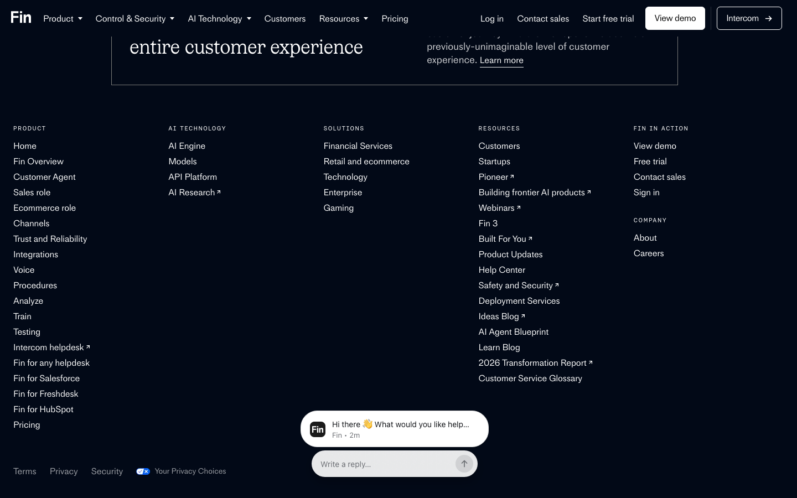

**观察：**

- ✅ 页面清晰揭示了产品的核心工作流——"Fin Flywheel"四步闭环（Train 训练 → Test 测试 → Deploy 部署 → Analyze 分析）：用 Procedures/知识/政策训练、上线前用全模拟对话测试、跨渠道部署、再用 AI Insights 复盘改进。这把"AI 客服 agent 到底怎么落地运转"讲成了一条可理解的能力链，而不只是空喊"智能客服"。
- ✅ 渠道覆盖与适用场景说明到位：明确 Fin 可部署到 voice / email / chat / social 全渠道，并强调"works with any helpdesk"、可接现有 helpdesk 或 Intercom、"set up in under an hour"。用户能直接判断"它能接入我现在的客服栈、能跑在我用的渠道上"。
- P2 集成清单缺失：页面反复说"works with any helpdesk""support for additional platforms and custom channels"，但从未列出**具体支持哪些 helpdesk/平台**（Zendesk、Salesforce、Freshdesk 等一个没提）。footer 里虽有独立的 "Integrations" 入口暗示有清单，但本页对最关键的"我的系统在不在支持列表里"这个购买决策问题没有给出答案。
- P2 "Test" 能力的输入/输出机制说不清："Run fully simulated customer conversations from start to finish"是很有价值的功能点，但没说明模拟对话从何而来（历史工单？人工构造？自动生成？）、测试输出的是什么指标、如何据此调整 Fin。用户无法判断这个"上线前测试"到底能给多大确定性。
- P1 核心能力指标的可信度与口径缺失：解析率从 23%→71%、"resolves up to 65% end-to-end"、"#1 in benchmarks/bake-offs"等是产品最关键的能力承诺，但依据写的是"independent testing conducted by Fin customers"（由客户自行测试），既非真正独立第三方，也未说明测试样本、查询类型、衡量口径。对"这个产品到底能替我解决多大比例的问题"这一最核心功能问题，页面给的是营销话术而非可验证的功能边界。


### 🤖 AI 能力 / Agent（2 个测点）

**该模块覆盖页面**:

- `https://fin.ai/events/ai-series/building-frontier-ai-products`
- `https://fin.ai/ai-engine`

#### S1: Features / Product page

**URL:** https://fin.ai/events/ai-series/building-frontier-ai-products

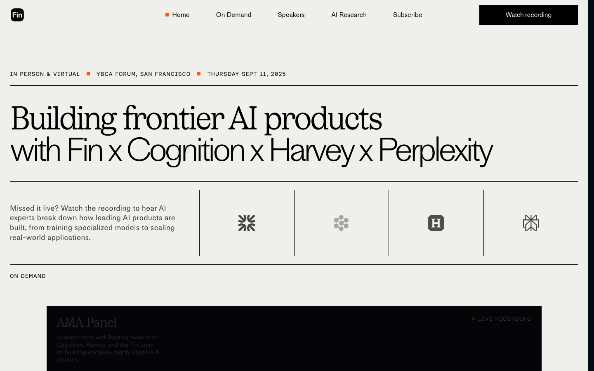

**观察：**

- P1 这是一场活动回放页,而非产品功能页**:全页围绕 9/11 旧金山 YBCA 论坛的录播、演讲嘉宾、AMA Panel 展开,真正的产品——Intercom 的 AI 客服 bot "Fin"——只在底部 AI Research 文章里被侧面带出。读者能知道"存在 Fin 这个产品",却无法回答"它能为我做什么":缺少功能总览、典型使用场景、接入路径。
- ✅ AI Research 板块对技术受众实质性披露了 Fin 的工作机制**:明确说明 Fin 基于 LLM + RAG,自研检索重排器(微调 ModernBERT),并声称在重排效果上超过 Cohere v3.5 的同时降低延迟与成本。这把"产品内部如何运作"讲得比多数官网更具体、可信。
- P1 核心能力定义过于单薄**:全页对 Fin 的功能描述实际只有一句"理解用户问题并准确作答"。没有说明它接入哪些渠道(网站/邮件/Slack/App)、从哪些知识源取数(帮助中心/历史工单/CRM),也没说如何嵌入现有客服工作流(如 Intercom Inbox、Zendesk)。买家无法判断"接入后我的客服场景具体怎么跑"。
- P2 "Explore the models launched at this event" 是功能断点**:页面提到本次活动发布了模型,却没说明这些模型是什么、解决什么问题、面向谁、怎么调用,只给一个 "Learn more"。对想了解"新模型带来哪些新能力"的读者是明显缺口。
- P2 输入/输出/集成链路未闭环**:虽提到 RAG 检索,但没说明 Fin 的数据输入来源、答案的交付形态(直接自动回复 vs 坐席辅助建议)、以及与人工坐席的协作/升级机制(何时、如何转人工)。功能闭环讲不清,影响"能否落地"的判断。

#### E8: 探索: Learn more

**URL:** https://fin.ai/ai-engine

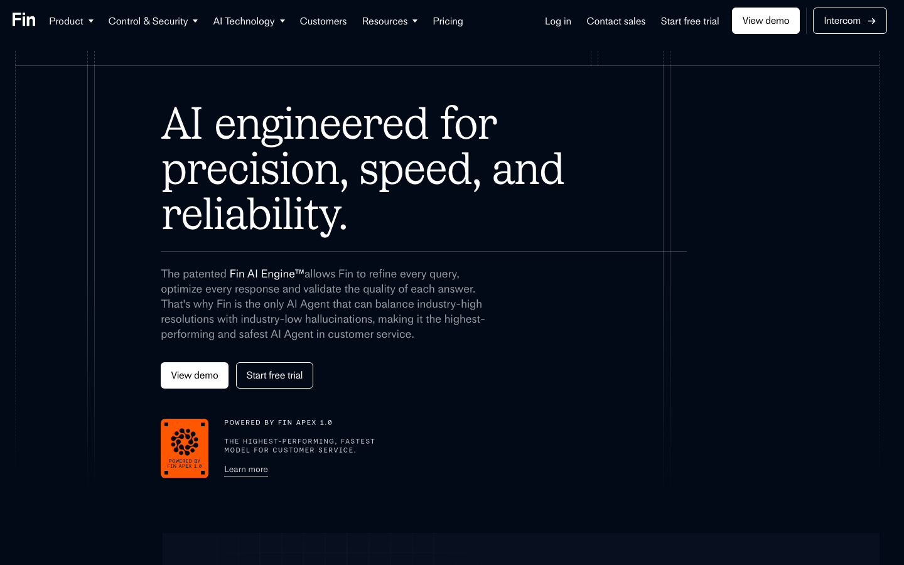

**观察：**

- ✅ 这一页把 Fin AI Engine™ 的**完整工作流拆成 8 个阶段透明展示**（精炼查询→检索→重排→生成→校验准确性→引擎优化→安全→FAQ），并点明背后是自研专用模型（fin-cx-retrieval 检索模型、fin-cx-reranker 重排模型、Fin Apex 1.0 生成模型）。对产品而言，这清楚地揭示了"Fin 不是简单套壳 LLM，而是一条带校验环节的定制 RAG 管线"这一核心能力主张。
- ✅ 功能解决的**核心问题表达精准**：用"industry-high resolutions + industry-low hallucinations"点出客服 AI 最关键的矛盾——既要高解决率又要低幻觉，并把"validate the quality of each answer"（第 5 阶段校验）作为差异化能力，直接回应了企业部署 AI 客服时最担心的"答错/瞎编"风险。
- ✅ Phase 2 把**知识来源集成范围**说得较具体：检索覆盖 help center 文章、已解决的历史会话、结构化片段(structured snippets)、以及"integrated systems"。这让用户理解 Fin 能从哪些数据源取答案，是有信息量的能力说明。
- P2 「integrated systems」语焉不详**：第 2 阶段提到会检索"集成的系统"，但全程没有列举到底能接哪些外部系统（CRM、工单系统、订单/库存数据库等），也没说明接入方式。用户无法判断 Fin 能否读取自己业务系统里的实时数据来作答——这是评估可用性的关键缺口。
- P2 Phase 1 暴露了关联功能但未解释**：规格 1.3「Check for Workflows automation」、1.4「Check for Custom Answer」表明 Fin 会在回答前先判断是否走 Workflows 自动化流程或预设的 Custom Answer，但页面没说明这两个功能各自是什么、何时触发、如何配置。读者只看到能力名词，理解不了实际机制。


### 🎯 解决方案 / 场景（1 个测点）

**该模块覆盖页面**:

- `https://fin.ai/solutions/financial-services`

#### S2: Use cases / Industry

**URL:** https://fin.ai/solutions/financial-services

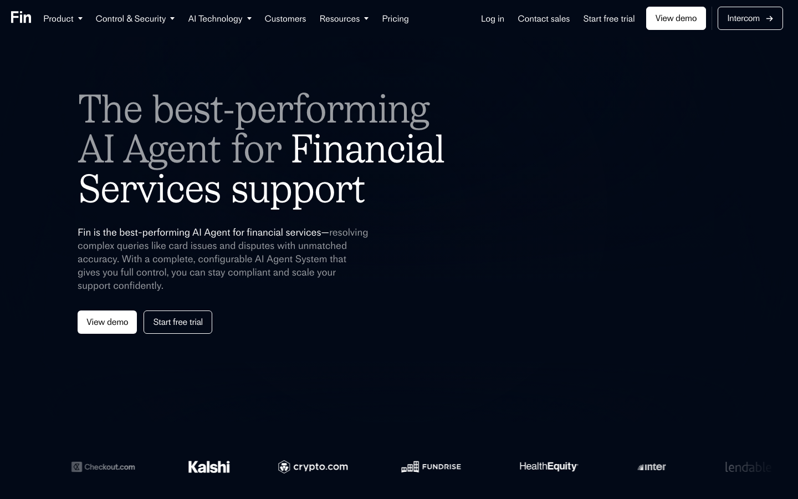

**观察：**

- ✅ 功能机制揭示清晰**：页面点出了两个核心能力支柱——Fin AI Engine™（专利架构，工作流为"意图识别 → 内容检索 → 多阶段校验"以压制幻觉）与 Procedures（用自然语言指令 + 实时数据执行多步骤业务规则）。这两层把"Fin 如何解决复杂金融查询"的工作机制讲到了机制级，而非泛泛而谈，是有信息量的功能披露。
- P2 行业用例只点名不演示**：页面反复点名具体场景（card issues、transaction disputes、fraud claims、card disputes），表明产品定位在金融客服的复杂查询。但全程没有任何一个用例的端到端走查——比如"一笔交易争议进来 → Fin 如何取数、判断、回复或转人工"。读者知道"它能处理争议"，却看不到争议被解决的实际输入/输出流程。
- P1 关键集成对象缺失**：Procedures 依赖"real-time data"、且有独立的 INTEGRATIONS 板块，但节选中完全没说明对接什么系统。对金融服务而言，能否接入核心银行系统 / 卡组织 / 工单或 CRM / 风控系统是决定可用性的首要问题，这一功能关键点未交代，属于严重的功能信息缺口。
- P2 "控制/合规"是卖点但无功能细节**：大量强调 full control、policy compliance、stay compliant、no-code 配置，但没有说明合规到底由哪些功能实现——是否有审计日志、回答护栏（guardrail）配置、审批流、可追溯的决策记录？"可配置系统"被当作能力陈述，却没有展示具体的可配置项与控制粒度。
- P3 Analyze / Train 能力描述偏浅**：Analyze 提到"深度洞察 + AI 驱动的 Suggestions 来优化回答"，Train 提到配置知识与行为，但 Suggestions 的输入/输出形态、Train 能接入哪些知识源、行为可调到什么程度均未说明（且 Train 段落在节选处被截断），运营者读完仍难判断日常如何迭代 Fin。


### ⭐ 客户案例（1 个测点）

**该模块覆盖页面**:

- `https://fin.ai/customers`

#### S4: Customer / logo wall

**URL:** https://fin.ai/customers

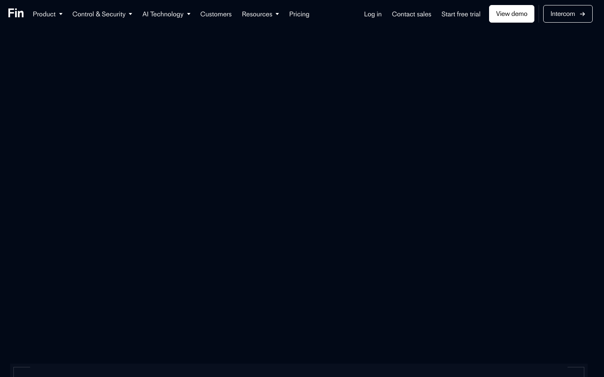

**观察：**

- P1 全页用"结果指标"替代"能力说明"**：页面密集呈现 71% 解决率、$569k 年省成本、12.6k 节省工时、automation rate 等成果数字，但完全没有解释 Fin **如何**达成这些——它从哪些知识源取数（帮助中心？历史工单？产品文档？）、判定一个问题"已解决"的机制是什么、置信度不足时如何回退给人工。读者只知道"有效果"，无法判断"在我的场景下能否复现"。
- P1 核心集成与接入方式缺失**：Vanta 案例提到"moved to Intercom with Fin as their front-line AI Agent",[solidcore] 提到打通 chat/email/social/phone——这暗示 Fin 是 Intercom 平台内的组件且支持全渠道,但页面没说明 Fin 能否独立于 Intercom 使用、如何接入已有工单系统/CRM/知识库,以及"front-line"之后的人工升级(handoff)如何衔接。对评估"我能不能接进来"的用户是关键盲区。
- ✅ 渠道覆盖与"分阶段放量"工作流交代得较具体**：[solidcore] 明确列出 Fin 统一了 chat、email、social、phone 四个渠道的 24/7 支持;多个引述还点出典型落地路径——"先让 Fin 处理简单问题,再扩展到 support/success/每个触点"。这条隐含的渐进式部署工作流,比纯口号更能让读者想象实际使用节奏。
- P2 量化指标缺少口径与基线**：71% resolution rate、automation rate 等数字没有说明分母(是全部进线量还是某类问题?)、统计周期、以及上线前的对照基线,也未区分"自动解决"与"辅助坐席(Copilot)"两种模式的贡献。Lasse 的引述同时提到 "Support" 和 "Copilot" 两类产品形态,但页面没界定二者功能边界。
- P3 行业分类未对应功能差异**：顶部提供 Retail & Ecommerce / Financial Services / Gaming / Software & Technology 等行业筛选,但案例本身只讲成效故事,未说明 Fin 针对不同行业是否有差异化能力(如金融的合规/数据驻留、游戏的高并发场景),筛选维度更像案例索引而非功能适配说明。


### 💰 定价 / 商业化（1 个测点）

**该模块覆盖页面**:

- `https://fin.ai/pricing`

#### C2: Pricing page

**URL:** https://fin.ai/pricing

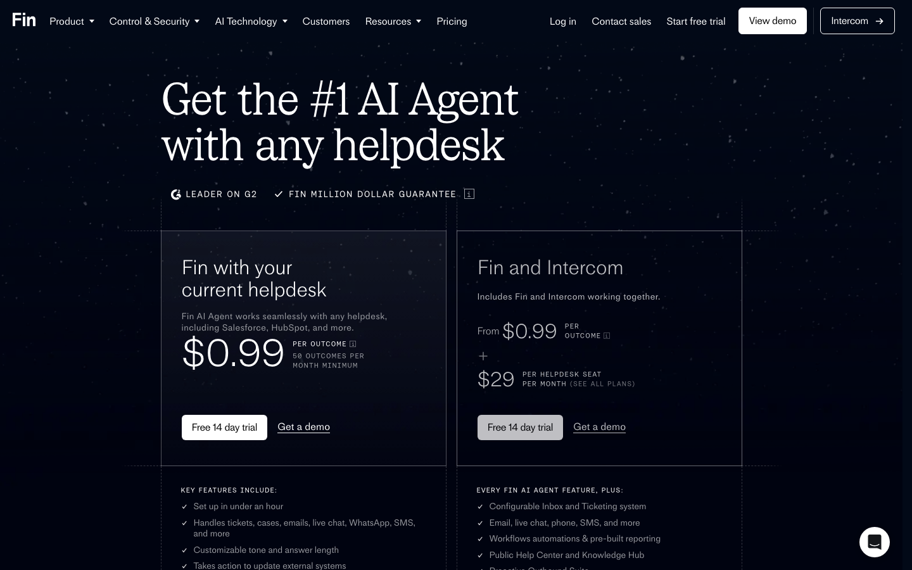

**观察：**

- ✅ 页面清晰揭示了产品的两种部署形态，这是核心能力信息**：①"Fin with your current helpdesk"——Fin AI Agent 作为独立 agent 叠加在用户**现有**的 Salesforce / HubSpot 等工单系统上；②"Fin and Intercom"——Fin + Intercom 自有的 Inbox/Ticketing 全平台捆绑。两者价格结构（纯 $0.99/outcome vs. $0.99/outcome + $29/seat）直接对应"只买 AI"还是"买整套客服平台"两种采购场景，读者能快速判断自己属于哪一类。
- P1 全站定价与价值的核心计量单位"outcome"全程未定义**：整页围绕 "$0.99 PER OUTCOME / 50 OUTCOMES PER MONTH MINIMUM" 展开，但"一个 outcome"到底指什么——是一次成功解决（resolution）、一次用户问题被回答、还是一次工单关闭？判定由谁做、失败/转人工的对话算不算 outcome？这是决定用户实际花费和产品工作机制的最关键一环，却没有任何说明，会直接造成功能与成本的误解。
- P2 Fin 的关键差异化能力"Takes action to update external systems"缺少工作机制说明**：这条暗示 Fin 不止于答疑、还能**回写外部系统**（改订单、更新 CRM 字段等），是区别于普通 FAQ 机器人的核心卖点；但页面没说通过什么实现（API / 预置连接器 / 自定义 workflow？）、支持哪些系统、需不需要工程接入。读者无法判断"它能不能动我的系统"。同样 "Transfers to agents directly in preferred Inbox" 也未说明转接触发条件与上下文是否带过去。
- P2 两个 Add-on（Pro / Copilot）只罗列功能名词，缺输入/输出与适用场景**：Pro 的 CX Score、AI Topics、Trends、AI Recommendations、Monitors、Custom AI Scorecards 全是名词堆叠——分析的是哪类数据、产出什么形式的结果（评分?报表?告警?）、按"1,000 conversations/月"计费时超量怎么算，均无解释。Copilot 虽点明是"坐席 inbox 内的个人 AI 助手"，方向较清楚，但同样没说它的知识来源边界与 Fin 的功能重叠关系。
- P3 各档之间的功能依赖与组合关系未交代**：页面没有说明 Pro / Copilot 这两个 add-on 是否同时适用于"纯 Fin"和"Fin+Intercom"两种底座，也没说 add-on 是否依赖某些基础功能才能开启。对想要"AI agent + 质检分析"组合的用户，无法据此页拼出自己的完整功能清单与总价。


### 🚪 注册 / 试用入口（1 个测点）

**该模块覆盖页面**:

- `https://fin.ai/`

#### C3: Sign-up flow (no submit)

**URL:** https://fin.ai/

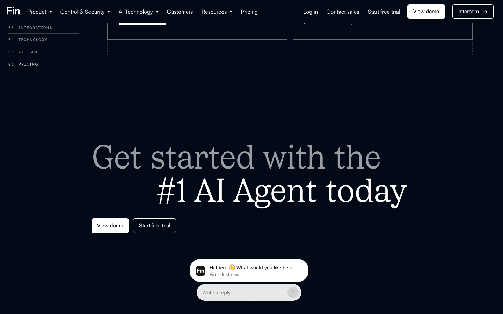

**观察：**

- ✅ 页面清晰揭示了 Fin 的核心工作流闭环「Fin Flywheel」：训练(Train)→测试(Test)→部署(Deploy)→分析(Analyze)。这条主线把产品能力讲成一个可持续改进的循环，用户能快速理解 Fin 不只是个聊天机器人，而是一套"配置-验证-上线-优化"的运营体系。
- ✅ "Test = 上线前跑完整模拟客户对话"是个有信息量的差异化功能点——它解决了 AI 客服最大的落地顾虑（怕上线后乱答），让用户在部署前就能预演 Fin 的真实行为，使用场景明确。
- ✅ 多渠道部署能力描述具体：voice / email / chat / social 四类渠道 + tickets/live chat，并强调"works with any helpdesk"且"set up in under an hour"，对"能不能接入我现有客服栈"这一关键决策问题给了正面回应。
- P1** 全页反复强调 Fin"端到端解决最复杂查询"（resolve complex queries end-to-end），但**完全没说明实现机制**：Fin 如何读取客户数据、调用后端/订单/CRM 系统、执行实际动作（退款、改单、查状态）？"Procedures/knowledge/policies"只覆盖了知识训练，没覆盖"采取行动"的能力，这是判断产品能否真正解决复杂工单的最核心信息缺口。
- P2** 集成能力表述含糊。"works with any helpdesk""support for additional platforms and custom channels"没有给出**具体支持的 helpdesk 清单**（Zendesk？Salesforce？Freshdesk？），用户无法确认自己的工具栈是否在列；"custom channels"的接入方式（API/SDK/Webhook）也未交代。


### 📞 Demo / 销售对接（1 个测点）

**该模块覆盖页面**:

- `https://fin.ai/contact-sales`

#### S14: Customer support channels

**URL:** https://fin.ai/contact-sales

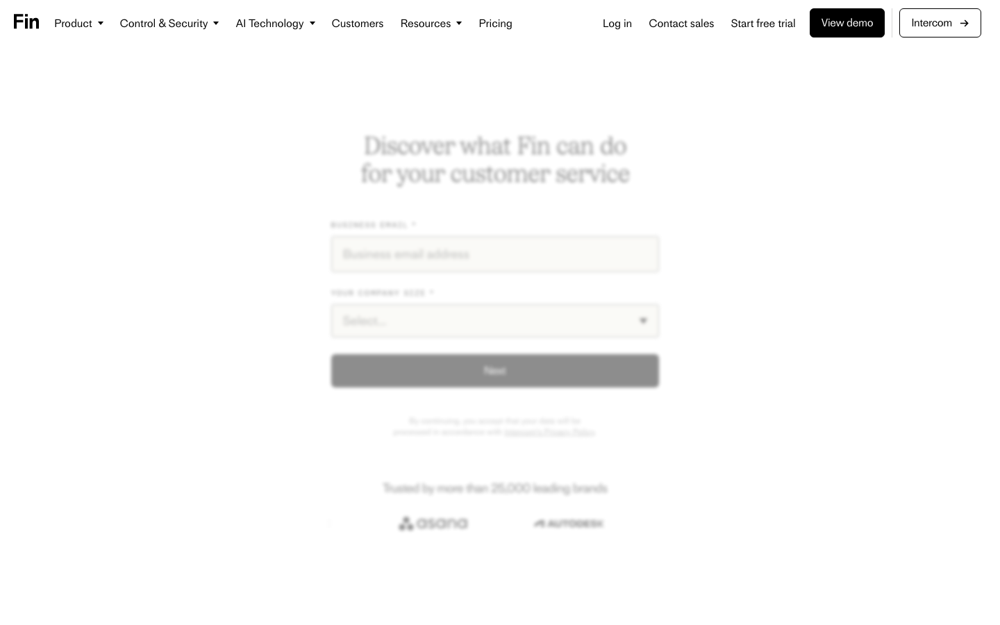

**观察：**

- P1 关键功能信息完全缺失**：该页本质是一个 gated 演示/试用预约表单（仅含企业邮箱、公司规模两个字段 + "Next"），正文没有任何关于 Fin 实际支持哪些客服渠道的描述。针对测点 S14（Customer support channels）而言，页面对"渠道覆盖"这一核心能力是零信息——用户无法得知 Fin 是否覆盖在线聊天、邮件、电话、SMS、WhatsApp、社交媒体、应用内消息等渠道。
- P1 无法回答"这个产品能为我做什么"**：标题"Discover what Fin can do for your customer service"明确承诺要展示 Fin 的能力，但页面把所有功能内容都挡在表单之后，读完本页用户只知道"Fin 是一个面向客服的 AI"，对它的输入/输出、处理工作流、可解决的具体问题（如自动应答、工单分流、坐席协助）一无所知。这是典型的"承诺-内容错配"。
- P2 渠道部署的关键工作机制未说明**：客服渠道类功能最该交代的细节——Fin 是嵌入到 Intercom 自有 Messenger 才能用，还是可以接入第三方渠道/已有客服系统（Zendesk、Salesforce 等）——页面只字未提。若 Fin 仅限自家渠道、需先迁移到 Intercom，这对评估"能否接入我现有的支持体系"是决定性信息，却被完全省略。
- P3 仅能从导航栏间接推断能力边界**：顶部导航（Product / AI Technology / Control & Security / Customers / Pricing）暗示产品被划分为"AI 技术""管控与安全"等能力域，可大致猜测 Fin 强调 AI 能力与企业级安全管控，但这只是结构性线索，并未在本页落地为任何渠道或功能说明。
- P2 缺少可量化的能力/适用场景锚点**："Trusted by more than 25,000 leading brands"是规模背书而非功能信息；页面没有给出任何渠道相关的能力指标（如支持渠道数、自动解决率、可处理的会话类型），用户难以判断 Fin 在多渠道客服场景下的适用性与边界。


### 🔌 集成 / API（2 个测点）

**该模块覆盖页面**:

- `https://fin.ai/integrations/helpdesk`
- `https://fin.ai/integrations/salesforce`

#### C7: Help / Documentation

**URL:** https://fin.ai/integrations/helpdesk

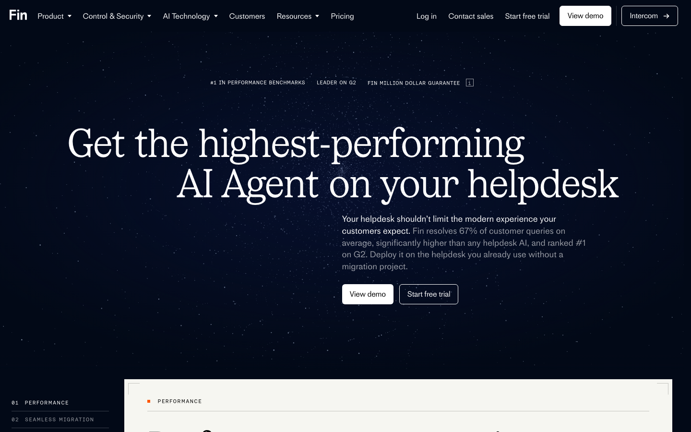

**观察：**

- ✅ **核心能力交代清晰**：页面明确点出 Fin 不只做问答，而是能端到端处理"退款、取消、账户变更"等多步工作流（multi-step workflows），并调用 Stripe / Shopify / Salesforce 的实时数据按业务逻辑执行。这把"AI agent 能替我做什么具体动作"讲得很具体，而非泛泛的"智能客服"。
- ✅ **揭示了完整的运营闭环（Fin Flywheel）**：训练（基于知识库与 Procedures）→ 测试（Simulations 仿真）→ 跨渠道部署 → 分析每段对话，构成可重复的性能优化循环。这说明产品不仅是一个 agent，还附带"训练-测试-上线-复盘"的工作流工具链，信息量高。
- P2 集成能力只给示例、无完整清单与接入机制**：只列举了 Stripe / Shopify / Salesforce 三个集成样例，未说明支持的集成全集、如何连接配置、需要哪些权限/数据接口。读者无法判断"我现有的系统能不能接、怎么接"。
- P2 关键指标的工作机制未解释**："67% 解决率""从 30% 提升到 70%"反复出现，但未定义什么算一次"resolution"、Fin 如何判断能否自动解决、何时转人工。指标可信但缺乏支撑其成立的功能机制说明。
- P1 测点定位（Help/Documentation）与实际内容错位**：C7 应考察"帮助/文档"能力，但此页是营销落地页，完全没有暴露文档体系、配置指南、API 参考或自助上手路径。用户读完知道"产品很强"，却无法获知"如何真正把它跑起来"——文档/上手类功能信息缺失。

#### S3: Integrations page

**URL:** https://fin.ai/integrations/salesforce

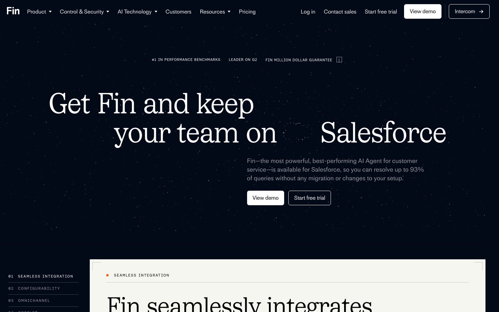

**观察：**

- ✅ **功能能力清晰**：页面准确揭示了 Fin 作为 AI Agent 在 Salesforce 上的**双向数据工作流**——读取你授权共享的 Salesforce 数据生成回答，并把字段变更、对话记录(transcripts)、摘要(summaries)**写回**你批准的字段。输入/输出讲得很具体，不是泛泛的"集成"。
- ✅ **核心价值主张落地**："无需迁移"不是空话，明确列出了它复用的现有资产：知识库文章、Case 字段、联系人记录、以及 Salesforce Flows，并说明会遵循你既有的路由与自动化规则。读者能立刻理解"不动现有架构就能上 AI"这一卖点，目标场景（已重度使用 Salesforce 的客服团队）非常明确。
- P2 关键数字未对齐**：顶部宣称"resolves up to 93% of queries"，正文又给出"52% AVERAGE RESOLUTION RATE"。一个是上限、一个是均值，但页面未解释两者关系，也未说明 52% 是否专指 Salesforce 场景的实测值。用户难以判断"我实际能期待多少解决率"，存在误导风险。
- P2 接入/部署机制缺失**：反复强调"seamless / no migration"，但完全没说**具体怎么接**——是 AppExchange 托管包、OAuth 授权、还是需要 IT 配置？部署周期多久、需要什么权限？对一个"集成页"而言，这是用户最想知道却完全缺失的功能关键点。
- P2 配置与外围能力描述偏薄**：Configurability 只提到 tone / routing / handoff，但配置方式（无代码界面？规则引擎？）未说明；OMNICHANNEL、COPILOT、Fin Insights 几个能力点在节选中基本只有标题——支持哪些渠道、Copilot 给人工坐席做什么、Insights 输出什么样的报表/可操作建议，均未展开，用户无法判断这些能力的实际边界。


### 🔒 安全 / 信任（1 个测点）

**该模块覆盖页面**:

- `https://fin.ai/trust-reliability`

#### S12: Trust / Security page

**URL:** https://fin.ai/trust-reliability

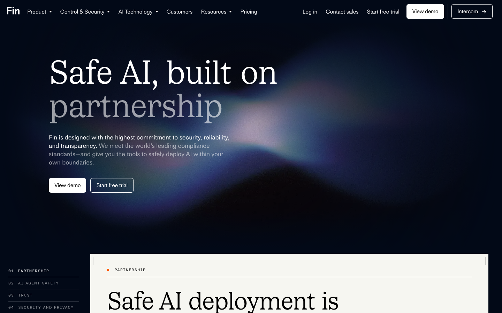

**观察：**

- ✅ "We ensure / You define" 这张责任分担表实质是一份功能能力清单：用户侧明确可配置 Fin 的**目标、范围边界、复杂工作流程序(Procedures)、数据连接器/集成、测试与验证标准**——读者能快速理解 AI agent 哪些行为掌握在自己手里，比泛泛讲"安全"更有功能信息量。
- Procedures** 揭示了核心能力：让 Fin 执行**多步操作、套用业务规则、触发审批、连接外部系统**，且始终在用户设定参数内，直击"AI agent 处理复杂/敏感流程时如何不越界"的问题。但 **P2**：未说明 Procedures 如何定义（可视化编排？自然语言？代码？）、能对接哪些审批/外部系统，机制停留在概念层。
- Simulations** 解决"上线前如何验证 AI 行为"的痛点——可跑端到端真实对话场景（从 FAQ 到高敏感案例）。但 **P2**：没讲清输入（测试用例来自历史对话还是手工编写）、输出（通过/失败判定标准、覆盖率或回归报告），用户难判断这是一次性演练还是可持续的测试体系。
- P1** 关键集成信息缺失：页面反复出现 "Data Connectors and integrations""connect to external systems"，并以受监管的 fintech、healthcare 为典型客户，却**全程未列出任何具体集成对象（CRM、工单系统、数据库、身份系统）**，用户无法判断"Fin 能不能接入我现有的系统栈"——这是该页对潜在买家最实质的功能疑问。
- P2** 安全/合规的功能承诺未落地：开篇称 "meet the world's leading compliance standards"，导航也列了 SECURITY AND PRIVACY / RELIABILITY AND SCALE / GUARANTEE 三大块，但节选正文里均无具体内容（如 SOC 2 / GDPR / HIPAA 认证、SLA 数字、保障条款细则），读者无法获知这些关键安全功能的实际边界（注：相关细节可能在节选未覆盖的下方区域，建议核实正文）。


### 🏢 公司 / 团队（1 个测点）

**该模块覆盖页面**:

- `https://fin.ai/about`

#### S7: About / Company

**URL:** https://fin.ai/about

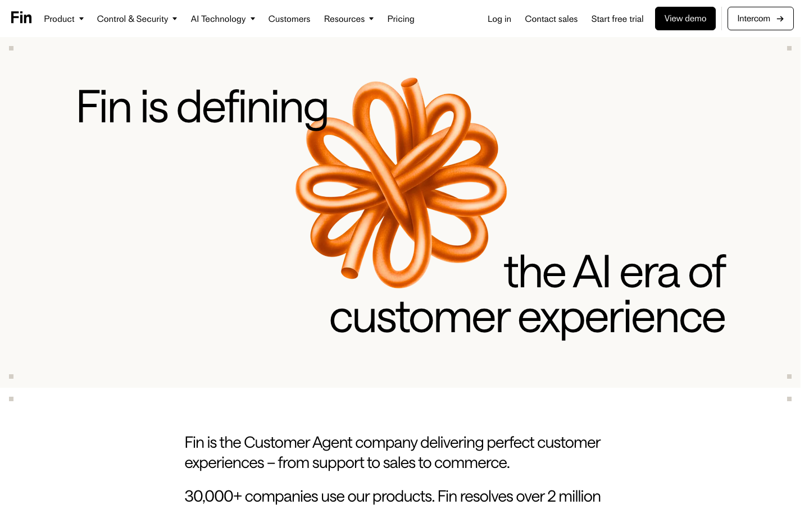

**观察：**

- ✅ **产品矩阵清晰**：页面明确揭示了产品线由三个"Customer Agent"组成——Fin for Service（客服）、Fin for Sales（处理 inbound 销售）、Fin for Ecommerce（覆盖整个购物旅程），外加一个"coming soon"的新角色。读者能快速建立"这家公司提供哪几类 AI agent、各自覆盖客户旅程哪个阶段"的认知。
- ✅ **核心产品理念表达有力**："single agent with full context across the entire customer journey"点明了产品机制与差异化价值——用一个具备全程上下文的统一 agent，解决"售前/客服/电商各环节体验割裂"的问题。这是功能层最有信息量的一句，说明了"为什么是一个 agent 而非多个工具"。
- P2 三大产品仅有一句口号，功能细节为零**：Fin for Sales 只写"handles inbound sales end-to-end"、Fin for Ecommerce 只写"handles the entire shopping journey"，没有任何输入/输出、接入渠道、工作流步骤或适用场景说明。用户读完无法判断"它具体替我做哪些动作、怎么做"，必须跳转到其他页面才能理解能力边界。
- P2 自研模型 Apex 1.0 是关键能力信号，但完全未展开**：页面把"转向自研、purpose-built AI 模型 Apex 1.0"作为 2026 年的里程碑，这是重要的能力/技术差异点，却没说明这个模型相比通用大模型解决了什么、带来哪些功能优势（如准确率、解决率、定制能力），仅作为品牌叙事一笔带过。
- P3 关键功能指标缺乏来源与定义**："Fin resolves over 2 million conversations weekly""industry-leading resolution rates"等是有力的能力佐证，但"resolve/解决"如何定义、是否含人工兜底、跨三个产品线如何分布均未说明——作为 About 页可接受，但若读者想据此评估产品能力，信息缺口明显（典型的集成清单、支持渠道、与 CRM/工单系统的对接方式在本页均未触及）。


### 🔑 登录入口（1 个测点）

**该模块覆盖页面**:

- `https://fin.ai/`

#### C4: Login page

**URL:** https://fin.ai/

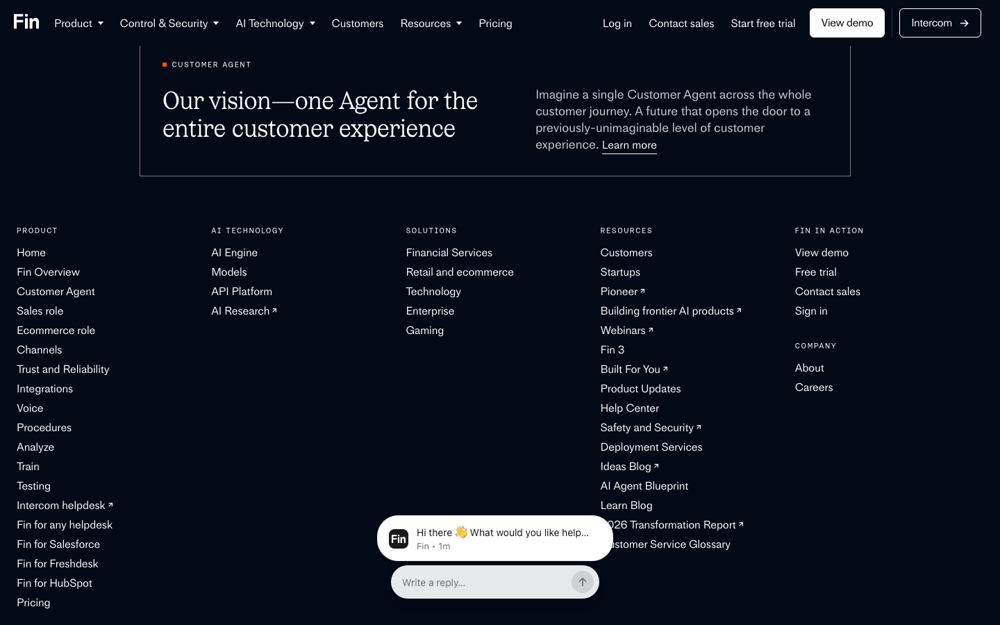

**观察：**

- ✅ "Fin Flywheel"(Train→Test→Deploy→Analyze)清晰勾勒出产品完整的工作流闭环:用企业的 Procedures/知识/政策训练 → 上线前用全程模拟对话测试 → 全渠道(voice/email/chat/social)部署 → 用 AI Insights 分析迭代。这让读者理解 Fin 不只是"问答机器人",而是一套"可训练、可验证、可运营"的客服 AI 系统;其中"上线前全程模拟真实客户对话"是有辨识度的功能,直击"AI 客服上线前无法预知行为"的真实痛点。
- P1 页面反复强调 Fin "resolves up to 65% end-to-end""解决最复杂的查询",但完全没说明 Fin 如何执行**动作类任务**(查订单、退款、改地址等)——能否调用后端 API / 工具 / 触发工作流?"resolve"到底是"给出正确答案"还是"代客户完成操作"?这是决定产品能力边界的核心功能点,却无任何机制说明,直接影响读者判断"它能不能替我干活"。
- P2 "Train Fin on your **Procedures**"中 Procedures 刻意大写,暗示它是产品内一个结构化功能实体(类似可执行 SOP / 决策流程),但页面未解释它是什么、如何创建、与普通知识库文章有何区别——而这恰恰被定位为 Fin 处理"复杂查询"的关键机制,却一笔带过。
- P2 集成部分声称"works with any helpdesk""1 小时内完成设置",并提到"existing helpdesk or Intercom""custom channels",但具体支持哪些 helpdesk(Zendesk / Salesforce / Freshdesk 等)的清单被截断、未列出。读者无法判断自己现有工具栈是否被支持,这是采购前的关键信息缺口。
- P2 性能数据(解决率 23%→71%、参与 99% 对话、端到端解决 65%)冲击力强,但"resolution"如何定义、由谁判定、测试口径均不明;且来源标注为"independent testing conducted by Fin customers"("客户做的独立测试")措辞自相矛盾,作为功能性能的可信参照偏弱。


### 📚 产品官方介绍（递归发现）（3 个测点）

**该模块覆盖页面**:

- `https://fin.ai/help/en/collections/18812312-overview`
- `https://fin.ai/help/en/articles/13975798-fin-for-zendesk-getting-started-guide`
- `https://fin.ai/learn/ai-agent-kpis-enterprise-performance-metrics-framework`

#### B1: 背景 D1: Overview 12 articles

**URL:** https://fin.ai/help/en/collections/18812312-overview
**观察：**

- [No screenshot captured]

#### B2: 背景 D2: Fin for Zendesk: Getting started guide

**URL:** https://fin.ai/help/en/articles/13975798-fin-for-zendesk-getting-started-guide
**观察：**

- [No screenshot captured]

#### B3: 背景 D1: Read more about The Definitive KPI Framework for Measuring A

**URL:** https://fin.ai/learn/ai-agent-kpis-enterprise-performance-metrics-framework


**观察：**

- P3 产品/公司定义缺失** — 页面署名 "INSIGHTS FROM FIN TEAM"，结合顶部导航可判断出自 Intercom 旗下 AI 客服 agent 产品 Fin，但全文是一篇 KPI 方法论文章（"The Definitive KPI Framework for Measuring AI Agent Performance in Customer Service (2026)"），通篇没有一句话定义 Fin 是什么、能做什么。挖到的是品牌"思想领导力"内容，而非产品介绍。
- ✅ 核心叙事清晰且鲜明：传统指标对 AI agent 已失效** — 主张直接，原文 "Traditional customer service KPIs were built for a world where human agents handled every conversation... That world no longer exists."，点名 AHT、首次响应时间、deflection 等旧指标的失效，并引用 Microsoft Dynamics 365（旧指标 "are trailing signals and don't tell you whether an AI agent is competent, reliable, or most importantly improving"）和 Google Cloud AI 团队背书，差异化叙事（旧指标=误导，需全新框架）立得住。
- ✅ 关键术语定义到位** — 对核心指标给出了明确含义：Resolution rate（AI agent 端到端解决、无需转人工的对话占比，行业基准 55-70%、头部 >80%，是"最重要的运营 KPI"）；Deflection rate（未触达人工的查询占比，含 FAQ 浏览/文章点击/弃聊，被批为"只反映量、不反映客户结果"的 chatbot 时代指标，举例 90% deflection 可能只对应 40% 真实解决率）；Reopen rate（"已解决"对话被重开的比例）。还特别点出 "resolved" 定义因厂商而异、跨厂商对比不可靠这一行业陷阱。
- ✅ 目标用户与场景明确** — 面向部署 AI 客服 agent 的企业，痛点场景为"无法改进 agent、无法证明 ROI、无法放心把高价值客户交互交给 AI"（原文 "Without rigorous KPIs, companies cannot improve their agents, cannot demonstrate ROI, and cannot confidently deploy AI..."），框架自我定位为 "the tiered approach enterprises need"。
- ✅ 框架骨架清晰（四层分层模型）** — 提出 "The Four-Tier AI Agent KPI Framework"，强调"表层指标必要但不充分，每一层建立在下一层之上"，节选完整展开的仅 Tier 1: Resolution Metrics（解决/偏转/重开三项）。
- P3 理解缺口** — 读完仍不清楚：(1) Fin / Intercom 产品本身具备哪些能力、与该框架是什么关系（全文未提自家功能）；(2) Tier 2-4 分别是什么（节选未给出）；(3) Fin 自身的解决率/实际表现如何——文章倡导用解决率衡量 AI agent，却未披露自家数据。


### 📌 其他（9 个测点）

**该模块覆盖页面**:

- `https://fin.ai/this-page-should-not-exist-product-audit-test-1234`
- `https://fin.ai/research/`
- `https://fin.ai/view-demos`
- `https://fin.ai/cx-models`
- `https://fin.ai/capabilities`
- `https://fin.ai/procedures`
- `https://fin.ai/testing`
- `https://fin.ai/channels`
- `https://fin.ai/analyze`

#### C8: 404 error handling

**URL:** https://fin.ai/this-page-should-not-exist-product-audit-test-1234

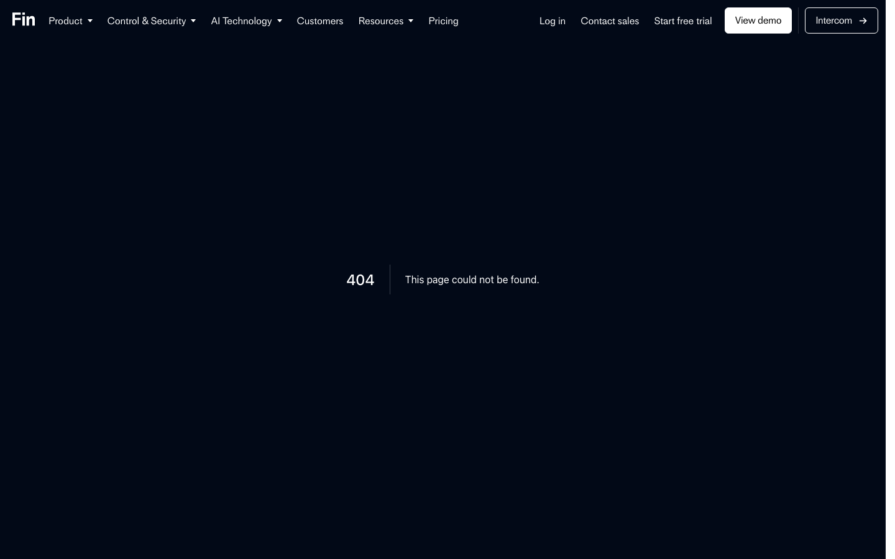

**观察：**

- ✅ 顶部导航在 404 页仍完整保留，间接揭示了产品的能力骨架:「Control & Security」(管控与安全治理) 与「AI Technology」(AI 技术) 并列为一级入口,说明这是一款把"AI 能力"和"企业级管控/安全"作为双核心卖点的 AI agent 类产品,而非单纯的对话机器人。
- P2 404 页本身在功能层几乎零信息:仅有「This page could not be found.」一句,没有提供站内搜索、热门功能入口、文档链接或"返回产品首页/Pricing"等任何引导。用户误入后无法借此理解产品能做什么,也没有回到核心功能页的捷径。
- P2 缺少面向功能的恢复路径。成熟 SaaS 的 404 通常会推荐高价值落点(如 Product 总览、Demo、定价或帮助中心),帮助迷路用户继续转化;此页未做任何功能性兜底,潜在的能力曝光与试用引导机会(已有「View demo」「Start free trial」CTA 却未在此复用)被浪费。
- P3 页面出现孤立的「Intercom」字样,疑似第三方在线客服挂件,但未说明其用途。若这是产品内置的支持/对话能力,缺乏上下文会让人误判它是产品功能的一部分还是页面残留,功能归属不清晰。
- P1(信息缺口) 仅凭此页无法回答"这个产品具体为我做什么":一级导航只给出抽象品类标签(AI Technology / Control & Security),没有任何关于输入输出、可接入的系统/CRM、典型工作流或适用场景的线索。需进入 Product、AI Technology 等正常页面才能判断其核心功能,404 页对"产品能力认知"无贡献。

#### S6: Blog / Resources

**URL:** https://fin.ai/research/

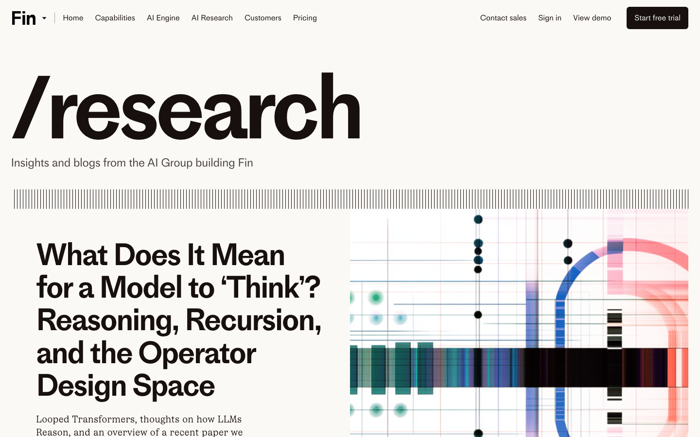

**观察：**

- ✅ 研究博客间接揭示了 Fin 的完整能力图谱**：从文章标题可反推出 Fin（Intercom 的 AI 客服 agent）的核心功能栈——Agentic RAG 检索、重排序（reranker）、语言自动检测（多语言支持）、升级到人工的判断逻辑（"To escalate, or not to escalate"）、从历史对话自动生成知识库内容、用户反馈理解（"Was that helpful?"），以及低延迟推理（"3ms a Token"）。对技术买家而言，这是 Fin "底层能力扎实" 的有力背书。
- P1 页面本身不直接说明产品能为用户做什么**：这是一个面向 ML 研究者/招聘的技术研究索引，全部 23 篇都是工程/算法内部话题，没有任何一句把"研究能力"翻译成"客户能得到的结果"（如解决率、自动化率、节省的人力）。非技术买家读完无法回答"Fin 能为我的客服团队做什么"。
- P2 研究主题与实际产品功能之间缺少映射**：例如"Structured, Agentic RAG for Ecommerce"暗示 Fin 有电商垂直能力、"Generating Knowledge Center Content"暗示有知识库自动生成功能，但页面没有任何链接或说明把这些研究成果对应到产品中可购买、可配置的具体功能模块，读者只能自行猜测哪些已落地、哪些仍是实验。
- P2 关键功能机制的"输入/输出/适用场景"未交代**：升级逻辑、反馈闭环、知识生成等都是潜在卖点，但作为研究文章只讲算法动机与方法，未说明在真实部署中需要什么输入（数据源、对话量）、产出什么、适用哪类业务规模，无法据此判断与自身场景的契合度。
- P3 缺少按能力维度的导航/筛选**：23 篇文章只按时间罗列，未按功能主题（检索 / 升级 / 多语言 / 成本 / 可靠性）分组，想快速了解"Fin 在某一具体能力上做了什么"的读者需要逐条翻找。

#### E1: 探索: View demo

**URL:** https://fin.ai/view-demos

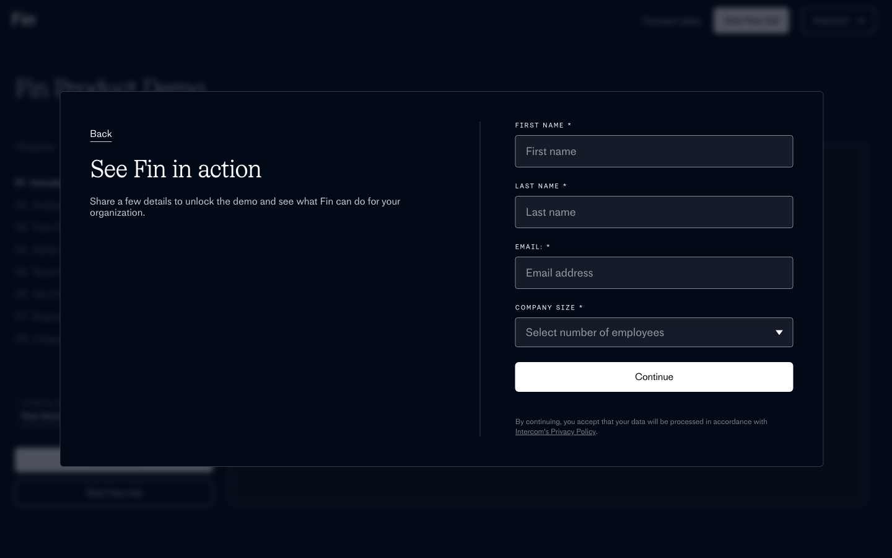

**观察：**

- ✅ 章节大纲本身就是一张清晰的产品能力地图：从"分析表现 → 用支持内容训练 → 模仿优秀客服 → 处理复杂任务 → 测试回复 → 多渠道部署 → 平台集成"，完整勾勒出 Fin 这个 AI 客服 agent 的全生命周期工作流，用户一眼能看出它不是"开箱即用的黑盒"，而是可训练、可调校、可部署的体系。
- ✅ 第 03 章"用你的支持内容训练 Fin"+ 第 04 章"引导 Fin 像你最优秀的客服一样工作"明确回答了"这是通用机器人还是为我定制"这个关键疑虑——清楚传达 Fin 可基于客户自有知识库训练、并按客户最佳客服的行为方式来对齐，定位精准。
- P2** 整个 demo 实质内容被表单墙（姓名/邮箱/公司规模）锁住，本页面只能看到 8 个章节标题，**各能力到底"如何工作"的功能细节（输入/输出/机制）全部不可见**。用户在不留资料的前提下，无法真正判断"产品能为我做什么"，只能凭标题想象。
- P1** 第 07 章"跨支持渠道部署"与第 08 章"与任意平台集成"措辞极度笼统——**没有列出任何具体渠道（邮件/在线聊天/电话/Slack/WhatsApp？）或集成对象（Zendesk/Salesforce/自有系统？）**。"any platform"是营销话术而非功能说明，最该被关注的接入能力反而最模糊。
- P2** 第 05 章"教 Fin 处理复杂任务"未界定"复杂任务"的边界——是多轮对话、调用 API 执行动作（退款/改单）、还是跨系统取数？**工作机制和能力上限缺乏说明**，用户难以评估它能否覆盖自己的真实场景。

#### E2: 探索: Learn more

**URL:** https://fin.ai/cx-models

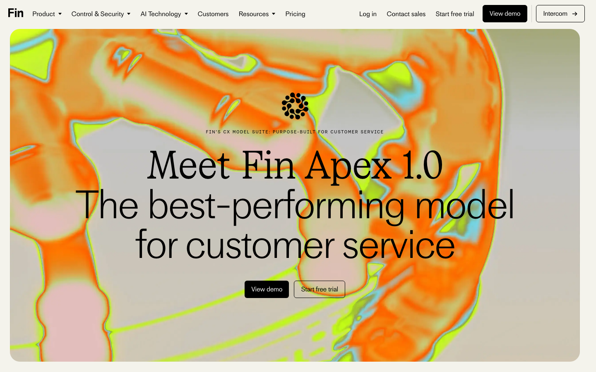

**观察：**

- ✅ 页面把 Fin 的核心工作机制讲成了一条清晰的三段式检索-生成(RAG)流水线:**Fin Retrieval**(理解意图、跨全部知识源做语义检索、选出 top N 候选)→ **Fin Reranker**(对检索内容重排序)→ **Fin Apex 1.0**(套用你的策略、生成最终答案或判定"该转人工")。把"AI 如何得出每一句答复"拆成可理解的模块而非黑箱,功能叙事有力,读者能建立起对工作流的整体认知。
- ✅ Apex 的能力定位非常明确,直接对应客服自动化两大痛点:答案"**grounded in your knowledge base, not general data**"(治幻觉)+ "**knows when not to answer / escalates honestly**"(治乱答、该转人工就转)。"following your policies reliably"也点出可被业务规则约束。用户能读懂它要解决的具体问题。
- P2** 关键集成与输入信息缺失:页面反复强调"your knowledge base""all available content sources""your policies/guidelines",却始终没说明**能接入哪些知识源**(帮助中心?工单/对话历史?第三方文档?网页 URL?)、**策略/指南具体怎么配置**。读者知道"它会用我的数据和规则",但无从判断"怎么把我的数据和规则喂进去"——这是从"了解能力"跨到"判断能否落地"的核心缺口。
- P2** 性能宣称缺乏统一可比口径:三个数字里只有"-65% 幻觉"标注了基线(vs Sonnet 4.6),而"**2.8% higher resolution rate**""**0.6s faster time to first token**"未说明对比对象(对比 frontier models?旧版 Fin?),也无绝对值(2.8% 是从多少提升到多少),削弱了功能性能主张的说服力。
- P2** 终端使用视角缺位:整页是"模型/技术规格"叙事,聚焦模型套件本身的能力,却几乎没讲**用户侧的功能闭环**——Apex 产出的答案如何嵌入 Fin agent、转人工后的交接如何进行、是否支持多语言/多渠道、需不需要训练/调优。读完能理解"这个 AI 引擎很强",但较难拼出"我的客服团队日常具体怎么用它"。

#### E3: 探索: Explore all capabilities

**URL:** https://fin.ai/capabilities

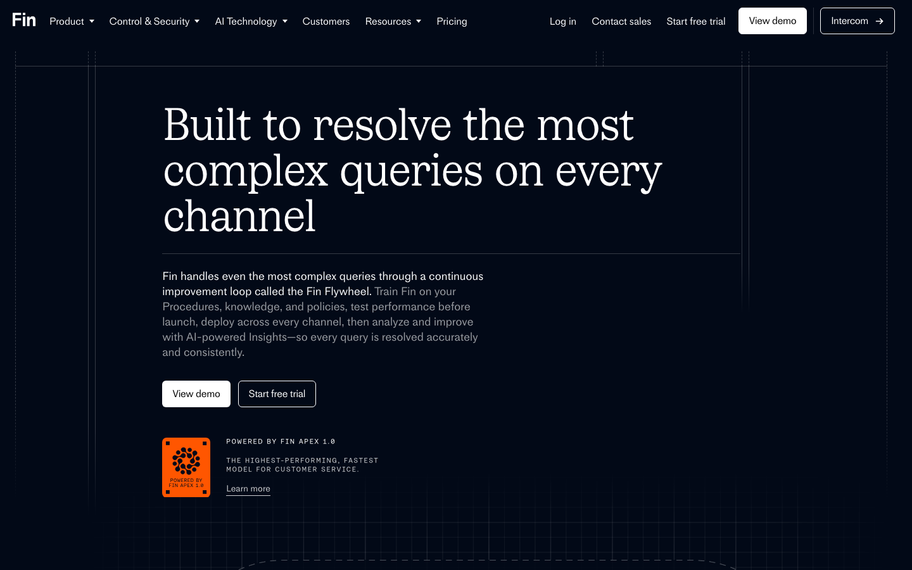

**观察：**

- ✅ 页面用 **Fin Flywheel（训练→测试→部署→分析 四阶段闭环）**清晰传达了产品定位：这不是单一聊天机器人，而是一个面向客服 AI agent 的全生命周期管理平台。用户读完能快速建立"养成式 AI 客服"的整体心智，工作流叙事很有力。
- ✅ **Procedures（流程）**这一核心能力描述到位：明确说明可处理"多步骤、业务逻辑、第三方系统、跨团队审批"的复杂查询，并点出"自然语言指令 + 确定性控制（deterministic controls）"的混合机制——既解释了能做什么（超越 FAQ 的多步事务），也点出了与纯 LLM 方案的差异化（可控、按规则执行），功能价值清晰。
- ✅ **Simulations（模拟测试）**精准命中了 AI 客服落地前的核心痛点——"上线前无法预判 agent 行为"。页面说明可端到端模拟真实对话、观察 Fin 的推理过程与 pass/fail，使用场景（上线前验证 Procedures 是否按预期工作）交代得很具体。
- P2 集成能力（Data Connectors）只给了示例未给清单**：仅举例 Shopify / Stripe / Salesforce，用"like"带过，未说明支持的完整集成范围、是否支持自定义 API / Webhook、"take action"具体能执行哪些写操作（退款？改订单？）。读者无法判断能否对接自己的系统栈，这是采购决策的关键缺口。
- P2 "every channel（全渠道）"是核心卖点却未展开**：首屏与标题反复强调"在每个渠道解决查询"，但 DEPLOY 阶段内容在节选中被截断，页面未枚举具体支持哪些渠道（邮件/网页/WhatsApp/电话/社媒？），导致最关键的部署能力反而最模糊。

#### E4: 探索: Learn more

**URL:** https://fin.ai/procedures

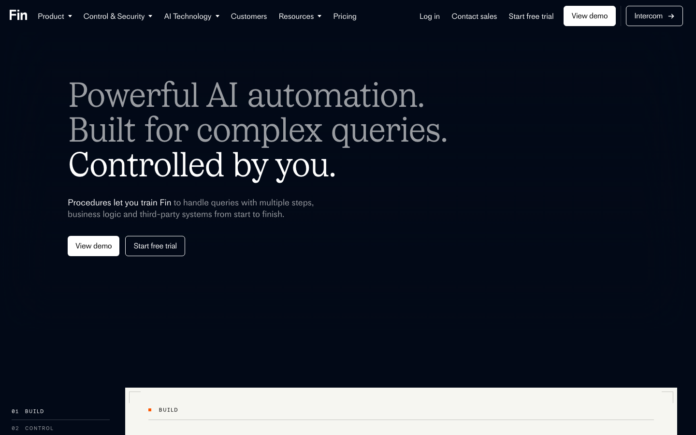

**观察：**

- ✅ 页面清晰揭示了核心能力：Procedures 是一套让 Fin（AI 客服 agent）端到端处理"多步骤 + 业务逻辑 + 第三方系统"复杂查询的工作流，并用 BUILD / CONTROL / TEST 三段式说明了"搭建—管控—验证"的完整生命周期，读者能快速理解"这个产品能替我自动化复杂客服流程"。
- ✅ 功能机制描述具体：BUILD 段说明输入是"流程大纲 + 已有内容 + 客户对话"，输出是 Fin 自动起草、用户再精修的 Procedure，且强调"流程是线性的、但对话不是"——Fin 能跳步、改写、在多个 Procedure 间切换，把"确定性脚本"和"agent 灵活推理"的关系交代清楚了。
- P2** 「no engineering required」与「use code to enforce rules」存在功能口径冲突：BUILD 段承诺支持团队无需工程/自定义开发即可创建，CONTROL 段却说"use code to enforce rules like verifying eligibility, calculating dates"。页面未说明这段 code 由谁写、是内置封装函数还是需手写脚本——非技术用户读完无法判断自己能否独立完成 CONTROL 层配置。
- P2** 集成机制只给了名字没给边界：提到通过 Data Connectors 或 MCPs 连接 Stripe / Shopify / 内部系统，但未说明二者区别、支持哪些现成连接器、自建系统接入需要什么前置条件，也未说明"control exactly what data it can access"具体是字段级还是接口级权限——想做集成评估的读者拿不到关键信息。
- P3** TEST（Simulations）段落在节选处被截断，仅说明可模拟完整对话、验证性能、发现边缘案例、捕捉回归，但未交代模拟数据来源、是否能基于真实历史对话回放、以及如何量化"通过/不通过"的判定标准——验证能力的可信度细节缺失。

#### E5: 探索: Learn more

**URL:** https://fin.ai/testing

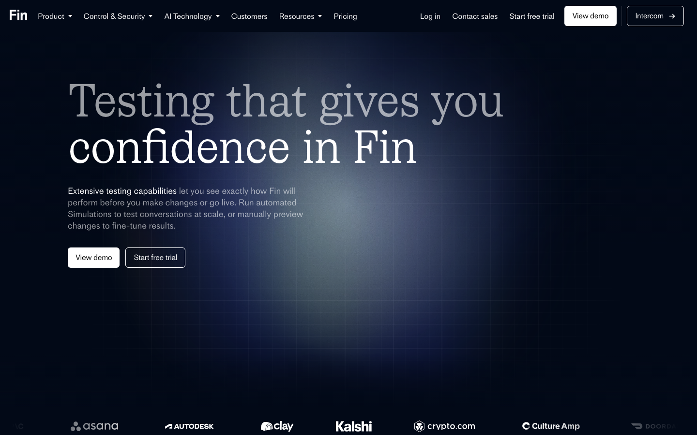

**观察：**

- ✅ 页面清晰揭示了 Fin 的**测试/QA 工作流**：分两条互补路径——自动化 **Simulations**（端到端模拟整段客户对话，规模化回归）+ 手动 **Previews**（边训练边即时预览，做点检和微调），覆盖了"上线前验证"和"上线后回归"两个典型场景，用户能理解"这个产品帮我在改动 Fin 前后建立信心"。
- ✅ 功能细节有亮点：**AI 辅助写测试**（自动生成新测试、修复失败用例、按反馈迭代）降低了测试编写门槛；**Previews 的用户/品牌 impersonation** 能验证 Fin 对不同受众的差异化回答；**event log 侧栏**展示 Fin 的推理过程和引用来源，对调试可解释性很有价值。
- P1** 未说明 Simulations 的**通过/失败判定机制**：页面反复提到"see where it passes or fails""confidence Fin will handle every scenario as expected",但完全没讲判定标准从何而来——是人工设定预期答案、AI 自动评分、还是基于规则断言？这是测试类产品最核心的功能点,缺失会让人无法判断结果是否可信。
- P2** **测试输入来源不清**：模拟对话从哪来？是基于真实历史工单/对话日志生成,还是纯手工编写场景?是否能导入现有 conversation 数据批量生成测试集?这直接决定测试覆盖的真实性和搭建成本,页面只说"AI 写测试"但没讲数据起点。
- P2** **规模与输出缺乏量化**："test at scale""run conversations from start to finish"没有任何量级说明(一次能跑多少条、耗时多久、是否消耗额度),且未交代 Simulations 跑完后产出什么——是否有覆盖率报告、失败用例汇总、版本对比 diff,这些输出形态对评估回归测试实用性很关键。

#### E6: 探索: Learn more

**URL:** https://fin.ai/channels

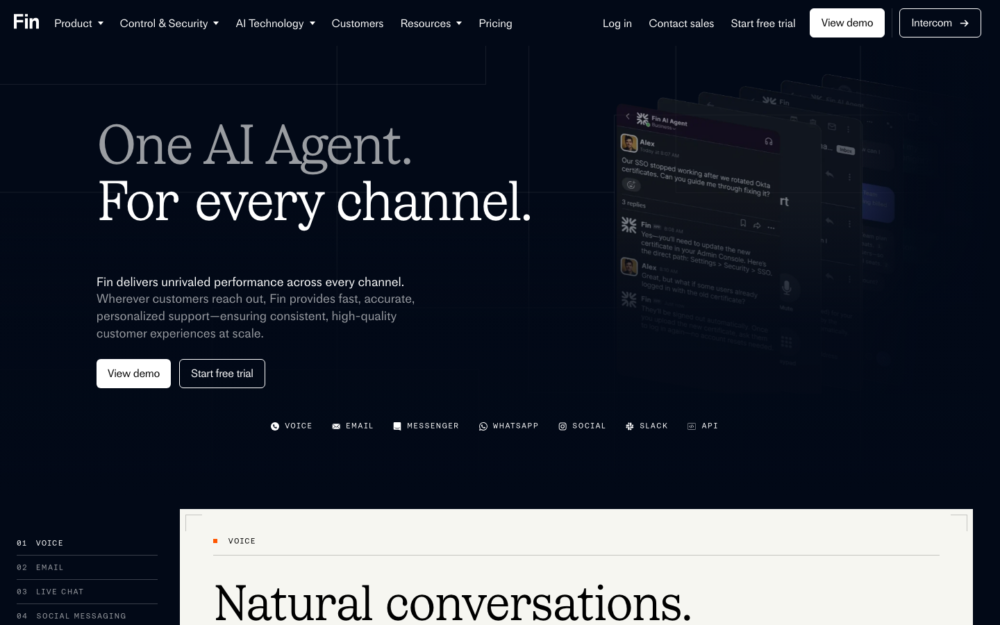

**观察：**

- ✅ 页面清晰揭示了 Fin 的核心定位：**一个统一的 AI Agent 横跨 7 个渠道**（Voice / Email / Live Chat / Social / WhatsApp / Slack / API），而非每个渠道各自独立的机器人——"One AI Agent for every channel" 把"同一套能力、同一知识、跨渠道一致体验"这个产品差异点讲明白了，用户能理解它解决的是"多渠道支持质量不一致 / 重复搭建"的问题。
- ✅ Voice 能力的功能描述具体且有场景感：明确说明 Fin Voice **替代 IVR 菜单和长时等待**、能"处理打断 / 上下文跟进 / 共情对话"，并支持**自定义语音、问候语、可用时间、升级路径**——输入（来电）、工作机制（自然对话+转人工）、可配置项都交代得比较清楚，读者能想象典型电话客服场景如何被接管。
- P1 **关键功能缺口：未说明 Fin 的知识来源与准确性机制**。整页反复强调"accurate / 高质量 / 可信回答"，却没说 Fin 的答案从哪来（知识库?帮助中心?文档?CRM 工单数据?如何训练/更新?）。对一个 AI Agent 而言"它怎么知道正确答案"是最核心的功能问题，页面完全没触及。
- P2 **集成信息笼统，缺少清单**。Voice 说"connects to your existing telephony infrastructure / integrates with your telephony system"，但没列出支持哪些电话系统（如 Twilio、Aircall、Genesys 等）；Email 也未说明对接何种邮件/工单系统。用户无法判断"能否接入我现有的栈"，这是采购前的硬性功能判断点。
- P2 **"升级到人工 / escalation" 的工作流没说清**。Voice 提到"define escalation paths"、Email 提到"thoughtful follow-ups"，但 AI 何时判定该转人工、如何把上下文交接给人工坐席、转接后体验如何衔接——这套人机协作机制未展开，而它直接决定产品在复杂场景下的可用性。

#### E7: 探索: Learn more

**URL:** https://fin.ai/analyze

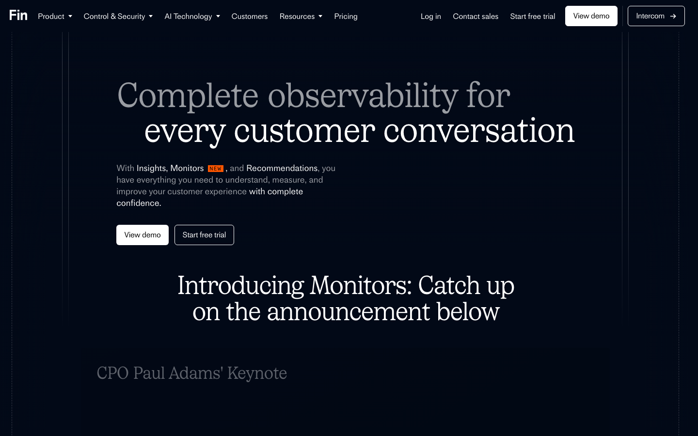

**观察：**

- ✅ 揭示了清晰的三模块产品架构（Insights / Monitors / Recommendations）**：页面把产品能力拆成"理解（Insights 持续分析每一通 Fin 与人工对话）→ 测量与管控（Monitors 按你设定的标准持续评估对话质量）→ 改进（Recommendations）"的闭环工作流，用户能快速建立"这是一个覆盖客服对话全生命周期的可观测性平台"的认知。
- ✅ CX Score 的核心机制说明到位**：明确说它是 AI 驱动的指标，自动评估**100% 对话**的客户情绪、**无需问卷调查**——这直接点出了它解决的具体问题（传统 CSAT/NPS 抽样率低、依赖用户主动填表），输入（每通对话）和输出（情绪分数）也交代清楚，是本页功能介绍最有力的一处。
- P2 关键指标定义缺失，影响"它能为我做什么"的判断**：页面反复强调 Performance Dashboard 是"唯一同时展示 Automation rate 和 CX Score 的看板"，但**未解释 Automation rate 如何计算、CX Score 的分值区间/评分维度是什么**。用户读完知道有这两个指标，却无法判断分数高低意味着什么、能否对标自身目标。
- P2 Monitors（主打新功能）的核心工作机制被截断未说明**："continuously watch and evaluate quality against your standards"中的"your standards"是如何配置的（规则？打分卡？自定义阈值？）、触发后输出什么（告警？报告？）、"Combine pre…"处文本中断——这正是新功能最需要讲清的输入/输出与配置方式，缺失会让用户无法判断它与 Insights 的区别和实际可操作性。
- P3 功能与套餐、数据接入的衔接未交代**：页面未说明这些分析能力覆盖哪些渠道（仅 Intercom 自有对话，还是可接入外部工单/CRM？）、是否所有套餐都包含 Monitors，以及 Trends 的"weekly report"能否自定义周期或推送方式——属于想了解但页面未触及的功能边界信息。


### ⚠️ 未找到的测点（2 个测点）

**该模块覆盖页面**:

- `https://fin.ai/`

#### S5: Case studies / Testimonials

**URL:** https://fin.ai/
**观察：**

- [Link not found] 该模板期望的链接（case stud|testimonials|stories|案例|客户故事）在 https://fin.ai/ 上未找到 — 可能产品用了不同的措辞或这个功能不存在。 已跳过截图与 LLM 解读以避免重复首页快照。

#### S9: API / Developer docs

**URL:** https://fin.ai/
**观察：**

- [Link not found] 该模板期望的链接（api|developer|docs.|开发者）在 https://fin.ai/ 上未找到 — 可能产品用了不同的措辞或这个功能不存在。 已跳过截图与 LLM 解读以避免重复首页快照。


---

## 4. 第三方社区反馈

I have enough verified third-party signal across Hacker News, G2, Trustpilot, and Reddit (the latter surfaced via secondary pricing analyses, since Reddit isn't directly retrievable by the search crawler). Writing the section now.

#### 4.1 调研范围与方法

本节聚焦实体 **fin.ai**（Intercom 旗下 AI 客服 agent「Fin」，公司已于 2026 年 5 月将主品牌更名为 Fin）。在 Reddit、Hacker News、Product Hunt、G2、Trustpilot、Gartner Peer Insights 等平台以域名 + 产品概念锚定检索，时间范围覆盖 2025 年至 2026 年 5 月。命中情况：

- **Hacker News**：更名事件引发集中讨论，至少 2 个热帖（[id=48128842](https://news.ycombinator.com/item?id=48128842)、[id=48129488](https://news.ycombinator.com/item?id=48129488)），含数十条带署名评论 —— 这是本节信号最强、可逐条溯源的来源。
- **G2**：[Fin by Intercom 评价页](https://www.g2.com/products/fin-by-intercom/reviews) 累计 2,900+ 条评价。
- **Trustpilot**：[intercom.io 评价页](https://www.trustpilot.com/review/intercom.io) 约 146–512 条评价，综合评分约 3.9 / 5。
- **Gartner Peer Insights**：存在 [Fin AI Agent 评价页](https://www.gartner.com/reviews/product/fin-ai-agent)（页面访问受限，未取得逐条原文）。
- **Reddit**：直接抓取受爬虫限制无法取得帖子 URL；下文引用的 r/SaaS 讨论经第三方定价分析转述，已明确标注其二手性质。
- **Product Hunt**：未检索到 Fin / Intercom 的有效用户讨论页。

#### 4.2 核心议题（按讨论热度）

| 议题 | 讨论方向 | 出现频次 | 主要来源平台 |
|---|---|---|---|
| 定价模式（$0.99/解决数、按结果计费）成本失控 | 负面 | 高 | Reddit / G2 / Trustpilot |
| 计费争议：人工接手后仍被计为一次「resolution」 | 负面 | 中 | Reddit / Intercom 社区 |
| 解决质量高度依赖知识库、边缘问题答非所问 | 中性偏负 | 中高 | G2 / Trustpilot |
| 转人工升级慢、复杂场景兜底差 | 负面 | 中 | Trustpilot |
| Intercom→Fin 品牌重塑是否明智 / 是否 VC 驱动 | 负面 / 中性 | 中（集中爆发） | Hacker News |
| 处理重复性咨询、24/7 自动化降低工单量 | 正面 | 高 | G2 / Trustpilot |

#### 4.3 正面评价 / 用户喜欢的点

- **来源**: [Fin by Intercom Reviews（G2，2,900+ 条）](https://www.g2.com/products/fin-by-intercom/reviews) — `G2 认证评价者（角色未公开）`，日期未标注
  - **原话引用**:
    > 「The biggest challenge it addresses is dealing with a high volume of repetitive customer questions... Fin can handle those instantly, translating into fewer tickets for the team and less manual effort.」
  - **关键词**: 重复性咨询、即时应答、工单量下降

- **来源**: [Fin by Intercom Reviews（G2）](https://www.g2.com/products/fin-by-intercom/reviews) — `G2 认证评价者（角色未公开）`，日期未标注
  - **原话引用**:
    > 「Traditional support teams can't realistically be online 24/7, but Fin can, so customers get immediate answers at any time.」
  - **关键词**: 7×24 可用、即时响应、体验提升

- **来源**: [Fin Reviews（Trustpilot，约 3.9/5）](https://www.trustpilot.com/review/intercom.io) — `Trustpilot 评价者`，日期未标注
  - **原话引用**:
    > 「the product is top notch and support by team members is great」
  - **关键词**: 产品成熟、团队支持到位

> 说明：G2 / Trustpilot 评价页为聚合页面，单条评价的用户名与日期未在可抓取内容中公开，故此处不杜撰，仅保留平台、评分与原话。

#### 4.4 负面 / 批评 / 担忧

- **来源**: [Intercom changes name to Fin（Hacker News）](https://news.ycombinator.com/item?id=48128842) — `danpalmer`, 约 2026 年 5 月中旬
  - **原话引用**:
    > 质疑放弃 2010–2020 年代积累的「Intercom」品牌心智、改叫「Fin」是否得不偿失，担心造成品牌认知混乱。
  - **关键词**: 品牌重塑、心智流失、认知混乱

- **来源**: [Fin/Intercom "Fin is defining the AI era…"（Hacker News）](https://news.ycombinator.com/item?id=48129488) — `gassi`, 约 2026 年 5 月中旬
  - **原话引用**:
    > 「Ran out of VC money now that only AI companies get funding」（讥讽更名/全面 AI 化更像是为了迎合「只有 AI 公司才拿得到融资」的资本环境）
  - **关键词**: VC 驱动、AI 包装、动机存疑

- **来源**: [Intercom changes name to Fin（Hacker News）](https://news.ycombinator.com/item?id=48128842) — `amanzi`, 约 2026 年 5 月中旬
  - **原话引用**:
    > 「Where are the companies that are proudly promoting 'human powered' customer support?」（反问：当所有厂商都在喊 AI，谁还敢标榜「由真人提供支持」？）
  - **关键词**: 全员喊 AI、真人支持缺位、行业同质化

- **来源**: r/SaaS 讨论（作者 `u/AnkitatTripock`），经第三方定价分析转述于 [Intercom Pricing Explained（Kommunicate）](https://www.kommunicate.io/blog/intercom-pricing-breakdown/)
  - **原话引用**:
    > 该帖称：40 名坐席原本月付 $4k+，启用 Fin 后账单涨到约 $9k/月，却未见明显生产力提升。社区共识被概括为「爱产品、恨账单」（"people love the product, but they loathe the bill"）。
  - **关键词**: 成本翻倍、按结果计费、ROI 存疑
  - **⚠️ 注**: Reddit 原帖直链受爬虫限制未能取得，此条为二手转述，可信度低于上方 HN 直链，列出仅供交叉参考。

- **来源**: [Fin by Intercom Reviews（G2）](https://www.g2.com/products/fin-by-intercom/reviews) + [Trustpilot](https://www.trustpilot.com/review/intercom.io) — 多名评价者
  - **原话引用**:
    > G2：「the accuracy of responses heavily depends on the quality and structure of the knowledge base... the AI may provide incomplete or slightly off responses, especially for more complex or edge-case queries.」
    > Trustpilot 侧反馈则集中在「转人工升级慢」与「计费方式」上的不满。
  - **关键词**: 依赖知识库、边缘问题答非所问、转人工慢、计费争议

#### 4.5 与官方说法的差异

官网（见 §3.1）把 Fin 定位为「The #1 AI Agent for customer service」「best-performing」，强调「industry-high resolutions with industry-low hallucinations」，并把 $0.99/outcome 包装为「you only pay for the value it delivers」——即一套**自信、价值导向、行业标杆**的叙事。第三方社区在两个维度上与之形成明显反差：

- **定价：官方说「只为价值付费」，社区说「为账单焦虑」。** 官网把按结果计费讲成用户的好处，但社区里讨论热度最高的恰恰是它带来的成本不可预测——账单随 Fin「越做越好」而越涨、甚至人工接手仍被计费、坐席数没涨但费用翻倍。官方的「value」框架与用户实际感受到的「pricing anxiety」直接相左。
- **质量：官方说「行业最高解决率 + 极低幻觉」,社区说「看知识库脸色、边缘问题会翻车」。** G2/Trustpilot 用户的体验更克制：擅长重复性、标准化问题，但准确度高度依赖知识库维护质量,复杂/边缘场景会给出不完整或略偏的回答,且转人工升级偏慢。这与「industry-low hallucinations」的绝对化宣传存在落差。
- **一致之处**: 在「处理高频重复咨询、7×24 即时应答、降低工单量」这一核心价值上,官方主张与社区正面反馈是吻合的——这部分能力得到真实用户背书。
- **额外信号（官网未触及）**: Intercom→Fin 的品牌重塑在 HN 上引发的不是欢呼而是质疑（心智流失、VC 驱动、行业同质化），官方「defining the AI era」的姿态与开发者社区的冷静/讥讽形成对照。

#### ⚠️ 信息来源声明

本节所有内容来自**非官方的第三方平台**（Hacker News / G2 / Trustpilot / Reddit 转述等）。内容可能带有主观偏见、过时信息或个别用户的极端观点；其中 Reddit 条目为二手转述、Gartner 与部分评价页未能取得逐条原文。决策时建议结合公司官方信息（§2.5）+ 实测观察（§3）综合判断。

---

## 5. 从访客到注册的转化路径

#### 转化路径示意

```
第 1 步：通过内容营销 / 落地页接触品牌
    ↓ 关键触点：/learn 下的 KPI 方法论长文（"The Definitive KPI Framework for
      Measuring AI Agent Performance, 2026"），署名 "INSIGHTS FROM FIN TEAM"，
      正文引用 Microsoft Dynamics 365、Google Cloud AI 团队背书 [B3]

第 2 步：理解 Fin 是什么 + 判断能否接进自己的工单系统
    ↓ 关键触点：Overview 合集（12 篇）[B1]、"Fin for Zendesk 上手指南" [B2]、
      定价页顶部的两种部署形态说明 [C2]

第 3 步：对比定价 / 估算成本
    ↓ 关键触点：定价页 "$0.99 PER OUTCOME / 50 OUTCOMES PER MONTH MINIMUM" +
      "现有 helpdesk" vs "Fin + Intercom" 两条价格线 + Pro / Copilot 两个 add-on [C2]

第 4 步：选择入口并完成转化（预约演示 / 自助开始）
    ↓ 关键触点：（推断）定价页与导航上的 CTA；上手指南的存在暗示存在自助配置入口 [B2][C2]
    ——停在此处，进入产品后不再分析——
```

> 说明：本次可用的公开页面仅 1 个定价页（C2）信息较完整，另 3 个为背景/内容页（B1 无内容、B2 仅有标题、B3 为方法论文章）。**我没有直接观察到落地首页、注册页、预约演示页本身**，因此第 1、4 步带较多推断成分，下面会逐条标注。

---

#### 各步骤详解

**第 1 步：通过内容营销 / 落地页接触品牌**
- 页面写了什么：存在一篇高质量、有明确观点的 KPI 方法论长文，主张"传统客服指标对 AI agent 已失效"，并定义了 Resolution rate（行业基准 55–70%、头部 >80%，称为"最重要的运营 KPI"）、Deflection rate、Reopen rate；引用 Microsoft、Google Cloud 背书 [B3]。
- 我的推断：Fin 把相当一部分获客押在**内容/SEO + 思想领导力**上——先用"如何衡量 AI agent"的专业框架建立权威，再把读者引向产品。访客的第一印象更可能是"这家懂 AI 客服"，而不是"这是一个具体工具"。
- 可能流失的原因：文章**通篇不定义 Fin 是什么、能做什么** [B3]。从内容进来的访客读完只拿到方法论，缺少"所以这个产品就是答案"的衔接钩子，容易读完就走、不进入下一步。

**第 2 步：理解 Fin 是什么 + 判断能否接进自己的工单系统**
- 页面写了什么：定价页顶部明确给出两种部署形态——①"Fin with your current helpdesk"（作为独立 agent 叠加在现有 Salesforce / HubSpot 等系统上）；②"Fin and Intercom"（Fin + Intercom 自有 Inbox/Ticketing 全平台捆绑）[C2]；另有 Overview 合集 [B1] 与"Fin for Zendesk 上手指南" [B2]。
- 我的推断："不用换掉你现有的工单系统"是这一步的核心说服点——降低替换成本与迁移恐惧。专门的 Zendesk 上手指南 [B2] 暗示官方对主流 helpdesk 做了**预置接入**，也暗示存在**自助配置**的可能路径，而非纯销售交付。
- 可能流失的原因：关键差异化能力"**Takes action to update external systems**（回写外部系统）"缺工作机制说明 [C2]——不说通过 API/连接器/自定义流程实现、支持哪些系统、要不要工程接入。技术评估型访客无法确认"它能不能动我的系统"，评估到这里会卡住。

**第 3 步：对比定价 / 估算成本**
- 页面写了什么：核心计量为 "$0.99 PER OUTCOME"，"50 OUTCOMES PER MONTH MINIMUM"；两条价格线——纯 AI（$0.99/outcome）vs Fin+Intercom（$0.99/outcome + $29/seat）；两个 add-on：Pro（CX Score、AI Topics、Trends、Monitors 等，按 1,000 conversations/月计费）与 Copilot（坐席 inbox 内个人 AI 助手）[C2]。
- 我的推断：定价**结构**本身做得很清晰——它让访客先做一道"只买 AI，还是买整套客服平台"的二选一自检，再叠加分析(Pro)/坐席辅助(Copilot)的升级。这是把采购决策拆成可判断的几步，意图很明确。
- 可能流失的原因：**"outcome"全程未定义** [C2]——是一次成功 resolution、一次问答、还是一次工单关闭？转人工算不算？由谁判定？这直接决定真实花费。访客最多只能算出"≥50×$0.99 ≈ 月底价 + 可能的 $29/seat + add-on"的**地板价**，却估不出真实账单。在最需要确定性的付费决策点上给了最大的不确定性,这是定价页最可能流失的地方。

**第 4 步：选择入口并完成转化（预约演示 / 自助开始）**
- 页面写了什么：（可用测点中**无**对注册页/预约演示页本身的直接观察。）能依据的是：存在明确的套餐结构 [C2] 与自助上手指南 [B2]。
- 我的推断：Fin 大概率走**混合入口**——面向"叠加现有 helpdesk + 自助配置"的偏自助/直接开始；面向"Fin+Intercom 全平台 + 多席位 + 企业"的偏"预约演示/联系销售"。outcome 计费 + $29/seat + B3 中明显的企业叙事，都指向有一条销售辅助通道。
- 可能流失的原因：若"开始试用"与"预约演示"两个 CTA 并存却不告诉访客各自意味着什么（多久能用上、要不要排期、要不要先聊），决策型访客会因为"不知道点哪个、点了之后会怎样"而推迟——这是 B2B 常见的入口选择犹豫。（此条为推断）

---

#### 转化设计观察

- **入口设计**：可观察证据只支持"存在自助上手路径"（Zendesk getting-started 指南 [B2]）与"清晰的套餐自选结构"（[C2] 两条价格线 + add-on）。**推断**为预约演示 + 自助并行的混合入口：轻量/接现有 helpdesk → 偏自助；全平台/多席位/企业 → 偏预约演示。纯按 outcome 的低承诺计费，理论上有利于做"先开始、再付费"的低门槛自助入口。

- **价格预期**：访客读完定价页**只能锚定一个地板价**——50 × $0.99 ≈ 约 $49.5/月起的用量底，若选 Fin+Intercom 再叠 $29/seat，要分析/质检再叠 Pro（按 1,000 conversations/月）[C2]。但因"outcome 未定义",他无法把地板价换算成"我这点工单量一个月到底花多少",真实预期是**模糊且偏向高估风险**的。

- **公开承诺**：官网话术承诺的"用了之后会发生什么"集中在三点——①**只为结果付费**（$0.99 per outcome，把成本和效果绑定）[C2]；②**不换系统就能上**（叠加在你现有的 Salesforce/HubSpot/Zendesk 上，且能回写外部系统）[C2][B2]；③**高解决率、可证明 ROI、可放心交给 AI**（来自 B3 的解决率叙事与"证明 ROI / 放心部署"框架）[B3]。注意：B3 倡导用解决率衡量 AI agent，却**未披露 Fin 自家的解决率数据**,属于"承诺方向但不给自证数字"。

---

#### 转化设计的强弱（仅公开页面）

- ✅ **Outcome-based 定价是强力去风险钩子**：$0.99/outcome、"只为结果付费"，天然适合做低承诺的试用/开始入口，降低 B2B 访客"先掏钱再看效果"的抵触 [C2]。
- ✅ **"叠加现有 helpdesk + 专门上手指南"显著降低迁移恐惧**：明确说不用替换 Salesforce/HubSpot/Zendesk，并提供 Zendesk getting-started 指南，缩短"评估—接入"心理距离 [C2][B2]。
- ✅ **思想领导力内容建立专业权威**：KPI 框架长文 + Microsoft/Google 背书，让"这家懂 AI 客服"在转化前就立住 [B3]。
- ⚠️ **"outcome"未定义是定价页最大的转化漏点**：整页围绕它计费却不解释含义，访客算不出真实账单，在付费决策点制造最大不确定性 [C2]。
- ⚠️ **内容入口与产品之间断层**：方法论文章不说 Fin 是什么 [B3]，从 /learn 进来的访客缺少"产品即答案"的衔接，第 1→2 步转化损耗偏高。
- ⚠️ **核心差异化能力"回写外部系统"只给结论不给机制** [C2]：技术评估型买家无法确认可行性，评估期容易卡死或外流。
