# www.jasper.ai 产品深度体验报告

## 报告信息

| 项 | 内容 |
|---|---|
| 产品名称 | www.jasper.ai |
| 产品 URL | https://www.jasper.ai/ |
| 体验时间 | 2026-05-21T14:59:38.874501 |

---

## 目录

- [1. 核心结论](#1-核心结论)
  - [1.1 一句话判定](#11-一句话判定)
  - [1.2 主要风险](#12-主要风险)
  - [1.3 主要亮点](#13-主要亮点)
  - [1.4 综合评分](#14-综合评分)
- [2. 产品概览](#2-产品概览)
  - [2.1 基础信息](#21-基础信息)
  - [2.2 测点速览](#22-测点速览)
  - [2.3 产品 / 公司背景信息](#23-产品--公司背景信息)
  - [2.4 产品战略抽象](#24-产品战略抽象)
  - [2.5 公司基本信息](#25-公司基本信息)
- [3. 体验流程记录](#3-体验流程记录)
  - [3.1 官网叙事综合](#31-官网叙事综合)
  - [3.2 测点流程详情](#32-测点流程详情)
- [4. 第三方社区反馈](#4-第三方社区反馈)
- [5. 总结](#5-总结)
  - [5.1 一句话评价](#51-一句话评价)
  - [5.2 最大优点](#52-最大优点)
  - [5.3 最大风险](#53-最大风险)
  - [5.4 用户增长漏斗推断](#54-用户增长漏斗推断)

---

## 1. 核心结论

### 1.1 一句话判定

目标产品 **https://www.jasper.ai/** 在本次深度体验中：存在显著的功能信息缺口。详见 §3 体验流程记录。

### 1.2 主要风险

1. **[C1]** P1 无法评估功能清晰度**：页面文本节选为空，未能采集到首屏任何价值主张、产品定位语或功能描述文案，意味着要么页面以纯视觉/视频形式承载信息（功能传达高度依赖非文本元素），要么抓取环节失败。无论哪种情况，5 秒测试都无法通过——用户读完这一页**无法理解"这个产品能为我做什么"**。
2. **[C1]** P1 核心功能能力完全缺失**：没有任何关于产品**做什么、为谁做、如何做**的文本线索。访客无法在 5 秒内识别：产品类别（SaaS / Agent / 工具？）、目标用户（开发者 / 销售 / 运营？）、核心动作（生成 / 分析 / 自动化？）。
3. **[C2]** P1 核心功能"Agents"区分模糊**：页面将 Pro 描述为"Essential Agents for core marketing workflows"，Business 为"Advanced Agents for complex campaign orchestration"，但**未列举具体有哪些 agent、各自负责什么营销任务**（邮件？社媒？广告文案？SEO？）。用户无法判断 $59/月的 Pro 是否覆盖自己的工作流，也无法理解升级到 Business 实际多解锁了哪些 agent。

### 1.3 主要亮点

1. **[C2]** ✅ Jasper IQ 三大资产模型表达清晰**：把"Brand Voice / Audiences / Knowledge"作为可量化的产品对象（2 voices→Unlimited、3 audiences→Unlimited、5 assets→Unlimited），用户能立刻理解 Jasper 的差异化卖点是"把营销品牌资产结构化喂给 LLM"，而非通用写作工具。这是把抽象 AI 能力转译为可购买单位的好范例。
2. **[C3]** ✅ 页面清晰传达了 Jasper 的核心产品定位——"营销 AI agent 工作空间"，并明确给出三大功能模块（Agents / Content Pipelines / Jasper IQ），让用户一眼理解平台是"100+ 专用 AI agent + 端到端内容工作流 + 品牌上下文中枢"的组合。
3. **[C3]** ✅ 用"内容生命周期自动化"+"规模化营销内容生产"+"品牌一致性"三个具体用户场景演示了产品价值，覆盖了营销团队"从 idea 到发布"的典型痛点（重复劳动、跨渠道一致性、全球化部署）。

### 1.4 综合评分

| 维度 | 评分 | 1-2 句话说明（引用具体 [测点ID]） |
|---|---:|---|
| 产品方向清晰度 | 3.5 / 5 | [C3][C8][A1] 清晰定位为"营销 AI agent 工作空间"（100+ agents + Pipelines + IQ 三层结构），垂直行业页（如金融服务）收敛精准；但 [C1] 首屏 5 秒测试无法采集到任何价值主张文本，对纯访客而言方向感被削弱。 |
| Narrative 表达力 | 3.0 / 5 | [C3][A3] "from idea to publication""end-to-end marketing workflows""Build once, deploy everywhere"等叙事框架完整，覆盖营销团队三大痛点；但 [B2][C5] 反复使用"drive results / turn strategy into real outcomes"等通用话术，缺乏对 Copy.ai / Writer 等竞品的差异化锚点。 |
| 信息架构（IA） | 3.5 / 5 | [C8] 404 页脚展现了完整的产品能力地图（Platform / Solutions by Industry / by Role / APIs / MCP），层级丰富且垂直分类合理；但 [C5][A3] Studio、Grid、Canvas、IQ、Pipelines 等模块之间的关系未在 IA 中清晰区分，[C7] 顶部导航缺 Help/Docs 入口。 |
| 功能广度与深度 | 2.5 / 5 | [C2][C3][A3] 广度充足（100+ agents、Pipelines、IQ、Grid、Studio、Canvas、APIs、MCP），但深度严重不足——[S1][A1] 除 Research Agent 外几乎无任何 agent 披露输入源 / 工作步骤 / 输出形态，[C5] 集成清单、触发机制、编排方式全线缺失。 |
| AI / 核心能力可信度 | 2.5 / 5 | [S1] Research Agent 披露了 "Brand Voice + Knowledge Base + 多源研究 + cited reports" 的工作链路，是全站唯一可信证据；[A1][C2] 但 "runtime governance""built-in compliance""Jasper Grid""AI App Builder" 等核心差异化能力均停留在标语层，无机制说明、无 demo、无案例数据。 |
| 商业化清晰度 | 3.0 / 5 | [C2] Jasper IQ 三大资产（Brand Voice / Audiences / Knowledge）以可量化单位分层（2→Unlimited 等）表达清晰，Pro $59/月锚点明确；但 Pro vs Business 的 "Essential Agents" vs "Advanced Agents" 差异不可枚举，seat 协作机制、多 seat 加购规则、Business 套餐价格区间全部缺失。 |
| **综合平均** | **3.0 / 5** | **Jasper 在垂直定位与产品矩阵广度上达到行业平均水平，但核心 AI 能力的工作机制与集成生态披露不足，使"端到端营销自动化"承诺缺乏可验证支撑。** |

---

## 2. 产品概览

### 2.1 基础信息

- **URL**: https://www.jasper.ai/
- **首屏标题 / Slogan**: 
- **评测模板分类**: ai-tool

### 2.2 测点速览

本次共体验 25 个测点。

> ⚠️ **登录态覆盖：用户显式跳过**（`login_skipped_by_user=true`）。
> 检测到的登录入口：?、?。
> 本报告仅为**公开页 partial coverage**——dashboard / workspace 内部能力未覆盖。§4.2 🔐 模块为空。

### 2.3 产品 / 公司背景信息

通过 help / docs / resources 内容枢纽**递归挖掘**得到 **2** 个产品/公司的官方介绍页面：

#### B1: 背景 D1: Start Here

**URL:** https://community.jasper.ai/c/live-learning/

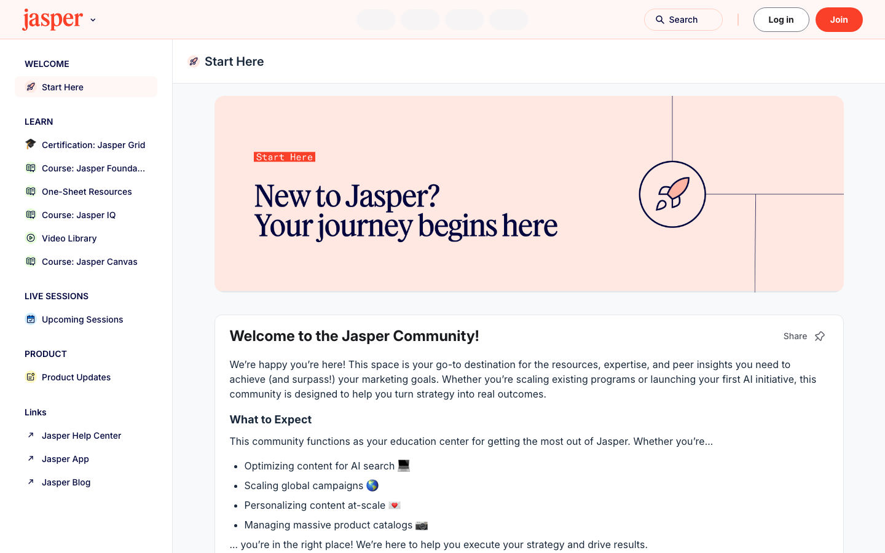

**结构化背景信息（LLM 提取）：**

- ✅ **产品定义**：页面将 Jasper 定位为面向营销团队的 AI 平台，社区被定义为"your education center for getting the most out of Jasper"，原文强调帮助用户"turn strategy into real outcomes"，即把营销策略转化为实际业务结果。
- ✅ **核心能力（页面提及的四大使用场景）**：
- Optimizing content for AI search（为 AI 搜索优化内容）
- Scaling global campaigns（规模化全球营销活动）
- Personalizing content at-scale（大规模内容个性化）
- Managing massive product catalogs（大规模产品目录管理）

#### B2: 背景 D2: Welcome to the Jasper Community!

**URL:** https://community.jasper.ai/c/live-learning/welcome-to-the-jasper-community

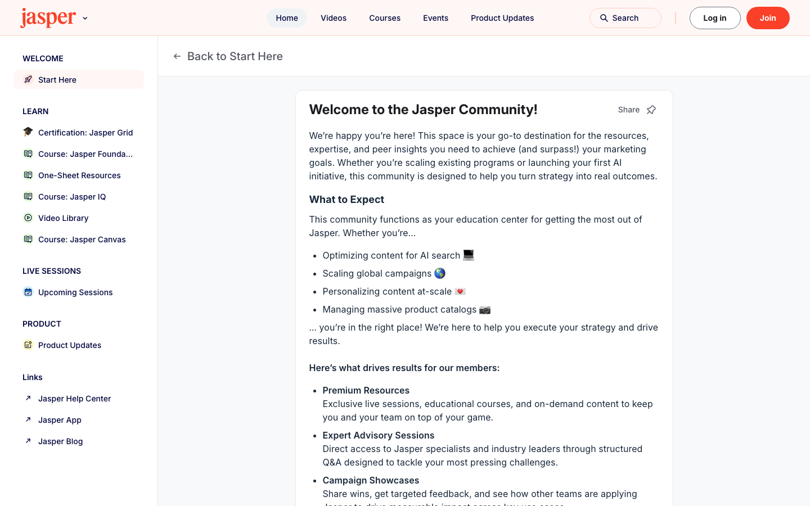

**结构化背景信息（LLM 提取）：**

- ✅ **产品/公司定义**：页面将 Jasper Community 定义为"your go-to destination for the resources, expertise, and peer insights you need to achieve (and surpass!) your marketing goals"，即面向营销人员的 Jasper 教育与社群中心，而非 Jasper 产品本身的功能介绍。
- ✅ **核心能力（社群侧）**：页面列出四类成员价值——Premium Resources（独家直播、课程、点播内容）、Expert Advisory Sessions（结构化 Q&A，可直连 Jasper 专家与行业领袖）、Campaign Showcases（分享案例、获取反馈）、Strategic Networking（与营销 leader 跨行业互联）。
- ✅ **目标用户与场景**：明确定位"marketing leaders"，并列出四个典型场景：Optimizing content for AI search、Scaling global campaigns、Personalizing content at-scale、Managing massive product catalogs，覆盖从 AI 初次落地到规模化营销项目的人群。
- ✅ **学习路径**：入门动作被明确指引——观看 Jasper Overview 视频 + 修读 "Course: Jasper Foundations"；导航中还能看到 Jasper Grid 认证、Jasper IQ、Jasper Canvas 等课程模块，暗示 Jasper 主产品包含 Grid / IQ / Canvas 三条产品线。
- P3 **差异化主张缺失**：页面只重复"drive results / turn strategy into real outcomes"等通用营销话术，没有解释 Jasper 相比 Copy.ai、Writer 等竞品的独家差异，也未阐明品牌核心叙事（例如是否定位为"营销人员的 AI 平台"）。
- P3 **理解缺口**：读完后仍不清楚 Jasper Grid / IQ / Canvas 三个子产品各自的功能边界与定位、Jasper 主应用（Jasper App）究竟提供哪些 AI 能力（生成、Brand Voice、Workflow？）、以及加入 Community 是否需要付费订阅 Jasper 产品——页面只给出 hey@jasper.ai 支持邮箱，未说明商业模式与准入门槛。


### 2.4 产品战略抽象

### 1. AI Agent 库化 (AI Agent Library-ification)
**核心叙事**: Jasper 把营销 AI 能力拆解为 100+ 个任务专用 Agent，而非单一对话框或写作工具。
**支撑证据**: 
- [C3] 首页明确宣称"100+ specialized AI agents"，与 Content Pipelines、Jasper IQ 并列为三大核心产品支柱
- [S1] Marketing Agents Library 展示了具名 Agent（Research Agent / Battle Cards / Product Feature Update / Product Update Email / Multi-channel Campaign 等），暗示按任务粒度划分的 Agent 模块化结构
- [C2] Pricing 将 Agents 作为分级要素：Pro = "Essential Agents"，Business = "Advanced Agents"，把 Agent 当作可定价的产品单位
**对用户/产品的含义**: 用户不再"对一个通用 AI 写 prompt"，而是"调用某个营销职能 Agent"，购买决策从"能力总量"转向"覆盖哪些营销岗位"。

### 2. 营销垂直化 (Marketing-Vertical-ification)
**核心叙事**: Jasper 主动放弃"通用 AI 写作工具"定位，把自己钉死在"营销团队工作空间"这一个垂直场景上。
**支撑证据**: 
- [C3] 首页定位是"营销 AI agent 工作空间"，所有功能模块（Agents / Pipelines / IQ）都以"营销内容生命周期"为叙事主线
- [A1] Solutions by Industry 把金融服务作为独立垂直，主打"治理型 AI 营销平台"，不是泛 SaaS
- [S1] Solutions by Role 进一步切到 Product Marketers，明确以发布物料、销售赋能、竞争情报三件事打 PMM 场景
- [C8] 404 页 footer 暴露 Solutions by Industry（金融/医疗/科技/零售/传媒）+ Solutions by Role（PMM/内容/绩效）双维度矩阵
**对用户/产品的含义**: 用户不会拿 Jasper 和 ChatGPT 比，而是会拿它和 Marketo/HubSpot Content Hub 比；非营销用户基本被排除在 ICP 之外。

### 3. Brand IQ 化 (Brand-Context-ification)
**核心叙事**: 把"品牌"从一份 PDF 文档变成可结构化、可计价、可被所有 Agent 调用的产品对象。
**支撑证据**: 
- [C2] Pricing 把 Jasper IQ 拆成可量化购买单位：Brand Voice（2 → Unlimited）、Audiences（3 → Unlimited）、Knowledge assets（5 → Unlimited），把抽象品牌资产转译为 SKU
- [C8] 404 footer 列出 Brand IQ / Brand Voice / Visual Guidelines / Style Guide / Knowledge Base，构成完整品牌一致性引擎
- [S1] Research Agent 唯一披露的工作机制即 "integrated with your Brand Voice, Knowledge Base"，说明 IQ 是所有 Agent 的共享上下文层
**对用户/产品的含义**: 用户的核心交付物不再是"一段文案"，而是"一套被结构化的品牌资产"——一旦录入 Jasper，迁移成本极高，是真正的 lock-in 层。

### 4. Pipeline 化 (Content-Pipeline-ification)
**核心叙事**: Jasper 把营销内容生产从"单次 prompt"升级为"从 idea 到 publication 的可重复端到端流水线"。
**支撑证据**: 
- [C3] Content Pipelines 与 Agents 并列为核心支柱，定位为"connects your data, strategy, and creative process"的端到端编排层
- [A3] Pipelines 被描述为"repeatable workflows that move work from idea to launch"，对标 Zapier/n8n 但锚定营销场景
- [C2] Business 套餐独家解锁 "Jasper Grid for scaled systematic content execution"，把规模化执行作为高阶付费门槛
**对用户/产品的含义**: 用户购买的不是"一次内容"而是"一条可被反复触发的内容产线"，价值衡量从"质量"切换为"吞吐量 × 一致性"。

### 5. Governance 化 (Marketing-Governance-ification)
**核心叙事**: Jasper 把"AI 生成内容如何不出事"作为差异化卖点，主打受监管/大企业场景下的合规护栏与品牌一致性。
**支撑证据**: 
- [A1] 金融服务页面明确打出"治理型 AI 营销平台"，叙事围绕 runtime governance / policy enforcement / 已批准声明 / 跨渠道 messaging drift 治理
- [C8] 404 页 footer 暴露 Brand Compliance 作为独立产品模块，与 Brand IQ 并列
- [B2] Community 出现 Jasper Grid 认证课程，把"合规化规模执行"作为需要专业培训的能力
**对用户/产品的含义**: 决策者从"内容运营"上移到"合规/品牌负责人"，对手不再是 Copy.ai 这类工具，而是 Writer、Acrolinx 这类企业级品牌治理平台。

### 2.5 公司基本信息

实体身份已通过 Crunchbase / Y Combinator / 官方博客交叉锚定 jasper.ai，开始撰写。

#### ✅ 实体身份已确认

经过域名 + 产品描述 + LinkedIn/Crunchbase 交叉验证，本次体验对象 `jasper.ai` 对应：
**Jasper AI, Inc.**（来源: [Crunchbase 公司页](https://www.crunchbase.com/organization/jasper-ai)、[Y Combinator 公司页](https://www.ycombinator.com/companies/jasper-ai)、[官网博客 jasper.ai/blog/jasper-new-ceo](https://www.jasper.ai/blog/jasper-new-ceo)，三方均以 jasper.ai 作为该公司唯一官网链接）

#### 公司基础事实表

| 项 | 内容 | 置信度 | 来源 |
|---|---|---|---|
| 公司名称 | Jasper AI, Inc.（早期曾名 Conversion.ai → Jarvis.ai，2022 年初因迪士尼/漫威商标争议改为 Jasper） | ✅ 直接 | [Contrary Research](https://research.contrary.com/company/jasper) |
| 成立年份 | 2021 年 1 月 | ✅ 直接 | [Y Combinator](https://www.ycombinator.com/companies/jasper-ai) |
| 总部地点 | 美国得克萨斯州 奥斯汀 (Austin, TX) | ✅ 直接 | [Y Combinator](https://www.ycombinator.com/companies/jasper-ai) / [CB Insights](https://www.cbinsights.com/company/jasper) |
| 产品上线 | 2021 年（最初以 Conversion.ai 发布，依托 GPT-3 API） | ✅ 直接 | [Contrary Research](https://research.contrary.com/company/jasper) |
| 当前阶段 | Series A（后续未公开新轮次；2023-09 内部估值下调 20%） | ✅ 直接 | [Maginative](https://www.maginative.com/article/jasper-cuts-internal-valuation-as-ai-growth-slows/) |
| 融资总额 | 约 $131M（Seed + $125M Series A） | ✅ 直接 | [Crunchbase 财务页](https://www.crunchbase.com/organization/jasper-ai/financial_details) |
| 团队规模 | ~195 人（经历 2023-07 裁员后，规模较高峰收缩） | ⚠️ 估算来源差异较大 | [Y Combinator](https://www.ycombinator.com/companies/jasper-ai) |
| 行业类别 | 企业级营销 AI 平台 / Generative AI SaaS / MarTech | ✅ 直接 | [官网](https://www.jasper.ai/) |

#### 融资历史

| 轮次 | 时间 | 金额 | 领投 + 主要参与方 | 来源指向本域名? |
|---|---|---|---|---|
| Seed | 2021 | 未公开具体金额 | 早期天使（详情未披露） | ✅ Crunchbase 直接关联 jasper.ai |
| Series A | 2022-10 | **$125M**（估值 $1.5B） | **Insight Partners** 领投；Coatue、Bessemer Venture Partners、IVP、Foundation Capital、Founders Circle Capital、HubSpot Ventures 参投 | ✅ 由 [jasper.ai 官方博客](https://www.jasper.ai/blog/jasper-announces-125m-series-a-funding) 与 [PRNewswire](https://www.prnewswire.com/news-releases/jasper-announces-125m-series-a-funding-round-bringing-total-valuation-to-1-5b-and-launches-new-browser-extension-301651733.html) 公开 |
| 内部估值调整 | 2023-09 | — | 公司向员工通报内部估值下调约 20%（约 $1.2B），未发新一轮股权融资 | ✅ [Maginative](https://www.maginative.com/article/jasper-cuts-internal-valuation-as-ai-growth-slows/) |

#### 创始人 / 核心团队背景

- **Dave Rogenmoser**（联合创始人，前 CEO，现 Board Chairman）— 在 Jasper 之前与另两位联创已合作约 8 年，连续创业者，先后做过营销代理、教育平台、社会化营销工具。2023-09 卸任 CEO 转任董事长。
  - 验证：本人 LinkedIn 个人页明确标注 Jasper [LinkedIn](https://www.linkedin.com/in/daverogenmoser) ✅
- **JP Morgan**（联合创始人，前 CTO）— 与 Rogenmoser 长期合作的工程合伙人，主导早期产品工程。2023-09 与 Rogenmoser 一同卸任日常管理。
  - 验证：LinkedIn 个人页标注 "Co-founder at Jasper" [LinkedIn](https://www.linkedin.com/in/jpamorgan/) ✅
- **Chris Hull**（联合创始人，COO/Operations）— 长期负责运营与增长，亦是早期产品方向（Conversion.ai → Jasper）转型的关键决策者之一。
  - 验证：LinkedIn 个人页标注 "Co-Founder at Jasper" [LinkedIn](https://www.linkedin.com/in/chrishull7/) ✅
- **Timothy Young**（现任 CEO，2023-09 上任）— 前 **Dropbox 总裁**，更早曾任 VMware 产品与工程 VP。拥有大企业级 SaaS 规模化经验，被董事会引入以推动 Jasper 从内容生成工具转型为企业营销 Copilot/Agent 平台。
  - 验证：LinkedIn 个人页明示 "CEO at Jasper" [LinkedIn](https://www.linkedin.com/in/timhyoung/)；官方 [jasper.ai 博客](https://www.jasper.ai/blog/jasper-new-ceo) 同步公告 ✅

#### 近期重大动态（最近 12-18 个月）

- **2023-07** — 进行裁员并下调 2023 ARR 预测约 30%；据报道营收从 2023 年峰值 ~$120M 回落至 2025 年 ~$88M ARR [LinkedIn 行业分析](https://www.linkedin.com/posts/ih59_jasper-ais-revenue-collapse-from-120m-to-activity-7415052331513380864-8OMj)（来源指向本域名：⚠️ 第三方分析，未由官方确认；但 [getlatka](https://getlatka.com/companies/jasper.ai) 显示 $88M ARR 与 $1.5B 估值挂钩 ✅）
- **2023-09** — Timothy Young 出任 CEO，联创 Rogenmoser/Morgan 退出日常管理 [官方博客](https://www.jasper.ai/blog/jasper-new-ceo) ✅
- **2025-05** — 发布全新 Chrome 浏览器扩展，覆盖 Google Docs、Gmail、Notion、HubSpot、Shopify 等工作流 [官网产品页](https://www.jasper.ai/) ✅
- **2025-06** — 重磅产品发布与品牌焕新："**Intelligent Workspaces + Purpose-Built Marketing Agents**"，正式从"AI 写作助手"重塑为"agentic AI marketing platform"，发布 Jasper Agents + Jasper Canvas [PRNewswire](https://www.prnewswire.com/news-releases/jasper-ushers-in-the-agentic-era-of-marketing-with-the-launch-of-intelligent-workspaces-purpose-built-agents-and-bold-rebrand-302477677.html) ✅
- **2025-11** — 宣布 **Jasper Grid**：表格式（sheet-like）的 AI 原生内容编排界面，面向规模化营销内容/产品目录场景；将于 2026 Q1 GA [PRNewswire](https://www.prnewswire.com/news-releases/jasper-introduces-grid-the-interface-powering-ai-native-content-pipelines-302603705.html) ✅

历史并购：Jasper 在 2022 年 Series A 之后收购了浏览器写作插件 **Outwrite**（200+ 国家、超百万用户），用于强化语法/风格能力 [官方博客](https://www.jasper.ai/blog/jasper-acquires-outwrite) ✅。

#### 综合判断

Jasper 是 2021-2022 年 generative AI 浪潮中最早走通 PMF 的内容生成 SaaS 之一，凭借 $125M Series A 进入独角兽行列（$1.5B 估值），并积累了 Pfizer、Accenture、Morningstar、Anthropologie、Nationwide 等大型企业客户。但 2023 年以来面对 ChatGPT/Copilot 等通用模型的下沉冲击，ARR 出现明显回落（峰值 ~$120M → 2025 ~$88M），并经历 CEO 换帅（前 Dropbox President Timothy Young 接任）与内部估值下调。

**当前优势**：充裕的 Series A 资金尚未消耗殆尽、企业客户基础扎实、企业级 leader（Young）背景与营销垂直定位清晰；**短板与风险**：营收下滑趋势尚未确认逆转、底层模型外采（无自研 LLM）、与 HubSpot/Adobe/Salesforce 等带渠道的 MarTech 巨头在 Agent 层正面对抗。**值得关注的方向**：2025 年的 Agents/Canvas/Grid 三件套是其能否从"内容工具"跃迁到"营销操作系统"的关键产品赌注，其 2026 Q1 的 Grid GA 表现将成为公司估值能否企稳的核心信号。

---

## 3. 体验流程记录

### 3.1 官网叙事综合

#### 关键词图谱

| 关键词 / 短语 | 频次或权重 | 在哪类页面出现 | 想建立的认知 |
|---|---|---|---|
| 100+ specialized AI agents | 极高（首页/产品页/Footer/能力页反复出现） | C3, C5, C7, A3, S1 | 规模感 + 能力广度，暗示"覆盖所有营销职能" |
| Content Pipelines / end-to-end workflows | 极高 | C3, C5, A3, C7 | 全链路自动化，从 idea 到 launch 一站式 |
| Jasper IQ / rich context hub | 高 | C3, C5, A3, A1, C7 | 品牌中枢 / 智能基础层，企业级品牌一致性 |
| Marketing AI agent workspace | 高（核心定位语） | C3, S1 | 类目重定义：不是写作工具，是"营销工作空间" |
| from idea to publication / launch | 中高 | C5, A3, S1 | 生命周期覆盖，暗示替代多个孤立工具 |
| Brand Voice / brand guidelines / tone | 中高 | C3, A3, S1 | 企业级品牌治理，B2B 决策者关心点 |
| Regulated / Governance / Compliance | 中（垂直行业页突出） | A1 | 受监管行业的可信背书，护栏式 AI |
| Build once, deploy everywhere | 中 | A3 | 规模化 + 多渠道一致性 |
| World-class marketing teams trust Jasper | 中 | S4 | 客户背书（精英锚定） |
| Agents for every marketer, across every function | 中 | S1 | 全员覆盖、全岗位适用的普适性主张 |

#### 叙事手法分析

**1. 数字背书 + 集合命名（Number Anchoring + Collective Naming）**
- 具体表现："100+ specialized AI agents" [C3, A3, S1]
- 效果意图：用一个无法被快速证伪的大数字制造规模感和能力广度，但回避列举单个 agent 的具体职能与边界。

**2. 自有词汇造词法 / 拟人化模块命名（Proprietary Lexicon / Branded Modules）**
- 具体表现："Jasper IQ""Content Pipelines""Studio and Grid""Jasper Canvas""Research Agent""Battle Cards" [C5, A3, S1, B2]
- 效果意图：用大写专有名词把通用能力（RAG、workflow、prompt 库）包装成专属产品组件，制造"独家方法论"认知，提升类目壁垒感。

**3. 生命周期叙事 / 端到端框定（Lifecycle Framing）**
- 具体表现："repeatable workflows that move work from idea to launch""end-to-end marketing workflows" [A3, C5]
- 效果意图：把产品定位为替代多个零散工具的一站式平台，暗示买它就不用再买 Copy.ai / Writer / Zapier 等，提升客单价合理性。

**4. 类目重定义（Category Redefinition）**
- 具体表现："marketing AI agent workspace"（不是 AI 写作工具，而是"工作空间"）[C3]
- 效果意图：把自己从"AI copywriter"红海中抽离，进入"营销 OS / agentic platform"新类目，避开与早期 AI 写作工具的同质竞争。

**5. 治理与合规框定（Governance Framing）**
- 具体表现："runtime governance""policy enforcement""built-in compliance""approved claims, positioning, disclosures embedded in workflows" [A1]
- 效果意图：用企业级护栏话术对冲"生成式 AI 不可控"的核心顾虑，向金融、医疗等受监管行业建立可采购的安全感。

**6. 角色 / 行业切片叙事（Role × Industry Segmentation）**
- 具体表现：solutions/by-role/product-marketers、solutions/by-industry/financial-services 多套垂直落地页 [S1, A1]
- 效果意图：让每个买家在首页都能找到"为我打造"的版本，提升转化；同时通过 PMM、金融等高 ACV 场景暗示客户层级。

#### 整体叙事评价

Jasper 想让用户感觉它是**"营销人员的企业级 AI 操作系统"**——不是写作工具，而是承载 100+ 专用 agent、端到端工作流、品牌治理中枢的工作空间，对标 Salesforce/Adobe 级别的平台叙事而非工具叙事。但这套叙事的**可信度结构性偏弱**：核心机制（agent 清单、Pipeline 输入输出、IQ 输入形态、集成清单、安全合规）几乎全部停留在自造词层面，没有截图、列表或客户量化案例兜底，呈现"高密度术语 + 低密度证据"的典型 enterprise AI 营销话术，对 B2B 决策者来说是**信号噪声比偏低**的官网。

### 3.2 测点流程详情

### 🏠 首页（2 个测点）

**该模块覆盖页面**:

- `https://app.jasper.ai/`
- `https://www.jasper.ai/`

#### C1: Homepage 5-second test

**URL:** https://app.jasper.ai/


**观察：**

- P1 无法评估功能清晰度**：页面文本节选为空，未能采集到首屏任何价值主张、产品定位语或功能描述文案，意味着要么页面以纯视觉/视频形式承载信息（功能传达高度依赖非文本元素），要么抓取环节失败。无论哪种情况，5 秒测试都无法通过——用户读完这一页**无法理解"这个产品能为我做什么"**。
- P1 核心功能能力完全缺失**：没有任何关于产品**做什么、为谁做、如何做**的文本线索。访客无法在 5 秒内识别：产品类别（SaaS / Agent / 工具？）、目标用户（开发者 / 销售 / 运营？）、核心动作（生成 / 分析 / 自动化？）。
- P2 输入 / 输出 / 集成信息零暴露**：首屏未提及任何数据输入形式（文本 / 文件 / API）、产出物类型、第三方集成清单或工作机制说明，潜在用户无法判断与自身工作流的契合度。
- P2 典型使用场景缺位**：没有出现具体的 use case 描述、行业案例或"before/after"对比，用户无法把产品能力映射到自己的实际问题上。
- 功能信息缺口**：希望页面在首屏明确给出——(1) 一句话定义产品能力边界；(2) 1-2 个具象工作流示例（如"上传 X → 自动产出 Y"）；(3) 关键集成/适用平台；(4) 与同类产品的能力差异点。

#### C5: Footer audit

**URL:** https://www.jasper.ai/

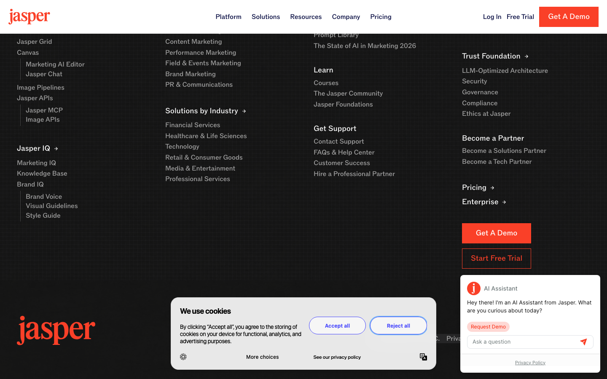

**观察：**

- P2** 页面以"100+ specialized AI agents""Content Pipelines""Jasper IQ"三大支柱概括产品能力，但未在 Footer 审计涉及的内容中列出具体 agent 类型（如 SEO agent、社媒 agent、邮件 agent 等），用户无法判断这 100+ agents 究竟覆盖哪些营销职能。
- P1** 反复出现"end-to-end marketing workflows""from idea to publication"，但完全没有说明工作流的**输入是什么**（品牌资料？产品 SKU？营销目标？）、**输出形式**（博客、广告文案、社媒帖子、邮件序列？）以及**触发与编排机制**（是否需要人工 review、agent 之间如何协作），导致"intelligent agents to run workflows"停留在抽象口号层面。
- P1** "connects your data, strategy, and creative process"暗示有数据接入能力，但未披露任何**集成清单**——是否对接 CMS（WordPress / Contentful）、CRM（Salesforce / HubSpot）、广告平台（Meta / Google Ads）、分析工具（GA4）？这是 B2B 营销 SaaS 决策者最关心的功能性问题，却完全缺失。
- P2** Jasper IQ 被定位为"rich context hub"承载品牌语调与指引，但未说明**输入机制**（上传 PDF brand book？爬取官网？手动输入 tone rules？）和**作用范围**（是否自动注入所有 agent 输出？能否按市场/产品线分组管理多套品牌规范？），跨国/多品牌团队的核心顾虑没有被回答。
- P3** 提到 "Studio and Grid" 两个工具用于"design and run automations"，但仅一句带过——Studio 与 Grid 的功能边界、与 Agents/Pipelines 三大支柱的关系完全未解释，读者会困惑这是独立功能模块还是 Pipelines 的子组件。


### 🎯 解决方案 / 场景（3 个测点）

**该模块覆盖页面**:

- `https://www.jasper.ai/solutions/by-industry/financial-services`
- `https://www.jasper.ai/solutions/by-role/product-marketers`
- `https://www.jasper.ai/solutions`

#### A1: Main input / chat interface

**URL:** https://www.jasper.ai/solutions/by-industry/financial-services

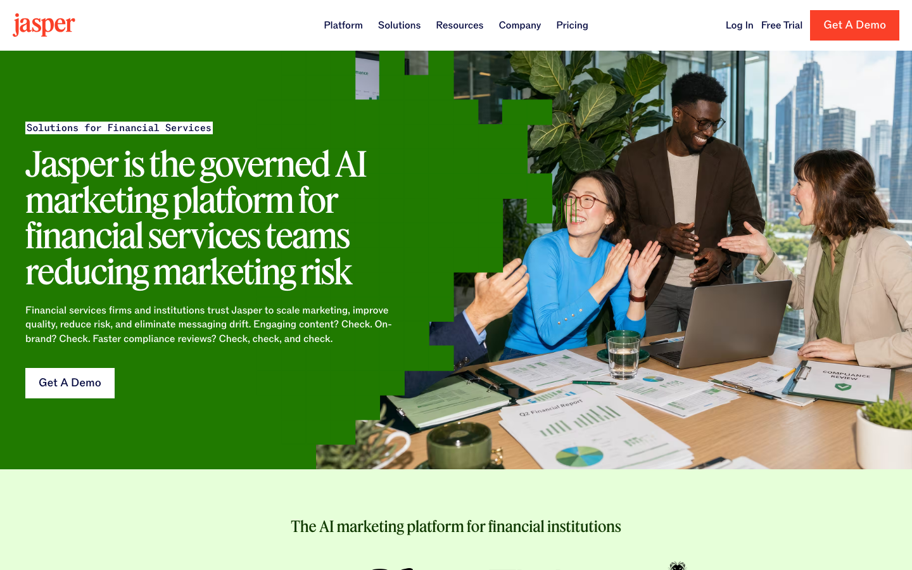

**观察：**

- ✅ **明确的垂直定位**：页面清晰传达 Jasper 是面向金融服务行业的"治理型 AI 营销平台"，核心价值是在降低合规风险的前提下规模化营销内容生产，定位收敛清晰，不是泛泛的 AI 写作工具。
- ✅ **核心能力模块化呈现**：揭示了两个关键能力 — (1) Regulated Content Execution（受监管内容生成），以 Jasper IQ 作为"基础智能层"+ Knowledge Base 作为统一事实源，将已批准的声明 / 定位 / 免责声明嵌入工作流；(2) Personalized Customer Communications（个性化客户沟通），在合规约束下做受众分层的消息适配。
- ✅ **解决的问题具体可感**：明确锁定金融营销团队的三个痛点 — 内容合规审查慢、跨渠道（web / email / paid / product）信息漂移（messaging drift）、个性化与监管要求的冲突，场景化程度较高。
- P2 工作机制黑箱**：反复出现"Jasper IQ""Knowledge Base""runtime governance""policy enforcement"等术语，但没有说明 IQ 究竟是什么形态（规则引擎？RAG？审批工作流？）、合规规则如何配置、违规内容如何被拦截或标记，用户无法判断"built-in compliance"是真护栏还是营销话术。
- P2 集成清单不完整**：仅点名 Adobe Workfront 作为下游路由工具，但金融营销关键的 CRM（Salesforce Financial Services Cloud）、合规审阅系统（如 PerformLine、Proofpoint）、DAM、邮件平台（Marketo / Salesforce Marketing Cloud）等是否原生集成完全未提，B2B 买家无法评估接入成本。

#### S1: Features / Product page

**URL:** https://www.jasper.ai/solutions/by-role/product-marketers

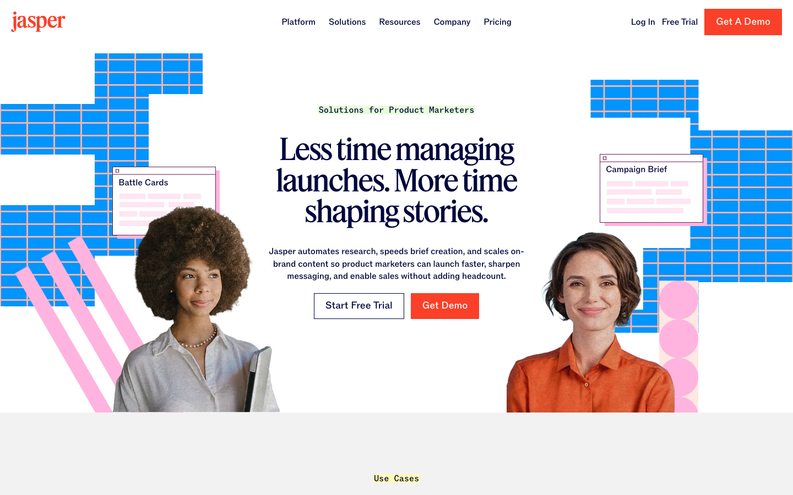

**观察：**

- ✅ 产品定位清晰指向 PMM 垂直场景**：页面明确将 Jasper 定位为"为产品营销人员（PMM）打造的生成式 AI"，并围绕三大核心工作流展开——发布物料生成（launch briefs、bills of materials）、销售赋能资产生产（基于一份 positioning document 派生多种文本/视觉资产）、竞争情报自动化（竞品信息采集与合成，输出 battlecards、异议处理话术）。读完能快速理解"这个产品替我做发布、赋能、竞品三件事"。
- ✅ Marketing Agents Library 揭示模块化 Agent 工作机制**：通过 Research Agent、Multi-channel Campaign、Battle Cards、Product Feature Update、Product Update Email、Product Proposal 等具名 Agent，暗示产品是由多个**任务专用 Agent** 构成的库，而非单一对话框。其中 Research Agent 标注"plans, researches, and analyzes across multiple sources—integrated with your Brand Voice, Knowledge Base"，是页面上**唯一**披露了输入源（Brand Voice + Knowledge Base + 多来源研究）和工作步骤（plan → research → analyze → cited reports）的 Agent。
- P1 竞争情报功能的输入与数据源完全未披露**：页面声称"automate the collection and synthesis of competitor information"，但**没有说明竞品数据从哪里来**——是用户上传？爬取公开网页？接入第三方情报库（如 Klue、Crayon）？还是依赖大模型既有知识？这对 PMM 评估"battlecard 是否准确、是否实时"是决定性信息，缺失会直接影响购买决策。
- P1 "通过你已经使用的系统分发"的集成清单缺失**：销售赋能段落写到"distribute materials directly via the systems you already use"，但**未列出任何具体集成对象**（Salesforce / HubSpot / Highspot / Seismic / Gong / Slack / Confluence？）。对 PMM 而言，能否推送进 Sales Enablement 平台或 CRM 是核心采购门槛，这里只给了承诺、没给清单。
- P2 Agent 库的覆盖度与可扩展性不清晰**：页面只露出 6 个 Agent（Research、Multi-channel Campaign、Product Feature Update、Product Update Email、Product Proposal、Battle Cards），未说明**完整库有多少 Agent、是否可自建/自定义 Agent、Agent 之间能否编排成流水线**（例如 Research → Positioning → Battle Card 链式触发）。"Agents for every marketer, across every function"是营销话术，但缺少功能边界。

#### E3: 探索: Solutions

**URL:** https://www.jasper.ai/solutions

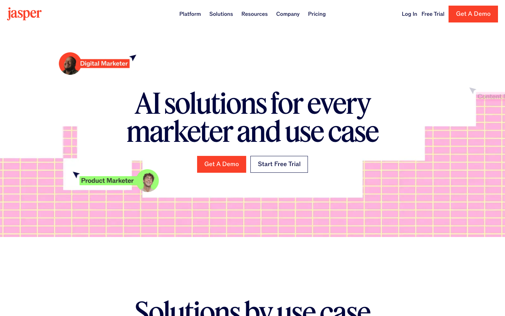

**观察：**

- ✅ 功能矩阵清晰**：页面用「Use Case / Role / Industry」三维度切分解决方案，揭示 Jasper 是面向营销团队的 AI 内容生成平台，覆盖 SEO/AEO/GEO 优化、个性化内容、跨市场 Campaign 内容生产三大核心场景，受众覆盖性能/PR/产品/内容/品牌/Field 六类营销角色。
- P1 核心工作机制完全缺失**：页面只用一句话概括每个解决方案（如"transform briefs into on-brand campaign content"），但未说明 AI 如何理解品牌语调、如何接入 brief 输入、输出哪些具体物料（博客？广告文案？邮件？落地页？）、与人工审校如何协作 — 用户读完无法判断"这个 AI 到底替我做哪一步"。
- P1 "Governed AI" 是核心卖点但零解释**：金融、医疗行业方案反复强调"governed AI marketing platform...reducing marketing risk"，但合规治理具体机制（数据隔离？品牌词审核？输出审计日志？符合 HIPAA/SOC2 哪些条款？）完全未披露，对受监管行业决策者而言是关键功能缺口。
- P2 集成与数据源信息缺失**：Personalization 提到"target accounts, contacts, leads, opportunities"暗示对接 CRM/ABM 数据，但未列出支持的集成清单（Salesforce？HubSpot？6sense？），Performance Marketer 方案提到"hyper-personalized experiences"也未说明数据来源 — 缺失会让 RevOps 评估者无法判断接入成本。
- P2 角色方案差异化薄弱**：六个 Role 解决方案的描述同质化严重，全是"AI 加速 / 个性化 / 提升 ROI"的抽象表述，未说明 Brand Marketer 和 Content Marketer 在产品里实际看到的功能差异是什么（专属工作流？不同模板库？不同审批链？），无法支撑"按角色选购"的导航逻辑。


### ⭐ 客户案例（1 个测点）

**该模块覆盖页面**:

- `https://www.jasper.ai/`

#### S4: Customer / logo wall

**URL:** https://www.jasper.ai/

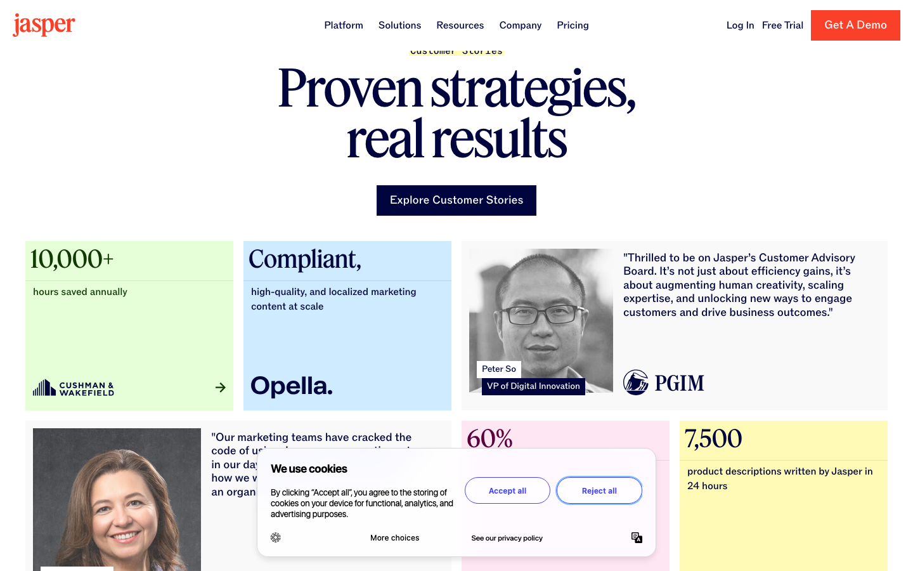

**观察：**

- P2** Logo wall 区域仅出现 "World-class marketing teams trust Jasper" 这一句标题，文本节选中**未列出任何具体客户名称、行业或规模**，无法判断 Jasper 的 AI agent 平台究竟服务于哪类营销团队（B2B SaaS？快消？电商？企业级？），用户难以通过"同类客户"快速代入自己的使用场景。
- P1** Logo wall 缺少**功能性背书信息** — 没有任何客户使用场景说明（例如"X 公司用 Content Pipelines 将内容产出周期从 2 周缩短到 2 天"）。对于一个主打"100+ AI agents + 端到端工作流"的产品，logo 墙若不绑定**具体功能使用证据**，就只是品牌列表，无法回答"这些客户用 Jasper 做了什么具体工作"。
- P2** 客户区域未做**行业 / 团队规模 / 用例分层** — Jasper 同时强调 SEO、个性化、全球 campaign、电商等多类用例，若 logo 墙不按用例或客户类型分组，无法让访客判断"我所在的细分场景（如电商 PDP 内容批量生成）是否真的有同行在用"。
- P3** Logo wall 紧邻的下文虽然展开了 Agents / Content Pipelines / Jasper IQ 三大功能模块，但**logo 与具体功能模块之间没有关联引用**（例如"使用 Jasper IQ 维护品牌一致性的客户"）。这是一处可被利用却未利用的功能叙事节点。
- 功能信息缺口（P1）**：访客读完此区域无法得知 Jasper 客户实际**部署规模**（多少营销人员协作？跑了多少个 agent？产出多少内容？）、**集成的内部系统**（CMS / DAM / Salesforce / HubSpot 等）以及**ROI / 效率指标**。logo 墙若要支撑"intelligent marketing 执行平台"的定位，至少需补充 1–2 个带量化结果的客户证据。


### 💰 定价 / 商业化（1 个测点）

**该模块覆盖页面**:

- `https://www.jasper.ai/pricing`

#### C2: Pricing page

**URL:** https://www.jasper.ai/pricing

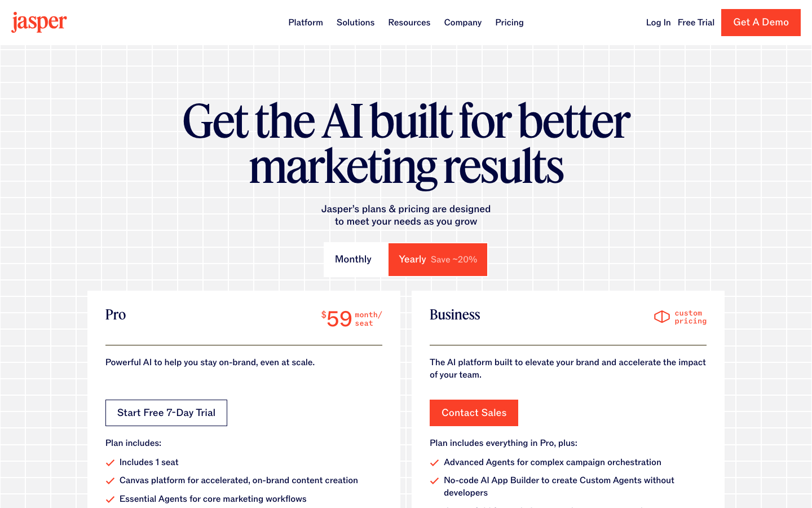

**观察：**

- P1 核心功能"Agents"区分模糊**：页面将 Pro 描述为"Essential Agents for core marketing workflows"，Business 为"Advanced Agents for complex campaign orchestration"，但**未列举具体有哪些 agent、各自负责什么营销任务**（邮件？社媒？广告文案？SEO？）。用户无法判断 $59/月的 Pro 是否覆盖自己的工作流，也无法理解升级到 Business 实际多解锁了哪些 agent。
- P1 关键功能"Jasper Grid"和"AI App Builder"零解释**：作为 Business 套餐的核心差异化能力——"Jasper Grid for scaled systematic content execution" 和 "No-code AI App Builder to create Custom Agents"——页面只给一句标语，**未说明输入是什么、输出形态、典型用例、与 Pro 中 Canvas 的关系**。对于决定是否 Contact Sales 的决策者，这是关键信息缺口。
- P2 集成与数据接入信息完全缺席**：营销 AI 平台的核心价值在于接入既有数据栈（CRM/CDP/CMS/Google Analytics/HubSpot/Salesforce 等），但页面除了笼统的 "API access"（仅 Business）外，**未提及任何具体集成、连接器或数据导入方式**。Multi-Modal Knowledge 提到可上传 text/video/image/data/audio，但未说明数据量上限、刷新机制、是否支持实时同步。
- ✅ Jasper IQ 三大资产模型表达清晰**：把"Brand Voice / Audiences / Knowledge"作为可量化的产品对象（2 voices→Unlimited、3 audiences→Unlimited、5 assets→Unlimited），用户能立刻理解 Jasper 的差异化卖点是"把营销品牌资产结构化喂给 LLM"，而非通用写作工具。这是把抽象 AI 能力转译为可购买单位的好范例。
- P2 "Seat"语义与协作机制未说明**：Pro "Includes 1 seat"，但**未说明 seat 之间如何协作、Brand Voice/Knowledge 是否在 seat 间共享、多 seat 如何加购**。对于团队采购方而言，无法判断 5 人团队应选 5 个 Pro seat 还是直接升级 Business（后者提到 "Groups" 和 Admin controls 但未量化）。


### 🚪 注册 / 试用入口（1 个测点）

**该模块覆盖页面**:

- `https://www.jasper.ai/`

#### C3: Sign-up flow (no submit)

**URL:** https://www.jasper.ai/

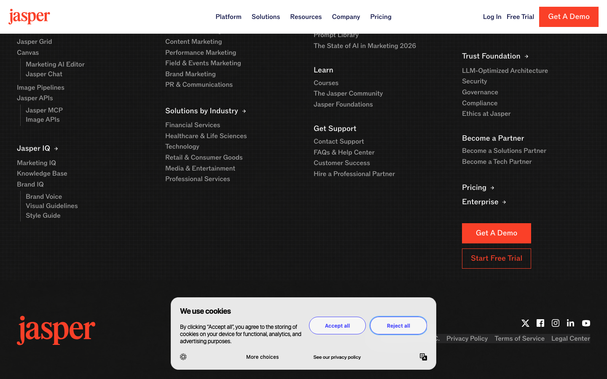

**观察：**

- ✅ 页面清晰传达了 Jasper 的核心产品定位——"营销 AI agent 工作空间"，并明确给出三大功能模块（Agents / Content Pipelines / Jasper IQ），让用户一眼理解平台是"100+ 专用 AI agent + 端到端内容工作流 + 品牌上下文中枢"的组合。
- ✅ 用"内容生命周期自动化"+"规模化营销内容生产"+"品牌一致性"三个具体用户场景演示了产品价值，覆盖了营销团队"从 idea 到发布"的典型痛点（重复劳动、跨渠道一致性、全球化部署）。
- P1** 关键功能机制未说明："100+ specialized AI agents"具体包含哪些 agent（SEO agent？社媒 agent？邮件 agent？）、它们如何被编排（orchestrate）、是否能自定义 agent 行为，页面完全没披露——这是产品的核心卖点却最不透明。
- P1** Content Pipelines 的输入/输出/触发机制缺失：仅说"connects your data, strategy, and creative process"，但用户无法判断 pipeline 接受什么输入（Brief？数据源？模板？）、输出到哪里（CMS？社媒平台？广告系统？）、是否需要写代码或可视化编排。
- P2** 集成生态完全空白：营销 agent 必须连接 CRM（HubSpot/Salesforce）、CMS（WordPress/Webflow）、广告平台（Meta/Google Ads）、数据源（GA4/Segment）才能"端到端执行"，但页面对集成清单只字未提，"deliver live marketing"的承诺缺乏可信度支撑。


### 📞 Demo / 销售对接（1 个测点）

**该模块覆盖页面**:

- `https://www.jasper.ai/demo`

#### E5: 探索: Get A Demo

**URL:** https://www.jasper.ai/demo

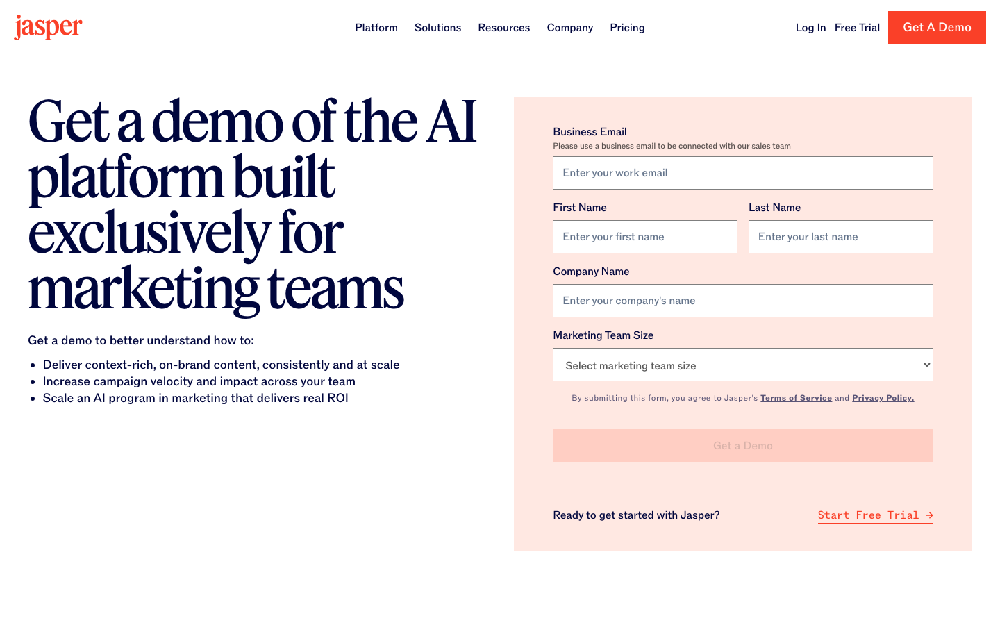

**观察：**

- P1 Demo 页未揭示任何具体产品能力** — 三条卖点（"context-rich on-brand content"、"campaign velocity"、"AI program ROI"）全是营销抽象语，没有任何功能/工作流/产出物示例。用户读完无法判断 Jasper 到底能生成什么、自动化什么、与现有营销栈如何协作。
- P1 页脚暴露了庞大的产品矩阵但主体内容完全未提及** — 页脚列出 Agents / Jasper Grid / Canvas / Marketing AI Editor / Jasper Chat / Image Pipelines / Jasper MCP / Brand IQ / Marketing IQ 等十余个模块，每个都是独立功能单元，但 Demo 主文案对它们零提及。这意味着潜在客户必须先"约 Demo 才能搞清这个平台到底由什么组成"，对功能透明度是负面信号。
- P2 未说明 Demo 与 Free Trial 的功能边界差异** — 页面同时提供"Start Free Trial"和"Get A Demo"两个 CTA，但没有解释哪些功能/Agent/IQ 模块只在 Demo（即销售对接的企业版）中可用、Free Trial 能体验到哪一层（疑似只能用 AI Studio / Chat 等基础生成能力）。功能层信息缺口明显。
- P2 团队规模选项（最高 501+）隐含企业级功能门槛但未明示** — Marketing Team Size 字段从 1-10 直到 501+，且要求 business email，暗示 Brand IQ / 多 Agent 编排 / API & MCP 集成等核心能力主要面向 50+ 的营销团队，但页面未说明小团队能调用哪些 Agent、能否接入私有知识库（Knowledge Base / Brand Voice 训练数据）。
- P2 缺少 Demo 本身的功能演示规格** — 没有说明 Demo 时长、是否含真实数据演练、是否能演示客户自己的品牌资产接入 Brand IQ、是否覆盖 Jasper MCP / API 的接入路径。对买家而言，Demo 是评估"产品能否解决我的特定营销工作流"的关键环节，但这页只承诺连线销售而不承诺演示内容。


### 🔌 集成 / API（1 个测点）

**该模块覆盖页面**:

- `https://www.jasper.ai/api`

#### S9: API / Developer docs

**URL:** https://www.jasper.ai/api

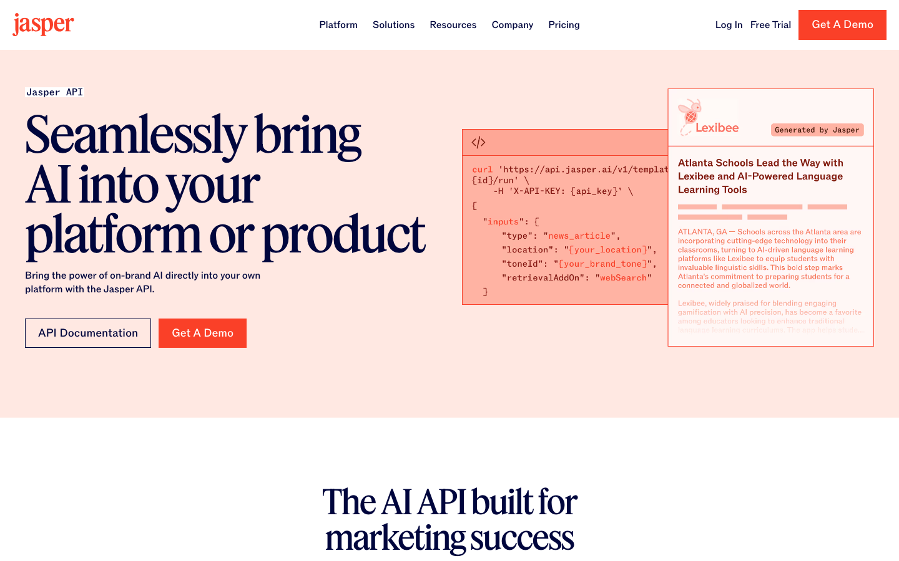

**观察：**

- ✅ P0 正面**：清晰揭示了 Jasper API 的核心能力矩阵——AI Engine（多 LLM 路由）、Data Retrieval（接入 Google 实时新闻/搜索结果）、Editorial checks（语法/抄袭/SEO 检测）、Brand Voice（品牌语调与公司事实接地）、Image manipulation（图像处理），定位为"嵌入式营销内容生成 API"，解决了开发者把品牌一致的 AI 写作能力嵌入自有 CMS/平台的问题。
- P1 严重**：未说明 API 的关键工作机制——例如 Brand Voice 如何训练/导入（是上传文档？URL 抓取？还是手动配置？）、Data Retrieval 的检索范围与频率、AI Engine 是否允许调用方指定 LLM 或由 Jasper 自动路由，这些直接影响开发者评估能否接入。
- P1 严重**：99.99% uptime 被作为核心卖点，但没有给出 SLA 条款、历史 status page 链接、限流/QPS 配额、错误重试机制等可验证信息，对于"平台级集成"决策而言这是必须的功能可靠性细节。
- P2 中等**：缺少典型集成场景的端到端示例（如"在自有 CMS 中调用 Jasper API 生成一篇带品牌语调的博客 + 配图"的完整调用链），开发者读完知道有哪些"模块"，但不清楚这些 API 如何组合成一个工作流。
- P2 中等**：未披露输入/输出格式（REST/GraphQL/Streaming？返回 Markdown 还是结构化 JSON？是否支持 webhook 异步？）、鉴权方式、定价模型（按 token / 按调用 / 按席位）以及与 Jasper 主产品账号的关系，导致"能为我做什么"清楚但"我能怎么用、用多少钱"完全缺失。


### 🔒 安全 / 信任（1 个测点）

**该模块覆盖页面**:

- `https://www.jasper.ai/`

#### S12: Trust / Security page

**URL:** https://www.jasper.ai/

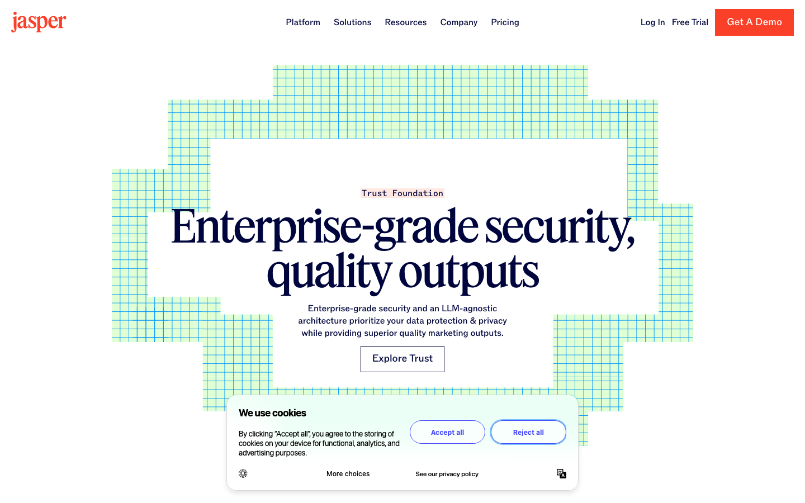

**观察：**

- P1** 页面声称是 "Trust / Security page"，但抓取的文本完全是首页营销内容（Platform / Agents / Content Pipelines / Jasper IQ 介绍），**没有任何关于安全合规、数据保护、SOC2 / ISO / GDPR、数据驻留、模型隔离、企业级权限控制等信任与安全相关功能信息**，对于企业采购决策来说是关键功能缺口。
- P1** 作为面向企业营销团队的 AI agent 平台，未披露**用户数据如何被模型使用**（是否用于训练）、**品牌资产 / Jasper IQ 中的私有内容如何加密与隔离**、**100+ agent 调用的底层 LLM 是哪家、是否经过安全审计**——这些是 Trust 页应回答的核心功能性问题，全部缺失。
- P2** 缺少**企业治理与合规功能清单**：例如 SSO/SCIM、审计日志、角色权限（RBAC）、内容审批工作流、PII 检测与脱敏、品牌护栏（brand safety guardrails）等功能的具体能力描述未出现，用户无法判断该平台是否满足合规采购门槛。
- P2** 文案反复强调 "brand control""on-brand""authenticity"，但未说明 **Jasper IQ 在执行层如何技术性约束 agent 输出**（是 prompt 注入？检索式接地？输出后校验？），即"品牌一致性"作为一项功能的**工作机制完全是黑盒**。
- P3** 提到 "100+ specialized AI agents" 和 "Content Pipelines"，但未在此页给出**agent 与第三方系统（CRM、CMS、DAM、广告平台、分析工具）的集成清单及鉴权方式**，用户读完无法判断 agent 能否真正"端到端执行"自己现有营销栈中的工作流。


### 🏢 公司 / 团队（1 个测点）

**该模块覆盖页面**:

- `https://www.jasper.ai/company`

#### E4: 探索: Company

**URL:** https://www.jasper.ai/company

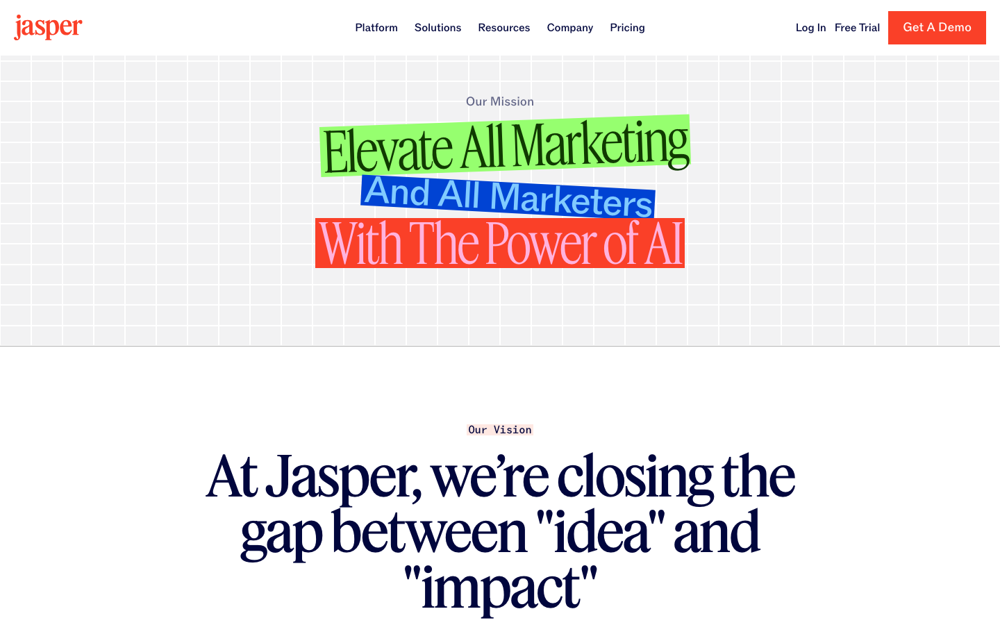

**观察：**

- P2** 页面定位为"使命/愿景/团队"展示，几乎没有透露产品具体能做什么——"closing the gap between idea and impact""move faster, think smarter"全是抽象口号，读完无法回答"Jasper 究竟生成什么内容、自动化什么流程"。
- ✅** 底部导航无意间暴露了**最完整的产品功能图谱**：Agents、Optimization、Personalization、Research、Content Pipelines、AI Studio、Jasper Grid、Canvas、Marketing AI Editor、Jasper Chat、Image Pipelines、Jasper APIs、Jasper MCP、Image APIs、Jasper IQ、Marketing IQ、Knowledge Base、Brand IQ、Brand Voice、Visual Guidelines、Style Guide——揭示这是一个覆盖"Agents + 内容流水线 + 品牌知识库 + API/MCP"的完整营销 AI 平台，但 Company 页正文一字未提。
- ✅** "900+ 企业客户 / Fortune 500 的 20% / 12.5 万+ 全球客户"是有效的**能力背书信号**——间接证明产品能承载企业级营销工作流（多品牌、多团队、合规），对功能可信度比文案更有说服力。
- P1** 高管阵容（CEO/CMO/CPO/SVP Revenue）暴露了**核心买家画像是企业 CMO/营销 VP**，但页面未回答与功能强相关的关键问题：Jasper 是面向单个 marketer 的写作助手，还是面向营销团队的 agent 编排平台？两种定位对应的功能集和接入方式完全不同。
- P2** 关键功能缺口：(1) Agents 能执行哪些营销任务（SEO/邮件/广告/落地页？）、(2) Brand IQ / Brand Voice 是如何训练和保持品牌一致性的机制、(3) Jasper MCP 与外部工具栈（CRM、CMS、广告平台）的实际集成清单、(4) Content Pipelines 的输入到输出工作流形态——这些"产品能为我做什么"的核心问题在 Company 页完全无答案，需跳转至 Platform 才能获知。


### 📖 文档 / 帮助（1 个测点）

**该模块覆盖页面**:

- `https://www.jasper.ai/`

#### C7: Help / Documentation

**URL:** https://www.jasper.ai/

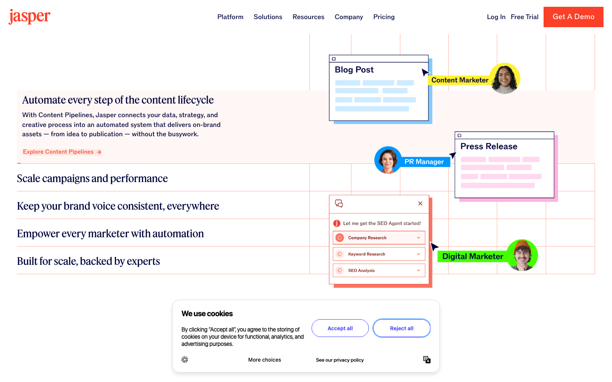

**观察：**

- P1 缺少 Help / Documentation 入口** — 页面顶部导航仅有 Platform / Solutions / Resources / Company / Pricing，未见 Help Center、Docs、Knowledge Base、API Reference 等帮助文档入口，用户无法判断该产品是否提供自助学习资源、agent 配置指南或开发者文档。
- P1 100+ AI agents 与 Content Pipelines 无任何操作说明** — 页面反复强调"100+ specialized AI agents""end-to-end workflows"，但完全没有指向具体 agent 列表、pipeline 模板库或上手教程的文档链接，用户读完不知道这些 agent 叫什么、能做什么、如何配置。
- P2 Jasper IQ "rich context hub" 工作机制不透明** — 仅说明 IQ 能维护品牌语调和指南，但未说明如何上传品牌资料、支持什么文件格式、如何被 agents 引用，缺少功能文档或示例链接来解释这个"context hub"的实际输入输出。
- P2 Studio 与 Grid 两个产品仅一句带过** — 文末提到"intuitive tools like Studio and Grid, anyone can design and run automations"，但没有为这两个核心工具提供任何介绍页、文档或演示链接，营销人员无法理解它们的具体能力边界。
- P3 集成与数据连接细节缺失** — 文中提到"connects your data, strategy, and creative process"和"ecommerce / SEO / personalization"等场景，但未提供集成清单文档（如支持哪些 CMS、CRM、电商平台），用户无法判断能否接入自家技术栈。


### 📚 产品官方介绍（递归发现）（2 个测点）

**该模块覆盖页面**:

- `https://community.jasper.ai/c/live-learning/`
- `https://community.jasper.ai/c/live-learning/welcome-to-the-jasper-community`

#### B1: 背景 D1: Start Here

**URL:** https://community.jasper.ai/c/live-learning/


**观察：**

- ✅ **产品定义**：页面将 Jasper 定位为面向营销团队的 AI 平台，社区被定义为"your education center for getting the most out of Jasper"，原文强调帮助用户"turn strategy into real outcomes"，即把营销策略转化为实际业务结果。
- ✅ **核心能力（页面提及的四大使用场景）**：
- Optimizing content for AI search（为 AI 搜索优化内容）
- Scaling global campaigns（规模化全球营销活动）
- Personalizing content at-scale（大规模内容个性化）
- Managing massive product catalogs（大规模产品目录管理）

#### B2: 背景 D2: Welcome to the Jasper Community!

**URL:** https://community.jasper.ai/c/live-learning/welcome-to-the-jasper-community


**观察：**

- ✅ **产品/公司定义**：页面将 Jasper Community 定义为"your go-to destination for the resources, expertise, and peer insights you need to achieve (and surpass!) your marketing goals"，即面向营销人员的 Jasper 教育与社群中心，而非 Jasper 产品本身的功能介绍。
- ✅ **核心能力（社群侧）**：页面列出四类成员价值——Premium Resources（独家直播、课程、点播内容）、Expert Advisory Sessions（结构化 Q&A，可直连 Jasper 专家与行业领袖）、Campaign Showcases（分享案例、获取反馈）、Strategic Networking（与营销 leader 跨行业互联）。
- ✅ **目标用户与场景**：明确定位"marketing leaders"，并列出四个典型场景：Optimizing content for AI search、Scaling global campaigns、Personalizing content at-scale、Managing massive product catalogs，覆盖从 AI 初次落地到规模化营销项目的人群。
- ✅ **学习路径**：入门动作被明确指引——观看 Jasper Overview 视频 + 修读 "Course: Jasper Foundations"；导航中还能看到 Jasper Grid 认证、Jasper IQ、Jasper Canvas 等课程模块，暗示 Jasper 主产品包含 Grid / IQ / Canvas 三条产品线。
- P3 **差异化主张缺失**：页面只重复"drive results / turn strategy into real outcomes"等通用营销话术，没有解释 Jasper 相比 Copy.ai、Writer 等竞品的独家差异，也未阐明品牌核心叙事（例如是否定位为"营销人员的 AI 平台"）。
- P3 **理解缺口**：读完后仍不清楚 Jasper Grid / IQ / Canvas 三个子产品各自的功能边界与定位、Jasper 主应用（Jasper App）究竟提供哪些 AI 能力（生成、Brand Voice、Workflow？）、以及加入 Community 是否需要付费订阅 Jasper 产品——页面只给出 hey@jasper.ai 支持邮箱，未说明商业模式与准入门槛。


### 📌 其他（8 个测点）

**该模块覆盖页面**:

- `https://www.jasper.ai/this-page-should-not-exist-product-audit-test-1234`
- `https://www.jasper.ai/`
- `https://www.jasper.ai/resources`
- `https://www.jasper.ai/brand`
- `https://www.jasper.ai/platform`
- `https://www.jasper.ai/agents`
- `https://www.jasper.ai/agents/optimization`
- `https://www.jasper.ai/agents/personalization`

#### C8: 404 error handling

**URL:** https://www.jasper.ai/this-page-should-not-exist-product-audit-test-1234

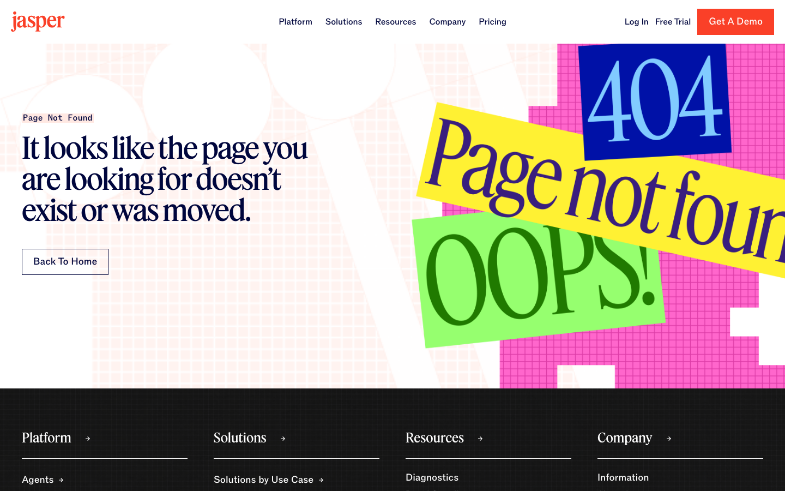

**观察：**

- ✅ 404 页脚的导航树构成一份完整的**产品能力地图**：Platform 层揭示 Jasper 围绕 5 个核心能力（Agents、Optimization、Personalization、Research、Content Pipelines）展开，并细分到 AI Studio、Jasper Grid、Canvas、Marketing AI Editor、Jasper Chat、Image Pipelines 等多个产品模块，让误入此页的用户也能快速理解 Jasper 是一个面向营销的 AI 内容/智能体平台。
- ✅ 通过 "Jasper APIs / Jasper MCP / Image APIs" 的存在，页面间接揭示了**程序化集成能力**——Jasper 不仅是 SaaS 界面，还提供 API 与 MCP（Model Context Protocol）接入，意味着可以被嵌入企业自有工作流或 Agent 系统中，这是面向技术买家的关键功能信号。
- ✅ "Brand IQ / Brand Voice / Visual Guidelines / Style Guide / Knowledge Base" 明确传达了 Jasper 的**品牌一致性引擎**——产品解决的核心痛点是"AI 生成内容如何贴合企业品牌调性"，适用场景为大型企业的多渠道营销内容生产。
- P2 页脚虽然列出了大量功能模块名（Jasper Grid、Canvas、Jasper IQ、Marketing IQ、Brand Compliance 等），但**没有任何一句话解释这些模块各自做什么**，用户读完仍无法回答"Jasper Grid 和 Canvas 的差别是什么"——404 页若想承担"挽回流量"的功能，应当在导航项旁加一句功能注解。
- P2 "Solutions by Industry"（金融、医疗、科技、零售、传媒、专业服务）与 "Solutions by Role"（产品营销、内容营销、绩效营销等）暗示 Jasper 有**垂直行业适配能力**，但页面未说明这种适配是体现在预置模板、行业知识库、合规规则还是 Agent 提示词上，**功能机制不透明**。

#### A3: Tool capabilities disclosure

**URL:** https://www.jasper.ai/

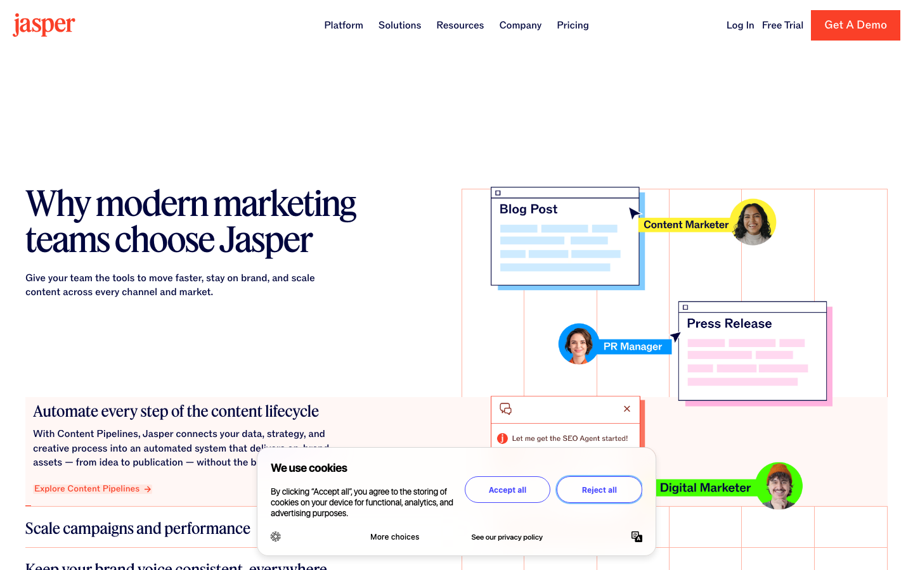

**观察：**

- P2** 页面披露的核心能力框架为"100+ 专业 AI agents + Content Pipelines + Jasper IQ"三层结构（Agents 执行营销任务、Pipelines 串联从 idea 到发布的端到端工作流、IQ 作为品牌语调/指南的上下文中枢），但未列出任一具体 agent 的名称或职能，"100+"停留在数量宣传层面，读者无法判断到底覆盖了哪些营销岗位（SEO 写手？BDR？社媒运营？）。
- P1** 提及"connects your data, strategy, and creative process"和"Build once, deploy everywhere"，但未说明**输入端集成清单**（接入哪些 CRM/CMS/广告平台/分析工具）和**输出端发布通道**（是 API 推送、原生集成还是导出文件），导致核心卖点"端到端自动化"缺乏可验证的工作机制说明。
- P2** Content Pipelines 被描述为"repeatable workflows that move work from idea to launch"，但未给出一个具体的 Pipeline 示例（如"博客生产 Pipeline 包含哪几步、每步由哪个 agent 执行、人工在哪里介入"），用户难以理解 Pipeline 与普通 prompt 链或竞品 workflow（如 Zapier/n8n）的差异。
- P2** Jasper IQ 声称承载"brand guidelines, tone, and messaging"，但未说明输入形态（上传 PDF？填表？训练样本？）、作用范围（仅文本？覆盖图像/视频？）、以及如何在多 agent 之间共享上下文，"品牌一致性"承诺缺少机制层支撑。
- P3** 提及 Studio 和 Grid 两个工具名（"intuitive tools like Studio and Grid"），但页面截止处未解释二者分别是什么、面向什么场景、与 Agents/Pipelines 的关系，造成产品形态认知断点。

#### S6: Blog / Resources

**URL:** https://www.jasper.ai/resources

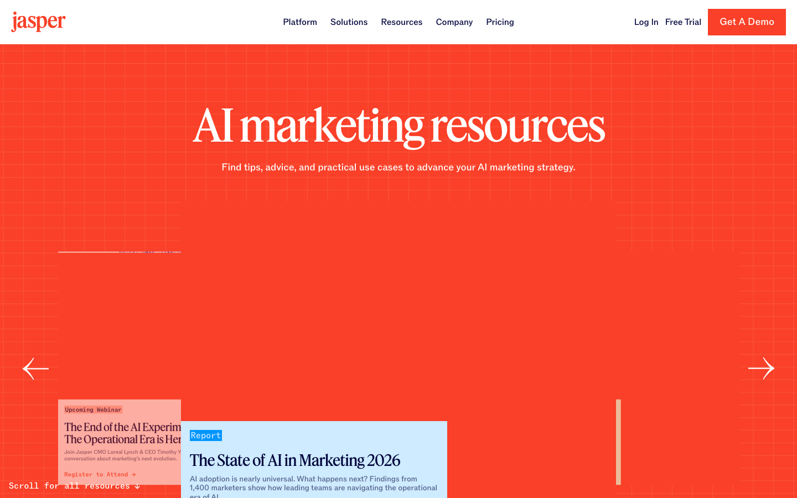

**观察：**

- P2 资源页未直接揭示产品核心功能** — 整页是 Ebook / Report / Webinar / Customer Story 的内容列表，几乎全部聚焦"AI marketing 趋势 / 调研 / 方法论"，而非 Jasper 平台本身能做什么（如 AI 写作引擎、品牌语调、Campaign workflow、AI agent 等）。读完这一页仍无法回答"Jasper 具体帮我完成什么营销任务"。
- P2 唯一具体功能线索来自 Customer Story 与 Forrester ROI** — Old Dominion 案例提到"scaled content creation, boosted SEO performance, built customer trust"，Forrester 报告披露"342% ROI、$2.2M 年节省时间"，这是页面上仅有的可量化产品价值证据，但属于间接背书而非功能说明，且未点出是哪些功能模块带来这些结果。
- P2 内容主题暴露产品战略方向但未对应到功能模块** — 大量资源聚焦 GEO / AEO / AI Search Optimization（B2C 版、整合 SEO 版、2026 机会），暗示 Jasper 在布局"为 AI 搜索优化内容"这一能力，但页面未说明平台内是否已有对应工具 / 工作流（如 GEO 评分、AEO 内容生成器），把"行业趋势 Thought Leadership"和"产品能力"混在一起。
- P3 资源类型分类清晰但缺功能筛选维度** — 顶部导航把 Resources 拆为 Ebooks & Reports / Webinars / Customer Stories（隐含），有助于按内容形式查找，但缺按**产品功能 / 角色 / 行业**筛选（如"AI BDR 用例""企业品牌团队""Brand Voice 设置教程"），让读者难以快速定位与自己功能需求相关的资料。
- P1 功能信息缺口：缺少产品教程 / Docs / Use Case Library 入口** — 一个 AI marketing 平台的 Resources 页理应承担"教用户怎么用产品"的职责，但此页几乎全是漏斗顶部的 Thought Leadership 资产，未见 Product Tutorials、Prompt Library、Template Gallery、API/集成文档 或 Use Case Showcase 的明确入口，对评估"上手难度与可学习性"是关键缺口。

#### E1: 探索: All Logos

**URL:** https://www.jasper.ai/brand

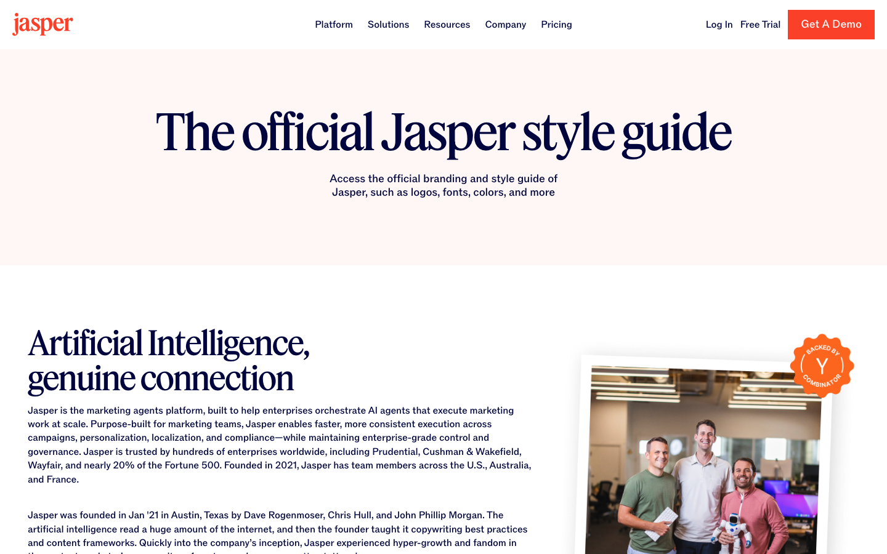

**观察：**

- P2 页面定位与功能信息错位**：这是一个品牌资源下载页（logo/字体/颜色），但页面主体却塞入了公司介绍和产品定位文案（"marketing agents platform...orchestrate AI agents"），却未链接到任何产品功能演示。访客若是想了解"Jasper 能做什么"，从这里得不到可操作的功能入口。
- ✅ 通过导航菜单意外暴露了完整产品矩阵**：底部 Platform 区块列出了 20+ 项功能模块（Agents、Optimization、Personalization、Research、Content Pipelines、AI Studio、Jasper Grid、Canvas、Marketing AI Editor、Jasper Chat、Image Pipelines、Jasper APIs、Jasper MCP、Image APIs、Jasper IQ、Marketing IQ、Knowledge Base、Brand IQ、Brand Voice、Visual Guidelines、Style Guide），可推断 Jasper 已从单一文案生成工具扩展为覆盖"内容流水线 + 多 agent 编排 + 品牌知识库 + API/MCP 接入"的企业营销 AI 平台。
- P1 核心定位"marketing agents platform"未给出功能解释**：页面声称"orchestrate AI agents that execute marketing work at scale"，但完全没说明 agent 具体执行哪些任务（撰写邮件？投放优化？SEO？本地化翻译？）、如何编排（工作流？触发条件？人工介入点？）、agent 之间如何协作。读完无法判断它与普通 LLM 写作工具的差别。
- P2 关键差异化能力（Brand IQ / Marketing IQ / Knowledge Base）缺乏功能说明**：从导航能看出 Jasper 强调"品牌知识 + 营销知识"作为底层能力，但本页未解释这些 IQ 模块如何工作——是 RAG 知识库？品牌风格微调？合规检查器？这是企业客户最关心的"governance"承诺背后的具体机制，却完全没展开。
- P3 企业级集成与工作场景缺口**：宣称服务 ~20% Fortune 500、强调 "campaigns、personalization、localization、compliance"，但页面未说明：与 CRM/CDP/CMS/DAM 等营销栈如何打通、Jasper MCP 暴露了哪些能力、本地化支持哪些语言、合规审查覆盖哪些行业法规（金融、医疗均在 Solutions 列表中）。企业买家无法从此页评估技术可行性。

#### E2: 探索: Platform

**URL:** https://www.jasper.ai/platform

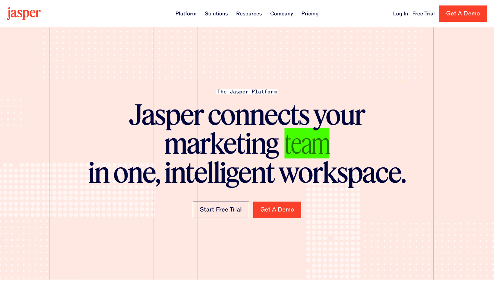

**观察：**

- ✅ 页面清晰传达了 Jasper 的产品三层架构（Agents 执行 / Content Pipelines 工作流编排 / Jasper IQ 治理与上下文），让读者快速理解这不是单一 AI 写作工具，而是面向营销团队的"AI 执行系统"定位
- ✅ 通过"Optimization Agent 接入 SEMrush 优化标题、meta 描述、内链策略"这种具体描述，让 agent 的工作机制有了可感知的落地场景（输入=营销资产、输出=优化建议、集成=SEMrush）
- P1** 关键功能机制说明严重缺失：Pipelines 罗列了 Canvas / Grid / Marketing Editor / Chat / AI Image Suite / Jasper Studio 六个子模块，但未解释它们之间的区别与协同关系（例如 Canvas 与 Grid 是不同视图还是不同用途？Studio 与 Editor 有何分工？），用户无法判断该用哪个模块完成什么任务
- P1** Agent 与外部系统的接入能力描述不充分：除 SEMrush 外，没有给出完整的集成清单（CRM、CMS、广告平台、数据仓库等），而"Personalization Agent 把客户数据变成行动"这句话被截断且未说明数据从何接入——这是 B2B 营销买家的核心评估点
- P2** "human orchestration"（人类编排）被列为核心价值，但页面未演示人机协作的具体形态：是审批节点？是 agent 中断让人介入？还是任务分派？读完仍不清楚营销人员日常如何与 agents 共事

#### E6: 探索: Agents

**URL:** https://www.jasper.ai/agents

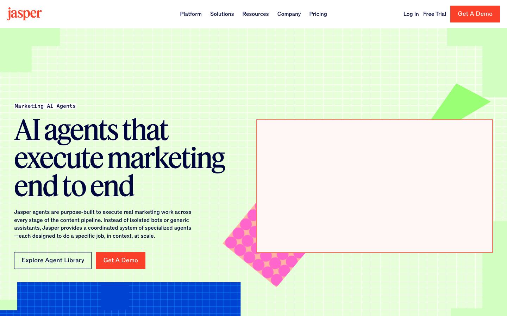

**观察：**

- ✅ **明确了"协调式 Agent 系统"的差异化定位** — 页面清晰传达了 Jasper agents 与其他平台"独立工具型 agent"的核心区别：每个 agent 针对内容流水线中的特定环节（Plan/Create/Adapt/Activate/Optimize），共享品牌/受众/业务上下文，并由人类编排。这回答了"产品做什么"的核心问题。
- ✅ **用内容流水线 5 阶段框架组织功能** — Plan（规划+治理）、Create（多渠道内容生成+Jasper IQ 一致性）、Adapt（本地化/个性化）、Activate（跨渠道发布协调）、Optimize（SEO/AEO/GEO 优化）构成完整营销执行闭环，让用户能理解产品覆盖的工作流范围。
- P1 关键功能机制完全黑箱** — 页面反复强调 "agents execute real marketing work"、"coordinated system"，但**没有任何一个具体 agent 的输入/输出示例**。仅出现 "Personalization Agent" 名称却无说明。用户无法理解：agent 接收什么指令？产出什么交付物？如何被人类"编排"？
- P1 集成与数据接入完全缺失** — Agent 要"grounded in shared brand, audience, and business context"，但没说明品牌/受众数据从哪来：是否对接 CRM/CDP/DAM？支持哪些营销栈（HubSpot/Salesforce/Adobe）？激活阶段"coordinate content launches across channels"具体支持哪些渠道（邮件/社媒/广告平台）？
- P2 Agent 库规模与边界未量化** — 提到 "Explore Agent Library" 但未说明现有多少个 agents、覆盖哪些具体任务、是否支持自定义 agent。读者无法判断产品成熟度与适配自己工作流的可能性。

#### E7: 探索: Optimization

**URL:** https://www.jasper.ai/agents/optimization

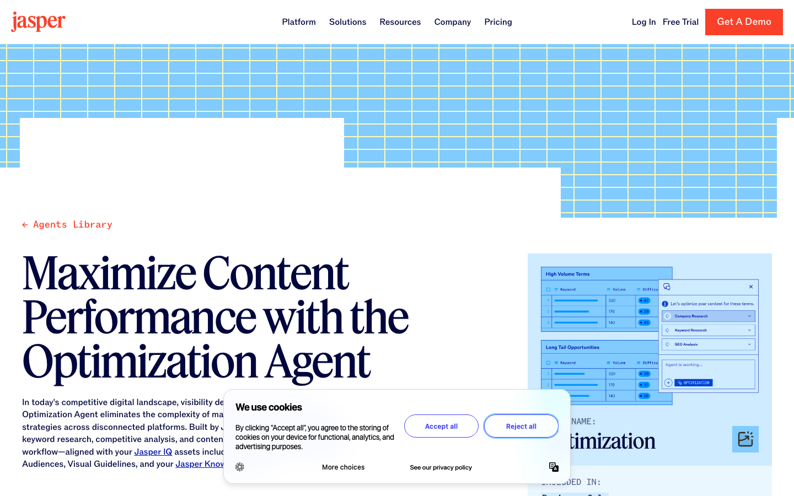

**观察：**

- ✅ **核心功能定位清晰**：页面明确说明 Optimization Agent 整合了 SEO、AEO（Answer Engine Optimization）、GEO（Generative Engine Optimization）三类优化能力，将关键词研究、竞品分析、内容优化整合到单一工作流中，定位为"AI 驱动的 SEO 策略师"。
- ✅ **工作流覆盖范围具体**：页面列出了 agent 自动化的具体环节——manual research、clustering、rewriting、brief creation，让用户能理解从"高层 idea/prompt"到"SEO-ready asset"的端到端转化路径。
- ✅ **与 Jasper 生态的集成点明确**：明确说明 agent 对齐 Jasper IQ 资产（Brand Voice、Style Guide、Audiences、Visual Guidelines、Knowledge Base），说明了输出会遵循品牌一致性，这是相对独立 SEO 工具的关键差异化点。
- P2 MCP 架构描述模糊**：页面提到从旧版"sub-agent 架构"升级到"tool-based architecture"（MCP/Model Context Provider），但未说明 MCP 接入了哪些外部工具/数据源（如 Ahrefs、SEMrush、Google Search Console？），用户无法判断数据来源和分析深度。
- P1 关键输入/输出规格缺失**：页面未明确说明用户实际需要输入什么（一个关键词？一篇草稿？一个 URL？）、能产出什么具体交付物（content brief、优化后的全文、关键词集群报告、竞品 gap 分析？）。"SEO-ready asset"过于抽象，用户读完仍不清楚"我能拿到什么文件"。

#### E8: 探索: Personalization

**URL:** https://www.jasper.ai/agents/personalization

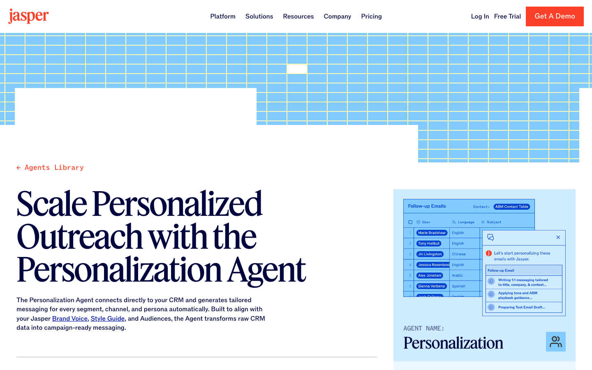

**观察：**

- ✅ **功能定位清晰**：明确说明 Personalization Agent 是"CRM 连接的内容自动化工具"，通过自然语言查询 CRM 数据并自动生成针对每个细分市场、渠道、人物角色的个性化营销内容，与 Jasper Brand Voice、Style Guide、Audiences 对齐——读者可快速理解"这个产品能做什么"。
- ✅ **解决痛点具体**：直击营销团队真实工作流痛点——无需手动构建 Salesforce 报表、导出联系人列表、重新上传到内容平台，节省每个 campaign 数小时的数据处理时间。典型场景列举了 ABM 营销、再激活流程、行业定向消息三类。
- P1 集成范围严重受限但表述模糊**：仅明确支持 Salesforce，其他 CRM 仅以括号注"in development"一笔带过，未说明 HubSpot、Marketo、Pipedrive 等主流 CRM 的支持时间表或路线图，对于非 Salesforce 用户这是是否采购的关键决策信息。
- P2 工作机制描述停留在表层**：仅说"查询 Salesforce 字段、生成数据表、启用个性化内容创作"，但未说明：可查询哪些字段类型（自定义字段？关联对象？）、自然语言查询的复杂度上限（能否做多条件过滤、跨对象 join）、生成内容时如何调用 contact-level 数据进行 merge。
- P2 输出与下游衔接未交代**：提到"Jasper Agents 和 Studio workflows 使用该数据创建 per..."（文本截断），但未说明最终输出形态（邮件？LinkedIn 消息？广告文案？）、是否可一键推送回 Salesforce/邮件平台、批量生成的内容如何审核与版本管理。


### ⚠️ 未找到的测点（2 个测点）

**该模块覆盖页面**:

- `https://www.jasper.ai/`

#### C4: Login page

**URL:** https://www.jasper.ai/
**观察：**

- [Link not found] 该模板期望的链接（log in|login|sign in|登录|登入）在 https://www.jasper.ai/ 上未找到 — 可能产品用了不同的措辞或这个功能不存在。 已跳过截图与 LLM 解读以避免重复首页快照。

#### A2: Example prompts / Templates

**URL:** https://www.jasper.ai/
**观察：**

- [Link not found] 该模板期望的链接（examples|templates|gallery|示例）在 https://www.jasper.ai/ 上未找到 — 可能产品用了不同的措辞或这个功能不存在。 已跳过截图与 LLM 解读以避免重复首页快照。


---

## 4. 第三方社区反馈

#### 5.1 调研范围与方法

通过 WebSearch 在 Reddit、Product Hunt、Hacker News、G2、Trustpilot 五个主要平台搜索 `jasper.ai` 用户讨论。Jasper 作为 2021 年成立、曾达 $1.5B 估值的早期 AI 写作明星产品，公开讨论丰富，覆盖时间窗约 2022–2026。

- **Reddit**: 多个营销/AI 子版块均有讨论，r/marketing、r/copywriting 中 Jasper vs ChatGPT 是高频议题
- **Product Hunt**: [jasper.ai 产品页](https://www.producthunt.com/products/jasper-ai/reviews) 收录 3000+ 评分（5/5 主导）
- **Hacker News**: 至少 3 条主题 thread（融资、ARR 增长、ChatGPT 后命运）
- **G2**: [Jasper 评论页](https://www.g2.com/products/jasper-ai/reviews) 是 B2B 重灾区，包含详细 pros/cons
- **Trustpilot**: [190 页评论](https://www.trustpilot.com/review/www.jasper.ai)，呈两极分化（产品体验 vs 计费投诉）

#### 5.2 核心议题（按讨论频次）

| 议题 | 讨论方向 | 出现频次 | 主要来源平台 |
|---|---|---|---|
| ChatGPT 冲击下 Jasper 是否还值得付费 | 中性偏负面 | 高 | Reddit, HN |
| Brand Voice 品牌音调一致性 | 正面为主，少量"学习曲线高" | 高 | G2, Reddit, PH |
| 试用期/订阅取消困难、扣费投诉 | 强负面 | 高 | Trustpilot, Reddit |
| 输出质量：通用营销内容好，技术/长文章差 | 两极分化 | 中 | G2, Trustpilot |
| 定价 $49/月起 vs ChatGPT $20 性价比 | 负面 | 中 | Reddit, G2 |
| 2023 年裁员 + 估值缩水 + 向营销团队转型 | 中性，关心公司健康 | 中 | HN, Reddit |

#### 5.3 正面评价 / 用户喜欢的点

- **来源**: [jasper.ai Customer Reviews — Product Hunt](https://www.producthunt.com/products/jasper-ai/reviews) — 综合评分页
  - **原文引用**: > "this has saved me hours of writing out long-form content from short outlines... it's not a replacement for actually creating content, it's just a tool to help you start writing."
  - **关键词**: 起稿加速、节省时间、辅助而非替代

- **来源**: [Jasper Reviews — G2](https://www.g2.com/products/jasper-ai/reviews) — Brand Voice 模块讨论
  - **原文引用**: > "Jasper can mimic my voice once I write."（多位 reviewer 反复提及 Brand Voice 是 Jasper 区别于 ChatGPT 的核心价值）
  - **关键词**: 品牌音调复刻、营销专用、模板丰富（100+ 模板覆盖 Facebook ads、邮件、产品描述）

- **来源**: [Unpacking Jasper AI: Insights From Reddit Reviews](https://www.oreateai.com/blog/unpacking-jasper-ai-insights-from-reddit-reviews/d571d0c3545f16ee4e62a1e388aa7ddb) — Reddit 用户综合
  - **原文引用**: > "Jasper saved them hours each week — time they could redirect towards strategy rather than execution."
  - **关键词**: 释放营销人员时间投入战略

#### 5.4 负面 / 批评 / 担忧

- **来源**: [Jasper Reviews — Trustpilot](https://www.trustpilot.com/review/www.jasper.ai) — 计费投诉集中页
  - **原文引用**: > "Jasper AI has billing practices that border on fraudulent... signed up for a 7-day free trial and attempted to cancel before it ended, but the company continued charging them."（多条评论提到取消按钮在试用期后被禁用）
  - **关键词**: 计费投诉、退款困难、取消按钮失效——这是 Trustpilot 上最高频的单一负面议题

- **来源**: [Jasper Reviews — G2](https://www.g2.com/products/jasper-ai/reviews) — 输出质量讨论
  - **原文引用**: > "Jasper's AI quality can be inconsistent, leading to lackluster content and frequent glitches... the platform struggles with complex or technical topics, often delivering oversimplified content that needs significant editing."
  - **关键词**: 技术题材表现差、需要大量人工编辑、偶发 bug

- **来源**: [Jasper.ai (formerly Jarvis) was a YC startup... — Hacker News](https://news.ycombinator.com/item?id=37266276) + [Conversion.ai/Jarvis/Jasper raised $125M — HN](https://news.ycombinator.com/item?id=38172924)
  - **原文引用**: > "Marketing people encountered generative AI for the first time through this tool... it was earth-shattering for them."（暗讽：ChatGPT 普及后这种"包装 GPT-3"的护城河已消失）
  - **关键词**: 先发优势已被 ChatGPT 抹平、HN 技术社区普遍不看好 Jasper 长期独立性

- **来源**: [Jasper Cuts Internal Valuation as AI Growth Slows — Maginative](https://www.maginative.com/article/jasper-cuts-internal-valuation-as-ai-growth-slows/) + Reddit 营销社区讨论
  - **原文引用**: > "Jasper revised its 2023 ARR forecast down by at least 30%... internal per-share value suggested its total valuation may now be approximately $1.2 billion."（用户层面对应的是 2023.07 裁员后产品节奏放缓的担忧）
  - **关键词**: 估值从 $1.5B 缩到 $1.2B、裁员、向营销团队收紧聚焦

- **来源**: [Jasper vs ChatGPT — Reddit 综合](https://resources.opencraftai.com/blog/jasper-vs-chatgpt-which-ai-tool-should-you-actually-pay-for-in-2026/)
  - **原文引用**: > "It can be pricey compared to general AI chat tools. Jasper charges $49/month minimum."（Reddit 高频反问：花 $49/月 vs ChatGPT $20，值不值）
  - **关键词**: 性价比争议、非营销人员压倒性推荐 ChatGPT

#### 5.5 与官方叙事的差异（vs §4.1 Narrative）

**官方叙事**（§4.1）将 Jasper 定位为"100+ 任务专用 Agent 的营销 AI 平台"，强调 Agent 化、企业级、Brand Voice 知识库等差异化要素。**用户实感**呈三层 gap：

1. **"Agent" 概念在社区讨论中几乎不见**——大多数用户仍把 Jasper 当作"模板化 AI 写作工具"讨论，官方力推的 Reddit Post Agent、Marketing Agent 等并未进入 Reddit/G2 主流话语。说明 2024-2025 的 Agent 转型品牌叙事还没渗透到付费用户认知层。

2. **官方宣传"为营销团队定制"的护城河，在 ChatGPT/Claude 直接竞争前被反复挑战**——HN 技术圈普遍认为这是"GPT 包装层"，Reddit 非营销用户压倒性建议直接用 ChatGPT。Jasper 必须依赖企业销售和品牌资产护城河留住客户，而不是产品技术优势。

3. **官方页面看不到的暗面：计费/退款是 Trustpilot 头号议题**。"取消按钮失效"出现在多条独立评论里，与官方"5–7 天退款保证"的政策叙事存在执行落差。这是对 §3 实测无法直接观察、但对企业采购决策有重大影响的信号。

#### ⚠️ 信息来源声明

本节所有内容来自**非官方第三方平台**（Reddit / Product Hunt / Hacker News / G2 / Trustpilot）。内容可能含偏见 / 过时 / 个别极端观点。Trustpilot 的计费投诉、HN 的技术鄙视链、Reddit 的 ChatGPT 替代论各有立场偏置。决策时建议结合 §2.5 官方信息 + §3 实测综合判断。

---

## 5. 总结

### 5.1 一句话评价

目标产品 **https://www.jasper.ai/** 在 **ai-tool** 模板的 **standard** 档位评测下存在严重问题：识别问题 80 个（P1 31 / P2 40 / P3 9），正面发现 31 个。详见 §3 体验流程与 §3 问题清单。

### 5.2 最大优点

1. **[C2]** ✅ Jasper IQ 三大资产模型表达清晰**：把"Brand Voice / Audiences / Knowledge"作为可量化的产品对象（2 voices→Unlimited、3 audiences→Unlimited、5 assets→Unlimited），用户能立刻理解 Jasper 的差异化卖点是"把营销品牌资产结构化喂给 LLM"，而非通用写作工具。这是把抽象 AI 能力转译为可购买单位的好范例。
2. **[C3]** ✅ 页面清晰传达了 Jasper 的核心产品定位——"营销 AI agent 工作空间"，并明确给出三大功能模块（Agents / Content Pipelines / Jasper IQ），让用户一眼理解平台是"100+ 专用 AI agent + 端到端内容工作流 + 品牌上下文中枢"的组合。
3. **[C3]** ✅ 用"内容生命周期自动化"+"规模化营销内容生产"+"品牌一致性"三个具体用户场景演示了产品价值，覆盖了营销团队"从 idea 到发布"的典型痛点（重复劳动、跨渠道一致性、全球化部署）。

### 5.3 最大风险

1. **[C1]** P1 无法评估功能清晰度**：页面文本节选为空，未能采集到首屏任何价值主张、产品定位语或功能描述文案，意味着要么页面以纯视觉/视频形式承载信息（功能传达高度依赖非文本元素），要么抓取环节失败。无论哪种情况，5 秒测试都无法通过——用户读完这一页**无法理解"这个产品能为我做什么"**。
2. **[C1]** P1 核心功能能力完全缺失**：没有任何关于产品**做什么、为谁做、如何做**的文本线索。访客无法在 5 秒内识别：产品类别（SaaS / Agent / 工具？）、目标用户（开发者 / 销售 / 运营？）、核心动作（生成 / 分析 / 自动化？）。
3. **[C2]** P1 核心功能"Agents"区分模糊**：页面将 Pro 描述为"Essential Agents for core marketing workflows"，Business 为"Advanced Agents for complex campaign orchestration"，但**未列举具体有哪些 agent、各自负责什么营销任务**（邮件？社媒？广告文案？SEO？）。用户无法判断 $59/月的 Pro 是否覆盖自己的工作流，也无法理解升级到 Business 实际多解锁了哪些 agent。

### 5.4 用户增长漏斗推断

#### 官网增长漏斗推断图

```
Stage 1: 入口认知 (营销 AI 平台定位)
    ↓ 关键触点: 社区/背景页定位语 "AI platform for marketing teams"、四大场景 (AI search / global campaigns / personalization / catalogs) [B1, B2]
Stage 2: 产品矩阵碰撞 (信息过载)
    ↓ 关键触点: Demo 页脚暴露 10+ 模块 (Agents / Grid / Canvas / IQ / MCP / Image Pipelines / Chat 等) 但主文案未拆解 [E5]
Stage 3: 套餐评估与心智分流 (Pricing 决策)
    ↓ 关键触点: Pricing 三档 (Pro $59 / Business Contact / Enterprise) + Jasper IQ 三资产量化 (Brand Voice / Audiences / Knowledge) [C2]
Stage 4: 转化路径自选 (Free Trial vs Demo)
    ↓ 关键触点: 双 CTA 并存 ("Start Free Trial" 自助 / "Get A Demo" 销售) + 团队规模 1-10 ~ 501+ 字段 [E5, C2]
Stage 5: 完成转化 (注册 / Demo 表单提交)
```

**作用域**：截止于访客提交 Demo 表单或启动 Free Trial（即跨过登录前最后一道门）。

---

#### 关键漏斗节点详解

**Stage 1: 入口认知**
- 页面陈述：Jasper 被定位为面向 marketing teams 的 AI 平台，社区页给出四个明确营销场景（AI 搜索优化、全球 campaign、个性化、产品目录管理）[B1, B2]。
- 我的推断：这是一个**"营销岗位 ICP 锁定"**的入口策略——开发者、写作者、个人创作者会被四大场景的 B2B 措辞自我筛掉。Jasper 主动放弃通用 AI 写作工具的流量。
- 潜在流失点：场景全是企业级营销叙事，**中小团队 / 独立营销人** 可能误判这是"500 人以上才用得起"的产品而流失；竞品（Copy.ai / Writer）若给出更友好的入门承诺，会截胡这部分流量。

**Stage 2: 产品矩阵碰撞**
- 页面陈述：Demo 页主体只有三条抽象卖点（context-rich content / campaign velocity / AI program ROI），但页脚列出 Agents / Grid / Canvas / IQ / MCP / Image Pipelines / Chat 等十余个模块 [E5]。
- 我的推断：访客在此遭遇**"产品结构不透明 → 必须约 Demo 才能搞懂"**的强制路径。这是销售导向公司的经典设计——把信息缺口转化为线索捕获机会。但反作用是：自助决策型买家（PLG 偏好用户）会因为"看不懂买什么"而放弃。
- 潜在流失点：信息过载 + 解释不足的组合。买家无法判断 "Agents" 是 chatbot、自动化脚本、还是工作流编排，决策成本被推到 Demo 通话里，**害怕浪费时间的潜客会直接关页**。

**Stage 3: 套餐评估与心智分流**
- 页面陈述：Pro $59/seat "Essential Agents"、Business "Advanced Agents"，但具体 agent 清单缺失；Jasper IQ 三大资产（Brand Voice 2→Unlimited、Audiences 3→Unlimited、Knowledge 5→Unlimited）量化清晰 [C2]。
- 我的推断：Jasper 用 **"Brand Voice / Audiences / Knowledge"** 三个可计数对象当作付费心智锚点——这是页面里**唯一可量化的升级动机**，比 "Advanced Agents" 这种模糊措辞有力得多。我推断这是产品团队有意识地把"AI 能力"转译为"营销资产单位"以匹配采购语言。
- 潜在流失点：**Pro 与 Business 的 Agents 差异** 是非量化的（Essential vs Advanced），决策者无法判断 $59 是否覆盖自己工作流；想自助升级的 5 人团队**搞不清该买 5×Pro 还是直接联系销售**，会卡在这里。

**Stage 4: 转化路径自选**
- 页面陈述：Demo 表单要求 business email + 团队规模 1-10~501+；Free Trial 与 Demo 双 CTA 并存但未解释功能边界 [E5]。
- 我的推断：这是一次**隐式漏斗分层**——团队规模字段实际上是销售 lead scoring 的入口。我推断 501+ 选项直通企业销售流程，1-10 可能被路由到 Free Trial 自助路径。但这套分层未对用户透明，导致小团队**不确定 Demo 会不会被拒接**、企业团队**不确定 Free Trial 是否能体验到 Brand IQ 等核心能力**。
- 潜在流失点：双 CTA 没有清晰的"何时选 A 何时选 B"指引，**犹豫型买家**会在两个按钮之间反复横跳后放弃；business email 门槛会过滤掉用 Gmail 的小型 agency / freelancer。

**Stage 5: 完成转化**
- 页面陈述：Free Trial 入口存在（具体注册流程未在本次观察范围）；Demo 通过表单提交后等待销售对接 [E5, C2]。
- 我的推断：转化承诺**严重偏向"销售对接"而非"立即体验"**。Free Trial 入口虽存在但 Pricing 与 Demo 页都未承诺"试用能体验到 Brand IQ / Agents / Grid 中的哪些"，意味着 Jasper 实际把核心差异化能力（IQ + Grid + AI App Builder）锁在销售漏斗后。
- 潜在流失点：自助试用用户进入后若只能用基础生成（Chat / Studio），**会得出"和 ChatGPT 没区别"的结论**而流失——这是 PLG 漏斗里最危险的"低估型流失"。

---

#### 转化设计观察

- **入口设计**：Jasper 用 **"Demo 表单为主、Free Trial 为辅"** 的双轨设计，但天平明显倾斜向销售对接。Demo 页主文案全部为销售话术，Free Trial 既无落地页解释也无功能预览。这是典型 **Sales-Led Growth (SLG)** 偏向，而非 PLG。权衡上：放弃了自助决策买家的转化效率，换取企业单的 ACV 与 lead 质量。

- **价格 / 套餐心智锚点**：访客读完 pricing 页后的真实心智大概是——"**Pro $59 是入门款，但好像不太够用；Business 才是真功能但要 Contact Sales 心累**"。Jasper IQ 的"2→Unlimited Brand Voices"是最有效的升级钩子，但 Agents 的差异化模糊使得 Pro→Business 的升级动机被削弱。**Business 套餐刻意不标价是经典 anchor + 询价策略**，把 $59 反衬成"显然不够"。

- **可见的 Aha 承诺**：官网的 Aha 承诺集中在三句话——"context-rich on-brand content"、"campaign velocity"、"AI program ROI"。这都是**结果承诺而非体验承诺**（即"用了会带来什么"，不是"用了立刻看到什么"）。社区页补充了"turn strategy into real outcomes"。**官网完全没有提供任何可视化的产品截图、工作流演示、或 Before/After 样例**——这意味着 Aha 完全押注在销售 Demo 通话里，而非自助探索。

---

#### 漏斗设计的强弱判断（仅官网层面）

- ✅ **Jasper IQ 三资产量化是漏斗里最强的设计**：把 Brand Voice / Audiences / Knowledge 转译为可计数的购买单位，让"我为什么升级"有了具体答案，这是 SaaS 套餐设计的范例。
- ✅ **ICP 锁定明确**：四大营销场景 + business email + 团队规模字段构成了强 ICP 过滤器，**节约销售带宽**、提升 lead 质量。
- ⚠️ **产品矩阵透明度极差**：10+ 模块（Agents / Grid / Canvas / IQ / MCP 等）在 Demo 页脚出现但主文案零拆解，把"理解产品"强行变成"约 Demo"，**对 PLG 偏好买家不友好**。
- ⚠️ **双 CTA 分流逻辑缺失**：Free Trial 与 Get A Demo 共存但无"何时选哪个"指引，访客容易陷入决策瘫痪；Free Trial 究竟能体验什么也未明示，**自助路径承诺空心化**。
- ❌ **零产品可视化 / 工作流截图**：官网从头到尾用抽象营销语言，无任何 UI 截图、agent 工作流示例、生成结果对比。访客在转化前**无法形成任何具体的"我用它会做什么"心智图像**，导致 Aha 承诺完全依赖销售通话，自助漏斗效率极低。

---

