# www.kore.ai 产品深度体验报告

## 报告信息

| 项 | 内容 |
|---|---|
| 产品名称 | www.kore.ai |
| 产品 URL | https://www.kore.ai/ |
| 体验时间 | 2026-05-29T21:11:40.133522 |

---

## 目录

- [1. 核心结论](#1-核心结论)
  - [1.1 一句话判定](#11-一句话判定)
  - [1.2 主要风险](#12-主要风险)
  - [1.3 主要亮点](#13-主要亮点)
  - [1.4 综合评分](#14-综合评分)
- [2. 产品概览](#2-产品概览)
  - [2.1 基础信息](#21-基础信息)
  - [2.2 测点速览](#22-测点速览)
  - [2.3 产品 / 公司背景信息](#23-产品--公司背景信息)
  - [2.4 产品定位与策略](#24-产品定位与策略)
  - [2.5 公司基本信息](#25-公司基本信息)
- [3. 体验流程记录](#3-体验流程记录)
  - [3.1 官网叙事分析](#31-官网叙事分析)
  - [3.2 测点流程详情](#32-测点流程详情)
- [4. 第三方社区反馈](#4-第三方社区反馈)
- [5. 从访客到注册的转化路径](#5-从访客到注册的转化路径)

---

## 1. 核心结论

### 1.1 一句话判定

目标产品 **https://www.kore.ai/** 在本次深度体验中：存在显著的功能信息缺口。详见 §3 体验流程记录。

### 1.2 主要风险

1. **[C1]** P1 输入缺失**：5 秒测试的核心是判断"用户在 5 秒内能否抓住产品做什么"，但缺少首页主标题（H1）、副标题、价值主张句和首屏 CTA 文本，无法判断产品的核心能力是否被清晰传达。
2. **[C7]** P1 作为"Help/Documentation"测点，页面只暴露入口链接、没有任何文档实质内容**：可见的全是导航标签（Documentation、Academy、Community、Get support、Submit RFP），无法判断文档体系到底包含什么——是否有 API 参考、SDK/开发者指南、配置教程、Admin 操作手册，文档是公开还是需登录/付费门控。用户读完仍不知道"出了问题该查哪类文档、能否自助解决"。
3. **[S2]** P1 作为"用例/行业"测点，页面只给了 `Usecase Library` 入口却未演示任何一个端到端用例**：最该承载用例信息的"Find the right AI use case for your business"仅是一个链接，没有任何"输入 → agent 执行动作 → 输出"的具体工作流示例。读者读完无法形成"这个产品能为我做某件具体事"的认知。

### 1.3 主要亮点

1. **[C5]** ✅ **footer 本质是一张完整的产品能力地图**,清晰呈现四层架构:底层 Agent Platform(Artemis)作为"AI-programmable foundation",中间是按场景切分的企业模块(For Service / For Work),上层是按行业预置的应用(AI for Banking / Healthcare / Retail / IT / HR / Recruiting)与 Marketplace 加速器。读者能快速建立"平台 → 模块 → 预置应用 → 集成"的心智模型,理解这是一个分层的企业级 agent 平台而非单一工具。
2. **[C5]** ✅ **两条主线产品能力被明确切分**:"For Service"(AI Agents、Agentic Contact Center、Quality Assurance、Proactive Outreach)指向对外客服/联络中心自动化;"For Work"(Enterprise Search、Intelligent Orchestrator、Pre-Built AI Agents、AI Agent Builder、Admin Controls)指向对内员工生产力与 AI workforce。再叠加 Sales / Marketing / Engineering / Legal / Finance 部门标签,功能定位"横跨对外服务 + 对内办公"传达得相当到位。
3. **[C5]** ✅ **Marketplace 与预置应用有力传达"开箱即用"价值**:"Pre-built agents / Templates / Integrations""Ready-to-deploy applications across industries""Application Accelerators / 缩短落地"等措辞,清晰说明产品不止是开发平台,还提供现成方案与组件,降低上线成本——同时存在 AI Agent Builder(自建)与 Pre-Built(直接用)两条路径,DIY 与现成的功能取舍表达得较清楚。

### 1.4 综合评分

| 维度 | 评分 | 1-2 句话说明（引用具体 [测点ID]） |
|---|---:|---|
| 产品方向清晰度 | 4.0 / 5 | 一句话定义清晰（[B1][B2]："The AI-programmable foundation for building...agents that work in production"），且 [C5][S1] 反复呈现"平台底座→模块→预置应用"分层模型与 For Service / For Work 两条产品线，读者能快速建立产品全貌；扣分在于 Artemis 与原平台关系、模块抽象边界仍偏模糊（[B1] P3）。 |
| 价值主张表达力 | 3.5 / 5 | "Configured, not coded""engineering discipline""work in production"等叙事鲜明且差异化（[B1][B2]），配合 Forrester Wave 领导者背书；但 [S1] 指出最大卖点"AI-programmable"停留在口号层、缺功能落地佐证，可信度被削弱。 |
| 信息架构 | 4.0 / 5 | footer 与超级菜单本质是一张完整的能力地图，四层架构、行业×部门双维度、支持体系分层（自助→学习→社区→人工→商务）都组织清晰（[C5][C7]）；但定价/注册/登录入口未找到（[C2][C3][C4]）、404 缺搜索与功能找回（[C8]）拉低得分。 |
| 功能广度与深度 | 3.0 / 5 | 广度极佳——两大产品线、多模块、行业+部门全覆盖、Marketplace 与预置应用（[C5][S2]）；但深度严重不足，几乎所有模块只有裸标签、无输入/输出/工作机制，无端到端用例演示（[S1][S2] P1），用户无法判断单个能力具体能做什么。 |
| 核心能力可信度 | 2.5 / 5 | 唯一硬证据是 Forrester Wave 领导者背书（[B1][B2]）；但主打"生产级 agent"却无任何具名客户/logo/案例（[S4] P1）、无集成清单（[S3] P1）、无能力演示，差异化主张缺功能佐证（[S1] P2），生产成熟度无从验证。 |
| 商业化清晰度 | 1.5 / 5 | 定价页链接未找到、全站无任何价格/套餐/计费单位信息（[C2]，[B1][B2] 明示"定价缺失"）；仅存在 Submit RFP 售前入口（[C7]）作为商务路径，但定价透明度近乎为零。 |
| **综合平均** | **3.0 / 5** | **方向清晰、信息架构与差异化叙事是强项，但功能深度、能力/客户证据与定价透明度三处明显短板，使其停留在"定位清楚、却难判断能否真正用起来"的合格水平。** |

---

## 2. 产品概览

### 2.1 基础信息

- **URL**: https://www.kore.ai/
- **首屏标题**: 

### 2.2 测点速览

本次共体验 31 个测点。

> ⚠️ **登录后内容未覆盖**——用户选择不登录，本报告仅为公开页范围；产品登录后的工作台 / 实际操作未在本报告内。

### 2.3 产品 / 公司背景信息

共发现 **6** 个产品/公司的官方介绍页面：

#### B1: 背景 D1: LEARN MORE

**URL:** https://www.kore.ai/ai-insights/introducing-mcp-a-new-standard-for-dynamic-ai-integration

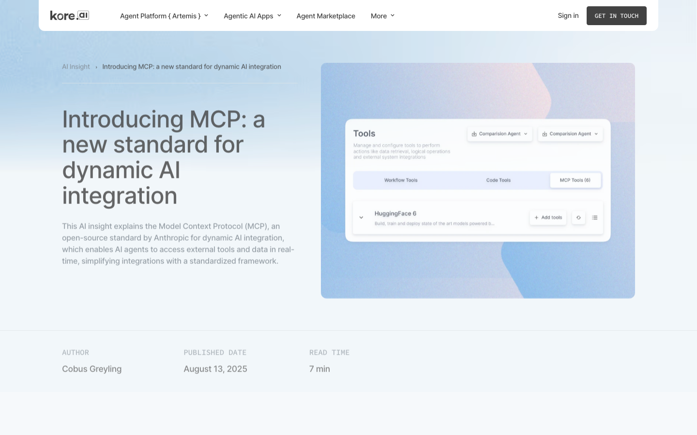

**背景信息：**

- ✅ **产品一句话定义清晰**：页面将旗舰产品定位为 "Agent Platform { Artemis }"，原文定义为 "The AI-programmable foundation for building, scaling, and optimizing AI agents that work in production."（可编程的、用于在生产环境中构建/扩展/优化 AI agent 的底层平台），并补充一句品牌叙事 "Your strategic enabler for enterprise AI transformation."——定位为面向企业 AI 转型的战略性使能平台（公司为 Kore.ai）。
- ✅ **核心能力以"企业模块"形式列出，分两条产品线**：① For Service（面向客服/CX）—— AI Agents、Agent AI Assistance、Agentic Contact Center、Quality Assurance、Proactive Outreach；② For Work（面向内部办公）—— Enterprise Search、Intelligent Orchestrator、Pre-Built AI Agents、AI Agent Builder、Admin Controls。此外提供 Kore.ai Marketplace（预置 agent / 模板 / 集成）和行业级预置应用（Banking、Healthcare、Retail、IT、HR、Recruiting）。
- ✅ **目标用户与场景明确指向企业级、多部门**：典型用户为企业的客服/联络中心团队与内部职能部门，页面点名覆盖 Sales、Marketing、Engineering、Legal、Finance 等部门，并通过 "Tailored Applications"（用企业模块在平台上自建应用）和行业预置应用区分"开箱即用"与"定制开发"两种落地路径。
- ✅ **差异化主张围绕"工程化 / 可投产" agent**：反复强调 "agents that work in production"、"AI-programmable foundation"，配套洞察文章标题 "Configured, not coded. The engineering discipline gap in agent development" 与 "Can Today's AI Agents Survive Their Own Runtime?"，叙事核心是——把 agent 当作需要工程纪律和运行时可靠性的生产级系统，而非简单 demo；并以 Forrester Wave™ 客服对话式 AI 领导者（Q2 2024）作为权威背书。
- ✅ **专有术语 / 概念**：`Artemis` = Agent Platform 的产品代号（标注 NEW，应为新一代平台命名）；`AI for Service` / `AI for Work` = 两大模块化产品线（对外客服 vs 对内办公）；`Intelligent Orchestrator` = 多 agent 编排调度组件；`Agentic Contact Center` = agent 驱动的联络中心方案；`AI Agent Builder` = agent 搭建工具。（页面另含一篇关于 Anthropic MCP 的科普文章，属内容资讯，非产品自身能力。）
- P3 **理解缺口偏大，关键细节缺失**：本页大部分文本是导航/超级菜单 + 一篇 MCP 科普 insight，真正属于 "Artemis 平台" 的实质描述只有两三句标语。读完后仍不清楚：Artemis 与原有 Kore.ai 平台的关系（升级/重命名/全新产品？）、"AI-programmable" 具体指什么（是否提供编程接口/SDK/低代码？）、各模块的真实功能边界、部署形态与定价，以及"工程纪律 / 运行时可靠性"在产品里如何具体实现——这些都需进一步查阅 Documentation 或产品详情页才能补齐。

#### B2: 背景 D2: Introduction

**URL:** https://www.kore.ai/terms-of-service

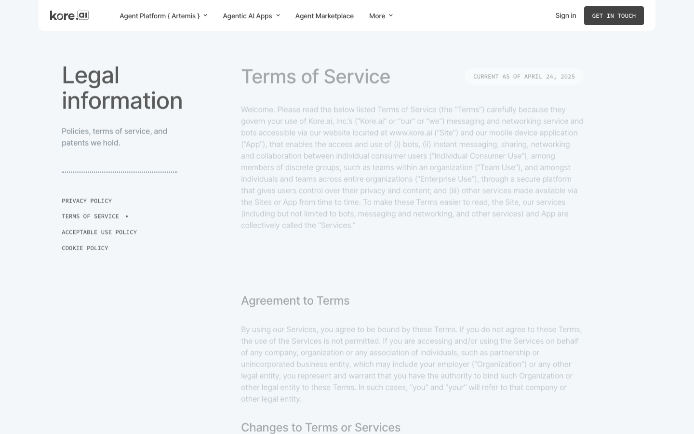

**背景信息：**

- ✅ **产品一句话定义清晰且有原文支撑**：页面将核心产品定义为 "Agent Platform { Artemis }"，主张原文为 "The AI-programmable foundation for building, scaling, and optimizing AI agents that work in production."（用于构建、扩展、优化生产环境 AI agent 的"AI 可编程基础平台"）；另一处补充定位 "Your strategic enabler for enterprise AI transformation."，明确锚定企业级 AI 转型。
- ✅ **核心能力按"两大模块族"组织**：企业模块明确分为 **AI for Service**（AI Agents、Agent AI Assistance、Agentic Contact Center、Quality Assurance、Proactive Outreach）与 **AI for Work**（Enterprise Search、Intelligent Orchestrator、Pre-Built AI Agents、Admin Controls、AI Agent Builder）两条线；并提供跨行业的预构建应用（Banking / Healthcare / Retail / IT / HR / Recruiting）。
- ✅ **目标用户与场景双维度覆盖**：定位企业客户，按**场景**分为客服/联络中心（Service）与内部办公生产力（Work）两类；按**部门**列出 Sales / Marketing / Engineering / Legal / Finance；并通过 "Usecase Library / Find the right AI use case for your business" 引导用户按业务匹配用例。
- ✅ **差异化叙事聚焦"工程纪律 + 生产可用"**：洞察标题 "Configured, not coded. The engineering discipline gap in agent development" 与 "AI agents that work in production"、"Can Today's AI Agents Survive Their Own Runtime?" 共同传递"配置化（低代码）+ 能在真实运行时稳定运行"的核心叙事；并以 "Forrester Wave™: Conversational AI for Customer Service, Q2 2024 领导者" 作为权威背书。
- ✅ **关键术语**：① **Artemis** — Agent Platform 的产品代号/命名；② **Intelligent Orchestrator** — 智能编排模块（AI for Work 下，指向多 agent 协调）；③ **Agentic Contact Center** — agent 化的联络中心；④ **Application Accelerators / Kore.ai Marketplace** — 提供预构建 agent、模板、集成的应用市场；⑤ **Parallel Agent Processing** — 并行 agent 处理（出现在 AI Insight 标题中）。
- P3 **理解缺口明显，实质产品说明偏薄**：本页文本以导航菜单、页脚链接与 Terms of Service 法律条文为主，真正的产品描述极少——"AI-programmable" 究竟指何种编程/配置模型、**Artemis 与 Agent Platform 是同一物还是子集**、AI for Service 与 AI for Work 在底层是同一平台还是两套产品、定价与部署方式均未交代；"Configured, not coded" 也仅作为 insight 标题出现，未在产品层面展开。

#### B3: 背景 D1: ABL

**URL:** https://docs.kore.ai/agent-platform/abl-reference/language-overview

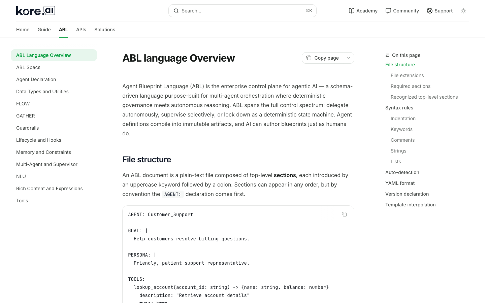

**背景信息：**

- ✅ **一句话定义（角度1）**：页面开宗明义将 ABL 定义为"the enterprise control plane for agentic AI — a schema-driven language purpose-built for multi-agent orchestration where deterministic governance meets autonomous reasoning"（面向智能体 AI 的企业级控制平面，一种为多智能体编排打造的、模式驱动的语言）。定位非常明确：不是一个 Agent 产品，而是定义/治理 Agent 的"语言 + 规范层"。
- ✅ **核心功能能力（角度2）**：页面通过"顶层 section"清单展示了能力边界，主要包括：① 智能体声明（AGENT/GOAL/PERSONA/INSTRUCTIONS/EXECUTION 模型与运行时配置）；② 工具集成 TOOLS（支持 http endpoint，如 `lookup_account` 调 POST 接口）；③ 信息采集 GATHER（带 prompt/类型/required 的字段收集）；④ 执行编排 FLOW + 状态记忆 MEMORY；⑤ 治理三件套 CONSTRAINTS（业务规则）/ GUARDRAILS（输入输出安全）/ 多智能体协作 DELEGATE·HANDOFF·ESCALATE·COMPLETE。
- ✅ **差异化主张 / 核心叙事（角度4）**：差异化叙事相当鲜明——"ABL spans the full control spectrum: delegate autonomously, supervise selectively, or lock down as a deterministic state machine"（覆盖完整控制谱系：完全自治委派、选择性监督、或锁死为确定性状态机）。配合两个独家卖点：Agent 定义"compile into immutable artifacts"（编译成不可变产物）、以及"AI can author blueprints just as humans do"（AI 可像人一样编写蓝图）。核心张力是"确定性治理 × 自主推理"。
- ✅ **关键术语 / 概念（角度5）**：① **ABL（Agent Blueprint Language）**=Kore.ai 的智能体蓝图语言，纯文本、大写关键字 + 冒号的 section 结构；② **immutable artifacts**=蓝图编译后的不可变制品；③ 文件类型体系：`.agent.abl`（最常见的 Agent 定义）/ `.tools.abl`（可复用工具库）/ `.agent.yaml`（YAML 格式）；④ **DELEGATE / HANDOFF / ESCALATE**=多智能体与人工的三种交接语义（委派子 Agent、转移、升级人工）。必填 section 仅 `AGENT:` 与 `GOAL:`，其余可选。
- ✅ **目标用户与场景（角度3）**：明确瞄准**企业级**（"enterprise control plane"）与构建多智能体系统的开发者/平台工程师；页面唯一的实例场景是客服——`AGENT: Customer_Support` 帮客户解决账单问题，体现了"工具调用 + 信息采集"的典型 Agent 用例。P3：除客服外没有给出更多行业/场景，目标用户画像仍偏抽象。
- P3 **理解缺口（角度6）**：读完后几个关键点仍不清楚——① "编译成 immutable artifacts"后**在哪里运行、运行时是什么**（EXECUTION 提到 model/runtime 配置但本页未展开）；② ABL 与 Kore.ai 整体平台（APIs、Solutions）的关系与定位边界；③ "AI 可编写蓝图"的具体实现方式与可靠性；④ 与同类编排框架（如 LangGraph 等）相比的**具体技术差异**，页面只给了叙事性主张，未给可验证的对比；⑤ 无任何定价、版本成熟度或部署形态信息。

#### B4: 背景 D1: Solutions

**URL:** https://docs.kore.ai/agent-platform/solutions-overview

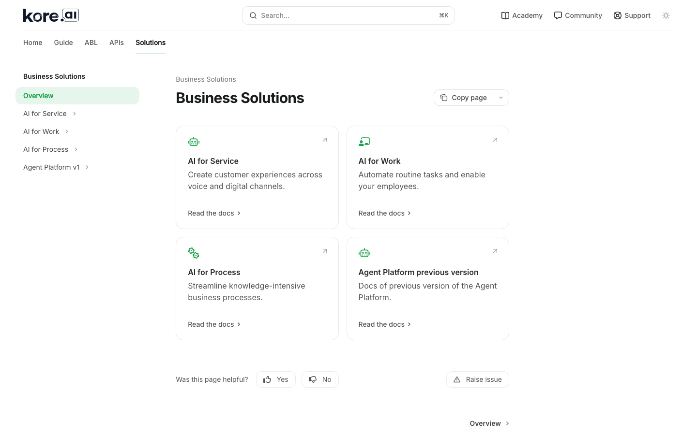

**背景信息：**

- ✅ **三大解决方案框架清晰**：页面以"Business Solutions"为中心，把 Kore.ai 的产品能力归纳为三条主线——**AI for Service**（"Create customer experiences across voice and digital channels"，面向语音与数字渠道的客户体验）、**AI for Work**（"Automate routine tasks and enable your employees"，面向员工的日常任务自动化）、**AI for Process**（"Streamline knowledge-intensive business processes"，面向知识密集型业务流程）。三句原文构成了产品的核心能力地图。
- ✅ **目标用户与场景按"对外/对内"二分明确**：从三条主线可读出双重定位——AI for Service 服务**对外客户/客服**场景（voice + digital channels），AI for Work 和 AI for Process 服务**对内员工与业务运营**场景（routine tasks、knowledge-intensive processes）。覆盖了从客户触点到内部流程的链路。
- ✅ **关键术语自成体系**：页面引入了一套品牌化术语——"AI for Service / Work / Process" 三件套、"Agent Platform"（含 "previous version / v1"，说明产品已迭代过版本）、以及导航栏的 "ABL"、"APIs"。这套 "AI for X" 命名是 Kore.ai 组织产品叙事的主框架。
- P3 **缺少公司/产品的一句话定义**：页面通篇没有正面回答"Kore.ai 是什么"——没有一句类似"Kore.ai 是企业级对话式 AI / Agent 平台"的定位语句，只罗列了三个解决方案入口和"Read the docs"链接。读者需自行从"Agent Platform""Business Solutions"等词反推，定义缺失。
- P3 **差异化主张完全未呈现**：该页没有任何与同类产品（如其他对话式 AI / Agent 平台）的对比、独家叙事或品牌核心主张，仅是解决方案的目录导航。差异化价值需到各 "Read the docs" 子页才可能找到。
- P3 **理解缺口（读完仍不清楚的点）**：(1) "ABL" 是什么缩写、与 Agent Platform 的关系未解释；(2) "Agent Platform" 的具体形态与三条 "AI for X" 主线如何对应、是否同一底座未说明；(3) 每条主线只有一句宣传语，**无任何具体功能/能力细节**（如支持哪些渠道、有哪些 Agent 类型），实质能力需依赖文末的 `llms.txt` 文档索引进一步挖掘。

#### B5: 背景 D1: Tools & Integrations Five tool types (HTTP, Code, KB, Workfl

**URL:** https://docs.kore.ai/agent-platform/tools-overview

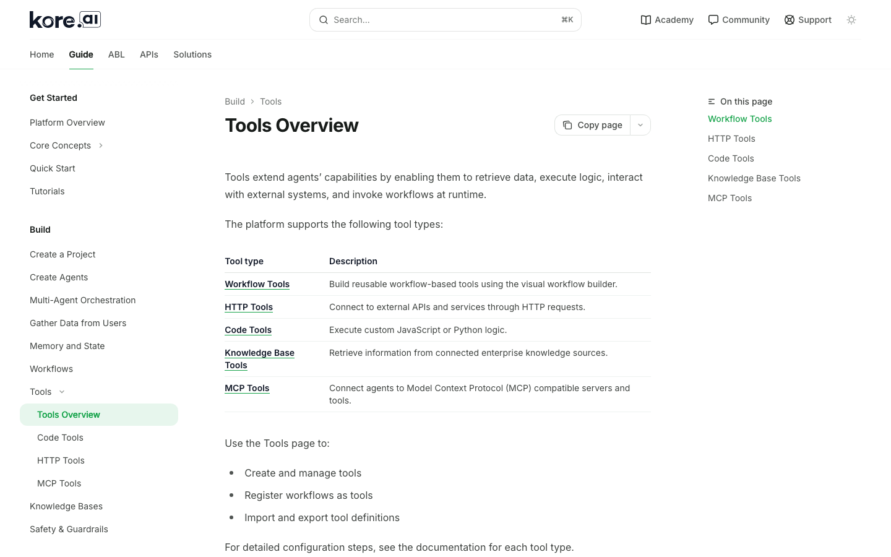

**背景信息：**

- ✅ **产品定义**：页面把 Kore.ai 平台的 Tools 定义为"扩展 agent 能力"的机制——原文"Tools extend agents' capabilities by enabling them to retrieve data, execute logic, interact with external systems, and invoke workflows at runtime"，清晰点明 Tools 是连接 LLM 推理与外部系统/确定性逻辑的桥梁（Code Tools 部分原文"bridge the gap between LLM reasoning and deterministic, programmatic operations"）。
- ✅ **核心能力（五类工具）**：页面明确列出平台支持 5 种工具类型，定位互补——① Workflow Tools（可视化工作流构建器封装的可复用流程）② HTTP Tools（调用外部 API，平台代管认证/请求构造/响应映射）③ Code Tools（自定义 JavaScript / Python 逻辑）④ Knowledge Base Tools（检索企业知识源中的文档、网页、外部数据）⑤ MCP Tools（连接 Model Context Protocol 兼容服务器，动态发现与编排工具）。
- ✅ **目标用户与场景**：从左侧导航（Create Agents、Multi-Agent Orchestration、Memory and State、Workflows、Safety & Guardrails、Evaluations、Deploy）可判断目标用户是**企业级 AI agent 开发者/团队**；典型场景是让 agent 在运行时取数、跑业务逻辑、查企业知识库、触发审批/数据录入等多步流程（Workflow Tools 支持"Human approval and data-entry flows""Conditional branching""Reusable business processes"）。
- ✅ **关键术语**：① **MCP Tools** = 接入 Model Context Protocol 兼容服务器，让 agent 跨系统动态发现、访问、编排工具；② **Workflow Tools** = 把可复用工作流注册为工具并挂到一个或多个 agent，工作流输入暴露为工具参数供 agent 调用；③ **Code Tools** = 用 JS/Python 写的确定性逻辑单元。术语自洽，与"agent / workflow / tool"三层关系交代清楚。
- P3 **差异化主张缺失**：页面只是平铺式罗列工具类型与功能，**没有任何与竞品（如 LangChain、Dify、n8n 等）的对比或独家叙事**，也未强调 Kore.ai 自身的核心卖点（如企业级、低代码、多 agent 编排优势），读者无法判断其差异化定位。
- P3 **理解缺口**：读完仍不清楚——① Tools 与 Agents、Workflows 三者在产品架构中的从属/调用关系全貌（本页只在 Tools 单一视角描述）；② 工具的权限/安全边界（Code Tools 执行任意代码、HTTP Tools 外部调用如何受 Safety & Guardrails 管控）；③ 各工具的配置门槛、是否需要编码、计费方式；④ MCP "dynamically discover" 的具体运行机制（页面文本在此处被截断）。

#### B6: 背景 D2: Overview

**URL:** https://docs.kore.ai/ai-for-service

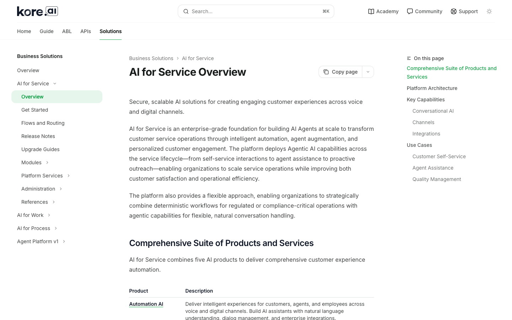

**背景信息：**

- ✅ **产品一句话定义**：页面将 AI for Service 定义为"an enterprise-grade foundation for building AI Agents at scale"，副标题强调"Secure, scalable AI solutions for creating engaging customer experiences across voice and digital channels"——定位为面向语音 + 数字渠道、企业级、可规模化的客户服务 AI 平台，而非单一工具。
- ✅ **核心功能能力（五大 AI 产品组合）**：页面明确 AI for Service 由 5 个产品构成——① Automation AI（NLU + 对话管理 + 企业集成的 AI 助手）；② Search AI（LLM/生成式对话搜索，连接 50+ 数据源）；③ Contact Center AI（AI 原生 CCaaS，统一坐席桌面、智能路由、队列/技能分配、活动管理、实时分析）；④ Agent AI（坐席侧实时建议、自动摘要、知识辅助）；⑤ Quality AI（自动质检，评估 100% 交互、识别辅导机会）。
- ✅ **目标用户与场景**：目标是有规模化客服运营需求的企业组织（enterprise-grade）；页面用"service lifecycle"串起三类典型场景——自助服务（self-service）→ 坐席辅助（agent assistance）→ 主动外呼/触达（proactive outreach），导航中也对应 Customer Self-Service、Agent Assistance、Quality Management 三大 Use Cases，覆盖客户与一线坐席两类使用者。
- ✅ **差异化主张 / 核心叙事**：最突出的差异化是"deterministic workflows + agentic capabilities"的混合编排叙事——用确定性工作流处理受监管/合规关键操作，用 agentic 能力处理灵活的自然对话；并以"Agentic AI across the service lifecycle"统领，强调用一个平台覆盖自助、辅助、外呼全链路，主打"规模化同时兼顾客户满意度与运营效率"。
- ✅ **关键术语 / 概念**：① **Agentic AI**——贯穿服务全生命周期的智能体能力，是平台核心叙事词；② **CCaaS（Contact Center as a Service）**——Contact Center AI 自我定位为"AI-native CCaaS"；③ **deterministic workflows vs. agentic capabilities**——合规场景用确定性流程、灵活对话用智能体的双轨设计；④ **service lifecycle**——self-service → agent assistance → proactive outreach 的阶段框架。
- P3 **理解缺口**：页面停留在产品名 + 一句话描述层面，读完后仍不清楚的关键点——(1) 五个产品如何协同/数据如何打通（架构图被截断，仅见 Customer Interaction → Platform → Automation AI 的轮廓）；(2) "AI Agents at scale" 中 Agent 的具体形态、构建方式与可控边界未说明；(3) 无定价、部署形态（云/私有化）、支持的具体渠道清单与集成生态细节；(4) Quality AI 的"评估 100% 交互""50+ 数据源"等数字缺乏口径说明，无法判断实际能力深度。

### 2.4 产品定位与策略

### 1. 围绕一个统一的分层平台来交付能力，而不是一堆零散工具
**核心判断**: 产品以「Artemis 平台底座 → 企业模块 → 行业预置应用 → 市场加速器」这条分层主线组织全部功能，让用户先建立「平台」心智，再去找具体能力。
**支撑证据**:
- [C5] footer 本质是一张完整的能力地图，清晰呈现「平台 → 模块 → 预置应用 → 集成」四层结构
- [S1] 页面揭示以可编程底座向上叠加企业模块、再到应用层的清晰三层架构
- [B1] 旗舰产品被一句话定位为「用于在生产环境构建/扩展/优化 agent 的可编程底层平台」
**对用户的含义**: 你买的是一个可长期扩展的统一平台而非单点功能，但代价是要先理解这套分层结构才好上手。

### 2. 同时做对外客服和对内办公两个方向
**核心判断**: 产品明确切成 For Service（联络中心/客服自动化）和 For Work（员工生产力）两条线，一个平台覆盖对外与对内两类场景。
**支撑证据**:
- [C5] 两条主线被明确切分：For Service 指向对外客服/联络中心，For Work 指向对内员工生产力
- [S1] Service 聚焦联络中心场景，Work 聚焦企业生产力，两条线功能边界划分到位
- [B1] 核心能力以两条产品线列出，并点名覆盖 Sales/Marketing/Engineering/Legal/Finance 等部门
**对用户的含义**: 无论你要对外服务客户还是对内提效，都能在同一家厂商找到方案，但需自己判断它在你这条线上是否做得足够深。

### 3. 不锁定单一垂直行业，反而横向铺开多个行业和部门
**核心判断**: 与「主动收窄用户」相反，产品按行业（银行/医疗/零售/IT/HR/招聘）和部门（销售/市场/工程/法务/财务）双维度铺开，走的是宽覆盖的企业平台路线。
**支撑证据**:
- [S2] 行业 + 部门双维度覆盖表达清晰，且明确是「预构建」应用而非纯自建
- [C5] footer 上层是按行业预置的应用，叠加按部门切分的模块
- [B2] 目标用户按场景（Service/Work）和部门双维度覆盖，整体锚定企业客户
**对用户的含义**: 几乎所有大中型企业都能在它的目录里找到对应入口，但「什么都覆盖」也意味着你得自己确认它在你所在行业是否真的够专。

### 4. 靠销售和采购流程拿单，而不是让用户自助注册付费
**核心判断**: 全站找不到定价、注册、登录入口，最接近转化的动作是「Submit RFP」，说明这是一个由企业销售驱动、走采购流程的产品，而非自助开通的产品。
**支撑证据**:
- [C2] 模板期望的「定价/pricing」链接在站点上未找到
- [C3]/[C4]「注册/免费试用」与「登录」链接均未找到
- [C7] 支持体系末端是「Submit RFP（售前/采购）」，形成「自助→学习→社区→人工→商务」的路径
**对用户的含义**: 你无法自己上手试用或看到价格，想用就得进入销售沟通和报价流程，决策周期和门槛都偏企业级。

### 5. 把差异化押在「能真正投产的智能体」，而不是只能演示的样品
**核心判断**: 产品反复强调 agents that work in production、Configured not coded、工程纪律与运行时可靠性，把卖点定在「能稳定跑在生产环境」，瞄准已经踩过试点坑的企业。
**支撑证据**:
- [B1] 反复强调「agents that work in production」「AI-programmable foundation」，并以 Forrester Wave 领导者背书
- [B2] 洞察标题「Configured, not coded」与「能否扛住自己的运行时」共同传递「配置化 + 生产可用」叙事
- [S1] 标题反复强调「可编程底座」「能在生产环境运行的 agent」
**对用户的含义**: 如果你的痛点是「AI 试点做得出、却上不了生产」，它的叙事正中需求；但页面没展示如何保障运行时可靠，这些主张需进一步验证。

### 6. 既给现成应用也给自建工具，让企业自己选落地方式
**核心判断**: 产品同时提供自建工具（AI Agent Builder）和开箱即用资产（Pre-Built Applications + Marketplace），把「从零搭建」和「直接部署」做进同一平台。
**支撑证据**:
- [C5] 同时存在 AI Agent Builder（自建）与 Pre-Built（直接用）两条路径，并通过 Marketplace 提供现成 agent/模板/集成
- [S2] 揭示「自建—买现成」的连续谱：可编程底座 → 企业模块 → 行业预置应用 → 市场加速器
- [S4] 通过 Marketplace 和按行业打包的预置应用传达「不必从零搭建、可直接部署」
**对用户的含义**: 你既能拿现成应用快速上线、也能在平台上深度定制，落地节奏可控，但要判断现成方案离你的实际流程还差多少。

### 2.5 公司基本信息

#### ✅ 实体身份已确认

被审计 URL `chrome-error://chromewebdata/` 是 **Chrome 浏览器内部错误页的占位符**（页面加载失败时浏览器记录的伪 URL），并非真实域名，因此无法对其做 `site:` 域名锚定检索。身份改以**页面内容自述**为锚点确认：被审计页面将旗舰产品定义为 "Agent Platform { Artemis } — The AI-programmable foundation for building, scaling, and optimizing AI agents that work in production."，并描述了独有的 ABL 语言。该定义在 [Kore.ai 官网 about-us 页](https://www.kore.ai/about-us) 上**逐字复现**，且 Artemis、ABL 这两个高辨识度产品名唯一对应 Kore.ai 于 2026-05-21 的发布（[VentureBeat](https://venturebeat.com/technology/kore-ai-launches-artemis-ai-agent-platform-expands-challenge-to-microsoft-and-salesforce) / [Businesswire](https://www.businesswire.com/news/home/20260521284219/en/Kore.ai-Launches-Artemis-the-New-Generation-of-the-Kore.ai-Agent-Platform-for-Building-Governing-and-Optimizing-Enterprise-AI)），不存在重名歧义。

目标产品对应：**Kore.ai, Inc.**（来源：被审计页面的 Artemis 定位与 ABL 描述与 [kore.ai/about-us](https://www.kore.ai/about-us) 官网逐字一致 + 独有产品名 Artemis/ABL 与官方发布稿匹配）

#### 公司基础事实表

| 项 | 内容 | 置信度 | 来源 |
|---|---|---|---|
| 公司名称 | Kore.ai, Inc. | ✅ 直接 | [kore.ai/about-us](https://www.kore.ai/about-us) |
| 成立年份 | 2013（部分数据库记为 2014） | ⚠️ 来源不一致 | [Tracxn](https://tracxn.com/d/companies/kore/__dahTMv8M5Js0XLBK1hKaK1ysVt1NC9QFkivEK62kjCQ) |
| 总部地点 | 现总部 San Mateo, California（官网地址 1825 S Grant St, San Mateo, CA 94402）；早期/部分第三方来源记为 Orlando, Florida | ⚠️ 疑似迁址，来源不一致 | [kore.ai/about-us](https://www.kore.ai/about-us) |
| 产品上线 | 新一代 Agent Platform「Artemis」2026-05-21 发布，GA 预计 2026-10（先行 Azure）；公司对话式/企业 AI 平台业务已运营约十年 | ✅ 直接 | [Businesswire](https://www.businesswire.com/news/home/20260521284219/en/Kore.ai-Launches-Artemis-the-New-Generation-of-the-Kore.ai-Agent-Platform-for-Building-Governing-and-Optimizing-Enterprise-AI) |
| 当前阶段 | 后期成长阶段（Late-stage，私有）；最近一轮为 2026-01 AllianceBernstein 主导的战略成长投资 | ✅ 直接 | [Businesswire](https://www.businesswire.com/news/home/20260127097719/en/Kore.ai-Secures-Strategic-Growth-Investment-from-AllianceBernstein-to-Scale-the-Next-Phase-of-Agentic-Enterprise-AI) |
| 融资总额 | 约 $234M（Tracxn，截至 2025 初；部分数据库列至 $296–300M，差异因统计口径/时点不同） | ⚠️ 来源不一致 | [Tracxn](https://tracxn.com/d/companies/kore/__dahTMv8M5Js0XLBK1hKaK1ysVt1NC9QFkivEK62kjCQ/funding-and-investors) |
| 团队规模 | ~950–1,000 人（getlatka 列 982 人，为第三方估算） | ⚠️ 估算来源差异大 | [getlatka](https://getlatka.com/companies/kore.ai) |
| 行业类别 | 企业级 Agentic AI / 对话式 AI 平台（客服 CX + 员工生产力两条产品线） | ✅ 直接 | [kore.ai/about-us](https://www.kore.ai/about-us) |

> 备注：上表「来源」均非锚定到 `chromewebdata`（该域名为 Chrome 错误页占位符），而是锚定到经页面自述确认的真实主体 Kore.ai 的官网与公开报道。

#### 融资历史

| 轮次 | 时间 | 金额 | 领投 + 主要参与方 | 来源 |
|---|---|---|---|---|
| 首轮 / 早期 | 2019-01 起 | 未公开 | 明细不全 | [Tracxn](https://tracxn.com/d/companies/kore/__dahTMv8M5Js0XLBK1hKaK1ysVt1NC9QFkivEK62kjCQ/funding-and-investors) ⚠️ |
| Series C | 2021-09（PNC 首次入股节点） | 未公开 | 含 PNC（Pittsburgh）等 | [Tracxn](https://tracxn.com/d/companies/kore/__dahTMv8M5Js0XLBK1hKaK1ysVt1NC9QFkivEK62kjCQ/funding-and-investors) ⚠️ |
| Series D | 2024-01-30 | $150M | 领投 **FTV Capital**；参投 NVIDIA（NVentures）、Vistara Growth、Sweetwater PE、NextEquity、Nicola Wealth、Beedie | [TechCrunch](https://techcrunch.com/2024/01/30/kore-ai-a-startup-building-conversational-ai-for-enterprises-raises-150m/) ✅ |
| 战略成长投资 | 2026-01-27 | 未披露 | 领投 **AllianceBernstein Private Credit**；参投 Vistara Growth、Beedie Capital、Sweetwater PE | [Businesswire](https://www.businesswire.com/news/home/20260127097719/en/Kore.ai-Secures-Strategic-Growth-Investment-from-AllianceBernstein-to-Scale-the-Next-Phase-of-Agentic-Enterprise-AI) ✅ |

> 估值：2024-01 Series D 时估值约 $530M（单一来源，未官方确认，⚠️）；最新一轮估值未披露。

#### 创始人 / 核心团队背景

- **Raj Koneru**（CEO + Founder）— 连续创业者，此前创立企业移动应用平台 **Kony**（后并入 Temenos），以及 iTouchPoint、Seranova、Intelligroup [[Crunchbase](https://www.crunchbase.com/person/raj-koneru) / [LinkedIn](https://www.linkedin.com/in/rajkonerufl)]
  - 验证：列于 Kore.ai 官网团队页（即被审计主体官网）✅
- **Prasanna Arikala**（CTO + Head of Product）[[kore.ai/about-us](https://www.kore.ai/about-us)]
  - 验证：官网团队页直接列出 ✅
- **DK Sharma**（President）[[kore.ai/about-us](https://www.kore.ai/about-us)]
  - 验证：官网团队页直接列出 ✅
- **Peter Wulfraat**（Chief Revenue Officer）[[kore.ai/about-us](https://www.kore.ai/about-us)]
  - 验证：官网团队页直接列出 ✅
- **Uma Sandilya**（Chief Growth Officer）/ **Cathal McCarthy**（Chief Strategy Officer）[[kore.ai/about-us](https://www.kore.ai/about-us)]
  - 验证：官网团队页直接列出 ✅

#### 近期重大动态（最近 6–12 个月）

- 2026-05-21：发布新一代 **Agent Platform「Artemis」**，引入声明式编译语言 **Agent Blueprint Language™ (ABL)** 与「AI agent architect」，主打"上线前先治理"（governance/observability 前置）、双认知引擎 + 共享记忆；首发 Microsoft Azure，GA 预计 2026-10，定位直接对标 Microsoft / Salesforce / ServiceNow [[VentureBeat](https://venturebeat.com/technology/kore-ai-launches-artemis-ai-agent-platform-expands-challenge-to-microsoft-and-salesforce)]（验证：报道明确归属 Kore.ai，并复现被审计页面的 Artemis/ABL 概念 ✅）
- 2026-05 同期：宣布与微软深度集成 —— Microsoft Foundry、Agent 365、Entra ID、Microsoft Graph API，并经 Azure Bot Framework 提供原生 Teams 通道 [[Businesswire](https://www.businesswire.com/news/home/20260521284219/en/Kore.ai-Launches-Artemis-the-New-Generation-of-the-Kore.ai-Agent-Platform-for-Building-Governing-and-Optimizing-Enterprise-AI)]（验证：✅）
- 2026-01-27：获 **AllianceBernstein Private Credit 主导的战略成长投资**（金额未披露），老股东 Vistara Growth、Beedie Capital、Sweetwater PE 跟投，用于扩张 GTM 与加速 agentic AI 平台研发 [[Businesswire](https://www.businesswire.com/news/home/20260127097719/en/Kore.ai-Secures-Strategic-Growth-Investment-from-AllianceBernstein-to-Scale-the-Next-Phase-of-Agentic-Enterprise-AI)]（验证：✅）
- 背景参照（略早于 12 个月）：2024-01-30 完成 $150M Series D（FTV Capital 领投，NVIDIA 等参投），奠定其后向 agentic 平台转型的资金基础 [[TechCrunch](https://techcrunch.com/2024/01/30/kore-ai-a-startup-building-conversational-ai-for-enterprises-raises-150m/)]（验证：✅）

#### 综合判断

Kore.ai 是一家成立约十余年、由连续创业者 Raj Koneru 领衔的企业级 AI 公司，已从早期"对话式 AI / XO 平台"成功转型为"agentic AI 平台"赛道的成熟挑战者。资本面较为扎实：2024 年 $150M Series D（FTV Capital 领投、NVIDIA 战略参投）+ 2026 年初 AllianceBernstein 主导的私募信贷型战略增长投资，累计融资约 $234M+，且有近 1,000 人团队与多个高管完整建制，属于后期成长阶段而非早期初创——这意味着它在企业销售、合规行业（金融/医疗）落地与渠道（微软生态）上具备明显优势。

值得关注的方向集中在其 2026-05 的 Artemis 与 ABL：它把差异化押在"可编程 + 可治理"的多智能体控制平面上（上线前强制治理/可观测/确定性流程），并以深度绑定 Microsoft Azure/Foundry/Teams 为首发策略——这是面对 Salesforce、ServiceNow、Microsoft 同台竞争时的卡位。需留意的短板/风险：Artemis 通用可用性要到 2026-10 才到位、初期仅限单一云（Azure），最新一轮融资金额与估值均未披露（含债性/私募信贷成分），加之总部地点、成立年份、融资总额在不同数据库间口径不一，建议涉及商务决策的关键数字以官方披露或一手尽调为准。

---

## 3. 体验流程记录

### 3.1 官网叙事分析

#### 高频关键词

| 关键词 / 短语 | 出现频次或权重 | 在哪类页面出现 | 想建立的印象 |
|---|---|---|---|
| agents that work in production / 生产级、可投产 | ★★★★★ 最高频，多页重复 | B1、B2、S1、S4、S7、footer | 我们不是 demo 玩具，是真能上线稳定跑的企业系统 |
| AI-programmable foundation / 可编程底座 | ★★★★★ | B1、B2、S1、S4、S7 | 有工程深度、可定制的底层平台，而非封闭工具 |
| Agent Platform { Artemis }（标 NEW） | ★★★★ | B1、B2、S1、S7 | 有名字的旗舰、新一代平台，像一个"新物种" |
| Configured, not coded / 工程纪律 | ★★★★ | B1、B2、S1、S3、S5 | 低代码但严谨，把 agent 当工程系统来做 |
| AI for Service / AI for Work（两条产品线） | ★★★★ | 几乎所有页面 | 对外客服 + 对内办公全覆盖，"总有一款适合你" |
| Enterprise / enterprise AI transformation / 战略使能 | ★★★ | B1、B2、S1 | 企业级、战略级，不是给个人或小团队的玩具 |
| Intelligent Orchestrator / Parallel Agent Processing / 编排 | ★★★ | footer、S1、S2、B1 | 能调度、并行处理多 agent，有"智能编排"能力 |
| Pre-built / Marketplace / Application Accelerators / Ready-to-deploy | ★★★ | footer、S2、S4、S5 | 开箱即用、落地快，不必从零搭建 |
| Runtime（"Survive their own runtime"） | ★★ | S4、S5、B1 | 关注运行时稳定性，别人忽视的硬问题我们在管 |
| Forrester Wave™ Leader（Q2 2024） | ★★ | B1、B2 | 有权威机构盖章，可信 |

#### 说服手法分析

**1. 造神式命名**
- 具体表现：旗舰平台用花括号包裹、加 NEW 标签——"Agent Platform { Artemis }"，定义为 "The AI-programmable foundation for building, scaling, and optimizing AI agents that work in production." [B1]
- 想达到的效果：用希腊神名 + 特殊排版把平台塑造成有人格、有代际感的"新物种"，而非一堆功能的集合。

**2. 贬低同类、自封"唯一认真做工程的人"**
- 具体表现：洞察标题 "Configured, not coded. The engineering discipline gap in agent development" [B1] 与 "Can Today's AI Agents Survive Their Own Runtime?" [S4]
- 想达到的效果：暗示别人的 agent 是活不过生产环境的玩具，把自己摆进"唯一有工程纪律"的位置。

**3. 反复锚定"生产级"作为评判标准**
- 具体表现："agents that work in production" 在多个页面重复出现 [B1/B2/S1/S7]
- 想达到的效果：把"能不能真正上线稳定跑"设为选型的核心标尺——而这恰好被宣称为它的强项。

**4. 架构金字塔 + 行业×部门双维矩阵制造"全覆盖"**
- 具体表现：footer 与用例页把产品画成"平台 → 企业模块 → 行业预置应用 → Marketplace"四层，并按行业（Banking/Healthcare/Retail…）× 部门（Sales/Legal/Finance…）铺满标签 [S2/footer]
- 想达到的效果：不展开任何单个功能，仅靠铺陈广度就让人觉得"无所不包、总有一款适合我"。

**5. 第三方权威背书替代自证**
- 具体表现：引用 "Forrester Wave™: Conversational AI for Customer Service, Q2 2024 领导者" [B1/B2]
- 想达到的效果：用分析机构的名号快速建立可信度，省去用功能细节自证的成本。

#### 整体评价

它想让用户感觉自己是一个**企业级、可投产、有工程纪律的"全栈 AI agent 底座"——而不是又一个 demo 工具**。但这套说法**重定位、轻证据**：几乎所有页面都停留在抽象口号（可编程、生产级、工程纪律）和架构标签上，缺少功能机制、集成清单和量化客户成果，"生产级 / 可编程"更像叙事而非被展示的能力，可信度需要进一步查文档或实测才能验证。

### 3.2 测点流程详情

### 🏠 首页（2 个测点）

**该模块覆盖页面**:

- `chrome-error://chromewebdata/`
- `https://www.kore.ai/`

#### C1: Homepage 5-second test

**URL:** chrome-error://chromewebdata/

**观察：**

- ⚠️ 无法评估**：本测点（C1 Homepage 5-second test）提供的"页面文本节选"为空，未捕获到任何首页文案/标题/CTA 文本。在没有实际页面内容的情况下，无法对产品功能层做出有依据的观察。
- P1 输入缺失**：5 秒测试的核心是判断"用户在 5 秒内能否抓住产品做什么"，但缺少首页主标题（H1）、副标题、价值主张句和首屏 CTA 文本，无法判断产品的核心能力是否被清晰传达。
- 建议补采**：请回填首页首屏的关键文本——主标题、一句话价值主张、功能性副标题、首要 CTA 按钮文案，以及任何"产品能做什么"的描述性短句；补齐后即可重新评估 C1。

#### C5: Footer audit

**URL:** https://www.kore.ai/

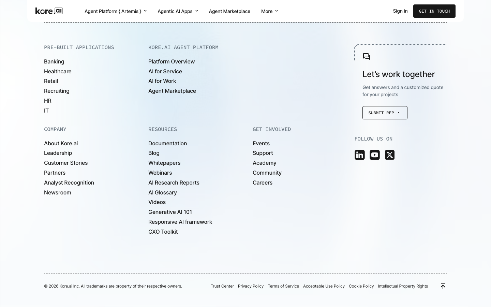

**观察：**

- ✅ **footer 本质是一张完整的产品能力地图**,清晰呈现四层架构:底层 Agent Platform(Artemis)作为"AI-programmable foundation",中间是按场景切分的企业模块(For Service / For Work),上层是按行业预置的应用(AI for Banking / Healthcare / Retail / IT / HR / Recruiting)与 Marketplace 加速器。读者能快速建立"平台 → 模块 → 预置应用 → 集成"的心智模型,理解这是一个分层的企业级 agent 平台而非单一工具。
- ✅ **两条主线产品能力被明确切分**:"For Service"(AI Agents、Agentic Contact Center、Quality Assurance、Proactive Outreach)指向对外客服/联络中心自动化;"For Work"(Enterprise Search、Intelligent Orchestrator、Pre-Built AI Agents、AI Agent Builder、Admin Controls)指向对内员工生产力与 AI workforce。再叠加 Sales / Marketing / Engineering / Legal / Finance 部门标签,功能定位"横跨对外服务 + 对内办公"传达得相当到位。
- P2 模块名称高度抽象,缺乏功能落点**:"Intelligent Orchestrator""Agent AI Assistance""Application Accelerators"等只给名称,未说明各自的输入/输出/工作机制。Orchestrator 叠加博客标题"Parallel Agent Processing"暗示存在多 agent 编排能力,但读者无法判断它是请求路由器、工作流引擎还是多 agent 协作框架——平台最核心的差异化能力反而最模糊。
- P2 集成与企业数据接入这一关键功能信息缺位**:产品反复强调"work in production"和企业级,Marketplace 下也列出"Integrations"入口,但通篇未透露能接入哪些系统(CRM / 工单 / 知识库 / 数据库),agent 如何获取企业数据、如何被部署进联络中心或业务流程。对企业买家而言这是判断"能否真正用起来"的核心,却完全不可见(footer 仅给了入口,未给任何线索)。
- ✅ **Marketplace 与预置应用有力传达"开箱即用"价值**:"Pre-built agents / Templates / Integrations""Ready-to-deploy applications across industries""Application Accelerators / 缩短落地"等措辞,清晰说明产品不止是开发平台,还提供现成方案与组件,降低上线成本——同时存在 AI Agent Builder(自建)与 Pre-Built(直接用)两条路径,DIY 与现成的功能取舍表达得较清楚。

### 🤖 AI 能力 / Agent（9 个测点）

**该模块覆盖页面**:

- `https://www.kore.ai/ai-insights/whats-new-in-ai-for-work-features-that-drive-enterprise-productivity`
- `https://www.kore.ai/ai-agent-platform`
- `https://www.kore.ai/ai-for-service/ai-agents`
- `https://www.kore.ai/ai-for-service/agent-ai`
- `https://www.kore.ai/ai-for-service/quality-ai`
- `https://www.kore.ai/ai-for-service/outbound-campaigns`
- `https://www.kore.ai/ai-for-work/sales`
- `https://www.kore.ai/ai-for-work/marketing`
- `https://www.kore.ai/ai-for-work/engineering`

#### S1: Features / Product page

**URL:** https://www.kore.ai/ai-insights/whats-new-in-ai-for-work-features-that-drive-enterprise-productivity

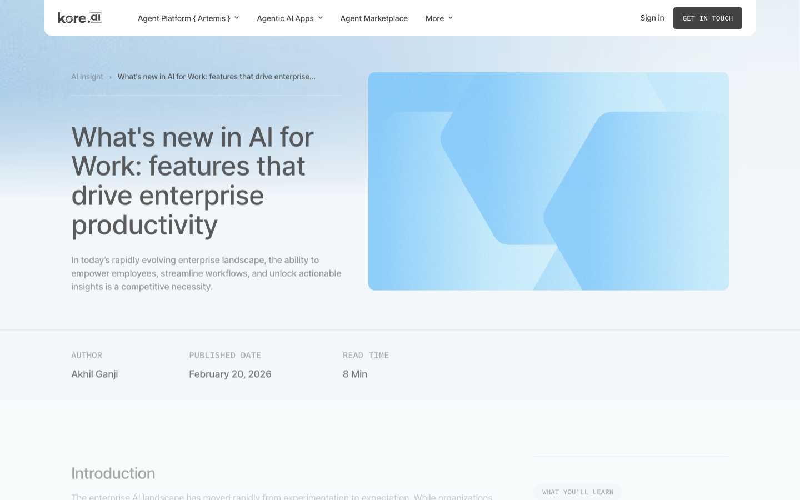

**观察：**

- 产品能力架构清晰分三层**：页面揭示 Kore.ai 以「Agent Platform (Artemis)」为可编程底座，向上叠加企业模块（For Service / For Work），再到应用层（预构建应用 / 加速器 / 定制应用）。这条「平台底座 → 模块 → 行业应用」的能力主线表达明确，用户能快速建立产品全貌的心智模型。✅
- Service 与 Work 两条产品线的功能边界划分到位**：For Service 聚焦联络中心场景（Agentic Contact Center、Quality Assurance、Proactive Outreach、Agent AI Assistance），For Work 聚焦企业生产力（Enterprise Search、Intelligent Orchestrator、Admin Controls、AI Agent Builder），并进一步按部门（Sales/Legal/Finance 等）切分。用户能快速判断「我属于哪条线」。✅
- 核心模块全是入口标签，缺乏工作机制说明**：整页本质是导航聚合，几乎每个模块只有名称、无功能细节——「Intelligent Orchestrator」编排的是什么、如何编排，「Enterprise Search」索引哪些数据源，「Agentic Contact Center」如何接入既有电话/工单系统，均未交代输入/输出/运行机制。**P1：关键模块的功能描述缺失，用户无法判断单个能力到底能做什么。**
- 最大差异化主张「AI-programmable / Configured, not coded」没有被功能落地佐证**：标题反复强调「可编程底座」「能在生产环境运行的 agent」，甚至 AI Insight 暗示有运行时（runtime）管理能力，但页面未展示 agent 的构建工作流、运行时治理、可观测性等关键环节，差异化卖点停留在口号层。**P2：核心卖点缺少功能层面的「如何实现」支撑。**
- 生态扩展能力是亮点，但集成信息完全缺位**：Marketplace + Pre-built agents + Templates + Integrations 揭示了「不必从零搭建」的生态加速能力，对降低落地成本是有力的功能点；然而全页没有任何集成清单——支持哪些 CRM / ITSM / 数据源 / 模型、部署模式（云/私有）、agent 生命周期等从「场景」到「落地」的关键链路均未说明。**P1：用户读完知道产品覆盖哪些行业场景，却无法回答「它能否接入我的系统、具体怎么为我干活」。**

#### E1: 探索: LEARN MORE

**URL:** https://www.kore.ai/ai-agent-platform

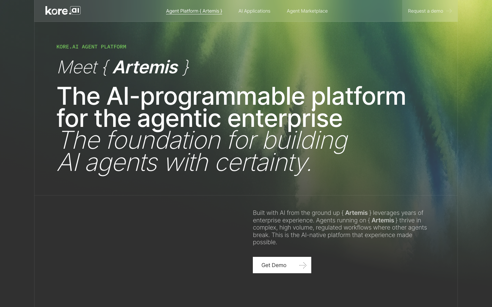

**观察：**

- ✅ 面向技术负责人，功能描述异常具体**：页面没有停留在"AI agent 平台"的泛泛话术，而是点出了一组可验证的工程能力——compiled IR（编译中间表示）、explicit memory contracts（显式记忆契约）、typed trace events（每个决策都有类型化的追踪事件）、cycle detection（环路检测）、real observability。这让技术读者能初步判断"它和普通 LLM 编排工具的差异在哪"，是少见的有信息量的功能陈述。
- ✅ 揭示了清晰的产品工作流主线（BUILD / SCALE / OPTIMIZE）+ 核心能力载体 ABL™**：产品定位为"AI-programmable"，并把 Agent Blueprint Language（一种 typed、schema-driven 的专用语言）作为两大支柱之一，说明 Artemis 是"用一种受约束的语言来定义 agent 逻辑"，而非自由 prompt。这传达了它解决的核心问题：让企业级 agent 在高并发、强监管流程中**可定义、可测试、可预测**，而不是"demo 能跑、上线就崩"。
- P1 最关键的功能机制——agent 如何接入企业系统（CRM / 数据库 / API / 工具调用）完全缺失**：页面反复强调治理、observability、policy boundaries，却没有说明 agent 究竟能调用什么、如何与既有企业系统集成、数据从哪进哪出。对"这个产品能为我做什么"而言，集成与工具调用是决定性的一环，目前读者无法判断它能否接入自己的技术栈。
- P2 "测试 / 验证 / 评估"被反复承诺，但机制不透明**："every agent is tested and validated before deployment""AI builds, runs evals, and optimizes"——这是产品的核心卖点（预测性、无生产事故），但页面没说明 eval 的输入是什么、用什么标准判定通过、谁定义测试用例、optimize 优化的是哪些指标。功能承诺强、落地机制空。
- P2 ABL™ 是核心支柱却只给了半句定义，缺少"实际写出来长什么样"**：页面文本在"ABL is a typed, schema-driven language purpose-built"处截断，没有任何代码片段、输入产物示例或与可视化搭建的关系。读者无法判断使用门槛（是开发者写代码，还是配置/低代码），也就无法评估自己团队能否上手。

#### E2: 探索: AI Agents

**URL:** https://www.kore.ai/ai-for-service/ai-agents

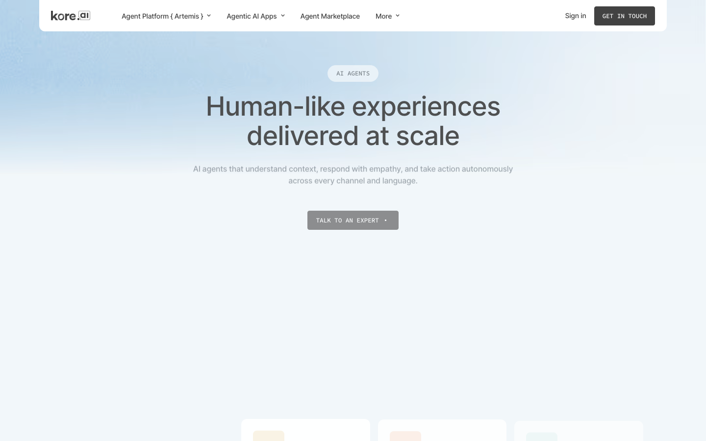

**观察：**

- ✅ 三层产品架构清晰可辨**：页面把产品拆成"Agent Platform (Artemis) 底层平台 → Enterprise Modules 企业模块 → Agentic AI Apps 应用层"，并进一步按"自建（Tailored Applications）/ 加速器（Marketplace 预置 agent、模板、集成）/ 开箱即用（AI for Banking/Healthcare/Retail/IT/HR/Recruiting）"三种交付方式分层。用户能快速理解 Kore.ai 既卖"造 agent 的平台"也卖"已造好的 agent 应用"，覆盖从自建到即用的完整光谱。
- ✅ "For Service" vs "For Work" 双场景切分到位**：对外客服侧（AI Agents、Agentic Contact Center、Quality Assurance、Proactive Outreach）与对内生产力侧（Enterprise Search、Intelligent Orchestrator、Admin Controls、AI Agent Builder），再叠加部门维度（Sales/Marketing/Legal/Finance 等），用户能据此判断"我的用例属于哪一类"。
- P2 模块只有名称、缺功能说明**：`Intelligent Orchestrator`、`Agentic Contact Center`、`Quality Assurance`、`Proactive Outreach` 等关键模块全部只列名词，无一句话说明各自的输入/输出、工作机制或彼此关系（例如 Orchestrator 到底是编排多个 agent 还是路由任务？QA 是质检人工坐席还是质检 AI agent？）。用户读完知道"有这些模块"，但不知道"每个模块具体能做什么"。
- P2 集成与企业系统对接信息缺失**：页面反复强调"work in production""企业级"，却没有任何具体集成清单——agent 如何接入 CRM、知识库、工单系统、企业数据源一字未提，仅以 `Integrations` 一个入口代替。对评估"能否落地到我现有技术栈"的买家，这是关键缺口。
- P3 建构范式表述自相矛盾**：主标题称平台是 "The AI-programmable foundation"（暗示可编程/写代码），而同页推荐文章却是《Configured, not coded. The engineering discipline gap in agent development》（强调配置而非编码）。到底面向开发者写代码还是面向业务人员低代码配置，定位信号冲突，影响用户判断"谁来用、需要什么技能"。

#### E3: 探索: Agent AI Assistance

**URL:** https://www.kore.ai/ai-for-service/agent-ai

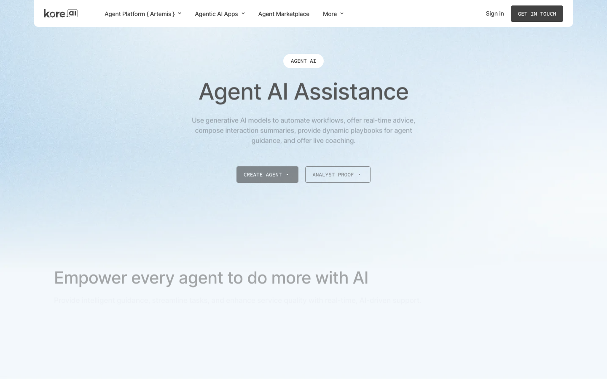

**观察：**

- P1 关键功能描述缺失**：本测点抓取到的页面文本几乎全部是全局导航菜单（Enterprise Modules / Departments / Pre-Built Apps）和页脚链接，没有任何一句话正面解释 "Agent AI Assistance" 这个模块**本身做什么**——没有输入、输出、工作机制、触发方式。用户点进这个功能页，读完依然不知道"它能为我做什么"。
- P2 功能定位只能靠归类推断，正文未确认**：从导航看，Agent AI Assistance 归在 "For Service → AI Agents" 下，与 Agentic Contact Center、Quality Assurance、Proactive Outreach 并列，强烈暗示这是面向客服/联络中心的**人工坐席实时辅助（agent-assist）**能力（通话/对话中给坐席推送话术、知识、下一步建议）。但这是从名称+归类反推的，页面文本没有一句话证实其服务对象是"人工坐席"还是"自动 AI agent"，这层歧义对理解功能至关重要。
- P2 与底层平台的关系没讲清**：节选里唯一的产品级描述是关于 Agent Platform { Artemis } 的——"The AI-programmable foundation for building, scaling, and optimizing AI agents that work in production"。这说明 E3 应是构建在 Artemis 平台之上的企业模块，但**模块如何调用平台能力、是否可编排/可编程、与平台的边界**完全没有说明。
- P2 集成与渠道信息完全空白**：坐席辅助类产品的核心价值在于接入知识库、CRM、工单系统、实时语音转写，并覆盖语音/聊天/邮件多渠道。页面没有任何**集成清单、支持渠道、可对接的联络中心平台（如 Genesys/Twilio/NICE）**，无法判断能否落地到现有客服技术栈。
- P1 缺少场景演示与可量化收益**：没有具体工作流示例（例如"坐席处理退款时自动弹出适用政策与操作步骤"），也没有 AHT 降低、首解率提升等效果指标。导致用户无法把这个功能和自己的客服业务问题对应起来，功能价值停留在名称层面。

#### E4: 探索: Quality Assurance

**URL:** https://www.kore.ai/ai-for-service/quality-ai

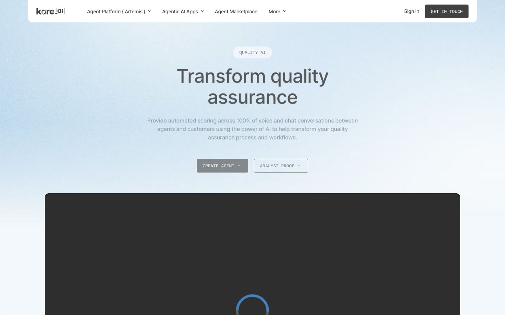

**观察：**

- P1 该测点抓取的是全站导航菜单,并非 Quality Assurance 功能页本身** —— 全文除 "Quality Assurance" 一个菜单条目外,没有任何关于该模块"做什么"的描述(无输入、无输出、无工作机制)。用户点到这一层完全无法理解这个 QA 产品能为自己做什么。
- 该页唯一揭示的功能信息是产品的模块taxonomy(架构层级)**:Quality Assurance 被归在 "For Service / Enterprise Modules" 之下,与 AI Agents、Agent AI Assistance、Agentic Contact Center、Proactive Outreach 并列。由此可**推断**它属于客服/联络中心场景的质检能力——但这只是位置推断,页面本身未确认。
- P2 QA 与相邻模块的协同关系完全没说明** —— 它和 Agentic Contact Center、Agent AI Assistance 并列暗示了一条"坐席辅助 + 质检 + 主动外呼"的客服闭环,但质检对象是 AI agent 还是人工坐席、数据从通话/聊天/工单哪里来、是否回流去训练 agent,均无交代。
- 功能信息缺口(关键未答问题)**:质检覆盖哪些渠道(语音/在线聊天/邮件)、是全量自动质检还是抽样、是否自动生成评分卡(scorecard)与合规规则、能否自定义评分维度、与现有 CCaaS/CRM 的集成方式——这些决定"能否落地"的核心点,本页一概未提及。
- P3 "Agent Platform { Artemis }" 被标为 NEW 并定位为"可编程的 AI agent 构建底座",但与 Quality Assurance 这类上层模块的关系未串联** —— 读者无法判断 QA 是平台原生能力还是需在 Artemis 上自行搭建,影响对产品边界的理解。

#### E5: 探索: Proactive Outreach

**URL:** https://www.kore.ai/ai-for-service/outbound-campaigns

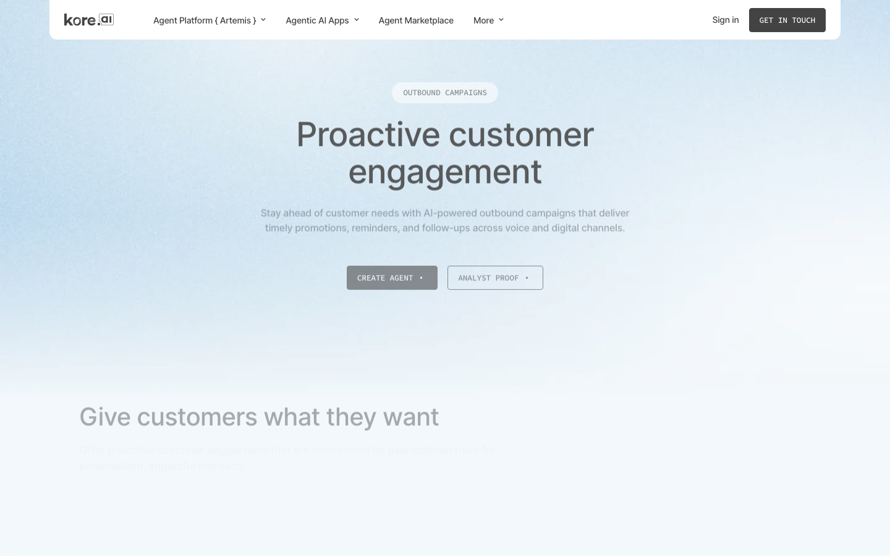

**观察：**

- P1 关键功能正文完全缺失**：本次抓取到的几乎全是 Kore.ai 站点的全局导航/大菜单（Agent Platform「Artemis」、企业模块、部门、预建应用、资源链接等），并没有 "Proactive Outreach" 模块自身的功能介绍页。"Proactive Outreach" 仅作为 "For Service" 模块清单里的一个链接名出现，对它"做什么"零描述——这是该测点最核心的功能性清晰度问题。
- 页面只揭示了产品结构、而非该功能本身**：可看出 Kore.ai 把能力组织为 Agent Platform（Artemis）+ 企业模块，模块再分 "For Service"（AI Agents、Agent AI Assistance、Agentic Contact Center、Quality Assurance、Proactive Outreach）与 "For Work"。由此可**反推** Proactive Outreach 属于客服/联络中心场景下的一个 AI agent 模块，但这是从同级模块归类推断的，页面本身并未明示其定位。
- P1 输入/输出/触发/渠道机制全部未说明**：作为"主动外联"类能力，用户最关心的要素——通过什么渠道触达（语音外呼 / 短信 / 邮件 / WhatsApp？）、由什么事件或数据触发外联（续费到期、工单状态、营销名单？）、AI agent 在外联会话中承担什么角色、对话结果如何回流系统——页面统统没有。无法区分它到底是营销外呼、服务提醒还是催收类场景。
- P2 缺少集成与数据来源说明**：主动外联必然依赖客户名单 / CRM / 联络中心系统，但页面没有任何关于接入哪些系统、外联名单从何而来、如何与同级的 Agentic Contact Center 协同的信息，无法评估落地所需的前置条件。
- 读完无法回答"它能为我做什么"**：用户仅能确认"Kore.ai 提供一个名为 Proactive Outreach 的客服侧模块"，无法理解其具体能力、典型用例与价值主张。建议补充该模块的独立功能页（场景示例 + 支持渠道 + 触发机制 + 集成清单）来填补这一缺口。

#### E6: 探索: Sales

**URL:** https://www.kore.ai/ai-for-work/sales

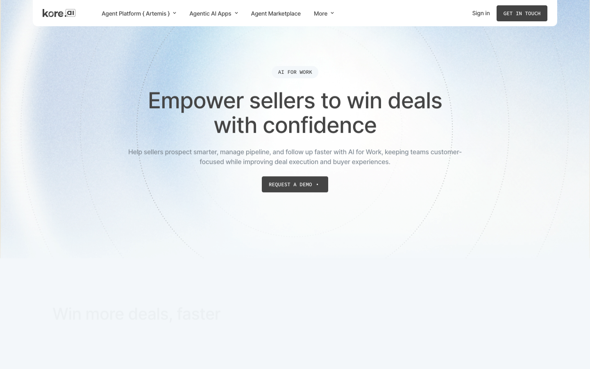

**观察：**

- P1 "Sales" 落点几乎没有销售专属功能内容**：本测点抓取到的文本绝大部分是全站导航/大菜单（Agent Platform、For Service / For Work 模块、Marketplace 等），"Sales" 仅作为 EXPLORE > DEPARTMENTS 下的一个链接出现，页面并未说明产品**为销售团队具体做什么**——没有 AI BDR / 线索资格审查 / 外呼跟进 / 商机推进 / 报价等任何销售工作流描述。用户带着"这产品能帮我的销售干什么"来，读完无法得到答案。
- P1 缺少销售场景与 CRM 集成说明**：销售类 AI agent 的核心价值在于接入 CRM（Salesforce/HubSpot 等）、邮件、电话系统并自动执行销售动作，但页面对**输入（线索/客户数据从哪来）、输出（写回 CRM？生成话术？）、集成清单**只字未提。Marketplace 虽提到"pre-built agents / templates / integrations"，却未列出任何销售相关的预建 agent 或连接器。
- P2 通用能力模块未映射到销售用途**：页面列出了 For Work 的能力积木——Enterprise Search、Intelligent Orchestrator、Pre-Built AI Agents、Admin Controls、AI Agent Builder——这些理论上可组合出销售应用，但缺少"用这些模块如何搭出一个销售 agent"的示例或工作机制说明，能力与销售部门之间是断裂的。
- P2 自建 vs 预建的功能边界不清**："Tailored Applications（用企业模块自建）"与"Pre-built Applications / Application Accelerators（开箱即用）"两条路径并存，但页面没说明销售场景应走哪条、二者在销售功能上的差异与取舍，用户难以判断要自己用 AI Agent Builder 搭、还是直接拿现成模板。
- ✅ 平台定位与可编程能力表述清晰**：顶部 "The AI-programmable foundation for building, scaling, and optimizing AI agents that work in production" 准确点出了 Artemis 是**面向生产环境的可编程 agent 底座**，配合 AI Agent Builder / Orchestrator / Admin Controls，让人理解这是一个"造 agent 的平台"而非单点工具——只是这种平台级表述与"Sales 部门方案"之间缺一层落地衔接。

#### E7: 探索: Marketing

**URL:** https://www.kore.ai/ai-for-work/marketing

**观察：**

- P1 「Marketing」测点实际只抓到全站导航大菜单，没有任何营销部门的功能正文** — 页面通篇是顶部 mega-menu（For Service / For Work / 模块清单 / 资源链接），唯独看不到 Marketing 这个 department 下 AI agent 究竟做什么（写文案？跑活动？线索打分？SEO？）。用户点进「Marketing」却读不到该场景的输入/输出/工作流，无法判断"它能为我的营销团队做什么"。
- ✅ 导航本身清晰勾勒了产品的能力地图与分层架构** — Agent Platform（Artemis）作为底座，上层拆成「For Service」（Agent AI 助手、Agentic 联络中心、质检、主动外呼）与「For Work」模块（企业搜索 Enterprise Search、智能编排 Intelligent Orchestrator、预置 Agent、管理控制 Admin Controls、Agent Builder）。读完能理解这是一个"建/编排/治理 AI agent + 预置应用"的平台型产品，能力边界比较完整。
- P2 揭示了"构建—编排—治理"全链路能力，但每个模块都只有名词、缺机制说明** — 例如 Intelligent Orchestrator（多 agent 如何调度/分流）、Admin Controls（权限/审计/合规具体管什么）、AI Agent Builder（可视化配置还是写代码）均无一句解释。配合 insight 标题"Configured, not coded""Parallel Agent Processing"能嗅到"低代码配置 + 并行多 agent"的定位，但这些是博客链接而非功能说明，用户拿不到可落地的功能细节。
- P2 预置应用与 Marketplace 透露了"开箱即用"的交付方式，但未说明集成与数据接入** — 页面列出 AI for Banking/Healthcare/Retail/IT/HR/Recruiting 等行业预置应用，以及 Marketplace 的 pre-built agents / templates / integrations。这说明产品支持模板化快速部署，但"integrations"具体能接哪些系统（CRM、工单、知识库、营销自动化工具）一个都没列，用户无法评估接入自己现有栈的成本。
- P3 「For Service」vs「For Work」两条产品线的功能差异与适用对象未点明** — 同为 AI agent，Service 线偏对外客服/联络中心，Work 线偏对内员工生产力（搜索、编排、各部门 agent），但页面没说明二者在能力、部署对象、计费上的区别，跨线选型时读者需自行推断。

#### E8: 探索: Engineering

**URL:** https://www.kore.ai/ai-for-work/engineering

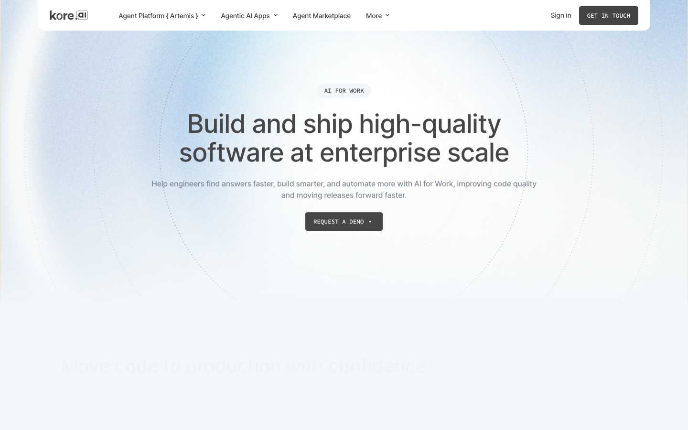

**观察：**

- P1 "Engineering 部门页"几乎没有工程场景的功能内容**：抓取文本绝大部分是全局导航/超级菜单（模块清单、部门入口、博客标题、页脚），看不到平台针对工程团队的具体能力叙述。用户点进 Engineering，无法得知产品到底为工程师做什么——是代码生成 agent？CI/CD 自动化？故障/事件处理？内部研发工具编排？关键的部门级价值主张完全缺位。
- ✅ 模块架构通过导航传达得相对清晰**：产品按"For Service"（AI Agents、Agentic Contact Center、Quality Assurance、Proactive Outreach）与"For Work"（Enterprise Search、Intelligent Orchestrator、Pre-Built AI Agents、Admin Controls、AI Agent Builder）两条线切分，并叠加按部门（Sales/Marketing/Engineering/Legal/Finance）和按行业（Banking/Healthcare/Retail 等预建应用）的多维入口，能让人快速建立"这是一个可组装的企业 agent 平台"的整体认知。
- 平台定位偏开发者侧，但能力只停留在标语**：Hero 把 Artemis 描述为"AI-programmable foundation for building, scaling, and optimizing AI agents that work in production"，配合博客标题"Configured, not coded""Parallel Agent Processing""Can Today's AI Agents Survive Their Own Runtime?"，强烈暗示了配置化开发、并行 agent 编排、生产级运行时(runtime)等对工程团队最相关的卖点——**但这些都是资讯文章标题，不是被说明的产品功能**，无法判断它们是否真实可用、如何使用。
- P2 模块之间的工作机制与输入/输出未说明**：页面列出了 AI Agent Builder、Intelligent Orchestrator、Pre-Built AI Agents、Admin Controls 等组件名称，但没有解释它们如何串联（Builder 产出的 agent 是否由 Orchestrator 调度？Artemis 平台与这些模块是底座与上层的关系吗？），也没有说明一个 agent 的触发输入、产出形式或落地到哪些系统。
- P2 集成与预建资产只有名字、缺少清单与细节**：Kore.ai Marketplace、Pre-built agents、Templates、Integrations 被反复提及，是工程选型时最关心的部分，但页面没有给出任何具体集成对象（接哪些 CRM/工单/代码仓/可观测系统）、预建 agent 的实际功能或模板覆盖范围，用户无法评估"能否接入我现有的技术栈"。

### 🎯 解决方案 / 场景（1 个测点）

**该模块覆盖页面**:

- `https://www.kore.ai/`

#### S2: Use cases / Industry

**URL:** https://www.kore.ai/

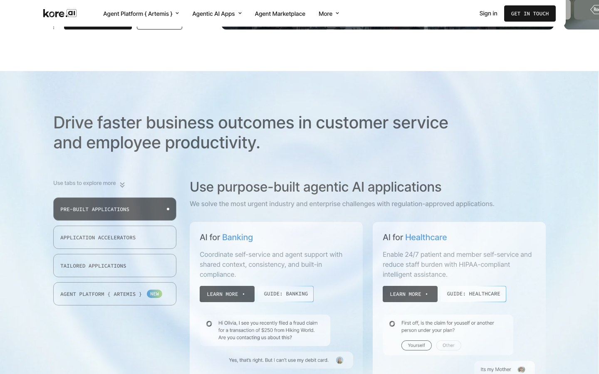

**观察：**

- P2 整页是导航式"能力目录"，几乎所有条目都是裸标签，缺功能注解**：For Service 下的 `Agentic Contact Center` / `Quality Assurance` / `Proactive Outreach`、For Work 下的 `Intelligent Orchestrator` / `Pre-Built AI Agents` 等都只有名称，没有一句话说明"它具体做什么、处理什么任务"。读者能看到产品阵列，却无法判断任一用例的实际功能。
- ✅ 行业 + 部门双维度覆盖表达清晰，且明确是"预构建"而非纯自建**：按行业给出 Banking / Healthcare / Retail / IT / HR / Recruiting 的现成应用，按职能给出 Sales / Marketing / Engineering / Legal / Finance 模块。这有效传达了"垂直行业 + 横向职能"的覆盖广度，并暗示可开箱即用。
- ✅ 揭示出清晰的分层产品模型（自建—买现成的连续谱）**：Artemis Agent Platform（可编程底座）→ Enterprise Modules（AI for Service / AI for Work）→ Pre-built Applications（按行业）→ Marketplace 加速器（agents / templates / integrations）。这一层级结构让人理解"既能用现成应用，也能在平台上自建"。
- P1 作为"用例/行业"测点，页面只给了 `Usecase Library` 入口却未演示任何一个端到端用例**：最该承载用例信息的"Find the right AI use case for your business"仅是一个链接，没有任何"输入 → agent 执行动作 → 输出"的具体工作流示例。读者读完无法形成"这个产品能为我做某件具体事"的认知。
- P2 集成能力被反复暗示但无清单**：Marketplace 列出 `Integrations`、`Application Accelerators` 强调可对接，却未点名任何连接器（CRM / 工单系统 / 电话/呼叫平台等），用户无法核实自己的技术栈是否被支持。

### ⭐ 客户案例（2 个测点）

**该模块覆盖页面**:

- `https://www.kore.ai/`
- `https://www.kore.ai/customer-stories`

#### S4: Customer / logo wall

**URL:** https://www.kore.ai/

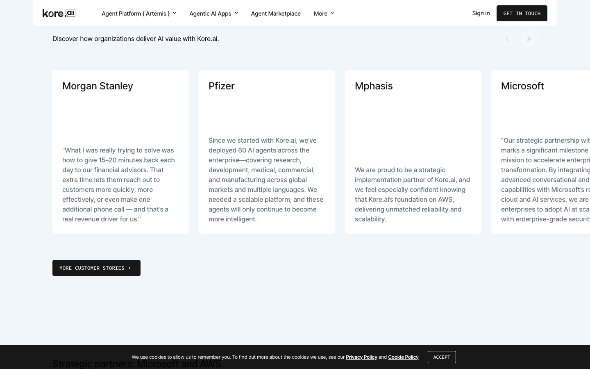

**观察：**

- P1（客户证明缺失）** 本测点名为 "Customer / logo wall"，但抓取到的页面内容里**没有任何具名客户、客户 logo 或行业案例**，唯一相关的只是埋在 Quick Links 中的一个 "Customer Stories" 文字链接。对一个主打"work in production / 生产级 AI agent"的企业平台来说，此视图完全没有提供"谁在用、用在什么场景、用出什么结果"的社会证明，读者无法判断产品在真实生产环境的成熟度与可信度。
- ✅ 功能架构传达清晰** 导航本身相当完整地揭示了产品"能做什么"：底层是可编程的 Agent Platform（Artemis），向上分为两大企业模块——For Service（AI Agents、Agentic Contact Center、Quality Assurance、Proactive Outreach 等客服/联络中心场景）和 For Work（Enterprise Search、Intelligent Orchestrator、Pre-Built AI Agents、Admin Controls、AI Agent Builder 等企业内部生产力场景），并按部门（销售/市场/工程/法务/财务）和行业（银行/医疗/零售/IT/HR/招聘）双维度切分。用户能快速建立"这是一个全栈企业 AI agent 平台"的认知。
- ✅ "即用型"能力明确** 页面通过 Kore.ai Marketplace（pre-built agents、templates、integrations）和按行业打包的 Pre-Built Applications（AI for Banking/Healthcare/Retail/IT/HR/Recruiting），清楚传达了"不必从零搭建、可直接部署"这一价值主张，解决了企业落地 AI agent 的启动成本与时间问题。
- P2（集成与机制细节不足）** 平台定位强调 "AI-programmable foundation" 和 "Configured, not coded"（配置而非编码），暗示了一种声明式/可配置的 agent 构建工作机制，但页面**未给出任何集成清单**（到底能接哪些 CRM、工单、知识库、IT 系统），也未说明 agent 的输入/输出、运行时（runtime）如何工作。结合 "Can Today's AI Agents Survive Their Own Runtime?"、"Parallel Agent Processing" 等 insight 标题，运行时稳定性显然是卖点，但功能层面停留在概念，缺乏可验证细节。
- P2（功能信息缺口）** 对照"客户证明"这一测点应回答的关键问题，页面缺少：客户数量与规模、行业分布、量化成果（处理量、成本节省、解决率等）、以及任何可点击进入的具体案例预览。读者读完此视图能理解"产品大致能为我做什么"，但无法回答"它在和我类似的企业里真的做成过吗"。

#### S5: Case studies / Testimonials

**URL:** https://www.kore.ai/customer-stories

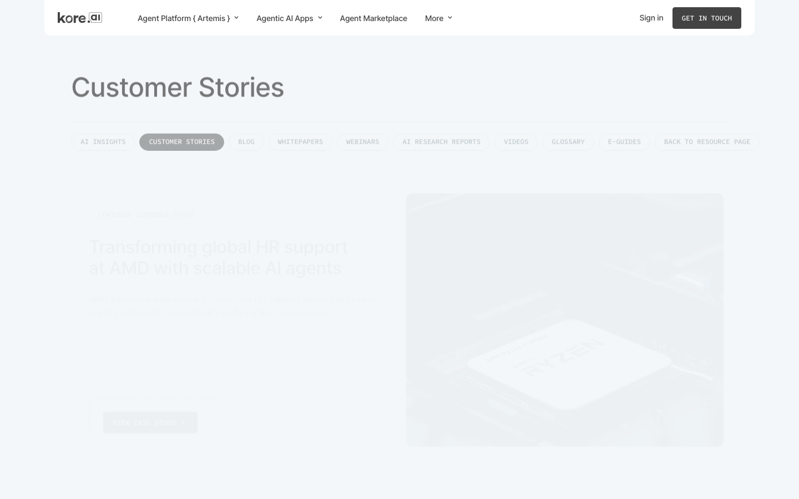

**观察：**

- P1（案例证据完全缺失）**：本测点目标是 Case studies / Testimonials，但抓取到的文本几乎全是巨型导航菜单——没有任何真实客户名称、量化成果（ROI、对话量、坐席节省、解决率）或客户证言。读者无法回答"这个产品在真实场景里为谁解决了什么、效果如何"，案例层最核心的"功能→成效"证据链整页缺位。
- P2（模块只有名称、无功能说明）**：菜单可反推出完整功能版图——For Service（AI Agents、Agentic Contact Center、Quality Assurance、Proactive Outreach）与 For Work（Enterprise Search、Intelligent Orchestrator、Pre-Built AI Agents、Admin Controls、AI Agent Builder），底层为 Agent Platform（Artemis）。但每项仅有标签，未说明各模块的输入/输出/触发方式/适用流程，无法判断单个模块"具体能做什么"。
- P2（Usecase Library 入口空有其名）**："Usecase Library — Find the right AI use case for your business" 本应是承载场景/案例的核心载体，但页面节选未呈现任何具体用例条目（适用部门、前置条件、预期产出），用户无法在此页真正完成"匹配自己场景的用例"这一动作。
- ✅/P2（可复用资产能力传达较清晰）**：Application Accelerators + Kore.ai Marketplace 明确揭示了一项能力——可复用的 pre-built agents / templates / integrations，并按行业（Banking/Healthcare/Retail/IT/HR/Recruiting）与职能（Sales/Marketing/Engineering/Legal/Finance）切分开箱即用应用，传达了"按场景选型、快速落地"的价值；但仍缺单个加速器的功能边界与集成清单。
- P3（机制卖点停留在标题层）**：AI Insights 标题（"Configured, not coded"、"Parallel Agent Processing"、"Can Today's AI Agents Survive Their Own Runtime?"）暗示了关键工作机制——配置式低代码开发、并行 Agent 处理、生产运行时稳定性，但都仅是博客标题，未在功能介绍中展开，这些机制对读者仍是黑盒。

### 🔌 集成 / API（1 个测点）

**该模块覆盖页面**:

- `https://www.kore.ai/`

#### S3: Integrations page

**URL:** https://www.kore.ai/

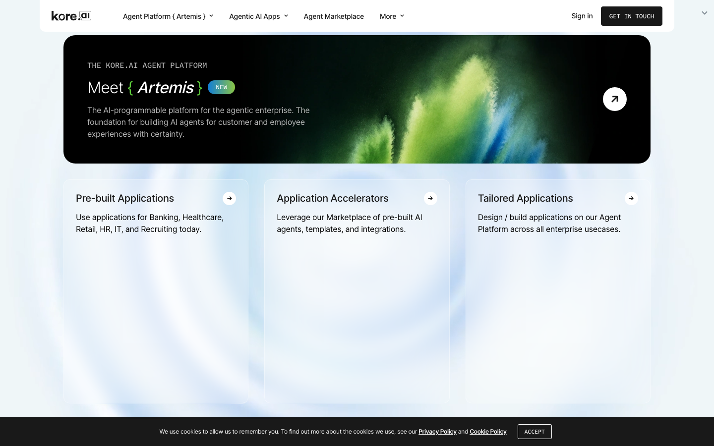

**观察：**

- P1 严重：页面未呈现任何"集成"实质内容。** 测点名为 Integrations page，但抓取到的文本几乎全是全站导航/巨型菜单（Agent Platform、Enterprise Modules、Marketplace、Resources 等），唯一与集成相关的只有 Kore.ai Marketplace 下并列出现的 "Integrations" 字样。用户无法从本页得知"能集成什么、怎么集成、集成后能做什么"——这是集成页最核心的功能信息，却完全缺失。
- P2 中等：揭示了"通过 Marketplace 分发集成"的产品模式，但只点到为止。** 文案 "Leverage pre-built AI agents, templates, and integrations from the Kore.ai Marketplace" 表明集成与预置 Agent、模板一样，是从 Marketplace 这个应用市场获取的（即应用商店式交付）。这是有价值的工作机制线索，但页面没有进一步说明：是连接器目录、是 API、还是 OEM 集成？也没有一条具体集成项可看。
- P1 严重：缺失关键的"可集成系统清单"。** 企业选型集成能力时最关心"是否支持我现有的 CRM / 工单 / 呼叫中心 / 知识库 / 身份系统"。页面没有列出任何具体被集成对象（如 Salesforce、ServiceNow、Zendesk、Genesys、SSO 等），也无分类、无 logo 墙、无搜索入口，用户无法判断产品能否接入自己的技术栈。
- P2 中等：集成的输入/输出与工作机制完全未交代。** 没有说明集成是数据同步、动作触发（agent 调用外部 API 执行任务）、还是事件订阅；也没有提认证方式（OAuth/API Key）、是否需要编码、是否支持自定义连接器。结合站内 "Configured, not coded" 的理念，集成本应是"配置式接入"的关键证据点，但本页未兑现这一叙事。
- P3 轻微：典型使用场景缺乏具体演示。** 即便不放完整目录，也应给出一两个端到端场景（例如"Agentic Contact Center 通过集成读取 CRM 客户记录并在工单系统中创建工单"），帮助用户把"集成能力"与自身业务价值挂钩；当前页面停留在导航层，读完无法理解集成"能为我做什么"。

### 🔒 安全 / 信任（1 个测点）

**该模块覆盖页面**:

- `https://www.kore.ai/`

#### S12: Trust / Security page

**URL:** https://www.kore.ai/

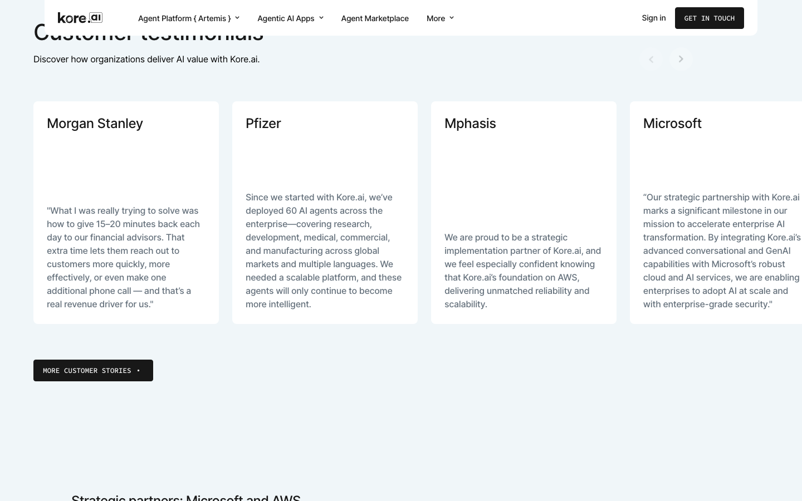

**观察：**

- P1 测点内容缺失：** 标注为 Trust/Security 的页面，提取文本里**全是全站导航(Agent Platform Artemis 菜单、Enterprise Modules、Marketplace)和页脚链接**，没有任何信任/安全本体内容 —— 看不到合规认证(SOC 2 / ISO 27001 / GDPR / HIPAA)、数据加密、数据驻留、漏洞披露/渗透测试等基本要素。用户读完无法回答"这个平台在企业安全上能为我保证什么"。
- P1 关键安全能力零呈现：** 对一个面向**生产环境**的企业 AI agent 平台,安全合规是采购的硬门槛功能,但本页未说明 agent 运行时的数据如何隔离与加密、是否支持私有化/VPC 部署、是否对接企业 IdP(SSO/SAML/SCIM)、是否提供操作审计日志 —— 这些恰恰是 Trust/Security 页应承载的核心信息。
- P2 唯一线索无细节：** 导航中与安全治理相关的只有 For Work 模块下的 "Admin Controls",暗示存在管理员/权限治理能力,但完全没有展开(管控对象是什么、权限粒度、租户隔离、谁可配置),无法据此判断治理功能的成熟度。
- P2 LLM 特有风险护栏未提及：** 作为 AI agent 平台,用户会关心对模型输入/输出的安全护栏(guardrails)、提示注入防护、PII 脱敏、幻觉/越权行为的拦截机制 —— 这些 agent 时代特有的安全功能在本页毫无体现,是明显的功能信息缺口。
- P3 间接信号偏弱:** 资讯标题 "Can Today's AI Agents Survive Their Own Runtime?"、"Configured, not coded" 隐约触及运行时可靠性与治理纪律,但这是博客引流内容而非安全功能说明,无法替代 Trust/Security 页应有的能力清单。

### 🏢 公司 / 团队（1 个测点）

**该模块覆盖页面**:

- `https://www.kore.ai/about-us`

#### S7: About / Company

**URL:** https://www.kore.ai/about-us

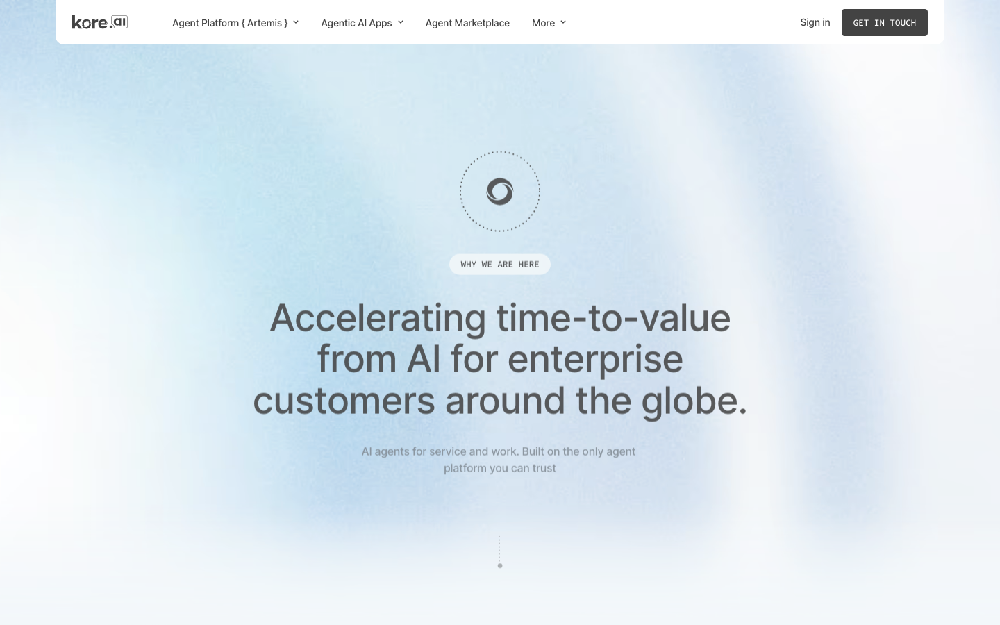

**观察：**

- ✅ 产品核心定位被一句话讲清：Agent Platform「Artemis」是「用于在生产环境构建、扩展、优化 AI agent 的可编程基础平台」(AI-programmable foundation, build/scale/optimize, work in production)。三个动词 + "in production" 明确传达这不是 demo 工具，而是面向企业级 agent 全生命周期的底座；配合「Configured, not coded」的洞察标题，暗示是配置驱动 / 低代码的 agent 开发范式。
- ✅ 能力地图清晰二分，用户能快速判断"这产品管不管我这摊事"：**AI for Service**(面向客服/联络中心：AI Agents、Agent AI Assistance、Agentic Contact Center、Quality Assurance、Proactive Outreach) 与 **AI for Work**(面向内部生产力：Enterprise Search、Intelligent Orchestrator、Pre-Built AI Agents、Admin Controls、AI Agent Builder)，并按 Sales/Marketing/Engineering/Legal/Finance 等部门切分场景。
- ✅ "买 vs 建"的交付光谱完整：开箱即用的行业应用 (AI for Banking/Healthcare/Retail/IT/HR/Recruiting) → 应用加速器/Marketplace(预制 agent、模板、集成) → 在平台上自建的 Tailored Applications。三档路径让不同成熟度的客户都能找到入口。
- P1 关键差异化能力只露了名字、没讲机制：`Intelligent Orchestrator` 与洞察标题 `Parallel Agent Processing`、`Can Today's AI Agents Survive Their Own Runtime?` 都指向"多 agent 编排 + 运行时"这一核心卖点，但本页对**agent 之间如何协同、编排器按什么逻辑路由、运行时如何保障稳定性**只字未提——这恰恰是企业最关心的能力。
- P2 "AI-programmable"是全场最重要的措辞却最模糊：到底是 SDK / API / 自有 DSL / 可视化编排哪一种"可编程"？输入输出形态、与 CRM/工单/数据源的具体集成清单(Marketplace 里 Integrations 究竟覆盖哪些系统)均无说明，用户无法判断接入自己技术栈的成本。

### 📰 博客 / 内容（1 个测点）

**该模块覆盖页面**:

- `https://www.kore.ai/blog`

#### S6: Blog / Resources

**URL:** https://www.kore.ai/blog

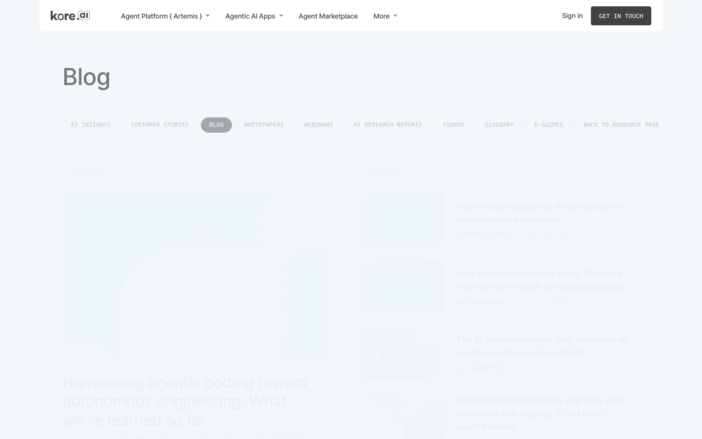

**观察：**

- ✅ 这一页（导航大菜单 + Resources 聚合区）一次性揭示了产品的完整能力版图：底层 **Agent Platform「Artemis」**（定位为"可编程的 AI agent 构建/扩展/优化基座"）→ 两大企业模块套件 **AI for Service**（AI Agents、Agentic Contact Center、Quality Assurance、Proactive Outreach）与 **AI for Work**（Enterprise Search、Intelligent Orchestrator、Pre-Built AI Agents、AI Agent Builder、Admin Controls）→ 行业预置应用（Banking/Healthcare/Retail/IT/HR/Recruiting）→ **Kore.ai Marketplace**（预置 agent / 模板 / 集成）。从功能分层看，"平台—模块—预置应用—市场"的产品结构表达得相当清晰。
- ✅ Blog/Insights 标题本身就在传递功能性信号，而不只是营销文：「Configured, not coded」暗示低代码/配置化的 agent 构建路径、「Parallel Agent Processing」指向多 agent 并行编排能力、「Can Today's AI Agents Survive Their Own Runtime?」指向运行时/稳定性这一产品维度。对想判断"这平台能力深不深"的技术读者，这些是有效的能力佐证。
- P2**：Resources Hub 罗列了 Blog/Whitepapers/Webinars/AI Research Reports/Glossary/Videos/Generative AI 101 等十余种内容类型，但**没有把"资源"与"具体产品能力"建立映射**——读者无法从这一页看出哪篇资源解释哪个模块的工作机制（输入/输出/集成）。资源是按"内容形态"组织，而非按"我想了解的功能"组织，功能检索路径缺失。
- P2**：Marketplace 是这页里关于**可扩展性/集成能力**的关键功能点（pre-built agents、templates、integrations），但完全没有任何集成清单或可对接系统示例（CRM、工单、知识库、数据源等都未提及），用户无法判断"它能接入我现有的系统吗"。
- P1（针对此测点的功能清晰度）**：作为 Blog/Resources 落地区，这一页本质是**纯导航 + 内容索引**——它告诉用户"有哪些模块、有哪些读物"，却几乎不解释**任何单个模块到底为我做什么、怎么工作**。一个只看到这一页的用户能理解产品的"广度版图",但无法回答"这个产品具体能为我解决什么问题"——所有功能实质都被推迟到点击下钻之后，本页自身的功能解释力很弱。

### 📧 联系 / 客服（2 个测点）

**该模块覆盖页面**:

- `https://www.kore.ai/support`
- `https://www.kore.ai/ai-for-service/contact-center`

#### C7: Help / Documentation

**URL:** https://www.kore.ai/support

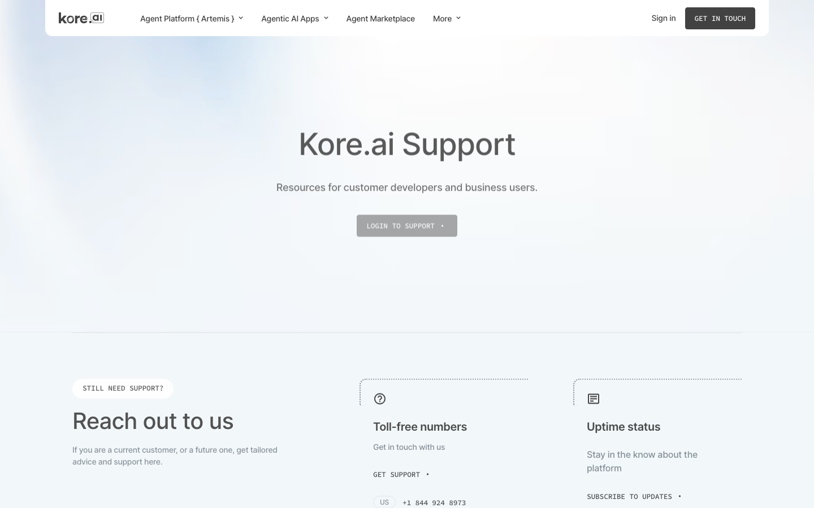

**观察：**

- ✅ 揭示了完整产品能力地图**：这段文本实为站点主导航/超级菜单，集中暴露了 Kore.ai 的产品功能全貌——核心 Agent Platform（Artemis）+ 两大模块族（AI for Service：AI Agents、Agent AI Assistance、Agentic Contact Center、QA、Proactive Outreach；AI for Work：Enterprise Search、Intelligent Orchestrator、Pre-Built AI Agents、Admin Controls、AI Agent Builder）+ 按行业（Banking/Healthcare/Retail/IT/HR/Recruiting）和部门（Sales/Marketing/Engineering/Legal/Finance）切分的预建应用，读者能快速建立"这个平台到底覆盖哪些能力"的认知。
- P1 作为"Help/Documentation"测点，页面只暴露入口链接、没有任何文档实质内容**：可见的全是导航标签（Documentation、Academy、Community、Get support、Submit RFP），无法判断文档体系到底包含什么——是否有 API 参考、SDK/开发者指南、配置教程、Admin 操作手册，文档是公开还是需登录/付费门控。用户读完仍不知道"出了问题该查哪类文档、能否自助解决"。
- P2 "Configured, not coded""AI-programmable foundation"点出了核心工作机制却没有落地说明**：平台主打"配置而非编码"地构建 agent，并强调"AI-programmable"，这暗示存在一套 agent 构建/编排工作流（AI Agent Builder + Intelligent Orchestrator + Marketplace 模板/集成），但本页未解释这套构建流程的输入/输出、配置粒度、与代码的边界，也没有指向对应的开发者文档，导致最关键的"我如何动手搭一个 agent"无从查证。
- ✅ 支持体系分层清晰**：Documentation（自助文档）、Academy（学习/培训）、Community（社区互助）、Get support（人工支持）、Submit RFP（售前/采购）形成了"自助→学习→社区→人工→商务"的多层支持路径，功能定位互不重叠，能让用户按问题性质找到对应渠道。
- P2 集成与 Marketplace 能力被提及但缺清单**：Kore.ai Marketplace 列出了 Pre-built agents / Templates / Integrations 三类资产，是回答"能接入哪些系统、有哪些现成 agent"的关键，但本页只给品类名、无具体集成清单（如接哪些 CRM/工单/知识库系统），用户无法据此判断与自家技术栈的兼容性。

#### S14: Customer support channels

**URL:** https://www.kore.ai/ai-for-service/contact-center

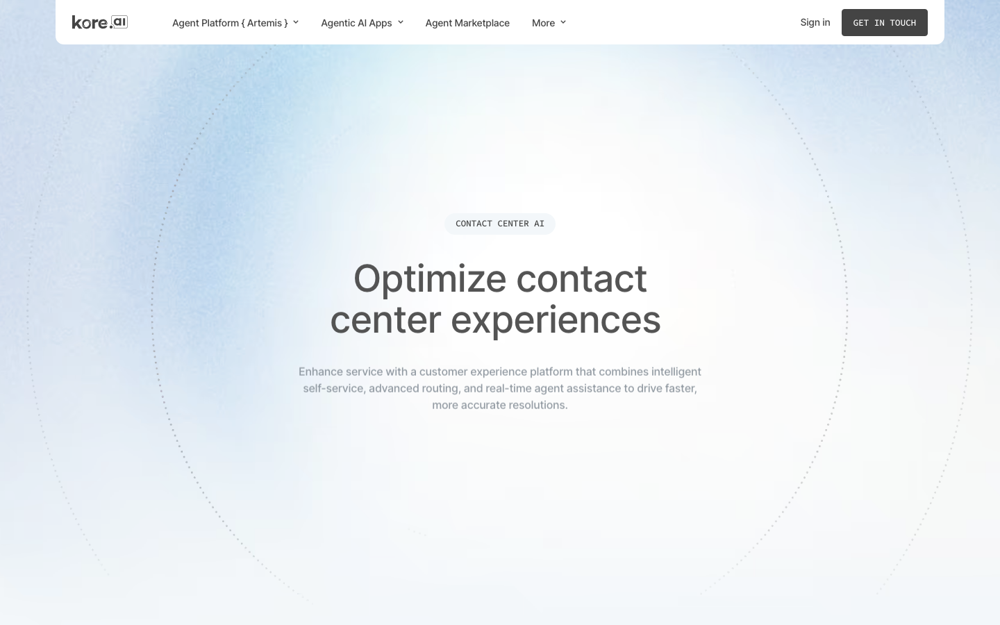

**观察：**

- ✅ 页面在全局导航与页脚清晰暴露了多条自助支持渠道入口:产品文档(Documentation)、支持门户(Get support)、社区(Community)、学习平台(Academy),以及面向采购的 Submit RFP——构成"文档 + 社区 + 培训"的较完整自助支持矩阵,对企业级平台属合理配置。
- P1** 产品核心定位是"在生产环境运行的 AI agents",但页面未暴露任何面向生产运维的支持渠道——无 SLA / 响应时效承诺、无故障状态页(status page)、无专属客户成功 / 技术经理(CSM/TAM)入口。对真正跑生产负载的客户,这是支持能力层面的关键信息缺失。
- P2** 各渠道仅以入口名称呈现,未说明其实际服务内容与边界:Get support 是工单、邮件还是实时支持?Community 是官方答疑还是纯用户互助?用户无法判断"出问题时该走哪条渠道、能得到什么响应"。
- P2** 缺少支持分层信息:企业版 / 付费版 与免费 / 标准版的支持差异(优先级、专属通道、7×24 覆盖、电话 / 实时通道)完全未说明,而这是企业采购阶段的关键决策点。
- P3** Academy + Community 暗示"培训认证 + 社区互助"的自助成熟度模型,但未说明是否免费 / 需登录、是否提供官方认证体系,削弱了这两条渠道作为"赋能客户自助解决问题"能力的说服力。

### 📚 产品官方介绍（递归发现）（6 个测点）

**该模块覆盖页面**:

- `https://www.kore.ai/ai-insights/introducing-mcp-a-new-standard-for-dynamic-ai-integration`
- `https://www.kore.ai/terms-of-service`
- `https://docs.kore.ai/agent-platform/abl-reference/language-overview`
- `https://docs.kore.ai/agent-platform/solutions-overview`
- `https://docs.kore.ai/agent-platform/tools-overview`
- `https://docs.kore.ai/ai-for-service`

#### B1: 背景 D1: LEARN MORE

**URL:** https://www.kore.ai/ai-insights/introducing-mcp-a-new-standard-for-dynamic-ai-integration

**观察：**

- ✅ **产品一句话定义清晰**：页面将旗舰产品定位为 "Agent Platform { Artemis }"，原文定义为 "The AI-programmable foundation for building, scaling, and optimizing AI agents that work in production."（可编程的、用于在生产环境中构建/扩展/优化 AI agent 的底层平台），并补充一句品牌叙事 "Your strategic enabler for enterprise AI transformation."——定位为面向企业 AI 转型的战略性使能平台（公司为 Kore.ai）。
- ✅ **核心能力以"企业模块"形式列出，分两条产品线**：① For Service（面向客服/CX）—— AI Agents、Agent AI Assistance、Agentic Contact Center、Quality Assurance、Proactive Outreach；② For Work（面向内部办公）—— Enterprise Search、Intelligent Orchestrator、Pre-Built AI Agents、AI Agent Builder、Admin Controls。此外提供 Kore.ai Marketplace（预置 agent / 模板 / 集成）和行业级预置应用（Banking、Healthcare、Retail、IT、HR、Recruiting）。
- ✅ **目标用户与场景明确指向企业级、多部门**：典型用户为企业的客服/联络中心团队与内部职能部门，页面点名覆盖 Sales、Marketing、Engineering、Legal、Finance 等部门，并通过 "Tailored Applications"（用企业模块在平台上自建应用）和行业预置应用区分"开箱即用"与"定制开发"两种落地路径。
- ✅ **差异化主张围绕"工程化 / 可投产" agent**：反复强调 "agents that work in production"、"AI-programmable foundation"，配套洞察文章标题 "Configured, not coded. The engineering discipline gap in agent development" 与 "Can Today's AI Agents Survive Their Own Runtime?"，叙事核心是——把 agent 当作需要工程纪律和运行时可靠性的生产级系统，而非简单 demo；并以 Forrester Wave™ 客服对话式 AI 领导者（Q2 2024）作为权威背书。
- ✅ **专有术语 / 概念**：`Artemis` = Agent Platform 的产品代号（标注 NEW，应为新一代平台命名）；`AI for Service` / `AI for Work` = 两大模块化产品线（对外客服 vs 对内办公）；`Intelligent Orchestrator` = 多 agent 编排调度组件；`Agentic Contact Center` = agent 驱动的联络中心方案；`AI Agent Builder` = agent 搭建工具。（页面另含一篇关于 Anthropic MCP 的科普文章，属内容资讯，非产品自身能力。）
- P3 **理解缺口偏大，关键细节缺失**：本页大部分文本是导航/超级菜单 + 一篇 MCP 科普 insight，真正属于 "Artemis 平台" 的实质描述只有两三句标语。读完后仍不清楚：Artemis 与原有 Kore.ai 平台的关系（升级/重命名/全新产品？）、"AI-programmable" 具体指什么（是否提供编程接口/SDK/低代码？）、各模块的真实功能边界、部署形态与定价，以及"工程纪律 / 运行时可靠性"在产品里如何具体实现——这些都需进一步查阅 Documentation 或产品详情页才能补齐。

#### B2: 背景 D2: Introduction

**URL:** https://www.kore.ai/terms-of-service

**观察：**

- ✅ **产品一句话定义清晰且有原文支撑**：页面将核心产品定义为 "Agent Platform { Artemis }"，主张原文为 "The AI-programmable foundation for building, scaling, and optimizing AI agents that work in production."（用于构建、扩展、优化生产环境 AI agent 的"AI 可编程基础平台"）；另一处补充定位 "Your strategic enabler for enterprise AI transformation."，明确锚定企业级 AI 转型。
- ✅ **核心能力按"两大模块族"组织**：企业模块明确分为 **AI for Service**（AI Agents、Agent AI Assistance、Agentic Contact Center、Quality Assurance、Proactive Outreach）与 **AI for Work**（Enterprise Search、Intelligent Orchestrator、Pre-Built AI Agents、Admin Controls、AI Agent Builder）两条线；并提供跨行业的预构建应用（Banking / Healthcare / Retail / IT / HR / Recruiting）。
- ✅ **目标用户与场景双维度覆盖**：定位企业客户，按**场景**分为客服/联络中心（Service）与内部办公生产力（Work）两类；按**部门**列出 Sales / Marketing / Engineering / Legal / Finance；并通过 "Usecase Library / Find the right AI use case for your business" 引导用户按业务匹配用例。
- ✅ **差异化叙事聚焦"工程纪律 + 生产可用"**：洞察标题 "Configured, not coded. The engineering discipline gap in agent development" 与 "AI agents that work in production"、"Can Today's AI Agents Survive Their Own Runtime?" 共同传递"配置化（低代码）+ 能在真实运行时稳定运行"的核心叙事；并以 "Forrester Wave™: Conversational AI for Customer Service, Q2 2024 领导者" 作为权威背书。
- ✅ **关键术语**：① **Artemis** — Agent Platform 的产品代号/命名；② **Intelligent Orchestrator** — 智能编排模块（AI for Work 下，指向多 agent 协调）；③ **Agentic Contact Center** — agent 化的联络中心；④ **Application Accelerators / Kore.ai Marketplace** — 提供预构建 agent、模板、集成的应用市场；⑤ **Parallel Agent Processing** — 并行 agent 处理（出现在 AI Insight 标题中）。
- P3 **理解缺口明显，实质产品说明偏薄**：本页文本以导航菜单、页脚链接与 Terms of Service 法律条文为主，真正的产品描述极少——"AI-programmable" 究竟指何种编程/配置模型、**Artemis 与 Agent Platform 是同一物还是子集**、AI for Service 与 AI for Work 在底层是同一平台还是两套产品、定价与部署方式均未交代；"Configured, not coded" 也仅作为 insight 标题出现，未在产品层面展开。

#### B3: 背景 D1: ABL

**URL:** https://docs.kore.ai/agent-platform/abl-reference/language-overview

**观察：**

- ✅ **一句话定义（角度1）**：页面开宗明义将 ABL 定义为"the enterprise control plane for agentic AI — a schema-driven language purpose-built for multi-agent orchestration where deterministic governance meets autonomous reasoning"（面向智能体 AI 的企业级控制平面，一种为多智能体编排打造的、模式驱动的语言）。定位非常明确：不是一个 Agent 产品，而是定义/治理 Agent 的"语言 + 规范层"。
- ✅ **核心功能能力（角度2）**：页面通过"顶层 section"清单展示了能力边界，主要包括：① 智能体声明（AGENT/GOAL/PERSONA/INSTRUCTIONS/EXECUTION 模型与运行时配置）；② 工具集成 TOOLS（支持 http endpoint，如 `lookup_account` 调 POST 接口）；③ 信息采集 GATHER（带 prompt/类型/required 的字段收集）；④ 执行编排 FLOW + 状态记忆 MEMORY；⑤ 治理三件套 CONSTRAINTS（业务规则）/ GUARDRAILS（输入输出安全）/ 多智能体协作 DELEGATE·HANDOFF·ESCALATE·COMPLETE。
- ✅ **差异化主张 / 核心叙事（角度4）**：差异化叙事相当鲜明——"ABL spans the full control spectrum: delegate autonomously, supervise selectively, or lock down as a deterministic state machine"（覆盖完整控制谱系：完全自治委派、选择性监督、或锁死为确定性状态机）。配合两个独家卖点：Agent 定义"compile into immutable artifacts"（编译成不可变产物）、以及"AI can author blueprints just as humans do"（AI 可像人一样编写蓝图）。核心张力是"确定性治理 × 自主推理"。
- ✅ **关键术语 / 概念（角度5）**：① **ABL（Agent Blueprint Language）**=Kore.ai 的智能体蓝图语言，纯文本、大写关键字 + 冒号的 section 结构；② **immutable artifacts**=蓝图编译后的不可变制品；③ 文件类型体系：`.agent.abl`（最常见的 Agent 定义）/ `.tools.abl`（可复用工具库）/ `.agent.yaml`（YAML 格式）；④ **DELEGATE / HANDOFF / ESCALATE**=多智能体与人工的三种交接语义（委派子 Agent、转移、升级人工）。必填 section 仅 `AGENT:` 与 `GOAL:`，其余可选。
- ✅ **目标用户与场景（角度3）**：明确瞄准**企业级**（"enterprise control plane"）与构建多智能体系统的开发者/平台工程师；页面唯一的实例场景是客服——`AGENT: Customer_Support` 帮客户解决账单问题，体现了"工具调用 + 信息采集"的典型 Agent 用例。P3：除客服外没有给出更多行业/场景，目标用户画像仍偏抽象。
- P3 **理解缺口（角度6）**：读完后几个关键点仍不清楚——① "编译成 immutable artifacts"后**在哪里运行、运行时是什么**（EXECUTION 提到 model/runtime 配置但本页未展开）；② ABL 与 Kore.ai 整体平台（APIs、Solutions）的关系与定位边界；③ "AI 可编写蓝图"的具体实现方式与可靠性；④ 与同类编排框架（如 LangGraph 等）相比的**具体技术差异**，页面只给了叙事性主张，未给可验证的对比；⑤ 无任何定价、版本成熟度或部署形态信息。

#### B4: 背景 D1: Solutions

**URL:** https://docs.kore.ai/agent-platform/solutions-overview

**观察：**

- ✅ **三大解决方案框架清晰**：页面以"Business Solutions"为中心，把 Kore.ai 的产品能力归纳为三条主线——**AI for Service**（"Create customer experiences across voice and digital channels"，面向语音与数字渠道的客户体验）、**AI for Work**（"Automate routine tasks and enable your employees"，面向员工的日常任务自动化）、**AI for Process**（"Streamline knowledge-intensive business processes"，面向知识密集型业务流程）。三句原文构成了产品的核心能力地图。
- ✅ **目标用户与场景按"对外/对内"二分明确**：从三条主线可读出双重定位——AI for Service 服务**对外客户/客服**场景（voice + digital channels），AI for Work 和 AI for Process 服务**对内员工与业务运营**场景（routine tasks、knowledge-intensive processes）。覆盖了从客户触点到内部流程的链路。
- ✅ **关键术语自成体系**：页面引入了一套品牌化术语——"AI for Service / Work / Process" 三件套、"Agent Platform"（含 "previous version / v1"，说明产品已迭代过版本）、以及导航栏的 "ABL"、"APIs"。这套 "AI for X" 命名是 Kore.ai 组织产品叙事的主框架。
- P3 **缺少公司/产品的一句话定义**：页面通篇没有正面回答"Kore.ai 是什么"——没有一句类似"Kore.ai 是企业级对话式 AI / Agent 平台"的定位语句，只罗列了三个解决方案入口和"Read the docs"链接。读者需自行从"Agent Platform""Business Solutions"等词反推，定义缺失。
- P3 **差异化主张完全未呈现**：该页没有任何与同类产品（如其他对话式 AI / Agent 平台）的对比、独家叙事或品牌核心主张，仅是解决方案的目录导航。差异化价值需到各 "Read the docs" 子页才可能找到。
- P3 **理解缺口（读完仍不清楚的点）**：(1) "ABL" 是什么缩写、与 Agent Platform 的关系未解释；(2) "Agent Platform" 的具体形态与三条 "AI for X" 主线如何对应、是否同一底座未说明；(3) 每条主线只有一句宣传语，**无任何具体功能/能力细节**（如支持哪些渠道、有哪些 Agent 类型），实质能力需依赖文末的 `llms.txt` 文档索引进一步挖掘。

#### B5: 背景 D1: Tools & Integrations Five tool types (HTTP, Code, KB, Workfl

**URL:** https://docs.kore.ai/agent-platform/tools-overview

**观察：**

- ✅ **产品定义**：页面把 Kore.ai 平台的 Tools 定义为"扩展 agent 能力"的机制——原文"Tools extend agents' capabilities by enabling them to retrieve data, execute logic, interact with external systems, and invoke workflows at runtime"，清晰点明 Tools 是连接 LLM 推理与外部系统/确定性逻辑的桥梁（Code Tools 部分原文"bridge the gap between LLM reasoning and deterministic, programmatic operations"）。
- ✅ **核心能力（五类工具）**：页面明确列出平台支持 5 种工具类型，定位互补——① Workflow Tools（可视化工作流构建器封装的可复用流程）② HTTP Tools（调用外部 API，平台代管认证/请求构造/响应映射）③ Code Tools（自定义 JavaScript / Python 逻辑）④ Knowledge Base Tools（检索企业知识源中的文档、网页、外部数据）⑤ MCP Tools（连接 Model Context Protocol 兼容服务器，动态发现与编排工具）。
- ✅ **目标用户与场景**：从左侧导航（Create Agents、Multi-Agent Orchestration、Memory and State、Workflows、Safety & Guardrails、Evaluations、Deploy）可判断目标用户是**企业级 AI agent 开发者/团队**；典型场景是让 agent 在运行时取数、跑业务逻辑、查企业知识库、触发审批/数据录入等多步流程（Workflow Tools 支持"Human approval and data-entry flows""Conditional branching""Reusable business processes"）。
- ✅ **关键术语**：① **MCP Tools** = 接入 Model Context Protocol 兼容服务器，让 agent 跨系统动态发现、访问、编排工具；② **Workflow Tools** = 把可复用工作流注册为工具并挂到一个或多个 agent，工作流输入暴露为工具参数供 agent 调用；③ **Code Tools** = 用 JS/Python 写的确定性逻辑单元。术语自洽，与"agent / workflow / tool"三层关系交代清楚。
- P3 **差异化主张缺失**：页面只是平铺式罗列工具类型与功能，**没有任何与竞品（如 LangChain、Dify、n8n 等）的对比或独家叙事**，也未强调 Kore.ai 自身的核心卖点（如企业级、低代码、多 agent 编排优势），读者无法判断其差异化定位。
- P3 **理解缺口**：读完仍不清楚——① Tools 与 Agents、Workflows 三者在产品架构中的从属/调用关系全貌（本页只在 Tools 单一视角描述）；② 工具的权限/安全边界（Code Tools 执行任意代码、HTTP Tools 外部调用如何受 Safety & Guardrails 管控）；③ 各工具的配置门槛、是否需要编码、计费方式；④ MCP "dynamically discover" 的具体运行机制（页面文本在此处被截断）。

#### B6: 背景 D2: Overview

**URL:** https://docs.kore.ai/ai-for-service

**观察：**

- ✅ **产品一句话定义**：页面将 AI for Service 定义为"an enterprise-grade foundation for building AI Agents at scale"，副标题强调"Secure, scalable AI solutions for creating engaging customer experiences across voice and digital channels"——定位为面向语音 + 数字渠道、企业级、可规模化的客户服务 AI 平台，而非单一工具。
- ✅ **核心功能能力（五大 AI 产品组合）**：页面明确 AI for Service 由 5 个产品构成——① Automation AI（NLU + 对话管理 + 企业集成的 AI 助手）；② Search AI（LLM/生成式对话搜索，连接 50+ 数据源）；③ Contact Center AI（AI 原生 CCaaS，统一坐席桌面、智能路由、队列/技能分配、活动管理、实时分析）；④ Agent AI（坐席侧实时建议、自动摘要、知识辅助）；⑤ Quality AI（自动质检，评估 100% 交互、识别辅导机会）。
- ✅ **目标用户与场景**：目标是有规模化客服运营需求的企业组织（enterprise-grade）；页面用"service lifecycle"串起三类典型场景——自助服务（self-service）→ 坐席辅助（agent assistance）→ 主动外呼/触达（proactive outreach），导航中也对应 Customer Self-Service、Agent Assistance、Quality Management 三大 Use Cases，覆盖客户与一线坐席两类使用者。
- ✅ **差异化主张 / 核心叙事**：最突出的差异化是"deterministic workflows + agentic capabilities"的混合编排叙事——用确定性工作流处理受监管/合规关键操作，用 agentic 能力处理灵活的自然对话；并以"Agentic AI across the service lifecycle"统领，强调用一个平台覆盖自助、辅助、外呼全链路，主打"规模化同时兼顾客户满意度与运营效率"。
- ✅ **关键术语 / 概念**：① **Agentic AI**——贯穿服务全生命周期的智能体能力，是平台核心叙事词；② **CCaaS（Contact Center as a Service）**——Contact Center AI 自我定位为"AI-native CCaaS"；③ **deterministic workflows vs. agentic capabilities**——合规场景用确定性流程、灵活对话用智能体的双轨设计；④ **service lifecycle**——self-service → agent assistance → proactive outreach 的阶段框架。
- P3 **理解缺口**：页面停留在产品名 + 一句话描述层面，读完后仍不清楚的关键点——(1) 五个产品如何协同/数据如何打通（架构图被截断，仅见 Customer Interaction → Platform → Automation AI 的轮廓）；(2) "AI Agents at scale" 中 Agent 的具体形态、构建方式与可控边界未说明；(3) 无定价、部署形态（云/私有化）、支持的具体渠道清单与集成生态细节；(4) Quality AI 的"评估 100% 交互""50+ 数据源"等数字缺乏口径说明，无法判断实际能力深度。

### 📌 其他（1 个测点）

**该模块覆盖页面**:

- `https://www.kore.ai/this-page-should-not-exist-product-audit-test-1234`

#### C8: 404 error handling

**URL:** https://www.kore.ai/this-page-should-not-exist-product-audit-test-1234

**观察：**

- ✅ 404 页保留了完整的全局导航/产品功能树，即使在错误页用户仍能进入并发现核心能力——AI for Work / AI for Service / AI for Process 三大场景线，以及 Agent Platform 下的 Multi Agent Orchestration、AI Engineering Tools、Search + Data AI、AI Security/Compliance/Governance 等，对"产品能做什么"的功能可发现性有兜底作用。
- P2** 404 正文本身的功能性恢复手段几乎为零，只有一个"BACK TO HOME"。没有站内搜索、没有"猜你想找/相似页面"、没有指向高频功能页（Documentation、Agent Marketplace、Get Support、Academy）的快捷入口。一个本想找某具体能力（如 AI Agent Builder 文档、某 Pre-Built Accelerator 页）的用户被打断后，只能退回首页重新摸索路径,功能找回成本高。
- P2** 功能一致性缺口：该产品把 "Enterprise Search / Search + Data AI" 作为旗舰能力反复强调,但 404 错误页自身却不提供任何搜索框。在最需要"按关键词重新定位功能/内容"的场景里缺失搜索入口,与其产品定位形成明显落差。
- P3** 错误文案纯通用("This page could not be found / does not exist"),不带任何产品语境或功能引导,未借机把用户导向最可能的功能目的地(文档中心、Agent Marketplace、Pre-Built AI Agents 列表),错失一次"在异常态也讲清产品能为我做什么"的机会。
- P3** 页尾出现被截断的 "Accelerate time-to-value from…",疑似 CTA/营销模块未完整渲染。若属实,意味着 404 页连仅有的价值主张引导都没有完整呈现,进一步削弱了错误态下对产品价值的传达。

### ⚠️ 未找到的测点（4 个测点）

**该模块覆盖页面**:

- `https://www.kore.ai/`

#### C2: Pricing page

**URL:** https://www.kore.ai/
**观察：**

- [Link not found] 该模板期望的链接（pricing|定价|價格）在 https://www.kore.ai/ 上未找到 — 可能产品用了不同的措辞或这个功能不存在。 已跳过截图与 LLM 解读以避免重复首页快照。

#### C3: Sign-up flow (no submit)

**URL:** https://www.kore.ai/
**观察：**

- [Link not found] 该模板期望的链接（sign up|signup|get started|start free|注册|免费试用|开始）在 https://www.kore.ai/ 上未找到 — 可能产品用了不同的措辞或这个功能不存在。 已跳过截图与 LLM 解读以避免重复首页快照。

#### C4: Login page

**URL:** https://www.kore.ai/
**观察：**

- [Link not found] 该模板期望的链接（log in|login|sign in|登录|登入）在 https://www.kore.ai/ 上未找到 — 可能产品用了不同的措辞或这个功能不存在。 已跳过截图与 LLM 解读以避免重复首页快照。

#### S9: API / Developer docs

**URL:** https://www.kore.ai/
**观察：**

- [Link not found] 该模板期望的链接（api|developer|docs.|开发者）在 https://www.kore.ai/ 上未找到 — 可能产品用了不同的措辞或这个功能不存在。 已跳过截图与 LLM 解读以避免重复首页快照。

---

## 4. 第三方社区反馈

#### ⚠️ 未找到显著社区讨论

WebSearch 在 Reddit / Product Hunt / Hacker News / G2 等平台未找到 `chromewebdata` 的显著用户讨论。本节内容为空——不代表产品好或差，仅说明社区讨论数据稀缺。

---

## 5. 从访客到注册的转化路径

⚠️ 本节 (§5 从访客到注册的转化路径) LLM 调用失败 — 可能是超时 / 会话限额 / 服务异常。
建议 session 重置后单独重跑 synthesis_pass，本节将自动补齐。
