# www.kuse.ai 产品深度体验报告

## 报告信息

| 项 | 内容 |
|---|---|
| 产品名称 | www.kuse.ai |
| 产品 URL | https://www.kuse.ai/ |
| 体验时间 | 2026-05-21T13:03:39.464706 |

---

## 目录

- [1. 核心结论](#1-核心结论)
  - [1.1 一句话判定](#11-一句话判定)
  - [1.2 主要风险](#12-主要风险)
  - [1.3 主要亮点](#13-主要亮点)
  - [1.4 综合评分](#14-综合评分)
- [2. 产品概览](#2-产品概览)
  - [2.1 基础信息](#21-基础信息)
  - [2.2 测点速览](#22-测点速览)
  - [2.3 产品 / 公司背景信息](#23-产品--公司背景信息)
  - [2.4 产品战略抽象](#24-产品战略抽象)
  - [2.5 公司基本信息](#25-公司基本信息)
- [3. 体验流程记录](#3-体验流程记录)
  - [3.1 官网叙事综合](#31-官网叙事综合)
  - [3.2 测点流程详情](#32-测点流程详情)
- [4. 第三方社区反馈](#4-第三方社区反馈)
- [5. 总结](#5-总结)
  - [5.1 一句话评价](#51-一句话评价)
  - [5.2 最大优点](#52-最大优点)
  - [5.3 最大风险](#53-最大风险)
  - [5.4 用户增长漏斗推断](#54-用户增长漏斗推断)

---

## 1. 核心结论

### 1.1 一句话判定

目标产品 **https://www.kuse.ai/** 在本次深度体验中：存在显著的功能信息缺口。详见 §3 体验流程记录。

### 1.2 主要风险

1. **[C2]** P1 定价页无定价信息**: 页面标题为 Pricing，但节选内容完全没有展示套餐价格、计费维度（按用户/按 token/按任务）、免费额度或 Team Plan/Junior 的具体差异，用户无法判断"用这个产品需要花多少钱、不同档位能解锁哪些能力"。
2. **[C2]** P1 套餐功能差异未说明**: 页面提到 "Team Plan" 和 "Junior" 两个档位，但没有任何对比表说明各档在 Connectors 数量、Skills 数量、Scheduled Tasks 频率、协作席位、AI 调用配额上的差异——这是定价页的核心功能信息。
3. **[C5]** P1 关键功能机制留白：60+ 集成的深度未说明**：页面只承诺"Pull data from Gmail, Slack, Salesforce..."，但未说明是单向读取还是双向写回（例如能否把生成的 deck 推回 Slack、能否更新 Salesforce 记录）、权限粒度、数据是否被训练复用——对企业用户而言这是采购决策的核心问题。

### 1.3 主要亮点

1. **[C1]** ✅ 核心定位清晰：Kuse 定位为"AI coworker"，覆盖 docs / sheets / websites / slides 四类交付物，目标用户能立刻判断这是一个**多格式自动化生成 + 交付**的 AI 工作助手，而非单一文档工具。
2. **[C1]** ✅ 工作机制说明到位：明确"You define the goal. Kuse completes the work."的输入/输出范式（自然语言描述 → 完整文件），并强调"No drag-and-drop builders. No nodes."，让用户理解这是**对话式生成**而非传统模板/低代码搭建。
3. **[C1]** ✅ 关键能力模块化呈现：Connectors（Gmail / Slack / Salesforce / Google Drive 等 60+ 集成）、Skills（品牌语调 / 评分标准 / 报告模板等自定义 AI 行为）、Scheduled Tasks（日报 / 周报 / 月度仪表板自动运行）三者组合，展现出"数据接入 + 个性化 + 自动化"的完整产品骨架。

### 1.4 综合评分

| 维度 | 评分 | 1-2 句话说明（引用具体 [测点ID]） |
|---|---:|---|
| 产品方向清晰度 | 4.0 / 5 | [C1][A1] 明确定位为"AI coworker"覆盖 docs/sheets/websites/slides，五大职能场景对号入座清晰；但 [S1] 中 Kuse Cowork 与主产品的关系、[C5] 中 "AI Tools" 与 "AI coworker" 的边界仍含混。 |
| Narrative 表达力 | 3.5 / 5 | [C1][A1] "You define the goal. Kuse completes the work." + "No drag-and-drop builders. No nodes." 叙事简洁有力，三件套（Connectors/Skills/Scheduled Tasks）形成闭环；但 [C1][A2] 缺乏真实输出样例和具体 prompt 示例，叙事停留在口号层面。 |
| 信息架构（IA） | 2.5 / 5 | [C7] 顶部导航缺失 Docs/Help 入口，[C3][C4] 注册/登录入口都未找到，[S4] 客户案例链接缺失；[C8] 404 页也无引导回归功能区，整体导航与子页组织存在明显断点。 |
| 功能广度与深度 | 3.0 / 5 | [C1][A3][S1] 功能广度覆盖文档生成、集成、Skills、Scheduled Tasks、MCP 等较完整；但 [C5][A1][S1] 60+ 集成深度、Evolving Memory 机制、Skills vs MCP 边界、agent 编排方式均为黑盒。 |
| AI / 核心能力可信度 | 2.5 / 5 | [A3] 披露了底层模型（Gemini 3.0 Pro / Nano Banana Pro / Claude）属加分项；但 [C1][A2][S6] 全站无真实生成样例、无客户案例、无可点击 demo，[A3] 关键 RAG/参考文件机制不解释，可信度证据链薄弱。 |
| 商业化清晰度 | 1.5 / 5 | [C2] Pricing 页竟无任何价格数字、计费维度、免费额度信息；[C2] Team Plan 与 Junior 两档差异完全缺失，企业用户无法评估采购成本。 |
| **综合平均** | **2.8 / 5** | **方向与叙事尚可，但 IA 残缺、功能机制黑盒化、定价信息几乎完全缺失，整体处于"营销页打磨完成、产品信息层尚未交付"的早期形态。** |

---

## 2. 产品概览

### 2.1 基础信息

- **URL**: https://www.kuse.ai/
- **首屏标题 / Slogan**: Try Now
Product
AI Tools
Pricing
Company
Team Plan
Junior
Your AI coworker for
d
- **评测模板分类**: ai-tool

### 2.2 测点速览

本次共体验 24 个测点。

> 🔐 **登录态覆盖：已完成**。检测到登录入口并捕获了 dashboard session，追加 **1 个 L\* 测点**（详见 §4.2 🔐 登录后 Workspace 模块）。

### 2.3 产品 / 公司背景信息

_本次未发现产品 / 公司的官方介绍页面。_

### 2.4 产品战略抽象

### 1. AI 同事化 (AI Coworker-ification)
**核心叙事**: Kuse 把 AI 定位为"团队成员/同事"，而非传统意义上的 SaaS 工具或助手。
**支撑证据**: 
- [C1] Homepage 首屏直接打出 "AI coworker" 定位，覆盖 docs / sheets / websites / slides 四类交付物
- [A1] 工作范式被显式表达为 "You define the goal. Kuse completes the work."（你定目标，AI 干完活），完全模拟同事代办关系
- [S1] 在 Open Cowork 子产品中进一步将定位升级为 "AI workforce / AI agents"，强调"知识工作者的开源 AI 工作团队"
**对用户/产品的含义**: 用户被引导从"用工具"切换到"分配工作"的心智模型，决策语境从功能选购变成了"我要雇一个数字员工"。

### 2. 交付物中心化 (Deliverable-Centric-ification)
**核心叙事**: 产品的衡量单位不是 chat 消息或工作流节点，而是"完整可交付文件"（deck、dashboard、合同清单、release notes）。
**支撑证据**: 
- [C1] 价值主张直接用 4 类产物（docs / sheets / websites / slides）定义产品边界，而非用"对话/搜索/总结"等动词
- [C2] 按 Marketing/Finance/Engineering/Design/Legal 5 大角色列出具体产出物（campaign assets、KPI dashboard、PRD→spec、合同条款抽取）
- [A3] AI Document Generator 明确输入（Prompt+参考文件）/ 输出（PDF/DOCX/分享链接）格式与 4 步交付流程
**对用户/产品的含义**: 用户不再为"过程能力"付费，而是为"成品产出"付费，产品价值锚点从 token / seat 转向 deliverable。

### 3. Connector 中枢化 (Connector-Hub-ification)
**核心叙事**: 产品把自己定位为接入企业现有工具链的"中枢节点"，而非又一个数据孤岛。
**支撑证据**: 
- [C1] 把 Connectors（Gmail / Slack / Salesforce / Google Drive 等 60+ 集成）作为三大能力支柱之一展示
- [C5] Footer 与首页反复强调 "Pull data from Gmail, Slack, Salesforce..." 作为核心数据接入路径
- [S9] "60+ integrations" 被作为反复出现的营销卖点，远高于 AI 模型本身的曝光度
**对用户/产品的含义**: 用户买的是"连接力"而不是"生成力"——产品价值正比于它能合法读取的企业系统数量。

### 4. Skills 可编程化 (Skills-Programmable-ification)
**核心叙事**: AI 行为不被锁死在产品默认逻辑里，而是被抽象为用户可自定义的"Skill"原子（brand voice、评分量规、报告模板）。
**支撑证据**: 
- [C1] Skills 与 Connectors / Scheduled Tasks 并列为产品三件套，定义为"自定义 AI 行为"
- [A1] Skills 被框定为"团队个性化层"——可注入品牌语调、评分标准、报告模板等领域知识
- [S1] Open Cowork 进一步将 Skills 框架与 MCP 协议并列为两条扩展路径
**对用户/产品的含义**: 产品形态从"封闭 AI 应用"变成"AI 行为运行时"，用户/团队成为 AI 性格的塑造者。

### 5. 定时自治化 (Scheduled-Autonomous-ification)
**核心叙事**: AI 的工作模式从"用户主动召唤"切换到"按 cron 自治运行"，进入后台常驻状态。
**支撑证据**: 
- [C1] Scheduled Tasks 与 Connectors / Skills 并列，作为产品骨架的第三根支柱
- [C5] 明确举例 "daily briefings / weekly reports / monthly dashboards" 由 AI 自动跑出
- [A2] 把一次性 prompt 转化为可复用定时任务被视作核心使用范式之一（虽未给配置示例）
**对用户/产品的含义**: 用户角色从"主动提问者"退化为"任务订阅者"，AI 在用户不在场时持续产出，价值开始与"在线时长"解耦。

### 6. 自然语言取代节点化 (Natural-Language-Over-Nodes-ification)
**核心叙事**: 用纯自然语言指令取代传统 workflow 工具的拖拽节点编排，作为对 n8n / Zapier 类产品的正面差异化。
**支撑证据**: 
- [C1] 首页直接打出 "No drag-and-drop builders. No nodes." 作为反向定位口号
- [A1] 工作机制只承诺"Describe it, Kuse builds the complete file"——输入完全是自然语言而非节点图
- [S6] Blog 标题 "Kuse vs n8n: Natural-Language Workflows vs Technical Automation" 进一步把这一对比上升为对外营销叙事
**对用户/产品的含义**: 产品的目标用户被从"会画节点图的运营/技术人员"扩展到"任何会写需求的业务人员"，把自动化的准入门槛从"流程思维"降到"语言表达"。

### 2.5 公司基本信息

身份已通过多个独立来源交叉验证。生成 §1.5 章节。

#### ✅ 实体身份已确认

经过域名 + 产品描述 + LinkedIn/Crunchbase + 主流媒体报道交叉验证，本次体验对象 `kuse.ai` 对应：

**Kuse Inc**（来源：[Xiankun Wu LinkedIn 个人页（"CEO at Kuse.ai / Junior.so"）](https://hk.linkedin.com/in/xiankunwu) · [Kuse 官方 About 页（"Kuse Inc is building the next generation of AI…"）](https://www.kuse.ai/about) · [VentureBeat 报道（URL 内嵌 kuse-ai）](https://venturebeat.com/business/at-21-he-bootstrapped-kuse-ai-to-10m-arr-in-60-days-no-vc-zero-marketing-spend) · [Crunchbase Kuse Profile](https://www.crunchbase.com/organization/kuse-c008)）

#### 公司基础事实表

| 项 | 内容 | 置信度 | 来源 |
|---|---|---|---|
| 公司名称 | Kuse Inc | ✅ 直接 | [About Kuse](https://www.kuse.ai/about) |
| 成立年份 | 2024 年初 | ✅ 直接 | [About Kuse](https://www.kuse.ai/about) |
| 总部地点 | 美国加州（硅谷） | ✅ 直接 | [About Kuse](https://www.kuse.ai/about) · [Insurance Journal](https://www.insurancejournal.com/news/international/2026/04/02/864343.htm) |
| 全球分布 | 米兰、台北、曼谷、香港；CEO 个人活动于硅谷 / 香港 / 深圳 | ✅ | [About Kuse](https://www.kuse.ai/about) |
| 旗舰产品上线 | 2025 年 8 月（Kuse AI workspace） | ✅ | [LinkedIn 行业转发](https://www.linkedin.com/posts/aagupta_this-startup-reached-10m-arr-in-60-days-activity-7397787900802801664-W3bX) |
| 当前阶段 | 完全 bootstrap（自筹）·盈利状态运营 | ✅ 直接 | [VentureBeat](https://venturebeat.com/business/at-21-he-bootstrapped-kuse-ai-to-10m-arr-in-60-days-no-vc-zero-marketing-spend) · [readthesignal podcast](https://readthesignal.co/p/10m-arr-in-3-months-no-funding-xiankun) |
| 融资总额 | $0（明确拒绝 VC，"never raise venture capital"） | ✅ 直接 | [VentureBeat](https://venturebeat.com/business/at-21-he-bootstrapped-kuse-ai-to-10m-arr-in-60-days-no-vc-zero-marketing-spend) |
| ARR | ~$10M（产品上线后 60-90 天达成） | ✅ | [VentureBeat](https://venturebeat.com/business/at-21-he-bootstrapped-kuse-ai-to-10m-arr-in-60-days-no-vc-zero-marketing-spend) · [Aakash Gupta 播客](https://www.news.aakashg.com/p/xiankun-wu-podcast) |
| 用户规模 | 500,000+ 用户，覆盖 170+ 国家 | ✅ 直接 | [About Kuse](https://www.kuse.ai/about) |
| 团队规模 | ~20-24 人（来源略有差异） | ⚠️ | [readthesignal](https://readthesignal.co/p/10m-arr-in-3-months-no-funding-xiankun)（"fewer than 20"）· RocketReach（24） |
| 行业类别 | Agentic AI / AI Productivity / Knowledge Work Coworker | ✅ 直接 | [Kuse 首页](https://www.kuse.ai/) |

#### 融资历史

| 轮次 | 时间 | 金额 | 投资方 | 来源指向本域名? |
|---|---|---|---|---|
| — | — | **未融资 / 拒绝 VC** | 100% bootstrapped，零市场投放 | ✅（[VentureBeat 报道标题与正文直接引用 kuse.ai](https://venturebeat.com/business/at-21-he-bootstrapped-kuse-ai-to-10m-arr-in-60-days-no-vc-zero-marketing-spend)） |

CEO Xiankun Wu 在多次公开访谈中明确表示"永不接受风险投资"，公司靠产品订阅收入运转。Crunchbase 上 Kuse 公司页面亦未记录任何融资轮次。

#### 创始人 / 核心团队背景

- **Xiankun Wu** — Co-Founder & CEO
  - 上一份工作：**rct.ai**（Y Combinator 投资的 AI × 虚拟世界 / 游戏 / 元宇宙公司）创始人，已出售
  - 同时也是新产品 **Junior.so**（AI 员工 SaaS, $2K/月）的 CEO
  - 报道中年龄存在差异：[VentureBeat 标题](https://venturebeat.com/business/at-21-he-bootstrapped-kuse-ai-to-10m-arr-in-60-days-no-vc-zero-marketing-spend)称 "At 21"，[Insurance Journal 2026 年 4 月报道](https://www.insurancejournal.com/news/international/2026/04/02/864343.htm)称 "31-year-old CEO" — ⚠️ 建议人工核实
  - 验证：LinkedIn 个人页 [hk.linkedin.com/in/xiankunwu](https://hk.linkedin.com/in/xiankunwu) 头衔明示 "CEO at Kuse.ai" ✅

- **Yuhao Xu** — Co-Founder
  - LinkedIn 头衔：[Co-Founder of Kuse](https://www.linkedin.com/in/yuhao-xu/)
  - 2024 年 5 月在 LinkedIn 发文 ["Launching Kuse: a collaborative whiteboard"](https://www.linkedin.com/posts/yuhao-xu_startup-ai-collaboration-activity-7203780055603269632-V6ql) ✅

- **核心团队来源**（据公司 PR 与官网 About）：Google、Meta、Nvidia、ByteDance 现 / 前员工；学历背景含 Harvard、Oxford、Carnegie Mellon ⚠️（未点名个人，需 LinkedIn 团队页核对）

#### 近期重大动态（近 6-12 个月）

- **2025 年 8 月**：Kuse 旗舰 AI workspace 产品正式上线 ✅ [LinkedIn 行业总结](https://www.linkedin.com/posts/aagupta_this-startup-reached-10m-arr-in-60-days-activity-7397787900802801664-W3bX)
- **2025 年 10 月前后**：产品上线后 60 天达到 ~$10M ARR，引发广泛媒体关注（VentureBeat、Business Insider、Benzinga 等多家报道，[VentureBeat 链接直接含 kuse-ai](https://venturebeat.com/business/at-21-he-bootstrapped-kuse-ai-to-10m-arr-in-60-days-no-vc-zero-marketing-spend) ✅）
- **2026 年 1 月**：发布 **Kuse 2.0**，重新定位为 "AI-native, context-first system for file management and asset accumulation"；同期 Aakash Gupta 发布 [Context Engineering 播客专访 Xiankun Wu](https://www.news.aakashg.com/p/xiankun-wu-podcast) ✅
- **2026 年 3 月 13 日**：新产品 **Junior** 正式发布（定位 "the first true AI employee"，$2,000/月），上线数周内 2,000+ 公司加入等候名单，预约 demo 需 $500 押金 ✅ [Insurance Journal](https://www.insurancejournal.com/news/international/2026/04/02/864343.htm)
- **2026 年 4 月**：Junior 付费客户达 26 家，主要分布在美国和日本；早期代表客户为 **Bota**（a16z 投资的初创公司）；因算力与实施成本，公司刻意控制扩张节奏 ✅ [Insurance Journal](https://www.insurancejournal.com/news/international/2026/04/02/864343.htm)

#### 综合判断

Kuse 是一家在 2024 年初由两位华人创始人（CEO Xiankun Wu 系 YC 二次创业者）成立、坚定拒绝 VC、靠产品订阅收入快速达到 $10M+ ARR 的 agentic AI 公司，资本独立性与盈利模型是其最显著的差异化标签。**优势**：(1) 创始团队具备 YC + 大厂 + 顶级高校稀缺组合，并有上一段 AI 创业的退出经验；(2) 完全 bootstrap 但短期内验证强 PMF，单位经济极健康；(3) 同时跑 2C（Kuse 个人版 / 团队版）与 2B 高 ARPU（Junior，$2K/月）两条产品线。**短板与风险**：(1) 团队规模仅 ~20 人却服务 50 万用户 + 全球客户，运维 / 客服 / 算力承压（公司自承认 Junior 因算力限制刻意限速放量）；(2) 年轻品牌 + 零市场投放策略，在企业销售场景下品牌可信度与渠道是天然短板；(3) Kuse 与 Junior 在产品定位上有重叠（都强调 AI coworker），未来分线策略需要观察；(4) 公开报道中创始人年龄信息不一致，背景细节有待官方明确披露。值得关注的方向是其 "context engineering" 技术叙事是否能转化为对 OpenAI / Anthropic 直接产品（如 ChatGPT Projects、Claude Projects）的长期竞争壁垒。

Sources:
- [Kuse 官网 About 页](https://www.kuse.ai/about)
- [Kuse 官网首页](https://www.kuse.ai/)
- [Xiankun Wu LinkedIn (CEO at Kuse.ai)](https://hk.linkedin.com/in/xiankunwu)
- [Yuhao Xu LinkedIn (Co-Founder of Kuse)](https://www.linkedin.com/in/yuhao-xu/)
- [Kuse LinkedIn 公司页](https://www.linkedin.com/company/kusehq)
- [Crunchbase: Kuse](https://www.crunchbase.com/organization/kuse-c008)
- [VentureBeat: At 21, he bootstrapped Kuse.ai to $10M ARR in 60 days](https://venturebeat.com/business/at-21-he-bootstrapped-kuse-ai-to-10m-arr-in-60-days-no-vc-zero-marketing-spend)
- [Insurance Journal: AI Coworker Won't Stop Snitching (Junior 报道, 2026-04-02)](https://www.insurancejournal.com/news/international/2026/04/02/864343.htm)
- [readthesignal.co: $10M ARR in 3 Months, No Funding](https://readthesignal.co/p/10m-arr-in-3-months-no-funding-xiankun)
- [Aakash Gupta 播客: Context Engineering with Xiankun Wu](https://www.news.aakashg.com/p/xiankun-wu-podcast)
- [LinkedIn 行业转发: $10M ARR in 60 days](https://www.linkedin.com/posts/aagupta_this-startup-reached-10m-arr-in-60-days-activity-7397787900802801664-W3bX)
- [KuseHQ X 帖子: Meet Xiankun Wu](https://x.com/kuseHQ/status/1872566062081814814)

---

## 3. 体验流程记录

### 3.1 官网叙事综合

#### 关键词图谱

| 关键词 / 短语 | 频次或权重 | 在哪类页面出现 | 想建立的认知 |
|---|---|---|---|
| AI coworker | 高（核心定位） | 首页 / Pricing / Features / 所有页面 [C1][C2][C5][A1] | Kuse 不是工具，而是"同事"——可托付、可协作、有自主性 |
| docs, sheets, websites & slides | 高 | 首页 / 主输入区 [C1][C5][A1] | 覆盖四类核心办公交付物，等同于 Office + 网站建站的合集替代品 |
| Describe it, Kuse builds / You define the goal, Kuse completes the work | 高 | 首页 / 主输入区 [C1][A1] | 自然语言一句话即完整交付，零学习曲线 |
| 60+ integrations / Connectors | 中高 | 首页 / Pricing / Footer [C1][C2][C5][S9] | 已"接入万物"，企业数据不孤岛 |
| Skills（自定义 AI 行为） | 中高 | 首页 / Features [C1][C2][A2] | 不只是通用 AI，而是可被你的品牌/规则训练的 AI |
| Scheduled Tasks | 中 | 首页 / Pricing [C1][C2] | "设一次、永远跑"——自动化而非一次性生成 |
| Evolving Memory / Living Workspace | 中（差异化卖点） | 首页 / Pricing [C2][C5][A1] | 越用越懂你的团队，与一次性 ChatGPT 拉开距离 |
| No drag-and-drop builders. No nodes. | 中 | 首页 [C1] | 与 Zapier / n8n / 低代码平台明确切割 |
| Marketing / Finance / Engineering / Design / Legal | 中 | 首页 / 输入区 [C1][C5][A1] | 全职能通吃，不是某个垂直工具 |
| Open source / BYOK / Native Rust | 中（仅 Cowork 线） | Features [S1] | 技术买家友好——开源可控、自带 key 省钱、本地高性能 |

#### 叙事手法分析

**1. 拟人化命名（Anthropomorphic Naming）**
- 具体表现："AI coworker for docs, sheets, websites & slides" / "Living Workspace" / "Evolving Memory" / "Cowork" [C1][C5][S1]
- 效果意图：把工具叙述成"有生命的同事"，把"使用产品"的心智重塑成"雇佣/共事"，淡化操作复杂度的焦虑。

**2. 否定式定位（Negation Positioning）**
- 具体表现："No drag-and-drop builders. No nodes." [C1]；Cowork 页 "Kuse Cowork vs Claude Cowork" 对比表用开源/成本/部署/模型四项做切割 [S1]
- 效果意图：通过否定竞品形态（低代码工作流、闭源 SaaS）来反向定义自己——不是流程图，是"对话即交付"。

**3. 输入-输出范式宣言（Input-Output Paradigm Declaration）**
- 具体表现："You define the goal. Kuse completes the work." / "Describe it, Kuse builds the complete file" [C1][A1]
- 效果意图：用极简公式压缩产品复杂度，让用户跳过"如何用"的认知负担，直接相信"说一句就好"。

**4. 数字与名厂背书（Number & Brand-Dropping Credibility）**
- 具体表现："60+ integrations"、"100+ templates"、"in seconds"；底层模型挂名 "Gemini 3.0 Pro / Nano Banana Pro / Claude" [C1][A3]
- 效果意图：用量化数字制造"已成熟"的错觉，用顶级模型名借势——产品自身能力不直接证明，借第三方权威转嫁。

**5. 角色对号入座（Role-Based Scenario Mapping）**
- 具体表现：Marketing 出 campaign assets、Finance 出 KPI dashboard、Engineering 出 PRD 转 spec、Legal 抽取合同条款 [C1][C2][A1]
- 效果意图：把"通用 AI"切片成五个具体岗位故事，让每个职能买家都能在 5 秒内对号入座，规避"它到底为谁做的"这一灵魂问题。

#### 整体叙事评价

Kuse 的官方叙事核心是把自己包装成一个**"会自己干活的同事"**——拟人化（coworker / memory / living）+ 否定式切割（不是低代码、不是 ChatGPT）+ 极简输入输出公式（说一句话就交付完整文件），让用户**感觉**这是一个无需学习、跨职能通吃、越用越聪明的 AI 雇员。但这种叙事的可信度被严重削弱：通篇没有真实生成样例、没有定价、没有文档、没有安全合规、没有 API/客户案例（[C2][C7][S4][S9][S12] 多个核心维度集体缺失），叙事浓度远高于证据浓度，呈现出"高 vision 低落地"的早期产品营销姿态。

### 3.2 测点流程详情

### 🏠 首页（2 个测点）

**该模块覆盖页面**:

- `https://www.kuse.ai/`

#### C1: Homepage 5-second test

**URL:** https://www.kuse.ai/

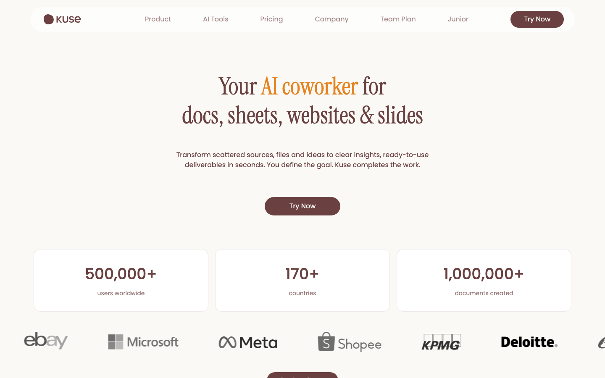

**观察：**

- ✅ 核心定位清晰：Kuse 定位为"AI coworker"，覆盖 docs / sheets / websites / slides 四类交付物，目标用户能立刻判断这是一个**多格式自动化生成 + 交付**的 AI 工作助手，而非单一文档工具。
- ✅ 工作机制说明到位：明确"You define the goal. Kuse completes the work."的输入/输出范式（自然语言描述 → 完整文件），并强调"No drag-and-drop builders. No nodes."，让用户理解这是**对话式生成**而非传统模板/低代码搭建。
- ✅ 关键能力模块化呈现：Connectors（Gmail / Slack / Salesforce / Google Drive 等 60+ 集成）、Skills（品牌语调 / 评分标准 / 报告模板等自定义 AI 行为）、Scheduled Tasks（日报 / 周报 / 月度仪表板自动运行）三者组合，展现出"数据接入 + 个性化 + 自动化"的完整产品骨架。
- ✅ 行业场景化映射强：用 Marketing/Finance/Engineering/Design/Legal 五个部门各自的典型交付物（campaign assets、KPI dashboards、技术文档、PRD 转 spec、合同条款提取）说明产品价值，用户能快速对号入座。
- P2 输出质量与可控性不透明**：宣称"in seconds"生成 pitch decks、data sheets 等完整文件，但没有展示**真实生成样例**（实际 deck/dashboard 截图、可编辑性、准确性保证），用户无法判断输出是 demo 级还是生产可用级。

#### C5: Footer audit

**URL:** https://www.kuse.ai/


**观察：**

- ✅ **核心能力定位清晰**：页面将 Kuse 定位为"AI coworker for docs, sheets, websites & slides"，明确产出物类型（pitch decks、project plans、data sheets、报告、仪表盘），并通过"Describe it, Kuse builds the complete file"说明输入方式是自然语言指令而非拖拽编辑器——用户能快速理解"输入需求→产出可交付文件"的工作机制。
- ✅ **功能体系三件套表达完整**：Connectors（Gmail/Slack/Salesforce/Google Drive 等 60+ 集成）+ Skills（品牌语调、评分量规、报告模板等自定义 AI 行为）+ Scheduled Tasks（定时跑日报/周报/月度仪表盘）构成"数据接入—行为定制—自动执行"的闭环，5 个垂直场景（Marketing、Finance、Engineering、Design、Legal）进一步把抽象能力落地到具体工作流。
- P2 footer 导航暴露产品结构但缺少入口说明**：footer/header 出现 "Product / AI Tools / Pricing / Company / Team Plan" 等条目，但 "AI Tools" 与主功能 "AI coworker" 的关系未在页面解释——是独立工具集？还是 Kuse 内嵌能力？用户无法判断 "AI Tools" 是单独产品线还是子功能。
- P1 关键功能机制留白：60+ 集成的深度未说明**：页面只承诺"Pull data from Gmail, Slack, Salesforce..."，但未说明是单向读取还是双向写回（例如能否把生成的 deck 推回 Slack、能否更新 Salesforce 记录）、权限粒度、数据是否被训练复用——对企业用户而言这是采购决策的核心问题。
- P2 "Evolving Memory / Living Workspace" 概念抽象**：声称"AI memory grows and updates with every change""every creation feeds the next"，但未说明 memory 的存储边界（团队级 vs 个人级）、是否可审查/编辑/导出、与企业知识库的关系——这是产品最差异化的卖点之一却最缺乏功能细节。


### 🤖 AI 能力 / Agent（6 个测点）

**该模块覆盖页面**:

- `https://www.kuse.ai/ai-tools/ai-document-generator`
- `https://www.kuse.ai/ai-tools/ai-notes-generator`
- `https://www.kuse.ai/ai-tools/text-formatter`
- `https://www.kuse.ai/ai-tools/ai-study-tools`
- `https://www.kuse.ai/ai-tools/flashcard-maker`
- `https://www.kuse.ai/ai-tools/ai-presentation-maker`

#### A3: Tool capabilities disclosure

**URL:** https://www.kuse.ai/ai-tools/ai-document-generator

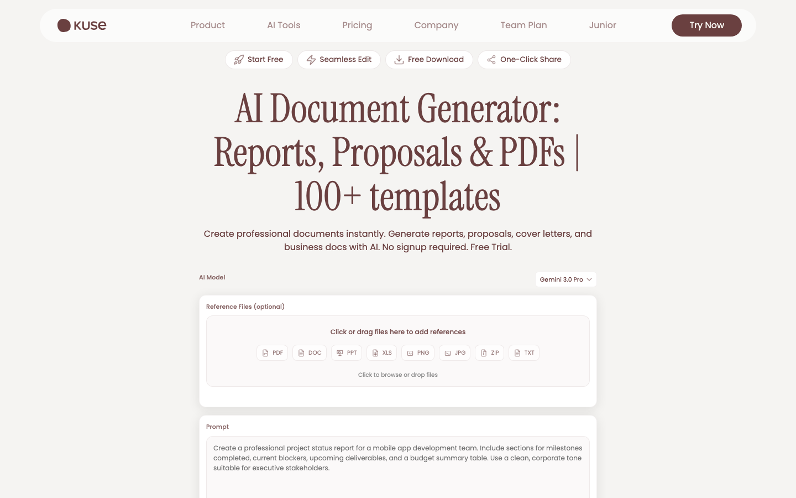

**观察：**

- ✅ 页面清晰揭示了产品的核心能力：AI 文档生成器，可在数秒内生成报告、提案、求职信、商业文档等，支持 100+ 模板，覆盖商业计划书、合同、SOP 等场景。
- ✅ 工作流的输入/输出说明较为完整：输入侧支持 Prompt + 可选参考文件（PDF/DOC/PPT/XLS/PNG/JPG/ZIP/TXT），输出侧支持 PDF / DOCX / 纯文本 / 分享链接，并明确了 4 步使用流程（描述需求 → 选格式与风格 → AI 生成 → 编辑导出分享）。
- ✅ 披露了底层模型选择能力：通用任务用 Gemini 3.0 Pro，图像用 Nano Banana Pro，并提到"All Your Favorite Models, One Unified Place"以及深度研究使用 Claude，体现多模型聚合定位。
- P1** 关键功能机制未说明：参考文件（Reference Files）究竟如何被 AI 使用？是作为 RAG 检索源、风格参考、还是内容抽取？对于"上传 XLS/ZIP 后产出什么"这一核心问题完全没有解释，直接影响用户对产品价值的判断。
- P1** "Real-Time Collaboration / 版本历史 / 评论"功能与"No signup required / Free Trial"的定位存在矛盾——协作功能必然需要账户体系，但页面未说明触发协作的门槛（是否需要 Team Plan？免费用户能否使用？），功能边界模糊。

#### E1: 探索: AI Notes Generator

**URL:** https://www.kuse.ai/ai-tools/ai-notes-generator

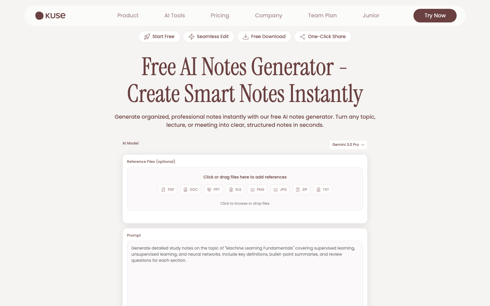

**观察：**

- ✅ **核心功能定位清晰**: 页面明确传达这是一个"AI 笔记生成器"，能将任意主题、讲座、会议内容转化为结构化笔记，解决"快速整理与归纳信息"的痛点，适用于学生（学习笔记/学习指南）和职场人士（会议纪要）两类典型场景。
- ✅ **输入输出与工作流交代完整**: 4 步流程（输入主题 → 选择笔记风格 → AI 生成 → 导出分享）说明了端到端工作机制；输入支持文本/主题，也支持 PDF/DOC/PPT/XLS/PNG/JPG/ZIP/TXT 多种参考文件上传，输出包括 Cornell 笔记、要点摘要、思维导图大纲、会议纪要、学习指南等多种格式。
- ✅ **模型能力差异化呈现**: 明确列出可选 AI 模型（Gemini 3.0 Pro 用于通用、Nano Banana Pro 用于图像），并在底部强调"All Your Favorite Models, One Unified Place"（Claude 深度研究、GPT 创意写作、Gemini 数据推理），体现多模型聚合的产品差异点。
- P2 笔记风格的实际差异未说明**: 虽然列出 Cornell 笔记、思维导图大纲、会议纪要等多种格式，但没有示例或样张展示每种格式的实际输出结构，用户难以判断"思维导图大纲"是文本树形还是可视化图形。
- P2 参考文件的处理机制不明**: 支持上传 PDF/PPT/XLS/ZIP/图片等多种文件，但未说明 AI 如何利用这些参考——是 RAG 检索、全文摘要、还是 OCR 提取？尤其 ZIP 和图片（PNG/JPG）的处理逻辑（是否做 OCR、是否识别图表内容）完全缺失。

#### E2: 探索: Text Formatter

**URL:** https://www.kuse.ai/ai-tools/text-formatter

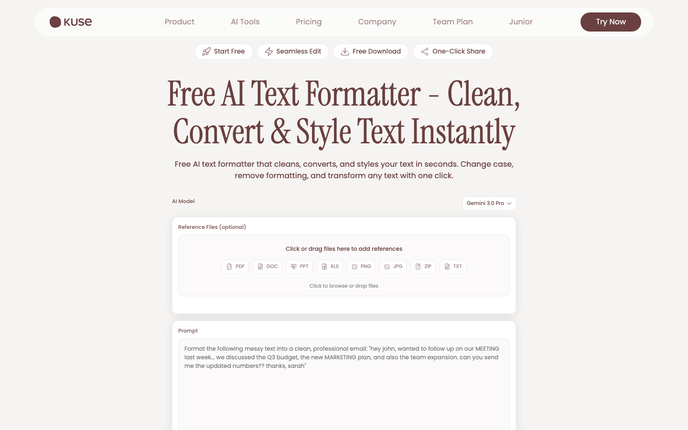

**观察：**

- P1 "一键格式化"承诺与实际交互不符**：页面宣传"One-Click"、"Instantly"、6 大格式化功能（大小写转换、HTML 清理、列表/表格、代码美化等），但实际界面只有一个通用 Prompt 输入框 + Generate 按钮——没有任何专用的格式化按钮、预设选项或下拉菜单，用户必须自己用自然语言描述需求，与"一键"的功能定位严重不符。
- P1 工具定位与底层引擎错配**：这是个文本格式化工具，却暴露了 "AI Model" 切换器（Gemini 3.0 Pro / Nano Banana Pro 图像模型），且参考文件支持 PNG/JPG/ZIP/PPT/XLS——文本格式化为何需要图像生成模型和图像/压缩包输入？页面未解释这些能力与"text formatter"任务的关联，用户无法理解何时该用哪个模型。
- P2 "Custom Style Templates"功能机制完全缺失**：功能列表声称可"保存并复用自己的格式化预设"，但页面没有任何模板管理入口、保存按钮或示例模板列表，用户无从知道模板是按账号保存、是否需要登录、能否分享、是否有数量限制。
- P2 输出形态与下游集成未说明**：步骤 4 说"复制到任何地方使用"，但没说明输出是纯文本、Markdown 还是富文本，是否保留格式化后的样式（如表格、代码高亮），是否支持直接导出为文件、推送到 Google Docs/Notion 等——对开发者和营销人员两类目标用户的实际工作流都是关键缺口。
- P3 6 大功能描述偏抽象、缺少 before/after 示例**：每个功能（如 "Smart Case Conversion"、"Bulk Text Cleanup"）只有一句宣传语，没有展示一段"乱码输入 → 格式化输出"的对比示例，用户难以判断 AI 处理边界（例如能否处理 10MB 的 JSON？CJK 排版能精到什么程度？），降低了对功能能力上限的信任。

#### E3: 探索: AI Study Tools

**URL:** https://www.kuse.ai/ai-tools/ai-study-tools

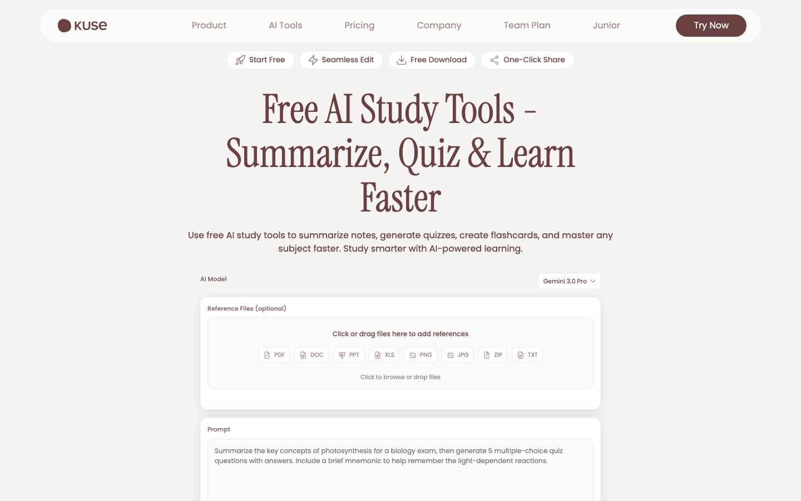

**观察：**

- ✅ **P1正面** 页面清晰传达了 AI 学习工具的四大核心能力：智能摘要、自动测验生成、AI 闪卡创建、学习指南构建，配合"概念解释器"形成完整的学习辅助闭环，用户能快速理解"这个产品能帮我把任何材料转化为学习内容"。
- ✅ **功能工作流明确** — 四步流程（上传材料→选择学习模式→AI 生成→复习掌握）配合多格式输入支持（PDF/DOC/PPT/XLS/PNG/JPG/ZIP/TXT + 粘贴文本/链接/主题），输入边界说清楚了，典型场景定位为学生备考、复习笔记、攻克难懂概念。
- P2 输出规格缺失** — 测验只笼统说"多选/判断/简答"，但未说明：每次生成几题？难度是否可调？闪卡是否支持间隔重复算法导出到 Anki/Quizlet？学习指南的结构模板是否可定制？这些是学习类工具的关键差异点。
- P2 模型选择与功能的对应关系不清** — 页面同时展示 Gemini 3.0 Pro、Nano Banana Pro（图像）、Claude、GPT 等模型，但未说明不同学习任务（摘要 vs 测验 vs 闪卡）默认/推荐使用哪个模型，也未说明免费用户能否使用顶级模型还是受限。
- P1 "Free" 边界未定义** — 标题强调 "Free AI Study Tools" 但同时出现 "Team Plan / Junior / Start Free / Pricing"，免费版的具体配额（每日生成次数、文件大小上限、是否限制模型）完全未提及，用户无法判断免费层是否够用。

#### E4: 探索: Flashcard Maker

**URL:** https://www.kuse.ai/ai-tools/flashcard-maker

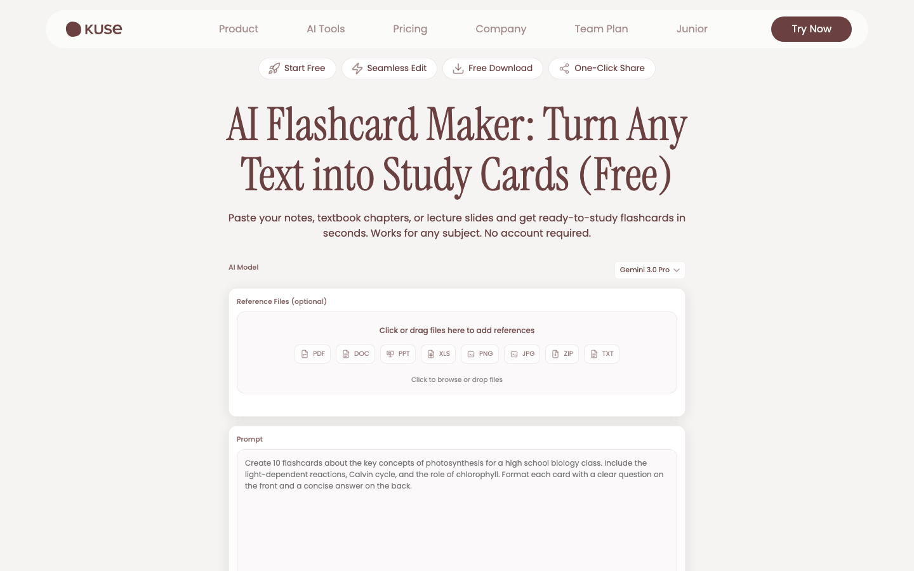

**观察：**

- ✅ **核心功能定位清晰**：页面明确传达产品能力——将任意文本（笔记、教材章节、讲义幻灯片）转化为问答式学习闪卡，目标用户（学生/教育者）和使用场景（备考、概念记忆）一目了然。
- ✅ **工作流四步法说明完整**：Paste Material → AI Generates → Review & Customize → Study & Retain，覆盖了从输入到学习闭环的完整路径，并提到"间隔重复"（spaced repetition）这一具体学习方法学。
- ✅ **输入格式列举具体**：支持 PDF/DOC/PPT/XLS/PNG/JPG/ZIP/TXT 多种参考文件类型，覆盖学生真实材料场景；同时区分了 General 模型（Gemini 3.0 Pro）与 Image 模型（Nano Banana Pro），暗示了图片/图表识别能力。
- P2 输出卡片规模与质量边界未说明**：提到"Bulk Card Creation"和"dozens of flashcards"，但单次最多生成多少张、长文档（如 200 页教材）是否会被截断、生成耗时多久均未交代。
- P2 间隔重复（SRA）实现机制不明**：Step 4 提到"Use spaced repetition to master"，但未说明产品是**内置 SRS 学习引擎**（类似 Anki，含复习调度）还是仅生成卡片后需用户自行导出到第三方工具——这是闪卡类产品的核心功能分水岭。

#### E5: 探索: AI Presentation Maker

**URL:** https://www.kuse.ai/ai-tools/ai-presentation-maker

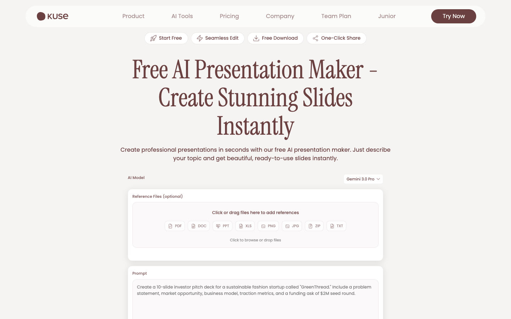

**观察：**

- ✅ **核心工作流清晰**：页面用 4 步流程（描述主题 → AI 生成 → 编辑微调 → 导出演示）+ "Key Features" 六大能力点（一键生成、内容结构化、多种演示格式、受众自适应语气、数据可视化建议、自带演讲备注），把"从 prompt 到完整演示稿"这条主线讲明白了。
- ✅ **输入/输出维度交代到位**：明确支持 prompt 文本输入 + 参考文件上传（PDF/DOC/PPT/XLS/PNG/JPG/ZIP/TXT），输出包含标题、要点、演讲者备注，并可"Free Download / Seamless Edit / One-Click Share"，用户能判断这是"生成完整可用 deck"而不是只出大纲。
- P1 多模型能力描述断裂且自相矛盾**：顶部模型选择器只显示 "Gemini 3.0 Pro（GENERAL）+ Nano Banana Pro（IMAGE）"，但底部又宣称 "All Your Favorite Models, One Unified Place… deep research with Claude, creative drafting with GPT, or complex data reasoning with Gemini"——用户无法判断到底是单一 Gemini 驱动还是真的可切换 Claude/GPT，这是关键功能能力缺口。
- P1 导出与协作能力没说清**：宣传 "Free Download" 和 "One-Click Share"，但未说明导出格式（PPTX / PDF / Google Slides？）、是否保留可编辑结构、分享是公开链接还是协作编辑、能否回到 PowerPoint/Keynote 继续编辑——对决定是否替代现有工作流非常关键。
- P2 "Customize & Refine"的编辑能力深度未交代**：只说可以"编辑文本、重排幻灯片、调整语气深度"，但没说明是否支持：换模板/版式、替换图片、自定义品牌色和字体、插入图表数据源、协同评论、版本历史——决定它是"一次性生成器"还是"可持续生产工具"的核心信息缺失。


### ✨ 产品功能 / 介绍（1 个测点）

**该模块覆盖页面**:

- `https://www.kuse.ai/open-cowork/features`

#### S1: Features / Product page

**URL:** https://www.kuse.ai/open-cowork/features

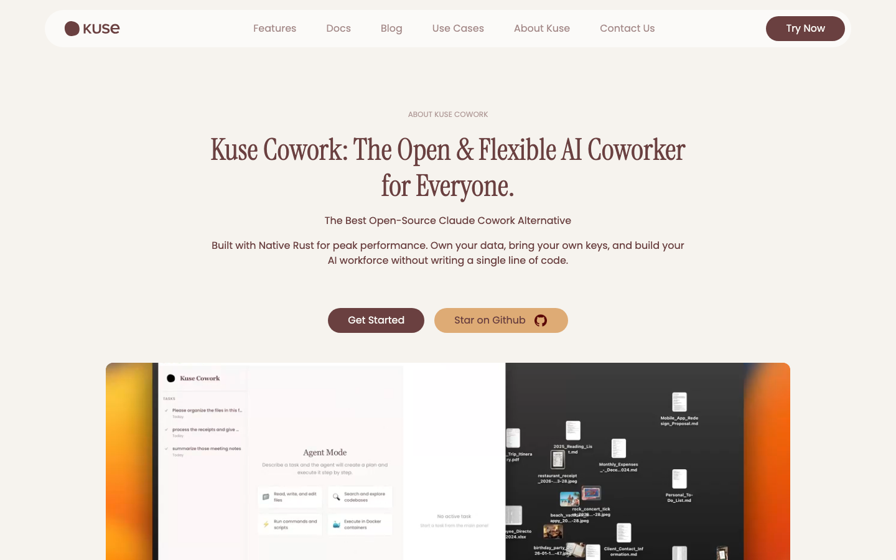

**观察：**

- ✅ **核心功能矩阵清晰**: 页面列出 7 大功能模块（Local AI File Manager / Multi-Provider Support / BYOK / Native Rust / Secure Isolation / Extensible Skills / MCP Protocol），覆盖了文件操作、模型接入、隐私、性能、安全、扩展性、生态七个维度，用户能快速建立"这是一个本地化、可扩展的 AI Agent 运行平台"的整体认知。
- ✅ **差异化定位明确**: 通过 Kuse Cowork vs Claude Cowork 对比表（开源 / 成本 / 部署 / 模型支持四项），清晰回答了"为什么选我而不是 Claude Cowork"——开源 + BYOK 免费 + 跨平台自托管 + 多模型，定位"知识工作者的开源 AI 工作团队"，价值主张可识别。
- P1 关键工作流缺失**: 页面反复强调"AI workforce / AI coworker / build your AI agents without writing a single line of code"，但完全没说明**用户实际如何创建和编排 agent**——是拖拽？对话？模板？多 agent 协作机制是什么？"Cowork（协同工作）"具体指什么形态的协作（多 agent 互相调用？人机协同？任务分派？），核心使用流程是黑盒。
- P1 "Local AI File Manager"输入输出不清**: 只说"直接读写本地文件系统"，但没说明 agent 能对文件做什么类型的操作（搜索 / 总结 / 批量处理 / 代码编辑 / 数据分析？）、支持的文件规模、是否有目录权限控制粒度、agent 如何被触发处理文件，无法判断典型使用场景。
- P2 Extensible Skills 与 MCP 边界模糊**: 同时存在"built-in PDF/DOCX/XLSX 处理 + 自定义 Skills 框架"和"完整 MCP 协议支持"两套扩展机制，但没说明二者关系——Skills 是 MCP 的子集吗？开发者应该写 Skill 还是 MCP server？两条扩展路径的选择标准缺失。


### 💰 定价 / 商业化（1 个测点）

**该模块覆盖页面**:

- `https://www.kuse.ai/`

#### C2: Pricing page

**URL:** https://www.kuse.ai/

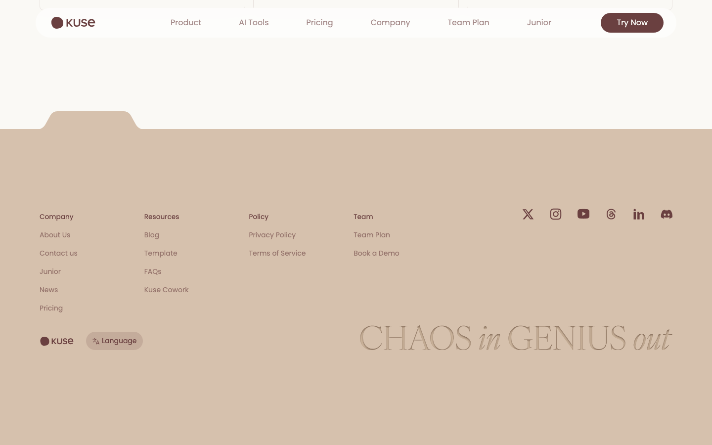

**观察：**

- P1 定价页无定价信息**: 页面标题为 Pricing，但节选内容完全没有展示套餐价格、计费维度（按用户/按 token/按任务）、免费额度或 Team Plan/Junior 的具体差异，用户无法判断"用这个产品需要花多少钱、不同档位能解锁哪些能力"。
- P1 套餐功能差异未说明**: 页面提到 "Team Plan" 和 "Junior" 两个档位，但没有任何对比表说明各档在 Connectors 数量、Skills 数量、Scheduled Tasks 频率、协作席位、AI 调用配额上的差异——这是定价页的核心功能信息。
- P2 核心能力清单较清晰**: ✅ 通过 Connectors（Gmail/Slack/Salesforce/Google Drive 等 60+ 集成）、Skills（自定义 AI 行为如品牌口吻、评分标准、报告模板）、Scheduled Tasks（自动化定时简报/周报/月报）三大模块，较清楚说明了产品的"数据接入—行为定制—自动化输出"工作流。
- P2 输出物类型与场景对应明确**: ✅ 按 Marketing/Finance/Engineering/Design/Legal 五大角色给出了具体交付物（品牌化 deck、KPI dashboard、可视化报告、PRD 转规格书、合同条款抽取），用户能快速对号入座，理解 "AI coworker for docs/sheets/websites/slides" 的实际产出形态。
- P2 工作机制描述抽象**: "Evolving Memory"（AI 记忆随团队变化更新）、"Living Workspace"（每次创作喂养下一次）属于关键差异化能力，但未说明记忆是如何存储、检索、隔离权限的，用户难以判断在企业敏感数据场景下是否可用。


### 🔌 集成 / API（1 个测点）

**该模块覆盖页面**:

- `https://www.kuse.ai/`

#### S9: API / Developer docs

**URL:** https://www.kuse.ai/


**观察：**

- P1 严重缺失 API / 开发者文档信息**：作为 S9 测点关注的 API / Developer docs 维度，此页面通篇未提及 API、SDK、Webhook、REST endpoint、OAuth、开发者门户或技术文档入口，无法判断 Kuse 是否对外暴露可编程接口。对于希望将 Kuse 嵌入自有工作流的技术买家而言，这是关键决策信息的缺位。
- P1 "60+ integrations" 仅作为营销卖点出现，未说明集成机制**：页面提到 Connectors 可拉取 Gmail / Slack / Salesforce / Google Drive 数据，但没有任何关于这些 connector 是官方维护、用户自建、还是通过开放 API/插件框架扩展的说明，也未链接到集成目录或开发者认证体系。
- P2 Skills（自定义 AI 行为）功能描述模糊**：宣传提及 Skills 可定义"brand voice、grading rubrics、report templates"，但未说明 Skills 是否支持脚本化 / DSL / 函数调用 / 通过 API 注入，对开发者评估扩展性不足。
- P2 Scheduled Tasks 与 Connectors 缺少触发器 / 编程入口说明**：定时任务、数据连接器这些典型应有 API 支撑的能力，页面只给出"set it once"的用户视角描述，未透露是否能通过外部系统触发任务、回写结果或订阅事件。
- P3 缺少面向开发者的导航入口**：顶部导航仅有 Product / AI Tools / Pricing / Company / Team Plan，没有 Developers、Docs、API、Changelog 等通道，开发者用户从此页几乎无法进入任何技术资料路径，需要额外搜索才能确认产品是否提供 API。


### 🔒 安全 / 信任（1 个测点）

**该模块覆盖页面**:

- `https://www.kuse.ai/`

#### S12: Trust / Security page

**URL:** https://www.kuse.ai/

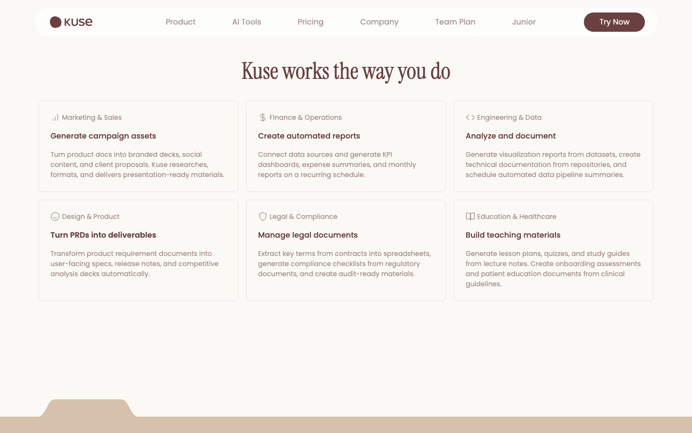

**观察：**

- P1 测点错配严重**: 该页面被标记为 "Trust / Security page (S12)"，但实际内容是产品主页/营销页，**完全没有任何信任与安全相关的功能信息**——没有数据加密说明、没有合规认证（SOC2 / ISO27001 / GDPR / HIPAA）、没有数据驻留政策、没有 AI 模型数据使用条款、没有访问控制说明。对于一个对接 Gmail / Slack / Salesforce / Google Drive 等 60+ 系统的 AI 协作产品而言，缺失信任页是企业采购的硬性障碍。
- P1 功能边界模糊**: 页面声称 Kuse 能产出 "pitch decks, project plans, data sheets, KPI dashboards, compliance checklists" 等几乎所有办公交付物，但未说明**输出质量边界**——是模板填充？端到端生成？人工可编辑程度多少？输出文件格式是什么（.pptx / .xlsx / 原生 web 文档）？是否可导出？读者无法判断产出物是"可直接交付"还是"需大量返工"。
- P2 集成清单缺失**: 反复提到 "60+ integrations" 与 Gmail / Slack / Salesforce / Google Drive，但**没有给出完整集成列表、认证方式（OAuth / API key）、权限粒度、是否支持企业 SSO**。Finance & Legal 场景对集成的合规性极敏感，仅列举 4 个示例不足以支撑决策。
- P2 "Evolving Memory" 与 "Skills" 机制不透明**: 提到 AI 记忆会"随团队变更增长"、Skills 可定义"品牌语调 / 评分标准 / 报告模板"，但未说明：记忆存储在哪？团队成员能否查看/编辑/删除记忆？Skills 是 prompt 模板还是更深层的微调？跨工作区是否隔离？这正是企业用户最在意的"AI 黑盒"问题。
- P2 Scheduled Tasks 工作机制未交代**: "Set it once. Daily briefings 自动运行" 是核心差异化卖点，但缺失：调度粒度（小时 / 天 / 周 / cron）？失败重试策略？输出送达方式（邮件 / Slack / 工作区通知）？数据源刷新时机？这些决定了用户能否把它接入真实业务流程。


### 🏢 公司 / 团队（2 个测点）

**该模块覆盖页面**:

- `https://www.kuse.ai/about`
- `https://www.kuse.ai/team-plan`

#### E6: 探索: About Us

**URL:** https://www.kuse.ai/about

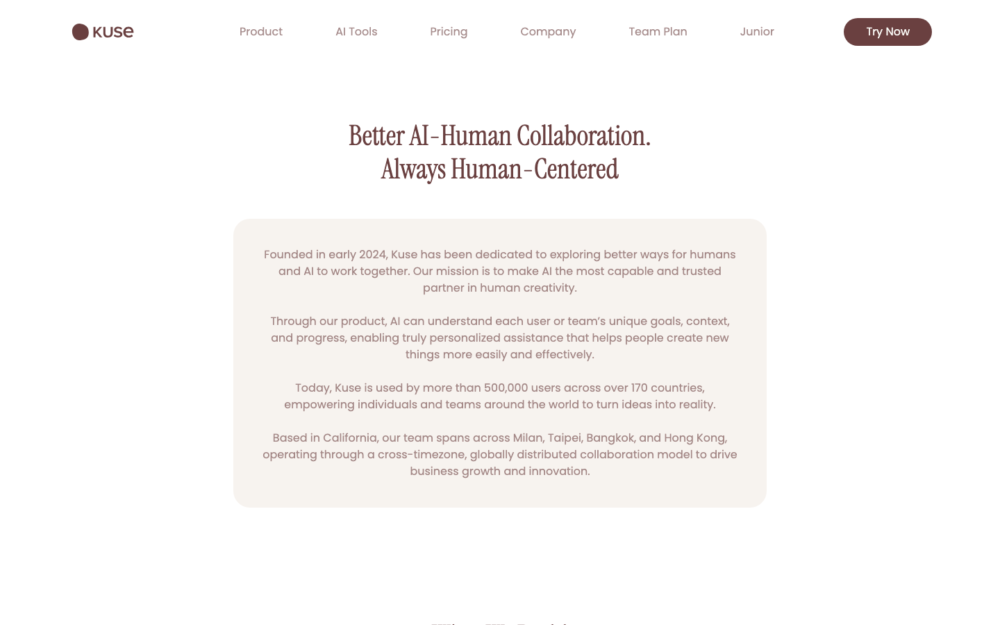

**观察：**

- ✅ 页面清晰揭示了 Kuse 公司的双产品矩阵：Kuse（Agentic AI Coworker，面向专业人士/独立创业者/自由职业者，覆盖 Docs/Sheets/Websites/Slides 四类产出物）和 Junior（AI Employee，面向 5–50 人的初创和小企业），两条产品线的定位区隔（个人生产力 vs. 团队雇员）说明明确。
- ✅ Junior 的功能机制描述具体且有差异化：拥有独立姓名、邮箱、记忆，可加入 Slack/Microsoft Teams 工作区，读取文档、参加会议、24/7 主动协作——这清晰传达了"AI 员工"而非"AI 工具"的产品理念，并暗示了集成能力与工作流接入方式。
- P2 Kuse 主产品的功能描述偏抽象（"learns how you work and handles the heavy lifting, from drafting reports to building presentations"），缺少关键功能细节：如何"学习"用户工作方式（基于历史文档？行为追踪？显式偏好？）、Docs/Sheets/Websites/Slides 四个模块各自的能力边界与输入输出未说明，用户读完难以判断它和通用 AI 助手的差异。
- P2 Junior 的"reads your docs, attends your meetings"宣称功能边界不清：会议是实时听写还是事后总结？读取文档的范围、权限管理、安全合规如何处理？"works proactively"具体指什么触发机制（事件驱动？定时巡检？）也未说明，对企业采购决策者来说信息缺口较大。
- P2 集成清单仅披露 Slack 和 Microsoft Teams（"more to come"），未列出其他已对接系统（如 Notion、Google Workspace、Jira、CRM 等），对于"AI Employee"这一定位而言，集成广度是核心选型依据，信息缺失会削弱说服力。

#### E8: 探索: Team Plan

**URL:** https://www.kuse.ai/team-plan

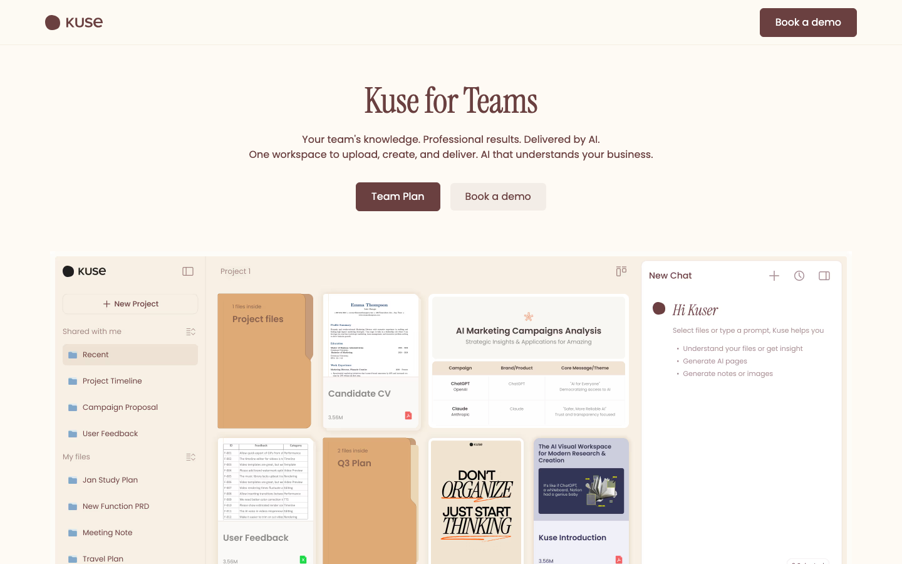

**观察：**

- ✅ 功能定位清晰** — 页面明确传达 Kuse for Teams 是"Agentic AI workspace"，核心工作流为：上传企业知识 → AI 理解业务上下文 → 一键生成品牌标准的 slides / reports / webpages。解决了"信息散落 + 人工整理排版耗时数天"的痛点，适用场景是团队级知识协作与对外交付物生产。
- P1 关键功能机制未说明** — "Zero hallucination, fully traceable, fully auditable"是核心卖点，但页面完全没解释**如何**实现：是基于 RAG？引用回溯 UI 长什么样？审计日志包含哪些字段？如何"selected data sources"（手动勾选 / 自动检索 / 权限隔离）？企业客户最关心的合规可验证性被当作口号而非功能展示。
- P1 "Unify Best LLM Models" 模型清单缺失** — 宣称"管理所有 AI 工具于一个平台"，但未列出实际支持哪些模型（GPT-4? Claude? Gemini?）、是否可按任务自动路由、是否支持自带 API Key（BYOK）、按用户/团队的模型配额管理机制。对决策者来说这是采购替换原有订阅的核心判断依据。
- P2 知识库输入/集成清单空白** — "Upload"是工作流第一步，但未说明支持的文件类型（PDF / PPT / Notion / Confluence / Google Drive / Slack？）、单文件/总容量上限、是否支持实时同步连接器、结构化数据（数据库 / CRM）接入方式。Pro-Life Payments 案例提到"transaction data 自动整合"，暗示有数据接入能力但完全没展开。
- P2 输出能力边界模糊** — "slides, reports, webpages"是结果物，但缺少关键功能细节：slides 是否支持自定义模板/品牌色注入？webpages 是否可发布托管还是仅导出 HTML？是否支持导出 PPTX / DOCX 编辑？AI 生成的内容能否在 workspace 内继续协同编辑？


### 📰 博客 / 内容（1 个测点）

**该模块覆盖页面**:

- `https://www.kuse.ai/blog/workflows-productivity`

#### S6: Blog / Resources

**URL:** https://www.kuse.ai/blog/workflows-productivity

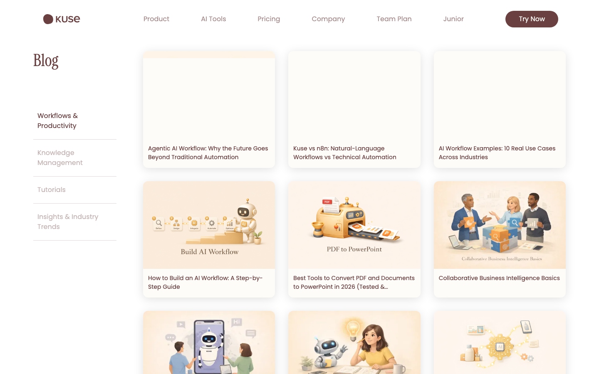

**观察：**

- P2** Blog 内容大量围绕"AI workflow / collaboration / task management"等通用话题，但页面未把这些文章与 Kuse 自身的具体功能模块（例如自然语言工作流、知识管理、协作画布）建立明确锚点，读者难以从博客倒推出"Kuse 实际能做什么"。
- ✅** 从 "Kuse vs n8n: Natural-Language Workflows vs Technical Automation" 这类对比文标题可推断出产品的核心差异化能力——**用自然语言而非节点配置来搭建 AI workflow**，这是对产品定位最有信息量的功能信号。
- P2** 分类仅有 "Workflows & Productivity / Knowledge Management / Tutorials / Insights & Industry Trends" 四个标签，缺少按**产品功能模块**（如 Agent 编排、文档转换、PDF→PPT、团队协作）组织的入口，用户无法快速定位"如何用 Kuse 完成 X 任务"的实操教程。
- P1** 页面包含 "Best Tools to Convert PDF and Documents to PowerPoint in 2026" 这类暗示产品具备 **PDF/文档转 PPT 能力**的文章，但 Blog 列表层面未明确这是 Kuse 的原生功能还是第三方工具横评，造成功能边界模糊——读者难以判断 Kuse 自身到底支持哪些输入/输出格式。
- P2** 缺少**真实客户案例 / 行业落地故事**类内容（标题多为 "10 Real Use Cases" "Examples You Can Copy" 等泛化清单），没有"某公司用 Kuse 在 X 场景下做了 Y，节省 Z"的具体功能验证，工作流的**实际输入→输出链路**仍停留在抽象层面。


### 📖 文档 / 帮助（2 个测点）

**该模块覆盖页面**:

- `https://www.kuse.ai/`
- `https://www.kuse.ai/faqs`

#### C7: Help / Documentation

**URL:** https://www.kuse.ai/

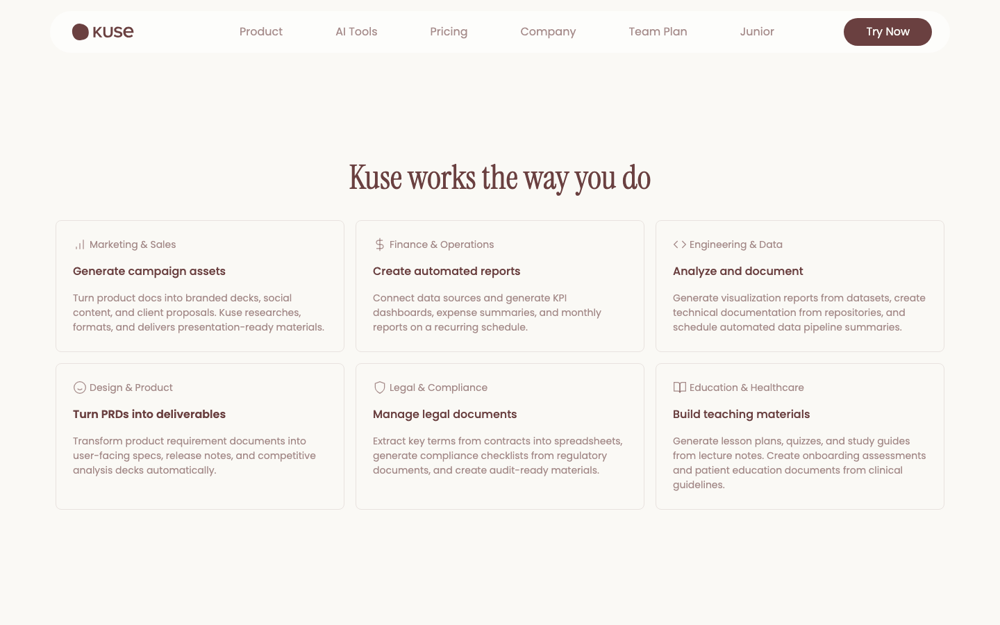

**观察：**

- P1 缺失帮助/文档入口**：顶部导航仅有 Product / AI Tools / Pricing / Company / Team Plan，未见 Docs / Help Center / Learn / Tutorials / Knowledge Base 等任何文档入口，用户无法从首页找到使用说明或入门教程。
- P1 核心概念零文档支撑**：页面提出了 Skills（自定义 AI 行为）、Connectors、Scheduled Tasks、Evolving Memory 等独有概念，每个只有一句话定义，没有指向"如何创建一个 Skill""如何配置 Scheduled Task"的详细说明或链接，用户无法判断这些能力的边界与配置方式。
- P2 集成清单不可查**：宣称"Gmail, Slack, Salesforce, Google Drive, and 60+ integrations"，但未提供完整集成列表页面或文档入口，无法验证是否覆盖用户自己的工具栈（如 Notion / HubSpot / Jira 等）。
- P2 缺少 quickstart / 示例库**：场景文案描述了 5 大职能（Marketing、Finance、Engineering、Design、Legal）的用例，但没有可点击的样例工作流、模板库或 demo deliverable 链接，用户读完知道"可以做"却不知"具体怎么开始第一步"。
- P2 缺少开发者/API 文档线索**：产品支持 60+ 集成和自动化任务，但未提示是否存在 API、Webhook、自定义 Connector 的开发者文档，对希望做深度集成的技术团队来说信息缺口明显。

#### E7: 探索: FAQs

**URL:** https://www.kuse.ai/faqs

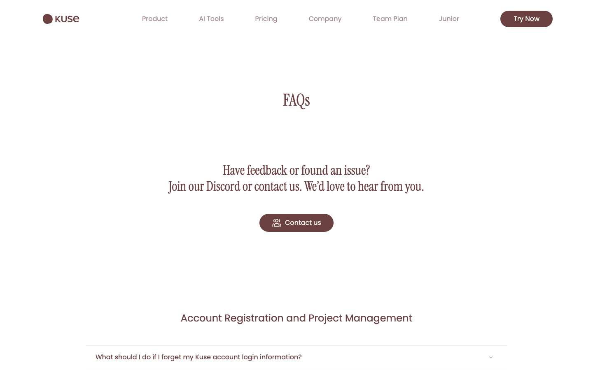

**观察：**

- P1** FAQ 只提到"free plan 有 unlimited projects 和 limited credits"，但用 `Credits equivalent to X times of interactions per week / month at this website` 这种未填充的占位符描述积分量，等于关键的免费额度数字完全缺失，用户读完仍无法判断免费版能用多少。
- P2** 关于产品能力本身（Kuse 是做什么的 AI 工作空间、支持哪些任务类型、credits 对应哪些动作如对话/生成/检索）几乎没有解释——FAQ 全部围绕账户、订阅、积分计费等运营性问题，缺少功能层面的"能为我做什么"答疑（如：支持什么文件类型？能调用哪些 AI 模型？项目里能做什么？）。
- P2** 升级/降级规则只列出 Monthly→Monthly、Monthly→Yearly、Yearly→Yearly 三种路径，缺失 Yearly→Monthly 降级、以及取消订阅后 credits 是否保留、历史项目是否只读等功能可用性细节，影响用户对"取消后还能不能继续用"的判断。
- P3** "View History" 功能介绍了如何查看每次 prompt 的积分消耗，这是积分透明度的有用能力，但没说明是否能按项目筛选、是否能导出、是否显示模型类型，工作流细节不完整。
- P3** "Team Plan / Junior" 等套餐名出现在导航中，但 FAQ 未解释不同套餐（个人 vs 团队 vs Junior）在功能权限、协作能力、credits 分配上的差异，用户难以对照选择。


### 🔐 登录后 Workspace（dashboard）（1 个测点）

**该模块覆盖页面**:

- `https://app.kuse.ai/f`

#### L1: Dashboard 入口: home

**URL:** https://app.kuse.ai/f

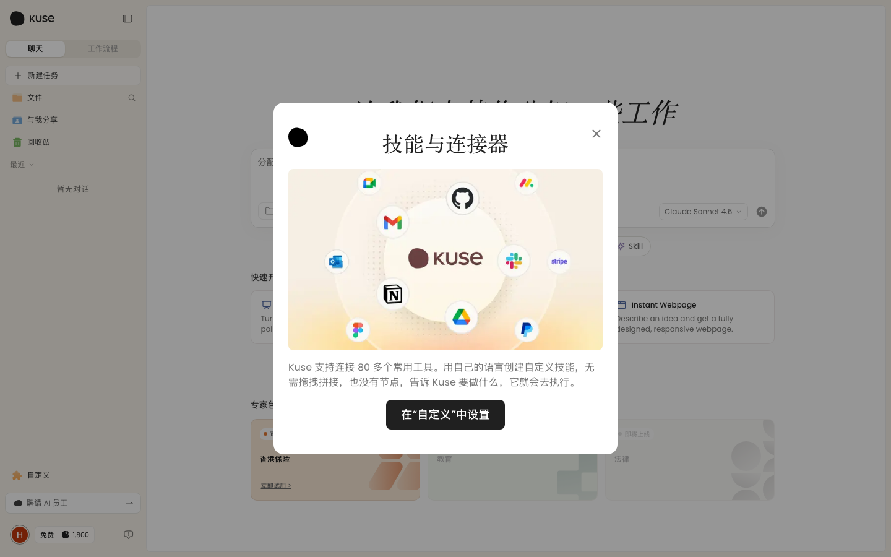

**观察：**

- ✅ Dashboard 通过输出类型选择器（Document / Present / Excel / Image / Skill）+ 三个具体快速开始模板（文件转幻灯片、收据转表格、描述转网页），清晰传达"这是一个把任意输入转成多种结构化产出的 AI workspace"，比抽象 slogan 更有信息量
- ✅ "聘请 AI 员工 / 1,800 免费" 揭示了产品的核心比喻（AI agent as 员工）与积分制商业模型，把 agent 能力包装成可雇佣的实体
- P1** "技能与连接器"声称支持 80+ 工具且可用自然语言创建自定义技能，但页面没列出**任何具体的连接器**（Salesforce？Notion？Slack？）也没给"自定义技能"的最小可行示例 — 用户无法判断该产品是否覆盖自己的工作流
- P1** "Kuse Default" vs "Claude Sonnet 4.6" 模型选择器直接暴露，但未说明 Kuse Default 是什么（自研模型？路由器？模型组合？）— 这是核心能力问题，影响用户对产品技术深度的判断
- P2** "专家包"机制（香港保险已上线，教育/法律即将上线）暗示了垂直 agent 策略，但未解释**一个专家包内部包含什么**（专用提示词？私有知识库？专属技能？定制工作流？）— 这是该产品差异化能力的关键，不应只用名字一笔带过


### 📌 其他（3 个测点）

**该模块覆盖页面**:

- `https://www.kuse.ai/this-page-should-not-exist-product-audit-test-1234`
- `https://www.kuse.ai/`

#### C8: 404 error handling

**URL:** https://www.kuse.ai/this-page-should-not-exist-product-audit-test-1234


**观察：**

- P1** 该页面是一个标准 404 错误页，未揭示任何产品功能、能力或工作流信息——纯粹是路由失败的兜底页面，对理解"产品能做什么"零贡献。
- P2** 功能性缺口：404 页未提供任何回到核心功能入口的导航线索（如返回首页、搜索、热门功能链接），用户误入此页后无法被引导至产品的实际能力区域，丧失了一次功能曝光机会。
- P3** 文案"This page could not be found"仅说明技术状态，未借此机会向用户传达产品定位或推荐替代功能路径（如"试试我们的 X 功能"），属于功能引导上的浪费。
- P2** 无法从此页面推断产品的输入/输出/集成/适用场景中的任何一项——它对功能审计本身不构成有效信息源，建议在正式审计中将其归为"无功能信号"测点并降权处理。

#### A1: Main input / chat interface

**URL:** https://www.kuse.ai/

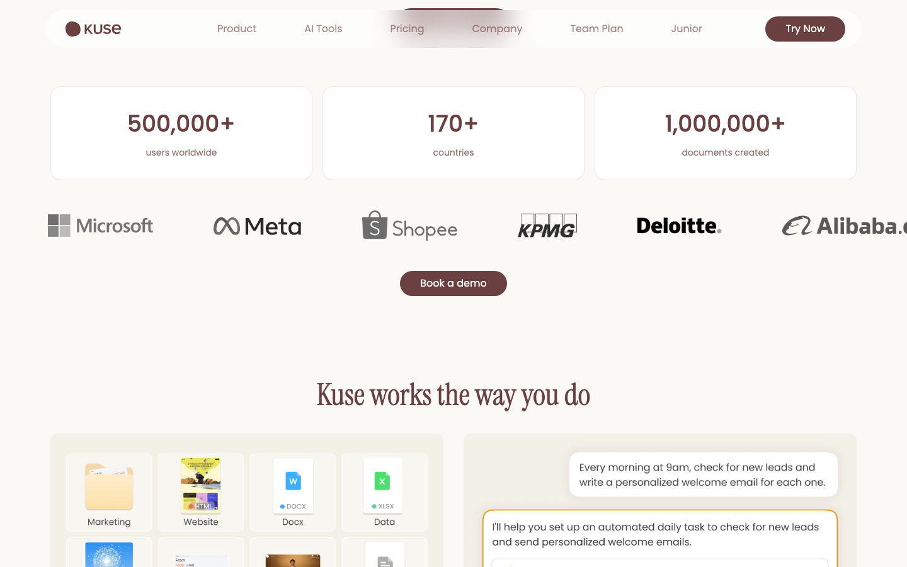

**观察：**

- ✅ 产品定位清晰**: 页面明确传达 Kuse 是"AI coworker"，覆盖四类交付物（docs/sheets/websites/slides），核心工作流是"输入散乱来源 → 输出可直接使用的交付物"，用户能快速理解产品做什么。
- ✅ 关键能力模块化呈现**: 列出四大能力支柱——文档统一管理、Connectors（Gmail/Slack/Salesforce/Google Drive 等 60+ 集成）、Skills（品牌语调/评分标准/报告模板等自定义 AI 行为）、Scheduled Tasks（日报/周报/月度仪表盘自动运行），功能边界划分明确。
- ✅ 场景化用例覆盖完整**: 针对 Marketing & Sales、Finance & Ops、Engineering & Data、Design & Product、Legal & Compliance 五类岗位分别给出具体产出物（品牌化 deck、KPI dashboard、技术文档、release notes、合规清单），用户能对号入座判断适用性。
- P2 "Evolving Memory / Living Workspace" 机制不透明**: 宣称"AI memory grows with every change""every creation feeds the next"，但未说明记忆是如何存储、检索、跨项目共享的，也没说能否手动编辑/删除记忆，企业用户难以评估数据治理风险。
- P2 输入/输出格式与质量边界缺失**: 没有说明支持哪些输入文件格式（PDF？CSV？图片 OCR？）、输出文件能否导出为标准 .pptx/.xlsx/.docx 进行二次编辑，也未提及单次任务的复杂度上限（例如能生成多少页 deck、能处理多大数据集）。

#### A2: Example prompts / Templates

**URL:** https://www.kuse.ai/

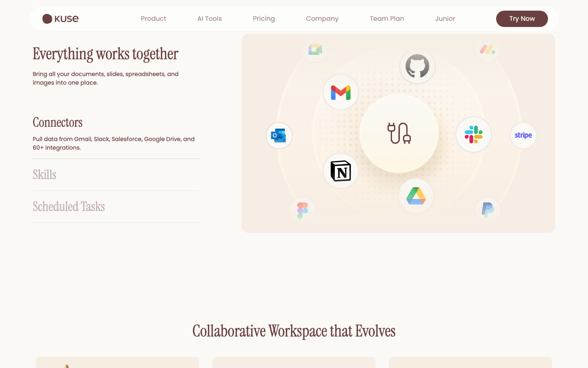

**观察：**

- P2 页面未提供任何 example prompts（示例提示词）或 templates（模板库），用户无法判断如何向 AI 描述任务才能得到好结果，也看不到"输入什么 → 输出什么"的具体样例
- P1 核心交互机制"Describe it, Kuse builds"完全是抽象口号，没有给出哪怕一条真实 prompt 示例（如"帮我把这份 PRD 转成发布说明"），用户无法形成对产品能力边界的具体预期
- P2 五大行业场景（Marketing/Finance/Engineering/Design/Legal）只用一句话概括产出物，缺少对应的模板入口或可复制 prompt，场景描述停留在营销文案层面而非可操作示范
- P2 Skills（自定义 AI 行为，如 brand voice、grading rubrics、report templates）被列为关键能力，但没有展示任何预置 Skill 模板或社区模板库，用户不知道是否需要从零搭建
- P3 Scheduled Tasks 提到"daily briefings、weekly reports、monthly dashboards"，但未给出这些定时任务的 prompt 模板或配置示例，用户难以判断如何把一次性 prompt 转化为可复用模板


### ⚠️ 未找到的测点（3 个测点）

**该模块覆盖页面**:

- `https://www.kuse.ai/`

#### C3: Sign-up flow (no submit)

**URL:** https://www.kuse.ai/
**观察：**

- [Link not found] 该模板期望的链接（sign up|signup|get started|start free|注册|免费试用|开始）在 https://www.kuse.ai/ 上未找到 — 可能产品用了不同的措辞或这个功能不存在。 已跳过截图与 LLM 解读以避免重复首页快照。

#### C4: Login page

**URL:** https://www.kuse.ai/
**观察：**

- [Link not found] 该模板期望的链接（log in|login|sign in|登录|登入）在 https://www.kuse.ai/ 上未找到 — 可能产品用了不同的措辞或这个功能不存在。 已跳过截图与 LLM 解读以避免重复首页快照。

#### S4: Customer / logo wall

**URL:** https://www.kuse.ai/
**观察：**

- [Link not found] 该模板期望的链接（customers|clients|case studies|客户|案例）在 https://www.kuse.ai/ 上未找到 — 可能产品用了不同的措辞或这个功能不存在。 已跳过截图与 LLM 解读以避免重复首页快照。


---

## 4. 第三方社区反馈

#### 5.1 调研范围与方法

通过 WebSearch 在 Reddit / Product Hunt / Hacker News / G2 / Trustpilot 五个平台用 `"kuse.ai"` 与 `kuse + 产品概念` 双重锚定搜索，覆盖时间窗约 **2025-08 至 2026-01**（约 9 个月）。

- **Product Hunt**：1 次正式 launch（2025-08-15），677 upvotes，3 条带签名 review（综合 3.7/5）
- **Hacker News**：1 条 Show HN（item #46677860，2026-01）针对 Kuse Cowork（同团队的开源 BYOK 副产品），评论数量少但内容具体
- **Reddit**：用 `"kuse.ai" site:reddit.com` 与 `kuse AI canvas workspace reddit` 两次搜索**均无显著独立讨论**
- **G2 / Trustpilot**：**未检索到产品独立页面**
- **第三方评测聚合站**（Automateed / Booststash / Skywork / SourceForge）：有结构化 pros/cons 整理，作为辅证（非一手社区声音）

#### 5.2 核心议题（按讨论频次）

| 议题 | 讨论方向 | 出现频次 | 主要来源平台 |
|---|---|---|---|
| 时间节省 / 工作流加速（2 周 → 2-4 天） | 正面 | 多次 | Product Hunt, 评测聚合站 |
| 视觉画布 + "library" 功能解决 AI 不可预测性 | 正面 | 2 次以上 | Product Hunt |
| 系统提示词泄露（5 轮后） / 安全成熟度 | 负面 | 1 次（高 signal） | Product Hunt |
| tldraw 水印 / 第三方组件授权疑问 | 负面 | 1 次 | Product Hunt |
| Credit 消耗膨胀（大文件、反复总结很贵） | 负面 | 多次 | 评测聚合站, PH 评论 |
| BYOK + Docker sandbox（Kuse Cowork 副产品） | 正面 | 1 次 | Hacker News |
| MCP 工具范围 / 策略执行的治理缺口 | 中性/担忧 | 1 次（同上 HN thread） | Hacker News |

#### 5.3 正面评价 / 用户喜欢的点

- **来源**: [If ChatGPT, Notion, and a whiteboard had a genius baby](https://www.producthunt.com/products/kuse) — `Marat Salikhov`（市场分析顾问），2025-08
  - **原文引用**:
    > 「What used to take me 2 weeks of niche research now only takes 2-4 days... I've cut my pitch deck creation time from 3 weeks down to 1.」
  - **关键词**: 时间节省、研究加速、跨内容整合

- **来源**: [Kuse — PH launch comments](https://www.producthunt.com/products/kuse) — `Emilia Johnson`（设计师），2025-08
  - **原文引用**:
    > 「The library feature is a game changer... solves the biggest problem with AI's unpredictability.」
  - **关键词**: library 功能、可控性、对设计师工作流的理解

- **来源**: [Show HN: Kuse Cowork – An open source, BYOK alternative to Claude Cowork](https://news.ycombinator.com/item?id=46677860) — `kxbnb`（自称 keypost.ai），2026-01
  - **原文引用**:
    > 「Love the security-first approach with Docker sandboxing and the BYOK model for compliance-heavy teams.」
  - **关键词**: BYOK、Docker 沙盒、合规友好（注：评的是 Kuse Cowork 这个副产品，不是主站画布）

#### 5.4 负面 / 批评 / 担忧

- **来源**: [Kuse — PH launch comments](https://www.producthunt.com/products/kuse) — `Derek Bee`，2025-08（4 helpful votes）
  - **原文引用**:
    > 「Great idea, abysmal execution... The thing leaks its own system prompt after five messages. This isn't a product, it's a security vulnerability with a chat interface.」
  - **关键词**: prompt 泄露、产品成熟度、安全风险

- **来源**: [Kuse — PH launch comments](https://www.producthunt.com/products/kuse) — `Douglas Yueming Lai`，2025-08
  - **原文引用**: 指出画布中 **tldraw 水印** 被部分隐藏，质疑是否取得了合法授权
  - **关键词**: 第三方组件、知识产权合规、技术诚信

- **来源**: 多个评测站综合（[Automateed Kuse Review](https://www.automateed.com/kuse-review)、[Booststash Kuse Review](https://www.booststash.com/kuse-ai-review-2025/)），引用真实用户反馈
  - **原文引用**:
    > 「Credit usage can add up with heavy uploads... bigger documents and repeated re-summarizing can cost more than you'd think.」
  - **关键词**: credit 燃烧、隐性成本、重度用户压力

- **来源**: [Show HN: Kuse Cowork](https://news.ycombinator.com/item?id=46677860) — `kxbnb`，2026-01（同 5.3 用户的另一面）
  - **原文引用**: 对 MCP 工具范围和策略执行提出 governance 疑问；创始人 `rctstudio2018` 承认目前 **"depends on the model to reliably follow the MCP definitions and scopes"**
  - **关键词**: agent 治理缺口、模型可靠性依赖、企业部署阻力

#### 5.5 与官方叙事的差异（vs §4.1 Narrative）

**官方叙事**把 Kuse 定位为"AI teammate / coworker"——一个**人格化的、可信赖的同事**。但社区一手反馈呈现的是**两种相互背离的形象**：

1. **正向用户的语言里几乎没有"teammate"这个词**。Marat、Emilia 等人描述的是"工具加速我的研究 / 让我的设计可复用"——是**生产力工具**框架，不是协作伙伴框架。官方想树立的"同事"心智在用户实感中并未自然产生。
2. **负向用户直接撞上"成熟度 vs 信任"的矛盾**：Derek Bee 关于 prompt 泄露的指控、Douglas 关于 tldraw 水印的合规质疑、kxbnb 关于 MCP scope 依赖模型自觉的担忧——都指向同一个 gap：**一个被宣传为"可信赖同事"的产品，在基础安全/合规/治理上还处在早期阶段**。当你把 AI 定位为"team member"，用户的信任阈值会自动抬高到员工级别，而当前产品交付的成熟度更接近 demo 级 SaaS。

简言之：**官方话术想说"它是同事"，社区一手声音在说"它是一个有惊艳点也有破绽的早期工具"**。这个 gap 在企业销售场景中尤其关键。

#### ⚠️ 信息来源声明

本节所有内容来自**非官方第三方平台**（Product Hunt 公开评论、Hacker News 公开 thread、独立评测站）。内容可能含偏见 / 过时 / 个别极端观点。Reddit、G2、Trustpilot 在调研窗口内**未检索到 kuse.ai 的独立讨论**——可能反映产品当前主要受众尚未进入这些平台的讨论圈。决策时建议结合 §2.5 官方信息 + §3 实测综合判断。

Sources:
- [Kuse on Product Hunt (launch page)](https://www.producthunt.com/products/kuse)
- [Show HN: Kuse Cowork – An open source, BYOK alternative to Claude Cowork](https://news.ycombinator.com/item?id=46677860)
- [Kuse AI: Complete Review 2026 + Real Pros & Cons (Automateed)](https://www.automateed.com/kuse-review)
- [Kuse Review (2025): The AI-Powered 'Second Brain' (Booststash)](https://www.booststash.com/kuse-ai-review-2025/)
- [Kuse AI Review: The Visual Workspace (Skywork)](https://skywork.ai/skypage/en/Kuse-AI-Review-The-Visual-Workspace-That's-Redefining-Productivity/1976169801128275968)

---

## 5. 总结

### 5.1 一句话评价

目标产品 **https://www.kuse.ai/** 在 **ai-tool** 模板的 **standard** 档位评测下存在严重问题：识别问题 75 个（P1 27 / P2 42 / P3 6），正面发现 29 个。详见 §3 体验流程与 §3 问题清单。

### 5.2 最大优点

1. **[C1]** ✅ 核心定位清晰：Kuse 定位为"AI coworker"，覆盖 docs / sheets / websites / slides 四类交付物，目标用户能立刻判断这是一个**多格式自动化生成 + 交付**的 AI 工作助手，而非单一文档工具。
2. **[C1]** ✅ 工作机制说明到位：明确"You define the goal. Kuse completes the work."的输入/输出范式（自然语言描述 → 完整文件），并强调"No drag-and-drop builders. No nodes."，让用户理解这是**对话式生成**而非传统模板/低代码搭建。
3. **[C1]** ✅ 关键能力模块化呈现：Connectors（Gmail / Slack / Salesforce / Google Drive 等 60+ 集成）、Skills（品牌语调 / 评分标准 / 报告模板等自定义 AI 行为）、Scheduled Tasks（日报 / 周报 / 月度仪表板自动运行）三者组合，展现出"数据接入 + 个性化 + 自动化"的完整产品骨架。

### 5.3 最大风险

1. **[C2]** P1 定价页无定价信息**: 页面标题为 Pricing，但节选内容完全没有展示套餐价格、计费维度（按用户/按 token/按任务）、免费额度或 Team Plan/Junior 的具体差异，用户无法判断"用这个产品需要花多少钱、不同档位能解锁哪些能力"。
2. **[C2]** P1 套餐功能差异未说明**: 页面提到 "Team Plan" 和 "Junior" 两个档位，但没有任何对比表说明各档在 Connectors 数量、Skills 数量、Scheduled Tasks 频率、协作席位、AI 调用配额上的差异——这是定价页的核心功能信息。
3. **[C5]** P1 关键功能机制留白：60+ 集成的深度未说明**：页面只承诺"Pull data from Gmail, Slack, Salesforce..."，但未说明是单向读取还是双向写回（例如能否把生成的 deck 推回 Slack、能否更新 Salesforce 记录）、权限粒度、数据是否被训练复用——对企业用户而言这是采购决策的核心问题。

### 5.4 用户增长漏斗推断

#### 官网增长漏斗推断图

```
Stage 1: 价值主张认知（Team Plan 落地页）
    ↓ 关键触点: "Agentic AI workspace" 定位 + 工作流叙述（上传→理解→生成）[E8]
Stage 2: 痛点共鸣与场景代入
    ↓ 关键触点: "信息散落 + 人工排版数天" 痛点描述 + Pro-Life Payments 案例 [E8]
Stage 3: 信任评估（合规 / 模型 / 集成）
    ↓ 关键触点: "Zero hallucination, fully traceable, fully auditable" 口号 [E8]
Stage 4: 决策动作（Demo / 联系销售）
    ↓ 关键触点: Team Plan 路径推断为销售导向（无自助价格 → 推断为 Contact Sales / Book Demo 漏斗）
Stage 5: 转化入口（表单提交）
    ↓ 终点: 完成 Demo 申请进入销售跟进流程
```

> ⚠️ 数据局限说明：当前仅观察到 Team Plan 页（E8），未观察到独立 pricing 页、signup 页或 demo 表单细节。Stage 4-5 主要为基于 "Team Plan" 命名惯例的推断，非页面直接陈述。

#### 关键漏斗节点详解

**Stage 1: 价值主张认知**
- 页面陈述：明确定位为"Agentic AI workspace for Teams"，工作流为"上传企业知识 → AI 理解业务上下文 → 生成 slides / reports / webpages" [E8]
- 我的推断：访客在 5-10 秒内能抓到"团队知识 → 交付物自动化"的核心价值，定位偏向企业内容生产场景而非通用 LLM 助手
- 潜在流失点：与 ChatGPT Team / Notion AI / Glean 的差异化未在首屏建立，访客可能直接归类为"又一个 AI workspace"而退出

**Stage 2: 痛点共鸣与场景代入**
- 页面陈述："信息散落 + 人工整理排版耗时数天"的痛点描述 + Pro-Life Payments 案例提到"transaction data 自动整合" [E8]
- 我的推断：通过具体痛点 + 客户故事建立场景代入，目标决策者画像偏向运营 / 市场 / BD 团队负责人（需要频繁产出对外交付物）
- 潜在流失点：除 Pro-Life Payments 外缺乏多行业案例展示，访客若不在金融 / 支付场景会怀疑"是否适用于我"

**Stage 3: 信任评估（合规与能力边界）**
- 页面陈述："Zero hallucination, fully traceable, fully auditable" 作为核心卖点，但**未解释实现机制**；"Unify Best LLM Models" 但**未列模型清单**；"Upload" 但**未列支持的文件类型 / 集成清单** [E8]
- 我的推断：访客中的技术评估者（IT / 安全 / 解决方案）会在此卡住——口号无法支撑采购评审。这是漏斗最大的硅基阻塞点
- 潜在流失点：企业客户大概率在此跳出去找 G2 / Reddit / LinkedIn 上的二手评测，或直接放弃比对

**Stage 4: 决策动作（推断为销售导向漏斗）**
- 页面陈述：当前观察未捕获 CTA 按钮文案细节，但 "Team Plan" 通常对应 Contact Sales / Book Demo 路径（推断）
- 我的推断：Team 套餐**不暴露自助定价**是典型的 PLG-to-Sales 漏斗设计——价格藏起来强制走销售对话以收集 lead 并提价。但代价是访客无法快速判断成本量级
- 潜在流失点：中小团队（5-20 人）希望先试用再决策，但被迫进入销售流程会产生摩擦；自助意愿强的购买者会优先转向竞品

**Stage 5: 转化入口（表单提交 / Demo 申请）**
- 页面陈述：当前观察未明确捕获表单字段（推断为常见的公司名 / 邮箱 / 团队规模 / 用例）
- 我的推断：转化终点是销售 SQL 而非产品 PQL；这意味着官网漏斗的真实"转化"是**生成合格销售线索**，而非"激活用户"
- 潜在流失点：表单填写门槛（字段数 / 是否要求公司邮箱）会直接决定提交率；中小团队若被销售响应延迟会流失到竞品自助试用

#### 转化设计观察

- **入口设计**：基于 Team Plan 命名约定推断，Kuse 在团队层级采用**销售主导**漏斗（Demo / Contact Sales），而非自助 signup。这种设计的权衡：✅ 提高 ACV 与定价弹性 ❌ 牺牲中小团队转化速度。若官网同时存在个人版自助入口（未在 E8 观察到），则形成"个人自助免费 → 团队销售付费"的双轨漏斗，是较成熟的 PLG-Sales 混合模型

- **价格 / 套餐心智锚点**：Team Plan 页**未观察到具体价格信息**（推断为"联系销售"模式）。访客读完后**无法形成成本预期**——既无锚点（per seat / per month）也无对比项。心智上访客会推断"这是企业级 = 贵 = 至少 $20-50/seat/month"，可能高于实际报价导致提前流失

- **可见的 Aha 承诺**：官网用三个口号承诺转化后的体验：① "数天 → 几分钟"（速度承诺）② "Zero hallucination"（准确性承诺）③ "Brand-standard output"（专业性承诺）。这是**未登录访客能感知到的全部 Aha 信号**——但都是断言而非演示。缺少**交互式 Demo 视频 / 案例输出物对比**（如 before/after slide 截图）会让承诺停留在文案层面

#### 漏斗设计的强弱判断（仅官网层面）

- ✅ **价值主张明确**：首屏定位 + 工作流三步骤叙述能让访客在 30 秒内理解 Kuse 是做什么的，避免了"AI workspace 但不知道用来干嘛"的常见问题
- ✅ **痛点 + 案例双驱动**：使用"数天 → 几分钟"的时间痛点 + Pro-Life Payments 客户故事，比纯功能罗列更易触发场景代入
- ⚠️ **信任层断崖**：合规 / 模型 / 集成三大企业决策维度全部停留在口号，没有任何可验证的细节展示（无审计日志截图 / 无模型列表 / 无集成 logo wall）。这是 Stage 3 的最大漏斗漏点
- ⚠️ **价格信息缺失**：Team Plan 未暴露定价区间使访客无法做"是否值得申请 Demo"的预判，可能导致**高意愿低预算用户**与**低意愿高预算用户**同时流失（前者怕谈不动，后者懒得谈）
- ❌ **缺少可见的产品演示**：所有 Aha 承诺都是文字断言，没有视频 / 交互预览 / 输出样例。在 AI 工具高度同质化的市场，"眼见为实"的演示物缺失会显著拉低 Demo 转化率
- ❌ **输出能力边界未交代**：访客判断"能不能取代现有工具链"需要知道导出格式 / 模板能力 / 协同编辑 / 发布托管等细节。这些缺失会让"AI 生成 slides"被错认为是低天花板的玩具能力，丢失高价值买家

---

