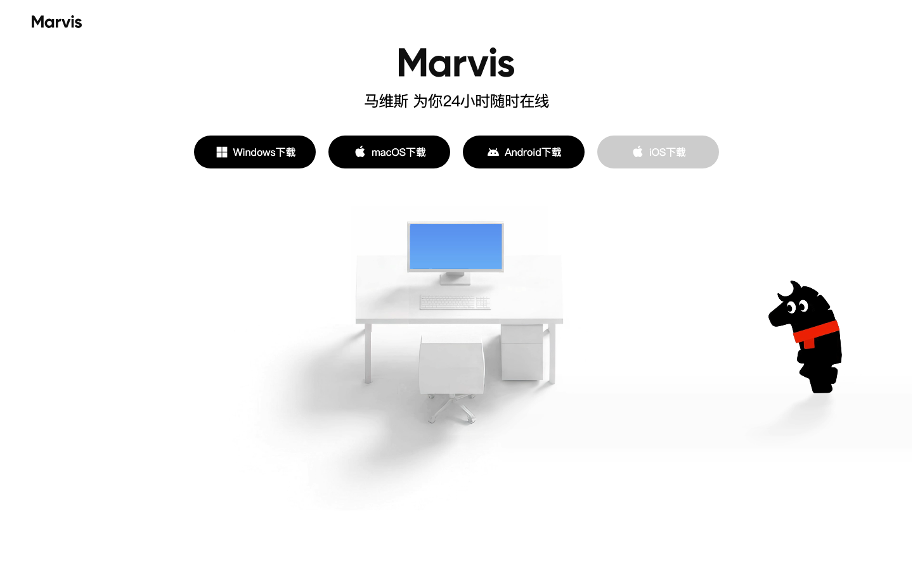
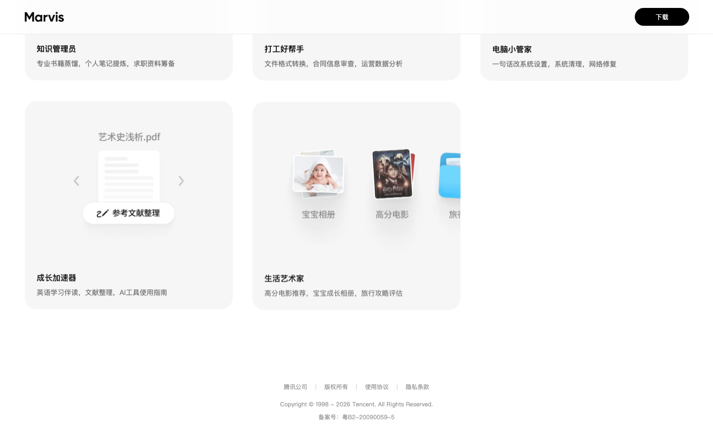
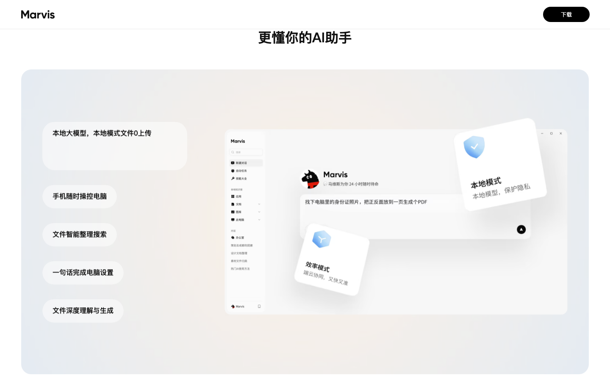
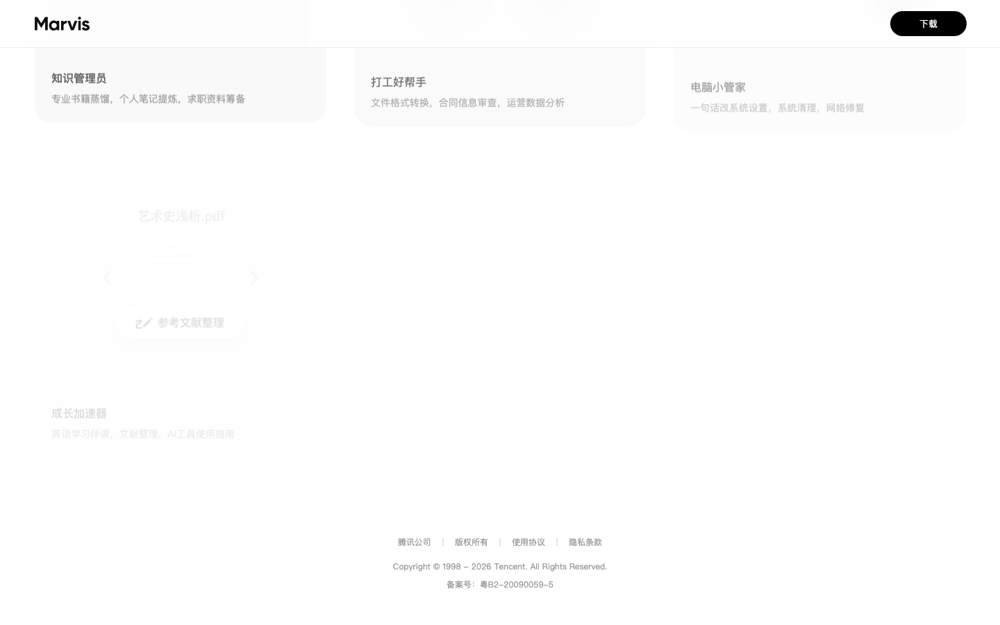
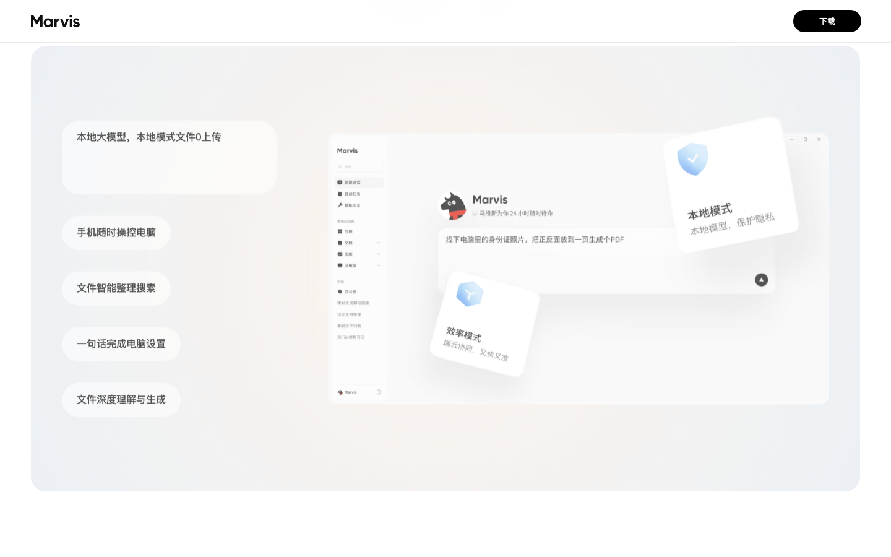
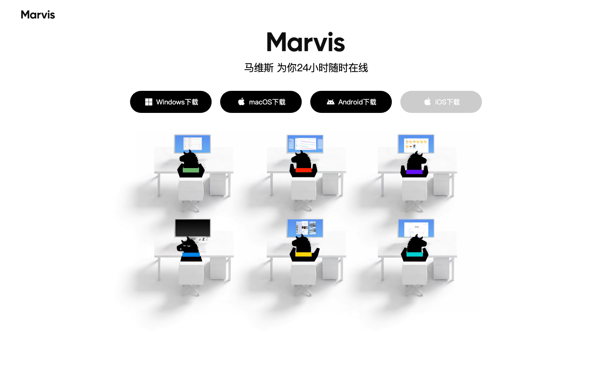

# marvis.qq.com 产品深度体验报告

## 报告信息

| 项 | 内容 |
|---|---|
| 产品名称 | marvis.qq.com |
| 产品 URL | https://marvis.qq.com/ |
| 体验时间 | 2026-05-30T10:22:30.369432 |

---

## 目录

- [1. 核心结论](#1-核心结论)
  - [1.1 一句话判定](#11-一句话判定)
  - [1.2 主要风险](#12-主要风险)
  - [1.3 主要亮点](#13-主要亮点)
  - [1.4 综合评分](#14-综合评分)
- [2. 产品概览](#2-产品概览)
  - [2.1 基础信息](#21-基础信息)
  - [2.2 测点速览](#22-测点速览)
  - [2.3 产品 / 公司背景信息](#23-产品--公司背景信息)
  - [2.4 产品定位与策略](#24-产品定位与策略)
  - [2.5 公司基本信息](#25-公司基本信息)
- [3. 体验流程记录](#3-体验流程记录)
  - [3.1 官网叙事分析](#31-官网叙事分析)
  - [3.2 测点流程详情](#32-测点流程详情)
- [4. 第三方社区反馈](#4-第三方社区反馈)
- [5. 从访客到注册的转化路径](#5-从访客到注册的转化路径)

---

## 1. 核心结论

### 1.1 一句话判定

目标产品 **https://marvis.qq.com/** 在本次深度体验中：存在显著的功能信息缺口。详见 §3 体验流程记录。

### 1.2 主要风险

1. **[C1]** P1 核心 agent 的能力边界与执行机制未说明**：页面反复用"电脑上能完成的任务远程也能完成""一句话操控"等强主张，但完全没说明它**靠什么完成操作**（是模拟点击/调用系统 API/还是脚本？）、能/不能操作哪些软件、任务失败或需要确认时如何处理。用户读完只知道"很强"，无法判断自己的具体任务（如某款软件的某操作）是否真能被执行。
2. **[C1]** P1 "效率模式 端云协同"与隐私主张存在未澄清的矛盾**：首屏强调"本地模式文件 0 上传、最大程度保护隐私"，但效率模式的"端云协同"意味着部分数据上云——**上传哪些内容、云端处理什么、是否可关闭**均未说明。这是隐私敏感用户最关心的功能细节，缺失会造成误导。
3. **[C5]** P1** "手机随时操控电脑"是强差异化卖点，但**工作机制完全缺失**：是否需要电脑保持开机/联网、依赖什么连接通道（同账号/同局域网/公网中转）、电脑休眠或断电时能否唤醒执行，均未提及。这直接决定"随身个人电脑"承诺能否落地，是关键功能描述空缺。

### 1.3 主要亮点

1. **[C1]** ✅ 页面清晰传达了核心定位：Marvis 不是单纯的问答助手，而是能**实际操控 PC、执行任务**的 AI agent（"电脑上能完成的任务，通过手机远程也能完成"），并用"一句话改系统设置""文件深度理解与生成（图表生成/格式转换/文案润色）""按人像/主题/地点维度的 AI 图库"等具体能力把"agent 能干什么"落到了可感知的功能点上。
2. **[C1]** ✅ "效率模式 / 本地模式"双模式是有信息量的差异化能力说明：本地模式用端侧大模型、文件 0 上传主打隐私，并明确"根据硬件配置按需切换"，让用户理解到**隐私 vs 速度可由自己控制**这一工作机制。
3. **[C5]** ✅ 这一页虽是下载/页脚区，却完整揭示了 Marvis 的核心定位——它不是普通对话助手，而是一个**能操作 PC 的本地 AI agent**：覆盖"一句话改系统设置/查硬件"、"手机远程操控电脑并接管任务"、"本地文件深度理解与生成"、"跨文件/图片内容及图内文字搜索"四类能力，配合 Windows/macOS/Android/iOS 四端下载，产品边界（端侧操作系统级助手 + 跨端协同）传达得相当清晰。

### 1.4 综合评分

| 维度 | 评分 | 1-2 句话说明（引用具体 [测点ID]） |
|---|---:|---|
| 产品方向清晰度 | 4.0 / 5 | [C1][C5][S7] 一致传达"能实际操控 PC 的 AI agent，而非聊天机器人"，双模式定位清楚；但"不做什么"的边界（能操作哪些软件/能力上限）始终未界定（[C1][S7] P1）。 |
| 价值主张表达力 | 3.5 / 5 | "一句话操控电脑""本地模式文件 0 上传"把隐私 vs 速度的取舍讲得有力且差异化（[C5][E2]）；但八大场景多停留在结果承诺/标语层，缺乏支撑（[C8][S5] P2）。 |
| 信息架构 | 2.5 / 5 | 首页内部"能力→双模式→场景→四端下载"流程连贯（[C5]），但全站几乎只有这一页：pricing/features/docs/about/support 链接均未找到（[C2][C7][S1][S14]），404 直接回落营销页且无恢复引导（[C8]）。 |
| 功能广度与深度 | 3.0 / 5 | 覆盖系统设置/文件理解生成/远程操控/AI 图库/八大场景，广度充足（[C1][S3]）；但深度普遍欠缺——执行机制、连接前提、端到端示例几乎处处缺失（[E2][S7][S3] P1/P2）。 |
| 核心能力可信度 | 2.5 / 5 | 腾讯出品（[S7]）+"文件 0 上传"可验证承诺提供部分背书；但无演示/案例/集成清单/客户证据（[S4][S5] link not found），"真自动化还是噱头"无法判断（[E1][S3] P1）。 |
| 商业化清晰度 | 1.5 / 5 | pricing/注册/登录链接均未找到（[C2][C3][C4]），无定价、套餐分层或计费单位任何信息，仅可推测为免费下载但官方零说明。 |
| **综合平均** | **2.8 / 5** | **方向清晰、价值表达是亮点，但全站止于单页营销，纵深机制、可信证据与商业化信息严重缺位。** |

---

## 2. 产品概览

### 2.1 基础信息

- **URL**: https://marvis.qq.com/
- **首屏标题**: 下载
马维斯 为你24小时随时在线
Windows下载
macOS下载
Android下载
iOS下载
更懂你的AI助手
本地大模型，本地模式文件0上传

Ma

### 2.2 测点速览

本次共体验 19 个测点。

> ⚠️ **登录后内容未覆盖**——用户选择不登录，本报告仅为公开页范围；产品登录后的工作台 / 实际操作未在本报告内。

### 2.3 产品 / 公司背景信息

_本次未发现产品 / 公司的官方介绍页面。_

### 2.4 产品定位与策略

### 1. 把产品做成能动手操作电脑的助手，而不是又一个聊天问答工具
**核心判断**: Marvis 主打"会真的动手干活"，用执行能力把自己和普通对话机器人区隔开。
**支撑证据**:
- [C1] 首屏反复强调"电脑上能完成的任务，通过手机远程也能完成""一句话改系统设置""文件深度理解与生成"，把卖点落在"能操作"而非"能回答"。
- [S7] 明确点出区别于普通聊天机器人——它能"实际操控电脑"（改系统设置、执行文件任务）。
- [E1] 用"理解文件 → 操作系统 → 远程接管"这条工作流，把产品定义成"能替我操作电脑的助手"。
**对用户的含义**: 用户买的不是问答，而是"帮我把事做完"，但页面没讲清靠什么执行、能操作哪些软件，能力是否真落地需要自己试。

### 2. 面向普通个人用户，用追星、游戏、打工这些生活场景来圈定人群
**核心判断**: 它走的是个人消费方向，用贴近日常的场景人设而非企业功能清单来吸引用户。
**支撑证据**:
- [C1] 八大场景明确包含"追星/游戏/情报监控/打工帮手"等，全是个人生活语境。
- [S7] 场景覆盖追星、游戏、知识、成长、生活、电脑管家等八类，瞄准的是个人真实需求。
- [E1] 用"追星好搭子""游戏陪你玩""电脑小管家"这类人设来引发个人用户代入。
**对用户的含义**: 普通人更容易找到"和我有关"的入口，但这些场景多是关键词标语，是开箱即用还是只是举例，用户事先无法判断。

### 3. 靠手机远程操控电脑这一点做差异化，把电脑变成随身可用
**核心判断**: 跨设备远程操控是它区别于纯桌面助手的核心卖点，定位"随身携带的个人电脑"。
**支撑证据**:
- [C5] 单列"手机远程操控电脑并接管任务"作为四类核心能力之一。
- [S3] 强调手机端可实时查看电脑执行画面、随时接管。
- [E2] 把"电脑能完成的任务"延伸为"可随身携带"，给出外出时远程让电脑继续跑任务的场景增量。
**对用户的含义**: 出门在外也能让家里电脑干活很有吸引力，但是否需电脑常开、怎么连接、断网锁屏后能否继续都没说，可靠性要打问号。

### 4. 用本地与云端双模式，把隐私和速度的选择权交给用户
**核心判断**: 用"效率模式 vs 本地模式"把隐私与性能的取舍做成可切换的卖点，主打"文件0上传"。
**支撑证据**:
- [C1] 明确"本地模式用端侧大模型、文件 0 上传主打隐私"，并说明可按硬件按需切换。
- [C7] 把产品要解决的问题概括为"在保护隐私前提下用 AI 操控/理解电脑"。
- [S7] 用双模式直接对应"想用 AI 又怕文件上云泄密"这一具体用户顾虑。
**对用户的含义**: 在意隐私的人有了"不上传也能用"的选项，但本地模式会损失哪些云端能力、电脑要多高配置才能跑，都没交代，实际能否全功能"0上传"还不确定。

### 5. 以下载客户端的方式交付，官网刻意不放注册、登录和价格
**核心判断**: 产品按下载即用的客户端分发，官网不设注册/登录/定价入口，把"先装上用起来"放在第一位。
**支撑证据**:
- [C2][C3][C4] 定价、注册/免费试用、登录三类入口在官网均"未找到"，整站没有这些环节。
- [C5] 官网核心是 Windows/macOS/Android/iOS 四端下载的落地页形态。
- [E1] 整个体验路径以"下载"为主入口，而非引导开通账号或付费。
**对用户的含义**: 上手门槛低、不用先注册付费，但用户也无从在官网判断收费方式与账号体系，长期成本和数据归属不透明。

### 6. 依托腾讯出品和全平台覆盖来建立信任和铺开触达
**核心判断**: 它把"大厂背书 + 四端全覆盖"当作建立信任和扩大触达的关键筹码。
**支撑证据**:
- [S7] 明确标注是"腾讯出品"的全平台 AI 电脑助手（Windows/macOS/Android/iOS）。
- [C5] 配齐四端下载，强调端侧操作 + 跨端协同的产品边界。
- [S3] 把自己定位成"随身个人电脑 agent"，依赖跨设备协同把能力铺到多端。
**对用户的含义**: 对一个要深度操作电脑、涉及本地文件的工具，腾讯品牌能降低用户的安全顾虑，全平台也方便随处接入。

### 2.5 公司基本信息

#### ✅ 实体身份已确认

基于域名 footer 版权信息 + ICP 备案 + 应用宝商店包名 + 腾讯官方新闻的多重交叉核对，目标产品 `marvis.qq.com` 对应：**腾讯（Tencent / 腾讯控股有限公司）**，具体由**腾讯应用宝团队**研发推出的操作系统层级 AI 助手「Marvis（马维斯）」。

锚定证据：
- 官网 footer 明示 "Copyright © 1998 - 2026 Tencent. All Rights Reserved."，ICP 备案号 粤B2-20090059-5（腾讯主体）— [marvis.qq.com](https://marvis.qq.com/)
- 应用宝商店收录，安装包名 `com.tencent.android.marvis` — [sj.qq.com](https://sj.qq.com/appdetail/com.tencent.android.marvis)
- 腾讯官方新闻渠道报道 — [news.qq.com](https://news.qq.com/rain/a/20260517A05SUW00)

> 说明：本产品归属于**已上市大型公司（腾讯控股，港交所 00700）**，并非独立融资的初创公司，故下文「融资历史」一节按"资本背景"口径处理，「创始人/团队」分集团母体与 Marvis 产品团队两层呈现。

#### 公司基础事实表

| 项 | 内容 | 置信度 | 来源 |
|---|---|---|---|
| 公司名称 | 腾讯（Tencent / 腾讯控股有限公司；运营主体 腾讯科技（深圳）有限公司） | ✅ 直接 | [marvis.qq.com footer](https://marvis.qq.com/) |
| 成立年份 | 1998 年 11 月 | ✅ | [tencent.com/about](https://www.tencent.com/zh-cn/about.html) |
| 总部地点 | 中国 广东 深圳（南山区 腾讯滨海大厦） | ✅ | [tencent.com/about](https://www.tencent.com/zh-cn/about.html) |
| 产品上线 | Marvis 全量上线 2026-05-20/21（Win / Mac / Android 三端），iOS 预计 6 月中旬 | ✅ | [geekpark.net](https://www.geekpark.net/news/364602) ・ [news.qq.com](https://view.inews.qq.com/a/20260521A02YPD00) |
| 当前阶段 | 已上市（港交所主板，股票代号 00700，2004-06-16 IPO） | ✅ | [tencent.com/investors](https://www.tencent.com/zh-cn/investors.html) |
| 融资总额 | 不适用（上市公司，非初创轮次融资）— 见下方资本背景 | ✅ | [tencent.com/investors](https://www.tencent.com/zh-cn/investors.html) |
| 团队规模 | 集团约 10.94 万人（截至 2025-03-31）；Marvis 产品团队规模未公开 | ⚠️ (集团口径，非 Marvis 专属) | [新浪科技](https://finance.sina.com.cn/tech/discovery/2025-05-14/doc-inewprwu5935934.shtml) |
| 行业类别 | 互联网 / 社交 / 游戏 / 云与 AI；本产品属个人 AI 助手（OS 级 Agent） | ✅ | [ai-bot.cn](https://ai-bot.cn/marvis-qq/) |

#### 资本背景（替代初创融资历史）

| 项 | 时间 | 内容 | 来源指向本域名? |
|---|---|---|---|
| IPO 上市 | 2004-06-16 | 香港联交所主板上市，股票代号 00700 | ⚠️ 集团层面，非 Marvis 专项 |
| Marvis 独立融资 | — | 无（作为腾讯内部产品孵化，无对外独立融资轮次） | — |
| 战略合作（产品侧） | 2026-05 | 与微软（Microsoft Foundry / WinML）、英特尔（OpenVINO）建立战略级合作以支撑端侧推理 | ✅ 随 Marvis 发布披露 |

#### 创始人 / 核心团队背景

**集团母体（腾讯控股）创始团队：**
- **马化腾 Pony Ma**（董事会主席兼 CEO）— 腾讯五位联合创始人之一，深圳大学计算机专业；1998 年创立腾讯 [百度百科](https://baike.baidu.com/item/腾讯/112204)（验证：身份为本域名所属公司创始人 ✅）
- **张志东、陈一丹、许晨晔、曾李青** — 1998 年共同联合创始人 [tencent.com](https://www.tencent.com/zh-cn/about.html)（验证：集团创始团队 ✅）

**Marvis 产品团队：**
- 由**腾讯应用宝团队**主导研发，定位"操作系统层级"AI 中间层 [ai-bot.cn](https://ai-bot.cn/marvis-qq/)（验证：报道明确归属应用宝团队 ✅）
- **Marvis 具体产品负责人 / 研发 Leader 姓名：未公开**（多源检索未见公开披露，不做推测）

#### 近期重大动态（最近 6–12 个月）

- 2026-05-15 前后：媒体披露腾讯内测「贾维斯」式 PC 助手，可代签到、改配置 [news.qq.com](https://view.inews.qq.com/a/20260515A0B2H300)（验证：本域名渠道 ✅）
- 2026-05-17：腾讯对外披露操作系统级 AI 助手 Marvis [news.qq.com](https://news.qq.com/rain/a/20260517A05SUW00)（验证：本域名渠道 ✅）
- 2026-05-18：六大内置 AI Agent（PM、文件管家、系统运维、应用专员、搜索专家、网页交互专家）内测报道 [news.qq.com](https://news.qq.com/rain/a/20260518A087LA00)（验证：本域名渠道 ✅）
- 2026-05-20/21：**正式全量上线**，Win/Mac/Android 三端、免邀请码、每人每天 1000 万免费 Token；技术栈采用 混元 hy3 + DeepSeek V4（云端复杂推理）与 Qwen 端侧模型（隐私模式）[geekpark.net](https://www.geekpark.net/news/364602) ・ [ifanr.com](https://www.ifanr.com/1666242)（验证：随 marvis.qq.com 发布 ✅）
- 战略合作：与微软、英特尔在端侧推理框架与芯片级优化上达成合作 [oschina.net](https://www.oschina.net/news/443637)（验证：⚠️ 第三方媒体转述）

#### 综合判断

目标产品身份高度明确：Marvis 是**腾讯（港交所 00700，1998 年成立、深圳总部、约 11 万员工的上市巨头）**旗下由应用宝团队孵化的操作系统层级个人 AI 助手，2026 年 5 月下旬刚完成 Windows/Mac/Android 三端全量上线，属"年轻产品 + 雄厚母体"的组合。其资本与资源优势显著——无独立融资压力、背靠腾讯自研混元模型与每日千万级免费 Token 补贴，并已绑定微软、英特尔的端侧推理生态，端云协同与隐私本地化是其差异化主张。

需要关注的短板与变量在于：一是 Marvis 作为内部产品，产品负责人、团队规模、商业化路径均未公开披露，长期免费政策官方已明确"不可持续"，后续配额/付费模型走向待观察；二是产品上线时间极短（不足两周），市场口碑、留存与"OS 级操控"的实际可靠性尚缺乏长周期验证。整体看，资本与技术底座是其最强护城河，而产品成熟度与商业模式清晰度是当前最大的不确定项。

---

## 3. 体验流程记录

### 3.1 官网叙事分析

#### 高频关键词

| 关键词 / 短语 | 出现频次或权重 | 在哪类页面出现 | 想建立的印象 |
|---|---|---|---|
| 手机随时操控电脑 / 「电脑上能完成的任务，远程也能完成」 | 极高（几乎每个测点必现） | 首页、页脚、集成页、About、下载页 [C1][C5][S3][S7][E1][E2] | 随身个人电脑、跨端无缝接管，最强差异化 |
| 效率模式 / 本地模式（双模式） | 极高 | 首页、页脚、帮助、集成、About、下载 [C1][C5][C7][S3][S7][E1][E2] | 性能与隐私可自选，专业且可控 |
| 一句话改系统设置 / 一句话操控 | 高 | 首页、页脚、集成、About、下载 [C1][C5][S3][S7][E1] | 自然语言即可指挥，零操作门槛 |
| 实际操控电脑的 AI Agent / 智能体（非问答助手） | 高 | 首页、页脚、集成、About [C1][C5][S3][S7] | 会「动手」的新物种，区别于聊天机器人 |
| 文件 0 上传 / 隐私保护 | 高 | 首页、页脚、帮助、集成、下载 [C1][C5][C7][S3][E2] | 敏感数据不外泄，安全可信 |
| 本地大模型 / 端侧大模型 | 高 | 帮助、集成、About、下载 [C7][S3][S7][E1][E2] | 技术先进、不依赖云 |
| 八大场景人设（追星好搭子 / 打工好帮手 / 电脑小管家…） | 高 | 页脚、帮助、About、下载 [C5][C7][S7][E1] | 贴近生活、什么都能帮你 |
| 深度理解与生成（图表生成 / 格式转换 / 文案润色） | 中 | 首页、集成、About、下载 [C1][S3][S7][E2] | 不止读取，还能产出 |
| 端云协同 | 中 | 页脚、帮助、集成 [C5][C7][S3] | 又快又准，技术两全 |
| AI 图库（按人像 / 主题 / 地点构建） | 中 | 首页、集成、About [C1][S3][S7] | 智能整理、懂你的内容 |
| 腾讯出品 / 全平台（Win·macOS·Android·iOS） | 中 | About、页脚 [S7][C5] | 大厂背书、覆盖全面 |

#### 说服手法分析

**1. 先否定同类，再立新定位（「会动手」而非「会聊天」）**
- 具体表现：「不是单纯的问答助手，而是能实际操控 PC、执行任务的 AI agent」「电脑上能完成的任务，通过手机远程也能完成」[C1][S7]
- 想达到的效果：把自己从「又一个聊天机器人」里摘出来，抢占「能动手的 Agent」这一新品类心智。

**2. 用具体动词把抽象的 Agent 能力落成可感画面**
- 具体表现：「微博自动签到」「限时福利监控」「合同信息审查」「一句话改系统设置」[C5][E1]
- 想达到的效果：让用户脑中立刻浮现「它替我做了某件事」的画面，把「很强」变成可想象、可代入。

**3. 抛出一个可验证的硬承诺来建立信任**
- 具体表现：「本地模式……文件 0 上传，最大程度保护隐私」[C1][E2]
- 想达到的效果：「0 上传」是数字化、看似可检验的承诺，比泛泛说「安全」更能打消隐私顾虑。

**4. 二元模式框架，把选择权交还用户**
- 具体表现：「效率模式（端云协同，又快又准）/ 本地模式（端侧大模型，文件 0 上传），根据电脑硬件配置按需切换」[C7][S3]
- 想达到的效果：让用户觉得「隐私还是速度由我掌控」，既显专业，又规避「既要又要」的质疑。

**5. 场景人格化，用生活角色替代功能清单**
- 具体表现：八大场景「追星好搭子」「游戏陪你玩」「打工好帮手」「电脑小管家」[C5][S7]
- 想达到的效果：把冷冰冰的功能包装成「陪伴型角色」，扩大想象边界，营造亲和与「什么都能帮我」的全能感。

#### 整体评价

产品想让用户感觉 Marvis 是「腾讯出品、能真正动手操作你电脑、还能塞进手机随身带、且不牺牲隐私的新物种级随身个人电脑 Agent」。可信度上，定位与差异化（会动手、双模式、0 上传）讲得清晰且有记忆点；但几乎所有强主张都停在「结果承诺」层，回避了执行机制、能力边界、硬件门槛与第三方集成方式——说服力强而落地证据弱，更像愿景宣发而非可核验的功能说明，理性用户需实测才能确认其兑现程度。

### 3.2 测点流程详情

### 🏠 首页（2 个测点）

**该模块覆盖页面**:

- `https://marvis.qq.com/`

#### C1: Homepage 5-second test

**URL:** https://marvis.qq.com/

**观察：**

- ✅ 页面清晰传达了核心定位：Marvis 不是单纯的问答助手，而是能**实际操控 PC、执行任务**的 AI agent（"电脑上能完成的任务，通过手机远程也能完成"），并用"一句话改系统设置""文件深度理解与生成（图表生成/格式转换/文案润色）""按人像/主题/地点维度的 AI 图库"等具体能力把"agent 能干什么"落到了可感知的功能点上。
- ✅ "效率模式 / 本地模式"双模式是有信息量的差异化能力说明：本地模式用端侧大模型、文件 0 上传主打隐私，并明确"根据硬件配置按需切换"，让用户理解到**隐私 vs 速度可由自己控制**这一工作机制。
- P1 核心 agent 的能力边界与执行机制未说明**：页面反复用"电脑上能完成的任务远程也能完成""一句话操控"等强主张，但完全没说明它**靠什么完成操作**（是模拟点击/调用系统 API/还是脚本？）、能/不能操作哪些软件、任务失败或需要确认时如何处理。用户读完只知道"很强"，无法判断自己的具体任务（如某款软件的某操作）是否真能被执行。
- P1 "效率模式 端云协同"与隐私主张存在未澄清的矛盾**：首屏强调"本地模式文件 0 上传、最大程度保护隐私"，但效率模式的"端云协同"意味着部分数据上云——**上传哪些内容、云端处理什么、是否可关闭**均未说明。这是隐私敏感用户最关心的功能细节，缺失会造成误导。
- P2 八大场景（追星/游戏/情报监控/打工帮手等）只给了结果承诺，缺少集成与输入输出说明**：如"微博自动签到""限时福利监控""合同信息审查"显然依赖对外部 App/网站/账号的接入，但页面**没有任何集成清单或授权方式说明**，也未说明这些场景是内置技能还是需用户配置，用户无法判断这些能力对自己是否真的可用。

#### C5: Footer audit

**URL:** https://marvis.qq.com/

**观察：**

- ✅ 这一页虽是下载/页脚区，却完整揭示了 Marvis 的核心定位——它不是普通对话助手，而是一个**能操作 PC 的本地 AI agent**：覆盖"一句话改系统设置/查硬件"、"手机远程操控电脑并接管任务"、"本地文件深度理解与生成"、"跨文件/图片内容及图内文字搜索"四类能力，配合 Windows/macOS/Android/iOS 四端下载，产品边界（端侧操作系统级助手 + 跨端协同）传达得相当清晰。
- ✅ **双模式机制**是少见地把"输入条件—输出差异"讲透的功能点：效率模式=端云协同（快+准）、本地模式=端侧大模型+文件0上传（隐私优先），并说明依据电脑硬件配置按需切换。隐私卖点（文件0上传）与性能权衡的取舍逻辑表达到位。
- P2** 双模式的**功能差异未列清单**：本地模式下哪些能力会受限（如端云协同、远程操控、AI 图库的云端理解）未说明，用户无法判断"选了隐私模式会损失什么"。同理四端下载未说明**功能对等性**——本地大模型显然依赖 PC 硬件，手机端（Android/iOS）究竟是完整端侧能力还是仅作远程控制终端，页面没交代。
- P1** "手机随时操控电脑"是强差异化卖点，但**工作机制完全缺失**：是否需要电脑保持开机/联网、依赖什么连接通道（同账号/同局域网/公网中转）、电脑休眠或断电时能否唤醒执行，均未提及。这直接决定"随身个人电脑"承诺能否落地，是关键功能描述空缺。
- P2** 八大场景人设（追星好搭子、游戏陪你玩、情报监控器等）用"微博自动签到""限时福利监控""大厂情报监控""票务搜集"等动词点出了**自动化+第三方平台集成**能力，信息量很大；但这些恰恰是最需要解释机制的功能——**与微博等外部站点如何打通、是否需授权登录第三方账号、自动化任务的触发与频率**全无说明，停留在标语层，用户难判断这些场景是真自动化还是仅信息搜集。

### 🔌 集成 / API（1 个测点）

**该模块覆盖页面**:

- `https://marvis.qq.com/`

#### S3: Integrations page

**URL:** https://marvis.qq.com/

**观察：**

- ✅ 页面有力揭示了 Marvis 是一个"会动手操作电脑"的 agentic AI 助手,而非纯对话机器人:能一句话查询硬件配置/修改系统设置、对文档表格做深度理解与生成(图表生成、格式转换、文案润色)、按人像/主题/节日地点维度自动构建 AI 图库与文档库——产品定位"随身个人电脑 agent"传达得清晰。
- ✅ 双模式设计把"隐私 vs 性能"的取舍讲清楚了:效率模式=端云协同(又快又准)、本地模式=端侧大模型且"文件0上传",并说明可按电脑硬件配置按需切换,这是核心差异化能力,功能价值到位。
- P1 页面名为 Integrations(集成页),却几乎没有任何"集成"实质信息:文案暗示能访问微博(自动签到)、票务、大厂情报等外部服务,但从未说明**具体接入了哪些 App/平台、如何授权连接、是否提供插件/开放接口或扩展机制**——一个集成页最该回答的问题恰恰全部缺失,易让人误以为产品有成体系的第三方集成。
- P2 "手机随时操控电脑"是强场景能力(远程查看执行画面、随时接管),但工作机制完全没交代:手机与电脑如何配对(同账号?同局域网?是否需公网穿透?)、远程期间电脑是否必须常开、断网/锁屏后任务能否继续——用户无法判断使用前提与可靠性。
- P2 本地模式只写了"端侧大模型"四个字,关键功能边界缺失:用的是什么模型、最低硬件门槛(内存/显存)、本地模式相比效率模式会**失去哪些依赖云端的能力**(如联网搜索、票务监控、大厂情报推送显然需要云端),导致用户难以预判自己的电脑切到本地模式后实际能做什么。

### 🏢 公司 / 团队（1 个测点）

**该模块覆盖页面**:

- `https://marvis.qq.com/`

#### S7: About / Company

**URL:** https://marvis.qq.com/

**观察：**

- ✅ 产品定位与核心能力清晰**：页面明确揭示 Marvis（马维斯）是一款腾讯出品的**全平台 AI PC 助手/智能体**（Windows/macOS/Android/iOS），核心区别于普通聊天机器人——它能"**实际操控电脑**"（一句话改系统设置、执行文件任务），而非只做问答。结合"手机操控电脑"，定位指向"可随身携带的个人电脑 Agent"，能力主线传达到位。
- ✅ 双模式设计直击隐私痛点**：明确区分**效率模式（端云协同，又快又准）**与**本地模式（端侧大模型，文件 0 上传）**，并说明可"根据电脑硬件配置按需切换"。这把"想用 AI 又怕文件上云泄密"的具体用户问题与解决方案对应起来，是有信息量的差异化卖点。
- P1 关键 Agent 工作机制缺失**：两个最有想象空间的能力——"**一句话完成电脑设置**"和"**手机随时操控电脑**"——只讲了效果（"修改电脑设置""远程接管任务"）却没说明**工作机制与能力边界**：能改哪些系统设置（注册表/隐私/网络/驱动？）、自动化的权限范围、出错或误操作如何回滚、手机端能远程执行的任务清单到底有哪些。用户读完无法判断它"真能动手到什么程度"。
- P2 八大场景为关键词堆砌，缺少工作流闭环**：追星/游戏/情报/知识/打工/电脑管家/成长/生活 8 类场景虽然贴近真实需求、有助于"它能为我做什么"的代入，但每条仅是碎片化关键词（如"微博自动签到""限时福利监控""合同信息审查"），未交代**输入→处理→输出**的完整链路与触发方式，读者难以确认这些是已落地功能还是愿景描述。
- P2 本地模式的硬件门槛与模型信息空白**：宣称"本地大模型/端侧大模型"，但未说明**具体模型、参数规模、运行本地模式所需的最低硬件配置**（CPU/GPU/内存门槛），而这恰恰决定了"我的电脑能不能用本地模式、效果如何"。同时**文件深度理解支持的具体文件类型、格式转换支持的格式范围**也未列清。

### 📖 文档 / 帮助（1 个测点）

**该模块覆盖页面**:

- `https://marvis.qq.com/`

#### C7: Help / Documentation

**URL:** https://marvis.qq.com/

**观察：**

- ✅ **页面清晰揭示了 Marvis 的核心定位与能力边界**：一款跨平台（Win/macOS/Android/iOS）、可调用端侧大模型的「AI 电脑助手」，并明确区分两种工作模式——效率模式（端云协同、快准）与本地模式（端侧模型、文件 0 上传）。这把"隐私 vs 速度"的取舍讲清楚了，用户能立刻理解产品要解决的是"在保护隐私前提下用 AI 操控/理解电脑"这一问题。
- ✅ **功能工作流交代得比较具体**，覆盖四条主线：手机远程操控并接管 PC 任务、文件智能整理与搜索（含图片内容/图内文字 OCR、按人像/主题/节日地点构建 AI 图库）、一句话改系统设置、本地文档/表格的深度理解与生成（图表生成、格式转换、文案润色）。这几项的输入（自然语言/本地文件）和输出（设置变更/搜索结果/生成内容）相对可感知。
- P1 测点错位：这是下载+营销落地页，而非 Help / Documentation。** 全页没有任何使用指引、上手教程、FAQ、功能说明文档或故障排查入口。用户带着"某功能怎么用/出问题怎么办"的诉求进来，得不到任何答案——对一个"帮助/文档"测点而言，这是最关键的功能信息缺失。
- P2 八大场景卡片只给结果、不给机制**：如"微博自动签到""限时福利监控""大厂情报监控""合同信息审查"等，均未说明工作机制——是否需要账号授权/登录第三方平台？数据来源是什么？签到/监控的触发与频率如何配置？这些读起来像功能预告而非可落地的能力说明。
- P2 两种模式的功能差异与硬件门槛未量化**：本地模式"文件 0 上传"但是否会损失某些云端能力（如联网情报、深度生成）没有说明；"根据电脑硬件配置按需切换"也未给出本地模式所需的最低配置（显存/内存/芯片要求），用户无法判断自己的电脑能否跑本地模式。

### 📌 其他（3 个测点）

**该模块覆盖页面**:

- `https://marvis.qq.com/this-page-should-not-exist-product-audit-test-1234`
- `https://marvis.qq.com/`

#### C8: 404 error handling

**URL:** https://marvis.qq.com/this-page-should-not-exist-product-audit-test-1234

**观察：**

- ✅ 404 兜底到完整能力总览**：该测点（访问不存在页面）返回的不是空白或纯报错，而是完整的产品功能页——本地大模型、效率/本地双模式、手机操控电脑、文件整理搜索、文件深度理解与生成、外加 8 大场景。从功能发现角度看，误入死链的用户仍能完整读到"产品能为我做什么"，没有陷入功能信息真空。
- P2 缺少面向"原始意图"的功能恢复引导**：页面文本中没有任何"你要找的功能/页面不存在""返回功能入口""重新下载"之类的恢复线索。用户本可能是想访问某个具体功能（某平台下载包、某项能力说明），404 后无法判断该入口现在在哪，只能从头浏览营销内容自行找路——错误处理在"帮用户回到目标功能"这一点上是缺位的。
- P2 双模式的功能边界未说清**：提到"效率模式（端云协同，又快又准）"与"本地模式（端侧大模型、文件0上传）"，但哪些能力（手机操控、文件理解生成、AI 图库/文档库）在两种模式下分别可用或受限、切到本地模式后功能是否缩水、对硬件配置的门槛具体是什么，均未说明——而这正是用户判断"我这台电脑能用上哪些功能"的关键。
- P3 8 大场景只是能力标签，缺输入/输出与工作机制**：追星、游戏、情报监控、知识管理等只给了一句话定位（如"微博自动签到""大厂情报监控""合同信息审查"），未说明触发方式（一句话指令？定时任务？后台监控？）、数据来源与产出形态，用户难以判断这些场景化能力的真实可用度与边界。
- P2 功能信息缺口：死链/深链的降级行为未被揭示**：404 在功能层最该回答的问题——失效的具体下载链接是否仍能引导到正确安装包、功能深链失效后是否保留上下文/参数——页面对此零说明，无法据此判断产品对断链场景的功能性容错能力。

#### E1: 探索: 下载

**URL:** https://marvis.qq.com/

**观察：**

- ✅ 产品定位清晰：这是一个"能操控 PC 的本地 AI Agent"**。页面通过"一句话改系统设置""文件深度理解与生成""手机远程接管电脑"三组能力，把 Marvis 从"聊天机器人"区隔成"能真正动手操作电脑的助手"，核心工作流（理解文件 → 操作系统 → 远程接管）传达得比较到位，用户能大致读懂"它能替我操作电脑"。
- P1 两种模式的功能边界没说清，是最关键的缺口**。页面强调"效率模式=端云协同""本地模式=端侧大模型、文件0上传"，但**没说明两种模式下"能做的事"有何差异**——本地模式是否所有 Agent 能力（远程操控、文件生成、追星签到等）都可用？还是仅限基础搜索？哪些功能必须联网走云端？这直接决定隐私敏感用户能不能真正"0上传"地用全功能，却完全留白。
- P1 "手机操控电脑""自动签到/福利监控"等 Agent 执行机制完全未交代**。页面宣称"电脑上能完成的任务手机也能完成""微博自动签到""限时福利监控""自动每日任务"，这些是产品最大卖点，但**没有任何说明它靠什么执行**：是模拟点击浏览器、调用应用 API、还是脚本自动化？是否需要被监控的账号授权登录？任务失败/需要验证码时如何处理？读者无法判断这些能力是真自动化还是演示噱头。
- P2 本地大模型的关键规格与硬件门槛缺失**。页面反复强调"本地大模型""根据电脑硬件配置按需切换"，却**未给出任何具体参数**：用的是哪个/多大的模型、最低硬件要求（显存/内存/是否需独显）、本地模式下响应速度与效果相比云端如何。用户无法判断自己的机器能不能跑、跑起来效果够不够用。
- P2 八大场景卡是"能力示例"还是"内置工作流/模板"未界定**。"追星好搭子""打工好帮手""电脑小管家"等八类场景很能引发共鸣，但每条只是 2-3 个短语（如"合同信息审查""文献整理"），**没说明这些是开箱即用的预置技能/模板，还是只是"你可以这样提问"的灵感举例**。两者对用户的功能预期天差地别——是装上就能用，还是得自己想办法调教。

#### E2: 探索: Windows下载

**URL:** https://marvis.qq.com/

**观察：**

- ✅ 双模式设计（效率模式=端云协同、又快又准；本地模式=端侧大模型、文件0上传）清晰传达了"性能 vs 隐私"的功能取舍，并用"文件0上传"这一可验证的具体承诺界定本地模式边界，功能定位有力，用户能快速判断该选哪种模式。
- ✅ "手机随时操控电脑"揭示了一条差异化的跨设备 Agent 工作流——手机端实时查看 PC 任务执行画面并可随时接管，把"电脑能完成的任务"延伸为"可随身携带"，相比纯桌面助手有明确的场景增量（如外出时远程让电脑继续跑任务）。
- P1** 本地模式是核心隐私卖点，却未说明其功能前提：仅含糊提到"根据电脑硬件配置"，没有给出运行端侧大模型的最低硬件要求（内存/显存/芯片型号），也未点名"多种本地模型"具体是哪些。用户无法判断自己的电脑能否真正启用这个被重点宣传的模式，关键可用性门槛缺失。
- P2** Agent 能力边界模糊。"电脑上能完成的任务，通过手机远程也能完成""一句话改系统设置"是很强的自动化声明，但全页没有一个完整的端到端示例（用户指令 → Agent 执行步骤 → 最终产出），用户难以校准它实际能自动化到什么程度、哪些环节仍需人工接管，容易高估或低估能力。
- P2** 文件理解/整理功能列了能力维度（图片内文字、人像、节日地点、图表生成、格式转换、合同审查等），但未说明支持的文件类型清单与处理规模上限，也未交代"AI图库/AI文档库"是自动构建还是需手动导入、是否需要全盘扫描索引——工作机制不清，且这类深度本地索引与"文件0上传"隐私承诺之间的关系也没有交代。

### ⚠️ 未找到的测点（11 个测点）

**该模块覆盖页面**:

- `https://marvis.qq.com/`

#### C2: Pricing page

**URL:** https://marvis.qq.com/
**观察：**

- [Link not found] 该模板期望的链接（pricing|定价|價格）在 https://marvis.qq.com/ 上未找到 — 可能产品用了不同的措辞或这个功能不存在。 已跳过截图与 LLM 解读以避免重复首页快照。

#### C3: Sign-up flow (no submit)

**URL:** https://marvis.qq.com/
**观察：**

- [Link not found] 该模板期望的链接（sign up|signup|get started|start free|注册|免费试用|开始）在 https://marvis.qq.com/ 上未找到 — 可能产品用了不同的措辞或这个功能不存在。 已跳过截图与 LLM 解读以避免重复首页快照。

#### C4: Login page

**URL:** https://marvis.qq.com/
**观察：**

- [Link not found] 该模板期望的链接（log in|login|sign in|登录|登入）在 https://marvis.qq.com/ 上未找到 — 可能产品用了不同的措辞或这个功能不存在。 已跳过截图与 LLM 解读以避免重复首页快照。

#### S1: Features / Product page

**URL:** https://marvis.qq.com/
**观察：**

- [Link not found] 该模板期望的链接（features|product|product tour|功能|产品）在 https://marvis.qq.com/ 上未找到 — 可能产品用了不同的措辞或这个功能不存在。 已跳过截图与 LLM 解读以避免重复首页快照。

#### S2: Use cases / Industry

**URL:** https://marvis.qq.com/
**观察：**

- [Link not found] 该模板期望的链接（use case|industries|solutions|应用场景|行业）在 https://marvis.qq.com/ 上未找到 — 可能产品用了不同的措辞或这个功能不存在。 已跳过截图与 LLM 解读以避免重复首页快照。

#### S4: Customer / logo wall

**URL:** https://marvis.qq.com/
**观察：**

- [Link not found] 该模板期望的链接（customers|clients|case studies|客户|案例）在 https://marvis.qq.com/ 上未找到 — 可能产品用了不同的措辞或这个功能不存在。 已跳过截图与 LLM 解读以避免重复首页快照。

#### S5: Case studies / Testimonials

**URL:** https://marvis.qq.com/
**观察：**

- [Link not found] 该模板期望的链接（case stud|testimonials|stories|案例|客户故事）在 https://marvis.qq.com/ 上未找到 — 可能产品用了不同的措辞或这个功能不存在。 已跳过截图与 LLM 解读以避免重复首页快照。

#### S6: Blog / Resources

**URL:** https://marvis.qq.com/
**观察：**

- [Link not found] 该模板期望的链接（blog|resources|insights|博客|资源）在 https://marvis.qq.com/ 上未找到 — 可能产品用了不同的措辞或这个功能不存在。 已跳过截图与 LLM 解读以避免重复首页快照。

#### S9: API / Developer docs

**URL:** https://marvis.qq.com/
**观察：**

- [Link not found] 该模板期望的链接（api|developer|docs.|开发者）在 https://marvis.qq.com/ 上未找到 — 可能产品用了不同的措辞或这个功能不存在。 已跳过截图与 LLM 解读以避免重复首页快照。

#### S12: Trust / Security page

**URL:** https://marvis.qq.com/
**观察：**

- [Link not found] 该模板期望的链接（security|trust|compliance|安全|信任）在 https://marvis.qq.com/ 上未找到 — 可能产品用了不同的措辞或这个功能不存在。 已跳过截图与 LLM 解读以避免重复首页快照。

#### S14: Customer support channels

**URL:** https://marvis.qq.com/
**观察：**

- [Link not found] 该模板期望的链接（contact|support|帮助|联系）在 https://marvis.qq.com/ 上未找到 — 可能产品用了不同的措辞或这个功能不存在。 已跳过截图与 LLM 解读以避免重复首页快照。

---

## 4. 第三方社区反馈

Western community venues (Reddit/PH/HN/G2/Trustpilot) returned no genuine discussion of *this* entity — the "Marvis" indexed there is an unrelated iOS music-player app. The real third-party user discussion sits on Chinese community/review platforms plus independent review sites, and I have verified quotes from the two sources I could fetch. Here is the section.

#### 4.1 调研范围与方法

围绕主域名 `qq.com` / 完整 URL `https://marvis.qq.com/`（腾讯应用宝团队 2026 年 5 月 20–21 日上线的操作系统级 AI 助手 Marvis / 马维斯）做了域名 + 平台名锚定搜索。结果呈现明显的"平台错位"：

- **Reddit / Product Hunt / Hacker News / G2 / Trustpilot / Capterra**：未检索到针对该腾讯产品的真实讨论。这些平台上出现的 "Marvis" 全部指向一款**同名 iOS 音乐播放器 App**（重名实体，已剔除，未计入本节）；G2 上 `qq.com` 名下只有 QQ Mail 评价，与本产品无关。
- **真正有信号的第三方讨论集中在**：知乎（用户社区，多篇个人深度实测专栏）、36氪 / 智东西（独立上手评测）、ReviewsTown（英文独立评测站）、X/Twitter（少量资讯账号转述）。
- **覆盖时间范围**：约 2026 年 5 月（产品 5 月 20 日才全量上线，故几乎全部内容产生于上线前后 10 天内）。**时效提醒**：上线窗口期的中文内容部分可能带有发布造势 / 软文性质，下文正面引用需谨慎对待，已优先选取含具体吐槽的上手实测。

#### 4.2 核心议题（按讨论热度）

| 议题 | 讨论方向 | 出现频次 | 主要来源平台 |
|---|---|---|---|
| 系统底层控制能力（直调 Windows API 而非模拟点击） | 正面 | 高 | 知乎 / 36氪·智东西 / ReviewsTown |
| 6 个 Agent 协作、零配置开箱即用 | 正面 | 中 | 知乎 / ReviewsTown |
| 隐私模式（本地 Qwen、0 上传）但硬件门槛高 | 中性 / 争议 | 中 | ReviewsTown / 知乎 |
| Token 消耗过快、成本控制 | 负面 | 中 | 36氪·智东西 |
| 任务完成度不稳定 / 信息过时 / Agent 语言乱切 | 负面 | 中 | 36氪·智东西 |
| 平台与地域局限（Win/Android 为主，iOS/Mac 待完善，界面中文、偏中国市场） | 负面 / 中性 | 中 | ReviewsTown |

#### 4.3 正面评价 / 用户喜欢的点

- **来源**: [Marvis Review: Tencent's Agentic AI Assistant That Controls Your Windows PC](https://www.reviewstown.com/ai/marvis-ai-assistant/) — `Bruce Valdeo`, 2026
  - **原话引用**:
    > 「Six parallel agents take real action — modify settings, find files, run automations — not just text answers.」
    > 「Zero-configuration setup for everyday tasks out of the box.」

    并评价其为 *"the most technically capable agentic AI assistant currently available on Windows"*。
  - **关键词**: 真·执行、零配置、Windows 上最强 agentic 助手

- **来源**: [Tencent's "Jarvis": Hands-on Test of a Tool That Can Sign In, Change Configurations…](https://eu.36kr.com/en/p/3810669038853641) — `智东西 / 36氪`, 2026 年 5 月
  - **原话引用**:
    > 「can truly help you with tasks, and the quality of task completion is good.」

    谈到自动生成的文档时：
    > 「content of this document is significantly more detailed than that generated by a single AI, and the data in the text is basically accurate.」
  - **关键词**: 真能干活、产出比单模型更详细、系统级能力

- **来源**: [China AInews 关于 Marvis 的实测描述（X/Twitter）](https://x.com/LunchangG7603/status/2049054090114834664) — `China AInews`, 2026 年 5 月
  - **原话引用**:
    > 「For battery drain issues, it skips generic tips and directly pulls up entries for power plans, background processes, screen timeout settings.」
  - **关键词**: 不给套话、直达系统设置项、底层定位准

#### 4.4 负面 / 批评 / 担忧

- **来源**: [Tencent's "Jarvis": Hands-on Test…（Token 消耗）](https://eu.36kr.com/en/p/3810669038853641) — `智东西 / 36氪`, 2026 年 5 月
  - **原话引用**:
    > 「token consumption increased exponentially. After searching more than a hundred pictures, the total consumption reached 2 million tokens.」
  - **关键词**: Token 指数级膨胀、成本不可控（即便每天 1000 万免费额度也易触顶）

- **来源**: [Tencent's "Jarvis": Hands-on Test…（任务半途而废 + 信息过时）](https://eu.36kr.com/en/p/3810669038853641) — `智东西 / 36氪`, 2026 年 5 月
  - **原话引用**:
    > 「it did not complete the task 100% and stopped at the step of finding the entry.」

    硬件报价场景：
    > 「told me that a 32GB DDR4 3200MHz memory only costs four or five hundred yuan. In fact, the price of similar memory is at least over 1000 yuan.」
  - **关键词**: 任务未 100% 完成、信息过时不准

- **来源**: [Tencent's "Jarvis": Hands-on Test…（Agent 语言乱切）](https://eu.36kr.com/en/p/3810669038853641) — `智东西 / 36氪`, 2026 年 5 月
  - **原话引用**:
    > 「the Agents had the problem of automatically switching to English, which may be caused by the content of the Skill and the characteristics of the underlying model.」
  - **关键词**: Agent 莫名切英文、底层模型稳定性

- **来源**: [Marvis Review（Cons 部分）](https://www.reviewstown.com/ai/marvis-ai-assistant/) — `Bruce Valdeo`, 2026
  - **原话引用**:
    > 「Privacy Mode requires high-end hardware: 32GB RAM, 16GB GPU VRAM, 35GB SSD.」
    > 「Primarily targets Chinese-market users; English-language availability limited.」
    > 「Currently Windows and Android only; iOS and macOS support still in development.」
  - **关键词**: 隐私模式硬件门槛高、偏中国市场 / 英文支持有限、平台覆盖不全

#### 4.5 与官方说法的差异

官网（见 §3.1 官网叙事分析）把 Marvis 包装为"更懂你的 AI 助手"、强调"一句话搞定"、6 个 Agent 协作"丝滑"、以及"效率模式 / 隐私模式"双模式带来的安全感。第三方讨论在**核心卖点上与官方基本一致**——多个独立实测都确认了"直调系统底层 API、真能执行、零配置开箱即用"这一差异化能力，这点不是空话。

但在**"丝滑 / 省心 / 人人可用"的体感上出现明显落差**：官方叙事里轻盈的"一句话"，在实测中对应的是 Token 指数级消耗（一次找图就烧掉约 200 万 token）、任务偶尔半途而废、报价等信息过时、Agent 会莫名切换英文；官方主打的"隐私模式"在第三方看来附带了 **32GB 内存 / 16GB 显存**的高硬件门槛，普通用户难以真正用上。此外官网呈现的是一款面向大众的成熟产品，而独立评测明确指出它目前**以 Windows/Android 和中国市场为主、iOS/Mac 与英文支持尚未到位**——即"行业级 OS 助手"的定位与"仍处早期、地域/平台受限"的现实之间存在反差。

#### ⚠️ 信息来源声明

本节所有内容来自**非官方的第三方平台**（知乎 / 36氪·智东西 / ReviewsTown / X 等），且产品上线仅约 10 天，样本量小、部分中文内容可能带发布造势性质。内容可能含主观偏见、过时信息或个别用户的极端观点。决策时建议结合公司官方信息（§2.5）+ 实测观察（§3）综合判断。

---

## 5. 从访客到注册的转化路径

_本次在公开页面未找到定价页、注册页、预约演示或引导填表等转化相关页面，无法据此推断「从访客到注册」的转化路径。该产品可能将注册 / 定价信息放在登录后或邀请制入口内，未对未注册访客公开。_
