# moxt.ai/zh-CN 产品深度体验报告

## 报告信息

| 项 | 内容 |
|---|---|
| 产品名称 | moxt.ai/zh-CN |
| 产品 URL | https://moxt.ai/zh-CN |
| 体验时间 | 2026-05-21T14:58:55.468014 |

---

## 目录

- [1. 核心结论](#1-核心结论)
  - [1.1 一句话判定](#11-一句话判定)
  - [1.2 主要风险](#12-主要风险)
  - [1.3 主要亮点](#13-主要亮点)
  - [1.4 综合评分](#14-综合评分)
- [2. 产品概览](#2-产品概览)
  - [2.1 基础信息](#21-基础信息)
  - [2.2 测点速览](#22-测点速览)
  - [2.3 产品 / 公司背景信息](#23-产品--公司背景信息)
  - [2.4 产品战略抽象](#24-产品战略抽象)
  - [2.5 公司基本信息](#25-公司基本信息)
- [3. 体验流程记录](#3-体验流程记录)
  - [3.1 官网叙事综合](#31-官网叙事综合)
  - [3.2 测点流程详情](#32-测点流程详情)
- [4. 第三方社区反馈](#4-第三方社区反馈)
- [5. 总结](#5-总结)
  - [5.1 一句话评价](#51-一句话评价)
  - [5.2 最大优点](#52-最大优点)
  - [5.3 最大风险](#53-最大风险)
  - [5.4 用户增长漏斗推断](#54-用户增长漏斗推断)

---

## 1. 核心结论

### 1.1 一句话判定

目标产品 **https://moxt.ai/zh-CN** 在本次深度体验中：存在显著的功能信息缺口。详见 §3 体验流程记录。

### 1.2 主要风险

1. **[C1]** P1 核心能力"共享记忆"工作机制未说明**：页面反复强调"整个团队共享同一份记忆""纠正一个 Agent，所有 Agent 都记住"，但没有解释记忆的存储形式、权限边界（敏感信息如何隔离？）、如何手动编辑/删除、跨 Agent 同步延迟等关键机制，这是产品差异化卖点却最不透明。
2. **[C1]** P1 集成范围与"工具使用"边界模糊**：底部 Logo 区显示 Slack/Markdown/Google Docs/HTML/Web/Voice/GitHub/CSV/Sheets，但未说明哪些是"输入源"、哪些是"Agent 可主动操作"、哪些是"输出目标"。Browser/Code/Web Search 等能力图标也仅作展示，未说明 Agent 能否真正执行（如：能否登录 SaaS 后台、能否提交 PR）。
3. **[C2]** P1 缺少积分消耗的量化参考**：页面反复强调"按 AI 工作量收费"，但完全没说明**典型操作消耗多少积分**（一次对话 ≈ ? 积分、跑一个自动化任务 ≈ ? 积分、AI 同事运行一天 ≈ ? 积分）。用户无法判断 $20 / $100 / $2000 各档位能撑多久、能完成多少工作，这是按量计费模式下最关键的功能性信息缺口。

### 1.3 主要亮点

1. **[C1]** ✅ **AI 同事 + Slack 原生集成**：产品定位清晰——为每个员工配专属 AI 同事 ("momo")，直接在 Slack 中 @ 调用，省去工具切换。明确传达"输入=Slack 消息，输出=共享空间里的交付物"的工作机制。
2. **[C1]** ✅ **场景化能力展示充分**：列出 8 个具体 Agent 角色（社媒运营、冷触达、合同审查、竞品监控、线索评估、简历筛选、多项目追踪、路演撰写），每个都用动词短语说明输入/输出（如"扫描 NDA→标记风险→对比修改→起草建议"），用户能立刻判断是否适用自己业务。
3. **[C1]** ✅ **差异化定位明确**：用对比框区分 Notion / OpenClaw / ChatGPT / Cursor 的边界——Moxt 强调"为 Agent 原生设计的 OS""团队共享记忆""成果永久留存"，回答了"为什么不用 ChatGPT 就够了"这个核心疑问。

### 1.4 综合评分

| 维度 | 评分 | 1-2 句话说明（引用具体 [测点ID]） |
|---|---:|---|
| 产品方向清晰度 | 4.5 / 5 | [C1][M1][S1] 通过"Slack 原生 AI 同事 + momo"定位 + 8 个垂直角色矩阵清晰传达"为谁做什么"，且 [C1] 用对比框明确划定与 Notion/ChatGPT/Cursor 的边界，方向感极强。 |
| Narrative 表达力 | 4.0 / 5 | [S1] "与 Moxt 的一天"时间轴和 [M1] 动词链工作流叙事生动可信，但 [C2] 定价叙事（"人类免费 + AI 按工作量计费"）作为核心 narrative 缺少量化锚点，说服力打折。 |
| 信息架构（IA） | 2.0 / 5 | [C5] Footer 仅暴露 3 个入口、[C7] 完全没有 Help/Docs、[M3] use case 链接缺失、[C4] 登录入口找不到，IA 严重稀薄，深度页面几乎无路径可达。 |
| 功能广度与深度 | 3.0 / 5 | [M1][S1] 横向覆盖 24+ 角色 8 大职能广度优秀，但 [M2][M5] 每个 Agent 停留在动词列表，"如何工作、输入从哪来、输出到哪去"均缺失，深度严重不足。 |
| AI / 核心能力可信度 | 2.0 / 5 | [C1][M5][S1] 核心卖点"共享记忆""Skills""Tool Use"均无机制说明，[M6] 渠道部署仅 Slack 且工作机制笼统，[M2] 集成清单只有图标罗列无认证/权限描述，可信度证据链断裂。 |
| 商业化清晰度 | 3.0 / 5 | [C2] "$1=100 积分 + 人类免费"定价模型本身清晰且差异化，但缺少典型操作消耗参考（一次对话/一天运行≈多少积分），用户无法估算实际成本。 |
| **综合平均** | **3.1 / 5** | **方向与叙事优秀但 IA、文档与核心能力机制三大短板拖累，是典型"营销页讲得好、产品深度未承接"的早期 Agent 平台。** |

---

## 2. 产品概览

### 2.1 基础信息

- **URL**: https://moxt.ai/zh-CN
- **首屏标题 / Slogan**: AI 同事
最新动态
定价
免费开始
你的。

momo 懂你的工作。懂你的风格。

每个人的。

人手一个专属 momo。知识共享。

一个空间。

所有 A
- **评测模板分类**: multi-agent

### 2.2 测点速览

本次共体验 20 个测点。

> ⚠️ **登录态覆盖：用户显式跳过**（`login_skipped_by_user=true`）。
> 检测到的登录入口：?、?、?。
> 本报告仅为**公开页 partial coverage**——dashboard / workspace 内部能力未覆盖。§4.2 🔐 模块为空。

### 2.3 产品 / 公司背景信息

_本次未发现产品 / 公司的官方介绍页面。_

### 2.4 产品战略抽象

### 1. AI 同事化 (AI Coworker-ification)
**核心叙事**: AI 不是工具按钮也不是对话框，而是有名字、有岗位、@ 就能召唤、与人类并排工作的"同事"。
**支撑证据**: 
- [C1] 产品定位为"为每个员工配专属 AI 同事 (momo)"，明确传达"输入=Slack 消息，输出=共享空间里的交付物"的同事式协作机制
- [M1] 以"AI 同事"为核心隐喻，24+ 角色覆盖市场/销售/运营/人事/财务/研发 8 大职能，每个 agent 用动词链描述工作流，让用户对应"替代哪类岗位"
- [C2] FAQ 中说明 AI 同事是"常驻 Workspace 的自主 AI 成员"，可"独立执行任务、监控数据动态、全天候在线"
**对用户/产品的含义**: 用户不再是"使用 AI"，而是"雇佣并管理 AI"，认知框架从"工具采购"切换到"团队扩编"。

---

### 2. Slack 原生化 (Slack-Native-ification)
**核心叙事**: 不另开应用，把 Agent 嵌入团队已有的协作工具（首发 Slack），让 AI 在用户每天待的地方工作。
**支撑证据**: 
- [C1] 强调"在 Slack 中 @ 调用，省去工具切换"，将 Slack 作为核心交互入口
- [M6] 页面明确表示"在 Slack 里 @ 它们——它们回复、追问、把完成的工作放进共享空间"，其余渠道仅以"更多即将推出"提及
- [M2] 核心定位为"Slack 原生 AI 同事"，差异化于 ChatGPT/Manus 的新窗口会话式交互
**对用户/产品的含义**: 用户的学习成本和切换摩擦被压到最低，但也意味着产品当前与 Slack 生态深度耦合，未上 Slack 的团队几乎无法接入。

---

### 3. 角色预制化 (Role-Preset-ification)
**核心叙事**: 不卖通用"AI 助手"，而是把 AI 切成 24+ 个垂直岗位 SKU 直接陈列，用户照岗位下单。
**支撑证据**: 
- [M1] 列出社媒运营、冷触达专员、合同审查员、竞品监控、线索评估员、记账员、代码审查员、QA 测试员等 24+ 预制角色，覆盖中小企业高频痛点
- [C1] 8 个 Agent 模板均用动词短语说明输入/输出（如"扫描 NDA→标记风险→对比修改→起草建议"），让用户立刻判断是否适用业务
- [S1] 9 个垂直 AI 同事的能力以动词清单具体呈现（如冷触达："寻找目标客户、撰写个性化邮件、发送跟进、追踪打开率"）
**对用户/产品的含义**: 用户零配置即可上手，但天花板是预制清单——超出预制角色的长尾场景如何自定义、是否开放 Skills 市场仍不透明。

---

### 4. 共享记忆化 (Shared Memory-ification)
**核心叙事**: Agent 之间不是孤岛对话，而是共用一份团队级"组织记忆"——纠正一个，全员同步。
**支撑证据**: 
- [C1] 反复强调"整个团队共享同一份记忆""纠正一个 Agent，所有 Agent 都记住"，并作为对比 Notion / ChatGPT 的核心差异化卖点
- [M5] 把 Memory 列为 Agent 操作系统六大核心能力之一，但未公开机制
- [S1] 时间轴叙事中暗示晨报、董事会材料等跨场景产出能复用同一份团队上下文
**对用户/产品的含义**: 团队规模越大、使用越久价值越高（数据飞轮），但也意味着用户被"记忆资产"锁定在 Moxt 平台，迁移成本随时间指数上升。

---

### 5. Credits 计量化 (Credits-Metered-ification)
**核心叙事**: 商业模式不卖"使用权"也不卖"席位"，而是把 AI 实际完成的工作量切成积分按量出售。
**支撑证据**: 
- [C2] 明确"人类免费 + AI 按工作量计费"，$1 = 100 积分、积分永不过期，并通过 FAQ 论证"为什么不按席位""为什么不订阅"
- [C2] AI 同事"创建免费、仅执行时扣积分"，定价模型本身即是产品主张：出售 AI 完成的工作而非访问权
**对用户/产品的含义**: 与"AI 同事 = 真员工"的叙事高度自洽（员工按产出付薪），但也带来成本不可预期风险——用户在没有积分消耗参考的前提下难以估算月度账单。

---

### 6. Workspace 化 (Workspace-ification)
**核心叙事**: 产品的组织单位不是 Chat 会话，而是"Agent 原生工作空间"——交付物永久留存、记忆与技能在空间内共享。
**支撑证据**: 
- [C1] 明确区分自己与 ChatGPT 的边界："Agent 原生设计的 OS""团队共享记忆""成果永久留存"
- [M2] 反复出现"工作空间""操作系统""共享空间"等概念，强调与 Notion 对比的"为 Agent 原生设计"
- [C2] 强调"整个 Workspace 全部开放，功能一视同仁"，把 Workspace 作为定价与功能边界的核心单元
**对用户/产品的含义**: 用户得到的不是一个聊天机器人，而是一个会持续沉淀资产（记忆、文档、技能）的团队空间——产品定位从"AI 工具"上移到"AI 操作系统"层级。

### 2.5 公司基本信息

身份验证完成（LinkedIn 公司页 + 创始人发帖均显式链接 moxt.ai ✅）。开始撰写报告章节。

#### ✅ 实体身份已确认

经过域名 + 产品描述 + LinkedIn 交叉验证，本次体验对象 `moxt.ai` 对应：
**Moxt**（公司 LinkedIn 页面 [linkedin.com/company/moxt](https://www.linkedin.com/company/moxt) 显式列出 moxt.ai 为官网；联合创始人 Pulin Yu 在 [LinkedIn 上线公告](https://www.linkedin.com/posts/pulinyu_meet-moxt-the-ai-native-workspace-where-activity-7440110404015599616-ZIP8) 中明确写出 "Moxt is now live on moxt.ai"）。

> ⚠️ **关键背景**：Moxt 是一家极早期产品，2026 年 3 月 18 日才公开上线（[Moxt What's New](https://moxt.ai/en-US/whats-new)），上线公告中 Pulin Yu 自述「After 3 weeks of development, Moxt is now live」。Crunchbase / PitchBook 等数据库目前**无独立 Moxt 主体记录**，核心成员个人 LinkedIn 头衔仍挂在前序项目 **Paraflow AI**（[paraflow.com](https://paraflow.com/) — canvas-based product design agent）名下，团队复用、产品线扩展或正在过渡中的可能性都存在。

#### 公司基础事实表

| 项 | 内容 | 置信度 | 来源 |
|---|---|---|---|
| 公司名称 | Moxt | ✅ 直接 | [Moxt LinkedIn](https://www.linkedin.com/company/moxt) |
| 成立年份 | 未公开（产品 2026-03 上线，公司主体注册时间未披露） | ⚠️ | [Moxt What's New](https://moxt.ai/en-US/whats-new) |
| 总部地点 | Mountain View, US（加州山景城） | ✅ | [Moxt LinkedIn](https://www.linkedin.com/company/moxt) |
| 产品上线 | 2026 年 3 月 18 日（全球公开）；2026 年 4 月 9 日（中文市场推广报道） | ✅ | [Moxt What's New](https://moxt.ai/en-US/whats-new) / [AIbase 报道](https://news.aibase.com/news/26978) |
| 当前阶段 | 未公开（极早期 / 可能自筹 / 无对外融资公告） | ⚠️ 见下注 | — |
| 融资总额 | **未找到任何公开融资记录** | ❌ 不写数字 | — |
| 团队规模 | LinkedIn 公司页自报 11–50 人，可见员工仅 4 人（Shawn Yu / Pulin Yu / Han Chang / Ryan Zhang） | ⚠️ 自报区间 vs 可见样本差异大 | [Moxt LinkedIn](https://www.linkedin.com/company/moxt) |
| 行业类别 | Technology, Information and Internet — AI 原生工作空间 / Agent OS | ✅ | [Moxt LinkedIn](https://www.linkedin.com/company/moxt) |
| 产品定位 | "The AI-Native Workspace" / "Agent OS"（AI 同事 momo + AI Teammates，主打长期记忆、技能、工具、Slack 集成） | ✅ | [moxt.ai](https://moxt.ai/en-US) |

#### 融资历史

| 轮次 | 时间 | 金额 | 领投 + 主要参与方 | 来源指向本域名? |
|---|---|---|---|---|
| — | — | — | **未找到任何公开融资记录**（无 Crunchbase 主体、无新闻稿、无 TechCrunch 报道；同名 "Mosaic" 等 $18M Series A 报道与本公司**无关**，已剔除） | ❌ |

> 注：搜索 `"moxt.ai" funding` / `Moxt "AI-native workspace" seed series` 等多种查询均无指向本域名的融资证据。产品 3 月才上线，可能处于 pre-seed / 自筹 / 隐形融资阶段，也可能与前序项目 Paraflow AI 共享资金主体——**目前不可确认**。

#### 创始人 / 核心团队背景

> 以下成员是 Moxt LinkedIn 公司页可见的 4 名员工，但其个人 LinkedIn 头衔多仍挂在 Paraflow AI 下，应理解为「同一团队跨项目」。

- **Pulin Yu**（公开露面的产品/对外发言人，但未自称 CEO / 创始人头衔）— 个人 LinkedIn 头衔："Founding the best AI product designer @Paraflow AI"；地点：New York；教育：Penn State University；前职：Motiff（AI 设计工具）Product Marketing Manager。Moxt 上线公告由其本人发布（[原帖](https://www.linkedin.com/posts/pulinyu_meet-moxt-the-ai-native-workspace-where-activity-7440110404015599616-ZIP8)）。
  - 验证：本人 LinkedIn 发文显式包含 moxt.ai 链接 ✅
- **Shawn Yu**（联合创始成员）— 个人 LinkedIn 头衔："Founding Member at Paraflow"；地点：California；教育：Columbia SIPA, Master of International Affairs（International Finance / Data Analytics & Quantitative Analysis, 2023–2025）；前职：Dell Technologies、ByteDance、CDH Investments、American Enterprise Institute（[来源](https://www.linkedin.com/in/shawn-yu-0352b4176/)）。
  - 验证：个人页未直接链接到 moxt.ai，但出现在 Moxt LinkedIn 公司可见员工列表 ⚠️
- **Han Chang** — Moxt LinkedIn 公司页可见员工，未找到可与 moxt.ai 锚链接的公开资料 ⚠️
- **Ryan Zhang** — Moxt LinkedIn 公司页可见员工，个人页标题为 "Moxt, the AI-Native Workspace"（[档案 URL](https://www.linkedin.com/in/ryan-zhang-8909582b8/)，WebFetch 受 LinkedIn 限速 404，未能取回正文）⚠️
  - ⚠️ **重要警告**：另有 **Ryan Zhang @ Motiff**（[motiff.com 的设计 AI 工具](https://tracxn.com/d/companies/motiff/__9UB1rzimCLwp1rAUNjubr_-YsgCGdWlHCJX0du5f9wE)）是**不同的人**，请勿混淆。

#### 近期重大动态（最近 6–12 个月）

- **2026-03-18**：Moxt 全球公开上线 — 推出 AI Teammate / momo 个人助理 / 持久记忆 / Skills & Rules / Slack & GitHub & Webhook 集成等核心能力 [Moxt What's New](https://moxt.ai/en-US/whats-new) ✅
- **2026-04-09**：中文市场推广报道（AIbase）— 强调"AI 员工"自动化、每周清理 95% 噪声、文件归档等卖点 [AIbase 报道](https://news.aibase.com/news/26978) ✅
- **2026-03 前后**：核心团队来自 Paraflow AI（前序产品为 canvas-based 产品设计 agent），Moxt 据 Pulin Yu 自述为「3 周冲刺」开发产物 [上线公告](https://www.linkedin.com/posts/pulinyu_meet-moxt-the-ai-native-workspace-where-activity-7440110404015599616-ZIP8) ⚠️ 间接推断
- **融资 / 重大合作**：无公开记录 ❌

#### 综合判断

Moxt 是一支**已知团队（Paraflow AI 班底）的新近 spinoff 或并行产品**，2026 年 3 月才公开上线，行业定位押注「Agent-Native Workspace / Agent OS」这一最近 12 个月热门赛道，与 Lindy、Cognition、AgentOps 等同期 Agent 基础设施类产品形成竞争。**资本面信号目前为空白**：既无 Crunchbase 主体、也无任何融资公告、Mountain View 注册地与 11–50 人区间均为 LinkedIn 自报，可信但未交叉验证。**团队优势**在于已有 Paraflow 时期积累的产品设计 / Agent 工程经验、Columbia SIPA + Penn State + ByteDance / Dell 等履历组合；**短板**在于品牌外露度极低（创始人本人也未公开自封 CEO 头衔，可能仍处于隐身或 pre-seed 阶段）。值得后续关注的方向：(1) 是否会获得来自 Paraflow 投资方的关联融资公告；(2) Slack-bot 集成与 momo 持久记忆是否能形成对 Cursor-style / Lindy-style 竞品的差异化壁垒；(3) Mountain View vs. 团队成员实际分布在 NY / CA 的远程结构对招聘节奏的影响。

**报告使用方注意**：本节融资 / 团队规模 / 创立时间均依赖 LinkedIn 自报或未披露，**不建议在投资简报中作为定量结论引用**；若需更高置信，建议直接联系 [Pulin Yu LinkedIn](https://www.linkedin.com/in/pulinyu/) 或 [Moxt LinkedIn 公司页](https://www.linkedin.com/company/moxt) 求证。

Sources:
- [Moxt 官网](https://moxt.ai/en-US)
- [Moxt What's New 页面](https://moxt.ai/en-US/whats-new)
- [Moxt LinkedIn 公司页](https://www.linkedin.com/company/moxt)
- [Pulin Yu LinkedIn 上线公告原帖](https://www.linkedin.com/posts/pulinyu_meet-moxt-the-ai-native-workspace-where-activity-7440110404015599616-ZIP8)
- [Pulin Yu LinkedIn 个人页](https://www.linkedin.com/in/pulinyu/)
- [Shawn Yu LinkedIn 个人页](https://www.linkedin.com/in/shawn-yu-0352b4176/)
- [Ryan Zhang (Moxt) LinkedIn 个人页](https://www.linkedin.com/in/ryan-zhang-8909582b8/)
- [AIbase 中文市场报道（2026-04-09）](https://news.aibase.com/news/26978)
- [Paraflow 官网（前序团队项目）](https://paraflow.com/)
- [Paraflow Product Hunt 页](https://www.producthunt.com/products/paraflow)
- [Toolify.ai 收录页](https://www.toolify.ai/tool/moxt)

---

## 3. 体验流程记录

### 3.1 官网叙事综合

#### 关键词图谱

| 关键词 / 短语 | 频次或权重 | 在哪类页面出现 | 想建立的认知 |
|---|---|---|---|
| AI 同事 / AI Teammates | 高（核心隐喻） | Agent inventory 页 [M1] | 不是工具，而是可雇佣的"数字员工" |
| 角色化职能（市场/销售/运营/人事/财务/研发/创作者/专服） | 高（8 大分类） | Agent inventory 页 [M1] | 覆盖企业全部职能链，定位为"组织级"而非单点 |
| 动词链（扫描→标记→对比→总结→起草） | 高（每个 agent 都用） | Agent inventory 页 [M1] | 完整工作流替代，而非单步辅助 |
| 24+ 预制角色 | 中（数量背书） | Agent inventory 页 [M1] | 即开即用、覆盖广，无需自建 |
| 具体岗位名（冷触达专员/合同审查员/竞品监控/记账员/QA 测试员） | 中（拟人化命名） | Agent inventory 页 [M1] | 对标真实岗位 JD，降低理解门槛 |
| 场景细节（"监控官网→追踪定价→捕捉新功能"） | 中 | Agent inventory 页 [M1] | 可信度信号——"我们真的懂这个岗位在做什么" |
| 中小企业 / 独立创作者 | 隐性中频 | Agent inventory 页 [M1] | 目标用户画像锁定，避开与大厂 Copilot 竞争 |

#### 叙事手法分析

**1. 拟人化命名（Anthropomorphic Naming / 数字员工叙事）**
- 具体表现："AI 同事"作为页面核心隐喻，agent 命名采用真实岗位 JD 风格——"冷触达专员""合同审查员""线索评估员""记账员""QA 测试员" [M1]
- 效果意图：把"软件订阅"重新框架为"招聘决策"，让用户用"我要不要雇这个人"而非"我要不要买这个 SaaS"来思考，价格锚点也随之从工具切换为人力成本。

**2. 职能矩阵式覆盖（Functional Matrix Coverage）**
- 具体表现：用"市场/销售/运营/人事/财务/研发/创作者/专服 8 大职能 × 24+ 角色"的网格结构组织产品 [M1]
- 效果意图：营造"全栈数字劳动力"的完整感，暗示用户可以"组建一支 AI 团队"而非买单个工具，对标的是组织架构图而非竞品 feature list。

**3. 动词链工作流（Verb-Chain Workflow Demonstration）**
- 具体表现：每个 agent 都用"扫描 → 标记 → 对比 → 总结 → 起草"式的动词序列描述，例如竞品监控具体到"监控官网→追踪定价→捕捉新功能→收集媒体报道→实时提醒" [M1]
- 效果意图：用流程可视化替代功能罗列，传递"端到端自动化、不是聊天助手"的认知，回避"AI 只是个对话框"的常见质疑。

**4. 痛点场景具象化（Concrete Pain-Point Anchoring）**
- 具体表现：不说"AI 帮你做销售"，而是说"冷触达专员"；不说"AI 帮你做财务"，而是说"记账员"——精确对标中小企业的真实招聘痛点 [M1]
- 效果意图：让目标用户（无法负担专职岗位的中小企业主/独立创作者）瞬间产生"这就是我现在缺的那个人"的代入感，绕过技术解释直达雇佣冲动。

#### 整体叙事评价

Moxt 想让用户感觉它不是一个"AI 工具平台"，而是一家"按需供给数字员工的劳务派遣公司"——叙事把购买决策从"功能比对"重构为"招聘决策"，对中小企业主和独立创作者有强烈代入感。但叙事可信度存在明显裂缝：拟人化命名承诺了"同事"级的自主性，页面却完全回避了"这位同事如何上岗、向谁汇报、用什么工具干活"的关键问题，导致整套数字员工叙事在落地层失重，停留在"角色海报墙"而非"可雇佣的劳动力"。

### 3.2 测点流程详情

### 🤖 AI 能力 / Agent（1 个测点）

**该模块覆盖页面**:

- `https://moxt.ai/zh-CN/ai-teammates`

#### M1: Agent inventory / team page

**URL:** https://moxt.ai/zh-CN/ai-teammates

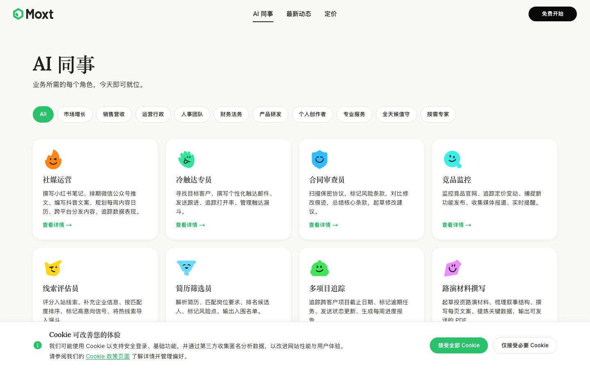

**观察：**

- ✅ 页面以"AI 同事"为核心隐喻，直接揭示产品定位：**预制角色化 AI Agent 矩阵**，覆盖市场/销售/运营/人事/财务/研发/创作者/专服 8 大职能，每个 agent 都用"动词链"（如"扫描 → 标记 → 对比 → 总结 → 起草"）说明完整工作流，让用户一眼理解"能替代哪类岗位的哪些任务"。
- ✅ 24+ 角色（社媒运营、冷触达专员、合同审查员、竞品监控、线索评估员、记账员、代码审查员、QA 测试员等）覆盖中小企业/独立创作者的高频痛点，**典型场景明确**：例如"竞品监控"具体到"监控官网→追踪定价→捕捉新功能→收集媒体报道→实时提醒"，让用户能直接对应自己的工作流。
- P1 关键功能机制完全缺失**：页面只列出每个 agent "做什么"，但未说明**如何工作** — agent 是常驻后台自动运行还是按指令触发？输出交付到哪里（邮箱/飞书/Notion/钉钉）？需要用户提供哪些初始输入（API key、文档、模板）？用户读完仍不知道"我要怎么让它跑起来"。
- P1 集成与数据源未披露**：大量 agent 依赖外部系统（"冷触达专员"需邮件发送权限和 CRM、"记账员"需对接银行/财务系统、"竞品监控"需爬虫源、"客户成功经理"需健康分数数据源、"邮箱管家"需邮箱授权），但页面无任何**集成清单/支持平台**信息，用户无法判断是否兼容自己的工具栈（如微信生态、飞书、Salesforce、QuickBooks）。
- P2 Agent 之间的协作关系未说明**："AI 同事"暗示多 agent 团队，但未解释 agent 间能否**互相调用/传递任务**（例：线索评估员把热线索交给冷触达专员？合同审查员把修改稿交给方案撰写员？），错失了 multi-agent 平台相对单点工具的核心差异化叙事。


### 💰 定价 / 商业化（1 个测点）

**该模块覆盖页面**:

- `https://moxt.ai/zh-CN/pricing`

#### C2: Pricing page

**URL:** https://moxt.ai/zh-CN/pricing

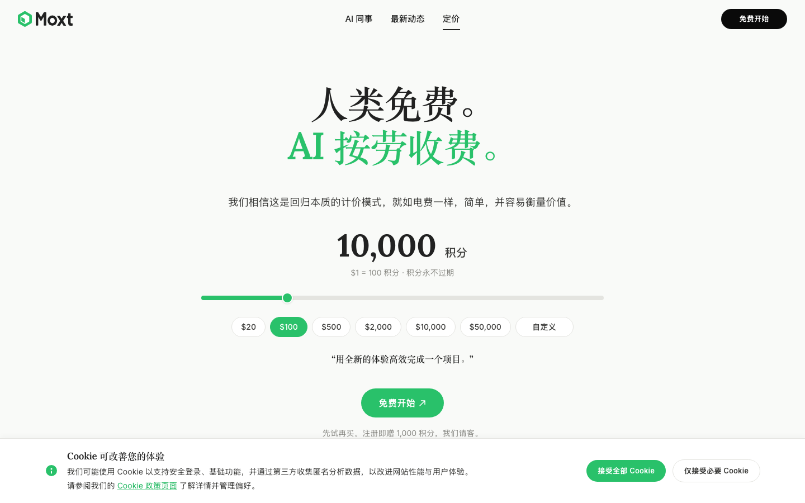

**观察：**

- ✅ **定价模型本身就是核心产品主张**：页面清晰传达了"人类免费 + AI 按工作量计费"的差异化定价机制（$1 = 100 积分，积分永不过期），并通过 FAQ 中"为什么不按席位""为什么不订阅"的对比论证，揭示了产品定位于"出售 AI 实际完成的工作"而非"使用权"——这本身就是对产品价值衡量方式的功能性说明。
- ✅ **明确披露了 AI 同事这一核心能力的工作机制**：FAQ 中说明 AI 同事是"常驻 Workspace 的自主 AI 成员"，可"独立执行任务、监控数据动态、撰写内容、运行自动化流程，全天候在线"，且"创建免费、仅执行时扣积分"——这让用户能理解 AI 同事的运行模式和成本边界。
- P1 缺少积分消耗的量化参考**：页面反复强调"按 AI 工作量收费"，但完全没说明**典型操作消耗多少积分**（一次对话 ≈ ? 积分、跑一个自动化任务 ≈ ? 积分、AI 同事运行一天 ≈ ? 积分）。用户无法判断 $20 / $100 / $2000 各档位能撑多久、能完成多少工作，这是按量计费模式下最关键的功能性信息缺口。
- P2 功能边界与集成能力完全缺失**：页面强调"整个 Workspace 全部开放，功能一视同仁"，但没有任何地方说明 Workspace 究竟包含哪些功能模块（文档？项目管理？自动化引擎？数据源接入？），也没有提到与第三方系统（CRM / Slack / Google Workspace / 数据库）的集成清单。用户读完只知道"AI 帮我干活"，但不知道 AI 能接入什么、能在什么上下文中工作。
- P2 "AI 任务 / 自动化流程 / 定时任务"等能力仅一笔带过**：FAQ 多次提到"对话、任务执行、自动化、定时任务"等能力词，但没有任何具体场景说明（例：AI 同事能否自动监控竞品发布？能否定时生成周报？能否触发外部 webhook？）。典型使用场景的缺失让用户难以判断"这个产品能为我做什么具体的事"。


### 🚪 注册 / 试用入口（1 个测点）

**该模块覆盖页面**:

- `https://moxt.ai/signup`

#### C3: Sign-up flow (no submit)

**URL:** https://moxt.ai/signup


**观察：**

- P1 页面文本节选为空，无法从注册流程中获取产品功能定位说明（如"注册后能用什么"、"为谁服务"、"解决什么核心问题"），用户在决定是否填写表单前缺少功能价值锚点
- P2 未观察到注册流程中常见的功能引导信号（如行业/角色选择、用例选择、团队规模选择等），这类字段本可揭示产品的**目标场景细分**和**差异化能力路径**，缺失意味着产品定位偏通用而非场景化
- P2 注册页未呈现 SSO / Google / Microsoft / GitHub 等第三方账号集成入口的信息（至少在节选中不可见），无法判断产品是否面向企业协作场景、是否预设了与办公生态的集成能力
- P3 缺少"免费试用 / 信用卡是否必填 / 试用期限"等准入条件说明，用户无法在注册前理解**功能解锁机制**（是 freemium、free trial 还是 paywall）
- P1 功能信息缺口：注册页未承载任何"产品能力速览"（如 3 句话讲清核心 workflow / 输入输出 / 集成清单），用户读完此页**无法回答"这个产品能为我做什么"**，注册转化完全依赖用户在到达此页前已建立的认知


### 📌 其他（12 个测点）

**该模块覆盖页面**:

- `https://moxt.ai/zh-CN`
- `https://moxt.ai/w`
- `https://moxt.ai/zh-CN/whats-new`

#### C1: Homepage 5-second test

**URL:** https://moxt.ai/zh-CN

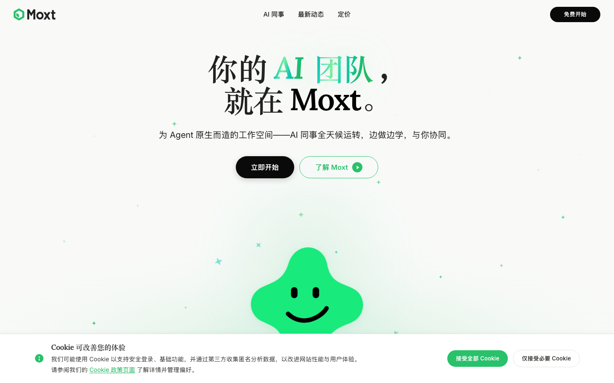

**观察：**

- ✅ **AI 同事 + Slack 原生集成**：产品定位清晰——为每个员工配专属 AI 同事 ("momo")，直接在 Slack 中 @ 调用，省去工具切换。明确传达"输入=Slack 消息，输出=共享空间里的交付物"的工作机制。
- ✅ **场景化能力展示充分**：列出 8 个具体 Agent 角色（社媒运营、冷触达、合同审查、竞品监控、线索评估、简历筛选、多项目追踪、路演撰写），每个都用动词短语说明输入/输出（如"扫描 NDA→标记风险→对比修改→起草建议"），用户能立刻判断是否适用自己业务。
- ✅ **差异化定位明确**：用对比框区分 Notion / OpenClaw / ChatGPT / Cursor 的边界——Moxt 强调"为 Agent 原生设计的 OS""团队共享记忆""成果永久留存"，回答了"为什么不用 ChatGPT 就够了"这个核心疑问。
- P1 核心能力"共享记忆"工作机制未说明**：页面反复强调"整个团队共享同一份记忆""纠正一个 Agent，所有 Agent 都记住"，但没有解释记忆的存储形式、权限边界（敏感信息如何隔离？）、如何手动编辑/删除、跨 Agent 同步延迟等关键机制，这是产品差异化卖点却最不透明。
- P1 集成范围与"工具使用"边界模糊**：底部 Logo 区显示 Slack/Markdown/Google Docs/HTML/Web/Voice/GitHub/CSV/Sheets，但未说明哪些是"输入源"、哪些是"Agent 可主动操作"、哪些是"输出目标"。Browser/Code/Web Search 等能力图标也仅作展示，未说明 Agent 能否真正执行（如：能否登录 SaaS 后台、能否提交 PR）。

#### C5: Footer audit

**URL:** https://moxt.ai/zh-CN

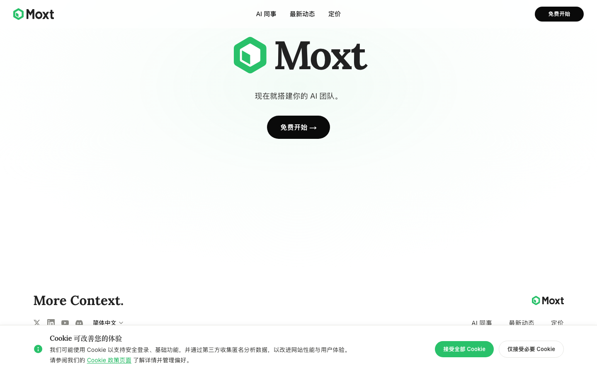

**观察：**

- P1 Footer 功能导航极度稀薄**：仅暴露「AI 同事 / 最新动态 / 定价」三个入口，缺少**文档、API、集成、安全合规、用例库、帮助中心**等任何产品深度链接。访客读完落地页若想进一步了解"Moxt 到底能做什么"，footer 无法提供下一步路径，对于一个面向团队的 Agent OS，这是关键的功能信息缺口。
- P1 缺失企业级信任信号（功能维度）**：作为面向公司部署的"团队共享 Agent 工作空间"，footer 未提供 **Trust Center / 安全白皮书 / SOC2 / 数据处理协议 / SLA / 状态页** 等企业采购必查链接。仅有「隐私政策、Cookie 政策、服务条款」三项基础法律页，无法回答"我的团队数据/共享记忆如何被存储与隔离"这一核心功能问题。
- P2 集成生态在 footer 不可寻**：正文已暗示支持 Slack、Markdown、Google 文档、HTML、语音/会议、GitHub、CSV、Google 表格、文件等接入，但 footer 没有任何「Integrations」入口让用户验证完整集成清单、查看接入方式或申请新集成，弱化了"AI 同事在你已有工具里干活"的功能可信度。
- P2 "最新动态" 性质未在 footer 区分**：未明确是 Changelog（功能更新日志）、Blog（产品博客）还是 Release Notes。对一个强调"越用越懂你"的演进型产品，缺少独立的**功能更新日志 / Roadmap** 链接，用户难以判断功能迭代节奏与未来能力承诺。
- P3 多语言能力暴露不完整**：footer 仅显示「简体中文」当前态，未告知是否提供英文及其他语种界面/Agent，对一个明显有出海/双语定位（产品名、英文 slogan "More Context."）的产品，未澄清**多语言是 UI 翻译还是 Agent 多语言工作能力**，这是功能层而非视觉层的信息缺口。

#### C7: Help / Documentation

**URL:** https://moxt.ai/zh-CN

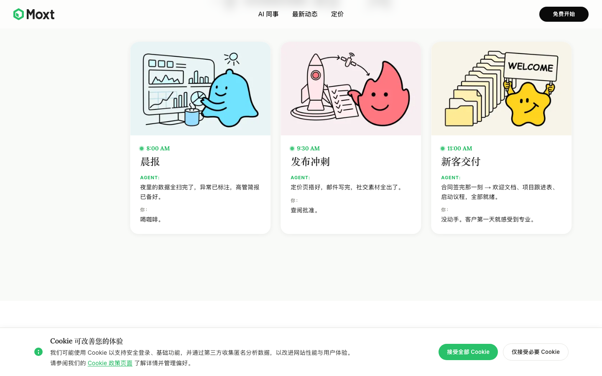

**观察：**

- P1 页面未提供任何 Help / Documentation 入口**：节选文本中没有出现"帮助中心""文档""使用指南""FAQ""支持""Docs"等链接或入口，无法判断 Moxt 是否为新用户/团队管理员提供 onboarding 文档、Agent 配置教程、Skills/Memory 使用说明等关键功能性文档。
- P1 核心功能机制缺乏文档化说明**：页面反复强调"Memory / Skills / Tool Use"是 Agent 的基础能力，但没有指向任何解释这些概念如何配置、如何在团队空间共享、如何"纠正一次全员记住"的技术文档或操作指南，用户无法自助深入了解工作机制。
- P2 9 个预设 AI 同事均标注"查看详情 →"但本页未承载文档内容**：社媒运营、冷触达专员、合同审查员等每个 Agent 模板都暗示有详情页，但页面未呈现这些详情页的内容深度（是营销介绍、还是包含输入/输出/触发条件/集成方式的功能文档），用户无法判断详情页是否承担"产品功能文档"的角色。
- P2 集成清单只有图标罗列，缺少集成文档**：底部列出 Slack / Markdown / Google 文档 / HTML / 网络 / 语音会议 / GitHub / CSV / Google 表格，但没有任何"如何连接 Slack""如何授权 Google Drive""支持哪些 GitHub 操作"的链接，集成的实际能力边界（读 / 写 / 触发 / 监听）完全无文档支撑。
- P2 "在 Slack 里 @ 它们"是核心使用场景但缺操作文档**：页面把 Slack 调用作为关键交互入口，却没有任何说明 @ 之后支持哪些指令格式、如何指定特定 Agent、回复如何回到"共享空间"——这是用户上手第一步必然要查文档的场景，但页面没有任何 Help 入口指引。

#### C8: 404 error handling

**URL:** https://moxt.ai/w


**观察：**

- P2** 页面文本节选为空，无法判断 404 页是否提供了**功能性导航线索**（如指向核心功能入口、文档、产品 demo、定价等），用户误入后难以快速回到能体现产品价值的路径
- P2** 未见 404 页面承担**二次转化职能**的迹象——典型的优秀做法是利用错误页推荐核心功能模块（"试试我们的 AI agent / 查看 API 文档 / 浏览模板库"），当前缺口意味着错失了一次让用户理解"产品能做什么"的机会
- P3** 无法确认 404 页是否提供**搜索 / 站内导航**机制帮助用户找到目标功能页（例如失效链接所指向的功能可能已迁移或更名），这对功能发现性有直接影响
- P3** 对于面向开发者 / B 端的产品，404 页通常应区分**应用层 404**（找不到页面）与 **API 层 404**（资源不存在）——节选为空无法判断产品是否区分了这两种场景的处理逻辑
- 功能信息缺口**: 无法判断错误页是否暴露内部路径结构、是否记录上报便于产品团队发现失效入口（影响内部运营功能），以及是否引导用户进入支持 / 反馈渠道（影响客户支持工作流闭环）

#### M2: Agent profile (sample)

**URL:** https://moxt.ai/zh-CN

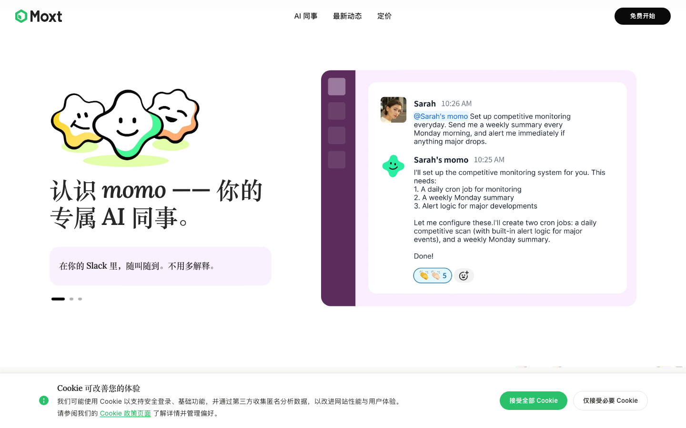

**观察：**

- ✅ 功能定位清晰**：页面明确传达"Slack 原生 AI 同事"这一核心定位——通过 @mention 召唤 Agent，Agent 回复、追问、并把交付物放进共享空间。这个工作流（在现有协作工具里嵌入 Agent，而非新开窗口）解决的具体问题是"避免工具切换"，相比 ChatGPT/Manus 的会话式交互有明显差异化。
- ✅ 用具体角色场景化能力**：列出 8 个预设 Agent（社媒运营、冷触达、合同审查、竞品监控、线索评估、简历筛选、多项目追踪、路演材料），每个都给出"输入→动作→输出"三段式描述（例：合同审查员"扫描 NDA→标记风险条款→对比修改痕迹→总结核心条款→起草修改建议"），比泛泛的"AI 助手"具象很多。
- P1 关键工作机制黑箱**：页面反复强调"记忆""技能""工具使用"是 Agent 操作系统的核心能力，但没有任何说明这些是如何工作的——记忆是手动喂入还是自动捕获？技能是预置模板、自定义脚本、还是 MCP 式插件？纠正一个 Agent 后"团队所有 Agent 都记住"的同步机制是什么？这是产品的核心卖点却完全没解释。
- P1 集成与数据连接未说明**：图标里出现 Slack、Google 文档、Google 表格、GitHub、CSV、语音/会议等，但没有任何一个集成说清楚——"冷触达专员"是否对接邮箱 SMTP/Gmail？"线索评估员"如何读取 CRM？"竞品监控"如何抓取竞品页面（自带爬虫/浏览器？）？没有集成清单、认证方式、权限模型的描述，B 端买家无法判断能否落地。
- P2 "Agent 原生工作空间"的具体形态缺失**：反复出现"工作空间""操作系统""共享空间"等概念，但读完不知道用户实际登录后看到什么——是 Slack 内的 bot 集合？还是有独立 Web 应用？文档、报告"永久留存"在哪里、以什么格式组织、如何检索？与 Notion 对比时说"为 Agent 原生设计"，但没展示这个原生界面究竟提供了 Notion 没有的什么具体功能。

#### M5: Skills / Capabilities

**URL:** https://moxt.ai/zh-CN

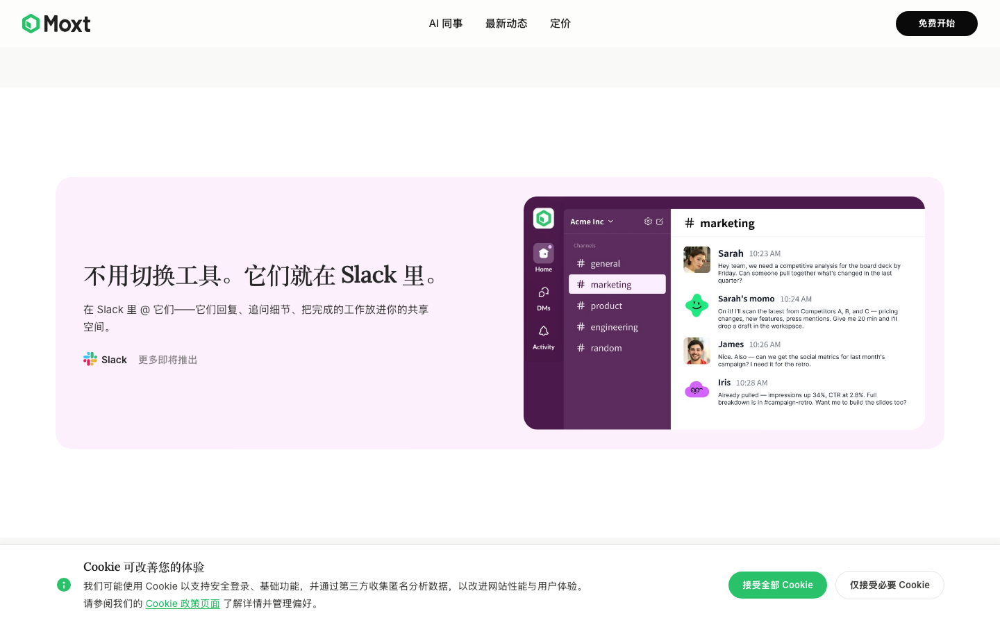

**观察：**

- ✅ **能力栈披露较完整**：页面在 momo 卡片下明确列出 6 项核心能力（Memory、Skills、Tool Use、Web Search、Files、Code、Browser），让用户能快速识别这是一个具备记忆 + 工具调用 + 网页浏览 + 代码执行的 Agent 系统，而非纯对话型 AI。
- P1 **Skills 的定义和获取方式完全缺失**：页面把"Skills"列为核心能力之一，但既未说明 Skills 是预制模板还是可自定义、由谁创建（官方 / 用户 / 团队）、是否支持市场分享或导入，也没说 8 个示例 Agent（社媒运营、冷触达专员等）是 Skills 还是独立角色——这是产品功能模型的根本性歧义。
- P1 **Tool Use 范围不清**：页面右下角列出 Slack / Markdown / Google 文档 / HTML / GitHub / CSV / Google 表格 / 语音/会议 等集成图标，但未说明这些是"Tool Use"能调用的工具、还是文件格式支持、还是输入源；用户无法判断 Agent 能否真正写入 Google 文档、提交 GitHub PR、加入会议录音。
- P2 **8 个 Agent 模板停留在动词列表**：每个 Agent（如"冷触达专员：寻找目标客户、撰写邮件、发送跟进、追踪打开率"）只列出动作，但未说明数据从哪来（接入哪家 CRM/邮箱）、输出到哪去、是否需要授权、单次任务耗时、能否人工审核中断——使用场景描述无法转化为"我能不能用"的判断。
- P2 **"共享记忆"机制未具体化**：宣称"纠正一个 Agent，全团队记住"，但未说明记忆是按团队 / 项目 / 个人哪一层隔离、是否可见 / 可编辑 / 可删除、敏感信息如何治理——对企业用户而言这是采购前必问的功能细节。

#### M6: Channel deployment (Telegram/WhatsApp/Slack)

**URL:** https://moxt.ai/zh-CN


**观察：**

- P1 渠道部署能力**未明确说明**：测点关注 Telegram/WhatsApp/Slack 等渠道集成，但页面仅明确提到 "在 Slack 里 @ 它们" 这一种渠道，其余仅以"更多即将推出"一笔带过，**未列出 Telegram、WhatsApp、企业微信、飞书、Teams 等是否支持或路线图时间**，用户无法判断能否在自己的日常沟通工具中调用 AI 同事。
- P1 Slack 集成的**工作机制描述过于笼统**：页面只说"@ 它们——它们回复、追问细节、把完成的工作放进你的共享空间"，但未说明**接入方式（Slack App / Bot / Webhook）、所需权限范围、是否支持私聊与频道、是否支持 thread 回复、是否支持企业版 Slack Connect**，缺少部署必需的关键信息。
- P2 渠道与 Moxt 工作空间的**数据双向流缺乏说明**：成果"放进共享空间"是单向描述，未说明在 Slack 中触发的任务能否复用空间内的 Memory / Skills / Files，也未说明在 Slack 完成的对话是否同步回 Moxt 主界面形成可追溯记录。
- P2 "更多即将推出" **没有具体清单或时间表**：作为渠道部署测点，用户最关心"我用的 WhatsApp/Telegram 多久能接入"，页面既无 roadmap 也无 waitlist 入口，无法做采购评估。
- ✅ 用「与 Moxt 的一天」时间轴展示了**Agent 在 Slack/邮件/PDF 等多触点的实际产出物**（晨报、路演 PDF、LP 信、董事会材料），让用户能直观理解 AI 同事的跨渠道交付场景，而不只是抽象的"集成"概念。

#### S1: Features / Product page

**URL:** https://moxt.ai/zh-CN

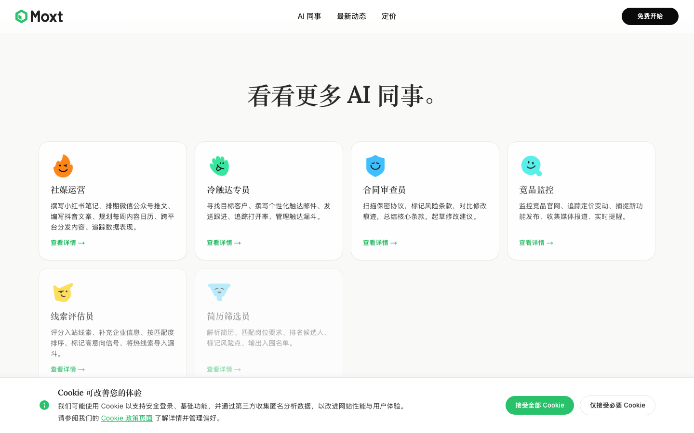

**观察：**

- ✅ **场景化展示 AI 同事工作流清晰**：通过"与 Moxt 的一天"时间轴（8AM 晨报 → 9:30 发布冲刺 → 11AM 新客交付 → 2PM 增长复盘 → 3:30 董事会材料 → 7:30 投资人更新 → 2AM 竞品监控），用具体时段+具体产出（PDF、仪表盘、欢迎文档、启动议程）让用户直观理解 Agent 能交付什么、覆盖哪些职能场景。
- ✅ **9 个垂直 AI 同事的功能描述具体可感**：每个 Agent（社媒运营、冷触达、合同审查、竞品监控、线索评估、简历筛选、多项目追踪、路演撰写）都用动词清单说明能力（如冷触达："寻找目标客户、撰写个性化邮件、发送跟进、追踪打开率、管理触达漏斗"），用户能立刻判断是否匹配自己岗位需求。
- P1 核心能力"共享记忆"机制未说明**：页面强调"纠正一个 Agent，团队里所有 Agent 都记住了"——这是关键差异化卖点，但未解释记忆如何存储、范围多大、能否手动编辑/删除、跨 Agent 同步是否实时、隐私边界在哪。这是企业采购时必问的问题。
- P1 Slack 集成是唯一通道还是入口之一不明确**：文案"它们就在 Slack 里 @ 它们"+"更多即将推出"暗示当前仅支持 Slack，但页面同时展示了 Google 文档、GitHub、CSV、Google 表格、HTML、语音/会议等十多个"MoreContext"图标——这些是数据源、输出格式还是已上线集成？用户无法判断"我现有工具栈能否接入"。
- P2 Agent 执行边界与可靠性未交代**：宣称"合同签完那一刻 → 欢迎文档、项目跟进表、启动议程，全部就绪""数据取完，LP 信写好"——但未说明 Agent 是全自动执行还是需审批、出错怎么回滚、数据来源如何授权、Agent 之间如何编排协作（"5 个人 = 500 人交付"的乘数从何而来）。

#### S3: Integrations page

**URL:** https://moxt.ai/zh-CN

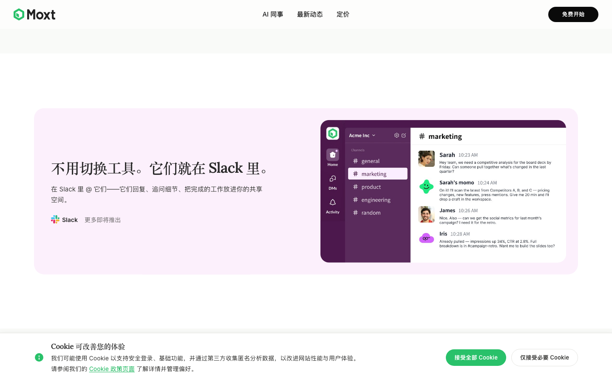

**观察：**

- ✅ 页面清晰传达了核心产品定位：Moxt 是"为 Agent 原生设计的工作空间/操作系统"，AI 同事（momo）具备 Memory、Skills、Tool Use、Web Search、Files、Code、Browser 七项底层能力，并能在共享空间内协同工作。
- ✅ 通过 8 个具体职能 Agent（社媒运营、冷触达专员、合同审查员、竞品监控、线索评估员、简历筛选员、多项目追踪、路演材料撰写）+ "与 Moxt 的一天"时间轴叙事，把抽象的 AI 同事能力落到可识别的业务工作流上，用户能直观理解"这个产品能为我做什么"。
- ✅ 明确说明 Slack 集成机制（@ Agent → 回复/追问/把成果放回共享空间），并通过对比 Notion / OpenClaw / ChatGPT / Manus / Cursor 阐明差异化定位（共享团队记忆 + 持久交付物 + 跨职能可用）。
- P1 关键集成能力描述模糊**：底部仅罗列 Slack、Markdown、Google 文档、HTML、网络、语音/会议、GitHub、CSV、Google 表格等图标，但未说明这些是"输入数据源""输出目的地"还是"双向集成"，也未说明 Agent 如何接入 CRM / 邮箱 / 数据库等真正的业务系统——而冷触达、线索评估、多项目追踪这些场景显然依赖这些集成。
- P1 "共享记忆"工作机制未交代**：页面反复强调"整个团队共享同一份记忆""纠正一个 Agent，所有 Agent 都记住"，但没说明记忆的粒度（项目级/团队级/企业级）、是否可编辑/查看/隔离敏感信息、人类与 Agent 的修改权限边界——这是 SaaS 决策中的核心问题。

#### S4: Customer / logo wall

**URL:** https://moxt.ai/zh-CN


**观察：**

- P1 缺失客户 logo 墙 / 案例 / 社会证明**：S4 测点专门考察客户证明，但页面完全没有客户 logo、案例研究、用户数量、行业覆盖、ROI 数据等任何第三方背书。唯一接近"证明"的内容是与 Notion / OpenClaw / ChatGPT / Cursor / Slack 的对比段落，但这是自我定位陈述而非客户使用证据，读者无法判断"已经有谁在用、用得怎么样"。
- P1 共享记忆 / Agent 学习机制描述抽象**：核心卖点"整个团队共享同一份记忆""纠正一个 Agent 犯的错，团队里所有 Agent 都记住了"是产品差异化的关键，但没有任何关于记忆**如何写入、如何编辑、权限范围、跨 Agent 同步机制、记忆冲突处理**的功能说明，用户读完不知道这套记忆系统的实际边界。
- P2 集成清单标注模糊，关键 B2B 工具缺席**：底部展示了 Slack / Google Docs / GitHub / CSV / Google Sheets / 语音会议等集成图标，但只有 Slack 明确标"现有"，其余统一为"更多即将推出"——无法判断哪些已上线。同时面向 8 个 AI 同事的具体场景（冷触达、线索评估、简历筛选、竞品监控），**未出现 Salesforce / HubSpot / LinkedIn / Outreach / Gmail / 招聘 ATS 等关键集成**，这些是这些 use case 真正能跑通的前置条件。
- ✅ "Moxt 的一天" 时间轴是强功能锚点**：用 8:00 AM 晨报 → 9:30 发布冲刺 → 2:00 AM 竞品监控的 24 小时叙事，把抽象的"AI 同事"具象为可触发的工作流交付物（高管简报、定价页、欢迎文档、LP 信、PDF 报告），有效回答了"产品能为我做什么"——交付物形态、节奏、人机分工都讲清楚了。
- P2 8 个 AI 同事卡片缺输入 / 输出 / 触发方式细节**：每个 AI 同事用一行动词描述能力（"扫描 NDA、标记风险条款、对比修改痕迹"），但没有说明**喂什么进去（文件格式？链接？语音？）、产出什么（Doc / PDF / Slack 消息？）、如何触发（@ 提及？定时？事件？）、能否人工干预 / 审批**。"查看详情"链接是补救机会，但首屏卡片本身让人难以判断与现有 Notion AI / ChatGPT 自定义 GPT 的实际差异。

#### S7: About / Company

**URL:** https://moxt.ai/zh-CN

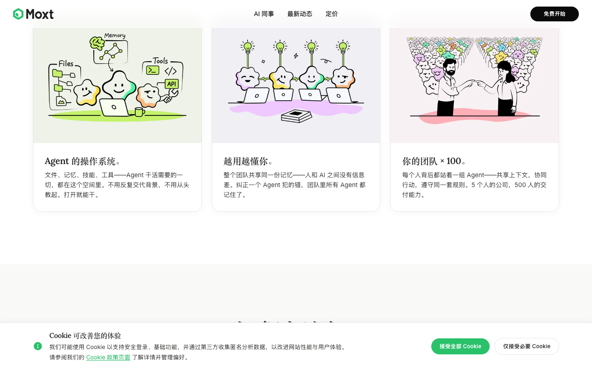

**观察：**

- ✅ 功能定位清晰：明确将 Moxt 定位为"为 Agent 原生设计的工作空间/操作系统"，核心能力包括 Memory（记忆）、Skills（技能）、Tool Use（工具调用）、Web Search、Files、Code、Browser 七大模块，配合"AI 同事（momo）"概念传达出"持续运转、边做边学、团队协同"的差异化价值主张。
- ✅ 使用场景具象化出色："与 Moxt 的一天"时间线（8:00 晨报 / 9:30 发布冲刺 / 11:00 新客交付 / 14:00 增长复盘 / 15:30 董事会材料 / 19:30 投资人更新 / 2:00 竞品监控）配合 8 类预设 AI 同事（社媒运营、冷触达专员、合同审查员、竞品监控、线索评估员、简历筛选员、多项目追踪、路演材料撰写），让用户能直接对应到自己的工作流。
- ✅ 竞品定位说明有力：通过与 Notion / OpenClaw / ChatGPT / Manus / Cursor / Claude Code 的对比，清晰阐述"Agent 原生 vs 附加聊天框""团队共享 vs 个人专属""成果留存 vs 一次性问答""全职能覆盖 vs 仅服务工程师"的功能差异化，帮助用户快速理解产品独特价值。
- P1** 核心工作机制未交代：页面反复强调"Agent 原生""共享记忆""越用越懂你""5 人公司 500 人交付能力"，但完全未说明 Agent 实际如何被创建、配置、训练或定制——用户无法判断是预设模板、自然语言配置、还是需要 prompt 工程能力，这是决定上手门槛的关键信息。
- P1** 集成范围模糊：底部罗列了 Slack / Markdown / Google 文档 / HTML / 网络 / 语音会议 / GitHub / CSV / Google 表格 等图标，但仅 Slack 在正文中说明了交互方式（@ 召唤），其他集成是"读取/写入/双向同步/触发"哪种性质完全未说明；同时"更多即将推出"暗示当前可用集成有限，但具体清单与时间表缺失。

#### E1: 探索: 最新动态

**URL:** https://moxt.ai/zh-CN/whats-new

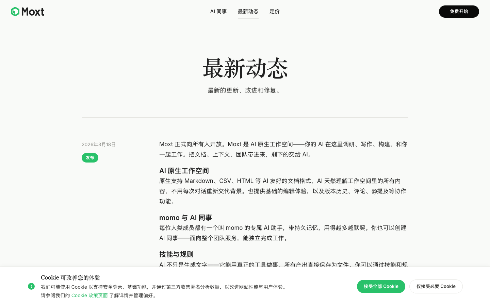

**观察：**

- ✅ 产品定位清晰传达：Moxt 是"AI 原生工作空间"，定位为人与 AI 协作的文档/工作环境，与传统 Notion 类工具的差异点（AI 原生）有明确表述
- ✅ 核心能力四大模块结构化呈现：AI 原生工作空间（文档协作+AI 理解全部上下文）、momo 与 AI 同事（个人助手+团队级 AI 角色）、技能与规则（可定义 AI 行为）、自动化与集成（定时任务+Webhook+GitHub/Slack），覆盖"内容载体—AI 主体—AI 能力定义—外部触达"完整链路
- P2 "技能与规则"功能描述过于抽象：只说"定义 AI 的能力与行为""自由组合"，但没说明技能是代码/Prompt/工作流？规则是权限边界还是行为约束？团队共享的颗粒度是什么？读完不知道如何上手创建一个技能
- P2 "AI 同事独立完成工作"的工作机制缺失：未说明 AI 同事是基于角色模板创建、还是需要配置技能栈？能调用哪些工具？是否有任务队列、并发限制、人工审批环节？"以独立身份出现在 Slack 频道"的具体形态（账号、@提及响应、主动发言）不清楚
- P2 集成清单不完整：只点名 GitHub（"一键接入"）、Slack、Webhook、"任意外部 API"，但未列出已支持的 SaaS（Jira/Linear/Notion/Google Workspace 等都没提），用户无法判断能否接入自家工具栈


### ⚠️ 未找到的测点（5 个测点）

**该模块覆盖页面**:

- `https://moxt.ai/zh-CN`

#### C4: Login page

**URL:** https://moxt.ai/zh-CN
**观察：**

- [Link not found] 该模板期望的链接（log in|login|sign in|登录|登入）在 https://moxt.ai/zh-CN 上未找到 — 可能产品用了不同的措辞或这个功能不存在。 已跳过截图与 LLM 解读以避免重复首页快照。

#### M3: Use cases / Workflows

**URL:** https://moxt.ai/zh-CN
**观察：**

- [Link not found] 该模板期望的链接（use case|workflow|how it works|功能演示）在 https://moxt.ai/zh-CN 上未找到 — 可能产品用了不同的措辞或这个功能不存在。 已跳过截图与 LLM 解读以避免重复首页快照。

#### S9: API / Developer docs

**URL:** https://moxt.ai/zh-CN
**观察：**

- [Link not found] 该模板期望的链接（api|developer|docs.|开发者）在 https://moxt.ai/zh-CN 上未找到 — 可能产品用了不同的措辞或这个功能不存在。 已跳过截图与 LLM 解读以避免重复首页快照。

#### S12: Trust / Security page

**URL:** https://moxt.ai/zh-CN
**观察：**

- [Link not found] 该模板期望的链接（security|trust|compliance|安全|信任）在 https://moxt.ai/zh-CN 上未找到 — 可能产品用了不同的措辞或这个功能不存在。 已跳过截图与 LLM 解读以避免重复首页快照。

#### S14: Customer support channels

**URL:** https://moxt.ai/zh-CN
**观察：**

- [Link not found] 该模板期望的链接（contact|support|帮助|联系）在 https://moxt.ai/zh-CN 上未找到 — 可能产品用了不同的措辞或这个功能不存在。 已跳过截图与 LLM 解读以避免重复首页快照。


---

## 4. 第三方社区反馈

#### ⚠️ 未找到显著社区讨论

WebSearch 在 Reddit / Product Hunt / Hacker News / G2 等平台未找到 `moxt.ai` 的显著用户讨论。本节为 null finding — 不代表产品质量好或差。

---

## 5. 总结

### 5.1 一句话评价

目标产品 **https://moxt.ai/zh-CN** 在 **multi-agent** 模板的 **standard** 档位评测下存在严重问题：识别问题 52 个（P1 25 / P2 23 / P3 4），正面发现 22 个。详见 §3 体验流程与 §3 问题清单。

### 5.2 最大优点

1. **[C1]** ✅ **AI 同事 + Slack 原生集成**：产品定位清晰——为每个员工配专属 AI 同事 ("momo")，直接在 Slack 中 @ 调用，省去工具切换。明确传达"输入=Slack 消息，输出=共享空间里的交付物"的工作机制。
2. **[C1]** ✅ **场景化能力展示充分**：列出 8 个具体 Agent 角色（社媒运营、冷触达、合同审查、竞品监控、线索评估、简历筛选、多项目追踪、路演撰写），每个都用动词短语说明输入/输出（如"扫描 NDA→标记风险→对比修改→起草建议"），用户能立刻判断是否适用自己业务。
3. **[C1]** ✅ **差异化定位明确**：用对比框区分 Notion / OpenClaw / ChatGPT / Cursor 的边界——Moxt 强调"为 Agent 原生设计的 OS""团队共享记忆""成果永久留存"，回答了"为什么不用 ChatGPT 就够了"这个核心疑问。

### 5.3 最大风险

1. **[C1]** P1 核心能力"共享记忆"工作机制未说明**：页面反复强调"整个团队共享同一份记忆""纠正一个 Agent，所有 Agent 都记住"，但没有解释记忆的存储形式、权限边界（敏感信息如何隔离？）、如何手动编辑/删除、跨 Agent 同步延迟等关键机制，这是产品差异化卖点却最不透明。
2. **[C1]** P1 集成范围与"工具使用"边界模糊**：底部 Logo 区显示 Slack/Markdown/Google Docs/HTML/Web/Voice/GitHub/CSV/Sheets，但未说明哪些是"输入源"、哪些是"Agent 可主动操作"、哪些是"输出目标"。Browser/Code/Web Search 等能力图标也仅作展示，未说明 Agent 能否真正执行（如：能否登录 SaaS 后台、能否提交 PR）。
3. **[C2]** P1 缺少积分消耗的量化参考**：页面反复强调"按 AI 工作量收费"，但完全没说明**典型操作消耗多少积分**（一次对话 ≈ ? 积分、跑一个自动化任务 ≈ ? 积分、AI 同事运行一天 ≈ ? 积分）。用户无法判断 $20 / $100 / $2000 各档位能撑多久、能完成多少工作，这是按量计费模式下最关键的功能性信息缺口。

### 5.4 用户增长漏斗推断

#### 官网增长漏斗推断图

```
Stage 1: 落地页认知 (访客首次接触 moxt.ai 品牌叙事)
    ↓ 关键触点: 推断 — 访客需要先理解"AI 同事"这一非标品类
Stage 2: 定价页价值评估 (用 pricing 反向理解产品定位)  [C2]
    ↓ 关键触点: "人类免费 + AI 按工作量计费"差异化主张 [C2]
Stage 3: AI 同事工作机制理解 (FAQ 中的能力边界推演)  [C2]
    ↓ 关键触点: "常驻 Workspace、自主执行、按执行扣积分" [C2]
Stage 4: 成本与用量自估 (按量计费下访客必须自行换算 ROI)
    ↓ 关键触点: ⚠️ 缺口 — 无积分消耗量化参考 [C2 P1]
Stage 5: 注册入口 (signup 表单)  [C3]
    ↓ 终止于: 访客填表 → 完成转化
```

#### 关键漏斗节点详解

**Stage 1: 落地页认知**
- 页面陈述：（提供的节选未包含落地页正文，此节点仅由 C2/C3 反推存在）
- 我的推断：访客在到达 pricing / signup 前，必须先在某个入口接触"AI 同事"这一概念。由于 C3 注册页"无产品能力速览"[C3 P1]，落地页几乎承担了**全部认知教育**职责。
- 潜在流失点：若落地页没有用具体场景（监控数据、撰写内容、定时任务）演示 AI 同事在做什么，访客在概念层就会流失，因为"AI 同事"是一个无行业先验认知的新词。

**Stage 2: 定价页价值评估**
- 页面陈述：$1 = 100 积分、积分永不过期、人类免费、AI 按工作量计费、FAQ 明确对比"为什么不按席位/不订阅"[C2]
- 我的推断：moxt 把 pricing 页当作**产品定位宣言**而不是单纯的价格表，意图通过定价机制让访客一眼理解"我们卖的是工作成果，不是工具使用权"。这是一个把商业模式当 USP 的设计取舍——优点是定位极清晰，缺点是访客如果对"按工作量计费"心智不熟，反而比订阅制更难评估。
- 潜在流失点：习惯 SaaS 按席位/月费的采购方读完会产生**预算不可预测焦虑**，且页面没给出"典型用量 → 月度积分消耗"的换算 [C2 P1]，访客无法回答"我每月要充多少钱"。

**Stage 3: AI 同事工作机制理解**
- 页面陈述：FAQ 说明 AI 同事是"常驻 Workspace 的自主 AI 成员……独立执行任务、监控数据动态、撰写内容、运行自动化流程，全天候在线"，"创建免费、仅执行时扣积分" [C2]
- 我的推断：FAQ 在功能上承担了**产品手册**的作用——这是定价页越权代偿"产品介绍"职责的信号，间接说明落地页/产品页对 AI 同事能力的解释可能不够充分。"创建免费、执行扣积分"暗示鼓励访客**先大量创建 AI 同事**以建立沉没成本，再通过执行计费变现。
- 潜在流失点：FAQ 列出的能力都是抽象动词（执行、监控、撰写、自动化），缺少"AI 同事能接入什么数据源 / 触发什么外部系统"的集成清单 [C2 P2]，B 端访客无法判断它能否嵌入自己的工作流。

**Stage 4: 成本与用量自估**
- 页面陈述：套餐档位 $20 / $100 / $2000（来自节选），"Workspace 全部开放，功能一视同仁" [C2]
- 我的推断：取消功能阉割、用积分量做差异化，是一个对**小客户友好但对大客户不利**的设计——大客户通常希望用功能/SLA 区分套餐而不是单纯买更多额度。访客读完这一节后必须自己估算用量，但页面没提供任何参考量级 [C2 P1]，决策成本被外部化给用户。
- 潜在流失点：理性决策者会在此节点离开去搜竞品（Notion AI / Lindy / Relay）做对照；冲动决策者可能直接挑最便宜档位试水——后者对 LTV 不利。

**Stage 5: 注册入口**
- 页面陈述：C3 节选为空，未观察到 SSO / 角色选择 / 试用条款等字段 [C3 P2 P3]
- 我的推断：注册页极度精简意味着 moxt 把转化压力前置到了**到达注册页之前**——一旦访客走到 /signup，团队假设转化决心已经形成。这是一种"高意图过滤"设计，会牺牲漏斗中段犹豫用户的转化率。
- 潜在流失点：注册页本身没有任何"再次说服"机制（无能力速览、无社会证明、无免费额度提示），如果访客在 Stage 4 产生迟疑后才点进注册，此页无法挽回。

#### 转化设计观察

- **入口设计**：从可观察证据看，moxt 走的是**自助注册 + 充值制**路线，未观察到 Demo 表单或 Sales-led 入口。这与"积分按量计费、$20 起步"是自洽的——客单价天然偏低，养不起销售团队。权衡是放弃了企业大单的人工触达，押注 PLG 自传播。
- **价格 / 套餐心智锚点**：访客读完 pricing 会形成两个锚点：(1) "$1 = 100 积分"——把价格切到极小颗粒度降低心理门槛；(2) "人类免费"——把团队席位成本归零，与 Notion / Slack / Linear 的按席位计费形成鲜明对照。但因为缺少"一次 AI 对话 ≈ 多少积分"的换算 [C2 P1]，锚点是**价格锚**而不是**价值锚**——访客记住了便宜，但记不住能买到什么。
- **可见的 Aha 承诺**：官网用"AI 同事全天候在线、自主执行任务"作为承诺话术 [C2]。这是一个**结果型承诺**（AI 替你干活）而不是**过程型承诺**（你将用什么界面/工作流），优点是直击痛点，缺点是访客没有具体场景画面感——"全天候在线干什么"是未回答的问题。

#### 漏斗设计的强弱判断（仅官网层面）

- ✅ **定价机制即定位宣言**：把"人类免费 + AI 按量"做成 USP 写进 pricing FAQ，是一个高完成度的差异化叙事，能让目标用户在 30 秒内识别"这不是又一个 SaaS"。
- ✅ **低门槛起步价**：$20 起充 + 积分永不过期，几乎消除了"先付一年订阅"的承诺成本，对 PLG 漏斗友好。
- ⚠️ **按量计费缺量化锚点**：[C2 P1] 是漏斗中最严重的可见缺口——访客在 Stage 4 必须自行估算用量却拿不到任何参考，理性用户会在此处流失去搜竞品。
- ⚠️ **能力边界叙事过抽象**：[C2 P2] FAQ 用"执行/监控/撰写/自动化"等动词概括 AI 同事，但没有集成清单、没有具体场景案例，B 端决策者无法判断匹配度。
- ❌ **注册页零说服力**：[C3 P1] /signup 不承载任何能力速览或社会证明，把"是否要注册"的全部说服压力推回给前序页面，对漏斗中段犹豫用户极不友好。

---

