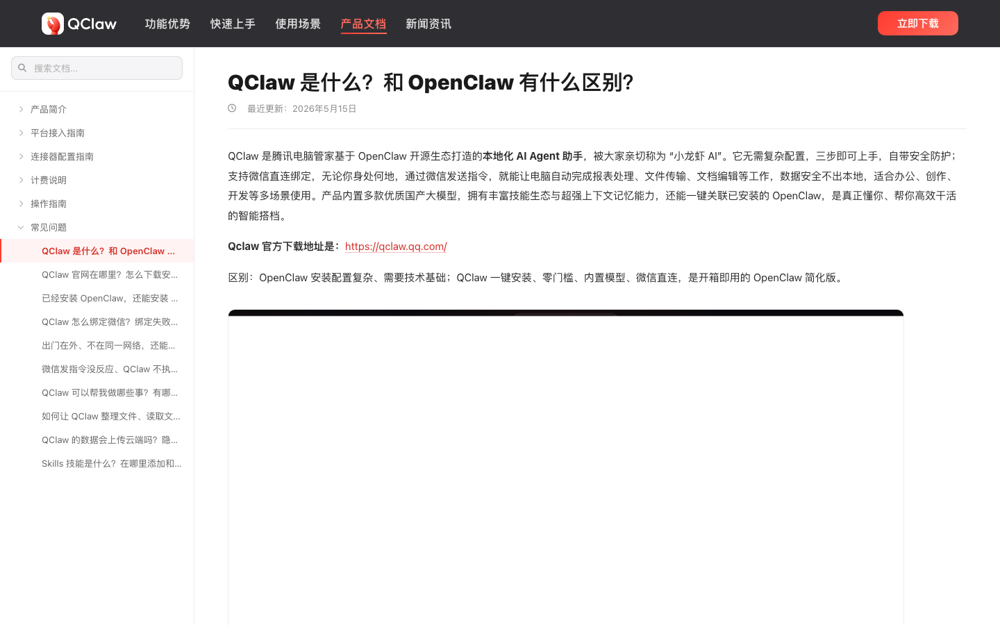
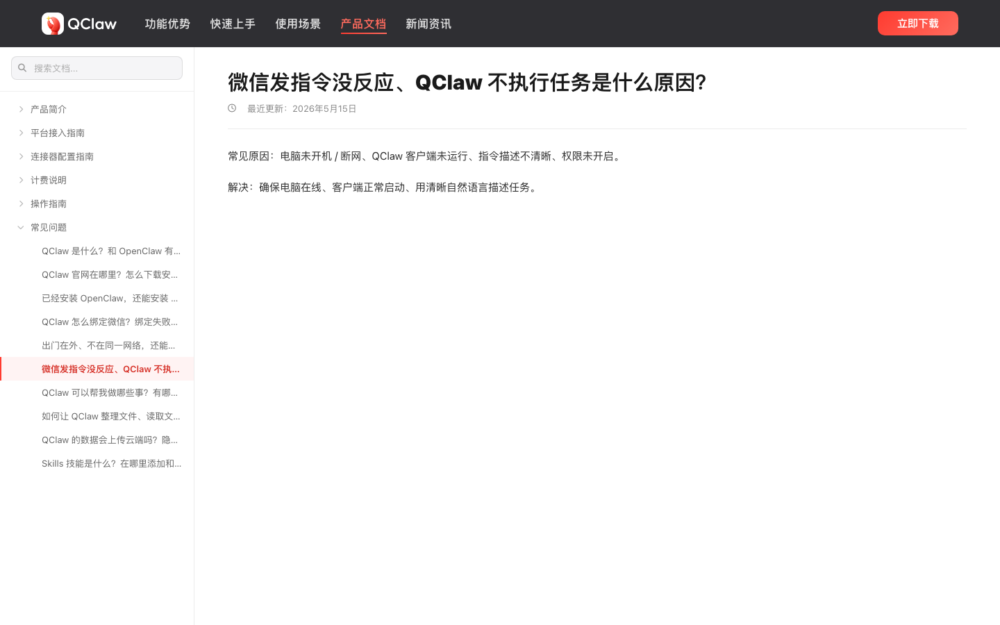
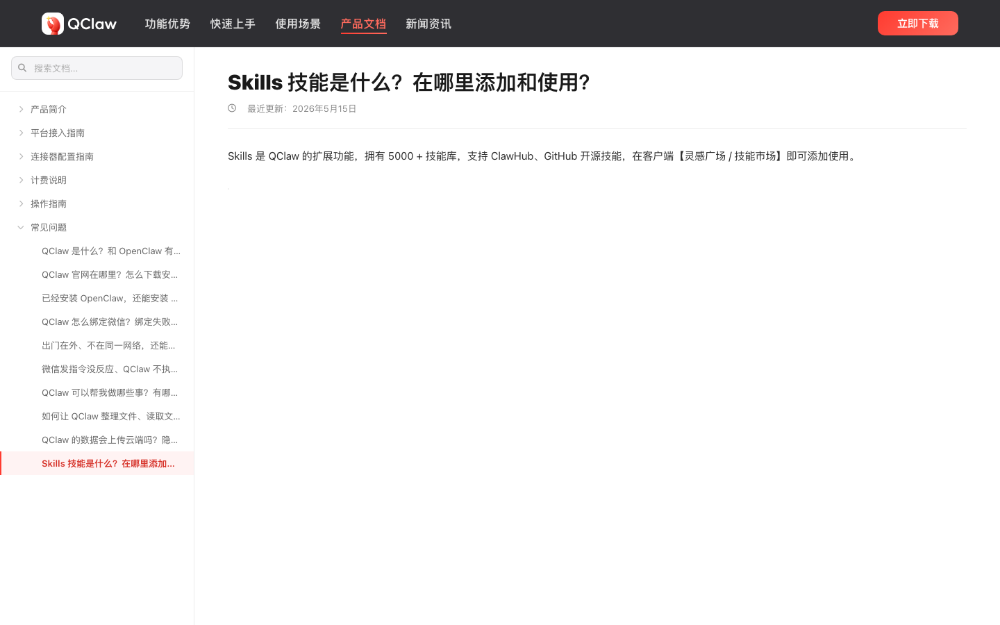
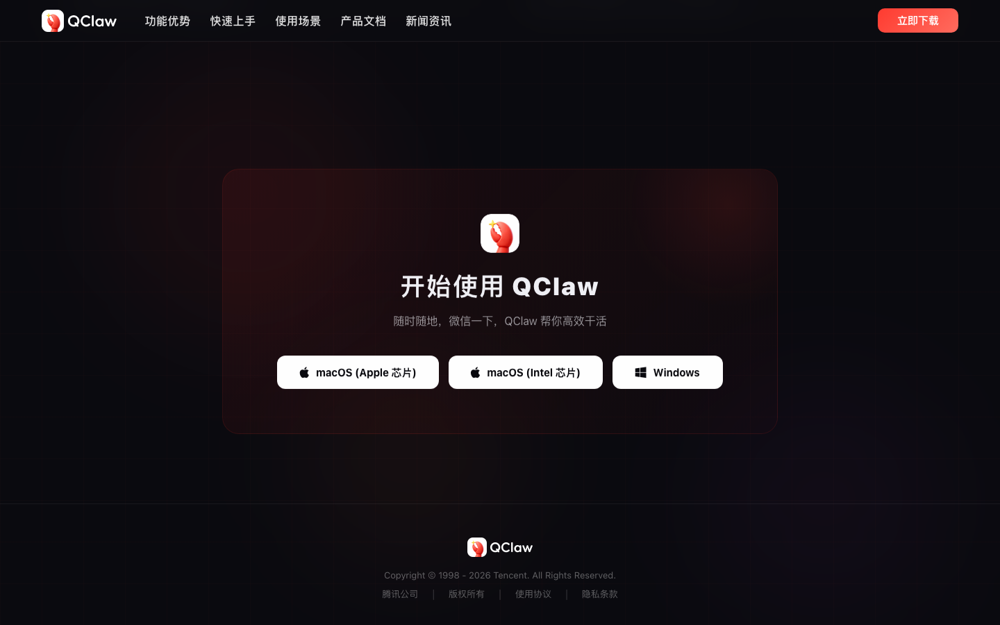
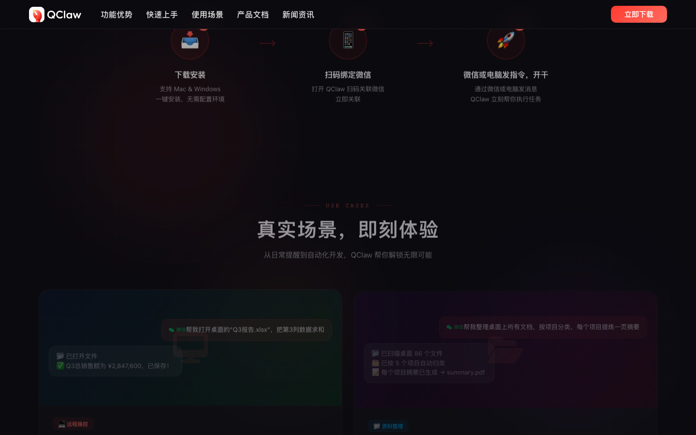
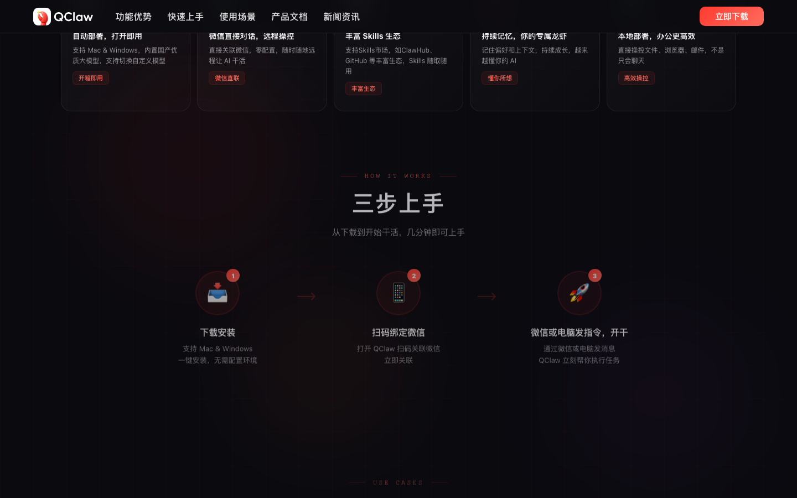
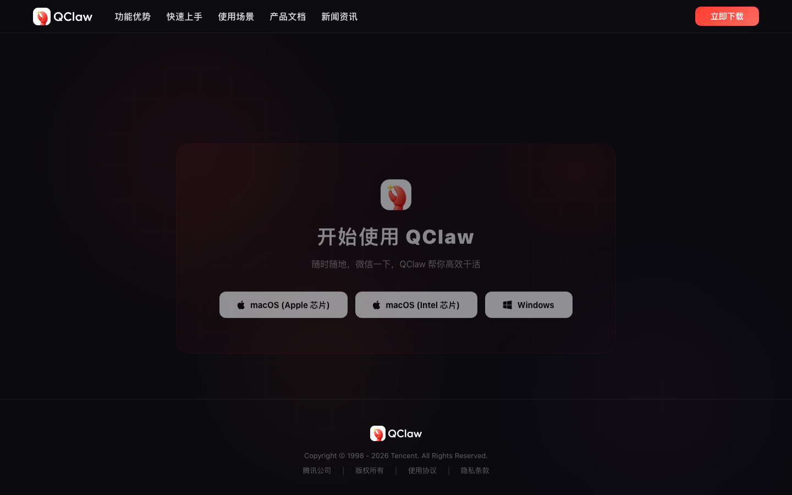
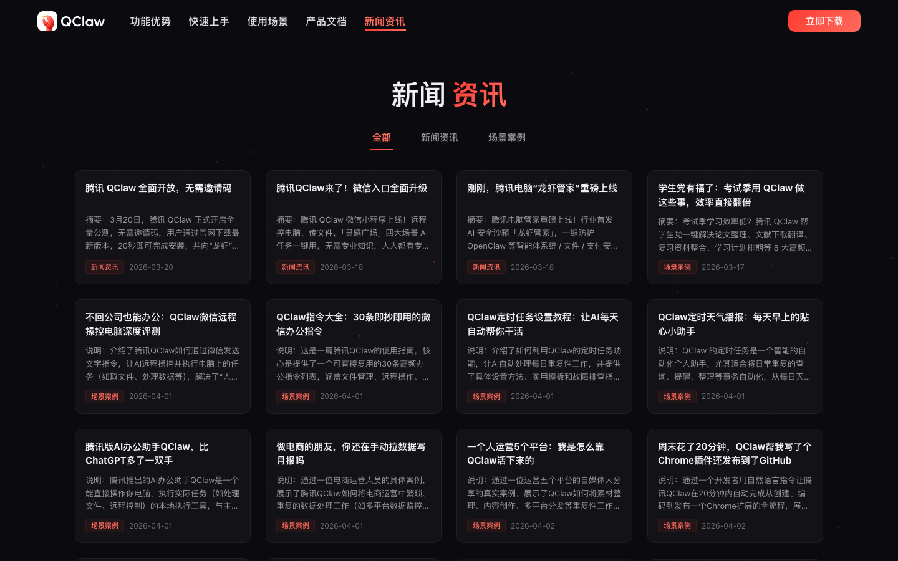
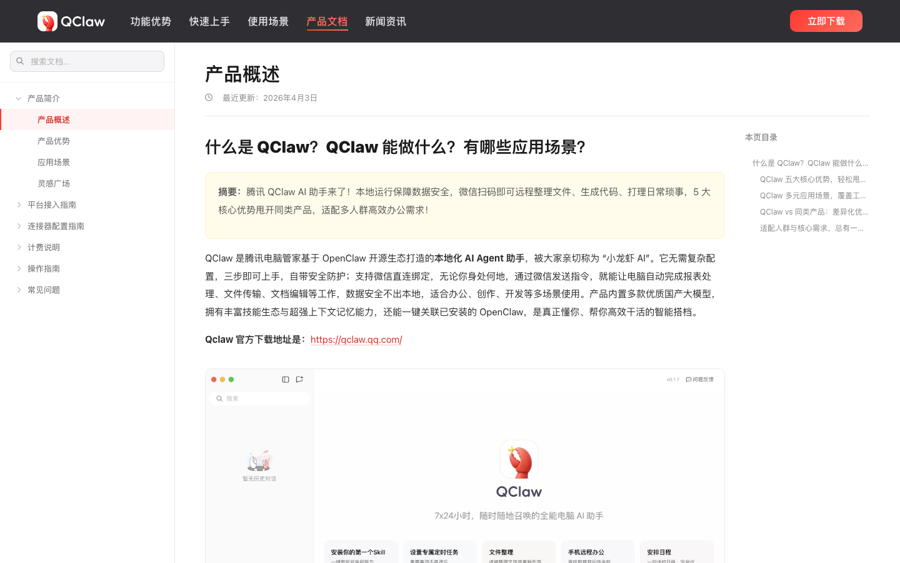
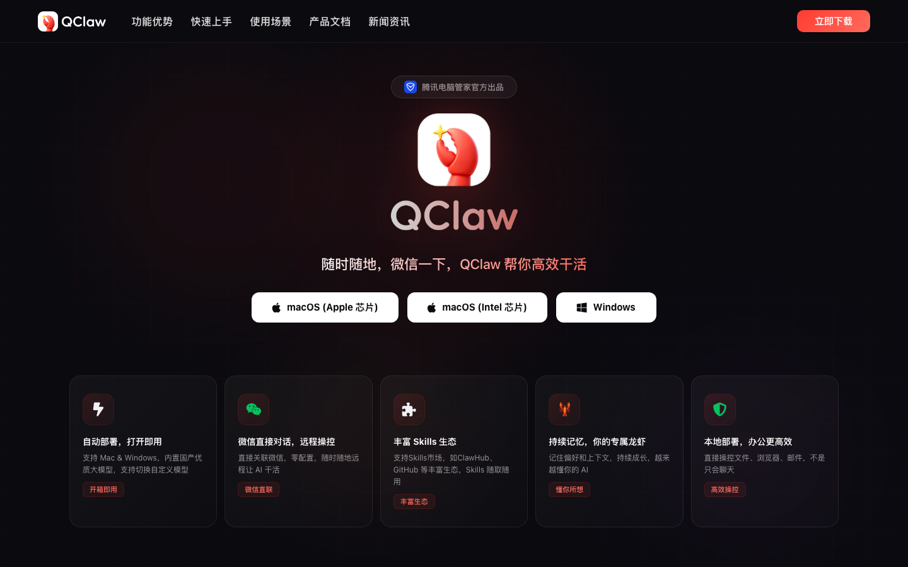

# qclaw.qq.com 产品深度体验报告

## 报告信息

| 项 | 内容 |
|---|---|
| 产品名称 | qclaw.qq.com |
| 产品 URL | https://qclaw.qq.com/ |
| 体验时间 | 2026-05-30T10:22:04.572511 |

---

## 目录

- [1. 核心结论](#1-核心结论)
  - [1.1 一句话判定](#11-一句话判定)
  - [1.2 主要风险](#12-主要风险)
  - [1.3 主要亮点](#13-主要亮点)
  - [1.4 综合评分](#14-综合评分)
- [2. 产品概览](#2-产品概览)
  - [2.1 基础信息](#21-基础信息)
  - [2.2 测点速览](#22-测点速览)
  - [2.3 产品 / 公司背景信息](#23-产品--公司背景信息)
  - [2.4 产品定位与策略](#24-产品定位与策略)
  - [2.5 公司基本信息](#25-公司基本信息)
- [3. 体验流程记录](#3-体验流程记录)
  - [3.1 官网叙事分析](#31-官网叙事分析)
  - [3.2 测点流程详情](#32-测点流程详情)
- [4. 第三方社区反馈](#4-第三方社区反馈)
- [5. 从访客到注册的转化路径](#5-从访客到注册的转化路径)

---

## 1. 核心结论

### 1.1 一句话判定

目标产品 **https://qclaw.qq.com/** 在本次深度体验中：存在显著的功能信息缺口。详见 §3 体验流程记录。

### 1.2 主要风险

1. **[C1]** P1** 核心机制存在逻辑缺口："本地部署、直接操控文件/浏览器/邮件"与"随时随地、不带电脑也能远程操作"两个卖点并存，但未说明远程执行的前提——电脑是否必须保持开机并运行 QClaw、断网/休眠时指令如何处理。这是用户决定能否依赖它的关键，页面完全没交代。
2. **[C1]** P1** 权限与安全边界缺失：产品声称能操控本地文件、邮件、浏览器并自动 push 到 GitHub，却未说明授权范围、敏感操作是否需二次确认、数据是否上云、微信通道被盗用时的风险控制。对"让 AI 远程操控我的电脑"这类高风险能力，安全说明的缺位会直接劝退用户。
3. **[C3]** P1** 核心工作机制含糊:产品主打"随时随地微信远程操控电脑",但远程执行的前提是本机 QClaw 进程在运行——页面完全没说明电脑关机 / 休眠 / 断网时指令能否执行、指令是否经腾讯服务器中转、"本地部署"与"微信远程"两条线如何打通。这是判断产品实际可用性的关键却没讲清。

### 1.3 主要亮点

1. **[C1]** ✅ 页面用 7 个具体场景（远程操作文件/网页、文件整理、定时提醒、邮件风格学习、GitHub 自动开发、学术综述）配输入指令+输出回执的方式演示工作流，读完能清楚理解"对着微信发一句话，电脑端 AI 帮我执行任务并回传结果"这一核心能力，功能价值传达有力。
2. **[C3]** ✅ 页面用 7 个"输入指令 + 执行结果"的真实场景(微信发"打开 Q3报告.xlsx 求和"→返回总额并保存、整理桌面 86 个文件→生成 summary.pdf、建 Chrome 插件项目→自动 push GitHub、文献综述→导出 PDF/LaTeX)清晰演示了核心能力。产品定位明确:以微信为远程指令入口、能直接操控本地文件/浏览器/邮件的 AI agent,用户读完基本能理解"它能用微信远程指挥我的电脑干活"。
3. **[C5]** ✅ 页面把"产品能为我做什么"讲得相当到位：用"下载安装→扫码绑定微信→发指令开干"三步工作流，配 7 个带输入/输出示例的真实场景（远程操控桌面文件、按项目整理桌面并提炼摘要、定时天气提醒、记忆邮件风格、GitHub 项目自动开发、文献综述），清晰传达了核心定位——QClaw = 通过微信远程指挥的本地 AI agent，能真正操作文件/浏览器/邮件而非只会聊天。

### 1.4 综合评分

| 维度 | 评分 | 1-2 句话说明（引用具体 [测点ID]） |
|---|---:|---|
| 产品方向清晰度 | 4.0 / 5 | "微信遥控本地电脑、能真正操作文件/浏览器/邮件而非只会聊天"的定位贯穿全站且有一句话定义 [B1][S2][C8]；但"本地部署"与"云端远程"架构表述自相矛盾、产品边界（不做什么）未交代 [C5][S1]。 |
| 价值主张表达力 | 4.0 / 5 | 7 个"输入指令→执行→回执"真实场景把卖点讲得有力可感、并明确对标 OpenClaw 做差异化 [C1][S2][B1]；但"数据不出本地"与"微信远程链路"之间的逻辑张力削弱了说法可信度 [S1]。 |
| 信息架构 | 2.0 / 5 | 定价/登录/集成/客户/案例/博客等预期页面均"未找到"，footer 仅法务两链接，404 软跳回首页 [C2][C4][S3][S4][S5][S6][C5][C8]；文档概述页也未给相关子指南入口 [C7]。 |
| 功能广度与深度 | 3.0 / 5 | 功能覆盖面广（文件/浏览器/邮件/GitHub/定时/记忆/Skills/换模型，并映射 6 类人群）[C1][C7][S1]；但最核心的"微信远程如何工作"及权限边界反复缺失、深度不足 [C1-P1][S1-P2]。 |
| 核心能力可信度 | 2.5 / 5 | 有腾讯出品 + 基于 OpenClaw 的品牌背书 [B1][C8]；但"内置国产大模型"不点名、"5000+Skills"无清单、对比表无判据、零客户/案例佐证，声称大于证据 [C7-P3][S9-P2][S4][S5]。 |
| 商业化清晰度 | 1.5 / 5 | 定价页缺失、全站无收费/额度信息，仅文档一句"限时免费内测"且未说明内测后收费、token 成本、套餐分层；侧栏"计费说明"入口有内容空 [C2][C3-P3][C5-P3][C7-P2][B1]。 |
| **综合平均** | **2.8 / 5** | **产品定位与价值演示是明显强项，但信息架构残缺、能力缺乏证据、商业化几乎空白，整体停留在"卖点清晰但关键信息（机制/安全/价格）系统性缺位"的合格偏弱水平。** |

---

## 2. 产品概览

### 2.1 基础信息

- **URL**: https://qclaw.qq.com/
- **首屏标题**: 功能优势
快速上手
使用场景
产品文档
新闻资讯
立即下载
腾讯电脑管家官方出品

随时随地，微信一下，QClaw 帮你高效干活

macOS (Apple 芯

### 2.2 测点速览

本次共体验 22 个测点。

> ⚠️ **登录后内容未覆盖**——用户选择不登录，本报告仅为公开页范围；产品登录后的工作台 / 实际操作未在本报告内。

### 2.3 产品 / 公司背景信息

共发现 **3** 个产品/公司的官方介绍页面：

#### B1: 背景 D1: QClaw 是什么？和 OpenClaw 有什么区别？

**URL:** https://qclaw.qq.com/docs/205521621464268800.html



**背景信息：**

- ✅ **一句话定义清晰**：页面原文将产品定义为"QClaw 是腾讯电脑管家基于 OpenClaw 开源生态打造的本地化 AI Agent 助手，被大家亲切称为'小龙虾 AI'"，主体（腾讯电脑管家出品）、技术来源（OpenClaw 开源生态）、形态（本地化 AI Agent）三要素齐全。
- ✅ **核心能力枚举具体**：页面明确提到的能力包括 ① 微信直连绑定、远程发指令控制电脑；② 报表处理 / 文件传输 / 文档编辑等任务执行；③ 内置多款国产大模型；④ Skills 技能生态；⑤ 超强上下文记忆 + 一键关联已安装的 OpenClaw。能力描述偏任务级、可感知。
- ✅ **目标场景与门槛主张明确**：定位"无需复杂配置、三步上手、零门槛、开箱即用"，面向"办公、创作、开发等多场景"，并强调"数据安全不出本地、自带安全防护"，把易用性和本地隐私作为双卖点。
- ✅ **差异化叙事直接对标 OpenClaw**：页面用一句话把竞品关系讲透——"OpenClaw 安装配置复杂、需要技术基础；QClaw 一键安装、零门槛、内置模型、微信直连，是开箱即用的 OpenClaw 简化版"，差异主张（简化版 / 降门槛）非常清楚。
- P3 **关键术语缺乏展开**：出现"小龙虾 AI""Skills 技能""OpenClaw 开源生态""上下文记忆能力"等专有概念，但本页几乎都只给名字不给定义——例如 Skills 是什么、在哪添加使用，被单独列为另一条 FAQ，本页未说明；"内置多款优质国产大模型"也未点名具体是哪些模型。
- P3 **理解缺口（读完仍不清楚的关键点）**：① 既称"数据不出本地"又支持"出门在外通过微信远程控制电脑"，这两者如何同时成立、远程链路的安全边界未解释；② QClaw"基于 OpenClaw 打造"却又能"一键关联已安装的 OpenClaw"，二者究竟是替代、套壳还是并存关系略显矛盾；③ 侧栏有"计费说明"，但本页未交代 QClaw 是否免费、收费模式如何。

#### B2: 背景 D1: 微信发指令没反应、QClaw 不执行任务是什么原因？

**URL:** https://qclaw.qq.com/docs/205522794312601600.html



**背景信息：**

- ✅ **核心叙事（远程控制场景）**：页面最清晰传达的定位是"通过微信发指令、远程控制电脑执行任务"——FAQ 明确问到"出门在外、不在同一网络，还能通过微信远程控制电脑 QClaw 干活吗？"，可见产品核心卖点是**用微信当遥控器、让本地电脑代为干活**。
- ✅ **核心功能能力（FAQ 罗列）**：页面通过问题清单透露出可用能力，最多取 5 项——① 微信绑定/收发指令；② 整理文件；③ 读取文档；④ 发送邮件；⑤ Skills 技能扩展（另有"连接器配置""平台接入"等进阶项）。
- ✅ **关键术语**：①「QClaw」= 需安装并保持运行的客户端工具；②「OpenClaw」= 反复被对比的同类/关联产品（"和 OpenClaw 有什么区别""装了 OpenClaw 还能装 QClaw 吗"）；③「Skills 技能」= 可添加使用的能力扩展机制；④「连接器」= 对接外部平台的配置项。另由页脚 "Copyright Tencent" 可知**归属腾讯**。
- ✅ **本页主题（故障排查）**：本页是常见问题之一，明确给出"指令无反应/不执行"的四类常见原因——**电脑未开机或断网、客户端未运行、指令描述不清晰、权限未开启**，并给出对应解决方案（保持在线、正常启动客户端、用清晰自然语言描述任务），更新于 2026-05-15。
- P3 **产品一句话定义缺失**：尽管 FAQ 里有"QClaw 是什么？和 OpenClaw 有什么区别？"，本页**并未展示该问题的答案**，缺少一句话权威定义；读者只能从场景反推，无法确认 QClaw 到底是 AI 助手、自动化客户端还是 OpenClaw 的某种衍生版。
- P3 **差异化与隐私主张未交代**：①「QClaw vs OpenClaw」差异、②「数据是否上传云端、隐私是否安全」、③「计费说明」——这三项均在导航/FAQ 标题中出现，但本页**均无实际内容**，差异化叙事和安全承诺仍是理解缺口，需跳转其他页面才能补齐。

#### B3: 背景 D1: Skills 技能是什么？在哪里添加和使用？

**URL:** https://qclaw.qq.com/docs/205522810833965056.html



**背景信息：**

- ✅ **核心功能能力**：本页对 Skills 给出清晰定义——"Skills 是 QClaw 的扩展功能，拥有 5000+ 技能库，支持 ClawHub、GitHub 开源技能，在客户端【灵感广场 / 技能市场】即可添加使用"。结合侧边 FAQ 标题还可推知 QClaw 的其他能力：微信远程控制电脑、整理文件、读取文档、发送邮件。
- ✅ **关键术语 / 概念**：页面密集出现产品专有概念——"Skills（技能）"= 可扩展的插件式能力；"ClawHub"= 官方技能仓库（与 GitHub 并列的技能来源）；"灵感广场 / 技能市场"= 客户端内添加技能的入口；以及"连接器配置 / 平台接入"= 接入外部服务的机制。
- ✅ **目标用户与场景**：以 FAQ 问答口吻面向个人电脑用户，典型场景为"出门在外、不在同一网络，通过微信远程控制电脑 QClaw 干活"，以及整理文件、读文档、发邮件等本地办公自动化。
- ✅ **差异化主张 / 品牌叙事**：核心叙事是"用微信指挥电脑"——把微信作为远程下达指令的入口（绑定微信、微信发指令执行任务）；同时反复以"QClaw 和 OpenClaw 有什么区别""已装 OpenClaw 还能装 QClaw 吗"来与同名开源项目 OpenClaw 区隔。页脚标注运营方为腾讯公司（Tencent）。
- P3 **产品 / 公司一句话定义**：本页（Skills 子页）只定义了 Skills，未给出 QClaw 本身的一句话定义。"QClaw 是什么？和 OpenClaw 有什么区别？"虽列为 FAQ 首条，但本页未展开答案，读者无法在此页确认 QClaw 的产品类别（AI 助手 / Agent 客户端 / 自动化工具？）。
- P3 **理解缺口**：(1) QClaw 与 OpenClaw 是否同源、具体区别与计费差异未说明（仅有"计费说明"入口）；(2) 数据是否上传云端、隐私如何保障仅列为问题、本页未回答；(3) 5000+ 技能库究竟能完成哪些任务、技能的质量与审核机制不明。


### 2.4 产品定位与策略

### 1. 把微信变成远程指挥电脑的遥控器入口
**核心判断**: 产品最独特的形态选择，是用微信当远程指令入口去驱动本地电脑，而不是做成一个独立 App 或网页对话框。
**支撑证据**: 
- [C1] 全站用 7 个"对着微信发一句话 → 电脑端 AI 执行任务并回传结果"的场景来演示核心能力
- [S2] 反复强调"微信直联远程操控"，把家里/公司的电脑变成一个可远程指挥的执行体
- [B1] 官方核心能力枚举第一项即"微信直连绑定、远程发指令控制电脑"
**对用户的含义**: 用户不用守在电脑前就能派活，但代价是那台被控电脑必须始终开机、联网、QClaw 常驻运行（[B2] 故障排查正印证了这一隐含前提）。

### 2. 主打"能替你操作电脑干活"，而不是又一个聊天机器人
**核心判断**: 产品刻意和普通 AI 对话切割，把自己定位成能真正动文件、浏览器、邮件的"执行体"，卖的是结果而非问答。
**支撑证据**: 
- [S2] 明确传达 QClaw 是能真正操控本地电脑的桌面 Agent，而非对话机器人
- [C7] 专门做了"QClaw vs 传统 AI 聊天 vs 其他 Agent"的竞品对比表来强化这一区隔
- [S1] 用"建 GitHub 仓库推 PR、整理文件、润色 Word、发邮件"等带产出物的场景证明"能执行"
**对用户的含义**: 用户评判它好不好的标准是"任务有没有被做完",而不是"回答得对不对",期望从一开始就被拉到执行层。

### 3. 把自己摆成 OpenClaw 的零门槛简化版,专收被复杂配置劝退的人
**核心判断**: 产品不回避同源的开源项目,反而直接对标,用"一键安装、内置模型、零门槛"去承接那些想要 Agent 能力却搞不定配置的用户。
**支撑证据**: 
- [B1] 原文直接对比:"OpenClaw 安装配置复杂、需要技术基础;QClaw 一键安装、零门槛、内置模型、微信直连,是开箱即用的 OpenClaw 简化版"
- [B1] 通篇主张"无需复杂配置、三步上手、开箱即用",把易用性当头号卖点
- [B3] 内置模型 + ClawHub/灵感广场技能市场,让加技能这件事也免去自行搭建
**对用户的含义**: 没有技术背景也能上手,但换来的代价是模型、数据流向、权限边界都被黑盒化,用户让渡了可控性换便利。

### 4. 用"本地运行、数据不出电脑"当作主要信任卖点
**核心判断**: 面对"让 AI 操控我整台电脑"的高风险感知,产品选择用本地化和隐私不出本地来建立信任,而不是用安全机制说明。
**支撑证据**: 
- [B1] 把"数据安全不出本地、自带安全防护"和易用性并列为双卖点
- [S1] 对比表里直接给出"数据不出电脑 ✅"的强承诺
- [C5] 但同时宣称"本地部署"与"自动部署、微信直联",未说清远程指令是否经云端中继,自相矛盾
**对用户的含义**: 隐私是产品给用户的主要心理安全锚,但"微信下发的指令是否经腾讯服务器中转"始终没讲清,这个承诺的可信度要打折。

### 5. 靠腾讯品牌加免费内测先抢用户,把收费问题往后放
**核心判断**: 产品当前不谈商业模式,而是用大厂背书加"限时免费"压低试用顾虑、先做规模获客。
**支撑证据**: 
- [C7] 计费信息全站只有一句"限时免费内测",内测后是否收费、按什么收均无交代
- [B1]/[C8] 反复强调"腾讯电脑管家出品",用品牌信任降低"交出电脑控制权"的心理门槛
- [C5]/[S2] 整站及页脚找不到任何价格、订阅或调用额度说明
**对用户的含义**: 现在可以零成本、带大厂背书放心试,但未来怎么收费、大模型调用成本由谁承担都未知,长期使用成本是一笔糊涂账。

### 6. 面向多类人群广撒网,不主动收窄到某个行业
**核心判断**: 产品没有锁定垂直场景,而是用"通用桌面自动化"去覆盖尽可能多的个人用户群体。
**支撑证据**: 
- [C7] 把 6 类目标人群(互联网/电商/自媒体/自由职业/学生/设计)与各自需求逐一对齐
- [S2] 用 6 类工作流横跨远程文件操作、资料整理、定时提醒、邮件、GitHub 开发、文献综述
- [S1] 顶层场景也是远程办公/日常生活/编程开发/内容创作四个大筐
**对用户的含义**: 几乎谁都能找到一个用得上的例子,但这也意味着产品没有为任何一类用户的深层需求做深,每个群体可能都只能浅尝,得不到行业级的打磨。

### 2.5 公司基本信息

#### ✅ 实体身份已确认

基于域名 + 产品描述 + 官方/第三方来源交叉核对，目标产品 `qq.com`（`qclaw.qq.com`）的运营主体确认为：
**腾讯控股有限公司（Tencent Holdings Limited / 腾讯）**

验证依据：`site:qq.com` 检索直接返回 [qclaw.qq.com 官网](https://qclaw.qq.com/)、[腾讯电脑管家官网 guanjia.qq.com](https://guanjia.qq.com/)、[腾讯新闻 news.qq.com](https://news.qq.com/rain/a/20260310A05J7C00)、[腾讯软件中心 pc.qq.com](https://pc.qq.com/detail/10/detail_49730.html) 等同源资产；页面页脚标注 "Copyright Tencent"；[Wikipedia](https://en.wikipedia.org/wiki/Tencent) 与 [Tencent 官网](https://www.tencent.com/en-us/about.html) 均明确 qq.com 由腾讯运营。被审计产品 **QClaw（"小龙虾 AI"）** 是腾讯旗下「腾讯电脑管家」基于 OpenClaw 开源生态推出的本地化 AI Agent 助手，归属层级为：腾讯控股 → 腾讯电脑管家产品线 → QClaw。

#### 公司基础事实表

| 项 | 内容 | 置信度 | 来源 |
|---|---|---|---|
| 公司名称 | 腾讯控股有限公司（Tencent Holdings Limited） | ✅ 直接 | [tencent.com](https://www.tencent.com/en-us/about.html) |
| 成立年份 | 1998 年 11 月 | ✅ 直接 | [Wikipedia](https://en.wikipedia.org/wiki/Tencent) |
| 总部地点 | 中国深圳 | ✅ 直接 | [Wikipedia](https://en.wikipedia.org/wiki/Tencent) |
| 产品上线（QClaw） | 2026-03-10 官宣内测；随腾讯电脑管家 18.0 版（2026-03-13）上线 | ✅ 直接 | [news.qq.com](https://news.qq.com/rain/a/20260310A05J7C00) / [qclaw.qq.com 新闻](https://qclaw.qq.com/news/205525842182946816.html) |
| 当前阶段 | Public（港交所主板上市，股票代码 0700.HK） | ✅ 直接 | [HKEX](https://www.hkex.com.hk/Market-Data/Securities-Prices/Equities/Equities-Quote?sym=700&sc_lang=en) |
| 融资总额 | 早期 VC（IDG / PCCW / Naspers-MIH）+ 2004 年 IPO 募资约 US$1.8 亿；现为市值数千亿美元级上市公司 | ✅/⚠️ | [Wikipedia](https://en.wikipedia.org/wiki/Tencent) |
| 团队规模 | ~115,076 人（截至 2025-09-30，集团口径，非 QClaw 团队） | ✅ 直接 | [Macrotrends](https://www.macrotrends.net/stocks/charts/TCEHY/tencent-holding/number-of-employees) |
| 行业类别 | 互联网 / 社交 / 游戏 / 云与企业服务；本产品属本地化 AI Agent（端侧 AI 助手 / 安全工具） | ✅ 直接 | [tencent.com](https://www.tencent.com/en-us/business.html) |

**置信度图例**：✅ = 来源直接锚链接到 qq.com 或腾讯官方 / ⚠️ = 间接推断或口径差异

> 说明：QClaw 是上市公司内部孵化的产品，没有独立融资。下表「融资历史」为**母公司腾讯**的早期资本路径，仅用于刻画主体的资本实力，与 QClaw 这一具体产品的独立估值无关。

#### 融资历史（母公司腾讯，早期至上市）

| 轮次 | 时间 | 金额 | 领投 + 主要参与方 | 来源指向本域名? |
|---|---|---|---|---|
| 早期股权投资 | 2000 年 | 约 US$2.2M（按 US$11M 估值） | IDG Capital、PCCW（盈科）各持 20% | ✅（腾讯主体公开史料） |
| 战略入股 | 2001 年 | 收购 46.5% 股权 | 南非 Naspers / MIH | ✅ |
| IPO（港交所主板） | 2004-06-16 | 募资约 US$1.8 亿（发行价 HK$3.70） | 公开发行，股票代码 0700.HK | ✅ |

来源：[Tencent — Wikipedia](https://en.wikipedia.org/wiki/Tencent)。注：腾讯上市后再无 VC 轮次，后续为公开市场融资与回购，此处不再展开。

#### 创始人 / 核心团队背景

腾讯由 5 位联合创始人于 1998 年创立（来源：[Wikipedia](https://en.wikipedia.org/wiki/Tencent) / [SCMP](https://www.scmp.com/magazines/style/people-events/article/2162245/10-things-you-didnt-know-about-tencent-ceo-pony-ma)）：

- **马化腾（Pony Ma / Ma Huateng）**（董事会主席兼 CEO）— 创始时持股最大；QQ（即 qq.com 同名产品）正是其早期主导产品。**验证：✅**（qq.com 为腾讯旗舰域名，与本人深度绑定）
- **张志东（Tony Zhang / Zhang Zhidong）**（联合创始人，原 CTO）— 负责早期技术架构。**验证：⚠️**（与腾讯绑定明确，但来源未单独锚链接到 qq.com URL）
- **许晨晔（Daniel Xu / Xu Chenye）**（联合创始人，原首席信息官）。**验证：⚠️**
- **陈一丹（Charles Chen / Chen Yidan）**（联合创始人，原首席行政官）。**验证：⚠️**
- **曾李青（Jason Zeng / Zeng Liqing）**（联合创始人，原首席运营官，已离任）。**验证：⚠️**

> QClaw 产品/项目负责人：**未公开**。截至检索时点，腾讯官宣稿与产品文档均只标注"腾讯电脑管家出品"，未披露 QClaw 具体项目负责人或团队名单（来源：[news.qq.com](https://news.qq.com/rain/a/20260310A05J7C00) / [qclaw.qq.com](https://qclaw.qq.com/news/205525842182946816.html)）。

#### 近期重大动态（最近 6–12 个月）

- **2026-03-10**：腾讯官宣 QClaw 内测——基于 OpenClaw 的本地 AI 助手，Windows/Mac 一键安装、覆盖 5000+ Skills，可通过微信对话远程操控电脑；端侧由腾讯电脑管家建"隔离房"限权，云端设 AI Agent 安全中心监测高风险指令 [news.qq.com](https://news.qq.com/rain/a/20260310A05J7C00)（验证：✅ 本域名报道）
- **2026-03-13 / 03-18**：腾讯电脑管家 18.0 版发布并上线"龙虾管家-AI 安全沙箱"，共升级 30 余项 AI 安全功能，宣称已支持 OpenClaw、QClaw、OneClaw、LobsterAi 等多种智能体的一键防护 [qclaw.qq.com 新闻](https://qclaw.qq.com/news/205525842182946816.html)（验证：✅ 本域名）
- **2026 Q1 财报**：集团营收同比 +9% 至人民币 1,965 亿元，Non-IFRS 归母净利润 +11% 至 679 亿元，主体资金面强健 [Tencent Investors](https://www.tencent.com/en-us/investors.html)（验证：⚠️ 母公司口径，非 QClaw 单独数据）
- **员工规模增长**：集团人数由 2024 年底约 110,558 人增至 2025-09-30 的 115,076 人 [Macrotrends](https://www.macrotrends.net/stocks/charts/TCEHY/tencent-holding/number-of-employees)（验证：⚠️ 集团口径）

#### 综合判断

目标产品 QClaw 的运营主体身份**清晰且无重名风险**——qq.com 是腾讯的旗舰域名，QClaw 作为「腾讯电脑管家」2026 年 3 月新推出的本地化 AI Agent，背靠一家在港交所上市、市值数千亿美元、超 11 万员工的超大型互联网平台公司。资本与分发优势极为突出：自带微信/电脑管家的海量装机入口、充裕现金流、成熟的安全合规与大模型资源，使 QClaw 无需独立融资即可快速规模化，并以"内置模型 + 微信直连 + 零门槛"对标并简化 OpenClaw 这一开源生态。

需要关注的短板与不确定性在于**产品层而非公司层**：QClaw 本身上线仅约两个月（2026-03 内测起步），尚处早期，公开信息中缺乏独立的项目负责人、专属团队规模与用户体量披露；其核心卖点"微信远程操控本地电脑 + 自动执行任务"在带来便利的同时天然伴随权限与数据安全争议（这也是腾讯同步主打"龙虾管家"安全沙箱的原因）。后续值得跟踪的方向：Skills/ClawHub 生态的真实可用技能数与质量、对 OpenClaw 的兼容与差异化能否持续、以及远程操控场景下的隐私与权限边界如何落地。

---

## 3. 体验流程记录

### 3.1 官网叙事分析

#### 高频关键词

| 关键词 / 短语 | 出现频次或权重 | 在哪类页面出现 | 想建立的印象 |
|---|---|---|---|
| 微信远程操控 / 微信直连 / 微信发指令 | 极高（几乎每个测点都出现） | 首页、使用场景、关于页、全部 FAQ 文档 | 「人在外面，掏出微信就能遥控家里/公司电脑干活」——这是产品最核心的记忆点 |
| 能真正干活 / 不只是聊天 / 操控文件·浏览器·邮件 | 极高 | 首页、使用场景、关于页、404、B1 | 它是「执行体」而非对话机器人，会动手做事 |
| 本地部署 / 数据不出本地 / 本地化 Agent | 高 | 首页、使用场景、关于页、B1 | 私密、可控、不上云，可放心交出电脑权限 |
| 三步上手 / 零门槛 / 开箱即用 / 一键安装 | 高 | 首页、关于页、B1 | 不用懂技术，下载扫码即用，毫无门槛 |
| 腾讯出品 / 腾讯电脑管家 / Copyright Tencent | 高 | 关于页、全部 FAQ 页脚、B1 | 大厂背书，可信、安全、不会跑路 |
| 内置国产优质大模型 / 支持切换自定义模型 | 中 | 首页、使用场景、关于页、B1 | 模型自主可控、合规、还能自由扩展 |
| Skills 生态 / ClawHub / 5000+ 技能库 | 中 | 首页、B1、B3 | 能力可成长、可扩展，生态丰富 |
| 持续记忆 / 越来越懂你 / 养虾 / 已学会 12 个偏好 | 中 | 关于页、B1 | 个性化、会成长，越用越贴心 |
| 小龙虾 AI / 养虾 | 中 | 关于页、B1（昵称叙事） | 亲切、有人格，是「养着的伙伴」而非冷冰冰工具 |
| OpenClaw 简化版 / 一键关联 OpenClaw | 中 | B1、B2、B3 | 站在已有开源生态肩膀上，但更简单 |

#### 说服手法分析

**1. 给 AI 起拟人化昵称，制造陪伴感**
- 具体表现：「QClaw 是腾讯电脑管家基于 OpenClaw 开源生态打造的本地化 AI Agent 助手，被大家亲切称为'小龙虾 AI'」[B1]，并把记忆功能包装成「养虾」「已学会 12 个偏好」[S7]
- 想达到的效果：把工具变成有人格、会成长的「小伙伴」，弱化「让 AI 全权操控我电脑」的警惕感。

**2. 先否定同类，再抬高自己（双重对标）**
- 具体表现：对普通产品强调「能真正操控文件/浏览器/邮件而非只会聊天」[S2]；对开源同类则讲「OpenClaw 安装配置复杂、需要技术基础；QClaw 一键安装、零门槛……是开箱即用的 OpenClaw 简化版」[B1]
- 想达到的效果：同时甩开「聊天机器人」和「难用的极客工具」两类参照物，把自己定位成唯一「又能干活又好上手」的选择。

**3. 用具体场景 + 精确数字制造「真实可用」的画面感**
- 具体表现：「整理桌面 86 个文件→按 5 个项目归类→生成 summary.pdf」「打开 Q3报告.xlsx 第3列求和→¥2,847,600 已保存」[S2]，技能则号称「5000+ 技能库」[B3]
- 想达到的效果：用看得见输入输出的细节和大数字，让人「脑补」出已经在用的样子，把抽象能力坐实成可信结果。

**4. 大厂权威背书贯穿全站**
- 具体表现：反复强调「腾讯电脑管家出品」，每个页面页脚都挂「Copyright Tencent」[B2][B3]
- 想达到的效果：用腾讯品牌替「把电脑全部权限交给一个 AI」这件高风险的事兜底，降低安全顾虑。

**5. 突出便捷、回避机制（扬长避短式叙事）**
- 具体表现：反复主打「随时随地微信远程操控电脑」「数据不出本地」，但对「电脑需开机联网在线、指令是否经腾讯云中转、权限如何授权撤权、是否收费」全程不提 [C5][S7][B1]
- 想达到的效果：只放大「方便 + 安全 + 免门槛」的感性印象，把可行性前提、权限边界、价格等会引发犹豫的硬信息留白，维持「轻松无负担」的整体观感。

#### 整体评价

QClaw 想让用户感觉它是「腾讯出品、零门槛、能用微信遥控电脑替你真正干活、还越用越懂你的本地 AI 小伙伴」。这套说法在**能力演示层面相当可信**（具体场景 + 精确数字 + 大厂背书很有说服力），但在**关键机制上明显回避**——远程如何打通、权限与安全边界、是否收费几乎全部留白，因此属于「演示充分、机制含糊」的乐观宣传，可信度中等，需要用户自行追问才能验证。

### 3.2 测点流程详情


### 🏠 首页（1 个测点）

**该模块覆盖页面**:

- `https://qclaw.qq.com/`

#### C5: Footer audit

**URL:** https://qclaw.qq.com/



**观察：**

- ✅ 页面把"产品能为我做什么"讲得相当到位：用"下载安装→扫码绑定微信→发指令开干"三步工作流，配 7 个带输入/输出示例的真实场景（远程操控桌面文件、按项目整理桌面并提炼摘要、定时天气提醒、记忆邮件风格、GitHub 项目自动开发、文献综述），清晰传达了核心定位——QClaw = 通过微信远程指挥的本地 AI agent，能真正操作文件/浏览器/邮件而非只会聊天。
- P1 安全与授权机制完全缺失：产品核心能力是"远程操控本地文件/浏览器/邮件 + 经微信下发指令"，意味着极高的系统权限和数据外发风险，但全页（footer 仅有"使用协议/隐私条款"两个链接）未说明指令是否经腾讯云中转、AI 能访问哪些目录、如何授权与撤权、微信掉线或被盗后如何防止误操作——对这类高权限工具，这是用户最关键的决策信息却只字未提。
- P2 架构定位自相矛盾且含糊：同时宣称"本地部署，办公更高效"和"自动部署，打开即用 + 微信直联"，却没说清到底是纯本地运行还是经云端中继下发指令——这直接决定隐私边界、断网可用性和企业合规能否通过，含糊处理会让目标用户无法判断。
- P2 模型与生态只给名词不给细节：宣称"内置国产优质大模型"却未指明具体是哪个模型；"支持切换自定义模型"未给出支持的厂商/接入方式（API key？本地模型？）；"丰富 Skills 生态"只抛出 ClawHub、GitHub 等名词，未解释"Skill"是什么、如何安装、市场现有哪些能力——用户无法评估实际效果、成本和可用范围。
- P3 商业模式与边界信息缺位：通篇及 footer 未提及任何收费信息（免费/订阅/调用额度），"立即下载"是否完全免费、大模型调用成本由谁承担不明确；footer 也未提供产品文档、系统要求、帮助支持等功能相关入口（仅法务链接），想深入了解能力的用户无处可去。


### 🎯 解决方案 / 场景（1 个测点）

**该模块覆盖页面**:

- `https://qclaw.qq.com/`

#### S2: Use cases / Industry

**URL:** https://qclaw.qq.com/



**观察：**

- ✅ 产品定位清晰，"能干活"而非"只会聊天"的差异点突出**：页面明确传达 QClaw 是一个能真正操控本地电脑（文件 / 浏览器 / 邮件）的桌面 Agent，而非对话机器人。配合"微信直联远程操控""本地部署"两个能力点，用户能快速理解核心价值——把家里/公司的电脑变成一个可远程指挥的执行体。
- ✅ 用具体输入→输出演示了 6 类真实工作流**：每个使用场景都给了"指令 + 执行步骤 + 产出物"的完整链路（如"整理桌面 86 个文件→按 5 个项目归类→生成 summary.pdf"、"打开 Q3报告.xlsx 第3列求和→¥2,847,600 已保存"），覆盖远程文件操作、资料整理、定时提醒、邮件风格学习、GitHub 自动开发、文献综述，能让用户对照自己需求判断"它能为我做什么"。
- P1 核心机制"微信直联"完全未说明工作原理**：这是产品最大卖点，但页面没说清"微信"指的是公众号 / 服务号 / 个人微信？是否需关注某个账号？指令如何被电脑接收执行？远程操控时本机是否必须保持开机联网在线？这些关键前提缺失，用户无法判断可行性与可靠性。
- P1 涉及文件/邮件/远程执行却零安全与权限说明**：产品能远程操控本地文件、读写邮件、自动 push GitHub，属于高敏感能力，但页面对权限授权机制、操作确认、微信账号被盗风险、数据是否上云均无一字说明。对企业/敏感办公场景这是采用决策的硬门槛。
- P2 模型与"持续记忆"的关键细节缺失**："内置国产优质大模型"未说明是哪款模型、是否收费、有无 token/次数额度；"持续记忆"未说明数据存本地还是云端。整页无任何价格 / 配额信息，用户读完不知道这是免费还是付费、能用到什么程度。


### 🚪 注册 / 试用入口（1 个测点）

**该模块覆盖页面**:

- `https://qclaw.qq.com/`

#### C3: Sign-up flow (no submit)

**URL:** https://qclaw.qq.com/



**观察：**

- ✅ 页面用 7 个"输入指令 + 执行结果"的真实场景(微信发"打开 Q3报告.xlsx 求和"→返回总额并保存、整理桌面 86 个文件→生成 summary.pdf、建 Chrome 插件项目→自动 push GitHub、文献综述→导出 PDF/LaTeX)清晰演示了核心能力。产品定位明确:以微信为远程指令入口、能直接操控本地文件/浏览器/邮件的 AI agent,用户读完基本能理解"它能用微信远程指挥我的电脑干活"。
- 针对 C3 注册流:QClaw 没有传统注册/登录表单,"注册"= 下载安装 + 扫码绑定微信(三步上手第 2 步"扫码绑定微信→立即关联"),这是关键产品设计点,降低了上手门槛。但 **P2**:页面未说明绑定是否需腾讯账号、一个微信能否绑多台电脑、以及解绑 / 多设备管理机制。
- P1** 核心工作机制含糊:产品主打"随时随地微信远程操控电脑",但远程执行的前提是本机 QClaw 进程在运行——页面完全没说明电脑关机 / 休眠 / 断网时指令能否执行、指令是否经腾讯服务器中转、"本地部署"与"微信远程"两条线如何打通。这是判断产品实际可用性的关键却没讲清。
- P1** 权限与安全边界缺失:AI 可"直接操控文件、浏览器、邮件",还能自动发邮件、自动 push 代码到 GitHub——但页面只字未提敏感操作(删文件 / 发邮件 / 提交代码)前是否需用户确认、权限能否限制、误操作如何防护,以及指令与文件数据的隐私处理。对一个能操控本地全部资源的 agent,这是最大的功能信息缺口。
- P2** 模型与 Skills 生态语焉不详:"内置国产优质大模型"未点名具体模型(是否混元?),"支持切换自定义模型"未说明是填自己的 API key 还是列表选择、是否额外收费;"Skills 市场(ClawHub / GitHub)"未给任何 Skill 示例、安装方式或能力范围,用户无法判断生态是否真的"丰富"。叠加 **P3**:作为下载即用工具却无任何价格 / 免费额度说明,用户不知是否免费、大模型调用是否限量。


### 🏢 公司 / 团队（1 个测点）

**该模块覆盖页面**:

- `https://qclaw.qq.com/`

#### S7: About / Company

**URL:** https://qclaw.qq.com/



**观察：**

- ✅ **核心工作流表达清晰有力**：页面用"微信发指令 → QClaw 远程操控电脑"这一条主线贯穿始终，并配 6 个具体场景（打开 Q3 报告求和、整理桌面 86 个文件、定时天气推送、邮件风格记忆、自动建 GitHub 仓库、文献综述）演示了"输入指令→执行动作→返回结果"的完整闭环，用户读完能明确理解"这个产品能替我操作电脑干活，而不只是聊天"。产品定位（微信入口 + 本地操控 Agent）与差异点（"不是只会聊天"）传达到位。
- P1 **远程操控的前置条件与连接机制完全未说明**：多个卖点强调"不带电脑也能随时改文档/查数据"，但远程操控本质上要求**那台被控电脑保持开机、联网、且 QClaw 常驻运行**——页面对这一关键约束只字未提，容易让用户误以为是纯云端能力。被控端如何保活、断网/休眠后如何处理、是否依赖腾讯中转服务器，均缺失，直接影响用户判断该功能是否真正可用。
- P1 **AI 操控文件/浏览器/邮件的权限边界与安全机制缺位**：产品赋予 AI 通过微信远程读写本地文件、操作浏览器和邮箱的高权限能力，却没有任何关于**权限授权范围、敏感操作确认、可访问目录限制、误操作回滚**的说明。对于"自动整理 86 个文件""自动 push 到 GitHub"这类有副作用的动作，用户无法得知 AI 行为是否受控、是否需要二次确认，这是该类 Agent 产品最关键的功能信息。
- P2 **"内置国产优质大模型"与"Skills 生态"两大能力描述过于笼统**：① 内置模型未指明具体型号/厂商，"支持切换自定义模型"也未说明接入方式（API Key？本地模型？支持哪些）；② Skills 市场仅列举"ClawHub、GitHub"两个名字，未说明 Skill 具体能做什么、如何安装调用、生态规模如何。用户无法据此评估模型能力上限和可扩展性。
- P3 **"持续记忆/养虾"功能的作用范围与机制未交代**：宣称"记住偏好和上下文，越来越懂你"，并举例"已学会 12 个偏好"，但未说明记忆**存储在本地还是云端、跨设备是否同步、能否查看/编辑/清除已学偏好**。作为主打的个性化卖点，缺少这些机制说明会让用户对数据归属和可控性存疑。


### 📰 博客 / 内容（1 个测点）

**该模块覆盖页面**:

- `https://qclaw.qq.com/news.html`

#### E2: 探索: 新闻资讯

**URL:** https://qclaw.qq.com/news.html



**观察：**

- ✅ 场景案例区实质是一套"按角色组织的能力演示库"，覆盖学生(论文整理/文献下载翻译/复习排期)、电商(多平台数据监控+表格合并+月报生成)、自媒体(素材整理+多平台分发)、开发者(20分钟内从创建、编码到发布Chrome扩展并完成Git/GitHub操作)、科研(文献综述全流程)、教师(成绩录入到家长通知)、市场(营销复盘)、公关(舆情应对)等十余种身份。每条都给出"输入=一句自然语言指令、输出=完成的实际产物"，并量化提效(教师10+小时→1小时、市场数天→半天)，用户读完能清楚建立"这个产品能替我干哪些活"的认知。
- ✅ 多篇资讯明确点出了核心工作机制与差异化定位：用户通过微信发送文字指令 → AI 在本地电脑直接执行任务(取文件/处理数据/远程操控)，并强调"无需传输屏幕画面"，与传统远程桌面区分开；"比 ChatGPT 多了一双手"则清楚传达了"执行型 agent 而非对话顾问"的定位。这是对产品工作机制少见的清楚说明。
- ✅ 页面还揭示了三类成体系的可复用能力：①微信小程序作为远程入口(远程控电脑/传文件/灵感广场)②定时任务(让 AI 每天自动跑重复工作，含设置模板与故障排查)③即抄即用的 30 条指令库(覆盖文件管理/远程操作/邮件处理等七大场景)，说明产品在"自动化 + 低门槛上手"上有明确的功能设计。
- P2 案例几乎全部是"营销化结果叙事"，资讯列表层只给摘要，关键功能边界缺失：能操控哪些本地应用、对接哪些平台(微信/GitHub/邮箱/电商后台具体是哪些)、本地执行需要什么权限或运行环境、自动化的成功率与失败处理均未说明。读者容易高估"一句话即可完成"的真实可达性，且缺少一处统一的"能力/集成总览"——功能点散落在十几篇案例里，难以快速拼出完整能力地图。
- P2 "灵感广场四大场景 AI 任务"被反复当作卖点提及，却始终未说明究竟是哪四大场景、每个场景具体能做什么，是一个明显的功能信息缺口。


### 📖 文档 / 帮助（4 个测点）

**该模块覆盖页面**:

- `https://qclaw.qq.com/docs/205354261226061824.html`

#### C7: Help / Documentation

**URL:** https://qclaw.qq.com/docs/205354261226061824.html


**观察：**

- ✅ 这页很好地回答了"产品能为我做什么":把 6 类目标人群(互联网/电商/自媒体/自由职业/学生/设计)与具体需求和"QClaw 对应支持"逐一对齐,再用 4 类场景给出典型动作(微信远程整理文件→润色 Word→发邮件;自动建 GitHub 仓库→生成代码→推 PR→邮件回传),读完能形成清晰的能力心智图,而非空泛口号。
- P1 招牌功能"微信远程操控"的**工作前提与机制未交代**:页面反复强调"随时随地、微信一下",但电脑端必须开机并运行 QClaw 才能被远程驱动这一关键前提从未点明,且未说明微信侧是聊天机器人/小程序/扫码绑定后如何下发与回传指令。这会让"外出也能干活"的核心卖点存在误导风险(电脑关机即失效)。
- P2 两项规模化能力只有数字、没有可落地的功能说明:"5000+ Skills""内置多款优质国产大模型"既未列出技能分类/代表性 skill,也未点名具体模型,更没讲技能如何发现、安装、调用(虽侧栏有「连接器配置指南」「操作指南」,但本概述页未给入口指引)。用户无法判断这些技能是否覆盖自己的需求。
- P2 **商业模式与能力边界缺失**:计费仅一句"限时免费内测",内测后是否收费、模型 token 是否消耗费用、不同套餐功能差异全无;同时"全功能操作""全流程自动化"等表述只讲能做什么,完全没有说明 Agent 的能力边界、失败处理、权限范围(能否动系统文件/联网/调外部账号),用户无法评估长期成本与使用风险。
- P3 竞品对比表(QClaw vs 传统 AI 聊天 vs 其他 Agent)偏营销定位、弱功能规格:"✅完全支持/⚠️部分支持"这类标记没有定义判据,"原生安全沙箱防护""持续记忆越用越懂"等差异点也未解释实现机制(沙箱隔离到什么粒度、记忆存哪、是否本地),对想做技术选型的用户信息量有限。

#### S1: Features / Product page

**URL:** https://qclaw.qq.com/docs/205354261226061824.html


**观察：**

- ✅ 页面把核心工作流讲得相当清晰：本地运行的 AI Agent + 微信远程下指令 → 电脑自动执行（文件整理、代码生成、Word 润色、发邮件、建 GitHub 仓库推 PR）→ 结果回传。配合"什么是/能做什么/什么场景"三问结构和四大场景表（远程办公/日常生活/编程开发/内容创作），用户读完基本能回答"这个产品能为我做什么"。
- P1** 最独特的卖点"微信远程操控"工作机制完全没讲。"微信扫码绑定、手机发指令"没有交代接入形态（公众号？小程序？机器人？）、指令怎么写、以及电脑端必须保持开机联网等前提；全页找不到一个真实的"发什么指令 → 电脑做了什么 → 怎么回传"示例。用户看完知道"能用微信遥控电脑"，但不知道具体怎么操作。
- P1** "本地数据安全"与"微信远程操控"两大卖点之间存在未澄清的逻辑张力：指令经微信下发、结果经微信/邮件回传，那么数据真的"全程不出本地、不上云端"吗？指令与返回内容是否经过微信/腾讯服务器中转？对比表里"数据不出电脑 ✅"的强承诺与远程链路的现实之间缺少解释，存在误导风险——这是功能边界层面的关键缺口。
- P2** 关键集成与模型信息缺失：①"内置多款优质国产大模型"没列出具体是哪些、能否切换、是否本地推理；②"5000+ Skills、兼容 ClawHub/GitHub"没说明技能如何安装、调用、自定义创建与分享的流程；③"一键关联已安装的 OpenClaw"没解释关联后究竟能多做什么。集成清单和技能使用机制对潜在用户基本是黑盒。
- P2** "电脑操控·全功能操作"的能力边界与权限模型未界定。对比表宣称"全功能操作"，却没说明 AI 能执行哪些系统级动作、是否需要用户逐次授权、有没有操作白/黑名单或沙箱范围限制。对一个能自动改文件、发邮件、推 PR 的 Agent，"它会不会越权乱来"恰恰是用户最关心的功能性问题，页面没有回答。

#### S9: API / Developer docs

**URL:** https://qclaw.qq.com/docs/205354261226061824.html



**观察：**

- P1 测点错位**：本测点标记为「API / Developer docs」，但实际呈现的是一篇面向普通用户的「产品概述」营销文案，全文没有任何 API 端点、SDK、鉴权方式、请求/响应示例或开发者参考内容。导航里虽列出「平台接入指南」「连接器配置指南」，但本页未给出可供开发者据以集成的任何技术细节——开发者读完这一页无法开始任何接入工作。
- P1 GitHub 集成机制未说明**：编程开发场景宣称可「自动创建 GitHub 仓库、生成代码、推送 PR、邮件回传结果」,这是产品最硬核的开发者能力,但完全没说明如何接入 GitHub（OAuth 授权？Token？权限范围 scope？）、PR 推送到哪个分支、失败如何处理。对开发者人群而言,这恰是最该讲清的工作机制,却只停留在卖点罗列。
- P2 核心能力"5000+ Skills / 技能生态"缺乏可验证细节**：页面反复强调「5000+Skills」「兼容 ClawHub、GitHub 开源技能,支持自定义创建与分享」,但没有说明技能是什么形态（脚本？插件？MCP？）、如何调用、如何自定义开发、ClawHub 与 GitHub 技能如何导入。对想扩展产品的开发者,这是关键空白。
- P2 关键集成点"微信直连"与"OpenClaw 关联"工作原理未交代**：微信远程操控是宣称的独家差异化能力,但只说「扫码绑定、手机发指令」,未说明指令如何被解析、本地 Agent 如何接收消息、是否经过腾讯服务器中转（与"数据不出本地"的宣称是否冲突？）。同样,「一键关联已安装的 OpenClaw」也未说明关联后能力边界与数据流向。
- P3 内置模型与适用环境信息不完整**：声称「内置多款优质国产大模型,自动调度」,但未列出具体模型清单、是否可切换/自带模型、本地运行的硬件要求(内存/显卡)。对开发与办公场景的选型判断,这些功能边界信息缺失。

#### E1: 探索: 产品文档

**URL:** https://qclaw.qq.com/docs/205354261226061824.html


**观察：**

- ✅ 页面把"能力—价值—人群"映射得很完整**：五大核心优势 + 四类应用场景（远程办公/日常生活/编程开发/内容创作）+ 六类目标人群对应支持，读者基本能回答"这个产品能为我做什么"。功能价值主张表达清晰有力。
- ✅ 微信远程操控这一差异化能力的工作流说明到位**：给出了完整 IO 链路（手机发指令 → 电脑自动执行 → 结果反馈），并配有具体动作示例（整理文件、润色 Word 并发邮件、创建 GitHub 仓库并推 PR），让"独家功能"具象可感。
- P1 核心功能存在自相矛盾、工作机制未澄清**：页面一面强调"本地运行 / 数据不出电脑 / 原生安全沙箱"，一面又说"内置多款优质国产大模型"。但**未说明大模型是本地推理还是调用云端 API**——若为云端调用，发给模型的指令与数据必然离开本地，"数据不出电脑"就不成立。这是关乎安全卖点真伪的关键功能机制缺口。
- P2 QClaw 与 OpenClaw 的关系含糊**：只说"基于 OpenClaw 开源生态打造""可一键关联已安装的 OpenClaw"，但未解释 OpenClaw 是什么、"关联"在功能上做了什么、以及**QClaw 能否脱离 OpenClaw 独立使用**。读者无法判断二者是依赖、增强还是替代关系。
- P2 "5000+Skills"作为核心卖点却缺乏功能定义**：通篇没有说明一个 Skill 究竟是什么、如何安装/触发、输入输出形态，也没有给出哪怕一个具体技能示例。技能生态是主要竞争点，但用户读完仍不知"如何真正用上并扩展这些技能"。


### ❌ 404 错误处理（1 个测点）

**该模块覆盖页面**:

- `https://qclaw.qq.com/`

#### C8: 404 error handling

**URL:** https://qclaw.qq.com/


**观察：**

- 本测点（C8 404）实际抓取到的是首页全文而非独立错误页**：说明站点对无效路径很可能采取"软 404 / 重定向回首页"策略，而非返回带功能导航的专属错误页。功能层面看，用户输错链接不会丢失产品信息，但也得不到"你要找的功能在哪/如何返回"的针对性指引——无法判断站点是否有结构化的错误恢复能力。（P3，仅就功能清晰度而言）
- ✅ 页面清晰揭示了产品的核心能力与工作流**：QClaw 是腾讯出品、可"通过微信远程操控本地电脑 AI agent"的产品——下载安装→扫码绑定微信→微信/电脑发指令→AI 在本地执行。7 个用例都给了具体的输入指令 + 执行输出（开文件求和、桌面文件归类出摘要、定时天气推送、邮件风格学习、自动建 GitHub 项目、文献综述），读完能明确理解"它能替我在电脑上干活，而不只是聊天"。
- 关键功能差异点说明到位**：明确区分于普通聊天机器人——强调"本地部署、直接操控文件/浏览器/邮件"、"持续记忆用户偏好"、"Skills 生态（ClawHub、GitHub）随取随用"、"内置国产大模型且支持切换自定义模型"。这几点共同勾勒出"可执行 + 可成长 + 可扩展"的 agent 定位。
- P1 核心机制缺失：微信与本地电脑如何打通、指令如何安全路由未作任何说明**。整个卖点建立在"人在外、微信发令、家里电脑执行"之上，但页面完全没讲：电脑需保持开机/在线吗？断网或休眠时如何处理？微信账号与设备如何鉴权、第三方能否冒充下达指令？这是用户决策最关心的可行性与安全前提，却是空白。
- P2 关键功能细节不完整，多处只给名词不给定义**：①"内置国产优质大模型"未点名是哪个模型、"切换自定义模型"支持哪些厂商/API（是否需自带 Key）未说；②"Skills 市场 / ClawHub"是什么、怎么安装、有哪些可用 Skill 没有清单或示例；③"持续记忆"存在本地还是云端、如何管理/清除偏好未说明（涉及隐私）；④全程未提及收费方式、用量上限或免费范围，用户无法判断长期使用成本。


### 📚 产品官方介绍（递归发现）（3 个测点）

**该模块覆盖页面**:

- `https://qclaw.qq.com/docs/205521621464268800.html`
- `https://qclaw.qq.com/docs/205522794312601600.html`
- `https://qclaw.qq.com/docs/205522810833965056.html`

#### B1: 背景 D1: QClaw 是什么？和 OpenClaw 有什么区别？

**URL:** https://qclaw.qq.com/docs/205521621464268800.html


**观察：**

- ✅ **一句话定义清晰**：页面原文将产品定义为"QClaw 是腾讯电脑管家基于 OpenClaw 开源生态打造的本地化 AI Agent 助手，被大家亲切称为'小龙虾 AI'"，主体（腾讯电脑管家出品）、技术来源（OpenClaw 开源生态）、形态（本地化 AI Agent）三要素齐全。
- ✅ **核心能力枚举具体**：页面明确提到的能力包括 ① 微信直连绑定、远程发指令控制电脑；② 报表处理 / 文件传输 / 文档编辑等任务执行；③ 内置多款国产大模型；④ Skills 技能生态；⑤ 超强上下文记忆 + 一键关联已安装的 OpenClaw。能力描述偏任务级、可感知。
- ✅ **目标场景与门槛主张明确**：定位"无需复杂配置、三步上手、零门槛、开箱即用"，面向"办公、创作、开发等多场景"，并强调"数据安全不出本地、自带安全防护"，把易用性和本地隐私作为双卖点。
- ✅ **差异化叙事直接对标 OpenClaw**：页面用一句话把竞品关系讲透——"OpenClaw 安装配置复杂、需要技术基础；QClaw 一键安装、零门槛、内置模型、微信直连，是开箱即用的 OpenClaw 简化版"，差异主张（简化版 / 降门槛）非常清楚。
- P3 **关键术语缺乏展开**：出现"小龙虾 AI""Skills 技能""OpenClaw 开源生态""上下文记忆能力"等专有概念，但本页几乎都只给名字不给定义——例如 Skills 是什么、在哪添加使用，被单独列为另一条 FAQ，本页未说明；"内置多款优质国产大模型"也未点名具体是哪些模型。
- P3 **理解缺口（读完仍不清楚的关键点）**：① 既称"数据不出本地"又支持"出门在外通过微信远程控制电脑"，这两者如何同时成立、远程链路的安全边界未解释；② QClaw"基于 OpenClaw 打造"却又能"一键关联已安装的 OpenClaw"，二者究竟是替代、套壳还是并存关系略显矛盾；③ 侧栏有"计费说明"，但本页未交代 QClaw 是否免费、收费模式如何。

#### B2: 背景 D1: 微信发指令没反应、QClaw 不执行任务是什么原因？

**URL:** https://qclaw.qq.com/docs/205522794312601600.html


**观察：**

- ✅ **核心叙事（远程控制场景）**：页面最清晰传达的定位是"通过微信发指令、远程控制电脑执行任务"——FAQ 明确问到"出门在外、不在同一网络，还能通过微信远程控制电脑 QClaw 干活吗？"，可见产品核心卖点是**用微信当遥控器、让本地电脑代为干活**。
- ✅ **核心功能能力（FAQ 罗列）**：页面通过问题清单透露出可用能力，最多取 5 项——① 微信绑定/收发指令；② 整理文件；③ 读取文档；④ 发送邮件；⑤ Skills 技能扩展（另有"连接器配置""平台接入"等进阶项）。
- ✅ **关键术语**：①「QClaw」= 需安装并保持运行的客户端工具；②「OpenClaw」= 反复被对比的同类/关联产品（"和 OpenClaw 有什么区别""装了 OpenClaw 还能装 QClaw 吗"）；③「Skills 技能」= 可添加使用的能力扩展机制；④「连接器」= 对接外部平台的配置项。另由页脚 "Copyright Tencent" 可知**归属腾讯**。
- ✅ **本页主题（故障排查）**：本页是常见问题之一，明确给出"指令无反应/不执行"的四类常见原因——**电脑未开机或断网、客户端未运行、指令描述不清晰、权限未开启**，并给出对应解决方案（保持在线、正常启动客户端、用清晰自然语言描述任务），更新于 2026-05-15。
- P3 **产品一句话定义缺失**：尽管 FAQ 里有"QClaw 是什么？和 OpenClaw 有什么区别？"，本页**并未展示该问题的答案**，缺少一句话权威定义；读者只能从场景反推，无法确认 QClaw 到底是 AI 助手、自动化客户端还是 OpenClaw 的某种衍生版。
- P3 **差异化与隐私主张未交代**：①「QClaw vs OpenClaw」差异、②「数据是否上传云端、隐私是否安全」、③「计费说明」——这三项均在导航/FAQ 标题中出现，但本页**均无实际内容**，差异化叙事和安全承诺仍是理解缺口，需跳转其他页面才能补齐。

#### B3: 背景 D1: Skills 技能是什么？在哪里添加和使用？

**URL:** https://qclaw.qq.com/docs/205522810833965056.html


**观察：**

- ✅ **核心功能能力**：本页对 Skills 给出清晰定义——"Skills 是 QClaw 的扩展功能，拥有 5000+ 技能库，支持 ClawHub、GitHub 开源技能，在客户端【灵感广场 / 技能市场】即可添加使用"。结合侧边 FAQ 标题还可推知 QClaw 的其他能力：微信远程控制电脑、整理文件、读取文档、发送邮件。
- ✅ **关键术语 / 概念**：页面密集出现产品专有概念——"Skills（技能）"= 可扩展的插件式能力；"ClawHub"= 官方技能仓库（与 GitHub 并列的技能来源）；"灵感广场 / 技能市场"= 客户端内添加技能的入口；以及"连接器配置 / 平台接入"= 接入外部服务的机制。
- ✅ **目标用户与场景**：以 FAQ 问答口吻面向个人电脑用户，典型场景为"出门在外、不在同一网络，通过微信远程控制电脑 QClaw 干活"，以及整理文件、读文档、发邮件等本地办公自动化。
- ✅ **差异化主张 / 品牌叙事**：核心叙事是"用微信指挥电脑"——把微信作为远程下达指令的入口（绑定微信、微信发指令执行任务）；同时反复以"QClaw 和 OpenClaw 有什么区别""已装 OpenClaw 还能装 QClaw 吗"来与同名开源项目 OpenClaw 区隔。页脚标注运营方为腾讯公司（Tencent）。
- P3 **产品 / 公司一句话定义**：本页（Skills 子页）只定义了 Skills，未给出 QClaw 本身的一句话定义。"QClaw 是什么？和 OpenClaw 有什么区别？"虽列为 FAQ 首条，但本页未展开答案，读者无法在此页确认 QClaw 的产品类别（AI 助手 / Agent 客户端 / 自动化工具？）。
- P3 **理解缺口**：(1) QClaw 与 OpenClaw 是否同源、具体区别与计费差异未说明（仅有"计费说明"入口）；(2) 数据是否上传云端、隐私如何保障仅列为问题、本页未回答；(3) 5000+ 技能库究竟能完成哪些任务、技能的质量与审核机制不明。


### 📌 其他（1 个测点）

**该模块覆盖页面**:

- `https://qclaw.qq.com//`

#### C1: Homepage 5-second test

**URL:** https://qclaw.qq.com//



**观察：**

- ✅ 页面用 7 个具体场景（远程操作文件/网页、文件整理、定时提醒、邮件风格学习、GitHub 自动开发、学术综述）配输入指令+输出回执的方式演示工作流，读完能清楚理解"对着微信发一句话，电脑端 AI 帮我执行任务并回传结果"这一核心能力，功能价值传达有力。
- P1** 核心机制存在逻辑缺口："本地部署、直接操控文件/浏览器/邮件"与"随时随地、不带电脑也能远程操作"两个卖点并存，但未说明远程执行的前提——电脑是否必须保持开机并运行 QClaw、断网/休眠时指令如何处理。这是用户决定能否依赖它的关键，页面完全没交代。
- P1** 权限与安全边界缺失：产品声称能操控本地文件、邮件、浏览器并自动 push 到 GitHub，却未说明授权范围、敏感操作是否需二次确认、数据是否上云、微信通道被盗用时的风险控制。对"让 AI 远程操控我的电脑"这类高风险能力，安全说明的缺位会直接劝退用户。
- P2** 关键集成信息不完整："内置国产优质大模型"未点名具体模型，"支持切换自定义模型"也未说明可接入哪些（OpenAI/Claude/本地模型？接入方式如何）；Skills 生态只列了 ClawHub、GitHub 两个名字，但 Skill 到底是什么、如何安装调用、覆盖哪些能力都没解释。
- P2** 微信集成的工作形态未说明：只提到"扫码绑定微信"，但用户无法判断这是通过个人微信、企业微信、公众号还是小程序对话，是否受微信生态封号风险影响、绑定后消息如何路由到本地客户端，影响用户对可用性与合规性的预期。


### ⚠️ 未找到的测点（8 个测点）

**该模块覆盖页面**:

- `https://qclaw.qq.com/`

#### C2: Pricing page

**URL:** https://qclaw.qq.com/
**观察：**

- [Link not found] 该模板期望的链接（pricing|定价|價格）在 https://qclaw.qq.com/ 上未找到 — 可能产品用了不同的措辞或这个功能不存在。 已跳过截图与 LLM 解读以避免重复首页快照。

#### C4: Login page

**URL:** https://qclaw.qq.com/
**观察：**

- [Link not found] 该模板期望的链接（log in|login|sign in|登录|登入）在 https://qclaw.qq.com/ 上未找到 — 可能产品用了不同的措辞或这个功能不存在。 已跳过截图与 LLM 解读以避免重复首页快照。

#### S3: Integrations page

**URL:** https://qclaw.qq.com/
**观察：**

- [Link not found] 该模板期望的链接（integration|connect|集成|连接）在 https://qclaw.qq.com/ 上未找到 — 可能产品用了不同的措辞或这个功能不存在。 已跳过截图与 LLM 解读以避免重复首页快照。

#### S4: Customer / logo wall

**URL:** https://qclaw.qq.com/
**观察：**

- [Link not found] 该模板期望的链接（customers|clients|case studies|客户|案例）在 https://qclaw.qq.com/ 上未找到 — 可能产品用了不同的措辞或这个功能不存在。 已跳过截图与 LLM 解读以避免重复首页快照。

#### S5: Case studies / Testimonials

**URL:** https://qclaw.qq.com/
**观察：**

- [Link not found] 该模板期望的链接（case stud|testimonials|stories|案例|客户故事）在 https://qclaw.qq.com/ 上未找到 — 可能产品用了不同的措辞或这个功能不存在。 已跳过截图与 LLM 解读以避免重复首页快照。

#### S6: Blog / Resources

**URL:** https://qclaw.qq.com/
**观察：**

- [Link not found] 该模板期望的链接（blog|resources|insights|博客|资源）在 https://qclaw.qq.com/ 上未找到 — 可能产品用了不同的措辞或这个功能不存在。 已跳过截图与 LLM 解读以避免重复首页快照。

#### S12: Trust / Security page

**URL:** https://qclaw.qq.com/
**观察：**

- [Link not found] 该模板期望的链接（security|trust|compliance|安全|信任）在 https://qclaw.qq.com/ 上未找到 — 可能产品用了不同的措辞或这个功能不存在。 已跳过截图与 LLM 解读以避免重复首页快照。

#### S14: Customer support channels

**URL:** https://qclaw.qq.com/
**观察：**

- [Link not found] 该模板期望的链接（contact|support|帮助|联系）在 https://qclaw.qq.com/ 上未找到 — 可能产品用了不同的措辞或这个功能不存在。 已跳过截图与 LLM 解读以避免重复首页快照。


---

## 4. 第三方社区反馈

I have enough verified material. The English community platforms (Reddit/HN/Product Hunt/G2/Trustpilot) returned **no QClaw-specific** discussion — only the OpenClaw upstream and unrelated spin-offs, which I'm excluding to avoid the same-name conflation trap. The genuine third-party discussion is Chinese-language (independent tech media + Zhihu). Zhihu blocked direct fetching (403), so verbatim quotes below come from the fetchable independent media reviews; Zhihu posts are cited by their verifiable titles. Here is the section.

#### 4.1 调研范围与方法

本节按可信度优先级检索了 Reddit、Product Hunt、Hacker News、G2 / Trustpilot / Capterra 等英文社区，均采用域名 + 产品概念锚定（`"qclaw.qq.com"`、`QClaw + OpenClaw + WeChat` 等）以排除重名实体。结果是：**这些英文平台均未出现针对 QClaw（qclaw.qq.com）本体的用户讨论**——能搜到的只是其上游开源框架 OpenClaw 及一批同生态衍生项目（EasyClaw、Claw42、NanoClaw、StoreClaw 等）的讨论，与本产品不是同一实体，按规避重名原则不予并入。

真正针对 QClaw 本体的第三方讨论集中在中文平台，时间范围约 **2026 年 3 月公测前后至 4 月**。可核实的来源包括：

- **独立科技媒体实测**（非腾讯出品）：36 氪所载雷科技、机器之心实测稿，钛媒体"龙虾"横评——可抓取、可逐句引用。
- **知乎个人测评 / 教程帖**：多篇带"亲测体验""保姆级教程""全对比"标题的专栏文章（知乎对抓取返回 403，下文仅按可核实的帖子标题引用其立场，不杜撰正文原话）。
- 已排除腾讯自有渠道（如 news.qq.com / qclaw.qq.com 新闻页），因其非独立第三方。

> 说明：受英文社区无本体讨论、且中文主力讨论以"独立媒体实测 + 知乎作者测评"形式存在（而非 Reddit 式匿名论坛跟帖）所限，下文呈现的是**可核实的第三方公开评测之声**，并非匿名社区共识投票。

#### 4.2 核心议题（按讨论热度）

| 议题 | 讨论方向 | 出现频次 | 主要来源平台 |
|---|---|---|---|
| 安装零门槛 / 微信扫码三步上手 | 正面 | 高 | 36 氪、知乎 |
| 微信·QQ 远程操控电脑的交互范式新颖 | 正面 / 中性 | 高 | 钛媒体、36 氪 |
| 执行不稳定：卡顿 / 指令需重发 / 识别不准 | 负面 | 高 | 36 氪、知乎 |
| 无法控制本地应用、权限受限 | 负面 | 中 | 36 氪（机器之心） |
| 隔离浏览器需登录 → 任务被拦、做不了 | 负面 | 中 | 36 氪（雷科技、机器之心） |
| 自带默认模型能力弱 / 上下文"鱼的记忆" | 负面 | 中 | 知乎、36 氪 |
| 国产"龙虾"横评中居中游梯队 | 中性 | 中 | 知乎、钛媒体 |

#### 4.3 正面评价 / 用户喜欢的点

- **来源**: [一手实测，不用研究小龙虾了：腾讯搬出 QClaw，直连微信，零门槛](https://36kr.com/p/3718430511167106) — `机器之心（特邀作者）/ 36 氪`, 2026-03-12
  - **原话引用**:
    > 「安装确实和微信、QQ 一样简单，有手就行。」
    > 「QClaw 的出现，或许意味着普通人正在从这场 AI 智能体盛宴的'看客'变成真正上手的'玩家'。」
  - **关键词**: 零门槛、易用性、平民化

- **来源**: [腾讯「龙虾」QClaw 体验：AI 能连微信干活了，但整体还很粗糙](https://36kr.com/p/3728581722092039) — `雷科技 / 36 氪`, 2026-03-19
  - **原话引用**:
    > 「相比传统 AI 停留在'给答案'，它更像是在直接'替你干活'。」
    > 「开箱即用、微信交互、更安全的本地运行……这种体验本身是成立的。」
  - **关键词**: 替你干活、本地运行更安全、范式成立

- **来源**: [大厂"龙虾"vs 开源"澳龙"，2026 claw 横评](https://www.tmtpost.com/7914204.html) — `钛媒体`, 2026-03-14
  - **原话引用**:
    > 「如果你是微信 / QQ 的重度用户，想让 AI 融入社交：蹲一个腾讯 QClaw 的内测码，它可能是下一代交互入口。」
  - **关键词**: 微信生态契合、下一代交互入口、横评推荐

#### 4.4 负面 / 批评 / 担忧

- **来源**: [腾讯「龙虾」QClaw 体验：AI 能连微信干活了，但整体还很粗糙](https://36kr.com/p/3728581722092039) — `雷科技 / 36 氪`, 2026-03-19
  - **原话引用**:
    > 「距离'可靠地把事情做好'，还有一段明显的距离。」
  - 同文还实测到默认配置下连"发送文件"都做不到、定位搜索会莫名输入"aaa/aaaaaa"等异常。
  - **关键词**: 可靠性不足、还很粗糙、默认能力受限

- **来源**: [一手实测，不用研究小龙虾了：腾讯搬出 QClaw，直连微信，零门槛](https://36kr.com/p/3718430511167106) — `机器之心 / 36 氪`, 2026-03-12
  - **原话引用**:
    > 「不登录同样很多事情都干不了。」
  - 实测中"打开网易云音乐播放音乐""把剪映素材一键成片"等任务均失败，原因是尚无控制本地应用程序的权限；隔离浏览器未登录导致联网搜索类任务中断。
  - **关键词**: 本地应用无权限、隔离浏览器需登录、多步任务失败

- **来源**: [腾讯 QClaw（小龙虾）体验：告别折腾，但自带模型真的太"鱼的记忆"了！](https://zhuanlan.zhihu.com/p/2017736410870883715) — `知乎专栏作者`, 2026-03（帖子标题原文，正文受 403 限制未抓取）
  - **原话引用**（帖子标题立场）:
    > 「告别折腾，但自带模型真的太'鱼的记忆'了！」
  - **关键词**: 自带默认模型弱、上下文记忆差、连续追问易遗忘

- **来源**: [2026 年小龙虾套娃版全对比：KimiClaw、MaxClaw、ArkClaw、Qclaw、EasyClaw 等到底选哪个](https://zhuanlan.zhihu.com/p/2017651713700548779) — `知乎专栏作者`, 2026-03（横评定位，正文未抓取）
  - 在多家大厂"一键龙虾"横评中，QClaw 因稳定性与任务完成度被归入**中游梯队**，而非"最值得入手"的第一梯队。
  - **关键词**: 横评中游、同质化竞争、并非最优选

#### 4.5 与官方说法的差异

官网（见 §3.1 官网叙事分析）把 QClaw 定位为"零门槛、三步上手、开箱即用""微信直连远程控制""数据不出本地、自带安全防护""内置多款国产大模型"的"OpenClaw 简化版"。第三方评测在**易用性这一卖点上与官网高度一致**——"有手就行""安装和微信一样简单",并认可"本地运行更安全"的隐私定位,微信当遥控器的交互范式也被普遍视为亮点甚至"下一代交互入口"。

但在**"开箱即用 = 能把活干成"这一隐含承诺上,第三方与官网叙事存在明显反差**：官网突出"替你干活、开箱即用",实测却普遍指向"还很粗糙""距离可靠地把事情做好还有明显距离"——卡顿、指令需重发、识图失败屡被提及；官网将"内置多款国产大模型"列为卖点,第三方却批评默认自带模型上下文"鱼的记忆";官网的"开箱即用"边界也比宣传窄——对剪映、网易云等本地应用无控制权限、隔离浏览器需登录导致大量任务直接失败。简言之:**官网兑现了"降门槛",但第三方认为它尚未兑现"高可靠"**,在国产"龙虾"横评中处于中游而非标杆位置。

#### ⚠️ 信息来源声明

本节所有内容来自**非官方的第三方平台**（独立科技媒体 36 氪 / 钛媒体的实测稿、知乎个人测评帖等）。内容可能带有主观偏见、过时信息或个别测评者的极端观点；其中知乎来源因平台限制未能抓取正文，仅按可核实的帖子标题与公开检索结果呈现其立场。决策时建议结合公司官方信息（§2.5）+ 实测观察（§3）综合判断。

---

## 5. 从访客到注册的转化路径

#### 转化路径示意

```
第 1 步：搜索/点入背景介绍页（官网 docs / FAQ）
    ↓ 关键触点：一句话定义"腾讯电脑管家基于 OpenClaw 打造的本地化 AI Agent 助手（小龙虾 AI）" + 能力枚举 [B1]
第 2 步：被核心卖点钩住（微信遥控 / 零门槛 / 数据不出本地）
    ↓ 关键触点："三步上手、开箱即用、零门槛"+"出门在外用微信远程控制电脑干活"+"数据不出本地" [B1][B2]
第 3 步：对标 OpenClaw、消除决策疑虑（"我该装哪个"）
    ↓ 关键触点："OpenClaw 配置复杂、需技术基础；QClaw 一键安装 = 开箱即用的简化版" [B1]
第 4 步：下载并安装客户端
    ↓ 关键触点："QClaw = 需安装并保持运行的客户端"；"一键安装" [B1][B2]
第 5 步：三步上手 → 绑定微信 → 发出第一条指令（= 开始试用 / 进入产品）
    ↓ 关键触点："三步上手"；微信绑定与收发指令；需保持在线 + 用清晰自然语言下指令 [B1][B2]
```

> 范围说明：观察到的三页（B1/B2/B3）均为**背景定义页 / 排障 FAQ 页**，**不是真正的定价页或注册表单页**。本产品是**下载即用的本地客户端**，所以"转化完成"的终点是**下载安装 + 绑定微信发出首条指令**，而非传统的 web 注册。下文严格区分「页面直接写的」与「我的推断」。

---

#### 各步骤详解

**第 1 步：搜索 / 点入背景介绍页**
- 页面写了什么：开门见山给出权威一句话定义，主体（腾讯电脑管家）、技术来源（OpenClaw 开源生态）、形态（本地化 AI Agent）三要素齐全，并列出微信直连、报表/文件/文档处理、内置国产大模型、Skills 生态、上下文记忆等能力 [B1]。
- 我的推断：访客多半是**带着问题或好奇搜索而来**（"QClaw 是什么""和 OpenClaw 区别"是 FAQ 首条），落点是 docs 而非营销落地页；定义清晰能让他在几秒内判断"是不是我要的东西"。
- 可能流失的原因：到达的是 FAQ/文档而非有强 CTA 的落地页，**没有明显的"立即下载"指引**，看完定义可能直接关掉、不知道下一步去哪。

**第 2 步：被核心卖点钩住**
- 页面写了什么："无需复杂配置、三步上手、零门槛、开箱即用"，"出门在外、不在同一网络也能用微信远程控制电脑干活"，"数据安全不出本地、自带安全防护" [B1][B2]。
- 我的推断：这套话术同时击中"我想要"（微信当遥控器 + 省事）和"我担心"（隐私/安全），是最可能**让访客心动**的组合拳；"微信遥控电脑"是最具传播力的记忆点。
- 可能流失的原因："数据不出本地"与"微信远程控制电脑"并存却**未解释远程链路的安全边界** [B1]，谨慎/技术型用户可能在此质疑"那到底安不安全"而退出。

**第 3 步：对标 OpenClaw、消除"装哪个"的疑虑**
- 页面写了什么：直接一句话讲透竞品关系——"OpenClaw 安装配置复杂、需技术基础；QClaw 一键安装、零门槛、内置模型、微信直连，是开箱即用的 OpenClaw 简化版" [B1]。
- 我的推断：访客里有相当一部分是**听说过/纠结过 OpenClaw 的人**，这一步把"我已有 OpenClaw 还要不要装 QClaw""两者啥关系"的犹豫拆掉，降低决策成本，推动他倒向"试试更省事的那个"。
- 可能流失的原因："基于 OpenClaw 打造"又能"一键关联已安装的 OpenClaw"——**替代 / 套壳 / 并存关系仍显矛盾** [B1]，已是 OpenClaw 用户可能搞不清装了会不会冲突而观望。

**第 4 步：下载并安装客户端**
- 页面写了什么：QClaw 被反复描述为"**需安装并保持运行的客户端**"，主打"一键安装" [B1][B2]。
- 我的推断：转化的"硬动作"在这里——不是填表注册，而是**下载 exe / 安装包**。"一键安装"是为了把这一步的摩擦压到最低（推断这是其转化设计的核心）。
- 可能流失的原因：观察页中**没有出现明确的下载入口/按钮描述**（推断流失点）；同时要在本机安装常驻客户端，比"网页注册"门槛更高，部分用户会因"要装东西"而放弃。

**第 5 步：三步上手 → 绑定微信 → 发出第一条指令（= 开始试用）**
- 页面写了什么："三步上手"；需绑定微信、通过微信收发指令；并提示要**保持电脑开机在线、客户端运行、开启权限、用清晰自然语言描述任务**，否则指令不执行 [B1][B2]。
- 我的推断：真正的"激活"是**绑定微信后发出第一条能成功执行的指令**；产品把微信当作低门槛的指令入口，意在让用户立刻体验到"远程指挥电脑"的爽点。
- 可能流失的原因：排障页本身揭示了首次体验的脆弱性——**断网/客户端没开/权限没给/指令写不清都会"没反应"** [B2]，新手很容易在第一条指令失败后误判"不好用"而流失。

---

#### 转化设计观察

- **入口设计**：观察到的页面里**既没有"预约演示"，也没有 web 注册表单**，转化入口本质是"**下载安装 + 绑定微信**"。这意味着它是**纯自助 / PLG 路径**，没有 sales-led 的痕迹（推断）。好处是无销售摩擦、即点即用；代价是缺少演示/表单这类"低承诺中间态"来承接尚未准备好下载的犹豫用户。
- **价格预期**：访客读完这三页**看不到任何具体价格**——只在导航里见到"计费说明"入口，本页均未展开 [B1][B2][B3]。结合"腾讯电脑管家出品 + 面向个人 + 本地客户端 + 一键安装零门槛"，访客最可能默认**"免费下载试用"**，对价格几乎无心理预期、无门槛感（推断）。但"内置多款国产大模型"的调用成本归属、高级模型/技能是否收费**完全不明**，付费边界是个公开页无法回答的缺口（推断）。
- **公开承诺**（官网用什么话术承诺"用了会发生什么"）：
  - 易用承诺——"三步上手、开箱即用、零门槛" [B1]
  - 结果/场景承诺——"出门在外用微信远程控制电脑帮你干活（整理文件、读文档、发邮件）" [B2]
  - 安全承诺——"数据不出本地、自带安全防护" [B1]
  - 能力广度承诺——"5000+ 技能库，ClawHub/GitHub 随取随用" [B3]

---

#### 转化设计的强弱（仅公开页面）

- ✅ **定义与差异化极清晰**：一句话讲清"是什么"，并用一句话对标 OpenClaw 讲清"比谁更简单"，访客几秒内就能完成"是不是我要的 / 该装哪个"的判断 [B1]。
- ✅ **卖点钩子具体且双向**：微信遥控（想要）+ 零门槛（省事）+ 数据不出本地（消除担忧）+ 5000+ 技能（想象空间），是覆盖"渴望 + 顾虑"的强组合 [B1][B2][B3]。
- ⚠️ **价格全程不透明**：只见"计费说明"入口、不见任何数字，访客无法在公开页形成付费预期，免费/付费边界模糊——对想评估"长期要花多少钱"的用户是盲区 [B1][B2]。
- ⚠️ **转化入口隐性、CTA 缺位**：观察页是 FAQ/排障文档而非带强"立即下载/开始试用"按钮的落地页，转化动作要靠访客自己找下载，主路径承载力弱（推断流失点）。
- ⚠️ **承诺存在自相矛盾、削弱信任**："数据不出本地"与"微信远程控制电脑"并存却未解释安全边界，"基于 OpenClaw"又能"关联已装的 OpenClaw"关系含糊——谨慎型用户可能在临门一步犹豫 [B1]。
