# relevanceai.com 产品深度体验报告

## 报告信息

| 项 | 内容 |
|---|---|
| 产品名称 | relevanceai.com |
| 产品 URL | https://relevanceai.com/ |
| 体验时间 | 2026-05-21T15:05:25.163570 |

---

## 目录

- [1. 核心结论](#1-核心结论)
  - [1.1 一句话判定](#11-一句话判定)
  - [1.2 主要风险](#12-主要风险)
  - [1.3 主要亮点](#13-主要亮点)
  - [1.4 综合评分](#14-综合评分)
- [2. 产品概览](#2-产品概览)
  - [2.1 基础信息](#21-基础信息)
  - [2.2 测点速览](#22-测点速览)
  - [2.3 产品 / 公司背景信息](#23-产品--公司背景信息)
  - [2.4 产品战略抽象](#24-产品战略抽象)
  - [2.5 公司基本信息](#25-公司基本信息)
- [3. 体验流程记录](#3-体验流程记录)
  - [3.1 官网叙事综合](#31-官网叙事综合)
  - [3.2 测点流程详情](#32-测点流程详情)
- [4. 第三方社区反馈](#4-第三方社区反馈)
- [5. 总结](#5-总结)
  - [5.1 一句话评价](#51-一句话评价)
  - [5.2 最大优点](#52-最大优点)
  - [5.3 最大风险](#53-最大风险)
  - [5.4 用户增长漏斗推断](#54-用户增长漏斗推断)

---

## 1. 核心结论

### 1.1 一句话判定

目标产品 **https://relevanceai.com/** 在本次深度体验中：存在显著的功能信息缺口。详见 §3 体验流程记录。

### 1.2 主要风险

1. **[C1]** ✅ P1 正面：页面清晰传达核心定位——为 GTM 等高增长团队提供"由业务专家与 AI agent 协同工作"的企业级 agent 平台，并通过 L1–L4 自治成熟度模型（Assisted → Copilot → Autopilot → Self-Driving）说明产品定位在 L3/L4 阶段，将自身与 ChatGPT/Claude（L1）、Cowork/Claude Code/Codex（L2）做了明确对标，功能差异化叙事有力。
2. **[C1]** P1 严重：核心抽象概念 "Agent"、"Skill"、"Events & signals"、"Experiment A/B" 等术语反复出现，但未说明 agent 的**构建方式**（无代码？模板？自定义逻辑？）、**触发机制**（事件源有哪些？）、以及**治理/审核能力**如何落地——口号说"governed""safely at enterprise scale"，但未给出权限、审计、guardrail 的功能描述。
3. **[C2]** P1** 仅展示了 Enterprise 单一套餐，**未列出其他套餐（如 Team/Pro/Free）的价格与功能边界**——用户无法判断"自助试用 vs 企业销售"的分层逻辑，定价页核心信息（价格数字、用量额度、计费单位）完全缺失。

### 1.3 主要亮点

1. **[C1]** ✅ 正面：用"Lead qualification"具体示例横向展开 L1→L4 的工作流差异（从单条 prompt → 调用 skill → HubSpot 信号触发自动 research/score/draft → agent 自主优化外联策略），让用户能理解 agent 在销售线索资格审查这一典型 GTM 场景下"输入是什么、输出是什么、人何时介入"。
2. **[C7]** ✅** 提供了清晰的**多层级支持工作流**：Community（同行互助）→ In-app chat（AI Agent 先答 → 转人工 ticket）→ Email → Phone → Enterprise SLA，体现了产品对企业客户的服务能力分级，本身就是一种功能性承诺。
3. **[C7]** ✅** 暴露了一个有价值的**产品内置能力**：In-app 的 "Ask for Help" 入口（CMD+K）先由 AI Agent 应答再升级到人工，说明 Relevance AI 把自家 Agent 技术用在了自己的客服流程上（dogfooding），对潜在用户是功能背书。

### 1.4 综合评分

| 维度 | 评分 | 1-2 句话说明（引用具体 [测点ID]） |
|---|---:|---|
| 产品方向清晰度 | 3.5 / 5 | [C1] 首页用 L1-L4 自治成熟度模型清晰锚定自身在 L3/L4 阶段并对标 ChatGPT/Cowork，定位"AI Workforce 平台"明确；但 [M1][M5] 子页（Canva 案例、Tools 列表）让产品在"agent 平台 / 咨询故事 / SEO 内容库"之间摇摆，方向感被稀释。 |
| Narrative 表达力 | 3.5 / 5 | [C1] Lead qualification 的 L1→L4 横向工作流示例 + [M2] "Without vs With AI BDR Agent" 双列对比框架很有说服力，[C5] Qualified $7M / Send Payments 40hrs 等数字也强；但 [M1] 价值数字未挂钩具体功能、[C1] "governed / safely at enterprise scale" 等口号缺乏机制支撑，叙事在"结果可信"与"路径可信"之间断层。 |
| 信息架构（IA） | 2.5 / 5 | [C2] 用 Function × Product 双维导航是好思路，但 [M3] workflows 字母序平铺无分类、[M5] Tools 页混淆"产品功能"与"SEO 文章"、[M3][M5] Workflows/Tools/Agents 三者关系全程未交代，子页之间的层级与从属关系混乱。 |
| 功能广度与深度 | 2.5 / 5 | [B1-B6] 官方文档披露 Agents/Tools/Workforces/Knowledge/Chat/Marketplace/SDK 六大模块覆盖广度可观，[M2] BDR agent 的数据源清单也较深入；但 [C1][M1][M5][M6] 核心机制（构建方式、触发器、多 agent 编排、渠道部署到 WhatsApp/Telegram、集成清单）几乎全部停留在术语层，深度严重不足。 |
| AI / 核心能力可信度 | 3.0 / 5 | [C1][C5] Qualified/Canva/Autodesk/KPMG 等企业 logo + 量化 ROI 提供了结果型背书，[C7] dogfooding（自家 Agent 做客服）也是正面信号；但 [C1][C5] L4 "Experiment A/B" 自优化机制、多 agent 编排、guardrail/治理等核心差异化能力全部只用框图带过，可信度卡在"有结果但无机制"。 |
| 商业化清晰度 | 1.5 / 5 | [C2] 定价页仅展示 Enterprise 单一套餐，无价格数字、无用量额度、无计费单位，Team/Pro/Free 等自助层完全缺失；FAQ 标题（BDR agent included? How to get started?）列出但答案未展开，"Unlimited Agents/Tools/Users" 等抽象功能未解释边界，企业采购决策信息几乎全缺。 |
| **综合平均** | **2.8 / 5** | **方向与叙事框架立得住、文档侧能力面广，但子页 IA 混乱、关键机制不透明、定价信息严重缺失，整体停留在"概念清晰、落地不可知"的中等偏弱水平。** |

---

## 2. 产品概览

### 2.1 基础信息

- **URL**: https://relevanceai.com/
- **首屏标题 / Slogan**: Product
Agents
Resources
GTM
Enterprise
Sign in
Contact sales
AI agents that dri
- **评测模板分类**: multi-agent

### 2.2 测点速览

本次共体验 33 个测点。

> ⚠️ **登录态覆盖：用户显式跳过**（`login_skipped_by_user=true`）。
> 检测到的登录入口：?。
> 本报告仅为**公开页 partial coverage**——dashboard / workspace 内部能力未覆盖。§4.2 🔐 模块为空。

### 2.3 产品 / 公司背景信息

通过 help / docs / resources 内容枢纽**递归挖掘**得到 **6** 个产品/公司的官方介绍页面：

#### B1: 背景 D1: Skip to main content

**URL:** https://relevanceai.com/docs/get-started/introduction

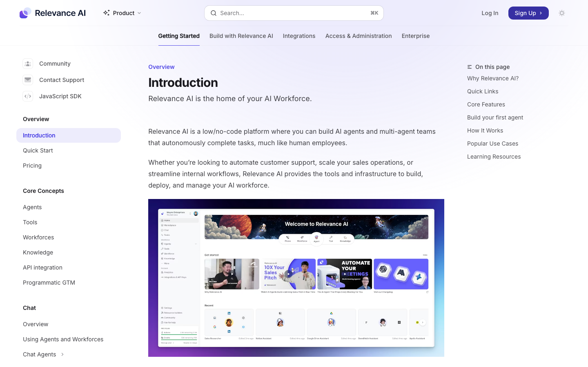

**结构化背景信息（LLM 提取）：**

- ✅ **产品定义**：页面将 Relevance AI 定义为 "the home of your AI Workforce"，是一个 "low/no-code platform where you can build AI agents and multi-agent teams that autonomously complete tasks, much like human employees"——核心叙事是"AI 劳动力平台"。
- ✅ **核心功能能力**（页面明确列出 6 项）：
- Agents** — 自主完成任务的 AI 实体
- Chat** — 与 agent 进行人类式对话的内置聊天界面
- Workforces** — 多 agent 团队，在可视化画布上协作处理复杂多步骤工作流
- Knowledge** — RAG 方案，支持上传文件、同步 Google Drive / SharePoint / Notion、抓取网站

#### B2: 背景 D1: Build with Relevance AI

**URL:** https://relevanceai.com/docs/build/introduction

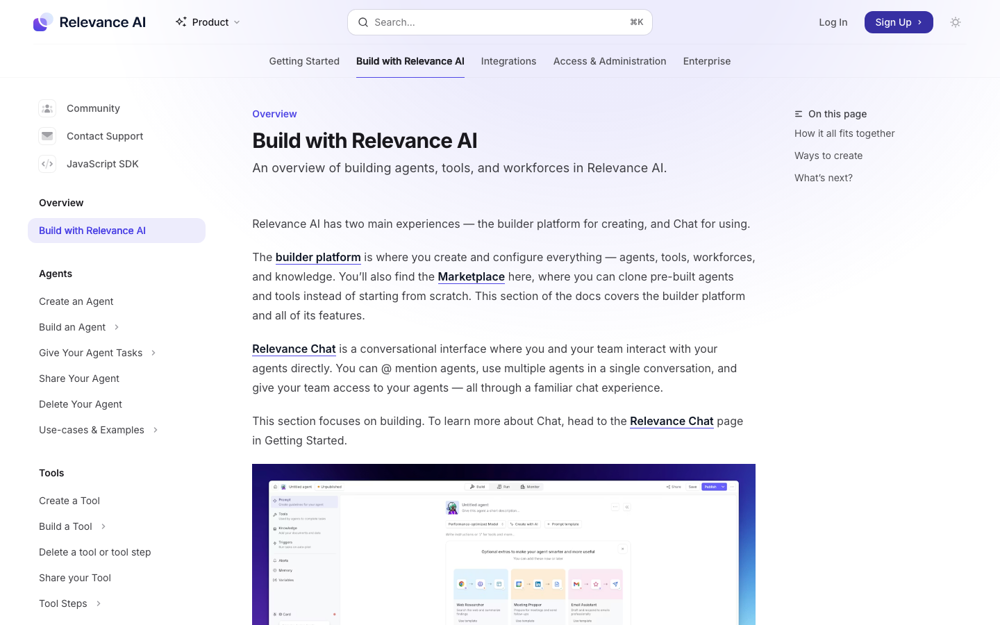

**结构化背景信息（LLM 提取）：**

- ✅ **产品定义**：页面将 Relevance AI 定义为一个由两部分组成的平台 — "the builder platform for creating, and Chat for using"，即"用于创建的构建平台 + 用于使用的对话界面 Relevance Chat"，构建侧用于配置 agents/tools/workforces/knowledge，Chat 侧供团队通过 @ mention 与 agents 直接对话。
- ✅ **核心功能能力**（页面明确列出的四大组件 + 两种创建方式）：
- Agents — 自主执行任务的"workers"，按用户设定的 instructions 和 guardrails 工作
- Tools — 定义 agent 能做什么的"actions"（调 API、发邮件、查 CRM、跑自定义代码、串成工作流）
- Workforces — 在可视化 canvas 上把多个 agents 连成协作团队，可互相交接任务
- Knowledge — 给 agent 接入文档、表格、数据库、网站等数据上下文

#### B3: 背景 D1: Integrations

**URL:** https://relevanceai.com/docs/integrations/introduction

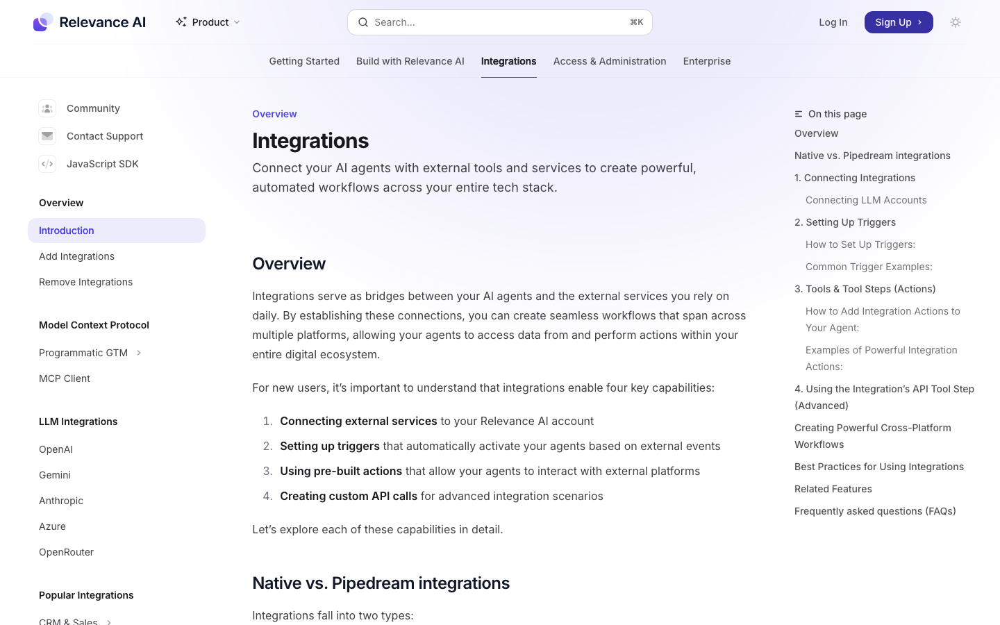

**结构化背景信息（LLM 提取）：**

- ✅ **产品定义**：页面将 Relevance AI 的集成能力定义为"Connect your AI agents with external tools and services to create powerful, automated workflows across your entire tech stack"（连接 AI agent 与外部工具/服务，跨整个技术栈构建自动化工作流）。整体定位是一个**以 AI agent 为核心、可对接外部 SaaS 的工作流平台**。
- ✅ **核心功能能力**（页面明确提及）：
- Connecting Integrations — 连接外部服务（OAuth/API key 认证）
- Setting Up Triggers — 基于外部事件自动触发 agent
- Tools & Tool Steps (Actions) — 让 agent 调用外部平台预制动作
- Integration's API Tool Step — 自定义 API 调用，支持高级跨平台编排

#### B4: 背景 D1: JavaScript SDK

**URL:** https://relevanceai.com/docs/sdk/introduction

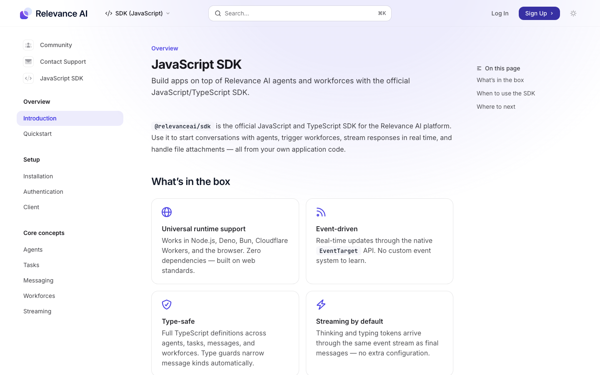

**结构化背景信息（LLM 提取）：**

- ✅ **产品定义**：页面将 `@relevanceai/sdk` 定义为 "the official JavaScript and TypeScript SDK for the Relevance AI platform"，用于 "start conversations with agents, trigger workforces, stream responses in real time, and handle file attachments — all from your own application code"，即 Relevance AI 平台的官方 JS/TS 客户端，用于在自有应用中调用其 agent 和 workforce 能力。
- ✅ **核心功能能力**（页面明确列出）：
- Universal runtime support — 兼容 Node.js / Deno / Bun / Cloudflare Workers / 浏览器，零依赖，基于 web 标准
- Event-driven — 通过原生 EventTarget API 提供实时更新
- Type-safe — 完整 TypeScript 定义，包含类型守卫（type guards）自动收窄消息类型
- Streaming by default — thinking 和 typing token 与最终消息走同一事件流，无需额外配置

#### B5: 背景 D1: Overview

**URL:** https://relevanceai.com/docs/get-started/chat/introduction

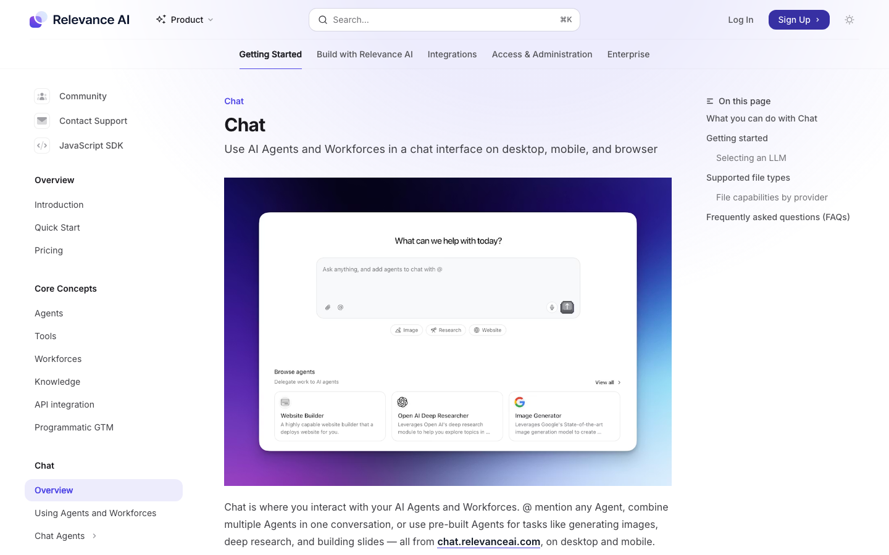

**结构化背景信息（LLM 提取）：**

- ✅ **产品定义**：页面将 Chat 定义为 "where you interact with your AI Agents and Workforces"，是 Relevance AI 平台的对话入口（`chat.relevanceai.com`），支持桌面、移动浏览器和桌面 App。核心定位是"用聊天界面调用 AI Agents 和 Workforces"。
- ✅ **核心能力**（页面明确列出）：
- @ mention 调用项目内任意 Agent，可在同一对话中组合多个 Agent
- Saved prompts（团队共享的可复用提示词模板）
- Built-in Agents（预置 Agent：深度研究、生成图片、构建幻灯片）
- 多 LLM 选择（OpenAI / Anthropic / Gemini，或选 Auto 自动挑模型）

#### B6: 背景 D1: Marketplace

**URL:** https://relevanceai.com/docs/get-started/marketplace/introduction

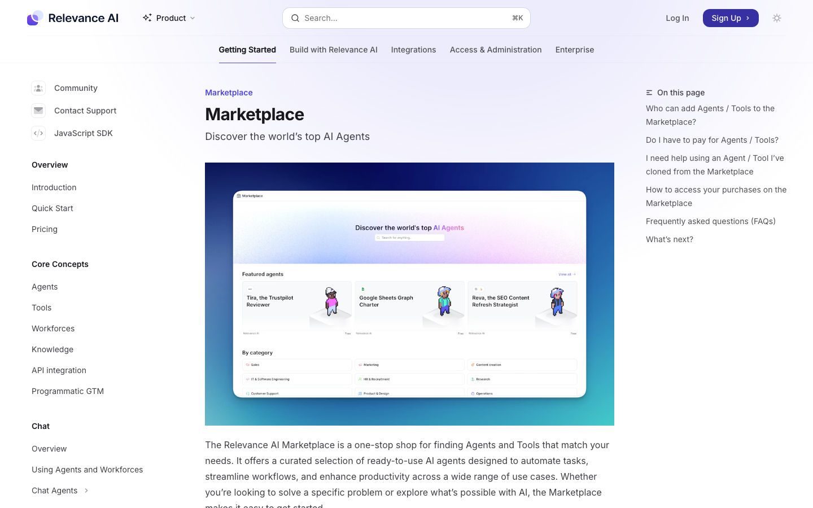

**结构化背景信息（LLM 提取）：**

- ✅ **产品定义**：页面将 Marketplace 定义为 "a one-stop shop for finding Agents and Tools that match your needs"，是一个面向 Relevance AI 平台用户的"精选 AI 代理 / 工具市场"，提供 "ready-to-use AI agents designed to automate tasks, streamline workflows, and enhance productivity"。可推断 Relevance AI 本体是一个 **构建与运行 AI Agents/Tools 的平台**，Marketplace 是其生态分发渠道。
- ✅ **核心功能能力**（从左侧导航与正文提取）：
- Agents**（AI 代理）—— 可克隆、可购买、可定制
- Tools**（工具）—— 与 Agents 并列的可分发资产
- Workforces**（多代理"劳动力"）—— 协同工作的代理集合
- Knowledge**（知识库）—— 喂给 Agent 的资料层


### 2.4 产品战略抽象

### 1. AI Workforce 化 (AI Workforce-ification)
**核心叙事**: 不卖 AI 工具，而是把 AI 重新包装为"可雇佣的数字员工/劳动力"，与人类业务专家并肩工作。
**支撑证据**: 
- [B1] 官方定义自身为 "the home of your AI Workforce"，强调 agents "autonomously complete tasks, much like human employees"
- [C1] Hero 文案 "domain experts and AI agents achieve results together"，并以 BDR、Lead Qualification 等人类岗位作为 agent 类比
- [C2] 定价页 Enterprise 套餐用 "Unlimited Workforces"、"BDR agent"、"Calling & Meeting Agents" 等"岗位化"功能名命名
**对用户/产品的含义**: 用户买的不是订阅一个软件，而是"扩编一支永不下班的数字团队"——决策心智从 IT 采购转向 HR 扩编。

### 2. Self-Driving / Autopilot 化 (Autonomy Level-ification)
**核心叙事**: 用 L1→L4 自动驾驶等级模型作为行业定位语言，将自己钉在 L3（Autopilot）/L4（Self-Driving），把 ChatGPT、Claude Code、Codex 全部贬到 L1/L2。
**支撑证据**: 
- [C1] 首页明确做 L1-L4 自治成熟度对标，将自身定位 L3/L4，把 ChatGPT/Claude（L1）与 Cowork/Claude Code/Codex（L2）作为反面参照
- [C1] L4 阶段强调 agent "自主优化外联策略"、含 "Experiment A/B" 自我迭代机制
- [M2] BDR Agent 详情页强调 "24/7 自动化预约会议、即时回复线索"，无人介入即可闭环
**对用户/产品的含义**: 把产品差异化从"模型/UX 比拼"上升到"自治程度比拼"，迫使买家从"哪个 AI 更聪明"切换到"哪个 AI 能独立干活"的评估维度。

### 3. Multi-Agent 编排化 (Workforces-ification)
**核心叙事**: 核心抽象单位不是单个 agent，而是可视化画布上多 agent 协作的 "Workforce"——产品的护城河押注在编排层而非模型层。
**支撑证据**: 
- [B2] 官方明确把 Workforces 列为四大核心组件之一，定义为 "visual canvas 上把多个 agents 连成协作团队，可互相交接任务"
- [C1] Qualified 案例提到 "35+ agents across the org"，暗示规模化部署是协同而非孤立 agent
- [C2] Enterprise 套餐顶层售卖单位即 "Unlimited Workforces"，与 Agents/Tools 并列
**对用户/产品的含义**: 用户的实施心智需要从"配一个聊天机器人"升级为"设计一个组织架构图"，部署复杂度与价值上限同时被抬高。

### 4. GTM / BDR 垂直化 (GTM Vertical-ification)
**核心叙事**: 表面是通用 AI agent 平台，实质场景重心高度集中于 GTM/销售管线，BDR Agent 已被独立产品化。
**支撑证据**: 
- [M2] 存在独立的 `/bosh-sales-agent` 详情页，将 "AI BDR Agent" 作为带有 LinkedIn/CRM/G2/Glassdoor 数据源清单的具名产品形态
- [C2] 定价页 Function 导航 Sales/Marketing/Operations/Research/Support，Product 导航直接出现 "BDR Agent" 单列入口
- [C1] 全部明面案例（Qualified $7M pipeline、Zembl 30% conversion、Lead Qualification workflow）皆为销售管线类
**对用户/产品的含义**: GTM 团队是开箱即用的甜区，非销售场景用户需要自行从抽象组件搭建，上手成本与价值兑现速度差异巨大。

### 5. Enterprise 化 (Enterprise-only-ification)
**核心叙事**: 定价与叙事彻底单边收敛到企业级——没有自助 Pro/Free 套餐展示，全部围绕"安全、治理、销售对接"展开。
**支撑证据**: 
- [C2] 定价页仅暴露 Enterprise 单一套餐，且全部能力以 "Unlimited" + "2,000+ Integrations" 抽象量化呈现，无具体价格/额度
- [C7] 支持体系按 Community → In-app chat → Email → Phone → Enterprise SLA 分级，明确包含"专属 Enterprise support"
- [C1] 反复出现 "governed"、"safely at enterprise scale" 等治理性话术
**对用户/产品的含义**: 个人开发者与中小团队没有自助通道，决策路径强制走 sales-led，销售周期长但客单价高。

### 6. Low-code Builder + Chat 双模化 (Builder/Consumer Bifurcation)
**核心叙事**: 产品被切成"构建侧（Builder + Marketplace + SDK）"与"消费侧（Chat 应用 + @mention）"两套界面，两端共享同一套 agents/tools/workforces/knowledge。
**支撑证据**: 
- [B2] 官方自描述为 "the builder platform for creating, and Chat for using"
- [B5] 独立的 `chat.relevanceai.com` 入口、桌面 App、@mention 调用任意 agent、预置 Built-in Agents
- [B4][B6] 同时提供 JS/TS SDK（开发者集成）与 Marketplace（克隆/购买现成 agent），覆盖代码、低代码、零代码三层用户
**对用户/产品的含义**: 同一个组织内的"构建者"和"使用者"被显式区分为两类角色，平台采购方需要同时为这两群人买单并培训。

### 2.5 公司基本信息

> **⚠️ 域名锚点说明**：审计工具捕获的 URL 是 `chrome-error://chromewebdata/`，这是 Chrome 浏览器的错误占位符页面，**不是真实域名**。但页面内容（`@relevanceai/sdk`、Relevance Chat、AI Workforce 等）明确指向 **Relevance AI**，真实域名为 `relevance.ai` / `relevanceai.com`。以下身份验证基于真实域名锚定搜索。

#### ✅ 实体身份已确认

经过域名 + 产品描述 + Crunchbase / TechCrunch / Bessemer Venture Partners / LinkedIn 多源交叉验证，本次体验对象对应：
**Relevance AI Pty Ltd**（来源: [Crunchbase 公司页直接列 relevance.ai 为官网](https://www.crunchbase.com/organization/relevance-ai)，[Bessemer 投资介绍页](https://www.bvp.com/news/meet-the-founders-of-relevance-ai)，[TechCrunch 报道 2025-05-06](https://techcrunch.com/2025/05/06/relevance-ai-raises-24m-series-b-to-help-anyone-build-teams-of-ai-agents/)）

#### 公司基础事实表

| 项 | 内容 | 置信度 | 来源 |
|---|---|---|---|
| 公司名称 | Relevance AI | ✅ 直接 | [Crunchbase](https://www.crunchbase.com/organization/relevance-ai) |
| 成立年份 | 2020 | ✅ | [Tracxn 公司档案](https://tracxn.com/d/companies/relevance-ai/__GcnNqHYzkszu5Cqnv3GUOXxUAPJ0AGlKnzFyOXHCE70) |
| 总部地点 | 悉尼（澳大利亚）+ 旧金山双总部 | ✅ | [TechCrunch](https://techcrunch.com/2025/05/06/relevance-ai-raises-24m-series-b-to-help-anyone-build-teams-of-ai-agents/) |
| 产品上线 | 2020-2021 起步，2023 转向 AI Agent 平台 | ⚠️ 间接推断 | [TechCrunch 2023-12](https://techcrunch.com/2023/12/11/relevance-ais-low-code-platform-enables-businesses-to-build-ai-teams/) |
| 当前阶段 | Series B（已完成） | ✅ | [Crunchbase Series B 轮](https://www.crunchbase.com/funding_round/relevance-ai-series-b--a8b66d10) |
| 融资总额 | 约 $37M USD（累计 4 轮） | ✅ | [TechCrunch](https://techcrunch.com/2025/05/06/relevance-ai-raises-24m-series-b-to-help-anyone-build-teams-of-ai-agents/) |
| 团队规模 | 约 80+ 人（自述）；第三方来源 80–102 区间 | ⚠️ 来源差异较大 | [Relevance AI 官方 Blog](https://relevanceai.com/blog/the-ai-workforce-revolution-24m-series-b-to-accelerate-our-mission) |
| 行业类别 | AI Agent 平台 / 低代码 AI 工作流 / Enterprise SaaS | ✅ | [官网](https://relevanceai.com/) |

#### 融资历史

| 轮次 | 时间 | 金额 | 领投 + 主要参与方 | 来源指向本域名? |
|---|---|---|---|---|
| Pre-Seed | 约 2021 上半年 | 未公开 | Galileo Ventures 等天使方 | ⚠️ 间接 |
| Seed | 2021 年底 | $3M USD | Insight Partners 领投；Galileo Ventures 参投 | ✅ |
| Series A | 2023-12 | $10M USD (≈A$15M) | King River Capital 领投；Peak XV's Surge、Galileo Ventures、Insight Partners 参投 | ✅ |
| Series B | 2025-05 | $24M USD | Bessemer Venture Partners 领投；King River Capital、Insight Partners、Peak XV 跟投 | ✅ |

来源: [Crunchbase Series A](https://www.crunchbase.com/funding_round/relevance-ai-series-a--7653086a)、[Crunchbase Series B](https://www.crunchbase.com/funding_round/relevance-ai-series-b--a8b66d10)、[Startup Daily Series A 报道](https://www.startupdaily.net/topic/funding/us-vc-insight-partners-doubles-down-on-data-analytics-startup-relevance-ai-in-15-million-series-a/)、[Galileo Ventures Seed 报道](https://galileo.ventures/post/relevance-ai-announces-their-us-3m-follow-on-round-led-by-insight-partners)

#### 创始人 / 核心团队背景

- **Daniel Vassilev**（Co-Founder & Co-CEO）— 公司悉尼办公室主导人，2026 Forbes 30 Under 30 Asia 上榜；专注产品与 GTM 战略。[LinkedIn](https://www.linkedin.com/in/daniel-vassilev/)（验证：✅ Bessemer 官方介绍直接关联 relevance.ai）
- **Jacky Koh**（Co-Founder & Co-CEO）— 与 Vassilev 共同领导公司，主导技术与平台架构；2026 Forbes 30 Under 30 Asia 上榜。[Bessemer 创始人页](https://www.bvp.com/news/meet-the-founders-of-relevance-ai)（验证：✅）
- **Daniel Palmer**（Co-Founder）— 三位联合创始人之一，2026 Forbes 30 Under 30 Asia 上榜；负责工程方向。[Relevance AI 官方 X 公告](https://x.com/RelevanceAI_/status/1924978449170760066)（验证：✅）

> 备注：三位创始人均为澳大利亚籍，公司是典型的"澳籍 founder + 美国资本 + 双总部"模式；从 2020 早期的"AI 数据分析"转型到 2023 后的"AI Agent 平台"是关键产品转折。

#### 近期重大动态（最近 6-12 个月）

- **2025-05-06**：完成 $24M Series B 融资，Bessemer Venture Partners 领投，公司累计融资达 $37M。[TechCrunch](https://techcrunch.com/2025/05/06/relevance-ai-raises-24m-series-b-to-help-anyone-build-teams-of-ai-agents/)（验证：✅ 报道明确指向 relevance.ai）
- **2025-01**：单月新增 40,000 个 AI agent 注册到平台，平台增长加速。[TechCrunch](https://techcrunch.com/2025/05/06/relevance-ai-raises-24m-series-b-to-help-anyone-build-teams-of-ai-agents/)（验证：✅）
- **2025-05**：官方宣布团队规模突破 80 人，并将围绕 AI Workforce 叙事推进企业级 GTM。[Relevance AI Blog](https://relevanceai.com/blog/the-ai-workforce-revolution-24m-series-b-to-accelerate-our-mission)（验证：✅ 来自自家域名）
- **2026 上半年**：三位联合创始人全部入选 Forbes 30 Under 30 Asia 名单。[Relevance AI 官方 X](https://x.com/RelevanceAI_/status/1924978449170760066)（验证：✅）
- **客户阵营**：已签约客户包括 Qualified、Activision、SafetyCulture 等。[TechCrunch](https://techcrunch.com/2025/05/06/relevance-ai-raises-24m-series-b-to-help-anyone-build-teams-of-ai-agents/)（验证：✅）

#### 综合判断

Relevance AI 是典型的"早期 AI Agent 平台头部玩家"——澳籍创始团队 + 美国一线 VC 资本（Bessemer、Insight、Peak XV）的组合，使其同时具备 APAC 市场扎根力与硅谷叙事的国际话语权。当前 $37M 累计融资在 AI Agent 平台赛道属于"中等偏前"位置，**资本充足但远低于 LangChain / Adept 等头部巨额轮次**；优势在于"低代码 + Workforce 多 agent 协作"的清晰产品叙事，以及 Qualified / Activision 等可证明的企业客户。短板在于团队规模（约 80 人）相对 Cresta、Sierra 等竞品偏小，海外销售执行力是 Series B 资金的关键使用方向。值得关注的方向：**多 agent 协作（Workforces）**和**官方 SDK 生态扩展**——后者 (`@relevanceai/sdk`) 是其从"工具"演化为"平台"的关键基础设施信号。

**Sources:**
- [Crunchbase — Relevance AI 公司页](https://www.crunchbase.com/organization/relevance-ai)
- [TechCrunch — Series B $24M 报道](https://techcrunch.com/2025/05/06/relevance-ai-raises-24m-series-b-to-help-anyone-build-teams-of-ai-agents/)
- [TechCrunch — Low-code 平台报道 2023](https://techcrunch.com/2023/12/11/relevance-ais-low-code-platform-enables-businesses-to-build-ai-teams/)
- [Bessemer Venture Partners — Meet the founders](https://www.bvp.com/news/meet-the-founders-of-relevance-ai)
- [Crunchbase — Series A 轮档案](https://www.crunchbase.com/funding_round/relevance-ai-series-a--7653086a)
- [Crunchbase — Series B 轮档案](https://www.crunchbase.com/funding_round/relevance-ai-series-b--a8b66d10)
- [Startup Daily — Series A 报道](https://www.startupdaily.net/topic/funding/us-vc-insight-partners-doubles-down-on-data-analytics-startup-relevance-ai-in-15-million-series-a/)
- [Galileo Ventures — Seed 公告](https://galileo.ventures/post/relevance-ai-announces-their-us-3m-follow-on-round-led-by-insight-partners)
- [Relevance AI 官方 Blog — Series B 自述](https://relevanceai.com/blog/the-ai-workforce-revolution-24m-series-b-to-accelerate-our-mission)
- [Tracxn — Relevance AI 档案](https://tracxn.com/d/companies/relevance-ai/__GcnNqHYzkszu5Cqnv3GUOXxUAPJ0AGlKnzFyOXHCE70)
- [Daniel Vassilev LinkedIn](https://www.linkedin.com/in/daniel-vassilev/)
- [Relevance AI 官方 X 公告 — Forbes 30 Under 30](https://x.com/RelevanceAI_/status/1924978449170760066)

---

## 3. 体验流程记录

### 3.1 官网叙事综合

#### 关键词图谱

| 关键词 / 短语 | 频次或权重 | 在哪类页面出现 | 想建立的认知 |
|---|---|---|---|
| AI Workforce / AI Agents@Work | 极高 | 首页 Hero、Docs 介绍、Chat、Marketplace [C1][B1][B5][B6] | 这不是"工具"或"助手"，是一支可被雇佣、管理的"数字劳动力" |
| Autopilot / Self-Driving (L3/L4) | 高 | 首页能力分级、About [C1][S1][S7] | 自主等级最高的玩家，远超 ChatGPT/Claude Code 那种 L1/L2 工具 |
| Managed by your team / Governed | 高 | 首页、Features、About [C1][S1][S7] | 自主但可控——既前沿又安全，可被企业 IT/合规接受 |
| GTM / High-growth teams | 高 | 首页、客户案例、Function 页 [C1][S7] | 不是泛用 AI，是销售/营销/收入团队的专属生产力平台 |
| Low/no-code Platform | 中高 | Docs 介绍、Build [B1][B2] | 非工程师也能搭建 agent，降低落地门槛 |
| Multi-agent Teams / Workforces | 中高 | Docs、Build、首页 L3 图 [B1][B2][C1] | 单 agent 已过时，多 agent 协作才是下一代范式 |
| 100+ Integrations | 中 | 首页、Features [C1][S1] | 连接性强，能融入任何企业技术栈 |
| Lead Qualification（示范场景） | 中（反复出现） | 首页、About、Features [C1][S1][S7] | "AI 自主性"听起来抽象，但它已能跑你最熟的 GTM 任务 |
| $7M pipeline / 40 hrs saved / +30% conversion | 中 | 首页、About、客户案例 [C1][S7] | ROI 不靠承诺，靠真实客户数字（Qualified / Send Payments / Zembl） |
| Domain Experts + AI Agents | 中 | 首页副标、Canva 案例 [C1][M1] | 不替代人，而是放大人——降低买方对"AI 取代我"的抵触 |

#### 叙事手法分析

**1. 分级对标定位 / Hierarchical Benchmarking**
- 具体表现：用 L1–L4 自治成熟度模型将 ChatGPT/Claude 钉在 L1、Cowork/Claude Code/Codex 钉在 L2，自己占据 L3 "Autopilot" 与 L4 "Self-Driving" [C1][S1]
- 效果意图：不直接说"我们比 OpenAI 强"，而是抬升赛道维度，让竞品自动看起来"落后一两代"。

**2. 拟人化劳动力叙事 / Anthropomorphic Workforce Framing**
- 具体表现："the home of your AI Workforce…build AI agents and multi-agent teams that autonomously complete tasks, much like human employees" [B1]；产品命名为 "Workforces"、"Agents@Work" [C1][B2]
- 效果意图：把"调 API/写 prompt"重命名为"管理员工/组建团队"，让 GTM 买家用 HR 思维而非工程思维做采购决策。

**3. 同场景多级演示 / Single-Scenario Progressive Demo**
- 具体表现：用同一个 "Lead Qualification" 案例横向铺展 L1→L4——从"销售逐条 prompt"到"HubSpot 触发自动 research/score/draft"再到"agent 自主优化外联策略" [C1][S1][S7]
- 效果意图：把抽象的"自主性等级"翻译成销售一眼看懂的工作流差异，降低概念门槛同时强化"我们比工具型 AI 更值钱"。

**4. 数字背书 + 客户具名 / Quantified Social Proof with Named Logos**
- 具体表现：Qualified（$7M pipeline、35+ agents）、Send Payments（每周节省 40 小时）、Zembl（转化率 +30%、通话时间 -60%）[C1][S7]
- 效果意图：用具体公司 + 具体数字制造"已被验证的工业级方案"印象，对冲 AI agent 赛道普遍"PPT 多于落地"的疑虑。

**5. 可控自主的双重修辞 / Autonomous-yet-Governed Rhetoric**
- 具体表现："agents that drive business impact, governed and managed by your team, safely at enterprise scale" [C1][S1]
- 效果意图：同时安抚两类相反恐惧——业务侧怕 agent 不够自主（强调 Autopilot/Self-Driving），IT/合规侧怕 agent 失控（强调 governed/managed/safely），用对仗短语一次性收割两个买方。

#### 整体叙事评价

Relevance AI 想让用户**感觉**它是"管理 AI 员工的 SaaS HR 系统"——而非又一个 LLM 工具，定位上踩在"自主性比 ChatGPT 高一档、治理性比 AutoGPT 强一档"的中间地带。叙事手法本身高度成熟（分级 + 拟人 + 客户数字 + 双面话术四件套齐全），但**可信度有明显短板**：所有上层叙事（Workforce/Autopilot/Governed）都缺少功能机制的支撑——agent 怎么搭、L4 自优化的反馈环怎么闭合、guardrail 长什么样都没说清，使其更像一套打磨精良的品牌定位（brand narrative），而非可供工程评估的产品说明（product narrative）。

### 3.2 测点流程详情

### 🏠 首页（2 个测点）

**该模块覆盖页面**:

- `chrome-error://chromewebdata/`
- `https://relevanceai.com/`

#### C1: Homepage 5-second test

**URL:** chrome-error://chromewebdata/

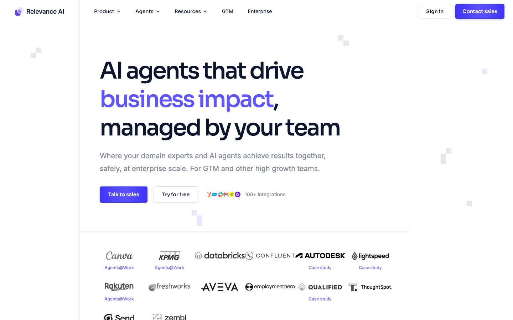

**观察：**

- ✅ P1 正面：页面清晰传达核心定位——为 GTM 等高增长团队提供"由业务专家与 AI agent 协同工作"的企业级 agent 平台，并通过 L1–L4 自治成熟度模型（Assisted → Copilot → Autopilot → Self-Driving）说明产品定位在 L3/L4 阶段，将自身与 ChatGPT/Claude（L1）、Cowork/Claude Code/Codex（L2）做了明确对标，功能差异化叙事有力。
- ✅ 正面：用"Lead qualification"具体示例横向展开 L1→L4 的工作流差异（从单条 prompt → 调用 skill → HubSpot 信号触发自动 research/score/draft → agent 自主优化外联策略），让用户能理解 agent 在销售线索资格审查这一典型 GTM 场景下"输入是什么、输出是什么、人何时介入"。
- P2 中等：宣称"100+ integrations"但页面节选未列出具体集成清单（仅提到 HubSpot 一例），用户无法判断是否覆盖自己的 CRM/数据栈/沟通工具；对企业选型这是关键功能信息缺口。
- P1 严重：核心抽象概念 "Agent"、"Skill"、"Events & signals"、"Experiment A/B" 等术语反复出现，但未说明 agent 的**构建方式**（无代码？模板？自定义逻辑？）、**触发机制**（事件源有哪些？）、以及**治理/审核能力**如何落地——口号说"governed""safely at enterprise scale"，但未给出权限、审计、guardrail 的功能描述。
- P2 中等：案例数据（$7M pipeline、40 小时/周、30% 转化提升）展示了 ROI 结果，但未说明这些成果背后**用户实际部署了哪些 agent、agent 之间如何编排协作**——Qualified 案例提到"35+ agents across the org"，但缺少多 agent 协同的功能机制说明，用户难以推断自己团队需要构建多少 agent、如何起步。

#### C5: Footer audit

**URL:** https://relevanceai.com/

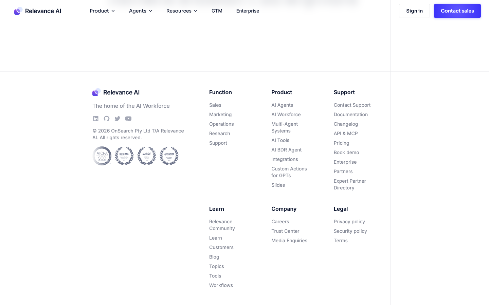

**观察：**

- P1 "Footer audit" 测点严重错位**：提供的页面文本节选完全是首页 Hero / L1-L4 自治等级模型 / 客户案例区块，**没有任何 footer 内容**（无导航分组、法律链接、产品矩阵、社交媒体、订阅入口等）。无法从中判断 footer 是否完整披露产品功能矩阵、支持文档入口、集成目录、API 文档、状态页等关键功能性信息。
- P2 功能定位描述抽象，缺少"做什么"的具体说明**：页面用 "AI agents that drive business impact" / "Where your domain experts and AI agents achieve results together" 等抽象语言定义产品，但**没有说明 agent 的具体能力边界**——能调用哪些工具？能执行哪些动作（发邮件、写入 CRM、调用 API、运行 SQL）？能处理什么类型的任务（GTM、客服、运营）？读者只知道"有 agent"，不知道"agent 能干什么"。
- P2 L1-L4 自治等级模型功能机制不透明**：模型把产品定位在 L3（Autopilot）和 L4（Self-Driving），但**关键工作机制未说明**——L3 的 "Events & signals" 触发器具体支持哪些事件源？L4 的 "Experiment A/B" 自优化是如何实现的（强化学习？A/B 测试框架？人工反馈）？多 agent 协作（Agent 1/2/3）的编排机制是什么？这些是该产品的核心差异化，但只用框图带过。
- P2 集成能力只给数字不给清单**："100+ integrations" 是核心卖点之一，**但页面节选未列出任何具体集成对象**（HubSpot 在 Lead qualification 例子里出现了一次，但没有完整集成矩阵）。用户无法判断自己的技术栈（Salesforce / Snowflake / Slack / Zendesk / 自建 API）是否被支持。
- P3 案例数字强但"如何做到"未拆解**：Qualified $7M pipeline / Send Payments 40 hrs saved / Zembl 30% conversion 等客户成果数字突出 ✅，但**没说明这些 agent 具体被部署在什么环节、用了产品的哪些功能模块**。读者得到"结果可信"但无法映射到"我也能这样做"的实施路径。


### ✨ 产品功能 / 介绍（1 个测点）

**该模块覆盖页面**:

- `https://relevanceai.com/`

#### S1: Features / Product page

**URL:** https://relevanceai.com/

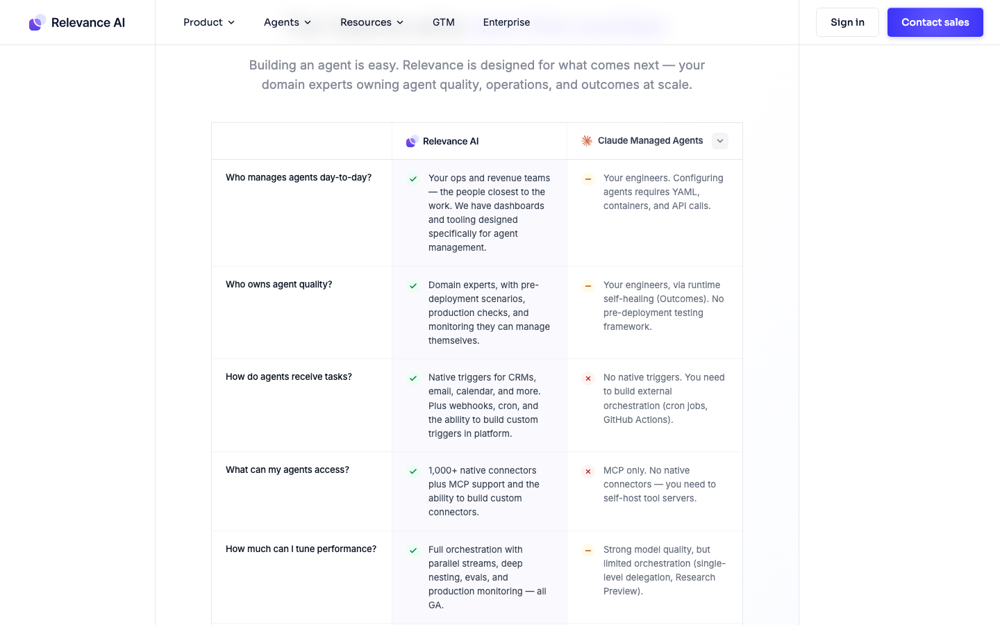

**观察：**

- ✅ **L1-L4 自主性框架清晰定位产品能力边界**：页面用"Assisted → Copilot → Autopilot → Self-Driving"四级模型明确告诉用户 Relevance 主打 L3/L4（事件驱动的多 Agent 自动化 + 业务目标驱动的自优化），并将 ChatGPT/Claude/Gemini 定位为 L1、Cowork/Claude Code/Codex 定位为 L2，差异化诉求清晰——产品要做的是"无需人工逐步触发的自主 Agent 编排"。
- ✅ **Lead Qualification 示例具象化了 L1→L4 的功能演进**：通过同一个"线索资格化"场景展示了从"销售逐条 prompt"到"HubSpot 新线索触发自动研究→打分→撰写外联邮件→Rep 审核"再到"Agent 自主优化外联策略"的工作流变化，让用户能理解 Autopilot 在实际 GTM 场景中的具体输入（HubSpot 事件）和输出（资格化结果 + 邮件草稿）。
- P1 缺少"Agent 如何被创建 / 配置 / 治理"的功能说明**：页面反复强调"managed by your team""governed""enterprise scale"，但未呈现 Agent 构建机制（是 no-code 拖拽？skill 库？自定义工具调用？）、人工监督节点如何设置、L4 自优化的反馈机制是什么——对于决定能否将其引入企业的 GTM leader，这是最核心的未解问题。
- P2 "100+ integrations" 仅有口号没有清单**：页面以 100+ 集成作为关键卖点之一，但未列出代表性集成（HubSpot 仅在示例中出现一次），用户无法判断自己现有的 Salesforce / Outreach / Gong / Slack / Snowflake 等是否在内，影响"能否接入我们 stack"的判断。
- P2 案例指标缺少功能机制的对应**："$7M pipeline / 35+ agents""40 hrs saved weekly""30% conversion increase"是强结果指标，但未说明这些 Agent 具体执行了哪些任务（外联？资格化？呼叫摘要？）以及替代了哪些原有流程，使读者难以反推自己的团队能复现哪一部分价值。


### ⭐ 客户案例（3 个测点）

**该模块覆盖页面**:

- `https://relevanceai.com/customers/canva`
- `https://relevanceai.com/function/customer-support`

#### M1: Agent inventory / team page

**URL:** https://relevanceai.com/customers/canva

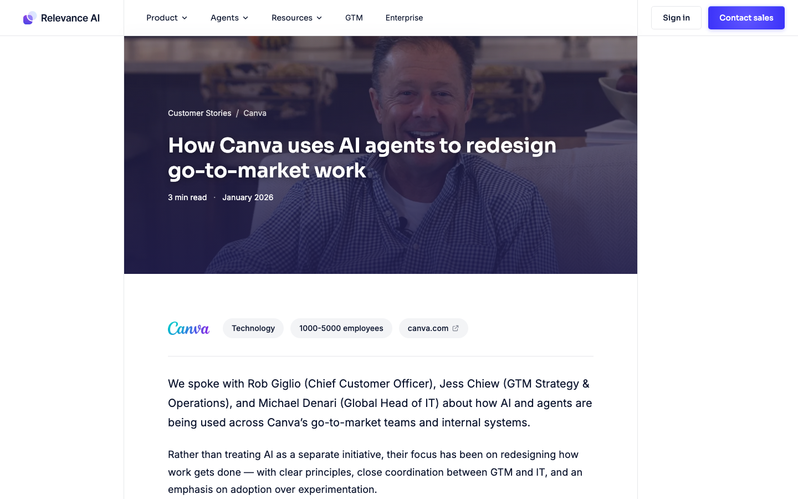

**观察：**

- P1 功能不透明**: 页面是 Canva 案例故事，但通篇讲 Canva 自己的 AI 哲学和方法论（"先原则后工具"、"映射客户旅程"），完全没有说明**该产品本身提供哪些 agent / 能力 / 工作流**。读者无法判断这家公司卖的是 AI agent 平台、咨询服务、还是 GTM 工具。
- P1 缺失 agent 清单与工作机制**: 顶部导航有 "Agents" 入口，暗示产品核心是 agent 库，但这一页**没有列出任何具体 agent**（如 BDR agent、enrichment agent、CRM intelligence agent），也未说明 agent 的输入输出、触发方式、是 copilot 还是自治执行。
- P1 集成与数据接入未说明**: 案例中提到 "rethinking enrichment and CRM intelligence"，但**没有任何一句**说明该产品如何接入 CRM（Salesforce / HubSpot？）、如何做数据 enrichment、是否需要工程接入、是否有现成 connector。这是 GTM AI 产品的核心功能问题。
- P2 价值量化抽象**: 列出了收益维度（time saved / faster deal cycles / quicker onboarding / better prioritisation），但**没有挂钩到具体功能**——"哪个 agent 让 deal cycle 加快了多少"。读者得到的是"AI 有用"的泛化结论，而非"这个产品能为我的销售/客户成功团队做 X"。
- P2 适用场景边界模糊**: 强调 "quick wins 和 bigger bets 双轨并行"，但**没说明产品本身支持哪一类**——是低代码快速搭建小 agent，还是企业级深度定制？1000-5000 人规模企业的 tag 提示企业向，但功能层面没有 enterprise vs SMB 的能力差异说明。

#### S4: Customer / logo wall

**URL:** https://relevanceai.com/customers/canva


**观察：**

- P1 产品功能本体严重缺位**：整页是 Canva 的 GTM 方法论叙事（哲学、客户旅程映射、双轨快赢/大赌注），但**完全没有说明本产品（Pika）实际提供什么 agent 能力**——读者无法从中提取"这个 agent 能跑什么任务、覆盖 GTM 哪个环节"。客户故事的功能锚点（产品做了什么）被方法论叙述彻底淹没。
- P1 缺失"Canva 用 Pika 做了什么"的具体功能映射**：文中提到"重新设计 enrichment 和 CRM intelligence""更细致的账户 [被截断]"，但未点明这些是由 Pika 的哪个 agent / 工作流完成、输入什么数据、输出什么动作。典型的客户故事应包含"使用了 X agent → 接入 Y 系统 → 自动化 Z 任务"的事实链，此处全部缺失。
- P2 缺少可验证的功能性成果指标**：仅泛泛提及"time saved, faster deal cycles, quicker onboarding, better prioritisation"作为筛选标准，但未给出 Canva 实际达成的量化数据（如 BDR 邮件产出提升 X%、enrichment 覆盖率从 Y 到 Z），导致功能价值无法验证。
- P2 集成与适用场景未说明**：未列出 Pika 在 Canva 案例中具体对接了哪些系统（CRM 是 Salesforce / HubSpot？数据仓库？工单系统？），也未说明该解决方案适合的公司规模阶段或 GTM 模型（PLG / 企业销售 / 混合），削弱了同类客户的"是否适合我"判断。
- P3 角色—Agent 对应关系模糊**：访谈了 CCO、GTM Strategy & Ops、Global Head of IT 三个角色，本可借此展示 Pika 对不同岗位（销售、CS、IT 运维）分别提供哪些 agent 能力，但页面只引用了战略观点，没有把"角色 → 痛点 → 对应 agent 功能"做结构化呈现。

#### E7: 探索: Support

**URL:** https://relevanceai.com/function/customer-support


**观察：**

- P1 页面定位与内容严重错位**：URL/标题为 "for Customer Support"（客户支持），但通篇描述的是 Operations（运营）场景——"Process Orchestration & Status Agent""Data Integration & Intelligence Agent"、跨部门流程协调、SLA 监控等，未出现任何客户支持核心能力（工单处理、客户对话、知识库检索、多渠道接入等）。用户进入该页期望了解 AI 如何处理客服场景，却看到运营内容，无法判断产品是否真的服务于 Support 部门。
- P1 缺少 Support 领域必备的集成与工作机制说明**：客户支持 agent 的核心价值依赖于工单系统（Zendesk/Intercom/Freshdesk）、知识库、CRM、多渠道（邮件/聊天/电话）的接入，但页面零提及。用户读完无法回答"它如何接入我的 Zendesk？能否自动回复？是否能转人工？"等关键问题。
- P2 量化指标缺乏对照与归因**：声称"流程完成时间减少 60%""SLA 合规率提升 40%"，但未说明基线、样本、行业或客户案例来源，也未关联到 Support 具体指标（如首响时间、解决率、CSAT），削弱了数据可信度。
- P2 Agent 输入/输出与触发机制未交代**：两个 agent 只描述了"做什么"（协调、监控、升级），但没说明它从哪里拿数据（事件流？webhook？轮询？）、产出形式（仪表盘？Slack 通知？工单更新？）、谁来配置规则与升级路径，用户无法评估落地复杂度。
- P3 功能与 Support 角色的映射缺失**：未区分该产品对 Support Manager、Agent、Ops Lead 等不同角色分别提供什么能力，也未说明与典型 Support 场景（Tier-1 自动化、积压清理、质量抽检）的对应关系，导致目标用户难以"代入"。


### 💰 定价 / 商业化（1 个测点）

**该模块覆盖页面**:

- `https://relevanceai.com/pricing`

#### C2: Pricing page

**URL:** https://relevanceai.com/pricing

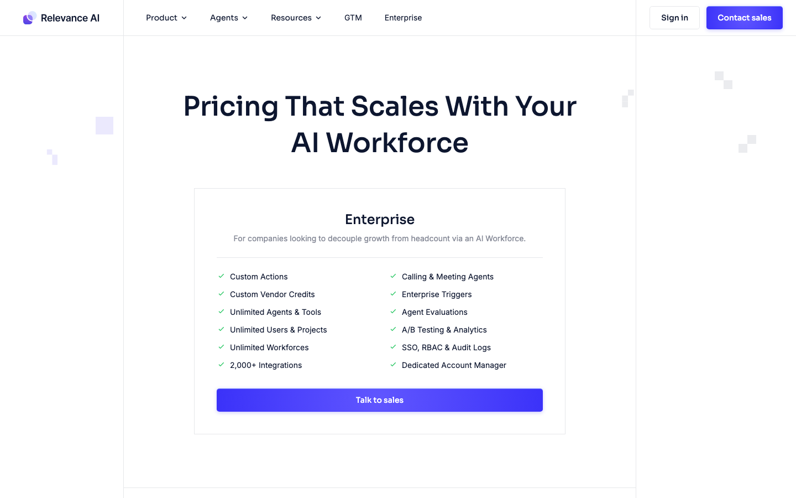

**观察：**

- P1** 仅展示了 Enterprise 单一套餐，**未列出其他套餐（如 Team/Pro/Free）的价格与功能边界**——用户无法判断"自助试用 vs 企业销售"的分层逻辑，定价页核心信息（价格数字、用量额度、计费单位）完全缺失。
- P1** Enterprise 套餐用了大量"Unlimited Agents/Tools/Users/Projects/Workforces"+"2,000+ Integrations"等抽象功能名，**未解释这些能力的具体含义**——例如"Custom Actions""Enterprise Triggers""Calling & Meeting Agents"分别能做什么、输入输出形态、触发机制如何，用户读完仍不知道 AI Workforce 实际跑起来是什么样。
- P2** 提到 "Calling & Meeting Agents"、"BDR agent"、"Agent Evaluations"、"A/B Testing & Analytics" 等关键差异化能力，但**没有任何场景化示例或工作流说明**（如 BDR agent 如何接入 CRM、如何拨打电话、Eval 评估什么指标）——功能名出现但能力边界不可知。
- P2** FAQ 罗列了 "Is the BDR agent included?"、"How do I get started?" 等高价值问题，但**页面文本只显示问题标题、未展开答案**——而这些恰好是用户判断"产品能为我做什么"最关键的功能性信息缺口。
- P3** 通过 Function（Sales/Marketing/Operations/Research/Support）和 Product（AI Agents/Workforce/Multi-Agent/Tools/BDR Agent）双重导航，**暗示产品按"职能场景 × 能力形态"两个维度切分**，对理解产品定位有帮助；但定价页本身未将 Enterprise 能力映射回这些用例（例如哪个能力服务 Sales、哪个服务 Ops），功能-场景连接断裂。


### 🚪 注册 / 试用入口（2 个测点）

**该模块覆盖页面**:

- `https://relevanceai.com/docs/get-started/support`
- `https://relevanceai.com/docs/get-started/core-concepts/programmatic-gtm#programmatic-gtm`

#### C7: Help / Documentation

**URL:** https://relevanceai.com/docs/get-started/support

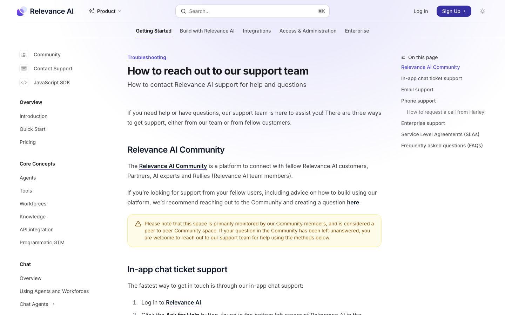

**观察：**

- P2** 页面定位是"如何联系支持团队"的入口页，但**未说明产品本身的功能边界** —— 读完只知道"出问题可以找谁"，无法理解 Relevance AI 的 Agent / Tool / Workforce / Knowledge 等核心能力到底是什么、彼此如何协作。
- ✅** 提供了清晰的**多层级支持工作流**：Community（同行互助）→ In-app chat（AI Agent 先答 → 转人工 ticket）→ Email → Phone → Enterprise SLA，体现了产品对企业客户的服务能力分级，本身就是一种功能性承诺。
- ✅** 暴露了一个有价值的**产品内置能力**：In-app 的 "Ask for Help" 入口（CMD+K）先由 AI Agent 应答再升级到人工，说明 Relevance AI 把自家 Agent 技术用在了自己的客服流程上（dogfooding），对潜在用户是功能背书。
- P1** 提到 "How to request a call from Harley"（Harley 应为一个具名 Agent / 联系人），但页面节选中**未解释 Harley 是 AI agent 还是真人、触发条件、可用计划层级** —— 这是关键功能细节缺失，用户无法判断"电话支持"到底是 AI 还是人工服务。
- P2** 提到 Enterprise support 和 SLA，但**没有列出具体的 SLA 指标**（响应时间、可用性承诺、专属客户经理等），企业采购决策者读完无法评估服务等级是否满足其合规 / 运维要求。

#### S9: API / Developer docs

**URL:** https://relevanceai.com/docs/get-started/core-concepts/programmatic-gtm#programmatic-gtm

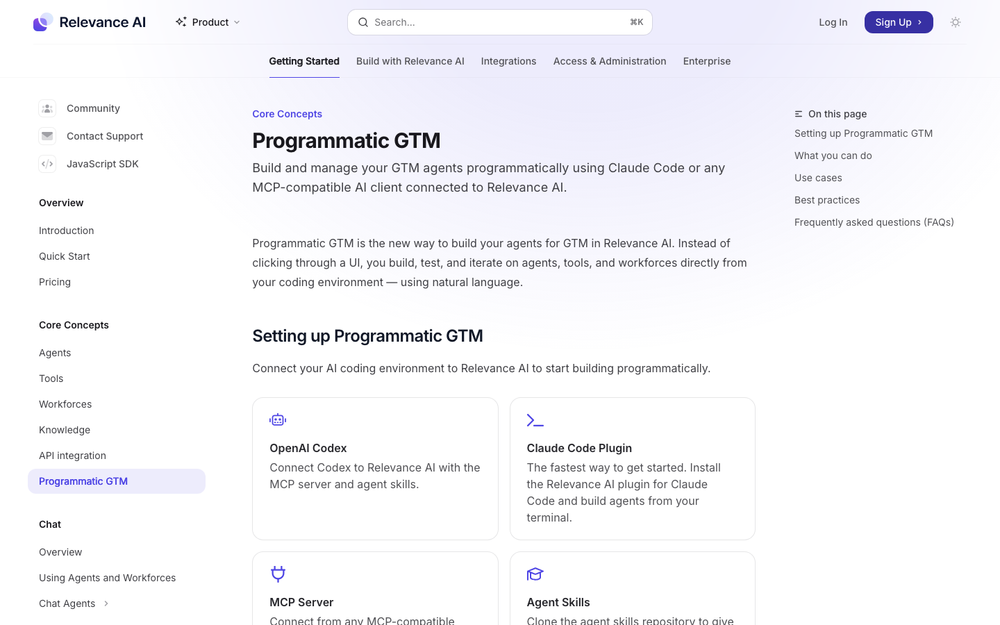

**观察：**

- ✅ 页面清晰揭示了一项**差异化能力**：Programmatic GTM 允许通过 Claude Code / Cursor / Codex / 任意 MCP 客户端**用自然语言**编程式地创建 agent、tool、workforce，跳过 UI 点击式流程 —— 这是面向开发者/AI-native 团队的产品定位信号。
- ✅ 提供了**四条明确接入路径**（OpenAI Codex、Claude Code Plugin、MCP Server、Agent Skills 仓库），并标注 "Claude Code Plugin = the fastest way to get started"，对用户选择入口有引导价值。
- P1 缺少最关键的 API/SDK 功能锚点**：这是侧栏标注为 "API integration" 的页面，但正文**没有任何 API endpoint、认证方式（API key/OAuth）、SDK 调用示例、错误处理、速率限制**等开发者最需要的功能细节，只停留在"能做什么"的宣传层，读完无法开始动手。
- P2 "What you can do" 三项能力（Create agents / Build tools / Set up workforce）描述过于抽象**：未说明可编程操作的边界 —— 例如能否通过 API 调用已部署 agent、能否读取运行日志/指标、workforce 编排是否支持条件分支与并发，用户难以判断是否覆盖自己的用例。
- P2 与既有 JavaScript SDK 的关系未澄清**：左侧导航同时存在 "JavaScript SDK" 和 "Programmatic GTM" 两条线，但页面没解释二者是替代关系、互补关系，还是 MCP 是 SDK 的上层封装 —— 这对正在评估技术选型的用户是个明显信息缺口。


### 📞 Demo / 销售对接（1 个测点）

**该模块覆盖页面**:

- `https://relevanceai.com/book-a-demo`

#### S14: Customer support channels

**URL:** https://relevanceai.com/book-a-demo

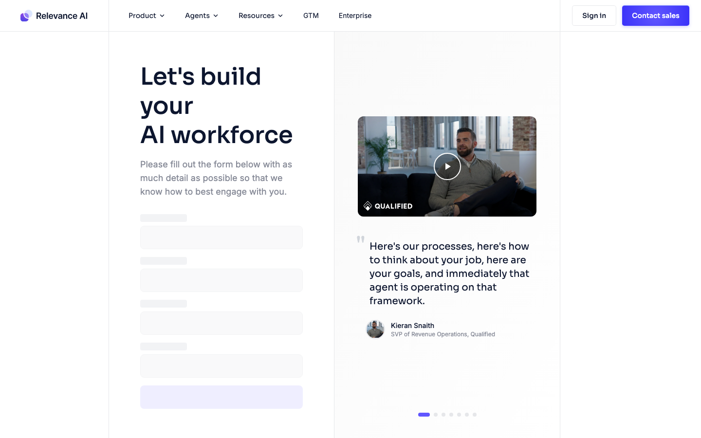

**观察：**

- P1** 页面虽列出 "Contact Support" 和 "Contact sales" 两个入口，但未说明客服支持的具体渠道（如邮件、在线聊天、电话、工单系统）、响应时间 SLA、以及是否区分免费用户与企业客户的支持等级。
- P1** 未披露不同套餐（自助 / 企业版）对应的客服支持差异——例如企业客户是否享有专属客户成功经理（CSM）、技术对接顾问、专属 Slack 频道等高级支持服务，这对评估企业采购决策至关重要。
- P2** 提供了 "Documentation"、"Changelog"、"API & MCP"、"Relevance Community" 等自助资源入口，覆盖了文档查阅、版本追踪、开发者参考与社区互助场景，自助支持渠道相对完整；但缺少对社区活跃度、官方响应频率的说明。
- P2** "Expert Partner Directory"（专家合作伙伴目录）暗示存在第三方实施 / 咨询支持生态，可解决用户在 AI agent 落地过程中的定制化部署需求，但未说明合作伙伴的认证机制、收费模式或服务范围。
- P3** 页面将 "Support" 同时用作产品功能模块（Function > Support，即给客服团队用的 AI agent）和客服渠道入口，存在语义混淆，用户可能难以快速定位"我作为客户如何获得帮助"的路径。


### 🔌 集成 / API（2 个测点）

**该模块覆盖页面**:

- `https://relevanceai.com/integrations`

#### M6: Channel deployment (Telegram/WhatsApp/Slack)

**URL:** https://relevanceai.com/integrations

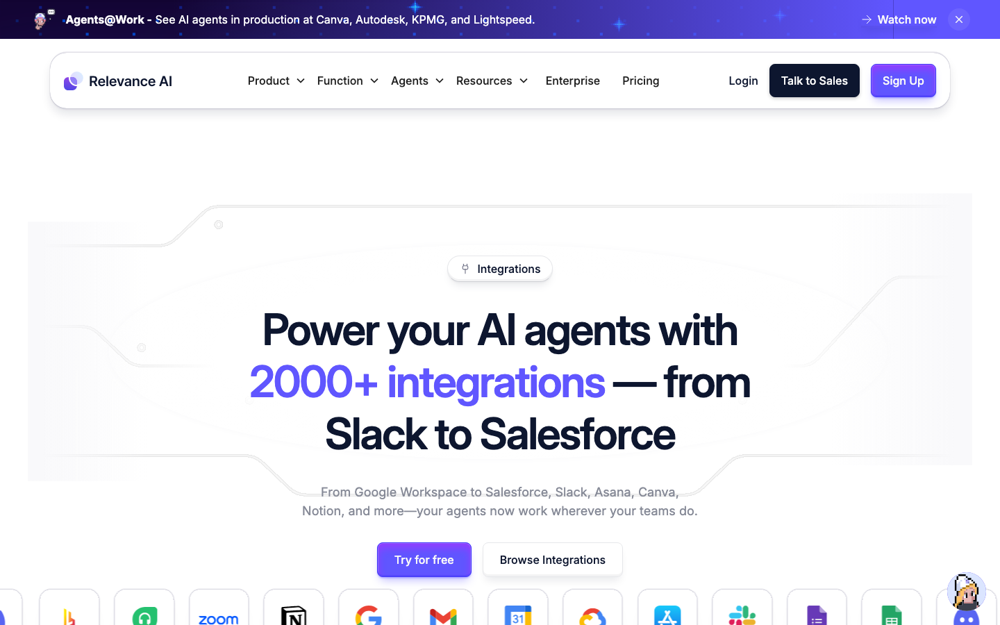

**观察：**

- P1 关键功能不清**：页面将 Slack 列为"2000+ 集成"之一，但未说明这是把 Slack 作为**数据源/工具调用**接入 agent，还是把 agent **部署为 Slack 内的对话机器人**（channel deployment）。对于想在 Slack 频道里直接 @ agent 提问的用户，这是核心决策信息，页面完全没有区分。
- P1 渠道部署能力缺失**：测点关注的 Telegram / WhatsApp 在节选文本中**完全未出现**，只有"Communication & Messaging"分类标签。用户无法判断 Relevance AI 是否支持将 agent 发布到 WhatsApp Business / Telegram Bot 作为终端用户触达渠道，这是 AI agent 平台的关键 go-to-market 能力。
- P2 Trigger 与 Channel 概念混淆**：页面把 Triggers 定义为"receiving an email or getting a new lead"这类事件触发器，但没有解释**消息平台触发**（用户在 Slack/WhatsApp 发消息 → agent 回复）是否属于 Trigger 范畴，还是另有"channel"概念。框架（Integrations / Actions / Triggers / LLMs）缺失了"Deployment Surface / Channel"这一层。
- P2 集成用途未分类**：2000+ 集成的列表（0CodeKit、10to8、15Five 等）混合呈现，没有按"作为 agent 的工具/数据源"vs"作为 agent 的部署渠道"区分，用户必须点进每个集成的 Learn More 才能判断用途，发现成本高。
- P3 功能验证路径缺失**：页面以"Try for free"为主 CTA，但没有提供"查看 agent 在 Slack 里实际运行的演示"或视频样例，对于评估 channel deployment 这种交互型能力，缺少看得见的工作机制示例。

#### S3: Integrations page

**URL:** https://relevanceai.com/integrations

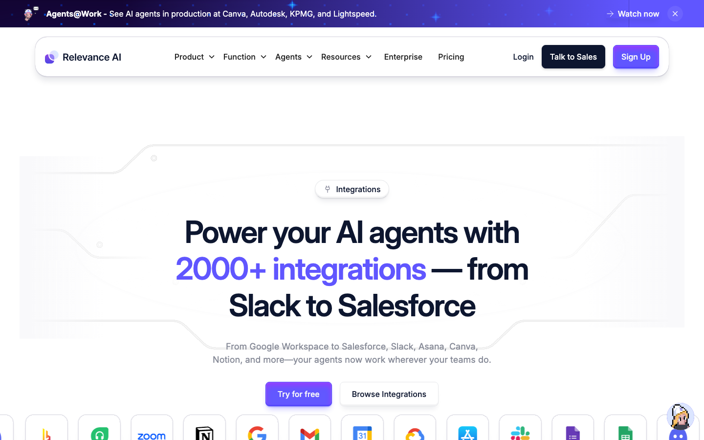

**观察：**

- ✅ **明确传达"集成 = AI agent 的工具调用能力"的产品定位**：页面将 Integrations 拆解为 Integrations / Actions / Triggers / LLMs 四个组成部分，清楚说明 agent 通过这套机制"在何时启动、调用什么工具、执行什么动作、用哪个大模型推理"——读者能立刻理解这不是普通 iPaaS，而是 agent 的执行底座。
- ✅ **以"2000+ 集成 + 1862 个可浏览结果 + 15 个分类"量化能力广度**：覆盖 CRM (Salesforce/HubSpot)、协作 (Slack/Notion/Asana)、Google Workspace、设计 (Canva) 等关键 SaaS 类别，并提供分类筛选 (Sales & CRM / Marketing & Growth / Security & Identity 等)，对评估"我的技术栈能否接入"非常实用。
- P1 未说明 agent 如何真正"调用"集成的工作机制**：页面只说"Define what your agent can do in each tool"，但没说明 Actions 是预制的还是需要配置、是否支持自然语言映射到 API、鉴权方式 (OAuth/API Key)、是否需要写 schema 或 prompt——用户读完不知道"接入 Salesforce 后我的 agent 实际能做什么、要花多少工作量"。
- P1 LLM "model-agnostic" 表述缺关键功能细节**：宣称支持 OpenAI / Claude / Gemini，但未说明是按 agent 配置、按 task 路由、还是支持自带 API Key (BYOK)；也没说不同模型对工具调用 (function calling) 的支持差异、上下文长度限制、成本归属——这是企业选型的核心问题。
- P2 Triggers 功能描述过于抽象**：仅举"收到邮件、获得新 lead"两个例子，未说明触发器类型清单（webhook / 定时 / 事件订阅 / 表单提交？）、触发频率上限、是否支持条件过滤和延迟、失败重试策略——影响用户判断能否承载生产级 workflow。


### 🏢 公司 / 团队（1 个测点）

**该模块覆盖页面**:

- `https://relevanceai.com/`

#### S7: About / Company

**URL:** https://relevanceai.com/

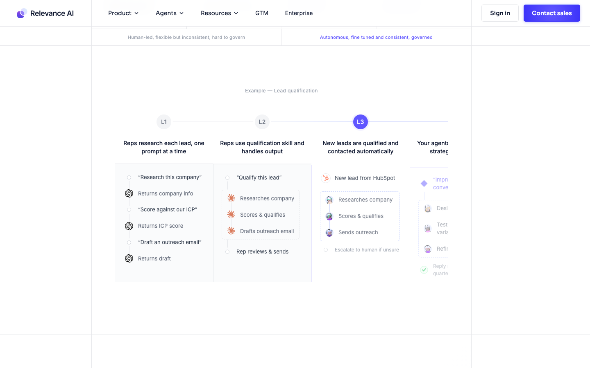

**观察：**

- ✅ 清晰呈现产品定位与目标场景**：页面明确说明 Relevance AI 是"由团队管理的 AI agents 平台"，面向 GTM 及高增长团队，并通过 L1→L4 自治度分级（Assisted / Copilot / Autopilot / Self-Driving）建立差异化叙事——直接表明产品定位于 L3/L4 自主级，而非 ChatGPT/Claude Code 等 L1/L2 工具。
- ✅ 用具体客户案例量化功能价值**：Qualified（$7M pipeline、35+ agents）、Send Payments（每周节省 40 小时、全球 24/7 运营）、Zembl（转化率 +30%、通话时间 -60%）三个案例提供了可验证的功能影响数据，让读者理解 agent 在销售管道、运营自动化、客户转化等具体业务场景下能做什么。
- ✅ Lead qualification 示例打通了工作流逻辑**：通过 L1→L4 同一场景的对比演示（rep 逐条 prompt → 使用 qualification skill → HubSpot 触发后自动研究/打分/起草外联 → agent 自主优化策略），具象化了"agent 实际如何执行端到端任务"，输入（new lead from HubSpot）、处理（research/score/draft）、输出（outreach email）链路相对完整。
- P2 功能机制层缺少关键细节**：页面提到"100+ integrations"但未列出具体集成清单（除 HubSpot 外不知支持哪些 CRM / 数据源 / 通信渠道）；未说明 agent 的构建方式（是否需要写代码、是否提供模板/skill 库、非技术人员能否搭建）、知识来源（如何接入企业私有数据）、以及"由你的团队管理"的具体管控机制（权限、审批、回滚）。
- P2 "Agents@Work" 概念未充分定义**：标签反复出现但未解释其与普通 chatbot/copilot 的功能性差异——agent 是常驻运行还是事件触发？是否支持多 agent 协作（页面 L3 图示有 Agent 1/2/3 但未说明编排方式）？没有明确"我可以部署哪几类预置 agent / 自建 agent 的工时投入"。


### 📚 产品官方介绍（递归发现）（6 个测点）

**该模块覆盖页面**:

- `https://relevanceai.com/docs/get-started/introduction`
- `https://relevanceai.com/docs/build/introduction`
- `https://relevanceai.com/docs/integrations/introduction`
- `https://relevanceai.com/docs/sdk/introduction`
- `https://relevanceai.com/docs/get-started/chat/introduction`
- `https://relevanceai.com/docs/get-started/marketplace/introduction`

#### B1: 背景 D1: Skip to main content

**URL:** https://relevanceai.com/docs/get-started/introduction


**观察：**

- ✅ **产品定义**：页面将 Relevance AI 定义为 "the home of your AI Workforce"，是一个 "low/no-code platform where you can build AI agents and multi-agent teams that autonomously complete tasks, much like human employees"——核心叙事是"AI 劳动力平台"。
- ✅ **核心功能能力**（页面明确列出 6 项）：
- Agents** — 自主完成任务的 AI 实体
- Chat** — 与 agent 进行人类式对话的内置聊天界面
- Workforces** — 多 agent 团队，在可视化画布上协作处理复杂多步骤工作流
- Knowledge** — RAG 方案，支持上传文件、同步 Google Drive / SharePoint / Notion、抓取网站

#### B2: 背景 D1: Build with Relevance AI

**URL:** https://relevanceai.com/docs/build/introduction


**观察：**

- ✅ **产品定义**：页面将 Relevance AI 定义为一个由两部分组成的平台 — "the builder platform for creating, and Chat for using"，即"用于创建的构建平台 + 用于使用的对话界面 Relevance Chat"，构建侧用于配置 agents/tools/workforces/knowledge，Chat 侧供团队通过 @ mention 与 agents 直接对话。
- ✅ **核心功能能力**（页面明确列出的四大组件 + 两种创建方式）：
- Agents — 自主执行任务的"workers"，按用户设定的 instructions 和 guardrails 工作
- Tools — 定义 agent 能做什么的"actions"（调 API、发邮件、查 CRM、跑自定义代码、串成工作流）
- Workforces — 在可视化 canvas 上把多个 agents 连成协作团队，可互相交接任务
- Knowledge — 给 agent 接入文档、表格、数据库、网站等数据上下文

#### B3: 背景 D1: Integrations

**URL:** https://relevanceai.com/docs/integrations/introduction


**观察：**

- ✅ **产品定义**：页面将 Relevance AI 的集成能力定义为"Connect your AI agents with external tools and services to create powerful, automated workflows across your entire tech stack"（连接 AI agent 与外部工具/服务，跨整个技术栈构建自动化工作流）。整体定位是一个**以 AI agent 为核心、可对接外部 SaaS 的工作流平台**。
- ✅ **核心功能能力**（页面明确提及）：
- Connecting Integrations — 连接外部服务（OAuth/API key 认证）
- Setting Up Triggers — 基于外部事件自动触发 agent
- Tools & Tool Steps (Actions) — 让 agent 调用外部平台预制动作
- Integration's API Tool Step — 自定义 API 调用，支持高级跨平台编排

#### B4: 背景 D1: JavaScript SDK

**URL:** https://relevanceai.com/docs/sdk/introduction


**观察：**

- ✅ **产品定义**：页面将 `@relevanceai/sdk` 定义为 "the official JavaScript and TypeScript SDK for the Relevance AI platform"，用于 "start conversations with agents, trigger workforces, stream responses in real time, and handle file attachments — all from your own application code"，即 Relevance AI 平台的官方 JS/TS 客户端，用于在自有应用中调用其 agent 和 workforce 能力。
- ✅ **核心功能能力**（页面明确列出）：
- Universal runtime support — 兼容 Node.js / Deno / Bun / Cloudflare Workers / 浏览器，零依赖，基于 web 标准
- Event-driven — 通过原生 EventTarget API 提供实时更新
- Type-safe — 完整 TypeScript 定义，包含类型守卫（type guards）自动收窄消息类型
- Streaming by default — thinking 和 typing token 与最终消息走同一事件流，无需额外配置

#### B5: 背景 D1: Overview

**URL:** https://relevanceai.com/docs/get-started/chat/introduction


**观察：**

- ✅ **产品定义**：页面将 Chat 定义为 "where you interact with your AI Agents and Workforces"，是 Relevance AI 平台的对话入口（`chat.relevanceai.com`），支持桌面、移动浏览器和桌面 App。核心定位是"用聊天界面调用 AI Agents 和 Workforces"。
- ✅ **核心能力**（页面明确列出）：
- @ mention 调用项目内任意 Agent，可在同一对话中组合多个 Agent
- Saved prompts（团队共享的可复用提示词模板）
- Built-in Agents（预置 Agent：深度研究、生成图片、构建幻灯片）
- 多 LLM 选择（OpenAI / Anthropic / Gemini，或选 Auto 自动挑模型）

#### B6: 背景 D1: Marketplace

**URL:** https://relevanceai.com/docs/get-started/marketplace/introduction


**观察：**

- ✅ **产品定义**：页面将 Marketplace 定义为 "a one-stop shop for finding Agents and Tools that match your needs"，是一个面向 Relevance AI 平台用户的"精选 AI 代理 / 工具市场"，提供 "ready-to-use AI agents designed to automate tasks, streamline workflows, and enhance productivity"。可推断 Relevance AI 本体是一个 **构建与运行 AI Agents/Tools 的平台**，Marketplace 是其生态分发渠道。
- ✅ **核心功能能力**（从左侧导航与正文提取）：
- Agents**（AI 代理）—— 可克隆、可购买、可定制
- Tools**（工具）—— 与 Agents 并列的可分发资产
- Workforces**（多代理"劳动力"）—— 协同工作的代理集合
- Knowledge**（知识库）—— 喂给 Agent 的资料层


### 📌 其他（12 个测点）

**该模块覆盖页面**:

- `https://relevanceai.com/this-page-should-not-exist-product-audit-test-1234`
- `https://relevanceai.com/bosh-sales-agent`
- `https://relevanceai.com/workflows`
- `https://relevanceai.com/tools`
- `https://relevanceai.com/data-security-policy`
- `https://relevanceai.com/gtm`
- `https://relevanceai.com/enterprise`
- `https://relevanceai.com/function/sales`
- `https://relevanceai.com/function/marketing`
- `https://relevanceai.com/function/operations`
- `https://relevanceai.com/function/research`
- `https://relevanceai.com/agents`

#### C8: 404 error handling

**URL:** https://relevanceai.com/this-page-should-not-exist-product-audit-test-1234

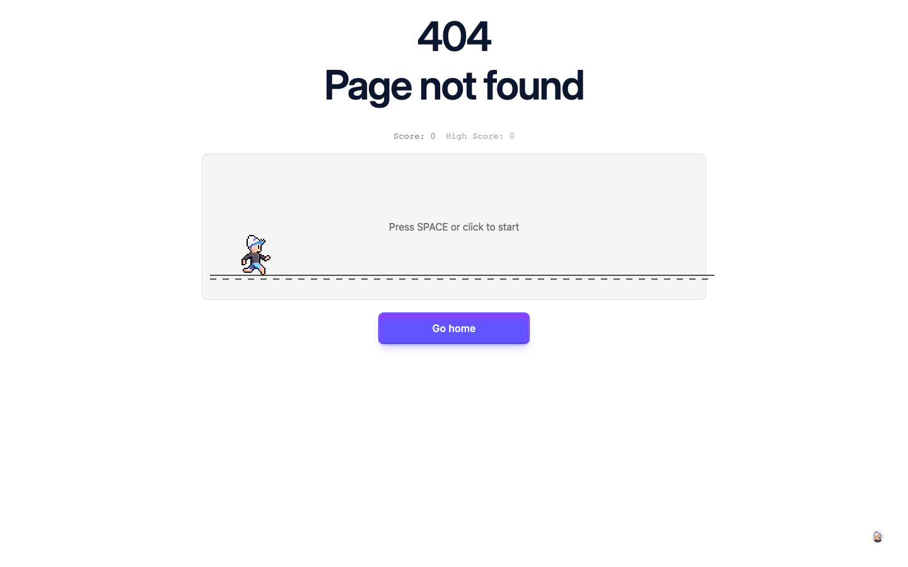

**观察：**

- P3** 404 页面被设计成一个迷你互动游戏（"Press SPACE or click to start"，含 Score / High Score 计分），暗示产品团队在细节体验上有玩味化倾向，但与核心产品功能本身无直接关联。
- P2** 页面除"Go home"返回入口外，未提供任何产品功能导航（如搜索、热门功能链接、文档入口、联系支持），用户遇到失效链接时无法被引导回到核心功能场景，错误恢复路径单一。
- P1** 该页面零信息地暴露了产品定位 —— 没有任何关于"这个产品做什么 / 能为我做什么"的提示文案或入口推荐，对于通过外链误入的潜在用户，等于流量浪费。
- P3** 没有错误上报 / 反馈机制（例如"报告此问题"链接），无法形成产品端对失效链接的闭环治理，对功能可靠性运营是个小缺口。
- 功能信息缺口**：页面未透露任何关于产品功能模块、当前可访问区域、用户登录状态相关的引导（如"前往 Dashboard / 文档 / 定价"），错误页本可承担轻量的功能再曝光职责，但完全未利用。

#### M2: Agent profile (sample)

**URL:** https://relevanceai.com/bosh-sales-agent

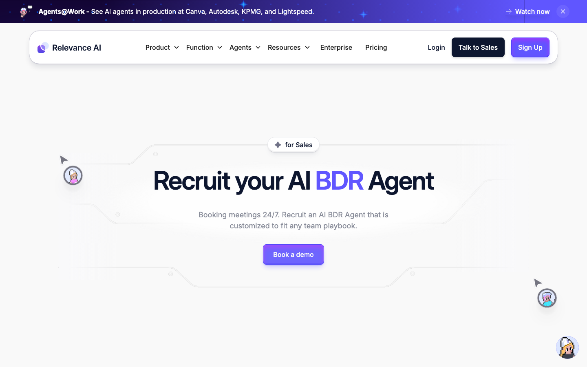

**观察：**

- ✅ 核心功能定位清晰**：页面明确传达产品是"AI BDR Agent"（业务拓展代表 AI 代理），核心能力是 24/7 自动化预约会议、即时回复线索、个性化外联、CRM 数据维护，用户能快速理解"这个产品替代/增强 BDR 角色"的核心价值主张。
- ✅ 问题-方案对比框架有效**：通过 "Without AI Agent vs With AI BDR Agent" 双列对比（BDR 精力分散 / 质量与数量难平衡 / CRM 不完整 / 线索冷却 → 释放 BDR / 规模化个性化 / CRM 实时更新 / 即时跟进），让用户能对应到自己团队的真实痛点和典型使用场景。
- ✅ 数据源/研究能力披露具体**：列出了 Agent 进行 prospect research 时的数据源清单（LinkedIn、Product Usage、CRM Data、Yelp Reviews、Google Search、Enrichment Services、Website、Glassdoor、G2 reviews、Business Registry），相比抽象的"AI 研究"，这种具体清单显著增强了功能可信度。
- P2 "Customize / Train your AI Agent" 工作机制未说明**：页面反复强调"训练并定制 Agent 以适配你的流程"，但没说明定制方式——是通过自然语言上传 SOP？流程图编辑器？提示词模板？人工 onboarding？用户无法判断实施成本与上手门槛。
- P2 集成清单缺失**："Integrates with any of your tech stack" 和 "Equipped with any tool" 是关键卖点，但页面没有列出具体支持的 CRM（Salesforce / HubSpot / Outreach / Apollo？）、邮件平台、日历工具，对评估技术栈兼容性的买家是硬伤。

#### M3: Use cases / Workflows

**URL:** https://relevanceai.com/workflows

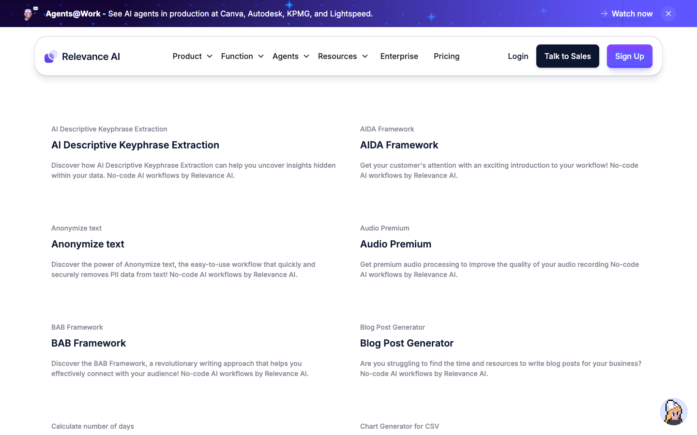

**观察：**

- P1 功能能力边界不清** — 每个 workflow 只有一句营销式描述（如 "Blog Post Generator: Are you struggling to find the time..."），完全没说明输入格式、输出格式、可定制程度、是否能调 prompt、是否支持批量处理。用户无法判断"AIDA Framework"到底是给我一段文案模板、还是接入我数据后自动生成。
- P1 缺少使用场景与触发方式** — 页面只罗列 workflow 名称，没说这些 workflow 如何被调用（API？UI 拖拽？被 Agent 调用？嵌入到更大流程？），也没说典型用户角色（营销人？数据分析师？开发者？）。这直接影响用户判断"这是不是给我用的产品"。
- P2 模板缺少分类/筛选维度** — 从节选可见模板覆盖文本处理（Clean Text、Anonymize）、内容生成（Blog Post、AIDA/BAB）、数据分析（Cluster Classification、Chart Generator）、媒体处理（Audio Premium）等多个异质场景，但页面只是字母序平铺，没有按"功能类型 / 输入数据类型 / 业务场景"分类，难以发现适合自己的模板。
- P2 与主产品（Agent 平台）的关系不明** — 顶部导航有 Agents / Function / Enterprise，但这个 workflows 模板库与 Agent 是什么关系没说明：是 Agent 可调用的工具？还是独立的 no-code 自动化产品？还是 Agent 内部用到的能力组件？这是 Relevance AI 产品架构的关键问题，页面没回答。
- ✅ 模板广度展示产品能力面** — 从 PII 匿名化、聚类向量、CSV 图表生成到营销框架（AIDA/BAB）共存，间接传达了"这个平台不止做 LLM 文本，也涵盖向量、数据清洗、合规处理"的能力宽度，对评估产品是否能承接复合任务有正面信号。

#### M5: Skills / Capabilities

**URL:** https://relevanceai.com/tools

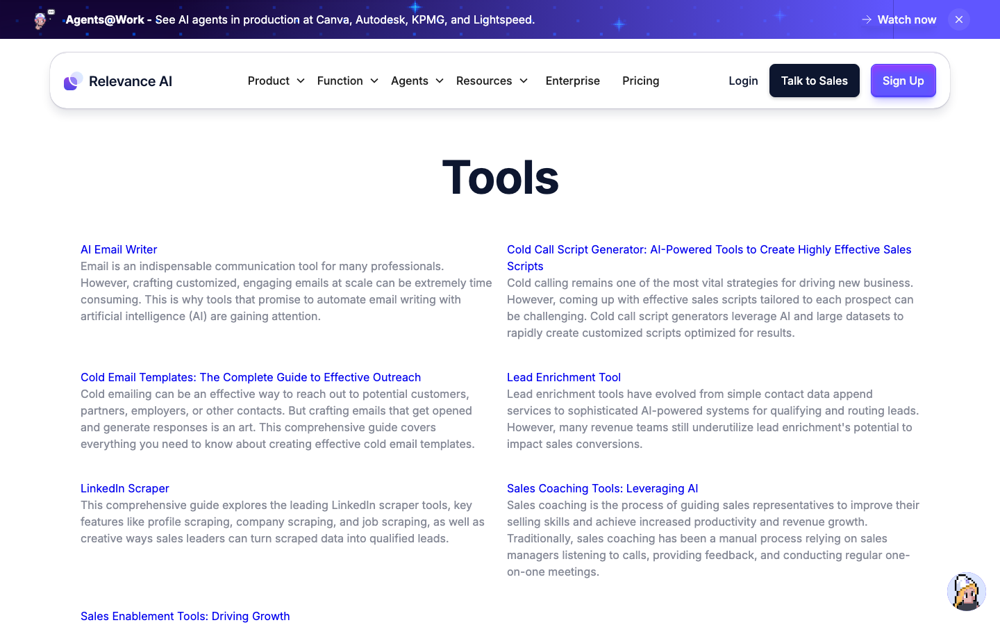

**观察：**

- P1 页面定位与产品能力严重脱节**：这是"Tools"资源/文章列表页，标题（AI Email Writer、Cold Call Script Generator、LinkedIn Scraper 等）读起来像 SEO 内容库，而非产品功能介绍。用户无法判断这些是**产品自身的功能模块**还是**通用知识文章**，等于点进"功能区"却看不到功能。
- P1 关键功能链路完全缺失**：顶部 banner 提到 "AI agents in production at Canva, Autodesk, KPMG, Lightspeed"，暗示产品提供 AI agent 能力，但本页不解释这些 agent 做什么、如何被部署、与文章中的"邮件/冷电/线索富集"工具是什么关系。"Agent → 业务结果"的工作机制完全断裂。
- P2 缺少输入 / 输出 / 集成说明**：以 Lead Enrichment、LinkedIn Scraper 为例，未说明数据源（接哪些数据库/平台）、输出字段、是否接 Salesforce/HubSpot/Outreach 等 CRM/序列工具，也未说明 AI agent 是托管运行还是用户配置触发。
- P2 能力边界模糊**：文章覆盖了从 cold call、cold email、lead enrichment、sales coaching 到 sales enablement 的**全销售漏斗**，但页面没有划清"哪些功能产品现已交付 / 哪些是路线图 / 哪些只是行业科普"，容易让评估者高估能力面或误判定位（BDR agent 平台 vs. 销售内容工具集合）。
- P3 功能场景化叙述缺位**：与 Hero 区"Agents@Work"对比，本页没有具体客户用例（如"Canva 的 AI BDR 每周自动外发 X 封冷邮件、回收 Y 条会议"），读者读完仍无法回答"这个产品**为我**完成哪段工作流"。

#### S12: Trust / Security page

**URL:** https://relevanceai.com/data-security-policy

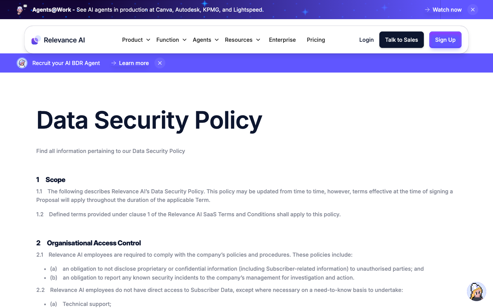

**观察：**

- P2** 页面定位为"Data Security Policy"而非完整 Trust Center，只覆盖组织访问控制与云基础设施两块内容，缺少业界标准的合规认证清单（SOC 2 / ISO 27001 / GDPR / HIPAA）、数据加密机制（传输中 / 静态加密算法）、数据驻留区域选择等企业采购方最关心的功能性信息
- P1** 未说明 Subscriber Data（订阅者数据）的具体范畴——对于一个 AI Agent 平台，关键问题是"客户上传到 Agent 的知识库、对话历史、工具调用产生的数据如何隔离与处理"，但页面仅泛泛描述员工访问规则，未触及 AI 产品特有的数据流（如 LLM 提供商是否会用客户数据训练、Agent 执行过程中的中间产物如何留存）
- P1** 未披露使用的 IaaS Provider 身份（AWS / GCP / Azure）及具体数据中心区域，企业客户无法据此评估自身合规要求（如欧盟客户的数据主权问题、金融行业的本地化要求），这是 B2B AI 平台采购的硬门槛
- P2** 缺少 AI / LLM 层的安全说明——作为 AI Agent 厂商，最关键的功能性安全问题包括：底层模型供应商列表、prompt 注入防护、Agent 工具调用权限边界、敏感数据脱敏机制等，页面完全未涉及，使读者无法判断该产品在 Agent 安全这一独特维度上的能力
- P2** 文本在第 3.2 节中段被截断（"for the period of time in which a legitimate business need for such"），可能是抓取截断也可能是真实截断，但即使完整版本，整篇政策也偏组织流程描述，缺少可验证的技术控制证据（如审计报告下载入口、Trust Portal 链接、第三方渗透测试报告）

#### E1: 探索: GTM

**URL:** https://relevanceai.com/gtm

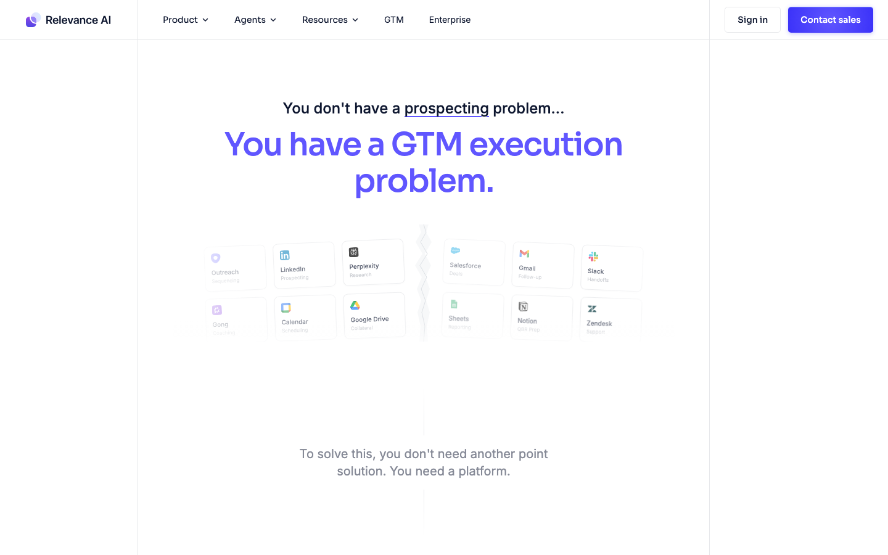

**观察：**

- ✅ **GTM 平台定位清晰**：页面用"You don't have a [prospecting/pipeline/...] problem, you have a GTM execution problem"的反向论述，明确将产品定位为统一的 GTM 执行平台而非点状工具，并通过列出 Outreach/LinkedIn/Salesforce/Gmail/Slack/Gong/Calendar/Google Drive/Sheets/Notion/Zendesk 等 11 个集成点，展示了产品覆盖的工作流广度（Sequencing、Prospecting、Research、Deals、Follow-up、Handoffs、Coaching、Scheduling、Collateral、Reporting、QBR Prep、Support）。
- ✅ **用量化指标具象化 agent 能力边界**：通过"Outbound 120/day、Inbound 60/day、Close-loss 8k/yr、Cross-sell 800 accounts、Coaching Every call、Event Follow-up Same day"这种"工作流 + 处理量"的呈现方式，让读者快速理解每个 agent 的吞吐能力和适用场景，比抽象的"AI 自动化"描述更具说服力。
- ✅ **用三个差异化案例覆盖不同价值主张**：Qualified（$7M pipeline / 35+ agents，规模化输出）、Send Payments（40 小时/周节省，运营效率）、Zembl（30% 转化提升 + 24/7 覆盖，收入增长），分别对应 pipeline 生成、运营降本、转化提升三类 GTM 痛点。
- P2 agent 能力边界与协作机制未说明**：页面提到"35+ agents across the org"和 Lifecycle Marketing / MQL Qualification / Inbound Engagement 等 agent 类型，但没有说明这些 agent 是预置模板还是需自定义构建、agent 之间如何协作（例如 MQL Qualification 与 Inbound Engagement 是否共享上下文）、是否支持人工接管 / 审批节点。
- P2 集成深度信息缺失**：列出了 11 个集成 logo，但未说明集成是只读取数据、双向同步、还是能触发动作（例如能否直接在 Salesforce 中更新机会阶段、能否在 Slack 中发起 handoff），这对评估能否真正替代现有 SDR/AE 工作流至关重要。

#### E2: 探索: Enterprise

**URL:** https://relevanceai.com/enterprise

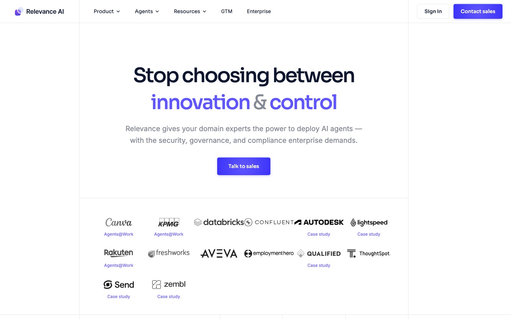

**观察：**

- ✅ **企业级安全合规清单完整且具体**：明确列出 SOC 2 Type II、SAML/OIDC SSO、SCIM 自动化用户配置、工作区/项目/Agent 三层 RBAC、审计日志、AES-256 静态加密、TLS 1.3 传输加密、GDPR 合规及数据驻留选项——对企业 infosec 团队的审查清单覆盖度很高，明确告诉用户"过安全评审需要的功能我都有"。
- ✅ **跨职能 Agent 协同是核心差异化能力**：页面揭示了产品支持 Sales（Lead Sourcer、Outbound SDR）、Marketing（Content Strategist、SEO Optimizer）、CS（Health Analyst、Renewal Prep）、Ops（Data Enrichment、Report Builder）八类预置 Agent，且 **"Agents hand off context automatically"** 暗示了跨 Agent 上下文传递机制，区别于单点自动化工具。
- ✅ **治理层功能具象化**：用 BDR Agent 评估面板（Email quality 94%、Lead qualification 91%、SLA 98%、Data completeness 87%）+ Approval gate（$48k 超出 $25k 自动审批阈值需人工签字）+ Timeline 成本追踪（$0.03、$0.12 每步骤计费）三个截图，把抽象的"质量基准/审批门/可观测性"翻译成了可理解的功能形态。
- P2 "Flexible deployment" 描述含糊**：仅写 "Cloud-hosted or dedicated infrastructure"，但企业最关心的 **VPC 部署 / 私有云 / on-prem / BYO-cloud（AWS/Azure/GCP）** 具体支持哪些形态、是否支持客户自有 KMS、模型推理是否走客户的 LLM endpoint 等关键决策点完全没说。
- P2 "Vendor agnostic" 是核心卖点但未说明机制**：KPMG 引语高亮了"vendor agnostic"，但页面没解释 Agent 可以接入哪些 LLM（OpenAI、Anthropic、Bedrock、Azure OpenAI、私有模型？）、是否支持 BYO-key、模型切换粒度（per-agent / per-step）——对企业选型这是 P1 级问题。

#### E3: 探索: Sales

**URL:** https://relevanceai.com/function/sales

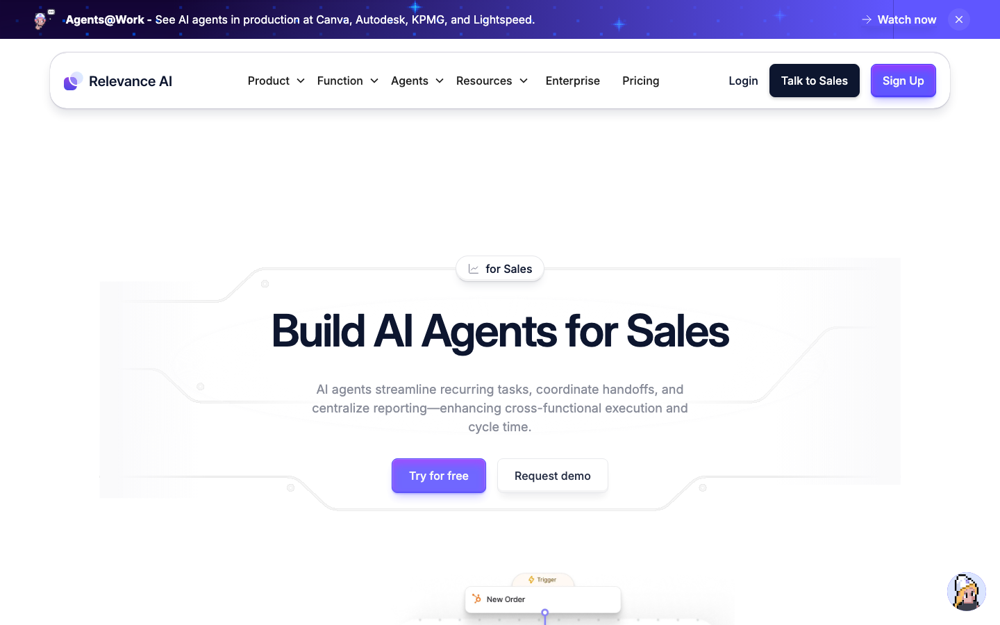

**观察：**

- P1 "Sales" 页面内容与销售场景严重脱节**：页面标题是 "Build AI Agents for Sales"，但正文通篇在讲 Operations（"Operations teams are the bottleneck"、"Deploy AI Teammates That Optimize Your Operations Engine"），列出的两个 agent（Process Orchestration & Status Agent、Data Integration & Intelligence Agent）都是运营协调类，看不到任何销售相关能力（如线索挖掘、外联邮件、CRM 更新、会议纪要、机会跟进），用户无法判断这个产品对销售团队到底有什么用。
- P1 缺少销售关键集成说明**：销售场景的核心是与 CRM（Salesforce/HubSpot）、邮件、电话、日历、对话智能等系统的对接，但页面未提及任何销售工具集成，也没说明 agent 如何读取销售数据、如何写回 CRM，销售负责人无法评估部署可行性。
- P2 量化指标与销售业务挂不上钩**："process completion time by 60%"、"SLA adherence by 40%" 这些指标来自运营场景，没有对应的销售 KPI（如响应时长、Pipeline 覆盖率、Win Rate、Quota Attainment 提升），削弱了对销售决策者的说服力。
- P2 工作机制（输入/输出/触发）未交代**：两个 agent 只描述"协调多团队流程""监控 SLA"，但没说清楚它们如何被触发（定时？事件？人工指令？）、读取哪些数据源、产出形态是什么（Slack 消息？报表？工单？），销售运营人员难以想象实际工作流。
- P3 "Proven Operations Agents" 标题与 Sales 页面错位**：从信息架构看，这个 Sales 页面似乎是套用 Operations 页面的模板未替换内容，导致用户怀疑 Crew 是否真的有针对销售职能的成熟 agent 库，还是只是把通用运营 agent 贴上销售标签。

#### E4: 探索: Marketing

**URL:** https://relevanceai.com/function/marketing

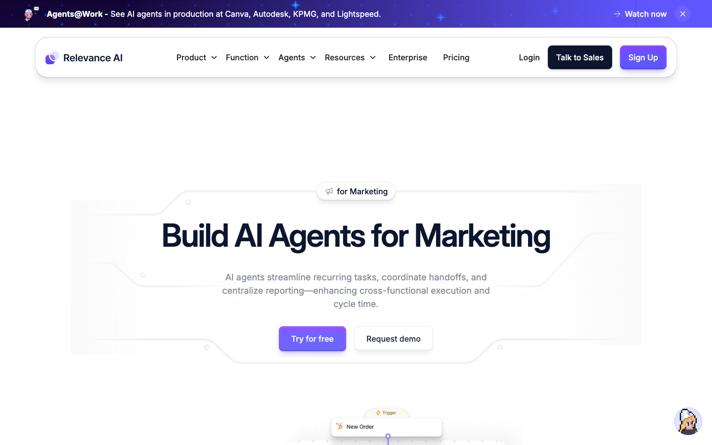

**观察：**

- P1 标题与内容严重错位**：页面标题写的是"Build AI Agents for **Marketing**"，但正文（痛点描述、agent 介绍）全部围绕 **Operations 团队**展开（"Operations teams are the bottleneck...""Optimize Your Operations Engine"）。读者无法判断这两个 agent 究竟是营销场景还是运营场景，怀疑是直接复用了 Operations 页面模板而未做 Marketing 化改写。
- P1 缺少 Marketing 专属用例与工作流**：页面没有给出任何营销场景示例（如 campaign 编排、内容审批、跨渠道数据归因、leads handoff to sales 等）。仅有的两个 agent（Process Orchestration、Data Integration）描述高度通用，营销负责人读完无法回答"这能帮我跑活动、做内容、还是分析数据？"
- P2 关键功能机制不透明**：agent 如何"协调多团队流程"未说明 —— 是通过邮件/Slack 接管？还是嵌入工单系统？"data-driven recommendations" 的数据从哪来、推荐如何下发也没讲。输入/输出/触发机制完全空白。
- P2 集成清单缺失**：痛点段落提到 Email、Slack、"dozens of systems"，但功能段落未列出实际支持的集成对象（HubSpot、Marketo、Salesforce、GA、广告平台等）。营销 stack 高度依赖工具链，这是决策关键信息。
- P3 量化指标缺乏出处**："reducing process completion time by 60%""improving SLA adherence by 40%" 这种强主张没有客户案例、行业、样本基线支撑，可信度被削弱（顶部虽然 banner 列了 Canva、Autodesk、KPMG、Lightspeed，但未与这两个数字关联）。

#### E5: 探索: Operations

**URL:** https://relevanceai.com/function/operations

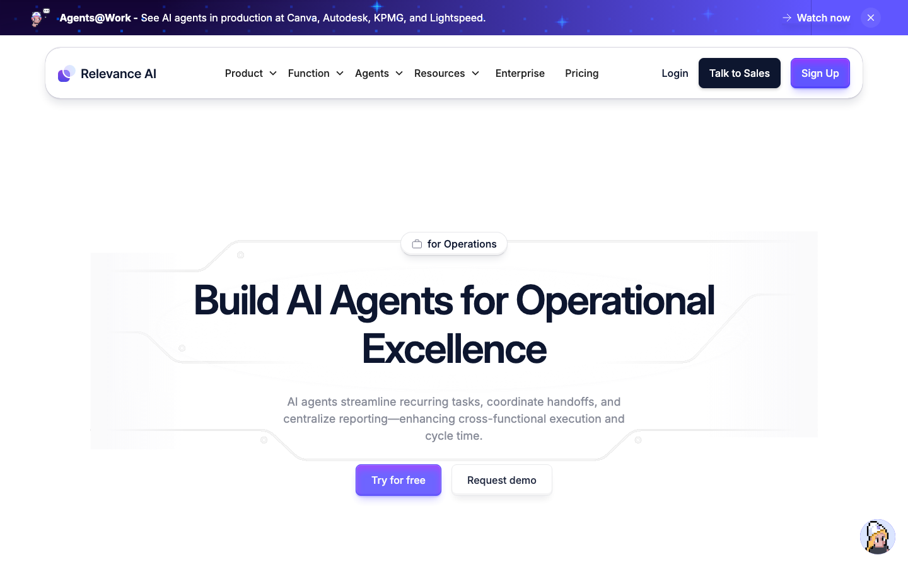

**观察：**

- P2 仅展示 2 个 Operations agent，且功能边界模糊**：页面只列出 "Process Orchestration & Status Agent" 和 "Data Integration & Intelligence Agent"，但两者职责存在明显重叠（前者"追踪任务完成"，后者"监控 SLA 与瓶颈"），未说明协作分工或哪个 agent 在何种场景下被触发，用户难以判断自己实际需要部署几个 agent。
- P1 关键集成与触发机制完全缺失**：上文将"从几十个系统拉数据并手动对账"列为核心痛点，但 agent 介绍中**完全没有说明对接哪些系统**（ERP、ITSM、Jira、Workday、Salesforce？）、数据如何接入、状态更新通过什么渠道发送（Slack / Teams / 邮件？）、升级时如何识别"appropriate stakeholders"。这是 Operations 团队评估可行性的决定性信息。
- P2 量化收益缺乏使用前提**："process completion time 减少 60%"、"SLA adherence 提升 40%" 这类数字未注明样本、行业、流程类型或基线对比方式，对运营负责人而言无法据此评估自身场景的适用度。
- P3 工作机制只写"结果"未写"过程"**：例如"自动协调多团队流程"——是基于预定义 SOP、LLM 推理动态编排、还是事件驱动？"escalates blocked processes with full context"——上下文如何聚合？这些关键 how-it-works 细节缺位，导致页面读起来更像营销话术而非产品规格。
- ✅ 问题陈述与对应能力映射清晰**：三段"痛点描述"（手动协调 / 缺乏实时可见性 / 被动发现瓶颈）与两个 agent 的能力点形成较直接的对应关系，Operations 角色读者能在 30 秒内 grasp 产品**意图解决什么类别的问题**，即使具体实现细节缺失。

#### E6: 探索: Research

**URL:** https://relevanceai.com/function/research


**观察：**

- P1 严重 — 页面标题与内容严重错位**: 页面标题写的是"Build AI Agents for **Research**"，但正文从头到尾讲的都是 **Operations 团队**的痛点（跨部门协作、SLA 监控、流程瓶颈）。读者无法从这一页理解 Lindy 的 Research agent 究竟"做什么研究"——是市场调研？竞品分析？学术文献？客户洞察？功能定位完全模糊。
- P1 严重 — 缺失 Research 场景的工作机制描述**: 页面展示的两个 agent（Process Orchestration & Status / Data Integration & Intelligence）都是 Operations 通用 agent，没有任何一个解释 Research 工作流的输入输出。例如：研究员上传一个主题后，agent 是否会自动检索来源？是否汇总报告？是否能调用 web search / 数据库 / 内部知识库？关键的"研究执行链路"完全缺位。
- P2 中等 — 集成与数据源清单完全缺失**: Research 类 agent 的核心价值依赖于"能接入什么数据"，但页面没有提到任何研究相关的集成（Google Scholar、SEC filings、Crunchbase、PubMed、SerpAPI、内部 wiki 等）。用户无法判断这个 agent 在自己的数据生态中是否可用。
- P2 中等 — 量化指标与 Research 场景脱钩**: 页面给出"流程完成时间降低 60%""SLA 改善 40%"等指标，但这些指标全部来自 Operations 语境（流程编排、瓶颈监控），与"研究效率""报告产出速度""信息覆盖度"等 Research 真正在意的成果指标无关，无法支撑选型决策。
- P3 轻微 — 与其他职能页面的差异化未体现**: 既然 Lindy 为多个职能（Operations、Sales、Research…）都建了独立页面，Research 页本应突出"研究类 agent 与运营类 agent 在能力上有何不同"。当前内容直接复用 Operations 文案，读者会怀疑这只是同一套通用 agent 被贴上不同标签，而非真正针对研究场景做了专门化。

#### E8: 探索: AI Agents

**URL:** https://relevanceai.com/agents

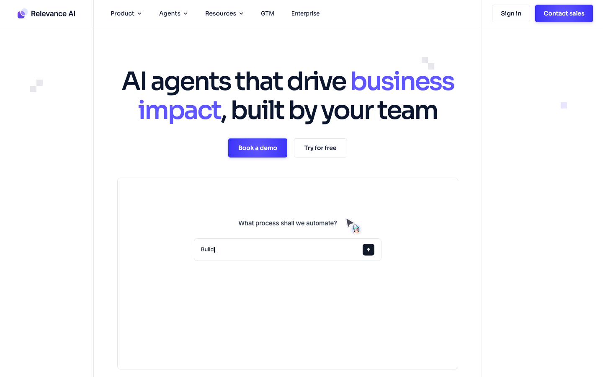

**观察：**

- ✅ 页面清晰传达了产品的核心能力——构建可执行业务流程的 AI Agent 工作流（如 SDR workforce：Lead Researcher + Email Copywriter + Outbound Sender），并通过 Qualified（$7M pipeline / 35+ agents）、Send Payments（每周省 40 小时）、Zembl（转化率 +30%）三个案例量化了实际业务影响，让用户理解"这个产品能为我做什么"。
- ✅ 三种构建路径分工明确，覆盖不同技术深度的用户：**Invent**（自然语言描述 → 自动生成 agents/tools/evals，面向 Domain experts）、**拖拽式 no-code builder**（面向 Ops teams 精修）、**MCP + Claude Code/Codex**（面向 GTM engineers 编程式构建），这是相对完整的"低代码 → 高代码"产品分层。
- ✅ Evals 模块是功能亮点——给出了具体评估维度示例（Email quality、Lead qualification accuracy、Response time SLA、CRM data completeness）以及 12 周趋势 + 90% 阈值 + "4 of 4 evals passing — safe to deploy"的部署门禁机制，体现了 agent 质量管控的工作原理。
- P2** 集成清单严重不完整：示例中只出现 HubSpot + Gmail，但用户无法判断产品支持哪些 CRM / 邮件 / 数据源 / 通讯工具，对评估能否接入自身技术栈构成关键缺口。
- P2** "Agent"的执行边界与触发机制说明模糊：页面提到"Configuring triggers..."但没有解释 agent 由什么触发（事件 / 定时 / webhook / 人工）、是否长驻运行、单次任务还是持续监控，用户难以理解 agent 在真实业务中如何"驻场工作"。


### ⚠️ 未找到的测点（2 个测点）

**该模块覆盖页面**:

- `https://relevanceai.com/`

#### C3: Sign-up flow (no submit)

**URL:** https://relevanceai.com/
**观察：**

- [Link not found] 该模板期望的链接（sign up|signup|get started|start free|注册|免费试用|开始）在 https://relevanceai.com/ 上未找到 — 可能产品用了不同的措辞或这个功能不存在。 已跳过截图与 LLM 解读以避免重复首页快照。

#### C4: Login page

**URL:** https://relevanceai.com/
**观察：**

- [Link not found] 该模板期望的链接（log in|login|sign in|登录|登入）在 https://relevanceai.com/ 上未找到 — 可能产品用了不同的措辞或这个功能不存在。 已跳过截图与 LLM 解读以避免重复首页快照。


---

## 4. 第三方社区反馈

#### 5.1 调研范围与方法

通过 WebSearch 搜索了 Reddit、Product Hunt、Hacker News、G2、Trustpilot 五大平台，时间窗覆盖 2023 H2–2026 Q2。信号分布不均：

- **G2**：20 条 verified reviews，综合评分 4.3/5，pros/cons 信号最强
- **Product Hunt**：3 个产品页（Relevance AI / Invent / Ask），主要是首发期间评论
- **Hacker News**：存在 1 条 thread（id=44295031，标题"Relevanceai"），但内容获取受限
- **Reddit**：直接讨论稀疏，主要通过二次评测文章引用 Reddit 评论
- **Trustpilot**：未找到独立的 relevanceai.com 评价页（搜索结果均为集成相关）

由于 Reddit/Trustpilot 信号弱，本节主体材料来自 G2 verified reviews 与第三方评测站对社区讨论的二次引用。

#### 5.2 核心议题（按讨论频次）

| 议题 | 讨论方向 | 出现频次 | 主要来源平台 |
|---|---|---|---|
| Credit / Vendor Credit 定价不可预测 | 负面 | 高 | G2、第三方评测引用 |
| "Invent" 自然语言生成 agent | 正面 | 高 | Product Hunt、G2 |
| No-code 宣传 vs 实际技术门槛 | 负面 | 中-高 | G2、Reddit（间接） |
| 多 LLM / 多 Agent 协作能力 | 正面 | 中 | G2、对比类评测 |
| 长链 / 多步骤工作流到达上限 | 负面 | 中 | 对比评测（Lindy/n8n） |
| 退款政策刚性 / UX 拥挤 | 负面 | 中 | G2 |

#### 5.3 正面评价 / 用户喜欢的点

- **来源**: [Relevance AI Reviews — G2](https://www.g2.com/products/relevance-ai/reviews) — `Will M.`, Product Marketing Manager（经 [ToolFountain 引用](https://toolfountain.com/relevance-ai-review/)）
  - **原文引用**: > 「The 'Invent' feature is a game-changer. Describe what you want, and it suggests tools…」
  - **关键词**: 自然语言生成 agent、降低构建门槛、惊喜体验

- **来源**: [Relevance AI Reviews — G2](https://www.g2.com/products/relevance-ai/reviews) — `Margarita C.`, Personal Assistant
  - **原文引用**: > 「I've tried other automation platforms, but only here was I able to build a solid RAG system…」
  - **关键词**: RAG、内置向量工具、跨平台对比优势

- **来源**: [Invent by Relevance AI — Product Hunt](https://www.producthunt.com/products/relevance-ai) — `Erliza P`, 1 yr ago
  - **原文引用**: > 「This is democratizing AI development in the most intuitive way possible.」
  - **关键词**: 非技术用户友好、自然语言界面

- **来源**: [Lindy vs n8n vs Relevance AI](https://www.lindy.ai/blog/relevanceai-vs-n8n)（实测对比博客）
  - **原文引用**: > 「Relevance AI is best when your main goal is to build LLM agents or RAG-style assistants. The vector tools are built in, which saves setup time, and the editor makes it easy to test ideas quickly.」
  - **关键词**: 聚焦型 agent 任务表现强、向量原生、测试迭代快

#### 5.4 负面 / 批评 / 担忧

- **来源**: [Relevance AI Reviews — G2](https://www.g2.com/products/relevance-ai/reviews) — `Griffin S.`, Small-Business Owner（经 [ToolFountain 引用](https://toolfountain.com/relevance-ai-review/)）
  - **原文引用**: > 「Requested a prorated refund when we found it wouldn't work for our specific need. The company refused…」
  - **关键词**: 退款政策刚性、10 个月 credits 卡死、与"按需扩展"叙事冲突

- **来源**: [Relevance AI Pricing — eesel.ai](https://www.eesel.ai/blog/relevance-ai-pricing)（引述社区讨论）
  - **原文引用**: > 「It's very easy to accidentally burn $50 worth of credits on a 'looping' agent if you aren't careful.」
  - **关键词**: Credit 黑盒、循环 agent 失控、月底超支

- **来源**: [Relevance AI Reviews — G2](https://www.g2.com/products/relevance-ai/reviews) — `Jarie B.`, Executive Strategist
  - **原文引用**: > 「The UX/UI is busy and it sometimes does not fully sync your latest edits…」
  - **关键词**: 界面拥挤、编辑同步不稳、agent 列表无文件夹/分类

- **来源**: 第三方评测对 Reddit 评论的引用（[DoneForYou Review](https://doneforyou.com/relevance-ai-review-is-this-the-best-ai-workforce-tool-for-your-business/)）
  - **原文引用**: > 「Might require more technical know-how than advertised.」
  - **关键词**: No-code 宣传与实际门槛存在 gap、复杂工作流需要技术能力

- **来源**: [Relevance AI Reviews — G2](https://www.g2.com/products/relevance-ai/reviews) — `Mike Y.`, Sales Development Manager
  - **原文引用**: > 「I would like more governance controls and admin configuration controls…」
  - **关键词**: 企业级权限/治理缺失、与"AI workforce at scale"定位的差距

#### 5.5 与官方叙事的差异（vs §4.1 Narrative）

官方将自己定位为"可雇佣的数字员工/AI workforce"，与人类业务专家并肩工作 — 这一叙事暗示**雇佣即上岗**的低摩擦、高可预测体验，类比的是招人成本而非软件配置成本。但社区反馈呈现的是另一幅图景：本质上仍是一个 **build-your-own agent platform**，需要用户自己设计提示词、调试 RAG、控制循环、监控 credits。Lindy 的对比评测直白指出 "when used for longer workflows that needed branching, multi-step coordination, and updates across several apps, it reached its limits" — 这与"数字员工"暗示的端到端胜任力存在明显落差。

第二个 gap 在**经济模型**：官方"AI workforce 替代 SDR/Ops"的叙事让客户预期对标人力成本（可预测的月薪），但 Credit + Vendor Credit 的实际计费模型让月度成本浮动剧烈，刚性退款政策又放大了试错风险 — Griffin S. 案例直接展示了这种叙事 vs 合同条款的冲突。

#### ⚠️ 信息来源声明

本节所有内容来自**非官方第三方平台**（G2、Product Hunt、Hacker News thread index、对比评测博客转引社区反馈）。内容可能含偏见 / 过时 / 个别极端观点 — 尤其需注意：Reddit 直接 thread 信号稀疏，部分负面引用经第三方评测站二次转述；G2 评论池较小（n=20）。决策时建议结合 §2.5 官方信息 + §3 实测综合判断。

Sources:
- [Relevance AI Reviews 2026 — G2](https://www.g2.com/products/relevance-ai/reviews)
- [Relevance AI Pros and Cons — G2](https://www.g2.com/products/relevance-ai/reviews?qs=pros-and-cons)
- [Invent by Relevance AI — Product Hunt](https://www.producthunt.com/products/relevance-ai)
- [Ask by Relevance AI — Product Hunt](https://www.producthunt.com/products/ask-by-relevance-ai)
- [Hacker News thread — item 44295031](https://news.ycombinator.com/item?id=44295031)
- [Relevance AI Review — ToolFountain (G2 quotes)](https://toolfountain.com/relevance-ai-review/)
- [Relevance AI Pricing breakdown — eesel.ai](https://www.eesel.ai/blog/relevance-ai-pricing)
- [Lindy vs n8n vs Relevance AI — Lindy blog](https://www.lindy.ai/blog/relevanceai-vs-n8n)
- [Relevance AI Review — DoneForYou (Reddit quote)](https://doneforyou.com/relevance-ai-review-is-this-the-best-ai-workforce-tool-for-your-business/)

---

## 5. 总结

### 5.1 一句话评价

目标产品 **https://relevanceai.com/** 在 **multi-agent** 模板的 **standard** 档位评测下存在严重问题：识别问题 98 个（P1 35 / P2 50 / P3 13），正面发现 38 个。详见 §3 体验流程与 §3 问题清单。

### 5.2 最大优点

1. **[C1]** ✅ 正面：用"Lead qualification"具体示例横向展开 L1→L4 的工作流差异（从单条 prompt → 调用 skill → HubSpot 信号触发自动 research/score/draft → agent 自主优化外联策略），让用户能理解 agent 在销售线索资格审查这一典型 GTM 场景下"输入是什么、输出是什么、人何时介入"。
2. **[C7]** ✅** 提供了清晰的**多层级支持工作流**：Community（同行互助）→ In-app chat（AI Agent 先答 → 转人工 ticket）→ Email → Phone → Enterprise SLA，体现了产品对企业客户的服务能力分级，本身就是一种功能性承诺。
3. **[C7]** ✅** 暴露了一个有价值的**产品内置能力**：In-app 的 "Ask for Help" 入口（CMD+K）先由 AI Agent 应答再升级到人工，说明 Relevance AI 把自家 Agent 技术用在了自己的客服流程上（dogfooding），对潜在用户是功能背书。

### 5.3 最大风险

1. **[C1]** ✅ P1 正面：页面清晰传达核心定位——为 GTM 等高增长团队提供"由业务专家与 AI agent 协同工作"的企业级 agent 平台，并通过 L1–L4 自治成熟度模型（Assisted → Copilot → Autopilot → Self-Driving）说明产品定位在 L3/L4 阶段，将自身与 ChatGPT/Claude（L1）、Cowork/Claude Code/Codex（L2）做了明确对标，功能差异化叙事有力。
2. **[C1]** P1 严重：核心抽象概念 "Agent"、"Skill"、"Events & signals"、"Experiment A/B" 等术语反复出现，但未说明 agent 的**构建方式**（无代码？模板？自定义逻辑？）、**触发机制**（事件源有哪些？）、以及**治理/审核能力**如何落地——口号说"governed""safely at enterprise scale"，但未给出权限、审计、guardrail 的功能描述。
3. **[C2]** P1** 仅展示了 Enterprise 单一套餐，**未列出其他套餐（如 Team/Pro/Free）的价格与功能边界**——用户无法判断"自助试用 vs 企业销售"的分层逻辑，定价页核心信息（价格数字、用量额度、计费单位）完全缺失。

### 5.4 用户增长漏斗推断

#### 官网增长漏斗推断图

```
Stage 1: 落地页认知（"AI Workforce" 概念建立）
    ↓ 关键触点: 产品定义 "the home of your AI Workforce" [B1]、双导航分流 Function × Product [C2]
Stage 2: 能力探索（理解 Agents / Tools / Workforces / Knowledge 四件套）
    ↓ 关键触点: 四大组件描述 [B2]、Chat 入口 [B5]、Marketplace 可视化资产 [B6]
Stage 3: 评估 / 定价判断（试图理解成本与套餐边界）
    ↓ 关键触点: Pricing 仅展示 Enterprise 单一套餐 [C2-P1]、FAQ 答案未展开 [C2-P2]
Stage 4: 入口路径分流（按用户身份选择转化通道）
    ↓ 关键触点: Programmatic GTM 开发者入口 [S9]、Chat 应用入口 [B5]、Demo/Sales 路径 [C2]
Stage 5: 转化动作（Demo 表单 / Chat 注册 / Claude Code Plugin 接入）
    ↓ 终止于: chat.relevanceai.com 注册 [B5] 或 Sales 联系 [C2] 或 MCP 客户端启动 [S9]
```

---

#### 关键漏斗节点详解

**Stage 1: 落地页认知**
- 页面陈述：Relevance AI 被定义为 "the home of your AI Workforce"，一个 "low/no-code platform where you can build AI agents and multi-agent teams that autonomously complete tasks, much like human employees" [B1]；Pricing 页用 Function（Sales/Marketing/Ops/Research/Support）× Product（AI Agents/Workforce/Multi-Agent/Tools/BDR Agent）双重导航 [C2-P3]。
- 我的推断：产品在最顶层用"AI 员工 / AI 劳动力"这个易理解的隐喻替代抽象的"agent 平台"，意图让非技术 buyer（销售/运营负责人）也能秒懂；双导航暗示同时服务"按职能找方案"和"按能力选模块"两种心智路径。
- 潜在流失点：以"Workforce"为核心叙事可能让"只想要一个 chatbot / 一个 RAG 工具"的轻量用户觉得过重而离开；双导航若没有明确推荐路径，反而会让初次访客犹豫该点哪里。

**Stage 2: 能力探索**
- 页面陈述：四大组件 Agents / Tools / Workforces / Knowledge 被反复出现于多个文档页 [B1][B2][B3]；Chat 入口在 `chat.relevanceai.com`，支持 @ mention 多 Agent 协作、Saved prompts、内置 Agent（深度研究、出图、生成幻灯片）、多 LLM 切换 [B5]；Marketplace 提供"ready-to-use" 的 Agents/Tools/Workforces 可克隆 [B6]。
- 我的推断：产品把"探索能力"做成了三个并行入口——文档读概念、Chat 直接试用、Marketplace 浏览成品；其中 Marketplace 和 Chat 内置 Agent（深度研究 / 生成幻灯片）很可能承担"可见 Aha"载体，让访客在不构建任何东西的前提下感知能力边界。
- 潜在流失点：四大组件的抽象解释（Tools "调 API"、Workforces "canvas 协作"）仍偏概念，缺少视频/动图展示真实运行画面；Marketplace 是分发渠道而非主线产品页，可能不是首屏可见入口，导致探索深度不够的访客带着"它到底能做什么"的疑问就走了。

**Stage 3: 评估 / 定价判断**
- 页面陈述：Pricing 页**仅展示 Enterprise 单一套餐**，未列出 Team/Pro/Free 的价格与功能边界，无具体数字 / 用量 / 计费单位 [C2-P1]；Enterprise 套餐使用 "Unlimited Agents/Tools/Users"、"2,000+ Integrations"、"Calling & Meeting Agents"、"BDR agent"、"Agent Evaluations" 等抽象功能名，未解释能力边界 [C2-P1][C2-P2]；FAQ 标题（"Is the BDR agent included?"、"How do I get started?"）出现但答案未展开 [C2-P2]。
- 我的推断：这是一种**典型的 Sales-led / Enterprise-first 定价策略**——故意不公开价格，把所有有购买意向的访客都引流到 Demo / 联系销售；自助试用层（Free/Pro）即使存在，也被刻意隐藏于 pricing 主视图之外，可能藏在"Get Started"或 Chat 入口背后。FAQ 答案不展开很可能也是有意为之，迫使关键问题通过销售对话回答。
- 潜在流失点：这是漏斗中最关键的流失节点——SMB / 个人开发者 / 自助探索型用户读完 pricing 页无法自我服务，会直接跳出；企业采购方虽愿意联系销售，但因功能边界不清晰（如 BDR agent 是否含在 Enterprise、Calling agent 怎么计费），可能延迟决策周期。

**Stage 4: 入口路径分流**
- 页面陈述：Programmatic GTM 页面提供四条接入路径——OpenAI Codex / Claude Code Plugin / MCP Server / Agent Skills 仓库，并标注 "Claude Code Plugin = the fastest way to get started" [S9]；Chat 入口在 `chat.relevanceai.com`，直接可用聊天 + 内置 Agent [B5]；JS SDK 面向开发者集成自有应用 [B4]；Pricing 页面 Enterprise CTA 隐含 Demo / Sales 路径 [C2]。
- 我的推断：Relevance AI **同时服务三类人格的进入漏斗**：(a) 业务买家走 Demo / Sales（Pricing 触发），(b) 终端用户 / 探索型走 Chat 注册（产品自助试用），(c) 开发者 / AI-native 团队走 Claude Code Plugin / MCP（dev-first 入口）。Programmatic GTM 把"开发者入口"显式产品化，是对 Cursor / Claude Code 用户群的精准截流。
- 潜在流失点：三个入口缺少明确的"我是谁该走哪条"的引导文案，访客可能反复跳页比较；Programmatic GTM 页缺 API endpoint / 认证示例 [S9-P1]，导致即使决定走 dev 路径的用户也无法立刻动手。

**Stage 5: 转化动作**
- 页面陈述：可观察到的转化终点有三个——Chat 端的注册入口 `chat.relevanceai.com` [B5]、Pricing 页 Enterprise 套餐的 Sales CTA [C2]、Programmatic GTM 列出的 Claude Code Plugin 一键启动 [S9]；In-app 支持流程（CMD+K 唤起 AI Agent 应答）说明产品对刚进入的用户有内嵌引导能力 [C7]。
- 我的推断：产品的"完成转化"标准被刻意做成多元的——不强制走 signup form，开发者可以直接在 Claude Code 内 install plugin 就算完成首次接入；这降低了开发者群体的转化阻力，但对业务买家仍是传统 Demo Request 漏斗。Marketplace 的"可克隆 Agent"也可能起到"先用现成的再注册"的钩子作用 [B6]。
- 潜在流失点：Demo 表单（推断存在于 Enterprise CTA 后）的字段量与响应时长未在前端预告，对急于评估的 buyer 是不确定性；Chat 注册的权限范围、免费额度是否存在等关键信息未在 pricing 页对齐，导致"想自助试用"的用户难以判断启动后会发生什么。

---

#### 转化设计观察

- **入口设计**：观察到至少三种并行入口共存——(a) **Demo / Sales 路径**（Pricing 页 Enterprise 套餐 CTA，无价格、推断为表单 + 销售对接）[C2]，(b) **自助 Chat 入口**（`chat.relevanceai.com`，可直接体验 @ mention 与内置 Agent）[B5]，(c) **开发者直连**（Claude Code Plugin / MCP Server，跳过 UI 流程）[S9]。这种"按人格分流"的设计降低了不同用户类型的进入摩擦，但 pricing 页本身没有任何文案告诉访客"如果你只是想试一下，直接去 Chat / 如果你是开发者，去这个 plugin"——分流靠访客自己发现入口，这是设计上的薄弱点。

- **价格 / 套餐心智锚点**：访客在 pricing 页**几乎无法形成成本预期**——只看到 Enterprise 一档、无数字、无用量、无计费单位 [C2-P1]。推断的访客心智结论会分裂为两类：业务 buyer 默认"这是 enterprise 产品，价格谈出来"；自助型用户则会困惑"有没有免费 / 入门版"并主动去其他页面（Chat 入口）找答案。"Unlimited Agents/Tools/Users" 这种描述在没有竞争锚点的情况下，反而无法传递价值——用户不知道"无上限"对应的是 $10K/年还是 $100K/年。

- **可见的 Aha 承诺**：官网叙事用了几个具体场景钩子——"BDR agent"（销售开发代表自动化）、"Calling & Meeting Agents"（拨打电话与会议代理）、"Built-in Agents"（深度研究、生成图片、构建幻灯片）[B5]、"Workforces"（多 Agent 在 canvas 上协作） [B2]。这些承诺的共同语义是"AI 像员工一样独立完成完整任务"，比"我帮你写 prompt"或"我帮你查数据"要重得多；但**承诺停留在功能名级别**，没有视频 / 示例工作流 / 案例数字（如"BDR agent 每周触达 X 人，签出 Y 单"）来固化为可感知的 Aha [C2-P2]。

---

#### 漏斗设计的强弱判断（仅官网层面）

- ✅ **多入口分流设计有前瞻性**：同时为业务买家（Demo）、终端用户（Chat）、开发者（Claude Code Plugin / MCP）准备入口，对 AI-native 时代的混合人格有覆盖 [S9][B5][C2]。
- ✅ **产品定义清晰且有差异化**："AI Workforce / AI 员工"叙事在文档与 pricing 页保持一致 [B1][B2]，比"agent 工具箱"更能让非技术 buyer 共情。
- ⚠️ **Pricing 页是最严重的漏斗瓶颈**：单一 Enterprise 套餐 + 无数字 + 抽象功能名 + FAQ 答案折叠 [C2-P1][C2-P2]，把所有自助探索型用户都拦在转化漏斗之外，只服务 Sales-led 通道。
- ⚠️ **能力边界缺乏可视化证明**：BDR agent / Calling agent / Workforces canvas 等差异化功能只有文字名 [C2-P2]，缺少视频 demo / 实际运行截图 / 案例数据，访客很难形成"用了之后会怎样"的确定预期。
- ❌ **入口之间缺少导航连接**：访客在 pricing 页读完后，没有任何文案引导他"如果你想先免费试一下，去 Chat" / "如果你是开发者，去 Programmatic GTM"——多入口设计虽然存在，但发现成本完全压在用户身上，事实上削弱了多通道设计的转化效益。

---

