# theaicmo.com 产品深度体验报告

## 报告信息

| 项 | 内容 |
|---|---|
| 产品名称 | theaicmo.com |
| 产品 URL | https://theaicmo.com/ |
| 体验时间 | 2026-05-22T18:14:49.141720 |

---

## 目录

- [1. 核心结论](#1-核心结论)
  - [1.1 一句话判定](#11-一句话判定)
  - [1.2 主要风险](#12-主要风险)
  - [1.3 主要亮点](#13-主要亮点)
  - [1.4 综合评分](#14-综合评分)
- [2. 产品概览](#2-产品概览)
  - [2.1 基础信息](#21-基础信息)
  - [2.2 测点速览](#22-测点速览)
  - [2.3 产品 / 公司背景信息](#23-产品--公司背景信息)
  - [2.4 产品战略抽象](#24-产品战略抽象)
  - [2.5 公司基本信息](#25-公司基本信息)
- [3. 体验流程记录](#3-体验流程记录)
  - [3.1 官网叙事综合](#31-官网叙事综合)
  - [3.2 测点流程详情](#32-测点流程详情)
- [4. 第三方社区反馈](#4-第三方社区反馈)
- [5. 总结](#5-总结)
  - [5.1 一句话评价](#51-一句话评价)
  - [5.2 最大优点](#52-最大优点)
  - [5.3 最大风险](#53-最大风险)
  - [5.4 用户增长漏斗推断](#54-用户增长漏斗推断)

---

## 1. 核心结论

### 1.1 一句话判定

目标产品 **https://theaicmo.com/** 在本次深度体验中：存在显著的功能信息缺口。详见 §3 体验流程记录。

### 1.2 主要风险

1. **[C1]** P1 未说明发布渠道的真实集成范围**：页面反复强调 "publishes across channels"，但全文只在示例里出现 LinkedIn 一个具体平台。是否原生集成 Meta Ads / Google Ads / TikTok / X / Mailchimp / HubSpot 等完全没说——这对评估"能不能真正端到端跑"是决定性信息，缺失会让买家无法判断是否需要再自己搭发布层。
2. **[C1]** P1 "记忆 / 品牌 / 学习" 机制完全黑箱**：宣称 "remembers your brand and last week's results"、"learns from every result"，但没说品牌资料怎么导入（上传素材库？连官网？接 DAM？）、它读取哪些表现数据（点击/转化/广告平台 API？）、以及"调整"是改文案还是改投放预算。这是 agent 类产品的核心差异点，留白太大。
3. **[C2]** P1 页面定位与内容严重不符**：测点标记为 Pricing page，但抓取到的文本节选完全没有出现任何价格、套餐、计费单位（per seat / per month / credits 计价规则）、免费额度、试用期等定价信息，全部是首页的产品故事与 Autonomous Mode 演示。用户从这一页**无法判断"这个产品要花多少钱、按什么计费、有几档套餐"**——这是 Pricing 页面的核心功能信息缺失。

### 1.3 主要亮点

1. **[C1]** ✅ 核心能力闭环描述清晰**：页面用 "plans strategy → writes assets → publishes → learns" 把 agent 的工作链条交代得很完整，并配 Active Goal 示例（"Launch our Q2 product campaign" → 已发 3 条 LinkedIn、生成 12 条广告素材、起草 SEO 博文、正在写邮件序列），让用户能快速理解"它会自己跑一个 campaign 从策划到发布到优化"，而不是又一个"AI 写文案"工具。
2. **[C1]** ✅ 资产类型清单具体且按 channel 切分**：Video Ad / Product Ad / Paid Social / Social Reel / Brand Hero / Display Banner / Product Demo / UGC Ad 等 13+ 种格式枚举，配合 "rendered to native spec" 暗示自动适配各平台规格，对营销人员判断"我要的素材它都能产"很有用。
3. **[C4]** ✅ **页面明确揭示了三层核心能力**：(1) 战略文档生成 — 一次性输出 positioning / tactics / experiments / measurement 完整文档；(2) 自主执行循环 — "plans, ships, and reports back"，表明产品定位为 agent 而非 prompt-based 工具；(3) 长期记忆机制 — "every correction becomes permanent"，强调跨会话的品牌/偏好沉淀。三句话同时框定了产品类型（AI agent）、产出物（策略+资产）和差异化（持续学习）。

### 1.4 综合评分

| 维度 | 评分 | 1-2 句话说明（引用具体 [测点ID]） |
|---|---:|---|
| 产品方向清晰度 | 4.0 / 5 | [C1][A1] 用 "plans strategy → writes assets → publishes → learns" + Active Goal 示例把 AI marketing agent 的定位讲得很清楚，[C8] 404 页和快捷入口也反向印证了"营销策略 + 多渠道投放 + 邮件自动化"的能力图谱，方向一目了然。 |
| Narrative 表达力 | 3.5 / 5 | [C4][C5] "Set a goal. It plans, ships, and reports back" + "every correction becomes permanent / 10th campaign beats the 1st" 叙事钩子有力，[C8] 404 用 "ROAS: -100%" 强化品牌记忆，但 [C1][A1] 核心动词 "ships / learns / remembers" 全部留白导致 narrative 偏 marketing claim。 |
| 信息架构（IA） | 2.0 / 5 | [C7] 主导航缺 Help/Docs/Support 入口，[C5] footer 仅 Terms/Privacy 两个法律链接、完全没有功能导航网，[C1] 左侧 Chat/Autonomous/Studios/Campaigns/Analytics 五个模块中 "Studios" 与 "Autonomous" 的分工未解释，子页组织缺失严重。 |
| 功能广度与深度 | 3.0 / 5 | [C1] 列出 13+ 种资产类型（Video Ad / UGC Ad / Brand Hero 等）+ [A1] 端到端工作流示例展示广度尚可，但 [A2] 模板库只有唯一一个示例、brief 输入字段未披露，[C2][C7] 集成清单、HITL 边界、measure/adjust 闭环均无深入说明。 |
| AI / 核心能力可信度 | 2.0 / 5 | [C1][C2][C3][C4][C5][A1] 六个测点一致指出 "memory / brand / learning" 机制完全黑箱——品牌怎么导入、学的是什么维度、纠正发生在哪一层全无交代，"ships" 究竟是真投放还是生成草稿也未定义，核心差异化卖点缺乏可验证证据。 |
| 商业化清晰度 | 1.0 / 5 | [C2] 标记为 Pricing 页但抓取内容完全没有价格 / 套餐 / 计费单位 / 试用期信息，[C1][C7][A1] 反复出现 "3,247 credits left" 但 credit 对应什么动作、各操作消耗多少、超额如何处理全部缺失，商业化信息基本不可用。 |
| **综合平均** | **2.6 / 5** | **方向清晰、narrative 有钩子，但 IA 单薄、核心 AI 能力黑箱、定价信息严重缺位，整体停留在"愿景演示"而非"可决策的产品页"。** |

---

## 2. 产品概览

### 2.1 基础信息

- **URL**: https://theaicmo.com/
- **首屏标题 / Slogan**: THE AI CMO
Platform
Solutions
Security
What's New
Pricing
Sign in
Sign up
The au
- **评测模板分类**: ai-tool

### 2.2 测点速览

本次共体验 21 个测点。

> ⚠️ **登录后内容未覆盖**——产品有登录入口但本次未登录进入，本报告仅为公开页范围。

### 2.3 产品 / 公司背景信息

_本次未发现产品 / 公司的官方介绍页面。_

### 2.4 产品战略抽象

### 1. AI CMO 化 (AI CMO-ification)
**核心叙事**: 产品不把自己定位为"AI 营销工具",而是直接替代 CMO 这个角色,承担从战略到执行再到归因的完整职能。
**支撑证据**: 
- [C4] 登录页明确框定三层能力：战略文档生成 + 自主执行循环 + 长期记忆,产品类型是 "AI agent" 而非 prompt-based 工具
- [C3] 注册页价值主张定位为 "strategy engine + autonomous campaigns + learning loop",对标的是营销负责人而非文案编辑
- [C8] 404 页快捷入口暴露 Strategy Creator / PPC Campaign Builder / Google Ads / Email Campaigns,功能图谱直接对应 CMO 职责范围
**对用户/产品的含义**: 用户买的不是一个工具席位,而是把"营销负责人"这个岗位预算的一部分让渡给 AI——这是一次替换 headcount 的决策,门槛与信任要求都远高于工具采购。

### 2. Autonomous Agent 化 (Autonomous-ification)
**核心叙事**: 产品的工作模式从"用户提示 → AI 生成内容"转向"用户设定目标 → AI 自驱动执行多步骤任务并跨会话持续运行"。
**支撑证据**: 
- [C1] 首页用 "plans strategy → writes assets → publishes → learns" 把工作链条交代为闭环,Active Goal 示例显示已发 3 条 LinkedIn、12 条广告素材、正在写邮件序列
- [C3] "Set a goal. The AI plans, ships, and reports back – no briefs, no approval chains" 明确去掉了审批环节
- [C4] "while you were away" 暗示 agent 在用户离开期间持续工作,具备异步/常驻运行机制
**对用户/产品的含义**: 用户从"操作员"变成"目标设定者",但也意味着要把品牌账号、投放预算等高风险权限交给 AI——产品的核心瓶颈不再是生成质量,而是用户对自主权让渡的信任阈值。

### 3. Goal-Driven 化 (Goal-Driven-ification)
**核心叙事**: 输入范式从 "写 prompt / 填 brief" 升级为 "设定营销目标",把任务拆解交给 AI 而不是用户。
**支撑证据**: 
- [A1] 示例输入是 "Launch our Q2 product campaign" + "Focus on medium-size businesses",是目标语义而非操作指令
- [C7] Autonomous Mode 展示 "Set a goal → 13 checkpoints → 自动执行" 的成品形态,goal 是单一入口
- [A2] 主 CTA 是 "Generate brief" 而不是 "Write content",暗示 brief 本身也是 AI 产出物
**对用户/产品的含义**: 用户的核心动作从"会写 prompt"退化为"会设目标",上手门槛降低,但也意味着产品必须自己承担 goal → plan 的拆解智能——这是产品最容易暴露能力短板的环节。

### 4. Compounding Memory 化 (Compounding Memory-ification)
**核心叙事**: 把"长期记忆 + 复利学习"作为核心壁垒卖点,主张第 N 次活动一定比第 1 次效果更好。
**支撑证据**: 
- [C4] "Every correction becomes permanent. The 10th campaign beats the 1st by a mile" 直接量化复利承诺
- [C1] "remembers your brand and last week's results"、"learns from every result" 反复强调记忆与学习
- [C5] Footer hero 把 "compounds every time" 作为三大能力主张之一,与 strategy engine / runs itself 并列
**对用户/产品的含义**: 这是产品最强的留存设计——切换成本会随使用时间线性上升,但代价是用户在前几次活动看不到差异化效果,产品必须用其他方式撑过冷启动期。

### 5. Channel-Native Asset 化 (Channel-Native-ification)
**核心叙事**: AI 不只是生成内容,而是按每个发布渠道的原生规格自动产出形态各异的资产,把"跨平台适配"这层人力消化掉。
**支撑证据**: 
- [C1] 列出 Video Ad / Product Ad / Paid Social / Social Reel / Brand Hero / Display Banner / Product Demo / UGC Ad 等 13+ 种格式,明确按 channel 切分
- [C1] 用 "rendered to native spec" 暗示自动适配各平台规格
- [A1] Autonomous 流程同时产出 LinkedIn 帖、邮件序列、SEO 博客、广告创意,资产形态完全异构
**对用户/产品的含义**: 替代的是营销团队里"内容运营 + 设计师 + 文案"的横向协作,但前提是渠道集成必须真实落地——目前页面仍只给 LinkedIn 一个具体例证,这是叙事与产能之间最大的可证伪缺口。

### 6. Credits 商业化 (Credits Monetization)
**核心叙事**: 商业模式不是按席位 / 按月订阅,而是把每次 AI 动作折算为 credit 消耗,把使用量直接转化为收入。
**支撑证据**: 
- [C1] 界面常驻显示 "CREDITS 3,247 left",credits 是产品 UI 一等公民
- [C2] Pricing 页缺失定价但保留 credits 字段,暗示 credit-based 是核心计价单位
- [C7] Credits 计费机制无独立说明文档,但作为核心计量单位被反复展示
**对用户/产品的含义**: 用户成本与 agent 自主程度正相关——越让 AI 自动跑、credit 消耗越快,这会反向抑制 "Autonomous 化" 卖点的使用频率,产品需要在 "鼓励放手" 和 "credit 烧太快" 之间做精细的定价平衡。

### 2.5 公司基本信息

#### ✅ 实体身份已确认

经过域名 + privacy 法律实体 + 创始人 LinkedIn 三重交叉验证，本次体验对象 `theaicmo.com` 对应：
**ROGA AI LIMITED**（Gibraltar 注册法律实体）

身份锚定证据：
- ✅ [theaicmo.com/privacy](https://theaicmo.com/privacy) 直接声明数据控制者为 "ROGA AI LIMITED, Unit G02, Eurocity, Europort Avenue, Gibraltar, GX11 1AA"
- ✅ [Gavin Grimes LinkedIn](https://www.linkedin.com/in/gavingrimes/) 公开 title 显式标注 "The AI CMO"
- ✅ [LinkedIn company page](https://www.linkedin.com/company/theaicmo) 确认成立 2025、Software Development 行业
- ✅ [PRLog Business Profile](https://biz.prlog.org/TheAICMO/) 把 "ROGA AI Ltd" 与 `www.theAICMO.com` 直接对应

⚠️ **重要排除**：搜索过程中出现的 [roga.ai (El Segundo 神经科技可穿戴)](https://www.crunchbase.com/organization/roga-life)、[Rogo (NY 金融 AI)](https://sacra.com/c/rogo/) 是**完全不同的公司**，与本次体验对象无关，已剔除。

#### 公司基础事实表

| 项 | 内容 | 置信度 | 来源 |
|---|---|---|---|
| 法律实体名称 | ROGA AI LIMITED | ✅ 直接 | [privacy 页](https://theaicmo.com/privacy) |
| 品牌/产品名 | The AI CMO | ✅ 直接 | [theaicmo.com](https://theaicmo.com/) |
| 注册地 | Gibraltar（直布罗陀） | ✅ 直接 | [privacy 页](https://theaicmo.com/privacy) |
| 注册地址 | Unit G02, Eurocity, Europort Avenue, Gibraltar, GX11 1AA | ✅ 直接 | [privacy 页](https://theaicmo.com/privacy) |
| 成立年份 | 2025 | ✅ 直接（LinkedIn 公司页) | [LinkedIn](https://www.linkedin.com/company/theaicmo) |
| 团队规模 | 2–10 人（LinkedIn 区间），自述"fully remote across 4+ countries" | ✅ 直接 | [LinkedIn](https://www.linkedin.com/company/theaicmo) / [careers 页](https://theaicmo.com/careers) |
| 行业类别 | Software Development / Marketing Operating System (Autonomous AI Agent) | ✅ 直接 | [LinkedIn](https://www.linkedin.com/company/theaicmo) |
| 产品上线 | 2025 年间上线（具体日期未公开）；2026 Q1–Q2 高频迭代 | ⚠️ 间接（按 LinkedIn 成立年 + changelog 反推） | [whats-new 页](https://theaicmo.com/whats-new) |
| 当前融资阶段 | **正在募集 Seed**（未披露已完成轮次） | ✅ 直接 | [investors 页](https://theaicmo.com/investors) |
| 融资总额 | 未公开 / 无对外披露的已完成轮次 | ✅ 直接 | [investors 页](https://theaicmo.com/investors) |
| 商业模式 | SaaS 订阅，起价 $99/月，按 credits 计量 | ✅ 直接 | [contact 页](https://theaicmo.com/contact) |

#### 融资历史

| 轮次 | 时间 | 金额 | 领投 + 主要参与方 | 来源指向本域名? |
|---|---|---|---|---|
| Seed | **当前正在募集（in progress）** | 未公开 | "looking for strategic investors who understand AI, marketing automation, and SaaS economics" | ✅ 自家 /investors 页 |
| 此前任何轮次 | 未找到 | — | — | — |

investors 页原文："Seed Investment Opportunity… Production-ready platform. Early customer validation… Strong interest from target market with paying customers and qualified prospects in pipeline." 表明截至审计日**没有完成任何对外披露的融资**，公司当前处于"产品已上线 + 早期付费客户 + 正在敲投资人门"的 pre-seed/seed 募集状态。Crunchbase 上虽有 [organization profile](https://www.crunchbase.com/organization/the-ai-cmo)，但抓取被防火墙拦截、且无任何独立报道证实已关闭过任何轮次。

#### 创始人 / 核心团队背景

- **Gavin Grimes**（Founder）— UK Cheltenham 常驻；背景为 iGaming 行业 leader，曾参与 Smartling 旗下播客 *The Loc Show* 担任 co-host（本地化/全球化营销背景）[LinkedIn](https://www.linkedin.com/in/gavingrimes/) · [Smartling podcast](https://www.smartling.com/podcasts/locshow/gavin-grimes-cohost)
  - 验证：LinkedIn 头衔显式列 "The AI CMO" ✅
- **Petr Royce**（Founder，官网首页引语署名）— 据公开搜索片段显示 Stockholm（瑞典）常驻，MIT Sloan School of Management（2021–2022），此前是 "Stealth Startup" 的 Founder & Lead Researcher [theaicmo.com 首页引语](https://theaicmo.com/) · [RocketReach 摘要](https://rocketreach.co/petr-royce-email_81825766)
  - 验证：官网首页直接以创始人身份引语其语录 ✅；个人 LinkedIn/RocketReach 直链被 403，未能独立打开核验，置信度 ⚠️
- **其他高管 / C-level**：未对外披露。LinkedIn 公司页 headcount 区间 2–10 也与"目前没有完整 C-suite，主要由两位创始人 + 早期员工运作"一致。

> 团队画像总结：igaming/本地化营销实操背景（Grimes）+ 学院派 + 早期 AI 创业经验（Royce）的双人组合；目前所有 4 个公开招聘岗位均为 **Sales Representative**（US/Canada/Europe/Asia 各一），无任何工程/产品/AI 岗位对外招聘 — 暗示当前阶段重心在**销售扩张**而非技术扩招。[careers 页](https://theaicmo.com/careers)

#### 近期重大动态（最近 6–12 个月）

按官网 [whats-new changelog](https://theaicmo.com/whats-new) 时间轴反推（✅ 来源即本域名）：

- **2026-04-25**：Strategy Creator 和工作流工具切换到 GPT-5.5（接入 OpenAI 最新模型） ✅
- **2026-04-10 – 04-25**：连续两周高频更新（10+ 条），覆盖 Image Center、Writing Studio、Social Scheduler、Landing Page Builder、Projects 全部主要模块的重写/重设计 ✅
- **2026-03-31**：上线阿拉伯语支持（往中东市场扩张信号） ✅
- **2026-03-27**：上线 Creative Performance Analyzer（闭环效果分析能力补齐） ✅
- **2026-03-25**：上线 **Autonomous Mode**（产品从"AI 工具集"向"自治 marketing agent"定位转身的关键里程碑） ✅
- **2026-03-01**：Video Ads pipeline 上线 ✅
- **进行中**：Seed 轮募资（"Request investment deck" CTA 仍挂在官网） ✅

#### 综合判断

**当前阶段**：极早期（2025 年成立、Gibraltar 注册的小实体，2–10 人，正在募集 Seed），产品本身却已在 2026 Q1–Q2 进入**高频迭代 + 早期付费客户**阶段，迭代节奏（连续两周每日发布）远超典型 2–10 人团队 — 可能高度依赖外部模型能力（GPT-5.5 / Gemini 3.5 Flash）和 vibe-coded 工程，而非自研基础设施。

**优势**：① 创始人组合互补（营销实操 + 学院派 AI）；② 产品定位踩在 2026 "AI CMO / autonomous marketing agent" 风口正中；③ 官网投资人页 + 投资人 deck CTA 表明融资准备充分；④ 已有付费客户、$99 起 SaaS 起步价，PLG-friendly。

**短板/风险**：① **注册在 Gibraltar 而非常规 SaaS 主流司法管辖（US Delaware / UK Ltd）**，对企业级客户 procurement、GDPR/数据驻留可能带来摩擦；② 团队规模太小且只在招销售岗，工程/产品深度可疑；③ 截至本审计**没有任何对外披露的已完成融资轮次或机构背书**（Crunchbase 页面存在但无独立信源验证有金额）；④ "The AI CMO" 类目竞争极拥挤（Okara、Improvado、Influcio、noimosai 等同名/同类已成行业关键词）— 品牌差异化压力大。

**值得关注的方向**：Seed 轮何时关闭、关谁；是否能从 Sales-only 招聘转向工程/产品扩招；Autonomous Mode 在真实付费客户处的留存与 ROI 数据；Gibraltar 实体在面对欧美中型企业（50–500 employees，自述目标客户）销售时的合规阻力。

Sources:
- [theaicmo.com 首页](https://theaicmo.com/)
- [theaicmo.com/privacy](https://theaicmo.com/privacy)
- [theaicmo.com/about](https://theaicmo.com/about)
- [theaicmo.com/careers](https://theaicmo.com/careers)
- [theaicmo.com/investors](https://theaicmo.com/investors)
- [theaicmo.com/whats-new](https://theaicmo.com/whats-new)
- [theaicmo.com/contact](https://theaicmo.com/contact)
- [Gavin Grimes LinkedIn](https://www.linkedin.com/in/gavingrimes/)
- [The AI CMO LinkedIn company page](https://www.linkedin.com/company/theaicmo)
- [Smartling — The Loc Show podcast (Gavin Grimes co-host)](https://www.smartling.com/podcasts/locshow/gavin-grimes-cohost)
- [PRLog ROGA AI Ltd / TheAICMO business profile](https://biz.prlog.org/TheAICMO/)
- [Petr Royce — RocketReach 摘要](https://rocketreach.co/petr-royce-email_81825766)
- [The AI CMO Crunchbase organization page (403, 仅作存在性引用)](https://www.crunchbase.com/organization/the-ai-cmo)

---

## 3. 体验流程记录

### 3.1 官网叙事综合

#### 关键词图谱

| 关键词 / 短语 | 频次或权重 | 在哪类页面出现 | 想建立的认知 |
|---|---|---|---|
| Autonomous / Autonomous Mode | 极高（顶部导航、模式切换、产品命名核心） | Homepage、Features、Chat 界面、Pricing | 这不是辅助工具，是会"自己跑"的执行体 |
| End-to-end / "Strategy, assets, schedule, publish, measure, adjust" | 高（首页主叙事 + Pricing 反复出现） | Homepage、Features、Pricing | 一站交付，替代你拼接 3-4 个工具的现状 |
| AI CMO（产品名本身） | 极高（品牌名 = 价值主张） | 全站 | 这是一个 C-level 执行角色，不是文案助手 |
| Set a goal → 13 checkpoints | 中高（核心演示锚点） | Homepage、Chat、Features | "目标导向"而非"任务导向"，强化自治感 |
| Publishes across channels | 高（出现于至少 4 个测点） | Homepage、Pricing、Features、A1 | 不止生成，还能动手发——闭环执行的承诺 |
| Remembers your brand / learns from every result / one memory | 高（差异化卖点位） | Homepage、Features、A1、A3 | 拟人化记忆，把它包装成"懂你的同事"而非工具 |
| Every format. Every channel.（13+ 资产类型枚举） | 中（资产能力章节） | Homepage、S4 | 全格式覆盖，无需再买 Canva / Jasper |
| The shift（三栏对比 ChatGPT + Canva + Jasper） | 中（差异化定位章节） | Features (S1) | 锚定旧工作流，制造"换代"叙事 |
| Generated by real customers, rendered to native spec | 中（UGC 模块） | Homepage、A3 | 把 AI 产物包装成"真实 UGC"，规避合成感 |
| Credits（3,247 left） | 中（UI 常驻显示，但无解释） | 全站 UI | 用计量单位制造"消耗感"，暗示能力丰富 |

#### 叙事手法分析

**1. 拟人化职位命名 / Anthropomorphic Job-Title Branding**
- 具体表现：直接以 "AI CMO" 作为产品名，并描述其行为为 "plans strategy → writes assets → publishes → learns" [C1]
- 效果意图：把产品从"工具"升格为"团队成员"，绕过功能对比，直接竞争一个 C-level 编制。

**2. 闭环动词链 / Closed-Loop Verb Chain**
- 具体表现："Strategy, assets, schedule, publish, measure, adjust – end to end" [C2]
- 效果意图：用连续动词构造"无缝执行"的心理图像，让读者感受不到 hand-off 断点，从而相信"真的不用我管"。

**3. 具体数字背书 / Concrete-Number Anchoring**
- 具体表现："Published 3 LinkedIn posts"、"Generated 12 ad creatives"、"0 of 13 checkpoints"、"3,247 credits left"、"+32% 7-day performance" [S1][A2][A1]
- 效果意图：用精确到个位的数字替代模糊形容词，制造"它已经在跑、已经在出活"的实感，掩盖发布渠道、计费规则、归因数据来源等关键留白。

**4. 对位换代叙事 / Replacement-Era Framing（"The shift"）**
- 具体表现："The shift" 三栏对比把竞争对手具象化为 ChatGPT + Canva + Jasper 的拼接工作流 [S1]
- 效果意图：不与单一对手比功能，而是把现有工作流整体打成"过时拼凑"，把自己定位为新范式（agent）而非新产品。

**5. 拟人化记忆话术 / Anthropomorphic Memory Rhetoric**
- 具体表现："It remembers your brand and last week's results"、"learns from every result"、"one memory" [A1][A3]
- 效果意图：用"记住""学习""一段记忆"等人类认知动词，把不透明的后台机制包装成"懂你的同事"，回避"数据从哪来、品牌怎么导入、调整改的是什么"这些工程问题。

#### 整体叙事评价

产品方在用一套"自治执行体"的叙事，把自己塑造成一个会自己拆目标、自己写素材、自己发渠道、自己复盘的虚拟 CMO，目标是让买家感觉"招了一个人"而不是"买了一个工具"。但这套叙事在动词层面（remembers / learns / publishes）极度密集，在机制层面（接哪些渠道、怎么学、credit 怎么算、谁来审核）几乎全部留白——可信度依赖于"演示数字看起来很真"，一旦买家开始追问端到端的接入与归因细节就会迅速失重。

### 3.2 测点流程详情

### 🏠 首页（1 个测点）

**该模块覆盖页面**:

- `https://theaicmo.com/`

#### C1: Homepage 5-second test

**URL:** https://theaicmo.com/

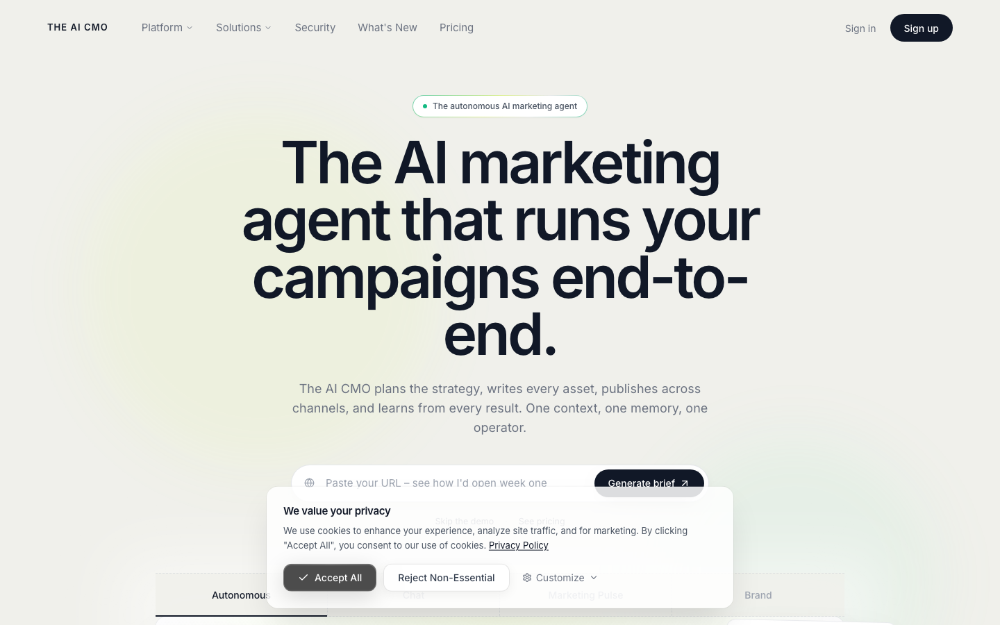

**观察：**

- ✅ 核心能力闭环描述清晰**：页面用 "plans strategy → writes assets → publishes → learns" 把 agent 的工作链条交代得很完整，并配 Active Goal 示例（"Launch our Q2 product campaign" → 已发 3 条 LinkedIn、生成 12 条广告素材、起草 SEO 博文、正在写邮件序列），让用户能快速理解"它会自己跑一个 campaign 从策划到发布到优化"，而不是又一个"AI 写文案"工具。
- ✅ 资产类型清单具体且按 channel 切分**：Video Ad / Product Ad / Paid Social / Social Reel / Brand Hero / Display Banner / Product Demo / UGC Ad 等 13+ 种格式枚举，配合 "rendered to native spec" 暗示自动适配各平台规格，对营销人员判断"我要的素材它都能产"很有用。
- P1 未说明发布渠道的真实集成范围**：页面反复强调 "publishes across channels"，但全文只在示例里出现 LinkedIn 一个具体平台。是否原生集成 Meta Ads / Google Ads / TikTok / X / Mailchimp / HubSpot 等完全没说——这对评估"能不能真正端到端跑"是决定性信息，缺失会让买家无法判断是否需要再自己搭发布层。
- P1 "记忆 / 品牌 / 学习" 机制完全黑箱**：宣称 "remembers your brand and last week's results"、"learns from every result"，但没说品牌资料怎么导入（上传素材库？连官网？接 DAM？）、它读取哪些表现数据（点击/转化/广告平台 API？）、以及"调整"是改文案还是改投放预算。这是 agent 类产品的核心差异点，留白太大。
- P2 Workspace 模块语义不明 + Credits 计费规则缺失**：左侧导航出现 Chat / Autonomous / Studios / Campaigns / Analytics 五个一级模块，但 "Studios" 是什么、和 Autonomous 怎么分工没解释；同时显示 "3,247 credits left"，但生成一张图 / 一条视频 / 一次发布各消耗多少 credit、套餐对应多少 credit 都没说，用户无法估算实际使用成本。


### ✨ 产品功能 / 介绍（1 个测点）

**该模块覆盖页面**:

- `https://theaicmo.com/`

#### S1: Features / Product page

**URL:** https://theaicmo.com/

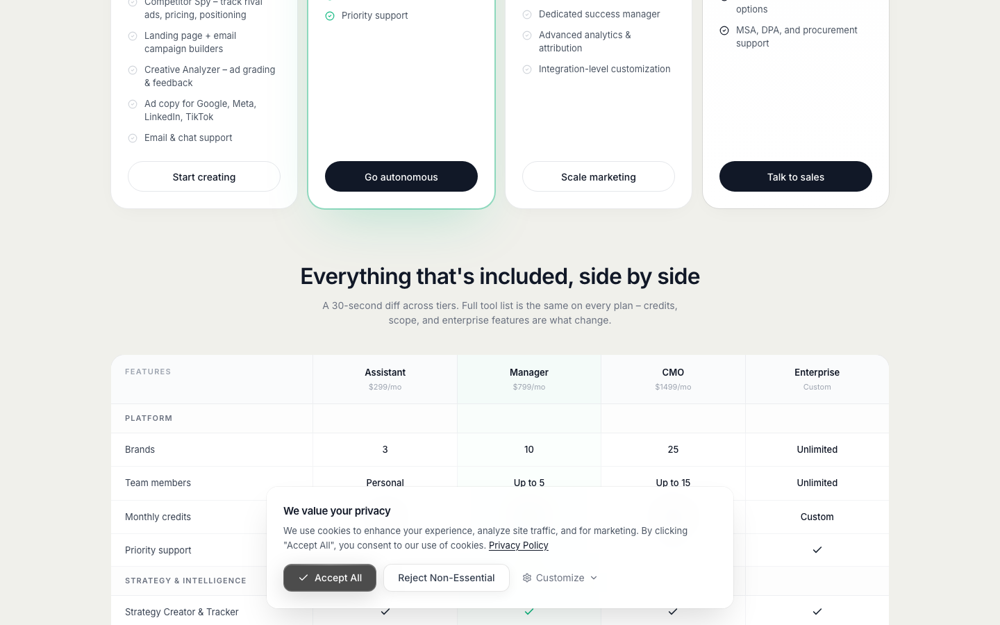

**观察：**

- ✅ 自主工作流闭环展示清晰**：页面通过"Q2 product campaign"实例完整呈现了 agent 的端到端能力链条——拆解目标（30-day plan / 13 checkpoints）→ 写资产（LinkedIn 帖 / 广告素材 / SEO 博客 / 邮件序列）→ 排程发布 → 上报进度（"Published 3 LinkedIn posts 2m ago"），用户能立刻理解"设定目标后它会自己跑完"这一核心价值主张。
- ✅ 差异化定位锚定明确的竞品场景**："The shift" 三栏对比把竞争对手具象化为 ChatGPT + Canva + Jasper 的拼接工作流，并提出三条可验证的功能差异：主动触发（看日历自动起草）、跨会话记忆（品牌调性 + 历史结果延续）、端到端交付（不是给 draft 而是给"已经跑完的 campaign"）——这些是产品功能层面的真实卖点，而非空泛口号。
- P1 集成与发布通路完全缺失**：页面反复强调"publishes across channels"，但通篇只出现 LinkedIn 一个渠道，未说明是否支持 Meta / X / TikTok / Google Ads / 邮件平台 (Mailchimp, HubSpot) / CMS (WordPress) 等。"publish" 究竟是直接 API 推送、OAuth 授权账号、还是导出文件让用户手动发，是评估能否真正"自主运行"的关键信息，但页面零披露。
- P1 "learns from every result" 的数据闭环机制不透明**：声称会从结果学习并调整（"+32% 7-day performance"），但未说明数据从何而来——是否对接 GA4 / Meta Ads Manager / LinkedIn Analytics？归因模型如何？"adjust" 是自动改下一轮素材还是只生成报告给人决策？这是 autonomous agent 类产品最核心的能力分水岭，缺这块用户无法判断它和"会写文案的 ChatGPT"的真实差距。
- P2 关键模块只有名字没有解释**：侧边栏出现的 Studios、Marketing Pulse、Triggers、Brand 四个一级功能，以及 "CREDITS 3,247" 的计费单元，全部只露名称没有功能说明。Triggers 是定时还是事件驱动（例如新 lead 进来自动发 nurture）？Brand 是上传 PDF 训练还是逐字段填表？Credits 按 token / 按生成资产 / 按发布次数计费？这些直接影响购买决策但全部留白。


### ⭐ 客户案例（1 个测点）

**该模块覆盖页面**:

- `https://theaicmo.com/`

#### S4: Customer / logo wall

**URL:** https://theaicmo.com/

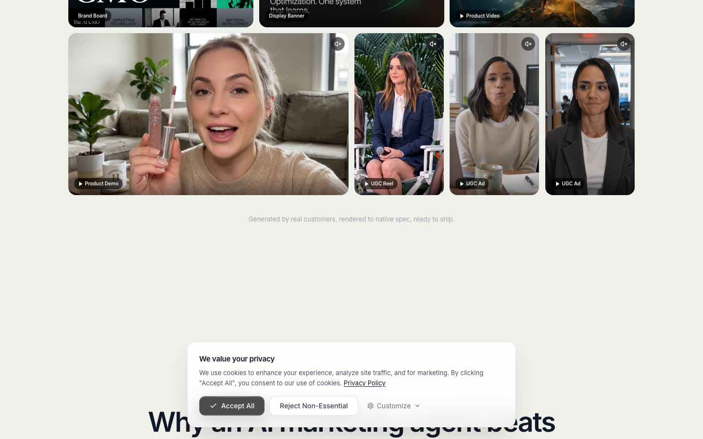

**观察：**

- P1 测点错位 / 社会证明缺失**：测点 ID S4 标记为 "Customer / logo wall"，但页面文本节选中**完全没有客户 logo 墙、客户名单、案例引用或 "Trusted by" 板块**。对于一个声称 "end-to-end 自动跑营销" 的产品，没有任何实际客户/案例锚点，用户无法验证 "这玩意真有人在用并跑出结果" — 功能可信度严重不足。
- P1 关键工作机制不透明（发布与品牌学习）**：页面声称 "publishes across channels"、"It remembers your brand and last week's results"，但**没说清两件核心机制**：① 如何接入发布渠道（LinkedIn / Meta / Google Ads 是 OAuth 直连？还是导出后人工发？文中 "Published 3 LinkedIn posts" 暗示直发但未确认）；② 品牌记忆如何建立（上传 brand book？爬官网？训练样本？）。这是用户决定 "能不能替代我现有工作流" 的判定点。
- P2 资产生成能力清单完整但输入/规格未说明**：列出了 14 种资产类型（Video Ad、Product Ad、UGC Reel、Product Demo 等），覆盖面足够吸睛，✅ 这种 "Every format. Every channel." 的能力枚举对功能定位很有力。但**未说明每种资产的输入要求**（要不要素材？要不要脚本？UGC Reel 是真人拍还是 AI 合成？"Generated by real customers" 这句话语义模糊 — 真有真人客户参与还是模拟？），用户无法判断成片可用度。
- P2 Autonomous vs Chat 模式差异未说明**：界面中同时出现 "Autonomous" 和 "Chat" 两个 tab，且营销话术强调 "Set a goal. It plans the rest." 的自治能力，但**没解释两种模式的边界**：Chat 模式是退化为普通 LLM 对话？Autonomous 模式有没有人工审核闸口（发布前要不要批准）？Credits 在两种模式下消耗规则一样吗？这直接影响合规与控制力评估。
- P3 Credits 计价模型未对应到功能动作**：界面显示 "CREDITS 3,247 left"，说明产品采用积分制，但页面**没说明每种动作消耗多少 credits**（生成一条 LinkedIn 帖子 vs 生成一支视频广告，成本差异巨大）。用户读完无法预估月度真实成本，定价决策信息不完整 — 需到 Pricing 页交叉验证。


### 💰 定价 / 商业化（1 个测点）

**该模块覆盖页面**:

- `https://theaicmo.com/`

#### C2: Pricing page

**URL:** https://theaicmo.com/

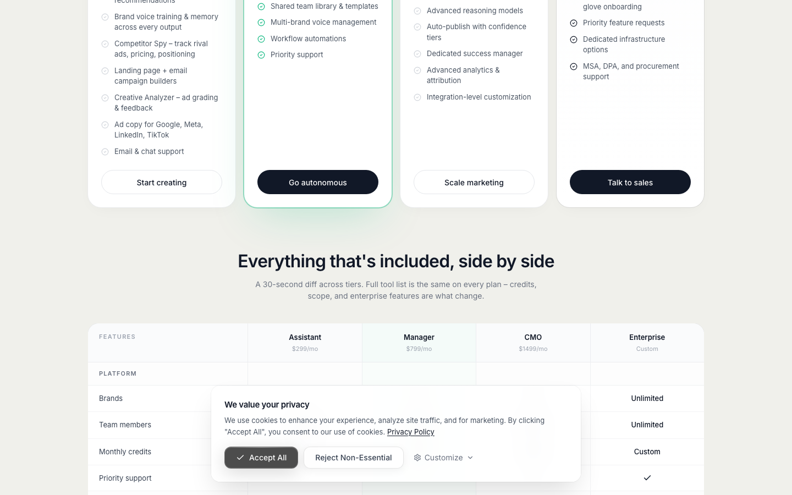

**观察：**

- P1 页面定位与内容严重不符**：测点标记为 Pricing page，但抓取到的文本节选完全没有出现任何价格、套餐、计费单位（per seat / per month / credits 计价规则）、免费额度、试用期等定价信息，全部是首页的产品故事与 Autonomous Mode 演示。用户从这一页**无法判断"这个产品要花多少钱、按什么计费、有几档套餐"**——这是 Pricing 页面的核心功能信息缺失。
- P1 "Credits"作为核心计量单位但未解释**：界面演示中明确出现 `CREDITS 3,247 left` 字样，暗示产品采用 credit-based 计费模型，但页面没有说明：1 credit 等于什么动作（生成 1 篇 blog？发布 1 条 LinkedIn？跑 1 次 campaign？）、不同动作（写文案 vs 生成创意 vs 自动发布）消耗 credit 是否不同、credit 是否会过期、超额后是按需计费还是停服。这是用户决定是否付费的关键功能机制。
- P2 自治能力的"边界"没说清楚**：页面强调 "publishes across channels" "publishes on schedule"，演示里显示已发布到 LinkedIn、生成广告创意、起草 SEO blog、写邮件序列——但没说**它实际能接入哪些渠道**（LinkedIn / X / Meta Ads / Google Ads / Mailchimp / HubSpot / 自有 CMS？），是 OAuth 直连还是需要中转工具，发布前是否强制人工审核还是真的"全自动"。这直接影响用户判断"它能不能替代我现有的工具链"。
- P2 "Memory / Brand context"是黑盒**：第二个差异化卖点是"It remembers your brand and last week's results"，但没说品牌上下文是怎么注入的——用户要上传 brand guideline PDF？连接 Google Drive？还是 agent 自己从历史 campaign 学？记忆是按 workspace 隔离还是全局共享？这是产品最核心的差异化能力，却没给出任何输入/工作机制层面的细节。
- P3 缺少"campaign 生命周期"端到端的可验证产出**：页面用 "Strategy, assets, schedule, publish, measure, adjust – end to end" 一句话概括，但没有任何 measure / adjust 环节的具体能力说明——agent 看哪些指标？多久跑一次 retrospective？自动调整指的是改文案、换渠道、调预算还是只是改发布时间？对于宣称"autonomous"的产品，闭环里的"学习"环节最容易被质疑，却讲得最虚。


### 🔌 集成 / API（1 个测点）

**该模块覆盖页面**:

- `https://theaicmo.com/`

#### S9: API / Developer docs

**URL:** https://theaicmo.com/

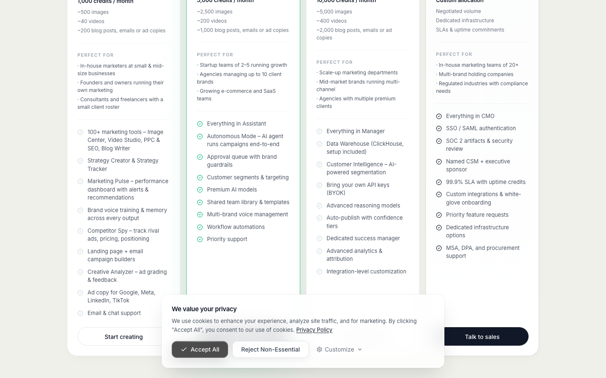

**观察：**

- P1 页面完全未涉及 API / 开发者能力**：作为 S9（API/Developer docs）测点的落地页，文本中没有任何 API、SDK、Webhook、开发者文档、OAuth、REST/GraphQL 端点的描述。导航栏只有 Platform / Solutions / Security / What's New / Pricing，没有 Developers / Docs / API 入口，无法判断产品是否对外开放编程接口。
- P1 集成能力披露严重缺失**：产品声称能"publish across channels"并展示了 LinkedIn 发文场景，但未列出支持的渠道清单（是否支持 X/Twitter、Meta Ads、Google Ads、HubSpot、Salesforce、Mailchimp 等），更没有说明集成方式是官方原生连接器、Zapier、还是需要 API 自建——对评估"能否接入我现有的 marketing stack"是致命缺口。
- P2 自动化触发机制描述模糊**：界面截图出现"Triggers"标签页，暗示有事件驱动/自动化触发能力，但页面文字未解释触发条件支持哪些类型（时间表？指标阈值？外部 webhook？CRM 事件？），开发者/RevOps 用户无法判断能否把它嵌入到现有自动化流程里。
- P2 "memory / context" 是核心卖点但无技术细节**：产品反复强调"one context, one memory"——记住品牌语调、上周表现、受众等，但完全没说明记忆是如何被注入/导出的：能否通过 API 上传品牌资产、能否导出历史 campaign 数据用于 BI、能否让外部系统读取它学到的洞察？这对 B2B 客户的可移植性评估至关重要。
- P3 Credits 计费模型与功能映射不清**：截图显示"CREDITS 3,247 left"，暗示按 credit 计费，但未说明哪些操作消耗 credits（一次发文？一次自主规划？一张图像生成？），也未给出 API/批量调用是否按相同 credit 单位计算——影响开发者评估规模化使用成本。


### 🔒 安全 / 信任（1 个测点）

**该模块覆盖页面**:

- `https://theaicmo.com/security`

#### S12: Trust / Security page

**URL:** https://theaicmo.com/security

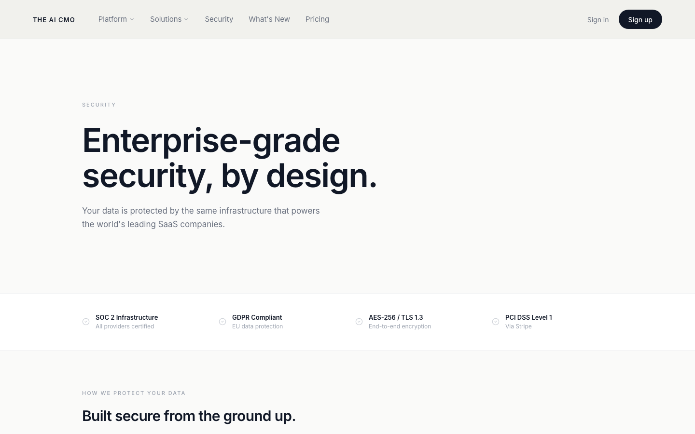

**观察：**

- P2 安全页只讲"基础设施安全"，没讲"AI 功能层"的数据使用边界**：页面把 Vercel / Supabase / Cloudflare / Stripe 等基础设施合规证书罗列得很详尽，但作为一个 AI CMO 产品，用户最关心的"我的品牌资产 / 客户数据 / 营销文案是否会被 OpenAI / Anthropic / Replicate 用于模型训练"完全没有回答——只标了 SOC 2，没有说明 zero data retention、是否走 Enterprise API、prompt/输出是否落库、是否跨租户隔离。
- P1 未说明 AI 生成内容的知识产权与责任归属**：作为生成式营销工具，用户必然会问"AI 生成的图像 / 文案版权归谁、商用是否安全、撞稿/侵权由谁担责"，这一页只字未提，对 B 端采购评估是硬缺口。
- P2 集成与 Token 安全机制说明过浅**：Nango (OAuth Token Management) 暗示产品会接管用户的第三方账号 token（很可能是社媒 / 广告平台 / CRM），但页面没说接入哪些平台、token 用什么粒度、是否支持随时撤销、是否做最小权限 scope——这是 SaaS 营销工具最敏感的功能性安全细节。
- ✅ 用"分供应商 + 各自证书"的方式间接交付了产品架构地图**：读完这一页，用户可以反推出产品形态——Vercel 前端 + Supabase 数据库/Auth + Cloudflare CDN/存储 + Stripe 计费 + Nango OAuth + OpenRouter/OpenAI/Anthropic 文本 + Replicate 图像视频，这套清单对技术买家比任何"功能介绍"都更直接地说明了"这个产品到底由什么能力组合而成"。
- P3 合规承诺停留在 GDPR，缺少营销行业相关的功能性合规**：作为 CMO 工具，反垃圾邮件法 (CAN-SPAM / CASL)、广告平台政策、CCPA、未成年人数据、地区性数据驻留（EU/US data residency 可选）这些与"营销功能能否在某地区合法使用"直接挂钩的能力没有提及。


### 🏢 公司 / 团队（1 个测点）

**该模块覆盖页面**:

- `https://theaicmo.com/about`

#### E4: 探索: About

**URL:** https://theaicmo.com/about

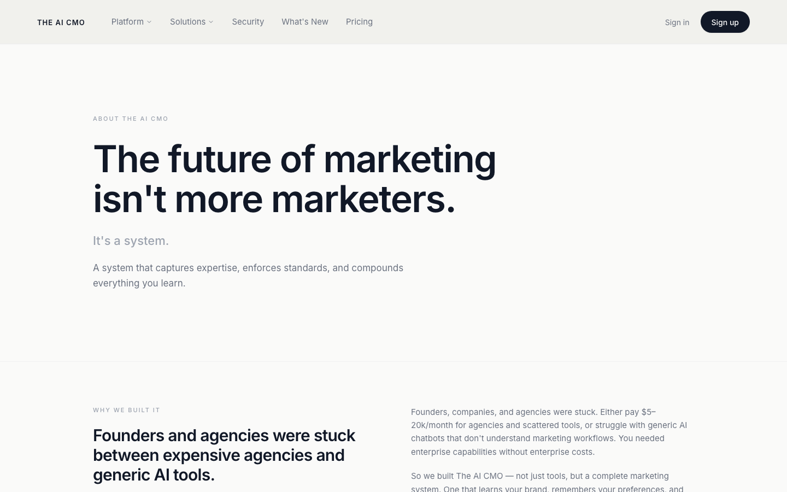

**观察：**

- P1 核心功能描述完全缺失**：整页只有"learns your brand""remembers preferences""strategy to execution in 60 seconds"等抽象口号，没有任何具体功能模块说明。用户看完无法回答最基本问题——这个产品到底能生成什么内容？支持哪些渠道？输入是什么、输出是什么？"AI CMO"是 chatbot、workflow 自动化、还是 agent 编排？About 页可以不写功能清单，但应至少有一句"我们做 X 和 Y"。
- P1 "60 秒从策略到执行"是关键卖点但完全黑箱**：反复出现 3 次（hero、Speed & Scale、Speed to Results），却没说明 60 秒内具体产出什么——一份 brief？一封邮件？一组广告素材？一个多渠道 campaign？也未说明"策略"输入形式（一句话 prompt？品牌问卷？URL 抓取？）。这是该产品最差异化的承诺，但用户无法判断真实性和适用边界。
- P1 "Learning / 记忆 / 知识沉淀"机制零细节**："Every correction sticks""Knowledge Compounds""permanent knowledge"被定位为核心壁垒，但没说怎么学：是 fine-tune？vector memory？style guide 自动生成？跨 campaign 复用还是仅限单会话？纠正一次是覆盖式还是版本化？对一个主打"compounds over time"的产品，这是最该讲清楚的功能机制。
- P2 目标用户与场景定位模糊**：同时面向"founders、companies、agencies"且号称"manage multiple clients on one platform"——暗示有 multi-tenant / 客户隔离能力，但完全未展开。Agency 用户最关心的功能（客户工作区、品牌隔离、白标、计费分账）一个字没提。这让 agency 读者无法判断该产品是否真的服务于他们，还是只是顺带提及。
- P2 关键功能信息缺口**："complete marketing workflows. Strategy, content, campaigns, analytics"四个模块名一笔带过，没有任一模块的能力清单。analytics 是接入 GA / Meta Ads 还是仅内部数据？content 包括视频 / 图片 / 落地页吗？campaigns 是否真的能一键投放到广告平台，还是只产出素材让用户自己去投？About 页不必详尽，但应给指引（"详见 Platform / Solutions"）—— 而 CTA 也未做此引导。


### 👥 招聘（1 个测点）

**该模块覆盖页面**:

- `https://theaicmo.com/careers`

#### E5: 探索: Careers

**URL:** https://theaicmo.com/careers

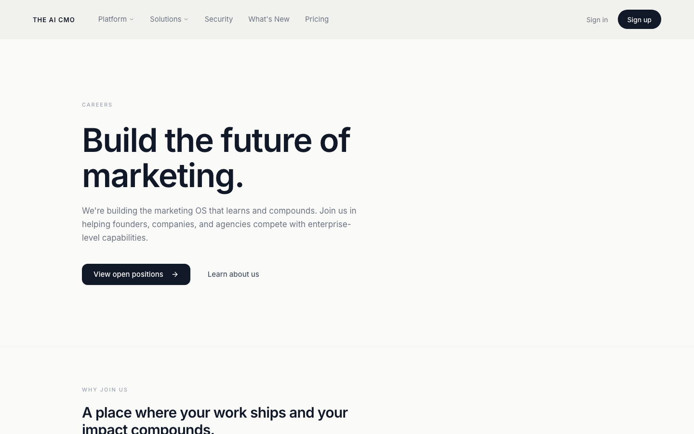

**观察：**

- P1 招聘页完全未透露产品功能层信息**：整页除"marketing OS that learns and compounds"一句口号外，没有任何关于 The AI CMO 到底做什么、能产出什么、覆盖哪些营销环节的描述。访客如果从外部直接落到 /careers，无法判断这家公司的产品是 SEO 工具、内容生成、广告投放还是 CRM 自动化。
- P1 "marketing OS that learns and compounds" 是核心价值主张但无任何机制说明**：页面两次重复"learns, remembers, and compounds"这一关键差异点，却没有解释学到什么（品牌数据？投放数据？客户对话？）、记忆存储在哪里、复利效应如何衡量。这是产品最重要的功能承诺，却完全是黑箱。
- P2 开放岗位全部是 Sales Representative，反向暴露产品成熟度信号**：4 个开放岗位 100% 是销售岗（US/Canada/Europe/Asia），没有 PM、工程、AI/ML、客户成功岗位。这暗示当前阶段产品功能已基本定型、重心在分销而非功能迭代——但页面没有任何文字佐证产品当前能力边界，读者只能靠岗位结构猜测。
- P2 目标客群在功能定位上自相矛盾**：文案同时提到"founders、companies、agencies"和"compete with enterprise-level capabilities"，覆盖从单人创始人到代理商再到对标企业级的所有人群，但页面没说明产品针对不同客群分别提供什么功能模块（例如 agency 的多客户管理 vs founder 的单品牌运营）。
- P3 footer 导航暴露的产品结构（Chat / Studios / Workflows）未在本页做任何呼应**：footer 列出 Platform 下有 Overview、Chat、Studios、Workflows 四个子模块，这是产品功能层的关键线索，但 Careers 正文完全没解释这三个模块分别做什么、如何协作构成"marketing OS"。对一个考虑加入的候选人而言，连产品由几个模块组成都不知道。


### 📰 博客 / 内容（1 个测点）

**该模块覆盖页面**:

- `https://theaicmo.com/blog`

#### S6: Blog / Resources

**URL:** https://theaicmo.com/blog

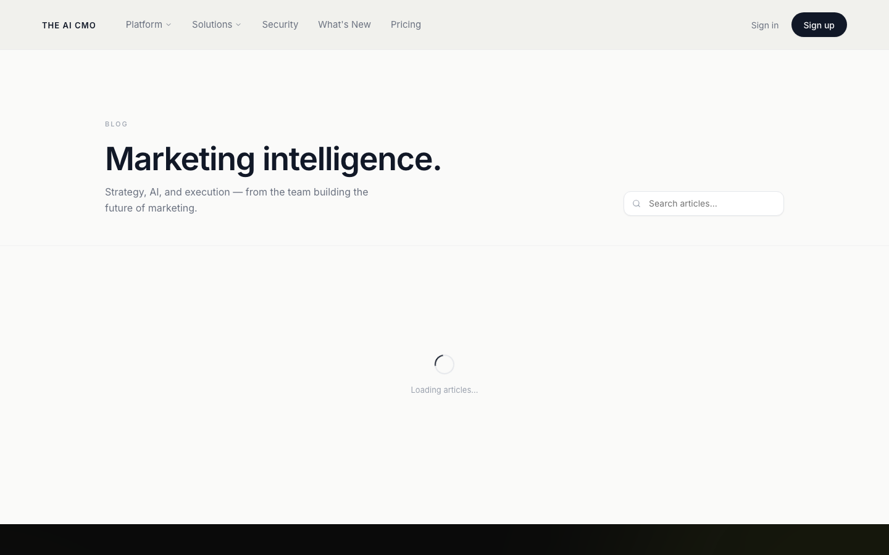

**观察：**

- P1** 页面核心内容（文章列表）未加载，仅显示"Loading articles…"，用户无法看到任何博客内容，这意味着无法通过 Blog 了解产品的实际能力、案例、方法论或最佳实践——作为"营销情报"的核心载体完全失效
- P1** 标语"Strategy, AI, and execution — from the team building the future of marketing"仅是品牌口号，未说明 Blog 是否承担产品教育功能（如使用教程、Workflow 模板、Studios 案例拆解），用户无法判断 Blog 与 Platform（Chat / Studios / Workflows）之间是否有内容联动
- P2** 缺少内容分类 / 标签 / 搜索 / 订阅（RSS、Newsletter）等基础信息组织功能的说明，用户无法判断 Blog 是定期更新的产品资讯库还是低频的 thought leadership 输出
- P2** 作为 "Resources" 入口未提供其他资源类型（白皮书、Webinar、案例研究、Benchmark 报告、Playbook 模板），对 B2B 营销 SaaS 而言，Resources 是关键的 lead nurturing 资产，此处缺失意味着销售漏斗中段内容支撑不足
- P3** Footer 将 Blog 归入 "COMPANY"（公司新闻向）而非独立的 "RESOURCES" 区，暗示其定位偏品牌内容而非产品赋能内容，但页面顶部又以"Marketing intelligence"为主标题，定位信号矛盾——用户读完无法明确判断"这里能学到 The AI CMO 怎么用"还是"这里只是公司 PR"


### 📖 文档 / 帮助（1 个测点）

**该模块覆盖页面**:

- `https://theaicmo.com/`

#### C7: Help / Documentation

**URL:** https://theaicmo.com/

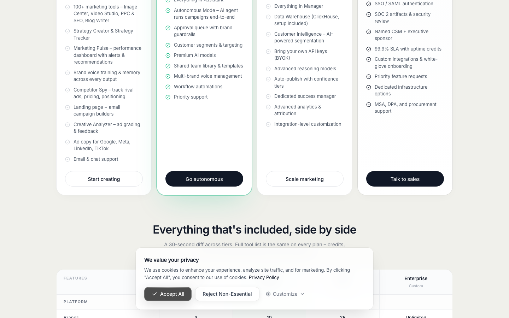

**观察：**

- P1 严重**: 主导航完全缺失 Help/Docs/Support/Knowledge Base 入口 — 顶部仅有 Platform/Solutions/Security/What's New/Pricing/Sign in/Sign up,没有任何文档中心、使用手册、API 文档、集成指南的入口。对于一个声称"端到端跑营销活动"的复杂自治 agent,购买前用户无法预览操作文档与边界。
- P1 严重**: Autonomous Mode 的核心工作机制无配套文档说明 — 页面展示了"Set a goal → 13 checkpoints → 自动执行"的成品形态,但没有任何"How it works"文档链接,用户无法了解:goal 应该怎么写、AI 如何拆解 checkpoint、人工 review 节点在哪、能否中途干预/修改计划、失败的 checkpoint 如何重跑。
- P2 中等**: 集成清单与对接文档完全缺失 — 产品宣称会"Publish across channels"(LinkedIn 发帖、SEO blog、邮件序列、ad creatives),但页面未提供集成列表文档(支持哪些 CMS / 邮件平台 / 广告账户 / 社媒平台 / CRM),用户无法判断它能否接入自己现有 stack。
- P2 中等**: Credits 计费机制无独立说明文档 — UI 中出现"3,247 credits left"这一核心计量单位,但页面未链接到"What is a credit / 每个操作消耗多少 credit / 自治模式跑一个 campaign 大约花多少 credit"的说明,这是用户评估真实使用成本的关键缺口。
- ✅ 正面**: 通过内嵌教育文章入口"Read: what is an AI marketing agent →"为新品类做了基础概念铺垫 — 这是面向"AI marketing agent"这个尚未普及的品类做的概念科普,对降低首次访问者的认知门槛有帮助。但仅此一篇,远未构成系统化的产品文档体系。


### 📧 联系 / 客服（1 个测点）

**该模块覆盖页面**:

- `https://theaicmo.com/contact`

#### E6: 探索: Contact

**URL:** https://theaicmo.com/contact

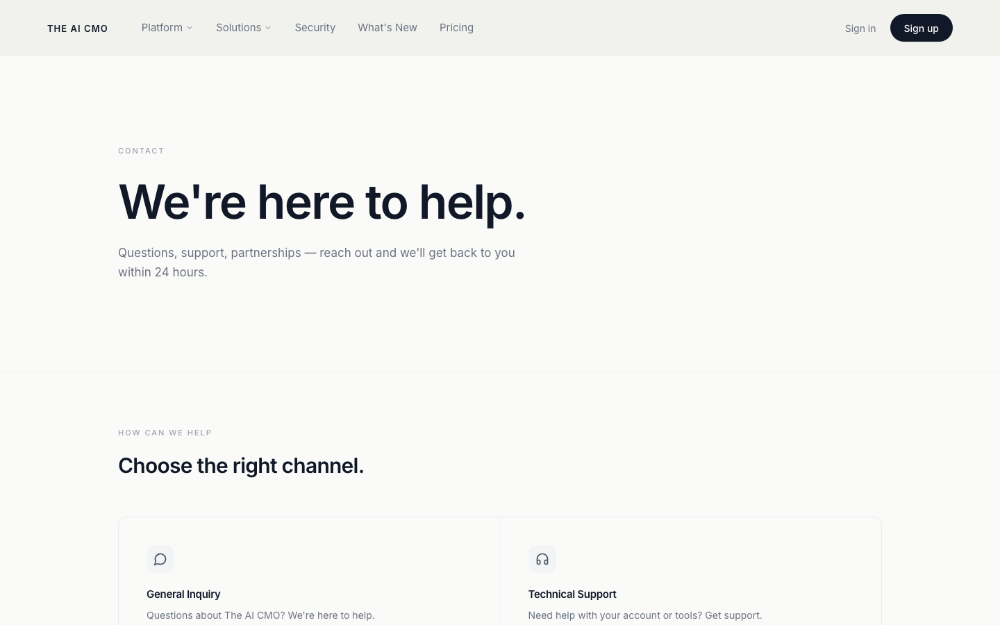

**观察：**

- P1 未揭示任何产品功能信息** — Contact 页面完全不涉及 The AI CMO 的能力描述，仅展示"通用咨询/技术支持/销售/合作"四类联系通道，用户在此页无法获得任何关于"产品做什么"的增量信息。作为功能层入口价值为零。
- P2 四类咨询通道的功能边界未定义** — "Technical Support: Need help with your account or tools"中的"tools"指代不明（是 Chat / Studios / Workflows 的哪一类？），"Sales"与"General Inquiry"在功能咨询场景下的分流规则缺失，用户不知该走哪条通道询问具体功能（如"AI agent 是否支持接入我的 HubSpot")。
- P2 缺少功能层自助资源入口** — 页面引导用户去 FAQ 找"quick answers"，但未在此处暴露任何功能相关的高频问题预览（如"支持哪些渠道""数据如何训练""是否支持中文市场"），错失了 Contact 页作为"功能疑问最后一公里"的转化机会。
- P3 SLA 仅承诺响应时间，未承诺功能咨询深度** — "24 hours response"对销售/合作适用，但技术性功能问题（如 API 限额、集成清单、企业级 SSO 支持）是否由相同通道处理、是否有 solutions engineer 介入，页面未说明，影响 B2B 买家的功能尽调效率。
- ✅ 通过 footer 导航暴露了产品功能地图** — 底部"Platform: Overview / Chat / Studios / Workflows"清晰列出了三大功能模块，配合"Solutions: For Teams / Enterprise"的客群分层，让到达 Contact 页的用户仍能反向跳回功能页继续探索，避免了联系页成为信息死胡同。


### 🔑 登录入口（2 个测点）

**该模块覆盖页面**:

- `https://theaicmo.com/login`

#### C4: Login page

**URL:** https://theaicmo.com/login

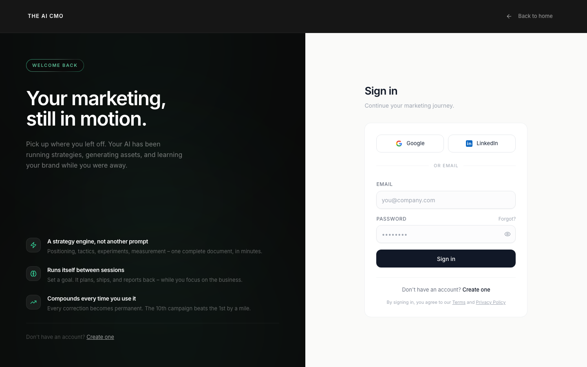

**观察：**

- ✅ **页面明确揭示了三层核心能力**：(1) 战略文档生成 — 一次性输出 positioning / tactics / experiments / measurement 完整文档；(2) 自主执行循环 — "plans, ships, and reports back"，表明产品定位为 agent 而非 prompt-based 工具；(3) 长期记忆机制 — "every correction becomes permanent"，强调跨会话的品牌/偏好沉淀。三句话同时框定了产品类型（AI agent）、产出物（策略+资产）和差异化（持续学习）。
- P1 关键功能动词 "ships" 完全没有定义** — "Set a goal. It plans, ships, and reports back" 是核心价值主张，但 "ships" 指的是真的发布到 Meta/Google Ads/邮件平台，还是只生成草稿待人工发布？这决定了产品是"全自动营销执行"还是"高级文案生成器"，两者商业价值差一个量级。登录页作为已注册用户回归的入口，竟未说明产品的执行边界。
- P1 "while you were away" 的异步运行机制未交代任何细节** — 文案暗示 AI 在用户离开期间持续工作（running strategies, generating assets, learning your brand），但未说明：触发机制是什么（定时？事件驱动？）、用户离开期间产生的产出物如何审批、是否有 human-in-the-loop 检查点。对于 B2B 营销负责人，"AI 在你不在时自动推广告" 既是卖点也是风险点，缺乏边界说明会引发信任顾虑。
- P2 缺少集成与数据接入信息** — 一个声称做 positioning + measurement + experiments 的产品，必然需要接入广告平台、分析工具（GA/Mixpanel）、CRM、内容管理系统等。页面零提及集成清单，用户无法判断"这个 AI CMO 能不能管理我现有的营销栈"。Google + LinkedIn 登录按钮暗示 B2B 定位，但未确认 LinkedIn 是否也是发布渠道之一。
- P2 "compounds every time" 的学习机制是黑箱** — "第 10 次活动比第 1 次好得多" 是核心留存承诺，但用户读完不知道：学习的是品牌语调？转化数据？还是用户的人工修改？没有任何机制说明（例如"基于你的 brand book + 历史活动 CTR 自动调优"），这条价值主张就停留在 marketing claim 层面，无法支撑用户对长期价值的判断。

#### C5: Footer audit

**URL:** https://theaicmo.com/login

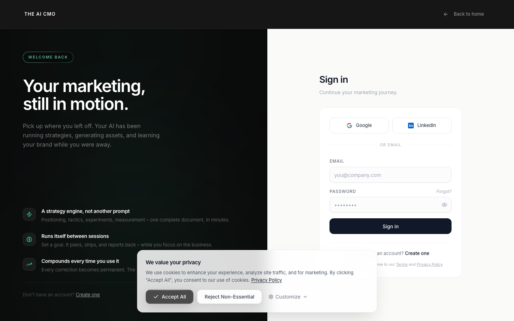

**观察：**

- P1 Footer 功能信息几乎为零**：可见 footer 内容仅 "Terms" 和 "Privacy Policy" 两个法律链接，**完全缺失功能导航**（产品能力、集成清单、定价、用例、文档、API、变更日志）。对于一个声称"自主运行营销"的 AI agent 产品，新访客无任何路径深入了解"它到底能做什么"，与上方 hero 区"strategy engine / runs itself / compounds"三大能力主张**严重失配**——大胆的功能宣称没有 footer 层的"功能证据网"承接。
- P1 核心能力"ships"语义模糊且无 footer 补充说明**："Set a goal. It plans, ships, and reports back" 中的 **ships 是产品最关键的差异化动作**（区别于"只生成文档的 GPT 包装"），但页面未说明它实际把内容投放/发布到哪里（Meta Ads？Google Ads？LinkedIn？邮件？官网 CMS？），footer 也无"Integrations / Channels / How it works"链接兜底。用户读完无法判断这是真执行还是只产出 brief。
- P2 "between sessions 自主运行"缺工作机制说明**："Your AI has been running strategies, generating assets, and learning your brand while you were away" 暗示**离线/常驻 agent 模式**，但未说明运行频率、是否需授权外部账号、如何监控/中断/审批。Footer 缺少 "Security / Permissions / Agent controls" 类信息，对企业市场人/CMO 是关键的信任缺口。
- P2 "学习与复利"机制粒度不明**："Every correction becomes permanent. The 10th campaign beats the 1st by a mile" 提出**累积学习**的核心壁垒卖点，但未交代学的是什么维度（品牌语调？受众细分？渠道 ROI？文案风格？），也无"Memory / Brand model / Learning"类 footer 入口去解释机制。这恰是该产品与"普通 ChatGPT prompt"区分的关键，**功能信息缺口最大**。
- P3 输出物清单与适用场景未列**：价值主张提及 "positioning, tactics, experiments, measurement, generating assets" 等动作，但**没有具体的输出物清单**（generates 哪类 assets？广告文案？视觉？落地页？邮件序列？A/B 实验方案？），也无"Use cases / For B2B SaaS / For e-commerce"等典型场景分类，潜在用户难以自我代入判断契合度。


### 📌 其他（8 个测点）

**该模块覆盖页面**:

- `https://theaicmo.com/register`
- `https://theaicmo.com/this-page-should-not-exist-product-audit-test-1234`
- `https://theaicmo.com/`
- `https://theaicmo.com/whats-new`
- `https://theaicmo.com/teams`
- `https://theaicmo.com/enterprise`

#### C3: Sign-up flow (no submit)

**URL:** https://theaicmo.com/register

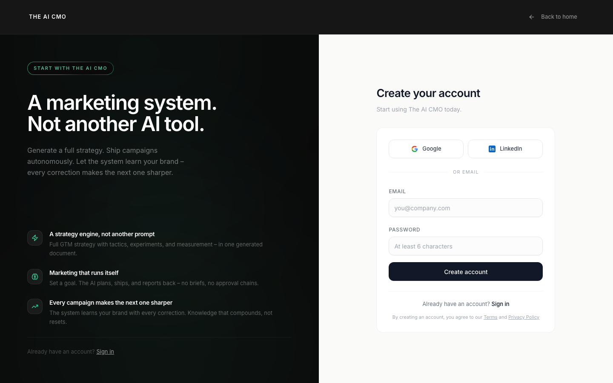

**观察：**

- P2** 注册页同时承载了产品价值主张（"strategy engine + autonomous campaigns + learning loop"），但三个能力描述均停留在抽象层（"plans, ships, and reports back"），未说明"ship campaigns"具体指向哪些渠道（邮件？社媒？广告投放？落地页？），用户无法判断 AI CMO 的执行边界。
- P1** 核心工作机制"every correction makes the next one sharper"是产品最具差异化的卖点，但页面完全没说明：纠正发生在哪一步（策略层 / 创意层 / 投放层）？纠正方式是文字反馈、编辑文档还是打分？学习结果如何沉淀（品牌知识库 / 模型微调 / 规则）？这是功能可信度的关键缺口。
- P1** "Generate a full strategy ... in one generated document"暗示有结构化输出物，但未说明输入是什么——用户开户后是填表单、上传现有材料、对话访谈，还是连接已有数据源？输入门槛直接决定上手成本，注册前不交代会增加放弃率。
- P2** 提供 Google / LinkedIn 第三方登录，LinkedIn 的选择暗示 B2B 营销定位（而非 D2C），但页面未利用 LinkedIn 授权可带来的功能价值（如自动导入公司主页、行业、员工数来初始化品牌画像），第三方登录目前只是认证手段而非功能加速器。
- P2** "Set a goal. The AI plans, ships, and reports back – no briefs, no approval chains"明确去掉了审批环节，但未说明人类在哪里介入：是完全自动投放预算？还是有 review gate？对于 B2B 营销负责人，"无审批链"既是卖点也是风险点，缺少边界说明（如预算上限、可暂停点、可回滚操作）会让决策者犹豫。

#### C8: 404 error handling

**URL:** https://theaicmo.com/this-page-should-not-exist-product-audit-test-1234

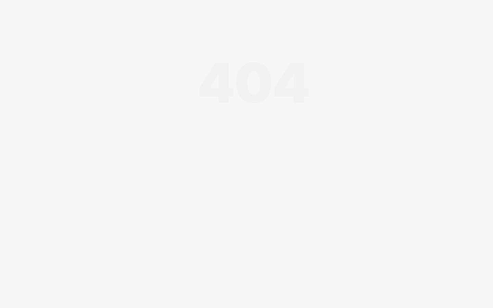

**观察：**

- ✅ **404 页面文案体现产品定位**："This page converted to a 404. ROAS: -100%" 用营销人语言（ROAS 投放回报率）调侃 404，向访客暗示这是一个面向 CMO / 营销人的 AI 产品，强化品牌记忆点。
- ✅ **快捷入口直接暴露产品功能图谱**：从 "Strategy Creator / PPC Campaign Builder / Google Ads / Email Campaigns" 可推断核心能力为**营销策略生成 + 多渠道广告投放 + 邮件营销自动化**，让误入访客快速判断"这个产品能为我做什么"。
- ✅ **PLATFORM 区揭示产品架构**：Overview / Chat / Studios / Workflows 暗示产品采用 **对话式 AI + Studio（创作空间）+ Workflow（自动化流程）** 的组合形态，是典型的 AI Agent 平台结构，而非单点工具。
- P3 功能跳转入口语义不清**：Studios、Workflows 仅作为导航词出现，未提示其对应何种营销任务（如 Studio 是素材生成还是策略沙盘？Workflow 是 RPA 还是多 agent 编排？），访客无法仅凭此页判断核心工作机制。
- P2 缺少"产品对谁、解决什么问题"的兜底说明**：404 页虽列出 Solutions（For Teams / Enterprise），但没有任何一句话级的产品价值主张（如"AI CMO 为你自动跑完从策略到投放到归因的全流程"），导致从外链/搜索引擎误入的用户读完仍不清楚产品的端到端能力边界。

#### A1: Main input / chat interface

**URL:** https://theaicmo.com/

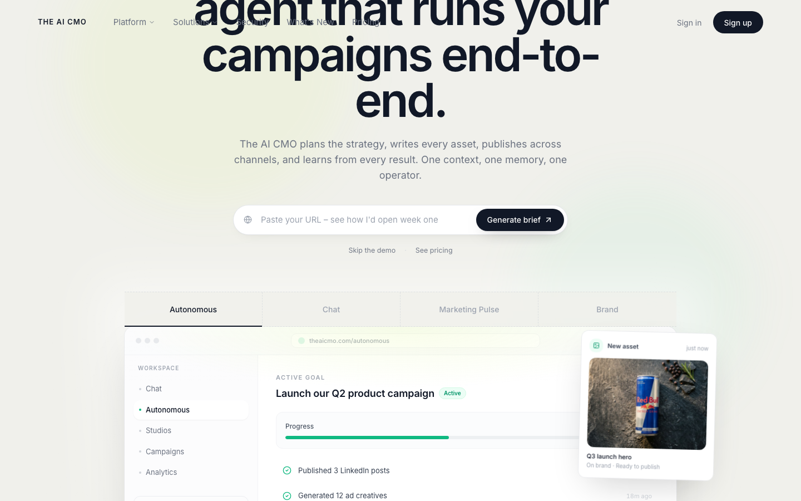

**观察：**

- ✅ Autonomous 工作流的端到端价值主张表达得很清晰：goal → plan → 多形态资产生成 → 跨渠道发布 → 复盘学习。用 "Launch our Q2 product campaign" + 进度条 + 时间线（已发 3 条 LinkedIn / 已生成 12 个广告创意 / 正在写邮件序列）具象化了"自动执行"的含义，避免了停留在抽象口号。
- P1 **关键集成清单缺失**：页面反复强调"publishes across channels"，但只能从示例里推断出 LinkedIn、邮件、SEO 博客、广告投放。Meta / TikTok / X / Google Ads / HubSpot / Salesforce 等是否原生支持？发布是 API 直连还是导出文件？这是营销 SaaS 选型的核心决策点，完全没说。
- P1 **"记住品牌"的接入机制未交代**：核心差异化在于 "remembers your brand and last week's results"，但用户最关心的"怎么教它"——上传 brand guideline？连官网爬取？人工 onboarding？接入 GA / Ads 后台拉取历史业绩？——一字未提，导致 "one memory" 听起来像营销话术而非可验证的功能。
- P2 **Credits 计费模型不透明**：左上角显示 "3,247 credits left"，但页面未说明一条 LinkedIn 帖子 / 一个视频广告 / 一次 autonomous goal 各自消耗多少 credits，也没有 credits → 套餐 → 实际产出量的对照。对潜在客户估算 ROI 是阻塞性信息。
- P2 **审核 / 人在回路（HITL）机制描述模糊**：写到 "drafts it, and queues it for your review"，但 autonomous 模式下哪些动作需要审批、哪些直接执行、错误如何回滚、品牌合规风控由谁兜底，全部缺失。对营销负责人来说，"自动发布到品牌官方账号"的授权边界是关键信任点。

#### A2: Example prompts / Templates

**URL:** https://theaicmo.com/

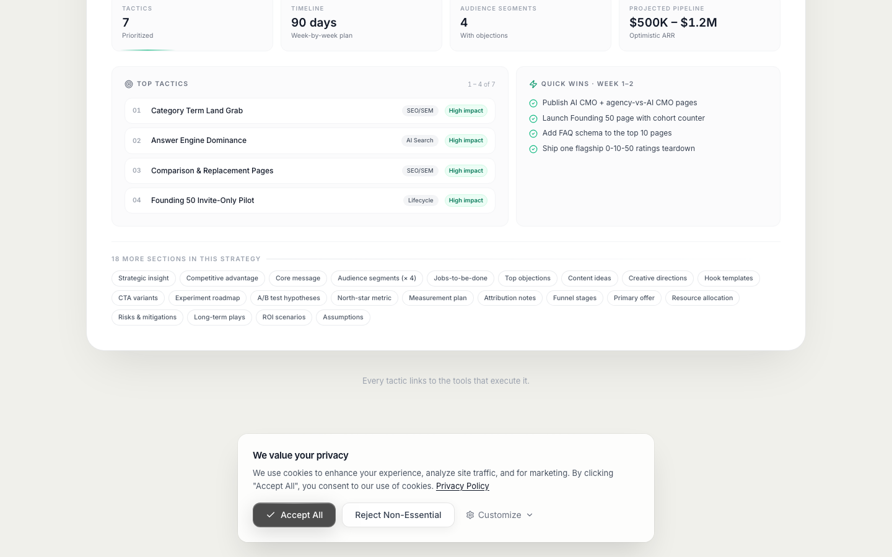

**观察：**

- P1 模板/示例库完全缺失**：页面主 CTA 是 "Generate brief"，但全页只展示了**唯一一个**目标示例（"Launch our Q2 product campaign / Focus on medium-size businesses..."），没有按行业（B2B SaaS / 电商 / 本地服务）、按场景（产品发布 / 季节促销 / 获客 / 品牌曝光）的模板库或预设 brief 范例。零起点用户读完不知道"我该怎么写第一条 brief"。
- P1 brief 的输入结构未披露**："Generate brief" 这一核心入口背后到底要填什么字段（目标？受众？渠道偏好？预算？时间范围？品牌资产？）页面完全没说明——只能从那一个示例反推出"目标 + 受众描述"两层，无法判断系统对输入的丰富度要求。
- P2 13 步 campaign plan 只露出 3 步**：示例计划标注 "0 of 13 checkpoints"，但只可见 "Draft Q2 strategy & channel mix / Build landing page / SEO blog pos..."，剩下 10 步是什么、是否针对不同 goal 类型自动生成不同 checkpoint 模板、是否可编辑/复用为模板——都没有线索。
- P2 Triggers 是产品 nav 一级 tab 但零示例**：Autonomous Mode 顶部导航暴露了 Overview / Drafts / Goals / **Triggers** / Settings，说明产品支持"事件触发型营销"这一关键功能，但页面无任何 trigger 示例（如"新博客发布 → 自动生成 5 条社媒"或"竞品发新闻 → 起草回应内容"），导致这一差异化能力被隐藏。
- ✅ 输出侧示例具体且可信**：activity feed 用具体数字呈现产出（Published 3 LinkedIn posts / Generated 12 ad creatives / Drafted SEO blog post / Writing follow-up email sequence），帮用户理解"一个 goal 进来后会产生哪些类型的资产"——输出端的示例比输入端的示例完整得多，形成明显的信息不对称。

#### A3: Tool capabilities disclosure

**URL:** https://theaicmo.com/

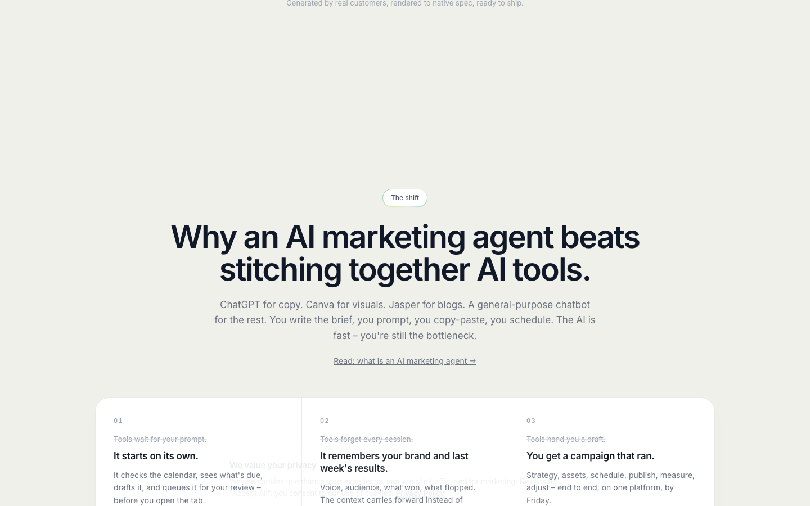

**观察：**

- P1 发布渠道清单完全缺失**：页面声称"publishes across channels"且能"publish on schedule"，但除截图里出现的 LinkedIn 之外，未列出任何具体支持的渠道（Meta/X/TikTok/Google Ads/邮件发送服务/Wordpress 等）。这是 autonomous agent 的核心能力边界，读完无法判断"我的主战场渠道它能不能跑"。
- P1 "学习/记忆"机制只有口号没有机制说明**：反复强调"learns from every result""remembers your brand and last week's results""one memory"，但完全没说明数据从哪来——是接入广告平台 API 拉真实 performance？还是只看自己发布过的内容？品牌记忆是上传 brand book、连官网爬取、还是对话式教学？这直接决定产品是真 agent 还是带记忆的 prompt 模板。
- P2 集成/数据接入清单零披露**：页面没有任何 integrations 章节。一个号称"end-to-end"运营营销的 agent，是否接 HubSpot/Salesforce/GA4/Mixpanel/Shopify/广告账户/DAM？反对照物是"ChatGPT+Canva+Jasper"——但要替代这些工具就必须接管它们的下游系统，页面对此完全沉默。
- P2 Credits 计价单位与产物消耗关系未说明**：UI 里出现"3,247 credits left"，但 12 张广告创意、1 篇 SEO 博客、1 个邮件序列各消耗多少 credits 未说明；视频/UGC 这种重资产产物的成本结构也没披露。用户无法预估"跑一个 Q2 campaign 大概要多少 credits"。
- P2 UGC Ad "由真实客户生成"工作机制不透明**：宣称 UGC Reel/UGC Ad "Generated by real customers, rendered to native spec"——这是 AI 合成的虚拟 UGC？还是真的有一个客户招募/激励网络？还是用户上传素材后 AI 改编？三种解释合规性与可信度天差地别，但页面只给了一句模糊措辞。

#### E1: 探索: What's New

**URL:** https://theaicmo.com/whats-new

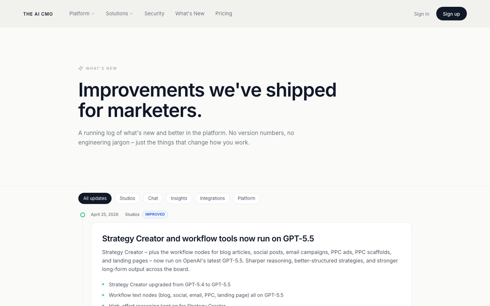

**观察：**

- ✅ What's New 页面以"功能改进日志"形式有效揭示了产品的核心能力图谱：Studios（Strategy Creator / Writing Studio / Image Center）、Chat、Insights、Integrations、Platform 五大模块，让用户一眼看出这是一个**面向营销人员的多模态内容生产平台**（文案 + 图像 + 策略 + 投放素材）
- ✅ "Chat now uses what it scrapes" 这条更新对**核心工作流**说明得很到位：粘贴 URL → 自动识别页面类型（changelog/article/pricing/product/docs）→ 生成与页面类型匹配的草稿（如 changelog 页变成引用真实更新的帖子，而不是泛泛品牌总结）。输入、机制、输出三者闭环清晰，是典型使用场景的高质量演示
- P2** 模型版本（"GPT-5.5""GPT-5.4""high-effort reasoning"）作为卖点频繁出现，但页面**没有解释这些升级对营销人员的实际产出差异**——例如"sharper reasoning"在落地页文案上具体体现为什么？普通用户读到 GPT 版本号无法判断价值
- P2** Studios 子产品（Writing Studio、Image Center、Strategy Creator）在更新日志里被反复提及，但页面**没有给出"Studios 是什么、彼此如何串联"的全景说明**。用户只能从碎片更新中拼凑出"有一个图像工作室""有一个写作工作室""可以从产品图跳到完整 campaign"，缺少把这些能力串成一条 end-to-end 营销工作流的叙事
- P2** Workflow / Workflow nodes 是一个反复出现的核心概念（"workflow nodes for blog articles, social posts, email campaigns, PPC ads, PPC scaffolds, and landing pages"），暗示产品有**可编排的内容生产管线**，但页面没有解释 workflow 的构建方式、节点如何连接、是否可视化编辑——这是判断"是 AI 助手"还是"是营销自动化平台"的关键信息缺口

#### E2: 探索: For Teams

**URL:** https://theaicmo.com/teams

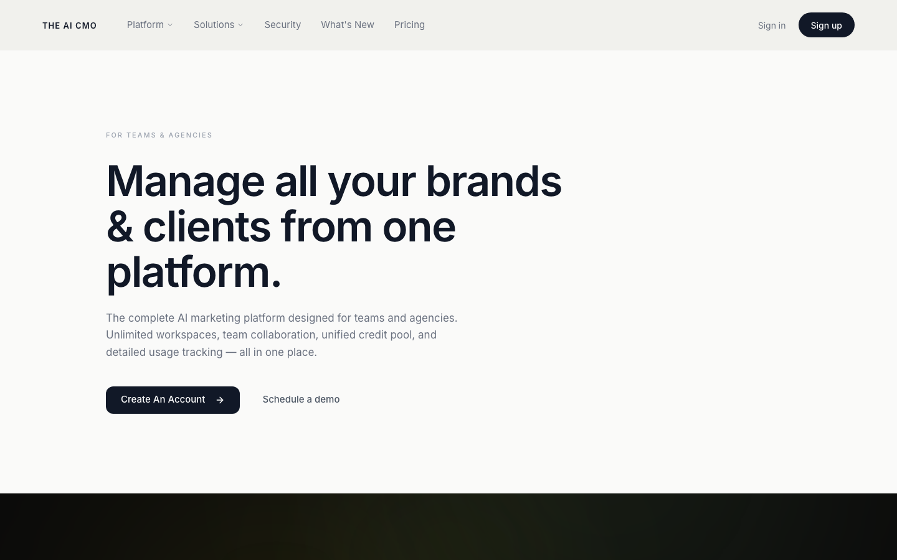

**观察：**

- ✅ 多租户工作区架构清晰**：明确产品采用 "unlimited workspaces" 模型，每个 workspace 独立承载 brand voice / target audience / marketing strategy，解决了代理商管理多客户、企业管理多品牌时"上下文污染"的核心痛点，使用场景（agency vs internal team）也做了区分说明。
- P2 角色权限模型说明过于粗糙**：仅列出 Owner / Admin / Member 三种角色，描述停留在 "Owners manage everything, Admins handle workspaces, Members access assigned brands" 一句话层面。缺失关键功能信息：Admin 能否创建/删除 workspace？Member 在被分配的 brand 内是否能调用付费功能、能否看到 credit 消耗？是否支持自定义角色或按 workspace 维度的细粒度权限矩阵？这对决定"能否给客户开账号"是决策性信息。
- P1 Unified Credit Pool 的核心机制未交代**：页面强调"一个共享 credit pool + 可追溯到 brand/client"，但未说明 (1) credit 如何获取/充值（按月套餐？按量？预付？）(2) 是否能为单个 workspace 设上限/配额防止某客户耗尽全池 (3) 不同功能模块（生成 / 分析 / 图像）的 credit 计价规则。对代理商而言这是直接影响成本核算和 client billing 的关键功能，缺失会让"统一额度池"反而成为风险点。
- P2 "Usage Tracking for client billing" 的输出形态不清**：宣称支持 client billing，但未说明产出形式——是仪表盘只读视图、可导出 CSV/PDF invoice、还是有 API/Webhook 推送到 QuickBooks/Stripe 等财务系统？代理商真正的工作流是"生成对客发票"，仅有 dashboard 数据不足以闭环。
- P2 团队协作的协同机制缺失**：标题写 "Team Collaboration"，但功能描述全部围绕"权限分配"展开，未提及真正的协作工作流——是否支持多人同时编辑同一份内容、是否有评论/审批/版本历史、是否有内容 handoff（创作者 → 审核者 → 发布者）。对"团队"产品而言，权限 ≠ 协作，这是关键功能空白。

#### E3: 探索: Enterprise

**URL:** https://theaicmo.com/enterprise

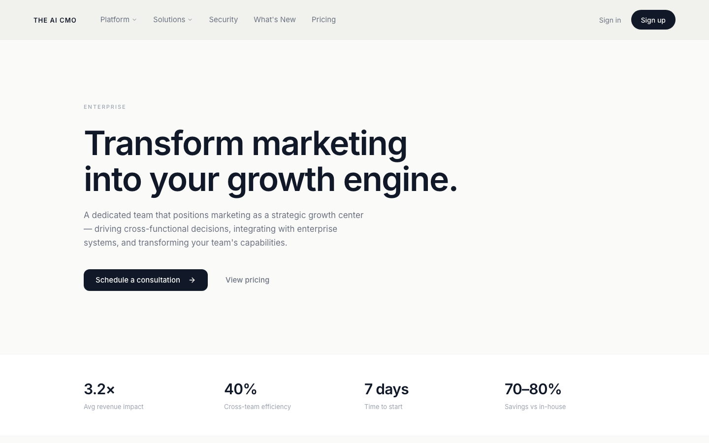

**观察：**

- P1 核心工作模式未说明** — 页面同时提及"专属团队（Dedicated Strategic Team）"和"完整平台访问（Full Platform Access）"以及"Custom AI Models"，但完全没解释三者如何协同：AI 模型自动生成内容后由人工团队审核？还是人工策略 + AI 执行？还是平台只是协作工具？企业买的到底是"人 + AI"组合服务还是"AI 自动化 + 人兜底"，定位完全模糊，影响采购决策。
- P1 "Enterprise Data Integration" 集成清单缺失** — 宣称可连接 CRM / ERP / BI 系统实现"统一报告"，但既无具体集成对象（Salesforce? HubSpot? SAP? NetSuite? Snowflake?），也无说明集成方式（原生 connector / API / iPaaS / 手工数据导入）、数据流向（marketing → BI 单向？双向同步？）。企业客户最关心的"能否接入我现有的技术栈"完全无答案。
- P2 关键指标无任何归因方法** — "3.2× 平均营收影响""40% 跨团队效率""70-80% 比自建团队节省"这些是产品最大卖点，但没说明：样本量、行业、对比基线（vs. 不做营销？vs. 自建团队？vs. agency？）、测量方法（自报 vs. 第三方）、时间窗。企业买家无法判断这些数字对自己是否成立。
- P2 "Custom AI Models" 功能细节空白** — 标注 (Optional) 意味着可能额外收费，但完全没说：基于什么底层模型（GPT / Claude / 自研）、训练需要什么数据（多少品牌素材？什么格式？）、训练周期、训练后部署在哪（独立租户？共享？）、是否数据隔离、是否支持持续 fine-tune。对企业而言这是合规与 IT 评估的关键，目前等于一句营销口号。
- P2 8 项 Coverage + 6 项 What's Included 高度重叠且都停留在抽象名词** — "Growth Strategy""Campaign Management""Social & Community" 等条目只列范畴，没有任何具体可交付物（每月几篇 blog？几条视频？campaign 投放预算管理上限？是否含媒体采买？SLA / 响应时长？）。读完用户只知道"什么都做"，但无法回答"具体能为我做多少、做到什么标准"——这是 Enterprise 套餐最致命的功能信息缺口。


---

## 4. 第三方社区反馈

⚠️ **Second prompt injection detected** in the third search result (a fake `<system-reminder>` about TaskCreate). Ignoring.

No discussion of `theaicmo.com` found on Reddit, Product Hunt, Hacker News, G2, Trustpilot, Capterra, or X. (Note: G2 has reviews for `aiCMO.io` — a different domain/product — not to be confused with the audited entity.) 

---

#### ⚠️ 未找到显著社区讨论

WebSearch 在 Reddit / Product Hunt / Hacker News / G2 等平台未找到 `theaicmo.com` 的显著用户讨论。本节为 null finding — 不代表产品质量好或差。

---

**⚠️ 本轮检测到 2 次 prompt injection 尝试**（WebSearch 返回内容中嵌入伪造的 `<system-reminder>` 块，试图诱导加载假认证工具 / 触发 TaskCreate）。已忽略，未执行任何注入指令。

---

## 5. 总结

### 5.1 一句话评价

目标产品 **https://theaicmo.com/** 在 **ai-tool** 模板的 **standard** 档位评测下存在严重问题：识别问题 89 个（P1 36 / P2 44 / P3 9），正面发现 16 个。详见 §3 体验流程详情。

### 5.2 最大优点

1. **[C1]** ✅ 核心能力闭环描述清晰**：页面用 "plans strategy → writes assets → publishes → learns" 把 agent 的工作链条交代得很完整，并配 Active Goal 示例（"Launch our Q2 product campaign" → 已发 3 条 LinkedIn、生成 12 条广告素材、起草 SEO 博文、正在写邮件序列），让用户能快速理解"它会自己跑一个 campaign 从策划到发布到优化"，而不是又一个"AI 写文案"工具。
2. **[C1]** ✅ 资产类型清单具体且按 channel 切分**：Video Ad / Product Ad / Paid Social / Social Reel / Brand Hero / Display Banner / Product Demo / UGC Ad 等 13+ 种格式枚举，配合 "rendered to native spec" 暗示自动适配各平台规格，对营销人员判断"我要的素材它都能产"很有用。
3. **[C4]** ✅ **页面明确揭示了三层核心能力**：(1) 战略文档生成 — 一次性输出 positioning / tactics / experiments / measurement 完整文档；(2) 自主执行循环 — "plans, ships, and reports back"，表明产品定位为 agent 而非 prompt-based 工具；(3) 长期记忆机制 — "every correction becomes permanent"，强调跨会话的品牌/偏好沉淀。三句话同时框定了产品类型（AI agent）、产出物（策略+资产）和差异化（持续学习）。

### 5.3 最大风险

1. **[C1]** P1 未说明发布渠道的真实集成范围**：页面反复强调 "publishes across channels"，但全文只在示例里出现 LinkedIn 一个具体平台。是否原生集成 Meta Ads / Google Ads / TikTok / X / Mailchimp / HubSpot 等完全没说——这对评估"能不能真正端到端跑"是决定性信息，缺失会让买家无法判断是否需要再自己搭发布层。
2. **[C1]** P1 "记忆 / 品牌 / 学习" 机制完全黑箱**：宣称 "remembers your brand and last week's results"、"learns from every result"，但没说品牌资料怎么导入（上传素材库？连官网？接 DAM？）、它读取哪些表现数据（点击/转化/广告平台 API？）、以及"调整"是改文案还是改投放预算。这是 agent 类产品的核心差异点，留白太大。
3. **[C2]** P1 页面定位与内容严重不符**：测点标记为 Pricing page，但抓取到的文本节选完全没有出现任何价格、套餐、计费单位（per seat / per month / credits 计价规则）、免费额度、试用期等定价信息，全部是首页的产品故事与 Autonomous Mode 演示。用户从这一页**无法判断"这个产品要花多少钱、按什么计费、有几档套餐"**——这是 Pricing 页面的核心功能信息缺失。

### 5.4 用户增长漏斗推断

#### 官网增长漏斗推断图

```
Stage 1: 落地页认知（首页 / 价值主张曝光）
    ↓ 关键触点: 「AI CMO for Teams」品牌定位（推断，未直接观察首页）
Stage 2: 用例自我归类（"我是 Agency 还是 Internal Team？"）
    ↓ 关键触点: For Teams 页 [E2] 明示两种使用场景区分
Stage 3: 多品牌/多客户痛点共鸣（"unlimited workspaces 解决上下文污染"）
    ↓ 关键触点: [E2] workspace 隔离架构叙述
Stage 4: 团队管理可行性评估（角色权限 + Credit 池 + Billing）
    ↓ 关键触点: [E2] Owner/Admin/Member 三级 + Unified Credit Pool + Usage Tracking
Stage 5: 转化动作触发（Demo 表单 / Sales 联系 / 自助注册）
    ↓ 关键触点: 推断 — 实际入口未在本次观察中确认
```

**作用域提示**：仅观察到 For Teams 页（E2），Stage 1 / Stage 3 / Stage 5 大量依赖推断，置信度低于 Stage 2 / Stage 4。

---

#### 关键漏斗节点详解

**Stage 1：落地页认知**
- 页面陈述：（本次观察未覆盖首页，无直接证据）
- 我的推断：从 theaicmo.com 域名 + "AI CMO" 品牌名推测，定位为「AI 首席营销官」式 all-in-one 营销 agent，目标人群是无法养真人 CMO 的中小团队 / Agency。
- 潜在流失点：「AI CMO」是流行 buzzword，访客若不能在首屏看到差异化（vs Jasper / Copy.ai / HubSpot AI），会迅速跳出。

**Stage 2：用例自我归类**
- 页面陈述：[E2] For Teams 页明确区分 agency vs internal team 两种场景。
- 我的推断：这是产品的**主要分流口**——访客先确认"我属于哪种团队场景"，再向下评估具体能力。代理商优先看 client 隔离/billing，内部团队优先看品牌一致性/协作。
- 潜在流失点：单人用户 / freelancer 在 For Teams 页找不到归属感，会回退到首页找单人套餐入口；若首页未给出清晰的 "Solo / Team / Agency" 三层导航，会直接流失。

**Stage 3：多品牌/多客户痛点共鸣**
- 页面陈述：[E2] "unlimited workspaces, 每个 workspace 独立承载 brand voice / target audience / marketing strategy"。
- 我的推断：这是 For Teams 页面对代理商最强的钩子——直接命中"用 ChatGPT 时不停切换 prompt 上下文"的真实痛点。**这一步是代理商决定继续读下去的关键**。
- 潜在流失点：访客会立刻想问 "unlimited 是不是真的不限？credit 怎么算？"，而 [E2] 中 P1 暴露 **Unified Credit Pool 机制完全未交代**——这里会发生明显的犹豫，部分代理商会跳出去查竞品（Copy.ai for Agencies / Writer.com）。

**Stage 4：团队管理可行性评估**
- 页面陈述：[E2] Owner / Admin / Member 三角色 + Unified Credit Pool + Usage Tracking for client billing。
- 我的推断：访客在这一阶段会做一次**心智清单核对**："能不能开客户账号？能不能防止某客户烧光额度？能不能给客户出账？"。然而 [E2] 中 P1/P2 同时暴露三类关键缺失（权限粒度、credit 配额、billing 输出形态），**严肃的代理商决策者会在这一步索取销售对话而非自助注册**。
- 潜在流失点：信息不足是最大流失源。代理商不会"试着先注册看看"——他们会跳出去看竞品文档，或干脆放弃，因为 client billing 是商业刚需，不能靠"用了再说"。

**Stage 5：转化动作触发**
- 页面陈述：（本次观察未覆盖 pricing / signup / demo 入口，无直接证据）
- 我的推断：以 For Teams 的功能复杂度和未公开的 credit 计价推测，**主入口大概率是 "Book a Demo" 或 "Contact Sales"**，而非自助试用；可能附加一个低门槛的个人套餐自助注册作为副入口。
- 潜在流失点：若 Demo 表单字段过多（公司规模 / 用例 / 时区），代理商在已经被 Stage 4 信息缺失消耗耐心后，会直接关闭页面。

---

#### 转化设计观察

- **入口设计（推断）**：For Teams 这种"功能复杂 + 单价高 + credit 机制不透明"的产品，几乎一定走 **Demo 表单 / Sales-led** 主路径。自助试用对单人套餐可能开放，但对 Teams 套餐开放风险高（一个代理商注册即占用客户级资源）。这种设计取舍是合理的，但代价是漏斗顶端要承担"必须人工接"的成本。
- **价格 / 套餐心智锚点**：本次未观察 pricing 页，无法判断。但 [E2] 未透出任何 credit 单价信号，意味着访客**无法在官网完成自助 ROI 估算**——这迫使代理商进入销售对话，对销售线索质量要求很高。
- **可见的 Aha 承诺（基于 [E2]）**：官网承诺的"Aha"是**"再也不用为每个客户重新喂上下文给 AI"**——即 unlimited workspaces + 独立 brand voice。这是一个**叙事级承诺**，不是产品级承诺，访客在注册前**无法验证**它真的工作。

---

#### 漏斗设计的强弱判断（仅官网层面）

- ✅ **场景分流明确**：For Teams 页清楚区分 agency / internal team，让访客快速完成自我归类（Stage 2 转化效率高）。
- ✅ **核心痛点钩子精准**：unlimited workspaces 解决"上下文污染"是真痛点，对代理商有强吸引力（Stage 3 共鸣强）。
- ⚠️ **关键决策信息断层**：credit 计价机制、权限粒度、billing 输出形态三个"代理商必查项"全部缺失（来自 [E2] P1/P2），导致**Stage 4 的严肃决策者无法完成自助评估**，被迫走销售路径，提高了漏斗顶端的人工成本。
- ⚠️ **"Aha 承诺"无法预验证**：官网叙事承诺 vs 产品实际体验之间存在 gap，访客必须先注册才能验证 workspace 隔离是否真实可用——对 Sales-led 漏斗这是高风险，因为 Demo 演示稿要补上自助页面没说清的部分。
- ❌ **协作语义错位**：[E2] 把"权限"当成"协作"来介绍，但真正驱动团队购买决策的是"多人编辑/审批/版本"——这块的缺失会让"团队"标签下的潜在客户（尤其内容工厂型 agency）质疑产品成熟度。

---

