# www.usepylon.com 产品深度体验报告

## 报告信息

| 项 | 内容 |
|---|---|
| 产品名称 | www.usepylon.com |
| 产品 URL | https://www.usepylon.com/ |
| 体验时间 | 2026-05-29T21:45:45.512437 |

---

## 目录

- [1. 核心结论](#1-核心结论)
  - [1.1 一句话判定](#11-一句话判定)
  - [1.2 主要风险](#12-主要风险)
  - [1.3 主要亮点](#13-主要亮点)
  - [1.4 综合评分](#14-综合评分)
- [2. 产品概览](#2-产品概览)
  - [2.1 基础信息](#21-基础信息)
  - [2.2 测点速览](#22-测点速览)
  - [2.3 产品 / 公司背景信息](#23-产品--公司背景信息)
  - [2.4 产品定位与策略](#24-产品定位与策略)
  - [2.5 公司基本信息](#25-公司基本信息)
- [3. 体验流程记录](#3-体验流程记录)
  - [3.1 官网叙事分析](#31-官网叙事分析)
  - [3.2 测点流程详情](#32-测点流程详情)
- [4. 第三方社区反馈](#4-第三方社区反馈)
- [5. 从访客到注册的转化路径](#5-从访客到注册的转化路径)

---

## 1. 核心结论

### 1.1 一句话判定

目标产品 **https://www.usepylon.com/** 在本次深度体验中：存在显著的功能信息缺口。详见 §3 体验流程记录。

### 1.2 主要风险

1. **[C3]** P1 该测点标注为 "Sign-up flow"，但实际抓取到的是 Blog/Resources 内容列表页，**完全没有注册表单、字段、套餐选择或"注册后能用到什么"的功能说明**。从功能清晰度看，用户在这个入口读不到「产品能为我做什么」，注册转化路径上的核心功能价值缺失。
2. **[C4]** P1** 测点为"Login page"，但抓取到的实为营销首页，**完全未揭示登录/认证功能本身**——不支持判断它提供哪种登录方式（SSO / SAML / Google / 邮箱密码）、是否支持企业级身份接入。就登录功能这一测点而言，关键功能信息缺失。
3. **[C7]** P1** 关键输入/数据来源未说清：第 1 步"AI 自动归类常见话题并与现有知识库对比"——AI 究竟依据什么数据发现盲区（支持工单？聊天记录？搜索关键词？）页面只字未提；第 2 步"把过往答复转成文章"也没说这些"过往答复"如何被筛选或触发。用户无法判断接入自己数据后能产生什么效果。

### 1.3 主要亮点

1. **[C2]** 产品能力全貌**：页面揭示这是一个 **AI-native B2B 支持平台**，采用"基础坐席 + 三个 AI 模块"的分层结构——基础三档（Starter/Professional/Enterprise）提供传统支持能力（统一收件箱、邮件、聊天挂件、工单表单、知识库、多渠道连接器），之上叠加三个独立计价的 AI 产品：**AI Assistants**（辅助人工：草拟回复/知识检索/翻译/路由）、**AI Agents**（自主处理工单的路由、预处理与解决）、**Account Intelligence**（账户级客户健康度与流失风险监控）。其差异化工作流也点明了：可追踪客户 Slack 群里的所有对话，且"支持团队无需进入该 Slack 频道"——这是面向 B2B 的典型场景。✅ 功能分层与产品定位清晰。
2. **[C3]** ✅ 全页最实锤的功能信号来自置顶 release——"native phone support"：把客服电话转化为「account context + AI signals」，并与其他所有渠道的对话并列。这一句清晰传达了产品定位：面向 B2B 的全渠道（电话/邮件/聊天）客服平台，且电话不是孤立的呼叫记录，而是被结构化进账户上下文并由 AI 提取信号。
3. **[C4]** ✅ 这一页清晰勾勒了产品的核心能力地图——全渠道聚合（Slack / Teams / WhatsApp / Email / Discord / 社区论坛汇入单一视图）+ AI 工单分流 + 知识库自动化 + 账户情报四大模块，读完能明确"它能为 B2B 支持团队做什么"：把分散在各 IM/邮件渠道的客户对话统一接管并用 AI 自动处理。

### 1.4 综合评分

| 维度 | 评分 | 说明（引用测点） |
|---|---:|---|
| 产品方向清晰度 | 4.5 / 5 | 全站高度一致地把自己定位为「AI-native B2B 全渠道支持平台」，并以"整体替代 Zendesk/Intercom/Front"的竞品替换叙事锁定边界（[S4][S5][C5][B2]）；仅文档欠一句话产品定义、需靠导航推断（[B1]）。 |
| 价值主张表达力 | 4.0 / 5 | 量化卖点强且可信（FRT↓90%、50% 工单无人工解决、5 天迁移 12 万工单——[C5][S5]），native phone support 等定位句也有力（[C3]）；但成效未归因到具体功能，说服力略打折（[C5] P3）。 |
| 信息架构 | 3.5 / 5 | 顶部/Footer 六段导航与集成页 12 类目分类清晰、能力指向性强（[C5][S3]）；但缺独立的 Features/Product 与 Use-case 页（[S1][S2] 链接未找到）、博客功能信息碎片化、404 无恢复路径（[C3][C8]）。 |
| 功能广度与深度 | 3.5 / 5 | 覆盖面顶尖（全渠道+AI Assistants/Agents+Account Intelligence+KB+Portal/SLA/Reporting——[C2][B1]），少数页有完整机制说明（[C7] 五步、[C4] AI 路由）；但大量能力仅列名词、AI Agents 工作机制/接入/计量缺失（[C2] P1、[S4] P2、[B2] P3）。 |
| 核心能力可信度 | 4.0 / 5 | 大量实名企业案例与具体数字背书（Sardine/AssemblyAI/Wispr Flow、FIS/GoDaddy/Coinbase——[S4][S5][C7]）；但 AI 的数据源、信号计算、准确率/可控性等机制性证据普遍缺失（[C4][C5] P2）。 |
| 商业化清晰度 | 3.0 / 5 | 三档基础套餐+三个 AI 模块的分层结构清晰（[C2]）；但计费单位（issue 如何计量）未在页面解释、模块间叠加/择一的购买依赖不明、集成的套餐归属缺失（[C2] P1/P2、[S3] P2）。 |
| **综合平均** | **3.5 / 5** | **定位与案例背书俱佳的 B2B 支持平台，但功能深度、AI 工作机制与计费口径的普遍欠说明，拖累了买家的实际可评估性。** |

---

## 2. 产品概览

### 2.1 基础信息

- **URL**: https://www.usepylon.com/
- **首屏标题**: 

### 2.2 测点速览

本次共体验 31 个测点。

> ⚠️ **登录后内容未覆盖**——用户选择不登录，本报告仅为公开页范围；产品登录后的工作台 / 实际操作未在本报告内。

### 2.3 产品 / 公司背景信息

共发现 **6** 个产品/公司的官方介绍页面：

#### B1: 背景 D1: Pylonboarding

**URL:** https://docs.usepylon.com/pylon-docs/getting-started/pylonboarding

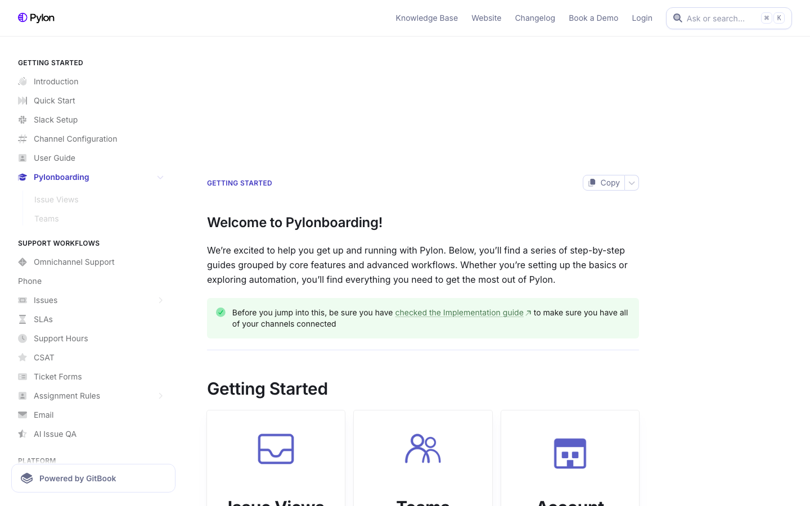

**背景信息：**

- ✅ **核心能力图谱清晰**：虽是欢迎页，但导航明确铺开了 Pylon 的能力面——全渠道支持（Slack / Email / Phone / Chat Widget）、Issue Views（工单视图）、SLAs、Knowledge Base（知识库）、Customer Portal（客户门户）、Account Intelligence（客户情报）、Product Intelligence（Feature Requests / Closing the Loop）、AI Agents（Build/Test/Deploy/Monitor）以及 Broadcasts、Reporting。可判定 Pylon 是一款面向 B2B 的客户支持 / 客户运营一体化平台。
- ✅ **Slack-first / 渠道连接是入口前提**："Getting Started" 里把 Slack Setup、Channel Configuration 放在最前，且原文明确要求"Before you jump into this, be sure you have checked the Implementation guide to make sure you have all of your channels connected"——说明产品以"先接渠道再上手"为核心 onboarding 逻辑，隐含 Slack / 多渠道为主战场。
- ✅ **目标用户与场景可推断**：从 Teams、Assignment Rules、CSAT、Support Hours、Roles & User Management、AI Issue QA 等模块看，目标用户是 B2B SaaS 的客户支持 / 客服团队，典型场景为多渠道工单受理、团队分派、SLA 履约与客户健康度跟踪。
- ✅ **产品独有术语线索丰富**：页面出现 "Pylonboarding"（Pylon + onboarding 的品牌化造词，指本引导流程）、"Issue Views"、"Account Intelligence"、"Product Intelligence / Closing the Loop"（功能反馈闭环）、"AI Issue QA"、"Broadcasts"、"MCP Connections / Pylon MCP"（接入 Model Context Protocol）等，体现其 AI + 客户情报的叙事方向。
- P3 **缺一句话产品定义**：欢迎语只说"help you get up and running with Pylon""get the most out of Pylon"，自始至终未正面回答"Pylon 是什么"。读者需靠导航自行拼凑，建议补一句明确的产品定位（如"客户支持平台"）。
- P3 **差异化主张与术语含义均未展开**：本页没有任何与同类产品（Zendesk / Intercom 等）的对比或独家叙事，上述独有术语也只是列表项、无释义；同时"AI Agents 全生命周期"、"MCP Connections"等亮点功能只露名字未解释——读者读完仍不清楚 Pylon 的核心差异化与这些概念的具体含义。

#### B2: 背景 D1: Overview

**URL:** https://docs.usepylon.com/pylon-docs/ai-agents/overview

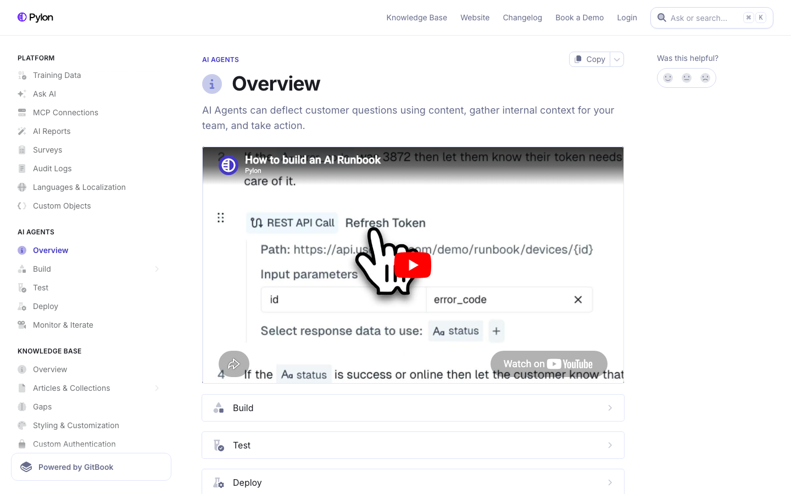

**背景信息：**

- ✅ **产品/功能定义**：该页面是 Pylon 文档中的 "AI AGENTS — Overview"，它没有定义 Pylon 公司本身，而是定义其 AI Agent 能力——原文："AI Agents can deflect customer questions using content, gather internal context for your team, and take action."；并给出核心心智模型："You can think about AI Agents as an extension of your team, users who can be assigned to issues."（把 AI Agent 当作可被指派工单的"团队成员"）。
- ✅ **核心功能能力**：页面明确列出 AI Agent 的四类用途——① 基于知识库/文档内容回答并偏转（deflect）客户问题；② 向客户做初始信息收集；③ 为团队在内部收集上下文（context）；④ 端到端解决工单（end-to-end resolution of issue）。同时给出 Agent 生命周期四步：Build → Test → Deploy → Monitor & Iterate。
- ✅ **目标用户与场景**：面向客服/支持团队（从左侧导航 Omnichannel Support、SLAs、CSAT、Issues 可印证 Pylon 是 B2B 客户支持/客户运营平台）；典型场景是把可自动化的工作流逐步交给 Agent，原文强调"automate the pieces of your workflow you want to"。
- ✅ **差异化主张 / 核心叙事**："AI Agent = 团队的延伸、可被指派工单的'用户'"是该页最鲜明的叙事；并刻意强调这是一个迭代过程——"expect it to be an iterative process to identify the best workflows to automate, and to build your skills in instructing the agent."（既要优化要自动化的工作流，也要提升人对 Agent 的指令能力），淡化"开箱即全自动"的承诺。
- ✅ **关键术语 / 概念**：`AI Agents`（可被指派工单的虚拟团队成员）；`Issues`（Pylon 的工单/工作单元，Agent 的指派对象）；`deflect`（用内容自动偏转/拦截客户问题，减少人工介入）；`Build/Test/Deploy/Monitor & Iterate`（Agent 的标准构建—部署—迭代流程）。
- P3 **理解缺口**：① "take action" 究竟能执行哪些动作（调外部系统？改字段？触发集成？）页面完全未说明；② Agent 如何"build"、用什么配置/模型、是否需要训练数据，本页只给出口未展开（需进入 Build 子页）；③ 页面未定义 Pylon 公司一句话是什么、与竞品（Intercom/Zendesk AI 等）的具体差异，仅能靠导航推断；④ 偏转率、效果度量、计费方式等关键落地信息缺失。

#### B3: 背景 D1: Overview

**URL:** https://docs.usepylon.com/pylon-docs/knowledge-base/overview

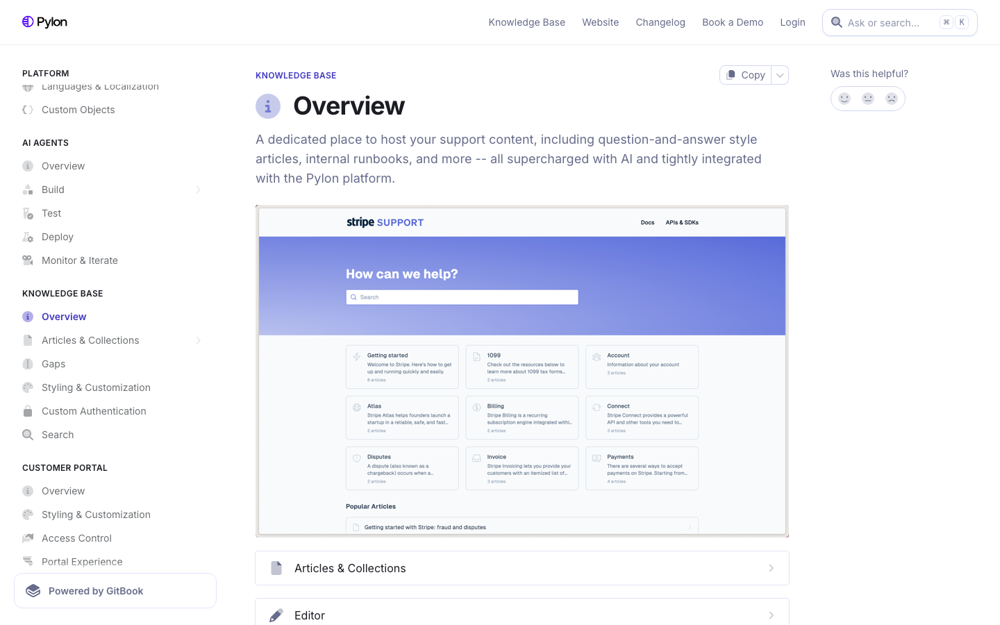

**背景信息：**

- ✅ **产品定义（知识库模块）**：页面将 Knowledge Base 定义为 "A dedicated place to host your support content, including question-and-answer style articles, internal runbooks, and more -- all supercharged with AI and tightly integrated with the Pylon platform."（一个托管支持内容的专属空间，含问答式文章、内部 runbook 等，全部由 AI 强化、并与 Pylon 平台深度集成）。
- ✅ **母产品定位（据导航推断）**：从左侧导航可判断 Pylon 是一个 B2B 客户支持/客户运营平台，覆盖 Omnichannel Support、Slack Setup、AI Agents、Chat Widget、Customer Portal、Account Intelligence、Reporting 等模块；本页的 Knowledge Base 只是其中一个组成模块，而非独立产品。
- ✅ **核心功能能力（知识库）**：页面列出 8 个子能力——Articles & Collections（文章与合集）、Editor（编辑器）、Copilot、Templates（模板）、Collaboration（协作）、Styling & Customization、Custom Authentication（自定义认证）、Search（搜索）。
- ✅ **差异化主张**：页面在一句话定义中突出两点叙事——"supercharged with AI"（AI 强化）和 "tightly integrated with the Pylon platform"（与平台深度集成），即强调知识库不是孤立工具，而是支持平台的有机组成部分。
- P3 **目标用户与场景**：页面通过内容类型暗示了两类用途——"question-and-answer style articles"（面向客户的对外自助内容）与 "internal runbooks"（面向内部团队的运维手册），但未明确说明目标角色（客服团队？运维？终端客户？）或具体使用场景。
- P3 **关键术语与理解缺口**：页面只罗列了 Copilot、Collections、runbook 等术语名称却未给出任何解释——读者无从知道 AI 究竟如何"supercharged"、Copilot 具体做什么、知识库与 Customer Portal / Chat Widget / AI Agents 等模块如何协同。本页仅为目录式 Overview，实质信息需点进子页面才能获取。

#### B4: 背景 D1: Overview

**URL:** https://docs.usepylon.com/pylon-docs/customer-portal/overview

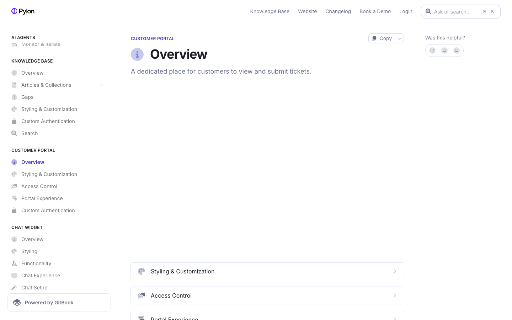

**背景信息：**

- ✅ **核心功能能力（从导航全貌提取）**：页面侧边栏揭示该产品（Pylon）是一个一体化 B2B 客户支持平台，核心模块包括 ①全渠道支持 Omnichannel Support（Slack / Phone / Email / Chat Widget）②AI Agents（Build / Test / Deploy / Monitor）③Knowledge Base 知识库 ④Customer Portal 客户门户 ⑤Account Intelligence 账户情报（Accounts / Notebooks / Tasks）。
- ✅ **本页一句话定义（Customer Portal）**：页面对客户门户的定义引用原文为 "A dedicated place for customers to view and submit tickets."（一个供客户查看并提交工单的专属空间），并列出四个子能力：Styling & Customization、Access Control、Portal Experience、Custom Authentication。
- ✅ **关键术语 / 概念**：页面出现多个产品独有概念——"Omnichannel Support"（跨 Slack/电话/邮件/聊天的统一支持）、"AI Agents"（可构建/部署/监控的 AI 客服代理）、"Account Intelligence"（账户级情报，含 Notebooks/Activities）、"Product Intelligence — Feature Requests / Closing the Loop"（收集功能请求并闭环反馈）、"Pylon MCP"（面向 AI 的 MCP 连接）、"Broadcasts"（批量触达）、"Pylonboarding"（自有的客户引导流程）。
- ✅ **目标用户与场景**：从模块组合看，目标用户是面向企业客户的 B2B 支持/客户成功团队（强调 Slack 协同、SLA、CSAT、Assignment Rules、Teams、Roles），而本页 Customer Portal 的直接服务对象是终端客户——让其自助查看与提交工单。
- P3 **缺少产品级一句话定义**：本页标题虽为 "Overview"，但实际只覆盖了"客户门户"这一个子模块，全篇没有给出 Pylon 整个产品的一句话定位（如"什么是 Pylon、为谁解决什么问题"），产品价值主张需到 Introduction 页才能获得。
- P3 **理解缺口**：读完仍不清楚——①客户门户与 Chat Widget、Knowledge Base 三者在客户侧体验如何衔接/区分；②"view and submit tickets" 之外门户是否支持知识库自助检索、对话历史等；③差异化叙事缺失，本页未说明相较 Zendesk/Intercom 等同类产品的独家主张（Slack-first、AI Agents、MCP 等优势仅能从导航推断，未在文案中点明）。

#### B5: 背景 D1: Overview

**URL:** https://docs.usepylon.com/pylon-docs/chat-widget/overview

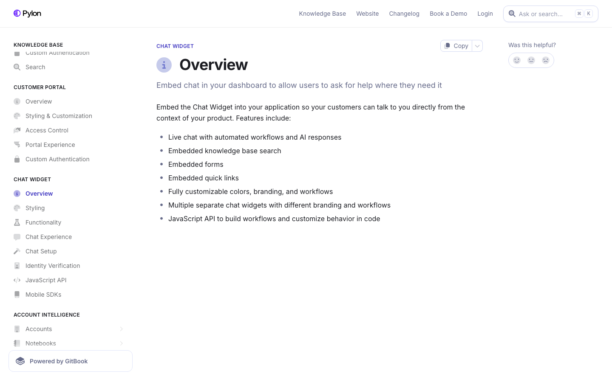

**背景信息：**

- ✅ **核心定义（仅限组件层面）**：页面把 Chat Widget 定义为"Embed chat in your dashboard to allow users to ask for help where they need it"，并补充"Embed the Chat Widget into your application so your customers can talk to you directly from the context of your product"——即在产品界面内嵌入式客服入口，让用户在使用上下文中就地求助。
- ✅ **核心功能能力（页面明列 6 项）**：① 带自动化工作流与 AI 回复的在线聊天（Live chat with automated workflows and AI responses）；② 内嵌知识库搜索（Embedded knowledge base search）；③ 内嵌表单与 quick links；④ 颜色/品牌/工作流完全可定制；⑤ 支持多个相互独立、品牌与工作流各异的聊天窗口；⑥ 提供 JavaScript API，以代码方式构建工作流并定制行为。
- ✅ **目标用户与场景**：面向 B2B SaaS 的产品/客服团队，典型场景是把客服嵌入自家应用，让客户"from the context of your product"直接发起对话，而非跳转外部支持渠道；JS API 与 Mobile SDKs（侧栏）暗示也覆盖有研发能力的团队做深度集成。
- P3 **产品整体定义缺失**：本页只讲 Chat Widget 这一个组件，未给出 Pylon（公司/平台）本身的一句话定义；产品名"Pylon"仅在侧栏（Pylonboarding、Pylon MCP）露出，正文从未点名，读者无法仅凭本页判断 Pylon 是什么、解决什么整体问题。
- P3 **差异化叙事偏弱**：可被视为卖点的差异点散落在功能清单里（"产品上下文内求助"、"多套独立品牌的并行窗口"、"JS API 代码级定制"），但页面未与同类嵌入式客服/聊天产品做任何对比，也没有提出明确的独家主张或品牌核心叙事。
- P3 **理解缺口**：侧栏显示 Pylon 实为覆盖 Omnichannel Support、Slack Setup、AI Agents、Knowledge Base、Customer Portal、Account/Product Intelligence 的大平台，但本页未说明 Chat Widget 与这些模块（尤其 Slack-first 定位）如何衔接、是否需依赖其他模块，以及与"AI Agents"中 AI 能力的关系——读完仍不清楚该 Widget 在整体产品中的位置。

#### B6: 背景 D1: Overview

**URL:** https://docs.usepylon.com/pylon-docs/broadcasts/overview

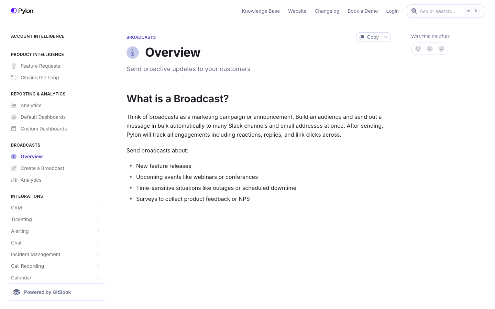

**背景信息：**

- ✅ **关键术语「Broadcast（广播）」定义清晰**：页面用原文给出明确解释——"Think of broadcasts as a marketing campaign or announcement. Build an audience and send out a message in bulk automatically to many Slack channels and email addresses at once." 即把广播类比为"营销活动/公告"，本质是面向受众批量自动群发消息。
- ✅ **核心能力聚焦"主动触达 + 全链路互动追踪"**：页面提到广播可（1）一次性群发到大量 **Slack 频道**与**邮件地址**；（2）发送后由 Pylon **追踪所有互动**，原文列出 "reactions, replies, and link clicks"（表情回应、回复、链接点击）。这是该页讲到的两项最实在的能力。
- ✅ **典型使用场景列举具体**：页面明确给出四类广播用途——新功能发布（New feature releases）、即将到来的活动如网络研讨会/线下会议（webinars or conferences）、时效性情况如故障或计划停机（outages or scheduled downtime）、以及收集产品反馈/NPS 的调查问卷（Surveys / NPS）。目标用户隐含为面向 B2B 客户的客户成功 / 支持团队。
- ✅ **差异化叙事：Slack 与邮件双渠道的统一主动群发**：与传统纯邮件营销工具不同，该页突出"Slack 频道 + 邮件"可在一处批量自动发送，呼应了 Pylon 以 Slack 为核心的客户支持定位（左侧导航中 Slack Setup、Channel Configuration、Omnichannel 等可佐证）。
- P3 **本页并未定义产品/公司本身，只定义了一个功能模块**：用户读完只知道"Broadcasts 是什么"，但 **Pylon 整体是什么产品、面向谁、一句话价值主张**全靠左侧导航推断（涵盖 Knowledge Base、AI Agents、Customer Portal、Chat Widget、Account/Product Intelligence、Integrations 等，指向一个"B2B 客户支持 / 客户运营平台"）。建议补一句产品级定义，本页无原文支撑。
- P3 **关键操作与边界缺口**：页面没说明"如何构建受众（Build an audience）"的具体维度（按账户？标签？自定义字段？）、Slack 与邮件渠道是否同时发送还是二选一、是否有发送频率/合规限制，以及句末 "link clicks across." 表述不完整（across 后内容缺失），读者无法判断追踪覆盖范围。

### 2.4 产品定位与策略

### 1. 把 AI 当成"能被派活的同事"，而不是一个回答框
**核心判断**: Pylon 让 AI 像真人坐席一样被指派工单、端到端处理问题，用"招了个数字员工"的心智来交付 AI 能力。
**支撑证据**:
- [B2] 文档原话把 AI Agent 定义为"团队的延伸、可以被指派到工单上的用户"，并列出偏转问题、收集信息、解决工单等职责
- [C2] 定价页把 AI Agents 定位为"自主完成路由、预处理与解决"的独立产品，配 Runbooks、Escalation workflows
- [S4] 案例标题反复出现 AI agents / runbooks / AI-powered command center，构成隐性能力地图
**对用户的含义**: 用户的预期不该是"用一个聊天机器人"，而是"管理一个会被分派任务的虚拟坐席"，需要像带新人一样训练和迭代它。

### 2. 主动收窄到 B2B 团队，把客户的 Slack 群当作主战场
**核心判断**: 不做大而全的通用客服，而是瞄准 B2B SaaS 的支持团队，并以客户 IM 群这一 B2B 特有场景作为切入点。
**支撑证据**:
- [C2] 强调可追踪客户 Slack 群里的全部对话，且"支持团队无需进入该频道"
- [C3] 全站反复强调 "for B2B teams / B2B SaaS" 的受众定位
- [B1] onboarding 把渠道连接放在最前，明确要求"先接好渠道再上手"，以 Slack 为核心
**对用户的含义**: 用 Slack/Teams 跟企业客户打交道的 B2B 团队适配度高；面向海量个人消费者的 B2C 客服并不是它的目标场景。

### 3. 定位为整体替换传统客服系统的统一工作台，而非单点工具
**核心判断**: Pylon 把分散在各渠道的对话聚合进单一工作台，并明确叫板老牌客服系统，主张"一个平台替掉整套 helpdesk"。
**支撑证据**:
- [S4] 案例标题直接写明替换 Zendesk、Front、Salesforce Service Cloud、Intercom、Freshdesk
- [C4][C5] 首页把全渠道聚合 + AI + 账户情报作为"三位一体"卖点，强调单一视图 + 完整账户历史
- [S5] Sardine 案例用"5 天迁移 12 万工单 + 50 多个工作流"佐证整体替换能力
**对用户的含义**: 选 Pylon 往往意味着整套替换现有客服栈，而不是在旁边加个小工具——迁移决策更重，但收敛更彻底。

### 4. 能力范围从"处理工单"延伸到"看住客户与续约"
**核心判断**: 除了支持，Pylon 把账户健康度、流失/续约风险、功能需求也纳入产品，向客户成功和收入侧扩张。
**支撑证据**:
- [C2] Account Intelligence 作为独立计价模块，做账户级客户健康度与流失风险监控
- [C4][C5] 主张自动浮现 churn / renewal risk / feature requests，并整合 support、success、sales 三方上下文
- [S4] Together AI / Finch 案例称把 support 与 success "consolidated into one platform"
**对用户的含义**: 它不只替代客服工具，还想吸收一部分客户成功（CS）职能，适合想把支持与续约打通管理的团队。

### 5. 基础坐席按档收费，AI 模块单独加购，AI Agents 还按工单量计费
**核心判断**: 采用"传统三档套餐 + AI 能力分别加购"的分层定价，且 AI Agents 用随工单量增长的用量计费，而非全部打包进坐席费。
**支撑证据**:
- [C2] Starter/Professional/Enterprise 三档之上，叠加 AI Assistants、AI Agents、Account Intelligence 三个独立计价模块
- [C2] AI Agents 标注 "$100/mo* 随 issue 量增长"，按工单量计费
**对用户的含义**: 想用齐全部 AI 能力需要在基础套餐外多次加购，实际成本会随工单量上升，预算评估比单纯按人头定价更复杂。

### 2.5 公司基本信息

#### ✅ 实体身份已确认（附域名说明）

**关于 `chromewebdata` 域名**：`chrome-error://chromewebdata/` 并非真实可注册域名，而是 Chrome 浏览器在页面加载失败 / 抓取错误时返回的内部错误页占位符（采集时落到了错误页）。因此无法用 `site:chromewebdata` 做域名锚定。身份锚点改用产品自家页面内反复出现的产品名 **「Pylon」** + 能力图谱比对——页面观察中列出的全渠道支持（Slack/Email/Phone/Chat）、Issue Views、SLAs、Knowledge Base、Customer Portal、Account Intelligence、Product Intelligence、AI Agents（Build/Test/Deploy/Monitor）、Broadcasts、Reporting 与 [usepylon.com](https://www.usepylon.com/) 官方产品矩阵**逐项吻合**，且页面原文多处直呼 "the Pylon platform"。

据此确认目标产品对应：**Pylon（公司主体 Pylon，官网 [usepylon.com](https://www.usepylon.com/)）**——一家面向 B2B 的 AI 原生客户支持 / 客户运营平台。（验证信号：产品名 + 能力图谱直接匹配官方站点，而非 chromewebdata 域名锚链。）

#### 公司基础事实表

| 项 | 内容 | 置信度 | 来源 |
|---|---|---|---|
| 公司名称 | Pylon（运营官网 usepylon.com） | ✅ 直接 | [usepylon.com](https://www.usepylon.com/) |
| 成立年份 | 2022 年 11 月 | ✅ | [YC](https://www.ycombinator.com/companies/pylon-2) / [Series B 公告](https://www.usepylon.com/blog/announcing-our-31m-series-b) |
| 总部地点 | 美国旧金山（San Francisco） | ✅ | [YC](https://www.ycombinator.com/companies/pylon-2) |
| 产品上线 | 2022 年 11 月上线；2023 年 7 月获 TechCrunch 报道 | ✅/⚠️ | [TechCrunch 2023](https://techcrunch.com/2023/07/11/pylon-wants-to-make-it-easier-to-manage-b2b-conversations-in-slack/) |
| 当前阶段 | Series B（已完成） | ✅ | [Series B 公告](https://www.usepylon.com/blog/announcing-our-31m-series-b) |
| 融资总额 | $51M（$3.2M 种子 + $17M A 轮 + $31M B 轮） | ✅ | [Series B 公告](https://www.usepylon.com/blog/announcing-our-31m-series-b) |
| 团队规模 | ~90 人（YC 现值）；B 轮公告时（2025-08）为 51 人 | ⚠️ (口径/时点不同) | [YC](https://www.ycombinator.com/companies/pylon-2) / [Series B 公告](https://www.usepylon.com/blog/announcing-our-31m-series-b) |
| 行业类别 | B2B SaaS — 客户支持 / 客户运营平台（AI-native，Slack-first） | ✅ | [usepylon.com](https://www.usepylon.com/) |
| 客户规模 | 750+ 客户（含 Together AI、Cognition、Temporal、AssemblyAI） | ✅ | [Series B 公告](https://www.usepylon.com/blog/announcing-our-31m-series-b) |
| YC 批次 | Winter 2023（W23） | ✅ | [YC](https://www.ycombinator.com/companies/pylon-2) |

#### 融资历史

| 轮次 | 时间 | 金额 | 领投 + 主要参与方 | 来源指向本产品? |
|---|---|---|---|---|
| Seed | 2023 年（SVB 倒闭后 6 天内完成） | $3.2M | 领投 General Catalyst；参与 Y Combinator、HorizonVC、Comma Capital 及多位天使 | ✅（官方 + 创始人 LinkedIn 一致） |
| Series A | 2024-08-28 | $17M | 领投 Andreessen Horowitz (a16z) | ✅ |
| Series B | 2025-08-19 | $31M | 共同领投 a16z + Bain Capital Ventures (BCV)；General Catalyst、YC 等老股东跟投 | ✅ |

来源：[Seed 公告](https://www.usepylon.com/blog/announcing-pylons-seed-round)、[Series A 公告](https://www.usepylon.com/blog/pylon-raises-17m-series-a-led-by-andreessen-horowitz)、[Series B 公告](https://www.usepylon.com/blog/announcing-our-31m-series-b)、[a16z 投资公告](https://a16z.com/announcement/investing-in-pylon/)、[The SaaS News](https://www.thesaasnews.com/news/pylon-raises-31-million-in-series-b)。

> ⚠️ 重名排雷：搜索中出现的「Pylon Raises $3.3M Seed Round to Accelerate Embedded **Mortgage** Platform」是另一家做嵌入式按揭 / 借贷的同名公司，**与本目标（B2B 客服平台 Pylon）无关**，已剔除。

#### 创始人 / 核心团队背景

三位联合创始人，Caltech / 顶尖科技公司工程背景，相识于大学时期（Advith 与 Robert 在 Caltech 共同主理 Hacktech 黑客松，Marty 经旧金山暑期工程 fellowship 结识）。

- **Marty Kausas**（Co-Founder & CEO）— 前 Airbnb 工程师 [[YC](https://www.ycombinator.com/companies/pylon-2)]
  - 验证：其 [LinkedIn 帖](https://www.linkedin.com/posts/martykausas_we-raised-pylons-32m-seed-round-in-6-days-activity-7125866655221510144-Buhz) 明确署名 Pylon 并讲述 $3.2M 种子融资过程（✅ 链向 Pylon，非 chromewebdata）
- **Advith Chelikani**（Co-Founder）— 前 Samsara；Caltech 校友 [[BCV](https://baincapitalventures.com/insight/the-future-of-b2b-support-is-conversational-and-agentic/)]
  - 验证：BCV / 官方投资文章中以 Pylon 联创身份出现（✅ 链向 Pylon）
- **Robert Eng**（Co-Founder）— Caltech 计算机科学 + 历史双学位；早期工程履历横跨 Facebook、DoorDash、Affinity [[Help Desk Migration 访谈](https://help-desk-migration.com/help-desk-migration-and-pylon/)]
  - 验证：以 Pylon 联创身份接受访谈（✅ 链向 Pylon）

（说明：因 `chromewebdata` 系浏览器错误页占位符，任何个人页都不会、也不应提及该字符串；上方验证改以「是否明确归属 Pylon / usepylon.com」为准。）

#### 近期重大动态（最近 6–12 个月）

- **2025-08-19**：完成 **$31M Series B**，由 a16z 与 Bain Capital Ventures 共同领投，累计融资达 $51M [[Series B 公告](https://www.usepylon.com/blog/announcing-our-31m-series-b)]（✅ 官方一手）
- **客户与营收扩张**：客户数增至 **750+**，公告称连续两年 5x+ YoY 营收增长；**150+ 家**企业从传统工单平台（Zendesk 等）迁入 [[Series B 公告](https://www.usepylon.com/blog/announcing-our-31m-series-b)]（✅）
- **"Zendesk Killer" 定位与对外叙事**：BCV 发布专题视频与文章，将 Pylon 框定为面向 B2B 的对话式 / agentic 支持新范式 [[BCV 视频](https://baincapitalventures.com/insight/video-inside-pylon-mission-to-build-the-zendesk-killer/)]（⚠️ 投资方视角）
- **标杆效果数据**：AssemblyAI 接入后首响时间从 15 分钟降至 23 秒（↓97%），AI 解决率翻倍 [[usepylon.com](https://www.usepylon.com/)]（⚠️ 官方/客户自述）
- **团队扩张**：员工规模从 B 轮时的 ~51 人增长至当前 YC 页所示 ~90 人 [[YC](https://www.ycombinator.com/companies/pylon-2)]（⚠️ 时点/口径差异）

#### 综合判断

Pylon 是一家处于 **Series B、资本面相当扎实**的 B2B 客户支持平台公司：YC W23 出身，三年内完成种子 → A → B 共 $51M 融资，且 A、B 两轮均有 a16z 持续加注、B 轮再引入 Bain Capital Ventures 共同领投，顶级机构背书集中，说明赛道与团队执行获资本高度认可。团队由 Caltech / Airbnb / Samsara / Facebook 工程背景的三位联创掌舵，工程与产品基因强；客户侧已聚拢 Together AI、Cognition、Temporal、AssemblyAI 等高增长科技公司，并以 Slack-first + AI Agent 的差异化切入「B2B 原生客服」这一传统 Zendesk 体系覆盖不足的缝隙，迁移替换故事（150+ 家迁入）成立。

短板 / 关注点：① 当前约 90 人、客户 750+，相对 Zendesk / Intercom 等成熟玩家体量仍小，正面临从「快速增长的初创」向「企业级规模化」过渡的组织与 GTM 考验；② 营收高增长（5x+ YoY）数据来自官方口径，缺乏独立第三方验证；③ AI Agent 偏转率（官方称 eligible 工单 40–50%）等效果指标多为官方 / 客户自述，落地一致性有待外部样本检验。值得关注的方向：AI Agents 的端到端工单解决能力、Account/Product Intelligence 的数据闭环，以及能否在 B 轮资金加持下把「Slack-first B2B 支持」从早期采用者扩展到更广的企业市场。

---

## 3. 体验流程记录

### 3.1 官网叙事分析

#### 高频关键词

| 关键词 / 短语 | 出现频次或权重 | 在哪类页面出现 | 想建立的印象 |
|---|---|---|---|
| AI / AI Agents（"AI 原生"、deflect、Copilot） | 极高（几乎每页） | 首页、AI Agents 页、知识库页、案例页、文档 | 这是一款"AI 驱动、自动处理大部分支持工作"的下一代平台，而非传统人工客服系统 |
| B2B（B2B support platform） | 高（定位锚点） | About、案例、文档导航 | 专为 B2B 复杂客户/多干系人场景而建，传统工单工具不适配，它才是对的选择 |
| 全渠道 / 单一视图（Slack·Teams·WhatsApp·Email·Discord） | 高 | 首页、Footer、文档 | 把分散在各 IM/邮件的客户对话统一接管，"一个收件箱"解决渠道碎片 |
| Slack / Slack Connect | 高 | 首页、案例、Onboarding 文档 | Slack 是它的主战场和差异化入口——别人做不好的 Slack 原生支持，它原生支持 |
| Account Intelligence（客户情报 / churn·renewal 信号） | 中高 | 首页、案例、About 页脚 | 不只接工单，还能洞察客户健康度、续约/流失风险，覆盖 support+success+sales |
| 统一平台 / command center / consolidated | 中高 | 案例页、Together AI/Finch 案例 | 一个平台整合 support+success+account，省掉拼多套工具的成本 |
| Zendesk / Front / Intercom 替换（"Zendesk Killer"） | 中高 | 案例页标题、About | 它能整体替代你现在的老旧 helpdesk，迁移是趋势而非冒险 |
| Runbooks / 工作流自动化 | 中 | AI Agents 页、案例 | 拥有可配置、可自动执行的专属能力体系（暗示技术护城河） |
| 量化数字（90% FRT↓、50% 无人工、8x、4x、5 天迁移 12 万工单） | 中（反复出现） | 首页、Footer、案例 | 效果是被验证、可衡量的真实业务结果，不是空头承诺 |
| 知识库自动化（识别盲区→起草→去重→翻译） | 中 | 知识库页、首页 | 帮助中心能"自我更新"，省掉人工维护文档的成本 |

#### 说服手法分析

**1. 树敌定位法（用竞品替换叙事确立身份）**
- 具体表现：案例标题明确写出替换 Zendesk、Front、Salesforce Service Cloud、Intercom、Freshdesk；About 页引用 The Information 报道自称"Zendesk Killer" [S4][S7]
- 想达到的效果：不解释"我是什么"，而是借用户已熟悉的旧工具做参照系，瞬间让人理解"它是来取代谁的"，并把购买它包装成"顺应迁移趋势"而非冒险。

**2. 趋势立论法（先描述行业拐点，再让产品成为唯一解）**
- 具体表现："B2B 售后沟通正从 email 迁移到 Slack / Microsoft Teams……这打破了大多数现有售后工作流"，由此推导出 Pylon 是"为 B2B 团队实际工作方式而建" [S7]
- 想达到的效果：把产品需求上升为不可逆的行业趋势，制造"传统工单系统已过时、你必须换"的紧迫感，让选它显得是顺势而为。

**3. 给 AI 赋予团队身份（拟人化降低信任门槛）**
- 具体表现："You can think about AI Agents as an extension of your team, users who can be assigned to issues."（把 AI Agent 当作可被指派工单的"团队成员"）[B2]
- 想达到的效果：用"同事"而非"工具"的心智模型,既让人感觉 AI 能力强(像真人一样接活),又规避"全自动黑箱"的不信任——它只是你团队的一员。

**4. 数字背书（把抽象 AI 能力翻译成可衡量结果）**
- 具体表现："FRT 下降 90%(35min→<3.5min)""50% 工单无人工解决""5 天迁移 12 万工单 + 50+ 工作流""4x support volume""200M+ calls" [C5][S5][S4]
- 想达到的效果:用具体、戏剧化的对比数字佐证价值,把"AI 自动化"这类难以验证的承诺转译成看得见的业务收益,显著增强说服力(尽管这些数字大多未与具体功能建立归因)。

**5. 造词与流程图谱（用专属术语和闭环步骤营造体系感）**
- 具体表现:品牌化造词如 "Pylonboarding""Issue Views""Closing the Loop";并把能力包装成完整流程,如 AI Agent 的 "Build→Test→Deploy→Monitor & Iterate"、知识管理的"识别盲区→生成→去重→润色→翻译"五步闭环 [B1][E2][C7]
- 想达到的效果:专属术语制造"这是一套独有方法论"的护城河感,完整流程图则传递"考虑周全、可落地、不是半成品"的成熟印象。

#### 整体评价

Pylon 想让用户感觉它是**"为 B2B 而生、能整体取代 Zendesk 的 AI 原生支持平台"**——既现代(AI、全渠道、Slack 原生),又成熟可信(大客户 logo + 戏剧化数字 + 完整流程)。这套说法在**定位与叙事层面非常成功**:树敌、趋势立论、拟人化 AI 环环相扣,可信度高。但它的可信度更多建立在"结果展示"而非"机制透明"上——AI 如何路由、数据从哪来、信号怎么算、内容是否需人工审核几乎全程是黑箱,量化数字也未与具体功能归因。因此对感性买家极具说服力,对要验证落地性的技术/采购决策者则留有较大未解之问。

### 3.2 测点流程详情

### 🏠 首页（2 个测点）

**该模块覆盖页面**:

- `chrome-error://chromewebdata/`
- `https://www.usepylon.com/`

#### C1: Homepage 5-second test

**URL:** chrome-error://chromewebdata/
**观察：**

- [No screenshot captured]

#### C5: Footer audit

**URL:** https://www.usepylon.com/

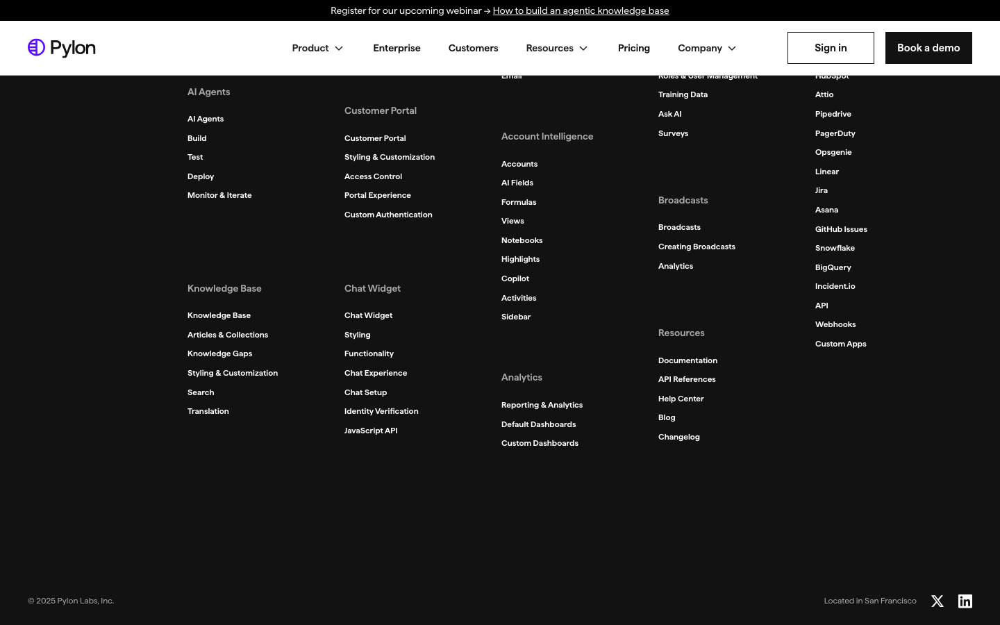

**观察：**

- ✅ 导航 IA 清晰映射产品能力边界**：Footer/顶部导航的 Product / Enterprise / Customers / Resources / Pricing / Company 六段结构，配合首屏三大功能区（Omnichannel、AI、Account Intelligence），让用户能快速判断 Pylon 是"全渠道 + AI + 客户情报"三位一体的 B2B 支持平台，而非单纯工单系统。能力归类的指向性强。
- ✅ 全渠道能力的"输入源"列举具体**：明确点出 Slack(含 Slack Connect/Community)、Microsoft Teams、WhatsApp、Email、Chat、Discord(含 forums) 等接入渠道，并强调"单一视图 + 完整账户历史"。用户能直接对照自己团队用的沟通工具判断适配性——这是功能可落地性的关键信息，说明到位。
- P2 AI 能力罗列过密、缺少"工作机制/输入输出"说明**：AI 段一口气堆叠了"路由、补知识缺口、起草文章和回复、分类工单、跨账户洞察、生成图表、Ask AI"七八项能力，但每项都停留在动词层面，没有说明 AI 如何接入现有 KB/工单数据、依据什么做意图识别、生成内容是否需人工审核。用户读完知道"AI 能做很多事"，却无法判断"准确性/可控性/如何落地"。
- P2 Account Intelligence 的数据来源与触发逻辑未交代**：页面称能自动"surface churn signals / feature requests / renewal risk",并整合 support、success、sales 三方上下文,但没说明这些信号是仅从支持对话里 NLP 提取,还是需要对接 CRM/CS 工具。对想评估"能否覆盖我现有客户数据"的买家,这是判断价值的核心缺口。
- P3 量化成效有亮点但功能归因不清**："FRT 下降 90%(35min→<3.5min)""50% 工单无人工解决""8x..."等数字很有说服力,但未点明这些结果分别由哪项功能(AI 路由 / 自动解决 / 知识自动化)驱动,用户难以把"产品的哪个能力"对应到"我能拿到的结果"。

### 🤖 AI 能力 / Agent（3 个测点）

**该模块覆盖页面**:

- `https://www.usepylon.com/ai-knowledge-management`
- `https://www.usepylon.com/ai-agents`
- `https://www.usepylon.com/ai-assistants`

#### C7: Help / Documentation

**URL:** https://www.usepylon.com/ai-knowledge-management

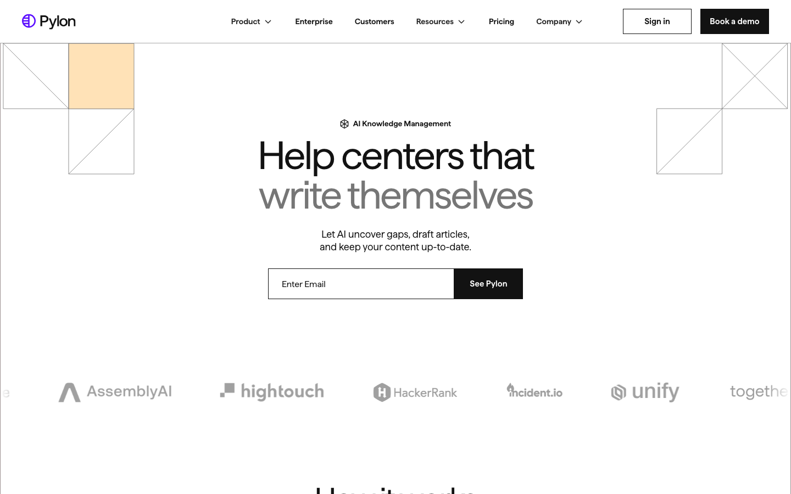

**观察：**

- ✅ "How it works" 五步流程把 AI 知识管理的核心能力讲得相当完整：识别知识盲区 → 把历史答复转成文章 → 检测重复内容 → 用 Copilot 迭代改写 → 自动翻译 50+ 语言，构成"发现缺口-生成-去重-润色-本地化"的闭环工作流；用户读完基本能理解产品在"自动维护一个会自我更新的帮助中心"这件事上能做什么。
- ✅ 精准切中知识库"内容陈旧、覆盖有缺口、人工撰写费时"的痛点，典型场景是支持团队把过往工单/对话沉淀为可复用文章；三个案例（Sardine 5 天替换 Zendesk、AssemblyAI 用 AI agent+runbook 做 24/7 支持、Wispr Flow 从 Front 迁移后承接 4 倍工单量）为规模化支持的适用场景提供了佐证。
- P1** 关键输入/数据来源未说清：第 1 步"AI 自动归类常见话题并与现有知识库对比"——AI 究竟依据什么数据发现盲区（支持工单？聊天记录？搜索关键词？）页面只字未提；第 2 步"把过往答复转成文章"也没说这些"过往答复"如何被筛选或触发。用户无法判断接入自己数据后能产生什么效果。
- P2** 多处功能机制含糊："pre-defined templates"是哪些模板、能否自定义；第 3 步"检测跨知识库与外部来源的重复内容"中的"外部来源"具体指什么、如何配置；50+ 语言自动翻译有无人工校对或质量控制——这些影响实际可用性判断的细节都缺失，且未交代 AI 起草文章是否需人工审核后才发布、"保持最新"是定时扫描还是事件驱动。
- P3** 本页未与平台其它能力（AI Agents 答客、Chat Widget、Customer Portal）建立连接：footer 显示知识库其实是给 AI agent 和自助门户"供料"的，但页面没说明这里生成的文章如何被这些渠道消费，错失了展示"知识库价值链"、解释功能间协同关系的机会。

#### E2: 探索: AI AgentsAutomate complex B2B workflows

**URL:** https://www.usepylon.com/ai-agents

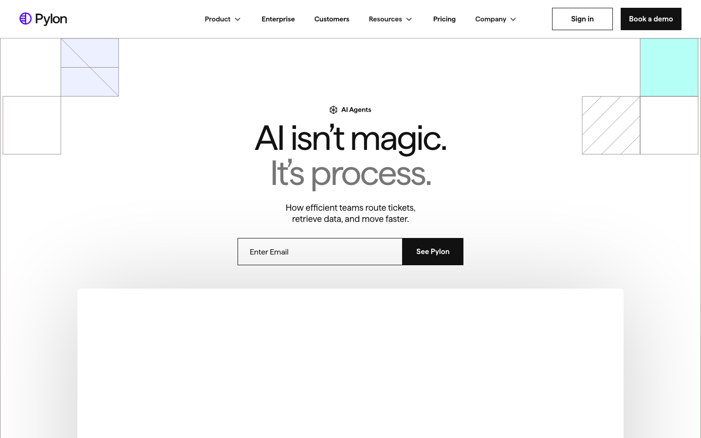

**观察：**

- ✅ 页面用 Build→Test→Deploy→Monitor 四阶段完整呈现了 AI Agent 的全生命周期工作流,每阶段都落到具体能力(训练 agent 去 deflect 问题、上传文档/知识库、定义 greeting/resolution/escalation 流程、用历史工单造测试用例、触发器自动路由、追踪 response rate / resolution rate),用户能清楚理解"产品如何把人工支持流程改造成可自动化的 agent"。
- 核心概念 **Runbooks**(被定义为"structured list of actions")是整个产品的功能基石,但全文始终停留在"把现有工作流变成自动化 Runbook"这种抽象层,没讲清一个 Runbook 究竟能执行哪类动作——仅是回答问题/话术,还是能调用 API、查数据库、在外部系统真正执行操作?**P1**:产品最关键的工作机制未说清,而它直接决定 agent 能否处理标题宣称的"复杂 B2B workflows"。
- 副标题强调 agent 能"retrieve data"(检索数据)解决问题,但页面通篇没有说明数据来自哪里、如何接入——是否连接 CRM、订单系统、内部数据库?靠什么集成方式?**P1**:"检索数据"是核心卖点之一却零集成/数据源说明,企业用户无法判断能否接入自己的后台系统。
- ✅ Test 阶段是有信息量的差异化能力:支持用过去的真实 issue 生成测试用例、对单个 Runbook 独立测试、上线前在样本问题或自定义场景上预演——精准回应了"AI 正式面客前如何验证不会答错"这一真实顾虑,功能价值表达到位。
- 三个案例(Sardine 5 天替换 Zendesk、AssemblyAI 做 7×24 支持、Wispr Flow 从 Front 迁移扛 4 倍量)把适用场景锚定为"客服/支持团队替代 Zendesk/Front",定位清晰;但本页未说明 agent 实际通过哪些渠道触达客户(邮件 / Slack / chat widget?侧栏虽有 Chat Widget 模块却未在本页关联),也未提及不同套餐的功能差异或对话量限制。**P2**:渠道与触达方式这一关键使用前提缺失。

#### E3: 探索: AI AssistantsFind context and resolve fa

**URL:** https://www.usepylon.com/ai-assistants

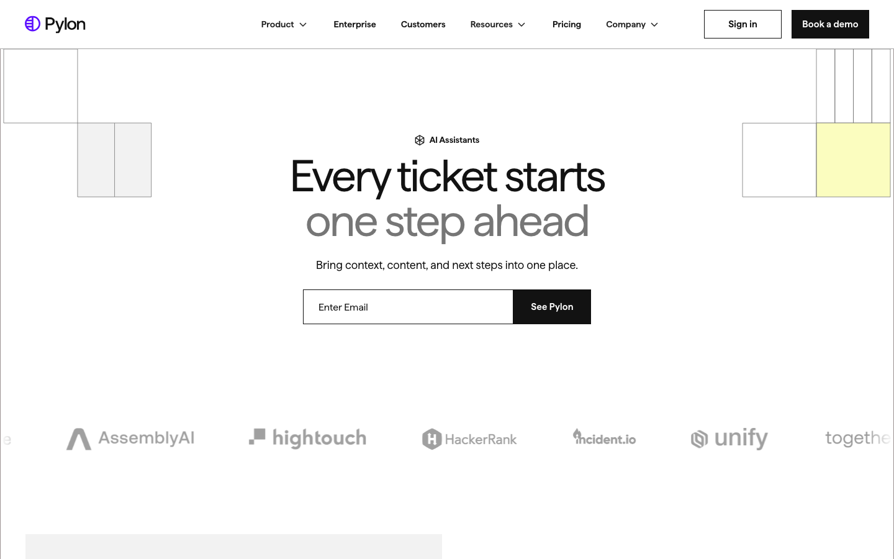

**观察：**

- ✅ **功能分层清晰**：页面把 AI 能力拆成三个明确的工作流桶——Issue Copilot（辅助人工坐席解决问题）、Ask AI（跨知识源即时检索答案）、Workflow automation（自动填字段+智能路由）。每个桶下都列了带一句话说明的具体子功能（如 AI Issue Suggestions 推荐相关资源/历史工单、Message Copilot 起草并润色回复），读者能快速理解"产品在工单处理的哪个环节帮我做什么"。
- ✅ **多语言支持场景具体**：自动翻译被作为独立能力点强调两次（Message Copilot 内的 auto-translate + 独立的 Issue Auto-translation），且明确覆盖"inbound 与 outbound 双向消息"，对跨国/多语种支持团队来说解决的问题和场景很直白。
- P1 "AI Assistants" 与导航中的 "AI Agents" 边界未澄清**：本页讲的全是辅助人工坐席的 copilot 式能力（建议、起草、摘要、填字段），但站点另有独立的 "AI Agents（Build/Test/Deploy/Monitor）"模块指向自主应答。页面没有说明二者关系——什么时候用 AI 直接自动回复、什么时候只是辅助人工。读者容易把"AI 协助"误解为"AI 自动解决工单"。
- P2 Ask AI 的数据源与接入方式说明不足**：宣称能"search across docs, past tickets, and customer data"，但没说明 customer data 从哪来（CRM？哪些集成？需如何连接），也没讲知识检索的接入清单。读者无法判断要接入自家系统需要做什么、覆盖范围有多大。
- P2 AI 输出的可靠性与配置机制是缺口**：AI Autofill（按对话内容填 product/priority/issue type）和 AI Trigger Conditions（智能分类路由）只给了"做什么"，没给"怎么配、依据什么判断、准确率/纠错与防幻觉机制"。同样缺少支持的语言清单、是否可自定义 AI 提示/规则等关键落地细节，评估可行性时信息不够。

### 💰 定价 / 商业化（1 个测点）

**该模块覆盖页面**:

- `https://www.usepylon.com/pricing`

#### C2: Pricing page

**URL:** https://www.usepylon.com/pricing

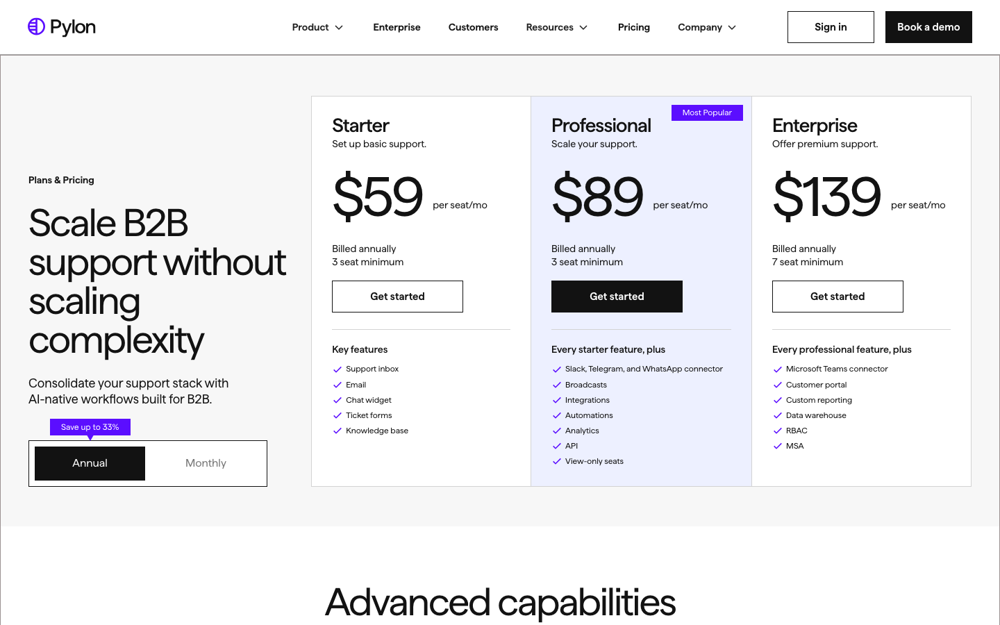

**观察：**

- 产品能力全貌**：页面揭示这是一个 **AI-native B2B 支持平台**，采用"基础坐席 + 三个 AI 模块"的分层结构——基础三档（Starter/Professional/Enterprise）提供传统支持能力（统一收件箱、邮件、聊天挂件、工单表单、知识库、多渠道连接器），之上叠加三个独立计价的 AI 产品：**AI Assistants**（辅助人工：草拟回复/知识检索/翻译/路由）、**AI Agents**（自主处理工单的路由、预处理与解决）、**Account Intelligence**（账户级客户健康度与流失风险监控）。其差异化工作流也点明了：可追踪客户 Slack 群里的所有对话，且"支持团队无需进入该 Slack 频道"——这是面向 B2B 的典型场景。✅ 功能分层与产品定位清晰。
- 三个 AI 模块功能边界重叠、易混淆**：`Ask AI` 同时出现在 AI Assistants 与 Account Intelligence（后者标注 Unlimited），`AI Fields` 在三处均出现，`AI routing` 与 AI Agents 的 `Agent Workflows (Assignment)` 职责看似重叠。页面没有说明这些模块是**互补必须叠加购买**，还是**功能交叉可择一**，用户无法判断"要实现自主解决工单到底需要买哪几个模块"。**P2**：模块间功能关系与购买依赖未说明。
- 核心卖点 AI Agents 的工作机制完全缺失**：定位为"autonomous AI——自主完成路由、预处理与解决"，但 `Runbooks`、`Escalation workflows`、`Agent Workflows`、`Unlimited training data` 全是裸列表项，没有说明**输入是什么（如何喂训练数据/知识库）、如何接入现有工单与系统、自主解决的触发与兜底逻辑、人工介入边界**。计价"$100/mo* 随 issue 量增长"也未在本页解释 issue 如何计量（仅"Learn more here"）。**P1**：关键自主能力的工作机制、接入方式与计量口径缺失,用户无法评估可行性。
- 功能项普遍只有名词、无功能解释**：`Product Intelligence`、`Knowledge gap detection`、`Custom Notebooks`、`Playbooks`、`Customer Health & Churn Risk`、`Custom reporting`、`Data warehouse` 等均以单个词条罗列，没有任何"它做什么/输入输出/适用场景"的说明。读完此页用户能理解产品大致**覆盖哪些领域**，但**理解不了每个能力具体能为我做什么**。**P2**：功能清单缺少功能性描述,信息不完整。
- 集成能力描述含糊**：渠道连接器很明确（Slack/Telegram/WhatsApp/Microsoft Teams），但 Professional 档里的 `Integrations` 本身只是一个裸词条，未给出**可对接的工具清单（尤其 CRM、工单系统、`Data warehouse` 对接哪些仓库）**；B2B 支持平台最关键的"与客户数据/账户系统打通"这一环没有任何集成范围说明。**P2**：缺少集成清单与数据打通范围。

### 🔌 集成 / API（2 个测点）

**该模块覆盖页面**:

- `https://www.usepylon.com/integrations`
- `https://www.usepylon.com/`

#### S3: Integrations page

**URL:** https://www.usepylon.com/integrations

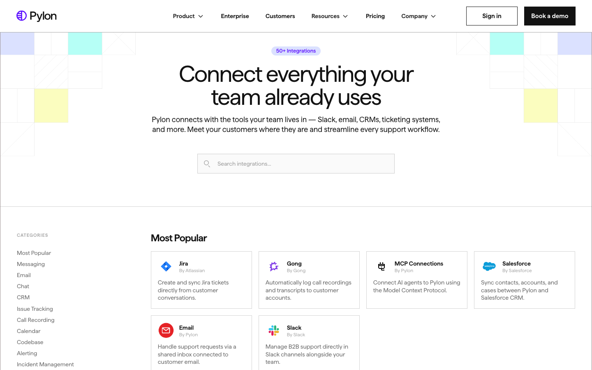

**观察：**

- ✅ 页面清晰揭示了 Pylon 的核心定位与能力边界：它是一个**全渠道 B2B 客户支持中枢**。通过 12 个集成类目（Messaging / Email / Chat / CRM / Issue Tracking / Call Recording / Incident Management / Data Warehouse 等）+ 每张卡片的动词化一句话（Create、Sync、Log、Route、Embed），用户能快速理解产品的工作流主张——"把客户散落在 Slack、邮件、WhatsApp、CRM、Jira 里的支持对话收敛到一个工作台"，并把会话与客户账户/工单/通话记录打通。
- ✅ 单个集成的**输入/输出方向**在多数卡片上交代得当：如 Jira "Create and sync Jira tickets directly from customer conversations"（会话→工单，双向同步）、Gong "log call recordings and transcripts to customer accounts"（通话→账户）、Gmail/Outlook "route support emails into Pylon's shared inbox"（邮件→统一收件箱）。这种"从哪来、到哪去"的描述让人能判断该集成在自己流程中的位置。
- P1**：**MCP Connections（"Connect AI agents to Pylon using the Model Context Protocol"）是页面战略价值最高、却解释最不足的能力**。完全没说明接入后 AI agent 能对 Pylon 做什么——是只读工单上下文、自动回复客户、还是能触发建单/同步等动作？权限范围、谁来调用（自建 agent 还是第三方）、安全边界一概空白。对评估"AI 能力"的买家这是关键决策点，却只有一句口号。
- P2**：所有集成卡片只回答了"做什么"，没回答"怎么做、做到什么程度"。CRM 同步只写"Sync contacts, accounts, and cases"，但**同步方向（单向/双向）、实时性（实时/定时）、字段映射、触发条件**均未说明；这恰恰是 CRM/工单类集成选型时最该看的细节。读完用户知道"能连 Salesforce"，但无法判断"连上后我的数据怎么流"。
- P2**：页头宣称"50+ Integrations"，但页面按类目只展示了精选子集，**无法看到完整清单、也无法判断哪些是原生集成 vs. 中转**。同时缺少**套餐归属（哪些集成需要更高 tier）**与**接入/配置成本**信息——用户读完无法确认"我需要的那个工具到底支持不支持、要不要加钱"。

#### S9: API / Developer docs

**URL:** https://www.usepylon.com/

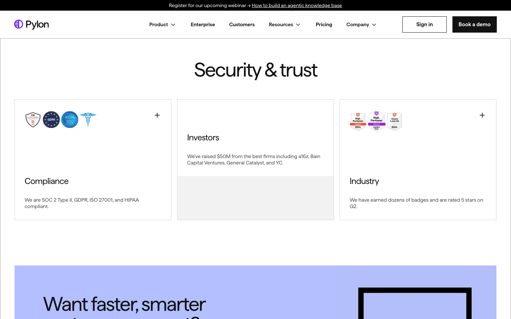

**观察：**

- ✅ 产品能力图谱清晰**：页面有力地揭示了 Pylon 的四大核心能力——全渠道归集（Slack / Teams / WhatsApp / Email / Discord / Chat 汇入单一视图）、基于意图的 AI 自动路由、知识库自动化（识别 KB 缺口→起草文章→主动推送答案）、客户情报（自动捕获流失信号、功能需求、续约风险）。读完用户能明确理解"这是一个 AI 原生的 B2B 客服平台"。
- P1 测点错位——本页几乎没有任何 API / 开发者文档内容**：该测点 ID 标注为"API / Developer docs"，但节选全是营销首页内容，**完全未出现** endpoint、SDK、鉴权方式、Webhook、事件订阅、速率限制、数据导出等开发者最关心的功能信息。对想评估"能否程序化集成 / 二次开发"的技术读者，这一页无法回答"这个产品能为我（开发者）做什么"。
- P2 AI 工作机制是黑箱**：反复强调"AI reads the issue""identify and fill knowledge gaps""generate charts""Ask AI anything"，但**输入/输出/运行机制全部未说明**——AI 基于什么数据训练或检索？路由准确率如何？"Ask AI" 的答案来源（页面只说 "with sources"）覆盖哪些范围？自动生成的文档是否需人工审核？这些决定可用性的关键细节缺失。
- P2 集成与数据接入边界不清**：客户情报号称融合"support, success, and sales in one view"，但**未说明如何接入 CRM（Salesforce/HubSpot）、数据仓库或工单系统**，churn/renewal 信号的判定依据和数据源也未交代。用户无法判断它是独立系统还是需要打通现有工具栈。
- ✅ 用量化成果佐证功能价值**：90% 首响时间下降（35 分钟→<3.5 分钟）、50% 合格咨询无人工解决、8x（节选截断）等具体数字，把抽象的"AI 自动化"转译成可衡量的业务结果，比单纯罗列功能更有说服力。

### 🔒 安全 / 信任（1 个测点）

**该模块覆盖页面**:

- `https://www.usepylon.com/security`

#### S12: Trust / Security page

**URL:** https://www.usepylon.com/security

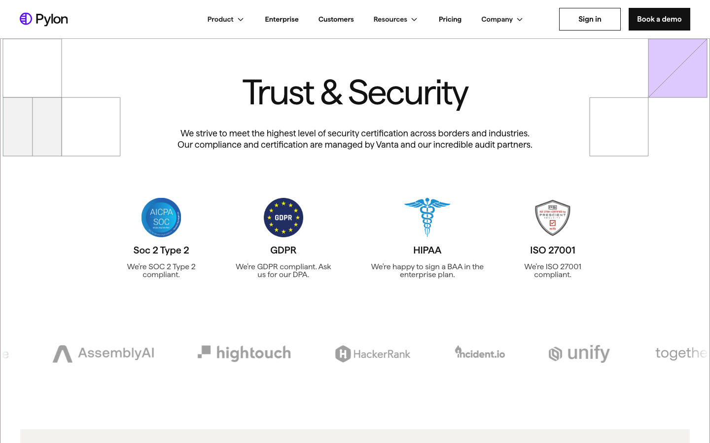

**观察：**

- ✅ 页面清晰交付了产品最核心的"信任/合规能力包"——SOC 2 Type 2、GDPR(可提供 DPA)、HIPAA(企业版可签 BAA)、ISO 27001,并说明由 Vanta + 审计伙伴持续监控。对企业采购方而言,这直接回答了"产品能否过我们的合规门槛",尤其 HIPAA/BAA 暗示其可服务医疗等受监管行业,是有效的功能性信号。
- 页面揭示了一个**按套餐分层的信任能力模型**:Security Reviews(安全评审)和 Custom MSAs(定制主服务协议)均锁定在 Enterprise Tier。这让买家明白部分采购/合规协作流程是套餐相关的。**P3**:仅列出"企业版才有",但未说明这两项具体能为客户做什么(评审形式?可改哪些条款?),不同套餐的安全能力差异缺少进一步交代。
- P2** Trust Center 需到 trust.usepylon.com 申请访问,但页面完全没说明里面**有什么内容**——是审计报告、渗透测试结果、子处理商清单,还是 Vanta 的实时合规监控面板?用户无法预判申请后能拿到哪些安全证据/文档,削弱了该入口的功能价值。
- P1** 作为一张"安全"页,几乎只讲了认证与法律文件,却**缺失产品自身的技术安全功能**:数据加密(传输/静态)、数据驻留/区域选择、SSO/SAML、RBAC 权限控制、审计日志、数据保留与删除策略等。这些恰恰是"这个产品能为我的安全需求做什么"的关键能力点,读完仍无法判断。
- P2** 页脚暴露了完整产品能力地图(AI Agents 的 Build/Test/Deploy/Monitor、Knowledge Base、Customer Portal、Chat Widget 身份验证、Omnichannel Support、Account Intelligence 等),确认 Pylon 是 AI 驱动的 B2B 客服平台;但本页未把"安全合规"与这些功能挂钩——例如 AI Agent 处理的客户数据、知识库内容是否在上述认证范围内,留下了"AI 功能的数据安全边界"这一关键缺口。

### 🏢 公司 / 团队（1 个测点）

**该模块覆盖页面**:

- `https://www.usepylon.com/about`

#### S7: About / Company

**URL:** https://www.usepylon.com/about

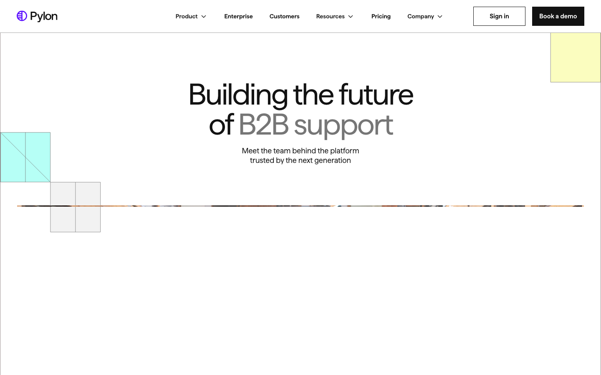

**观察：**

- ✅ **清晰传达了产品的核心定位与差异化洞察**：页面通过 "Discovery" 叙事点明了产品的功能立足点——B2B 售后沟通正从 email 迁移到 Slack / Microsoft Teams 等 chat 平台，而这"打破了大多数现有售后工作流"。由此推导出 Pylon 是"为 B2B 团队实际工作方式而建"——服务于复杂客户、多干系人、跨多平台的对话。读者能立刻理解这个产品要解决的是"传统工单系统不适配 B2B 多渠道支持"这一具体问题。
- ⚠️ **P2 About 页本身几乎不解释产品具体能做什么**：除"first B2B support platform"和那段洞察外，正文主体是团队故事、融资($50M+)、招聘和媒体背书。真正的功能矩阵（AI Agents、Knowledge Base、Customer Portal、Chat Widget、Omnichannel Support、Account Intelligence）只以页脚导航链接形式出现，没有任何一句功能说明。用户读完这一页只能 get 到"愿景+团队可信度"，无法回答"它具体能为我做哪些事"。
- ⚠️ **P1 关键工作机制——"跨多平台对话统一"如何实现——完全未说明**：页面把"conversations across multiple platforms"作为产品的核心卖点，但没有解释 Pylon 如何接入 Slack / Teams / email，如何把分散在各渠道的对话聚合成可管理的支持工单/账户视图。这是该产品最区别于传统工单系统(Zendesk)的能力，却在最适合阐述产品理念的 About 页缺位。
- ⚠️ **P2 "Zendesk Killer"的功能性差异未被展开**：页面引用 The Information 报道自称"Zendesk Killer"，暗示对标传统客服系统，但没有说明在功能层面究竟哪里更强（如：B2B 账户级支持、多干系人、AI Agents 自动化、Account Intelligence 等）。对标竞品却不交代功能差异点，削弱了说服力。
- ⚠️ **P3 页脚暴露了远超 About 页叙述的产品广度，却无引导**：页脚列出的 Account Intelligence（Accounts / AI Fields / Formulas / Views / Notebooks / Copilot / Activities）和 AI Agents（Build / Test / Deploy / Monitor & Iterate 全生命周期）显示这是一个功能相当深的平台，远不止"support"，但 About 正文对这些只字未提，存在"叙事的产品范围"与"实际产品范围"不一致的信息缺口。

### 📰 博客 / 内容（2 个测点）

**该模块覆盖页面**:

- `https://www.usepylon.com/blog`

#### C3: Sign-up flow (no submit)

**URL:** https://www.usepylon.com/blog

**观察：**

- ✅ 全页最实锤的功能信号来自置顶 release——"native phone support"：把客服电话转化为「account context + AI signals」，并与其他所有渠道的对话并列。这一句清晰传达了产品定位：面向 B2B 的全渠道（电话/邮件/聊天）客服平台，且电话不是孤立的呼叫记录，而是被结构化进账户上下文并由 AI 提取信号。
- P1 该测点标注为 "Sign-up flow"，但实际抓取到的是 Blog/Resources 内容列表页，**完全没有注册表单、字段、套餐选择或"注册后能用到什么"的功能说明**。从功能清晰度看，用户在这个入口读不到「产品能为我做什么」，注册转化路径上的核心功能价值缺失。
- P2 博客标题群间接暴露了一长串能力面：知识库/帮助中心、工单分诊与优先级路由（triage/route at scale）、RBAC 权限、异常检测（issue anomaly detection）、聊天机器人、virtual support agent、邮件工单自动回复、customer data intelligence。但这些都是 thought-leadership 文章主题，**无法区分哪些是产品真实功能、哪些只是行业科普**——读者难以据此判断实际可用的功能清单。
- P2 "native phone support" 这条关键功能缺关键细节：电话如何接入（自带号码/集成 Twilio？）、"AI signals" 具体指什么（情绪/意图/升级风险？）、生成的 account context 输出到哪里、是否需要对接现有 CRM/电话系统，页面均未说明，集成与工作机制不清晰。
- P2 整页本质是内容营销 hub 而非产品功能页，反复强调 "for B2B teams / B2B SaaS" 的受众定位（✅ 受众清晰），但**功能信息高度碎片化地散落在文章标题里**，没有一处集中说明产品的核心工作流（对话进来→AI 处理→工单/路由→知识库→分析闭环）是如何串起来的。

#### S6: Blog / Resources

**URL:** https://www.usepylon.com/blog

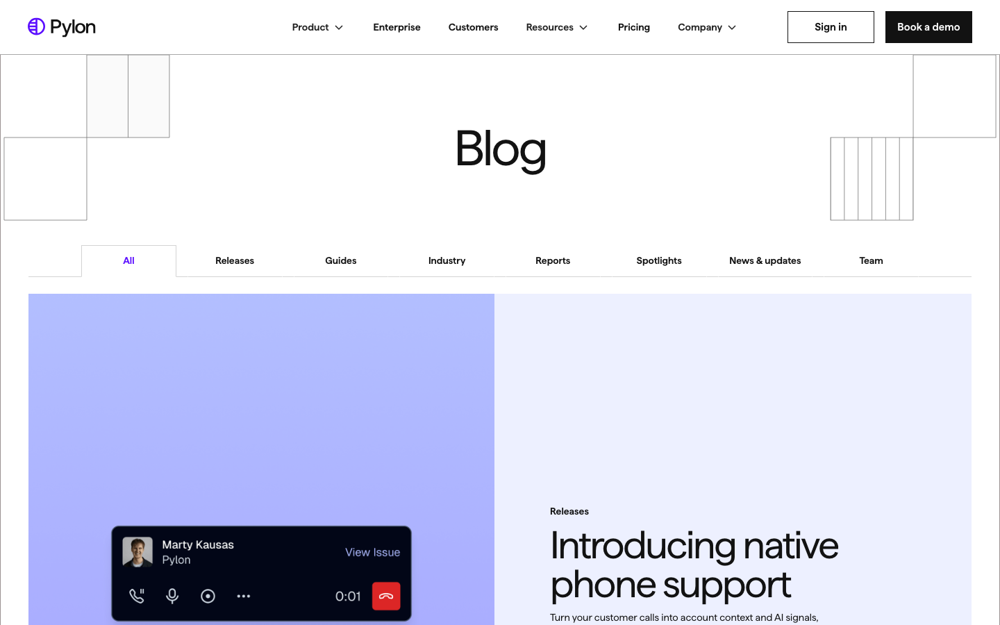

**观察：**

- ✅ 唯一的 Release 类文章精准揭示了核心能力**："Introducing native phone support — Turn your customer calls into account context and AI signals, right alongside conversations from every other channel" 一句话讲清了三件功能事实：①新增电话(语音)渠道；②通话内容会被转化为"账户上下文 + AI 信号"；③与其他所有渠道的会话**统一聚合**。这说明产品是一个 **AI 驱动的全渠道(omnichannel) B2B 客服平台**，电话、邮件、聊天等会话被归并到同一账户视图。
- 页面整体勾勒出完整的客服功能版图(靠标题反推)**：从博客标题可拼出产品的能力清单——工单分拣/优先级/路由(triage, sort/prioritize/route at scale)、主动式邮件工单回复(proactive email ticket replies)、客服聊天机器人(chatbot)、虚拟客服坐席(virtual support agent)、知识库/帮助中心(knowledge base + help center)、角色权限控制(RBAC)、主动异常检测(anomaly/issue detection)、客户数据智能(customer data intelligence)。读者能判断"这是给 B2B 团队、想用 AI 在不增人头(without adding headcount)的前提下规模化支持"的产品。
- P2 功能细节几乎全部停留在"营销话术"层,缺机制说明**:除电话支持外,绝大多数条目是 SEO 导向的通用 Guides(如"如何搭建帮助中心""如何不增人手扩展团队"),并未交代关键功能的**输入/输出/工作机制**——例如"account context"具体包含哪些字段、"AI signals"是如何从通话中提取的(转写?意图识别?情绪?)、AI 回复是建议草稿还是自动发送。索引页无法回答"功能怎么运作"。
- P1 集成能力(尤其 CRM)完全缺位**:产品反复强调"account context""customer data intelligence",这强烈暗示需要与 CRM/客户数据源打通,但页面没有任何集成清单、不说明账户上下文从何而来、也未提及与 Salesforce/HubSpot 等的对接方式。对 B2B 选型用户这是决定性信息,却完全看不到。
- P3 套餐与适用规模差异未体现**:文章面向"B2B teams""scale support",但电话支持、RBAC、异常检测、虚拟坐席等能力是否分属不同套餐、哪些是企业版(Enterprise)专属,在本页无从判断;读者能理解"产品大致能做什么",但无法判断"哪些功能我这个体量/套餐能用到"。

### 🔑 登录入口（1 个测点）

**该模块覆盖页面**:

- `https://www.usepylon.com/`

#### C4: Login page

**URL:** https://www.usepylon.com/

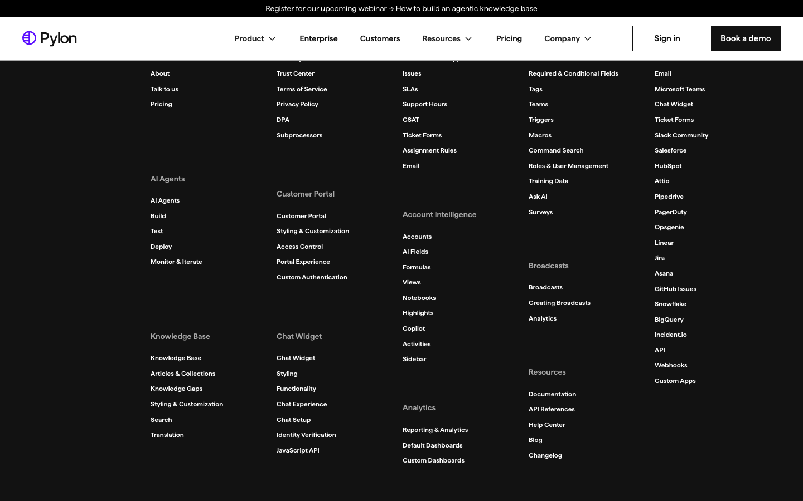

**观察：**

- ✅ 这一页清晰勾勒了产品的核心能力地图——全渠道聚合（Slack / Teams / WhatsApp / Email / Discord / 社区论坛汇入单一视图）+ AI 工单分流 + 知识库自动化 + 账户情报四大模块，读完能明确"它能为 B2B 支持团队做什么"：把分散在各 IM/邮件渠道的客户对话统一接管并用 AI 自动处理。
- ✅ AI 分流的工作机制讲得较具体：「AI 读取问题 → 识别正确团队 → 即时路由」，并点明解决的痛点是"消灭人工 triage 排队"；知识库模块也说明了输入输出（发现 KB 缺口 → 起草文章 → 在坐席搜索前就推送答案），属于有场景、有机制的功能描述。
- P1** 测点为"Login page"，但抓取到的实为营销首页，**完全未揭示登录/认证功能本身**——不支持判断它提供哪种登录方式（SSO / SAML / Google / 邮箱密码）、是否支持企业级身份接入。就登录功能这一测点而言，关键功能信息缺失。
- P2** 集成清单不完整：消息渠道列得清楚，但"账户情报"号称汇聚 support + success + **sales** 的上下文，却未说明如何对接 CRM / 工单 / 数据系统（如 Salesforce、HubSpot）。跨系统数据从何而来、怎么打通，是该能力成立的前提却未交代。
- P2** 几个 AI 能力只给了结论性承诺、缺工作机制：「Ask AI 任意关于客户的问题」「自动浮现流失/续约风险信号」——分别基于什么数据源、信号如何计算、准确率/可信度如何，均未说明；不同套餐间的功能差异（Pricing 在导航里）也未在本页体现。

### 📚 产品官方介绍（递归发现）（6 个测点）

**该模块覆盖页面**:

- `https://docs.usepylon.com/pylon-docs/getting-started/pylonboarding`
- `https://docs.usepylon.com/pylon-docs/ai-agents/overview`
- `https://docs.usepylon.com/pylon-docs/knowledge-base/overview`
- `https://docs.usepylon.com/pylon-docs/customer-portal/overview`
- `https://docs.usepylon.com/pylon-docs/chat-widget/overview`
- `https://docs.usepylon.com/pylon-docs/broadcasts/overview`

#### B1: 背景 D1: Pylonboarding

**URL:** https://docs.usepylon.com/pylon-docs/getting-started/pylonboarding

**观察：**

- ✅ **核心能力图谱清晰**：虽是欢迎页，但导航明确铺开了 Pylon 的能力面——全渠道支持（Slack / Email / Phone / Chat Widget）、Issue Views（工单视图）、SLAs、Knowledge Base（知识库）、Customer Portal（客户门户）、Account Intelligence（客户情报）、Product Intelligence（Feature Requests / Closing the Loop）、AI Agents（Build/Test/Deploy/Monitor）以及 Broadcasts、Reporting。可判定 Pylon 是一款面向 B2B 的客户支持 / 客户运营一体化平台。
- ✅ **Slack-first / 渠道连接是入口前提**："Getting Started" 里把 Slack Setup、Channel Configuration 放在最前，且原文明确要求"Before you jump into this, be sure you have checked the Implementation guide to make sure you have all of your channels connected"——说明产品以"先接渠道再上手"为核心 onboarding 逻辑，隐含 Slack / 多渠道为主战场。
- ✅ **目标用户与场景可推断**：从 Teams、Assignment Rules、CSAT、Support Hours、Roles & User Management、AI Issue QA 等模块看，目标用户是 B2B SaaS 的客户支持 / 客服团队，典型场景为多渠道工单受理、团队分派、SLA 履约与客户健康度跟踪。
- ✅ **产品独有术语线索丰富**：页面出现 "Pylonboarding"（Pylon + onboarding 的品牌化造词，指本引导流程）、"Issue Views"、"Account Intelligence"、"Product Intelligence / Closing the Loop"（功能反馈闭环）、"AI Issue QA"、"Broadcasts"、"MCP Connections / Pylon MCP"（接入 Model Context Protocol）等，体现其 AI + 客户情报的叙事方向。
- P3 **缺一句话产品定义**：欢迎语只说"help you get up and running with Pylon""get the most out of Pylon"，自始至终未正面回答"Pylon 是什么"。读者需靠导航自行拼凑，建议补一句明确的产品定位（如"客户支持平台"）。
- P3 **差异化主张与术语含义均未展开**：本页没有任何与同类产品（Zendesk / Intercom 等）的对比或独家叙事，上述独有术语也只是列表项、无释义；同时"AI Agents 全生命周期"、"MCP Connections"等亮点功能只露名字未解释——读者读完仍不清楚 Pylon 的核心差异化与这些概念的具体含义。

#### B2: 背景 D1: Overview

**URL:** https://docs.usepylon.com/pylon-docs/ai-agents/overview

**观察：**

- ✅ **产品/功能定义**：该页面是 Pylon 文档中的 "AI AGENTS — Overview"，它没有定义 Pylon 公司本身，而是定义其 AI Agent 能力——原文："AI Agents can deflect customer questions using content, gather internal context for your team, and take action."；并给出核心心智模型："You can think about AI Agents as an extension of your team, users who can be assigned to issues."（把 AI Agent 当作可被指派工单的"团队成员"）。
- ✅ **核心功能能力**：页面明确列出 AI Agent 的四类用途——① 基于知识库/文档内容回答并偏转（deflect）客户问题；② 向客户做初始信息收集；③ 为团队在内部收集上下文（context）；④ 端到端解决工单（end-to-end resolution of issue）。同时给出 Agent 生命周期四步：Build → Test → Deploy → Monitor & Iterate。
- ✅ **目标用户与场景**：面向客服/支持团队（从左侧导航 Omnichannel Support、SLAs、CSAT、Issues 可印证 Pylon 是 B2B 客户支持/客户运营平台）；典型场景是把可自动化的工作流逐步交给 Agent，原文强调"automate the pieces of your workflow you want to"。
- ✅ **差异化主张 / 核心叙事**："AI Agent = 团队的延伸、可被指派工单的'用户'"是该页最鲜明的叙事；并刻意强调这是一个迭代过程——"expect it to be an iterative process to identify the best workflows to automate, and to build your skills in instructing the agent."（既要优化要自动化的工作流，也要提升人对 Agent 的指令能力），淡化"开箱即全自动"的承诺。
- ✅ **关键术语 / 概念**：`AI Agents`（可被指派工单的虚拟团队成员）；`Issues`（Pylon 的工单/工作单元，Agent 的指派对象）；`deflect`（用内容自动偏转/拦截客户问题，减少人工介入）；`Build/Test/Deploy/Monitor & Iterate`（Agent 的标准构建—部署—迭代流程）。
- P3 **理解缺口**：① "take action" 究竟能执行哪些动作（调外部系统？改字段？触发集成？）页面完全未说明；② Agent 如何"build"、用什么配置/模型、是否需要训练数据，本页只给出口未展开（需进入 Build 子页）；③ 页面未定义 Pylon 公司一句话是什么、与竞品（Intercom/Zendesk AI 等）的具体差异，仅能靠导航推断；④ 偏转率、效果度量、计费方式等关键落地信息缺失。

#### B3: 背景 D1: Overview

**URL:** https://docs.usepylon.com/pylon-docs/knowledge-base/overview

**观察：**

- ✅ **产品定义（知识库模块）**：页面将 Knowledge Base 定义为 "A dedicated place to host your support content, including question-and-answer style articles, internal runbooks, and more -- all supercharged with AI and tightly integrated with the Pylon platform."（一个托管支持内容的专属空间，含问答式文章、内部 runbook 等，全部由 AI 强化、并与 Pylon 平台深度集成）。
- ✅ **母产品定位（据导航推断）**：从左侧导航可判断 Pylon 是一个 B2B 客户支持/客户运营平台，覆盖 Omnichannel Support、Slack Setup、AI Agents、Chat Widget、Customer Portal、Account Intelligence、Reporting 等模块；本页的 Knowledge Base 只是其中一个组成模块，而非独立产品。
- ✅ **核心功能能力（知识库）**：页面列出 8 个子能力——Articles & Collections（文章与合集）、Editor（编辑器）、Copilot、Templates（模板）、Collaboration（协作）、Styling & Customization、Custom Authentication（自定义认证）、Search（搜索）。
- ✅ **差异化主张**：页面在一句话定义中突出两点叙事——"supercharged with AI"（AI 强化）和 "tightly integrated with the Pylon platform"（与平台深度集成），即强调知识库不是孤立工具，而是支持平台的有机组成部分。
- P3 **目标用户与场景**：页面通过内容类型暗示了两类用途——"question-and-answer style articles"（面向客户的对外自助内容）与 "internal runbooks"（面向内部团队的运维手册），但未明确说明目标角色（客服团队？运维？终端客户？）或具体使用场景。
- P3 **关键术语与理解缺口**：页面只罗列了 Copilot、Collections、runbook 等术语名称却未给出任何解释——读者无从知道 AI 究竟如何"supercharged"、Copilot 具体做什么、知识库与 Customer Portal / Chat Widget / AI Agents 等模块如何协同。本页仅为目录式 Overview，实质信息需点进子页面才能获取。

#### B4: 背景 D1: Overview

**URL:** https://docs.usepylon.com/pylon-docs/customer-portal/overview

**观察：**

- ✅ **核心功能能力（从导航全貌提取）**：页面侧边栏揭示该产品（Pylon）是一个一体化 B2B 客户支持平台，核心模块包括 ①全渠道支持 Omnichannel Support（Slack / Phone / Email / Chat Widget）②AI Agents（Build / Test / Deploy / Monitor）③Knowledge Base 知识库 ④Customer Portal 客户门户 ⑤Account Intelligence 账户情报（Accounts / Notebooks / Tasks）。
- ✅ **本页一句话定义（Customer Portal）**：页面对客户门户的定义引用原文为 "A dedicated place for customers to view and submit tickets."（一个供客户查看并提交工单的专属空间），并列出四个子能力：Styling & Customization、Access Control、Portal Experience、Custom Authentication。
- ✅ **关键术语 / 概念**：页面出现多个产品独有概念——"Omnichannel Support"（跨 Slack/电话/邮件/聊天的统一支持）、"AI Agents"（可构建/部署/监控的 AI 客服代理）、"Account Intelligence"（账户级情报，含 Notebooks/Activities）、"Product Intelligence — Feature Requests / Closing the Loop"（收集功能请求并闭环反馈）、"Pylon MCP"（面向 AI 的 MCP 连接）、"Broadcasts"（批量触达）、"Pylonboarding"（自有的客户引导流程）。
- ✅ **目标用户与场景**：从模块组合看，目标用户是面向企业客户的 B2B 支持/客户成功团队（强调 Slack 协同、SLA、CSAT、Assignment Rules、Teams、Roles），而本页 Customer Portal 的直接服务对象是终端客户——让其自助查看与提交工单。
- P3 **缺少产品级一句话定义**：本页标题虽为 "Overview"，但实际只覆盖了"客户门户"这一个子模块，全篇没有给出 Pylon 整个产品的一句话定位（如"什么是 Pylon、为谁解决什么问题"），产品价值主张需到 Introduction 页才能获得。
- P3 **理解缺口**：读完仍不清楚——①客户门户与 Chat Widget、Knowledge Base 三者在客户侧体验如何衔接/区分；②"view and submit tickets" 之外门户是否支持知识库自助检索、对话历史等；③差异化叙事缺失，本页未说明相较 Zendesk/Intercom 等同类产品的独家主张（Slack-first、AI Agents、MCP 等优势仅能从导航推断，未在文案中点明）。

#### B5: 背景 D1: Overview

**URL:** https://docs.usepylon.com/pylon-docs/chat-widget/overview

**观察：**

- ✅ **核心定义（仅限组件层面）**：页面把 Chat Widget 定义为"Embed chat in your dashboard to allow users to ask for help where they need it"，并补充"Embed the Chat Widget into your application so your customers can talk to you directly from the context of your product"——即在产品界面内嵌入式客服入口，让用户在使用上下文中就地求助。
- ✅ **核心功能能力（页面明列 6 项）**：① 带自动化工作流与 AI 回复的在线聊天（Live chat with automated workflows and AI responses）；② 内嵌知识库搜索（Embedded knowledge base search）；③ 内嵌表单与 quick links；④ 颜色/品牌/工作流完全可定制；⑤ 支持多个相互独立、品牌与工作流各异的聊天窗口；⑥ 提供 JavaScript API，以代码方式构建工作流并定制行为。
- ✅ **目标用户与场景**：面向 B2B SaaS 的产品/客服团队，典型场景是把客服嵌入自家应用，让客户"from the context of your product"直接发起对话，而非跳转外部支持渠道；JS API 与 Mobile SDKs（侧栏）暗示也覆盖有研发能力的团队做深度集成。
- P3 **产品整体定义缺失**：本页只讲 Chat Widget 这一个组件，未给出 Pylon（公司/平台）本身的一句话定义；产品名"Pylon"仅在侧栏（Pylonboarding、Pylon MCP）露出，正文从未点名，读者无法仅凭本页判断 Pylon 是什么、解决什么整体问题。
- P3 **差异化叙事偏弱**：可被视为卖点的差异点散落在功能清单里（"产品上下文内求助"、"多套独立品牌的并行窗口"、"JS API 代码级定制"），但页面未与同类嵌入式客服/聊天产品做任何对比，也没有提出明确的独家主张或品牌核心叙事。
- P3 **理解缺口**：侧栏显示 Pylon 实为覆盖 Omnichannel Support、Slack Setup、AI Agents、Knowledge Base、Customer Portal、Account/Product Intelligence 的大平台，但本页未说明 Chat Widget 与这些模块（尤其 Slack-first 定位）如何衔接、是否需依赖其他模块，以及与"AI Agents"中 AI 能力的关系——读完仍不清楚该 Widget 在整体产品中的位置。

#### B6: 背景 D1: Overview

**URL:** https://docs.usepylon.com/pylon-docs/broadcasts/overview

**观察：**

- ✅ **关键术语「Broadcast（广播）」定义清晰**：页面用原文给出明确解释——"Think of broadcasts as a marketing campaign or announcement. Build an audience and send out a message in bulk automatically to many Slack channels and email addresses at once." 即把广播类比为"营销活动/公告"，本质是面向受众批量自动群发消息。
- ✅ **核心能力聚焦"主动触达 + 全链路互动追踪"**：页面提到广播可（1）一次性群发到大量 **Slack 频道**与**邮件地址**；（2）发送后由 Pylon **追踪所有互动**，原文列出 "reactions, replies, and link clicks"（表情回应、回复、链接点击）。这是该页讲到的两项最实在的能力。
- ✅ **典型使用场景列举具体**：页面明确给出四类广播用途——新功能发布（New feature releases）、即将到来的活动如网络研讨会/线下会议（webinars or conferences）、时效性情况如故障或计划停机（outages or scheduled downtime）、以及收集产品反馈/NPS 的调查问卷（Surveys / NPS）。目标用户隐含为面向 B2B 客户的客户成功 / 支持团队。
- ✅ **差异化叙事：Slack 与邮件双渠道的统一主动群发**：与传统纯邮件营销工具不同，该页突出"Slack 频道 + 邮件"可在一处批量自动发送，呼应了 Pylon 以 Slack 为核心的客户支持定位（左侧导航中 Slack Setup、Channel Configuration、Omnichannel 等可佐证）。
- P3 **本页并未定义产品/公司本身，只定义了一个功能模块**：用户读完只知道"Broadcasts 是什么"，但 **Pylon 整体是什么产品、面向谁、一句话价值主张**全靠左侧导航推断（涵盖 Knowledge Base、AI Agents、Customer Portal、Chat Widget、Account/Product Intelligence、Integrations 等，指向一个"B2B 客户支持 / 客户运营平台"）。建议补一句产品级定义，本页无原文支撑。
- P3 **关键操作与边界缺口**：页面没说明"如何构建受众（Build an audience）"的具体维度（按账户？标签？自定义字段？）、Slack 与邮件渠道是否同时发送还是二选一、是否有发送频率/合规限制，以及句末 "link clicks across." 表述不完整（across 后内容缺失），读者无法判断追踪覆盖范围。

### 📌 其他（10 个测点）

**该模块覆盖页面**:

- `https://www.usepylon.com/this-page-should-not-exist-product-audit-test-1234`
- `https://www.usepylon.com/case-study`
- `https://www.usepylon.com/case-study/sardine`
- `https://www.usepylon.com/omnichannel`
- `https://www.usepylon.com/events/build-agentic-knowledge-base?utm_content=hero_banner_knowledge_base`
- `https://www.usepylon.com/account-intelligence`
- `https://www.usepylon.com/enterprise`
- `https://www.usepylon.com/changelog`
- `https://www.usepylon.com/events`
- `https://www.usepylon.com/videos`

#### C8: 404 error handling

**URL:** https://www.usepylon.com/this-page-should-not-exist-product-audit-test-1234

**观察：**

- ✅ 导航栏间接揭示了产品的功能信息架构：Product（产品能力）、Customers（客户案例）、Resources（资源/文档）、Pricing（定价分层）、Company，加上 Sign in 与 Book a Demo 两个入口，可推断这是一个面向 B2B 的 SaaS 产品（有专人演示 + 账号登录），但 404 页本身并未陈述任何具体功能。
- P3 404 页未提供任何**功能性恢复路径**——没有指向核心功能页（产品概览 / 定价 / 资源库）的推荐链接或站内搜索，用户撞到死链后只能依赖顶部导航自行摸索，错失了把误入流量重新导向产品价值内容的机会。
- P2 页面对"产品做什么"零信息输出：没有一句话价值主张、功能模块入口或典型场景引导。对从外部链接（搜索引擎、过期分享链接）首次到达此页的潜在用户，无法判断该产品解决什么问题、是否值得继续探索。
- 用户读完这一页**完全无法理解"这个产品能为我做什么"**——这是 404 页的固有局限，属预期内；从功能审计角度，它仅证明站点存在内容迁移/失效链接，不构成对产品能力的有效说明。
- 功能信息缺口：未暴露产品的输入/输出、集成清单、适用场景等任何关键功能细节（符合 404 页定位）；若要在错误页保留少量转化能力，可补充指向"热门功能"或"产品总览"的引导，但这取决于产品方策略，而非此页文本能评判的范围。

#### S4: Customer / logo wall

**URL:** https://www.usepylon.com/case-study

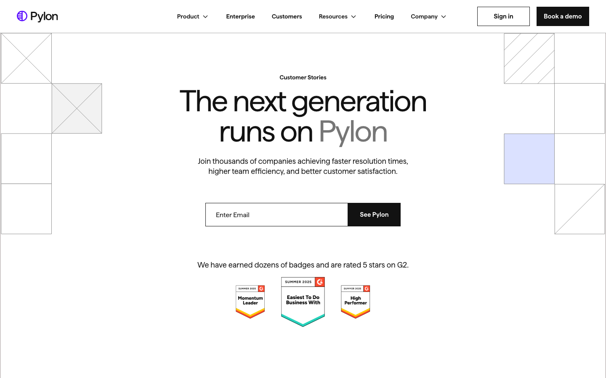

**观察：**

- ✅ 案例标题本身构成了一份隐性的"功能/能力地图"：AI agents、runbooks、Account Intelligence、AI-powered summaries、Slack Connect 渠道、in-app chat、"AI-powered command center" 等关键词反复出现，读者即便不点进案例，也能拼出产品的核心能力轮廓——一个面向 B2B 的 AI 驱动支持平台，而非单纯的工单工具。
- ✅ 竞品替换叙事极强地界定了产品定位：标题明确写出替换 Zendesk、Front、Salesforce Service Cloud、Intercom、Freshdesk、Catalyst，传递出"这是一个可整体替代传统 helpdesk 的完整平台"的功能边界；Together AI/Finch 的"consolidated support and success into one platform / unified platform"进一步揭示产品功能范围覆盖 support + customer success + account management 的统一化（command center）。
- P2 功能"点名"但不"解释"：Account Intelligence、runbooks、AI agents 这些被反复提及的能力，在本页只有名称没有机制说明——输入是什么、如何接入数据/CRM、输出形态、适用场景一概未展开。用户必须逐个点开 Case Study 才能理解功能怎么运作，本页只完成"有哪些能力"的索引,未完成"能力如何工作"。
- P2 量化成果与具体功能未建立对应关系：4x support volume、90% 复杂度下降、25% 团队产能、300+ Slack 渠道、200M+ calls 等数字很有说服力,但页面没有说明"哪个功能带来了哪个结果"(例如 300+ Slack 渠道靠的是 Slack Connect 管理能力,200M calls 靠 AI agents),读者难以反推"我用哪个功能能得到类似收益"。
- P3 缺少按能力/场景的归类导航:案例以混排清单呈现,没有按行业、迁移来源、或核心功能(AI agents / 多渠道 / Account Intelligence)分组。对想验证"我的场景(如纯 Slack Connect 支持 / 从 Zendesk 迁移)是否适配"的用户,需要自行在长列表里筛选,降低了"这个产品能为我做什么"的判断效率。

#### S5: Case studies / Testimonials

**URL:** https://www.usepylon.com/case-study/sardine

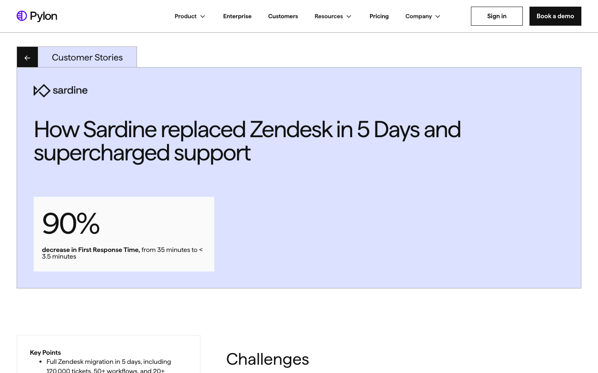

**观察：**

- ✅ 页面清晰传达了 Pylon 的产品定位与能力边界：一个可**整体替代 Zendesk** 的客服平台，支持工单 + Slack 多渠道、同时服务 B2B 企业客户（FIS / GoDaddy / Coinbase）与 B2C 消费者；并用"5 天迁移 12 万工单 + 50+ 工作流 + 20+ 外部自动化"把"迁移能力"量化得很具体，读者能立刻判断这是企业级客服系统而非轻量工具。
- P1** 全篇用结果指标（首响下降 90%、6x 增长、人工工时降 35%）证明价值，却几乎不说明"靠什么功能实现"。首响从 35 分钟降到 3.5 分钟，究竟来自 AI 自动回复、智能路由还是渠道整合？标题写"supercharged support"，但正文没有任何 AI / 自动化 / 分派机制的描述——读者无法判断这些成效是否能复制到自己场景，关键功能机制缺失。
- P2** "50+ workflows"和"20+ external automations"作为迁移卖点反复出现，但页面从未定义 Pylon 的"workflow"是什么、如何配置、触发条件与输入输出为何——把核心功能名词当作读者已知概念使用，功能细节空缺。
- P2** 提到 Sardine 用 Slack 与 B2B 客户沟通，暗示 Pylon 具备 **Slack 原生支持**这一差异化能力，但完全没交代集成机制（是 Slack Connect 共享频道？消息是否双向同步成工单？SLA 是否在 Slack 内计时？）——最可能的卖点反而说得最模糊。
- P2** 集成与适用场景清单不完整：除 Zendesk / Slack / Zapier 外没有完整集成列表，也未说明针对 B2C 大体量场景具体提供哪些能力（自助门户？知识库？AI 工单分流？）——读者难以判断 Pylon 是否覆盖自己的渠道栈与客群结构。

#### S14: Customer support channels

**URL:** https://www.usepylon.com/omnichannel

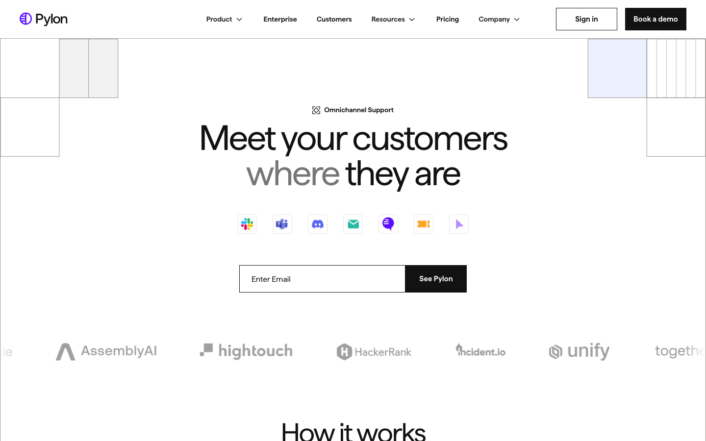

**观察：**

- ✅ 页面清晰勾勒出 Pylon 的核心定位——**全渠道支持聚合层**:把 Slack Connect、Microsoft Teams、Discord、Email、Chat Widget、Ticket Forms 六类入口的客户对话统一收口进一个支持工作流。"Meet your customers where they are" + "支持团队无需待在 Slack 频道里/无需进入 Teams"精准点出 B2B SaaS"在共享渠道做客服却无法追踪、分配、归档"的真实痛点,读者能立刻 get 到"这产品能为我做什么"。
- ✅ 部分功能的输入/场景说明到位:Chat Widget 明确列出可携带的上下文字段(Page URL、Timezone、User Email)用于加速定位;Ticket Forms 给出三种填写路径(Customer Portal / 独立表单 / 通过 API 自建表单);Proactive Tickets 区分了"代客户建单"与"纯内部追踪单"两种用法——这几处把使用场景讲清楚了。
- P1 最关键的工作机制缺失**:全篇最大卖点是"无需进入 Slack/Teams 频道即可追踪全部对话",但完全没说**怎么实现**——是装 bot、走官方 API、还是管理员授权同步?更关键的是**是否双向**:客服能否在 Pylon 内回复并把消息同步回客户侧 Slack/Teams,还是仅只读追踪?接入成本、权限边界、隐私范围读者全无法判断,直接影响选型决策。
- P2 各渠道能力深度不一致且未解释**:Slack/Teams 写的是"track *all* conversations",Discord 却只写"track *threads* in a #help channel",Email 是"integrate inboxes"。这究竟是同级全功能,还是受限子集?各渠道是否都支持回复、分配规则、SLA、CSAT?页面用并列卡片平铺,容易让人误以为六个渠道能力对等,实则很可能不是。
- P2 渠道量级与配置边界信息缺失**:能连接多少个 Slack/Teams 频道、是否支持多 workspace/多租户、Email 各别名(support@ / legal@ / success@)能否独立路由到不同团队、Chat Widget 如何与 Knowledge Base / AI Agent 衔接,均未提及。读者无法评估 Pylon 是否覆盖得了自己实际的渠道拓扑与团队结构。

#### E1: 探索: How to build an agentic knowledge base

**URL:** https://www.usepylon.com/events/build-agentic-knowledge-base?utm_content=hero_banner_knowledge_base

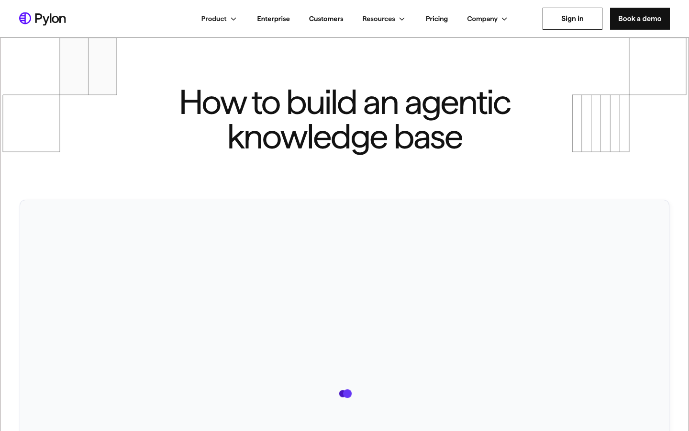

**观察：**

- 页面导航揭示了 Pylon 把 AI Agent 当作有完整生命周期的产品来管理**：菜单清晰列出 Build → Test → Deploy → Monitor & Iterate 四个阶段，配合 Knowledge Base（Articles & Collections / Knowledge Gaps / Search / Translation）。这暗示"agentic knowledge base"= 知识库内容 + 可构建/测试/部署/迭代的 AI Agent，二者组合成自动答复能力。✅ 功能版图本身表达清楚，能看出产品不止是静态文档库。
- "Knowledge Gaps"（知识缺口）是值得注意的差异化功能信号**：它暗示系统能反向检测"用户问了但知识库答不上来"的内容空缺，这正是 agentic KB 区别于传统帮助中心的核心机制。但页面正文文本未捕获到任何对该机制的解释（如何检测、如何提示补全），无法判断其工作原理。**P2 缺口检测机制只见菜单名、无功能说明。**
- 标题承诺"How to build"，但抓取到的页面文本几乎全是站点导航与页脚，没有任何实际的搭建步骤/工作流内容**：读者看不到关键输入（哪些内容源喂入知识库、是否支持网页/PDF/工单历史导入）、检索机制(agent 如何调用 KB)、以及"agentic"具体指代什么。**P1 关键功能描述（如何真正构建 agentic 知识库的步骤与机制）在本页内容中缺失，读完无法理解"这个产品到底怎么帮我建知识库"。**
- 多个 AI 能力入口并存但关系不清**：导航同时出现 Knowledge Base、Ask AI、Copilot、Training Data、AI Agents，彼此如何分工/串联（例如 Training Data 是否就是喂给 Agent 的语料、Ask AI 与 AI Agent 答复是否同一引擎）未作说明。**P2 多个 AI 功能模块的协作关系与边界未交代。**
- 集成清单很长（Slack / Salesforce / HubSpot / Snowflake / BigQuery / Zendesk 类渠道等），但未区分"知识来源型"与"支持渠道型"集成**：对"建 agentic 知识库"这个主题而言，用户最关心的是哪些集成能作为知识内容源（如 Snowflake/BigQuery 是否可让 Agent 查询结构化数据）——页面未明确。**P3 集成对知识库构建的具体作用未分类说明。**

#### E4: 探索: Account IntelligenceProactively manage a

**URL:** https://www.usepylon.com/account-intelligence

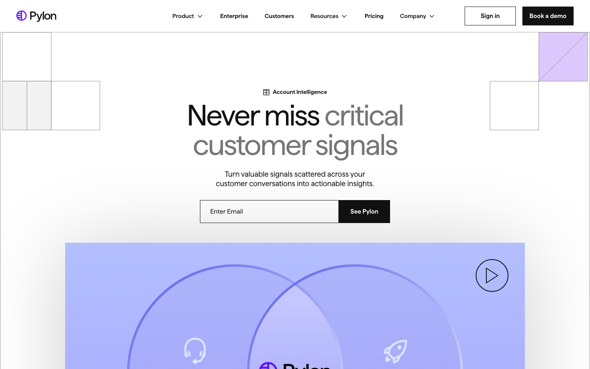

**观察：**

- ✅ 页面清晰拆解了 Account Intelligence 的三大能力支柱——**Prioritize（账户优先级）/ Context（统一账户视图）/ Automate（playbook 自动化）**，并对应到 CS/客户成功团队的核心工作流：识别可上卖(upsell)/有流失风险(churn)的客户 → 聚合多源对话形成单一账户视图 → 基于信号触发自动化任务，产品"做什么"的主线表达完整。
- ✅ **输入与输出的链路说明较具体**：输入端明确点出数据来自通话(calls)、工单(tickets)、日历、通话录音器(call recorders)；输出端给出"AI 把非结构化账户数据转成结构化字段(AI Fields)""AI 生成账户摘要""可用 Ask AI 深挖任意账户""可构建账户列表"。读者能理解这是一个把零散客户信号沉淀为结构化资产的模块。
- P1 关键集成与 CRM 关系未说明**：页面反复强调"原生集成通话录音器/日历/工单",但**没有任何具体集成清单**(不知支持 Gong/Fireflies/Zoom?)，更关键的是 Account Intelligence 作为账户管理能力，**完全没提与 Salesforce/HubSpot 等 CRM 的关系**——是替代 CRM、双向同步、还是仅做信号叠加层？这直接决定目标用户能否落地，属于关键功能缺口。
- P2 核心智能能力的工作机制是黑盒**："Monitor health scores, churn risk"和"AI 转结构化字段"是卖点，但**未说明 health score / churn risk 如何计算**（规则配置、用户自定义公式、还是 AI 模型预测？），也没说 AI Fields 的准确性/可纠错性。导航里出现的 Formulas、Notebooks、Copilot、Highlights 等子能力在本页均未展开，读者无法判断智能化的深浅。
- P2 触发自动化的能力边界不清**：Automate 部分给了"deal advance / ticket close / call wrap up"等触发器示例和"自动派单、提醒、项目里程碑"等动作，但**未说明可触发条件的完整范围、是否支持自定义条件/分支逻辑**，也没演示一个端到端 playbook 实例，读者难以评估其自动化能力是简单提醒还是完整工作流引擎。

#### E5: 探索: Enterprise

**URL:** https://www.usepylon.com/enterprise

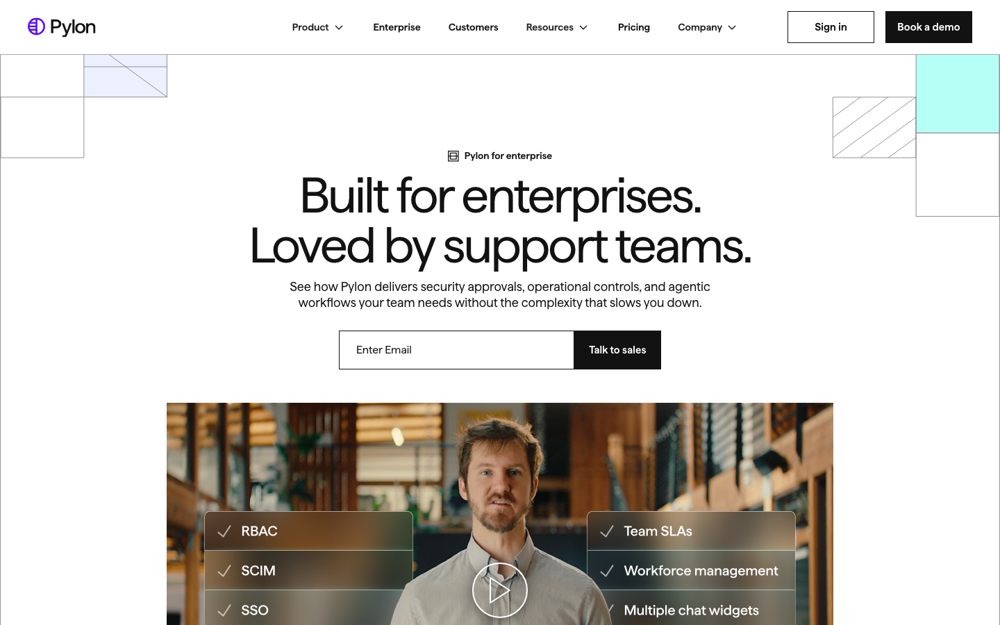

**观察：**

- ✅ 安全合规能力枚举清晰具体**：页面没有停留在"企业级安全"这种空话，而是列出可核验的功能点——SOC 2 Type II / GDPR / HIPAA（含 BAA）、SSO + SCIM 身份同步、审计日志、带自定义角色与 PII 脱敏的细粒度 RBAC。这组信息直接回答了企业采购/安全评审最关心的"能不能过审计"，读者能快速判断产品是否满足合规门槛。
- ✅ 用真实客户数字量化了 AI 能力的产品价值**：AssemblyAI 自动解决 50% 合格工单、Builder.io 自动化复杂度降低 90%、Sardine 用同等团队支撑 6 倍业务量——这些把"AI built-in 而非 bolted-on"的卖点落到了可感知的产出上，比单纯说"我们有 AI"有说服力，能让读者理解"产品能为我省多少人力"。
- P1 核心 AI agent 的工作机制完全没说明**：页面提到"专门化的 AI agents 与 assistants 协同完成 resolve / route / triage"，但完全没有解释这些 agent 如何配置、依据什么知识库或规则做决策、是否能接入企业自有数据/CRM、人工如何介入兜底。同样"AssemblyAI 自动解决 50% eligible tickets"中"eligible（合格）"的判定标准也未定义。这是企业评估自动化能力时最关键的功能点，缺失会让人无法判断这套 AI 是否适配自己的场景。
- P2 集成与数据同步只给了类目、缺少清单**："data warehouse sync""native integrations with your stack""branded customer portals"都只是概括性描述，没有列出具体支持哪些数据仓库（Snowflake / BigQuery / Redshift？）、有哪些原生集成（Slack / Salesforce / Jira？）。企业读者无法据此判断产品能否嵌入自己现有技术栈，需要额外联系销售才能确认。
- P2 "workforce management / 容量规划""企业级分析报表"功能边界模糊**：Team SLAs 之外的 workforce management 究竟包含排班、负载预测还是仅仅是统计面板？enterprise analytics 能出哪些维度的报表、能否自定义？这些是支持团队运营管理的实操功能，页面只给了名词，读者读完仍不清楚具体能做什么。

#### E6: 探索: Changelog

**URL:** https://www.usepylon.com/changelog

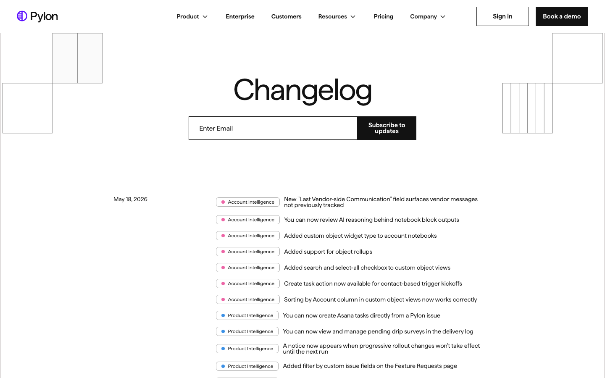

**观察：**

- ✅ **三大能力支柱清晰可辨**：Changelog 用 "Account Intelligence / Product Intelligence / Support System" 三个固定模块标签归类更新，让人读完即可推断 Pylon 不是单一工单工具，而是覆盖「客户支持（工单/邮件/门户）+ 账户情报（account notebooks、自定义对象、rollup）+ 产品情报（功能需求、survey、issue 分析）」的 B2B 客户运营三模块平台，能力边界传达有力。
- P2 集成能力只见碎片、不见全貌**：条目里散落 Asana（从 Pylon issue 建 Asana 任务）、Microsoft Teams（从 Teams 聊天主动建 issue）、Google Groups（转发邮件自动建 issue）等集成，揭示了产品深度嵌入 B2B 协作链路；但 Changelog 只反映增量改动，读者无法据此判断完整的集成清单、哪些是原生 vs 第三方、以及核心 CRM/IM 接入范围。
- P1 AI 能力被反复引用却未解释工作机制**："You can now review AI reasoning behind notebook block outputs" 暗示 account notebook 的 block 输出是 AI 生成的，"drip surveys""progressive rollout" 等也指向自动化/智能编排能力；但页面完全没说明这些 AI 究竟基于什么输入、生成什么洞察、如何驱动账户情报，新访客无法理解 Pylon 的 AI 到底"能为我做什么"。
- ✅ 精准的 B2B 支持痛点暴露了真实工作流深度**：诸如 "Internal Notes 与 Client Thread 各自独立保存草稿""门户回复时可控制终端用户能否编辑 CC""On hold 状态在门户单独展示""Last Vendor-side Communication 字段补足未被追踪的厂商消息" 等高度细颗粒度的修复，反向说明产品在 CC 管理、SLA、门户权限、双线程沟通等 B2B 支持场景上做得相当细，功能成熟度可信。
- P3 缺少功能与套餐/角色的对应说明**：诸如 "admins control whether end users can edit CCs""configure the SLA tab" 等条目涉及不同角色（admin / end user / agent）和疑似分层能力，但 Changelog 未交代这些功能归属哪个套餐或权限层级，潜在用户难以判断自己能否用到这些新功能。

#### E7: 探索: Events

**URL:** https://www.usepylon.com/events

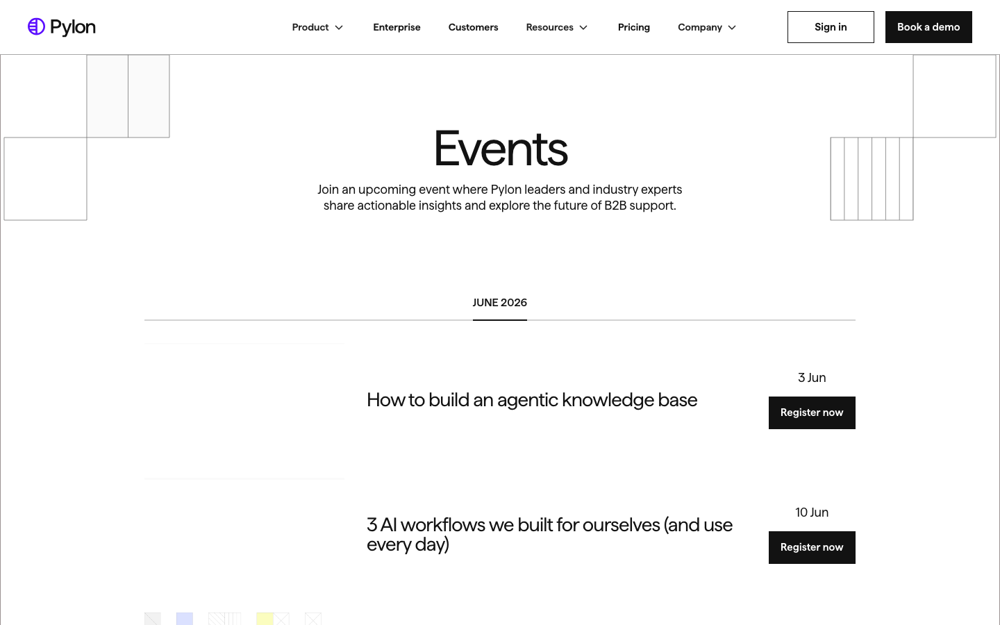

**观察：**

- ✅ 页脚站点地图是本页信息密度最高的功能线索**：虽然这是一个活动列表页，但页脚完整暴露了 Pylon 的产品模块全景——AI Agents 有完整生命周期（Build / Test / Deploy / Monitor & Iterate）、Account Intelligence（AI Fields / Formulas / Notebooks / Copilot / Highlights）、Omnichannel Support（Issues / SLAs / CSAT / Assignment Rules）、Knowledge Base、Customer Portal、Chat Widget、Analytics 与 Platform（Triggers / Macros / Command Search / Roles / Training Data / Ask AI / Surveys）。仅从这一页就能拼出"Pylon 是一个面向 B2B 的 AI 原生客户支持平台"的能力骨架。
- ✅ 活动主题间接揭示了关键功能与渠道覆盖**：过往活动标题点明了具体能力——"Introducing phone calls and SMS, natively in Pylon"（原生电话/短信）、"Scaling customer support on Telegram and Discord"、"How to do Slack support at scale"、"How to build a customer 360 using AI"、"build an agentic knowledge base"。这些等于用真实用例说明了 Pylon 的全渠道（Slack/Telegram/Discord/电话/SMS）与 AI 工作流能力。
- ✅ 强烈的竞品替代定位清晰可读**：多场活动反复强调"You're ready to leave Zendesk. Now what?""Why B2B Teams Are Leaving Zendesk"，明确把 Pylon 定位为面向 B2B 团队的 Zendesk 替代方案，并把"AI 如何被成功团队实际使用"作为差异化卖点。读者能快速理解产品针对的是谁、要取代什么。
- P2 活动页本身只有标题与日期，不解释功能机制**：每条活动仅"标题 + 日期 + Register/View"，没有摘要、讲者、面向人群或会涉及哪些功能模块的说明。用户无法判断"3 AI workflows we built"或"agentic knowledge base"具体讲什么、是否与自己相关，功能信息停留在主题词层面，无法回答"这个产品能为我做什么"。
- P3 暴露了功能名词但无任何解释入口**：页脚出现 "AI Fields"、"Formulas"、"Notebooks"、"Training Data"、"Knowledge Gaps"、"Identity Verification" 等高信息量功能名，但在本页没有一句话定义或链接说明（如 Knowledge Gaps 是自动发现知识库缺口、AI Fields 如何生成）。这些是用户最想了解、却在本页完全缺失解释的功能关键点。

#### E8: 探索: Videos

**URL:** https://www.usepylon.com/videos

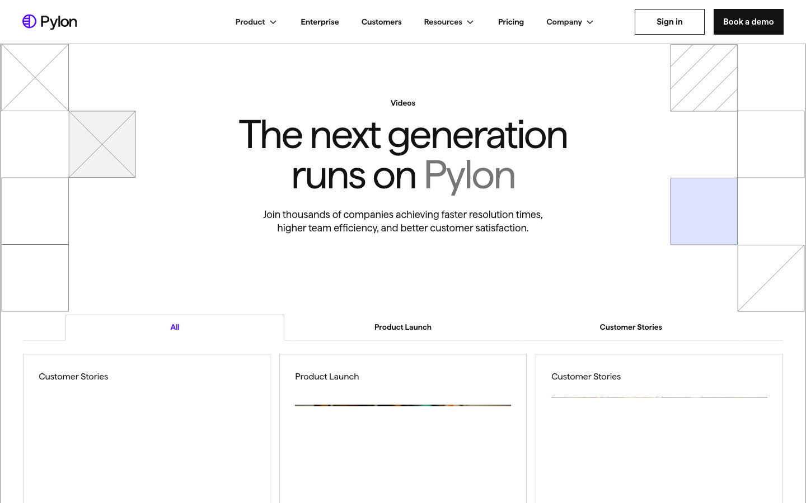

**观察：**

- ✅ 视频清单实质上构成了一份**产品能力全景图**：从标题即可识别出 Pylon 是一个面向 B2B/售后的客服平台，核心能力高度集中在 AI 自动化——AI Agents、Account Intelligence（账户情报）、Issue Anomaly Detection（问题异常检测）、Product Intelligence、Skills-based Routing（技能路由）、AI Ticket QA、AI Knowledge Assistants、Live Translation、native phone support，外加底部映射出的 Omnichannel Support、Customer Portal、Chat Widget、Knowledge Base、SLAs/CSAT 等支撑模块，覆盖面清晰且完整。
- ✅ **Customer Stories 用量化场景说清了产品解决什么问题**：Wispr Flow 从 Front 迁移后用 AI 化运营扛住 4x 工单量、CodeRabbit 实现 99% 更快解决 + 10x 工单量、Together AI 响应速度提升 5x 并改善 GRR（营收留存）。这些直接传达了价值主张——**不靠等比例扩招人力即可放大支持规模、加快解决、保住客户留存**，目标客群指向高速增长的初创与企业级售后团队。
- P2 视频页只有标题、没有任何功能说明**：页面对每条视频既无简介、无时长、也无摘要文字。用户无法仅凭"Issue Anomaly Detection""Account Web Research""Account Intelligence"这类名词理解其**实际做什么、输入输出是什么、如何运作**——页面只索引了功能名称，却零机制解释，必须逐个点开观看才能获知能力细节。
- P2 AI Agents 的核心工作流被提及但未在本页展开**：底部信息架构显示 AI Agents 含 Build → Test → Deploy → Monitor & Iterate 的完整生命周期（这是相当有信息量的产品机制），但视频列表页只给了"Introducing AI Agents""How to build an AI Runbook"等标题，未说明这套构建/测试/部署/迭代闭环具体如何运转、与人工坐席如何协作。
- P3 集成与功能成熟度信息缺口**：页面仅透露 Clay（联系人 enrichment）和 Discord 两个集成线索，缺少 CRM/Slack/Jira 等完整集成清单；同时大量功能统一标为"Product Launch"却**无发布时间或 GA/Beta 状态**，用户无法判断哪些是已稳定可用、哪些是新近上线尚在演进的能力。

### ⚠️ 未找到的测点（2 个测点）

**该模块覆盖页面**:

- `https://www.usepylon.com/`

#### S1: Features / Product page

**URL:** https://www.usepylon.com/
**观察：**

- [Link not found] 该模板期望的链接（features|product|product tour|功能|产品）在 https://www.usepylon.com/ 上未找到 — 可能产品用了不同的措辞或这个功能不存在。 已跳过截图与 LLM 解读以避免重复首页快照。

#### S2: Use cases / Industry

**URL:** https://www.usepylon.com/
**观察：**

- [Link not found] 该模板期望的链接（use case|industries|solutions|应用场景|行业）在 https://www.usepylon.com/ 上未找到 — 可能产品用了不同的措辞或这个功能不存在。 已跳过截图与 LLM 解读以避免重复首页快照。

---

## 4. 第三方社区反馈

#### ⚠️ 未找到显著社区讨论

WebSearch 在 Reddit / Product Hunt / Hacker News / G2 等平台未找到 `chromewebdata` 的显著用户讨论。本节内容为空——不代表产品好或差，仅说明社区讨论数据稀缺。

---

## 5. 从访客到注册的转化路径

⚠️ 本节 (§5 从访客到注册的转化路径) LLM 调用失败 — 可能是超时 / 会话限额 / 服务异常。
建议 session 重置后单独重跑 synthesis_pass，本节将自动补齐。
